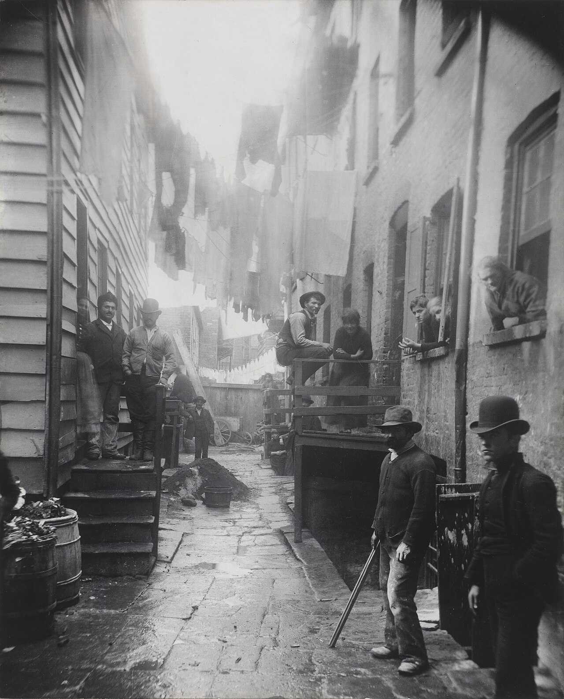

# 序言

> 这不是一本教你怎样使用相机的书。它更关心的，是在按下快门之前和之后，一个拍照的人怎样做出那一连串旁人看不见的判断。

---

摄影里最难的部分，常常不在参数。光圈、快门、感光度这些知识固然要紧，但它们终究可以从说明书和教程里学来；真正困住人的，往往是走进一个现场之后的那些问题——眼前这一幕值不值得停下来，是该在原地再等上几分钟，还是该承认它无论如何也不会成立，转身走开。说明书能把每一个按钮的位置交代得清清楚楚，却从来不会告诉你，什么时候应该举起相机，什么时候又该把它放下。

这本书最初是写给几年前的我自己的，如今也写给所有停在同一个地方的人：相机已经用得熟练，参数表看得明白，器材也添置得差不多了，照片却始终停在一个不上不下的位置。你清楚自己并非不会拍，也同样清楚，距离稳定地拍出让自己满意的照片，中间还隔着一段说不清楚的路。

---

*Jacob Riis, "Bandits' Roost", 1888。Riis 是丹麦移民、纽约警察局的记者。他用早期的镁粉闪光摄影，深夜走进纽约下东区最危险的巷子，拍下贫民窟里的人。这张照片拍的是 Mulberry Street 的一个拐角，几个人站在阴影里盯着镜头。Riis 拍它不是为了让画面好看，而是为了把那里的生活状况摆到纽约市政府面前。1890 年他出版《How the Other Half Lives》，直接推动了此后纽约的住房法改革。摄影在这里不只是观看，也成了证据。 (Wikimedia Commons, 公有领域)*

---

困在中间的人，处境大多相似。下面这几种感觉，你未必样样都有，多半也遇到过其中几种。

技术上挑不出毛病，照片看上去却仍然像游客的纪念。曝光是准的，构图也规规矩矩地照着三分法安排过，可是导入 Lightroom 一张一张翻看，还是不得不承认，它们与旅行社宣传册上的图片并没有多大分别。它们完整、清楚，也挑不出什么硬伤，只是看过一遍之后，便再没有理由回头看第二遍。

看 Magnum 摄影师的画册时，你知道那些照片好，甚至能对着 Alex Webb 拍的一个墨西哥街角看上十分钟。可是合上画册，拿起自己的相机，心里剩下的只有一句“好像哪里缺了点什么”。那张照片究竟凭什么成立，下一次出门应该练光线、练构图，还是练等待，一概说不上来。

器材上的学问倒是越积越多。35mm f/1.4 与 50mm f/1.2 哪一支更锐、哪一支色散更低，可以讲得头头是道；一张照片的 EXIF，每一项都看得懂。可是走在街上，眼看一个画面正在形成，这些知识并不会替你决定该用哪支镜头，也不会告诉你要不要再往前走两步。

于是出门拍上一整天，按下几百次快门，回家挑出来给人看的，仍旧是那两三张；余下的两百多张躺进硬盘，多半从此不会再被打开。也许你还换过几套系统，从 Sony 到 Fujifilm，又从 Fujifilm 到 Leica，每一次都以为这一回会有所不同，几个月过去，又回到原来的地方：机器越用越熟，照片却没有真正往前走。

这些问题看上去都与技术有关，根子却多半在判断上。你已经能把画面拍清楚，却还不知道哪些东西值得清楚，哪些应该沉入阴影、化进虚焦、裁出画外，甚至从一开始就不必去拍。这样的事很难从说明书里学到。你可以把 Zone System 背得烂熟，知道 0 区是不留细节的死黑，5 区是 18% 的中灰，可是下一次到海边拍日落，照样可能凭着手感去拨曝光补偿，回到家里才发现差了一档。

这本书想做的，就是把这些平日看不见的判断，一件一件摊开来讲。它不能保证你读完之后立刻拍得更好，但至少可以让你知道，力气应该花在什么地方。

---

在往下读之前，得先说清楚这本书不适合谁，免得你花了时间，才发现拿错了书。

如果你还说不清光圈、快门、感光度各自是什么，这本书会让你处处受阻，因为它从第一页起就假定你熟悉这些概念。这种情形下，不妨先找一本真正的入门书；或者更直接一些，把相机调到手动挡，对着同一个场景把三个参数各自拨动几圈，亲眼看它们如何改变画面。花上两个周末，等这些操作不再需要费神，再回到这里也不迟。

另一头，如果你已经办过展览、出过画册，或者本来就以摄影为生，这本书对你多半太浅了，其中的判断，你想必早已化为本能。它真正的读者，是夹在两头之间的那一群人：器材用得顺手，参数了然于心，面对自己的照片，却说不出哪一张好，好在何处，下一步又该练什么。

---

有几个常见的念头，想请你先放到一边。它们都算不上过错，只是任由它们牵着走，路会绕得很远。

先说器材。一年之内换上几套系统，与其说是摄影练习，不如说是一种消费习惯。每换一次，总要花一两个月去重新熟悉按钮、菜单、色彩与手感；这个过程自有乐趣，新机器也确实令人更愿意出门，只是它并不会改善你的观看。很多时候，真正需要处理的不是机身和镜头，而是你为什么总在同一类画面前停步，又为什么总在同一类照片上犹豫不决。

再说清晰。把锐度、对比和清晰度统统推到顶，并不等于照片就成立了。一张内容、光线与时机都不对的照片，同样可以清楚得纤毫毕现。锐利只是技术状态，好是另一回事；这两者之间隔着的，恰恰是这本书打算慢慢讨论的东西。

后期也容易让人越走越远。HDR、高饱和、现成的预设，都不是碰不得，可要是一眼就看得出照片套了哪一款预设，观众首先看到的就是处理的痕迹，而不是照片本身。

还有“决定性瞬间”。Bresson 自然重要，但他之后，摄影又走过了许多年；世上可拍的东西很多，摄影也不只是街头某一秒钟的几何巧合。你尽可以喜欢他，从他那里学到东西，只是不必把一句话奉为尺度，拿去衡量所有的照片。

至于“摄影是自我表达”，这话不能算错——照片拍得多了，拍摄者自己迟早会显现出来。只是把它悬在嘴边，并不能让人对摄影多一分理解。摄影首先是观察、判断与保留，是一个人与世界发生具体关系的方式。

---

也有几样东西，这里只会轻轻带过。相机菜单如何设置，是说明书分内的事；镜头评测，DPReview 与 DXO 做得远比这里细致；修图软件的具体操作，网上的教程已经足够多。这里当然会谈后期，但谈的是判断：一张照片拍完之后，哪些东西应该保留，哪些应该压下去，处理到什么程度就该停手。

这本书有它自己的偏向，每一章讲到后面，多少会露出一点作者的脾气。读到那些地方，不必急着点头；更好的状态是有所反应——这一段同意，那一段不同意，还有一段暂时说不好。三种反应都可以。一本关于摄影的书，若能让你在自己的照片跟前多停留一会儿，就算尽到了本分。

---

读法很简单。前四章请按顺序读：看见、光、曝光、色彩，是后面所有题材的根基。直接翻到“人像”那一章去找参数，当然也可以，只是缺了前面的底子，容易只学到模板，既不明白模板为何成立，也不知道何时应当把它丢开。

题材各章，可以先读你常拍的，不熟悉的那几章也值得翻一翻。风光的耐心，街头的反应，人像的引导，建筑的几何，这几种能力彼此可以借用：常拍建筑的人去拍街头，画面里的线条与块面会更清楚；常拍人像的人去拍风光，也会对前景和人的尺度多一分敏感。

后期与编辑放在最后，因为它们本来就发生在拍摄之后：照片本身没有拍好，后期很难真正挽回；一组照片没有想清楚，排得再漂亮，也终究是一堆散片。

---

最后是几条立场。它们会在后面的章节里反复出现，先写在这里。

拍 RAW，除非你用富士的胶片模拟，而且清楚自己为什么直接出 JPEG。RAW 的价值，在于把一部分决定留到回家之后。拍摄现场有风，有光，有行人，有时间的压力；回到电脑跟前，人通常要冷静得多，也更看得清一张照片究竟需要什么。

Auto ISO 并不是偷懒。它替你省下的那些现场计算，可以换成留给构图、时机和人物动作的注意力。除了棚拍与长曝光，大多数日常拍摄都可以放心开着它，再设一个自己能够接受的上限。

取景器优先，屏幕留给很低或很高的机位。取景器把世界收进一个边界之内，逼着你决定要什么、不要什么；长年对着屏幕上那幅缩小的画面拍照，这种判断是练不出来的。

闪光灯只是一件工具，算不上污点。许多人惧怕它，往往不是因为它本身有什么不好，而是从来没有认真学过怎样控制它。

手机摄影也是真正的摄影。这本书里讲的判断——光、构图、时机、色彩、后期——在手机上一条也不少。手机不过是感光度上限低一些，镜头少一些，动态范围窄一些；这些限制拿不走摄影本身。倘若你愿意只用手机做完前六章的练习，进步很可能比换一台新相机来得明显。

---

每章末尾都有练习。读完一章，你知道了一个道理，身体却未必记得。要把判断从“我懂了”变成“我自然会”，终究要出门去拍，回家去选，如此反复。每个练习都控制在一次出门可以完成的分量，而且最后都要求你选一次片。

选片这一步很要紧。拍是输入，选才是判断；一个人若是长年只拍不选，进步就会慢得多。至于具体怎样选，第 14 章会专门来谈。

---

这本书的目标不大：让你拍下去，看得久一点，拍上几年之后，能从照片里慢慢认出自己的偏好。至于再往后能走多远，就要看你愿意投入多少时间，愿意对自己的照片诚实到什么程度了。

下一章：[第 1 章 看见](01-seeing.md)
