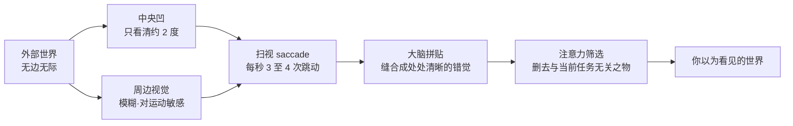

# 第 1 章 看见

> 在按下快门之前，先看见。相机能替你记录，却不能替你停下来。

每天都有无数画面从眼前掠过：通勤路上的车窗倒影，晨光里冒着热气的瓷杯，电梯按钮旁被指尖磨损发亮的金属边框，餐桌台布上的微小折痕，黄昏街头在路灯下激烈交谈的身影，还有阳台墙面上寸寸退去的一抹斜阳。这些景象在生理上已被视网膜接收，然而绝大多数转瞬即逝，未在心绪中留下丝毫回响。人类的大脑无时无刻不在研判周遭信息与当下生存任务的关联，一旦判定无关，便顺理成章地将其过滤。未能看见，并非视觉器官受损，而是注意力机制在持续进行着本能的减法。

然而总有一些微小的瞬间得以留存。究竟哪一幕能穿透日常的麻木，事前往往毫无征兆，亦难循逻辑推演。或许是阳台上那道即将消逝的切光，抑或是暗影中某个人抬眼时的凝视。你未曾刻意寻觅，脚步却在不经意间放缓，呼吸亦随之一滞，心头掠过一丝极其微弱的触动：此处自有一套秩序正在成形。那声提醒轻若游丝，稍有分神便会与之交臂失之。

这一驻足凝神的停顿，便是看见的起点。

摄影水准的高下，不在于快门触发的频率，亦不在于单日曝光的数据积累，而在于一天之中，有多少真实的物象能让你驻足沉思。这种差异在现场往往难以察觉，两人并肩而立，皆在频繁取景释放快门；然而归来置于屏幕前审视，高下立判。按下了数百次快门却难以甄选出一张立得住的作品，往往并非练习不足，恰恰是因为在现场真正驻足凝视的时刻过于匮乏。那数百次快门背后，充斥着“此处景致尚可，不妨记录一张”的浮泛好奇，这与深度视觉洞察截然不同。深谙观看之道的摄影师，整日或许仅释放数十次快门，但每一次食指下压之前，皆经历过一次审慎的停顿：先厘清眼前真正触动自身的核心元素究竟为何，再研判这一视觉关系能否被两维画幅有力承载。换言之，他所记录的不再是随性的好奇，而是一套业已推演清晰的视觉决断。

---

## 一张照片为什么留下来

*Dorothea Lange, "Migrant Mother", 1936。Lange 在加州 Nipomo 的豌豆采摘工营地遇见 Florence Thompson 一家，短暂停留中连续拍了六张；后来成为名作的是这组里最后、构图也最紧的一张。她当时没有记下对方的姓名，只判断这些照片也许能让营地的困境得到关注；这也提醒我们，经典图像背后还存在被摄者身份、处境与叙述权的问题。这张照片后来被广泛复制，成为 20 世纪最容易被辨认的肖像之一。[图片来源与复用说明](image-credits.md#lange-migrant-mother)*

---

## 大脑先删掉了什么

Lange 在那个营地驻足的十分钟之所以弥足珍贵，是因为对绝大多数人而言，生理与认知意义上的“凝神洞察”在日常中极为罕见。这并非夸大其词，而是源于人类视觉系统的生理构造。若深究其原理，便会揭示一个令人省思的事实：我们自以为对眼前环境“尽收眼底”，这本身往往是大脑构筑的一场认知错觉。

人类视网膜上真正具备高分辨细节解析力的区域极为狭小。那一微小区域被称为**中央凹**（fovea，位于视网膜黄斑中心部的微小凹陷），直径仅约一至两毫米。视锥细胞在此处排列最为致密，唯有投影于该区域的物象才能实现最高清晰度的光学成像。一旦偏离此区域，视觉分辨率便呈现断崖式衰减；延伸至周边视觉区域时，仅保留对粗略轮廓与动态位移的感知，色彩分辨力亦几乎降至谷底。三者的空间与功能分工如下表所示：

| 区域 | 大致覆盖视角 | 分辨能力 |
|---|---|---|
| 中央凹（fovea） | 约 1 至 2 度 | 极高，可分辨约 1 弧分的精细结构 |
| 旁中央凹 | 约 5 度以内 | 分辨率迅速衰减 |
| 周边视觉 | 水平方向可达约 200 度 | 极低，几乎无色觉，但对动态位移极度敏感 |

换算为日常生活中的空间尺度，中央凹所覆盖的清晰范围，大体相当于将手臂笔直前伸时拇指指甲盖所遮挡的狭窄区域。视角的大小可通过三角关系精确测算：设物体的物理宽度为 \( S \)，其距眼球的距离为 \( D \)，则其张开的视角 \( \theta \) 满足：

\[ \theta = 2\arctan\frac{S}{2D} \]

拇指指甲盖宽度约为两厘米，前伸距离眼球约六十厘米，代入公式计算，\( \theta \) 恰好约为两度。这意味着，在任意给定的静止瞬间，你自以为清晰完整的整个房间，真正被视网膜高精度解析的，永远只有那拇指甲大小的一隅，其余广袤的视野皆是粗糙、模糊且色觉低下的背景。

人类之所以难以察觉这种广泛存在的模糊，是因为眼球处于持续的高速运动之中。眼球通过被称为**扫视**（saccade，即两注视点之间极速跳跃的微动）的生理机制，以每秒三至四次的频率，将中央凹不断投射向环境中的不同节点，犹如在幽暗空间中高速移动的光束。大脑随即将这一连串离散的高分辨率视觉碎片实时缝合，构建出处处清晰的视觉假象。换言之，我们感知中稳定连续的现实空间，实则是大脑实时计算拼贴并填补缝隙的认知产物，而非一次性全景成像的客观事实。更具深意的是，在眼球跳跃位移的极短时间内，视觉中枢会短暂阻断图像信号的输入以避免动态撕裂，这一机制被称为**扫视抑制**（saccadic suppression）。我们终生未曾体验到每日数十万次的瞬间“黑屏”，正是因为大脑将这些感知间隙悄然弥合。

厘清这套生理与认知机制，便能彻底理解“注意力持续进行减法”的本质。既然在任意时刻能够进入高精度处理的信息极为有限，中枢神经便必须根据当下的主观意图，时刻指引眼球的扫视轨迹。所谓的“视觉洞察”，本质上正是这束探照光摆脱了日常功利任务的羁绊，在某个原本被惯性忽略的角落驻留了片刻。

认知心理学中的经典实验生动揭示了注意力过滤的巨大威力。1999 年，心理学家 Simons 与 Chabris 进行了一项著名实验：受试者被要求专注观看一段短片，精确统计白衣球员之间的传球次数。在传球过程中，一名身着大猩猩道具服的人员缓步穿过球场中央，甚至在镜头正中捶胸致意。事后测试表明，约半数受试者对大猩猩的出现毫无知觉。他们的视线无疑曾扫过该区域，视网膜亦完成了光电转换，但由于“计算传球”这一核心任务占据了全部认知带宽，视觉中枢便将与任务无关的异常信号彻底剔除。此现象在认知科学中被称为**非注意盲视**（inattentional blindness）。

这一实验揭示了一个深层规律：日常生活中错失的绝大多数视觉景致，并非由于它们隐匿过深，而是因为它们坦然显现于眼前时，我们的心智正被琐碎的既定目标所占据。具备敏锐洞察力的摄影者，其特质往往在于能够适时从功利性的认知任务中抽离出来，从而让那些穿行于现实背景中的“大猩猩”重新在视野中显影。

---

## 观看，还是占有

Susan Sontag 在《论摄影》（*On Photography*）中深刻指出，拍摄本身构成了一种事件，亦是一种对被摄之物的占有形态。她所审视与警惕的，是拍摄行为对纯粹凝视的异化。当相机被握入掌心，使用者的注意力极易被机械操作所劫持：迫切于将物象封存于画幅、确认曝光与对焦的完成，反而中断了对物象本身的持续凝视。视觉占有取代了深度观看，往往始于这一机能的让渡。

该书著于 1977 年。在胶片时代，拍摄过程承载着严谨的物理仪式：设定测光、手动对焦、释放快门，继而经历暗房冲洗的周期等待。每一步操作的物理阻尼，都在提醒创作者正审慎地将现实切片转化为银盐影像。这种相对缓慢的节奏，反而为持续的注视留出了呼吸的间隙。而在数字化与移动互联的当代，观看的连贯性面临着更为严峻的碎片化挑战。便携终端举起的瞬间，注意力被迅速割裂：屏幕取景、即时回放、网络传输与社交反馈多重交织，现实场景退化为生产即时内容的素材库。在多任务并行的嘈杂中，纯粹而专注的凝视愈发成为一种稀缺的能力。

然而，取景装置本身亦可转化为沉淀目光的器具。当眼眸紧贴光学取景窗，外部无休止的视觉流动被物理边框截断为一个具有清晰界限的二维平面。取景框将无限的现实提炼为可供推敲推演的结构实体。界限的确立，迫使创作者必须做出严峻的取舍决断：在繁复的现实空间中，究竟剔除何种杂质，仅萃取何种核心力量。

初习摄影者往往对这种视觉舍弃心存抗拒，试图将视界内的一切细节悉数纳入画幅，唯恐割裂现场信息。唯有经历长期的实践磨砺，方能领悟影像构成的减法本质：画面的力量从来不是元素的堆砌，而是决断的收敛。那些被排除在边框之外的杂物、被置于景深之外的虚焦、以及快门前后流逝的时间，皆是衬托主体结构得以凸显的必要代价。按下快门的实质，是对现实进行的一次精准提纯。

---

## 从认出到重新看见

漫步于古典美术馆中，常能目睹这一典型场景：参观者在 Vermeer 的精致画作前驻足，举起设备迅速抓取一张曝光，低头检视屏幕确认合焦后便匆匆移步，全程不过数秒。在物理层面上，他们确实“浏览”了画作；但若在移步之际请其回忆画中人物的手部姿态或光影过渡，往往一片茫然。

这种机械记录与真正的凝视相去甚远。它的本质仅是对文化符号的存在性确认，类似于行程中的打卡登记：它完成了“身临其境”的证据采集，却未能与画面的形式语言产生实质性的精神交互。

许多摄影爱好者的创作长期滞留于此类符号登记阶段。置身名胜便复刻地标建筑，深入原野便拓印典型风貌。当快门释放完毕，记录任务即告终结，所获图像在此后漫长的岁月中极少被重新审视。判断自身是否陷入此种困境的标准十分直观：若硬盘中沉睡的海量图像终年未曾唤起你再度推敲调阅的渴望，那些记录在很大程度上仅是行程的痕迹，而非视觉思考的结晶。

从机械登记跨越至真正的看见，唯有依靠时间的沉淀。观看具有多重层级：唯有在物象前驻留足够的时间，表层显见的信息才会逐步退居次席，深层隐匿的空间韵律与微光细节方能浮出水面。最初仅能辨识人物的轮廓，随着注视的延展，其骨骼转折、肌肉张力、视线走向，以及身形与环境光线交织形成的明暗交界线，才会逐一清晰显现。凝视一幅画面五分钟与匆匆一瞥三十秒，所获的视觉认知有着天壤之别；在同一现场守候十分钟与随手抓拍即刻离去，所捕获的空间质感亦绝非同日而语。

Saul Leiter 自 1952 年起定居于纽约东村 East 10th Street，于同一街区生活并拍摄逾六十年。他的镜头始终聚焦于窗外方圆数条街巷的日常流转：风雪中撑着红伞的行人、玻璃上凝结的雾气水滴、车流排气管升腾的白汽、雨后沥青路面上倒映的霓虹微光。在多数时光中，他仅是在临窗的座位上品味咖啡，静观光影形态的生灭，唯有当窗外的几何结构与色彩关系达到某种内在的契合时，方才从容端起相机释放快门。在黑白胶片统治严肃摄影的年代，他已敏锐地探索彩色的抒情语言；这种持久专注的凝视，构成了早期彩色街头摄影的重要篇章。

Leiter 的实践阐释了比单纯等待更为深刻的命题：将目光聚焦于身旁最为寻常的街道。人类对异域环境具有天然的感官兴奋，踏入陌生国度时，地砖的排布、门牌的字体、斑驳的墙皮皆能激发快门欲望；而面对朝夕相处的日常街区，大脑的认知机制则倾向于节约能耗，迅速将空间封装为扁平的概念标签（街角便利店、日常通勤线路、熟悉的建筑外立面）。我们自以为“目睹”了它们，实则仅仅是在脑海中完成了概念的“辨识”。辨识与看见，存在着本质的鸿沟。

这种概念辨识的省力机制，源于大脑的**预测编码**（predictive coding）特质。神经科学研究表明，知觉并非被动接收光影信号的机械记录，而是一个主动的预测系统：大脑基于过往经验预先构建环境模型，仅提取与预测产生偏差的异常信号进行深度处理。这种机制极大优化了认知负荷，其代价则是使熟悉的环境沦为视而不见的背景。熟悉街区的细节之所以隐形，正是因为其高度吻合认知预期，被中枢判定为无须分配注意力资源的冗余信息。

将熟稔之物重新审视如初见，需要经过严格的视觉自律，其难度远甚于奔赴遥远胜地追逐奇观。在陌生地域，环境的新鲜感能够被动代偿观察力的不足；而在日常场景中，唯有依靠高度自觉的凝视方能剥离陈旧的概念标签。训练方法朴素而苛刻：选取一处每日必经的寻常角落，在不同的晨昏时刻与阴晴变幻中持续观察拍摄整月。初涉之时难免乏善可陈，但随着反复的深入凝视，固化的概念标签终将瓦解。光影随日光角度时刻迁移，雨水浸润让材质反差重构，行人动态赋予空间全新的节奏。当在审视过百次的街角依然能洞察出未曾领略的形式细节，视觉的真正觉醒方告达成。从 Eugène Atget 遍历数十年记录的巴黎老街，到森山大道聚焦的新宿街头，皆是在持久凝视中锻造出的视觉史诗。

Eugène Atget 将这种深潜专注推向了极致。自十九世纪末至 1927 年逝世，他背负沉重大画幅设备穿行于巴黎街巷近三十载，系统记录即将消逝的旧城肌理：破晓时分静谧的街角、橱窗内陈列的石膏模特、庭院深处斑驳的铸铁栏杆、落叶覆盖的古典雕像。他生前隐匿于市，仅将照片作为画家的写生素材微利出售；直至晚年被摄影家 Berenice Abbott 发掘并抢救性保存其大批玻璃干版底片，其作品蕴含的史诗厚度方才震撼世人。他将整座城市转化为凝视的试验场，所依凭的正是将寻常空间不断陌生化的深沉功力。

William Eggleston 则以另一种维度践行着相似的专注。他的取景框长久停留在美国南部平凡无奇的物质细节之上：停泊于水泥路边的红色童车、堆满冻肉的冰柜内部、被日光穿透的空旷浴室、天花板正中悬挂单枚灯泡的猩红房间。1976 年纽约现代艺术博物馆（MoMA）为其举办的彩色摄影个展引发了剧烈反响，成为彩色摄影确立其艺术合法性的关键节点。Eggleston 将其观看态度定义为“民主的”（democratic）：在镜头审视之下，生锈的残件与宏伟的建筑拥有均等的视觉尊严。这种不带偏见的平视态度，打破了题材的等级区隔，让日常遮蔽之物重新绽放出冷峻的形式张力。

---

## 预判比反应更早

1932 年，Henri Cartier-Bresson 于巴黎圣拉扎尔车站后方记录下一张传世影像：一名身着正装的男士正凌空跃过积水的水洼，其身姿与背景海报中舞者的剪影形成了精妙的几何呼应。摄影教材常以此阐释“决定性瞬间”的偶得，然而更为关键的探问在于：在快门释放之前，他在那处围挡前究竟守候了多久。

据其后来的技术陈述，车站后方当时立有木质施工围挡，他将镜头穿过板材狭缝进行观察，因缝隙局促，底片边缘留下了边缘的遮挡痕迹。男士跃过水面的瞬间并非凭空撞见，而是在选定取景框架、预设焦点与曝光之后，静候动态元素切入预设结构的结果。表象上的机缘巧合，其前置条件是严密的构图预置与漫长的专注守候。

“决定性瞬间”的概念在流传中常被蒙上不可捉摸的神秘色彩。实地拍摄中，具有视觉力量的画面极少源于漫无目的的游荡。将结果完全寄托于偶发运气的拍摄者，往往在频繁的位移中空手而归；这并非环境缺乏视觉元素，而是因为缺乏主动的结构预判。精准的预判依赖两重支柱：其一，是置身特定场景时沉得住气的守候时长；其二，是长期实践所沉淀的空间动态经验。

谈及以高强度拍摄喂养预判直觉，Garry Winogrand 展现了极致的样本。这位纽约街头摄影家几乎终日处于拍摄状态，在状态充沛时单日可消耗十数卷胶片。他曾留下一句广为人知的名言：拍照是为了看清“某件事物被拍摄成照片之后究竟呈现为何种模样”。对他而言，快门不仅是决断的终点，更是探索视觉极限的工具。1984 年他骤然离世时，留下了两千余卷未及冲洗的胶卷以及海量未经编辑的接触印相底片。

这批数量惊人的未整理底片常被后人作为缺乏克制的警示，但从认知层面审视，它展示了高密度实践对直觉反应的极端催化。经历过数十万次瞬间捕捉的洗礼，创作者对人流走向、肢体语言以及光影交错的预判敏锐度，必然达到常人难以企及的高度。Winogrand 虽因编辑断层而付出了沉重代价，但其案例无可辩驳地印证了预判能力对大量实战经验的深刻依附。

---

### 看见的内在节律

看见拥有其独特的节律。有时整日穿行于街市，车流、橱窗与行人在视野中平淡掠过；而在某个寻常的清晨，当你伫立于熟悉的十字路口等候红灯，忽然对面一位身着灰呢大衣的女士，恰好步入刚经擦拭、尚存水光的玻璃幕墙前，幕墙折射出一隅明亮的黄色光斑。整个画面的点线面在瞬间严密咬合。几乎在同一瞬间，心念与直觉已在瞬息间调动起来：视线迅速研判该调动何种焦距、机位当向前微调几步，余光警惕着侧方是否有突兀的车辆切断视线，并精确计算着交通信号变换的剩余窗口。

最终是否释放快门、抑或由于信号变换主体离去而错失良机，其意义已退居次席。至关重要的是在那一刻你的精神全然在场：亲历了一个画面由混沌走向秩序的完整生成，并深刻明晰内心意欲捕捉的核心所在。一日之中能有数秒进入此种深度的在场状态，便不虚此行。

唯有真正实现精神在场的创作者，其快门方具备穿透表象的力量；否则即便盲目积累数万次曝光，画面的空洞依旧无从遮掩。

---

## 格式塔如何组织画面

画面中元素瞬间咬合的直觉体验，其底层运作着严密的神经感知规律。在理性意识尚未完成概念切分之前，人类的视觉皮层已先一步将纷乱的光影信号组织为结构化的整体。这种先于意识的自组织机制，早在二十世纪初便由德国**格式塔心理学派**（Gestalt Psychology）系统揭示。其核心洞见极为深刻：视觉感知并非对孤立点线的机械拼装，而是遵循整体优先原则，依据简洁高效的内在组织律，自动将离散元素归纳为具有意义的构型。

这些知觉组织法则在日常观察中潜移默化地运作：
- **邻近性**（proximity）：空间距离临近的元素，倾向于被聚合为统一的视觉单元；
- **相似性**（similarity）：色彩、明度、形状或朝向相近的物体，自然被归纳为同类结构；
- **连续性**（continuity）：视线倾向于沿着平滑、连贯的轨迹延展，抗拒突兀的几何断折；
- **闭合性**（closure）：面对残缺或不连续的边缘，中枢神经会主动补全缺口，感知为完整的几何形体（如著名的卡尼萨三角视错觉）。

这些知觉规律极大降低了日常认知成本，但在取景构图时却构成了双向的制约。一方面，经典画面的视觉清晰度，正是依托格式塔原理将纷繁元素有序归整：人群因聚拢而被识别为主体群像，窗棂因几何相似而被感知为节奏韵律，栏杆线条因方向连贯而顺畅引导视线汇聚于远方焦点。另一方面，由于这套知觉归纳完全自动化进行，画框内未经严密推敲的冗余元素同样会被强制并入结构：背景中横贯头部的线缆会强行切断主体的轮廓；地面突兀的阴影折角会破坏视线的导向，将焦点从主体强行剥离。

构图的本质，很大程度上是创作者在取景器内与自身视觉系统的知觉组织律展开精密对话。机位的细微升降、视角的毫厘推移，不仅是在调整物理实体的空间位置，更是在预先编排观者眼球落入画面时的扫视路径与结构解析顺序。

---

## 不带相机的练习

有一项初期极易产生心理阻抗的练习：离家漫步时，彻底放下任何摄录设备。

此练习的核心意图，并非为了倡导某种形式的克制，而是通过剥离操作工具，强行切断“观看即记录”的本能反应，让眼眸重归纯粹、无负担的知觉探索。初试之时往往心生局促，双手空置若有所失；行至街角目睹绝妙的光影切面，指尖甚至会下意识地摸索快门按键。此时心底难免升起遗憾，认为一幅佳作就此湮灭。然而坚持至第三日，感知便会悄然蜕变：褪去了器材操作的心理负荷，视野中能够捕获的生动细节与几何关系反而呈现倍数级的增长。

其机制并不深奥。当机身悬于胸前，一旦目击潜在画面，思维在瞬间便会被技术参数所占据：估算焦距透视、测算明暗光比、权衡机位站位。这种工具化的思考模式迅速覆盖了纯粹的知觉体验，此时所见已非物象本真，而是被机械转换后的潜在成片。带着强烈功能预设的注视固然不可或缺，但若缺乏对原生现实的敏锐感知，画面极易沦为技术套路的重复。

定期保持轻装散步的习惯，让目光在无任务的状态下自由呼吸。那些未被记录的浮光掠影并未消散，它们将悄然重塑你的视觉敏感度：你会敏锐辨识特定季节斜射光的冷暖质感，捕捉雨后沥青深处的幽微泛光，洞悉市井人物极具张力的偶发神态。视觉洞察力如同肌体机能，唯有在日常的纯粹凝视中持续润养，方能在关键时刻迸发出惊人的判断力。

---

## 照片为什么需要秘密

Diane Arbus 曾留下深刻的论断：“A photograph is a secret about a secret. The more it tells you, the less you know.”（照片是关于秘密的秘密；它向你展示得越多，你所知晓的反而越少。）初读此语或觉晦涩，唯有在长期的创作反思中，其蕴含的美学哲思方会逐层显现。

初入影像门径者，往往容易陷入信息过载的构图泥淖。画面试图将时间、空间、人物与因果巨细靡遗地交代无遗，配合均质平淡的正向光源，将主体轮廓与环境细节描摹得纤毫毕现。当画面的所有信息被和盘托出、毫无保留时，观者的目光往往在一览无余后迅速撤离，难有驻足沉思的余地。

1962 年，Arbus 于纽约中央公园记录下《手持玩具手榴弹的男孩》（*Child with Toy Hand Grenade*）：画面中瘦弱的男童身着背带短裤，右手紧攥玩具手榴弹，左手蜷曲如爪，面容因高度紧张而扭曲为怪诞的神情。当日拍摄的整卷胶片中，男童曾呈现嬉笑、侧身、与同伴交谈等寻常孩童神态；然而 Arbus 独独甄选出这一极具戏剧张力的孤立瞬间。该画面抽离了事件的前因后果：画面并未交代他在呐喊什么，亦未呈现母亲的身影，更无从获悉周遭的游园环境。正是由于叙事信息的克制留白，观者无法在此类画面前匆匆掠过，反而会在久久的凝视中唤起对人性深层状态的无尽推演。

视觉信息的高度提炼，往往赋予画面更为持久的生命力。经得起反复凝视的经典影像，鲜少将答案全盘托出，而是有意识地保留局部的幽微、遮蔽与余白，将阐释与重构的空间让渡予观者的知觉与想象。学会接纳阴影的沉降、形体的局部遮挡以及情绪的隐喻表达，是摄影审美走向成熟的必经之路。

---

## 长出自己的眼睛

伴随拍摄阅历的积累，创作者终将洞察到一个本质事实：画框中所投射的不仅是客观外部世界，更是拍摄者内在心智结构的映射。你会逐渐意识到，自己总是被某种特定质感的光线所牵引，总是在特定的空间距离下感到构图的自洽，并反复依循某种几何构型。这并非对特定流派的刻意模仿，而是个人知觉系统在长期沉淀后自然形成的审美轨迹。

Saul Leiter 终其一生深耕东村数条街区，其画面温润、内敛而沉静：水汽氤氲的玻璃、雨后的一抹纯红、被霓虹浸润的门廊；画面常被立柱或行人的肩背割裂为不对称的色块，配合过期 Kodachrome 胶片的独特发色，呈现出如水洗般的静谧诗性。森山大道的镜头语言则走向另一个极端，粗粝、高反差且充满野性：三泽街头回眸逼视的野犬、沥青路面上高跟鞋的顿挫，胶片颗粒如砂纸般致密坚硬。若将两者的地理空间对调，结果依然如故：Leiter 眼中的东京必将化为温润沉静的色块，而森山大道笔下的纽约亦将充斥着粗粝发烫的张力。摄影师所记录的从来不是孤立的地理坐标，而是其审视世界的整套哲学与知觉范式。

每个人皆孕育着独特的视觉潜能，唯因身处自我视角的内部而难以察觉其轮廓。行之有效的梳理方法十分朴素：保持专注的持续拍摄，并在每岁末进行严苛的年度复盘，从成千上万的快门记录中甄选出最具代表性的二十幅作品并置推敲。历经数载沉淀，那些反复出现的影调偏好、空间距离与题材焦点便会清晰浮现。在辨识出这些个人特征之后，创作将步入双重演进：一方面，聚焦深化这些审美直觉，使画面呈现鲜明的个人烙印；另一方面，主动跳出舒适区，警惕自我套路化的停滞。在这两者的张力与博弈之中，摄影师的视觉人格方能真正确立。

在这条探索之路上，核心追问亦在历时性地蜕变：初涉之时，探寻的是曝光参数与操作技法；行至中途，聚焦于特定题材与布光法则的攻坚；而历经磨砺之后，最终的探问终将回归本源：我的目光究竟为何而驻足，又因何一次次被这些特定的光影与秩序所打动。

---

## 练习

1. 进行为期一周的不带相机漫步。每日入夜，从当日真正打动感知的视觉画面中甄选一幕，以文字简洁记录其光影方位与空间关系。一周累积的七条记录，是摆脱工具依赖的纯粹视觉训练。
2. 研读经典摄影大师实体画册。每日精读三幅作品，每幅沉浸凝视不少于两分钟，推敲其光线来源、机位角度与主体神态。与此同时执行极简选片：当日拍摄的所有素材中严选一张并注明甄选依据。坚持一年，即可构建起由数百个严密构思组成的视觉思维库。

这两个练习看似简朴，其核心皆在于训练让目光慢下来的能力。后续各章所探讨的光线掌控、透视选择乃至终极选片，皆深植于这一份沉静专注的凝视之中。

---

下一章：[第 2 章 光](02-light.md)
