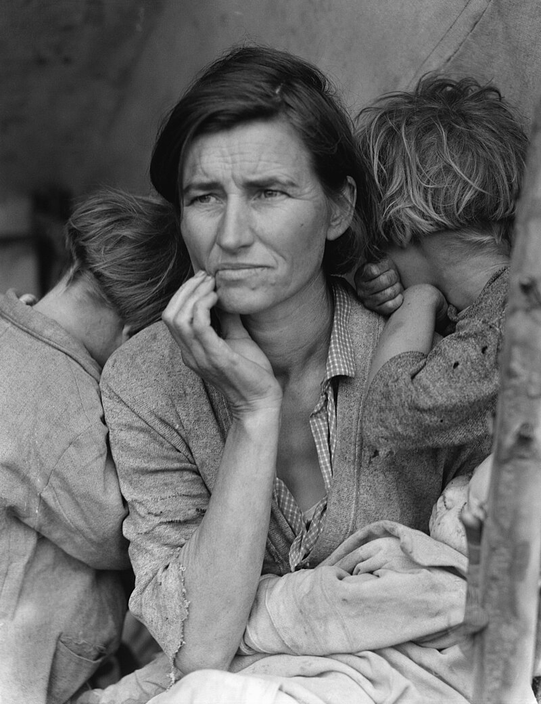

# 第 1 章 看见

> 在按下快门之前，先看见。看见的能力是相机给不了的。

每天都有几千张图像从你的眼前经过。通勤时的车窗、早餐桌、电梯按钮、写字楼大堂、午饭的菜单、下午会议室的白板、回家路上路灯下两个吵架的人，还有公寓阳台上正在落山的一道光，你其实都看到了。只是绝大部分画面会在两小时之内消失。大脑判定它们和你没有关系，于是把它们丢掉。

里面也会有一些画面留下来。至于是哪一个，你通常并不知道。可能是阳台上那道光，也可能是吵架那两个人之中较瘦那一位的眼睛。你说不出完整的原因，只是在某一个瞬间停了一拍，呼吸短了半秒，然后继续往前走。

那个停的瞬间，**是看见**。

会拍照和不会拍照，区别不在快门按得多快，而在于一天里有多少画面真正让你停下来。这个差别在拍摄现场并不显眼，因为两个人都可能一直举着相机，也都可能不断按下快门。可是回到电脑前，差别会变得非常清楚。新手按 200 张回家选不出 1 张，往往不是因为拍得不够多，而是因为他真正停下来的次数其实是零。

他按下去的 200 次，几乎每一次的指令都是同一个：「那个画面好看，我也拍一张。」这是一种平均的好奇，和真正的看见无关。

老手可能只按 30 张。可是每一次按下快门之前，他都已经停下来过一次。他会先看见画面里真正吸引他的东西，再判断这个东西是不是能被照片留下来。换句话说，他不是在用快门追赶眼前的一切，而是在确认这个画面值得被留下。

---

*Dorothea Lange, "Migrant Mother", 1936。这张被冲洗了上百万次的照片是 Dorothea Lange 在加州 Nipomo 一个豌豆采摘工营地停车的 10 分钟里拍下的。她那天下午开车回家，看见这位母亲坐在帐篷下，连开了几张就走。她当时不知道这张会是 20 世纪最被记住的肖像。「我没有问她的名字，也没有问她的故事，」她后来写道，「她坐在那里，仿佛知道我可能可以帮上她。她仿佛承认自己被 - 拍下来。」 (Library of Congress, 公有领域)*

---

Susan Sontag 1977 年在 *On Photography* 里写过：「拍照本身就是一种事件 - 一种霸占被拍物的方式」。这句话的重心不在器材，而在拍摄这个动作本身。她对摄影的判断带着明显的警惕，因为她担心人一旦拿起相机，便会急着占有眼前的事物，反而忘了继续观看。

在 90 年代以前，这个批评有它的现实基础。那时拍照仍然是一件带有仪式感的事情。你要把相机举起来，要对焦，要按下快门，还要把胶卷送去冲洗。每一个动作都在提醒你：你正在把眼前的某个东西变成一张照片。可是到了今天，真正更容易打断观看的往往不是相机，而是手机。手机会把人的注意力分散到屏幕、声音、社交反馈和发布动作上，眼前的场景反而退到了后面。

一个人举着 iPhone 边走边拍 vlog，他的注意力往往已经被屏幕、声音和路线分散。他一边看画面，一边听自己说话，还要注意身边有没有人撞上来。这个时候，影像更像一条正在生产的内容流，而不是一个需要停下来看的场景。

与此同时，一个人停下来，把 Leica 的取景器贴到眼睛上，那一刻他几乎不能再做别的事情。他的左眼可能还看得见一点取景框外的世界，但主要注意力已经被框线收住。他必须面对眼前的画面，判断边界、光线和时机，然后才按下快门。

相机并不是观看的敌人。很多时候，它反而会让观看慢下来。你一旦把眼睛贴近取景器，世界就不再是完整包围你的环境，而变成了一个有边界的平面。这个边界会逼你做决定。**你必须裁掉 95%，才能保留最后那 5%**。

新手常常不愿意接受这 95% 的损失，于是想把整个场景都塞进画面里。他怕漏掉旁边那个人，也怕漏掉远处那栋楼，还怕观众不知道自己当时站在哪里。老手知道画面是减出来的，所以能接受这种损失。他知道被裁掉的东西不是失败，而是照片成立的条件。

按下快门的瞬间，其实是一个减法。眼前的世界先减去取景框外的部分，再减去焦平面外的部分，还要减去那一秒之外的部分。最后，所有不在这次曝光里的色调也被排除出去。**你不是把世界完整地拍下来，而是把世界缩短到 1/200 秒**。

明白这一点之后，按下快门就不是你以前以为的那个动作了。它不只是把眼前的东西收进硬盘，也不是替未来的自己保留一个凭证。每一次按下去，你都在说：这些东西留下，其他东西不要。你不是在收藏，而是在选择。

---

去过欧洲博物馆的人，大多见过这种场面。一群游客围着 Vermeer 的某幅小画站着，每个人举起手机，按下快门，看一眼屏幕，然后转身离开。整个过程不超过 30 秒。他们当然「看到了」这幅画。可是如果让他们闭上眼睛，说出画里那个女人手腕的姿势，几乎没有人能说出来。

他们做的事情比观看更浅：**确认那幅画在那里**。这有一点像给朋友打电话，说一句「我到机场了」。它是一种存在登记，还不是观看。

很多人的整个摄影生涯，都停留在这种登记里。我去过法国了，于是拍下埃菲尔铁塔。我去过南极了，于是拍下企鹅。这些照片回家之后不会被再看一眼，但它们已经完成了自己的任务：证明某个人到过某个地方。如果你拍了几年之后发现自己一年也不打开旧硬盘，那么你拍下的多半是登记，不是照片。

要从登记进入看见，没有别的办法，只有花时间。时间一拉长，第一层信息会慢慢退下去，第二层信息才会浮出来。你先看见画里有一个人，接着才看见她的手腕、肩膀、眼神，以及她和旁边那道光之间的关系。一张画看 5 分钟，比看 30 秒得到的信息多很多。一个场景站 10 分钟，也比拍完就走得到的画面多很多。

Saul Leiter 1952 年起住在纽约东村 East 10th Street 一间二楼公寓里，之后几乎没有搬过家，一直到 2013 年去世。他拍的就是那扇窗户外面那几条街：一个戴红伞的女人从对面店门口出来，一辆出租车停在窗下蒸汽腾腾，雪后清早第一个邮差沿街走来，下雨天玻璃上的水珠把对面霓虹折成一团模糊的红绿。

他大部分时间不按快门。他坐在窗边喝咖啡，看，等。等到画面里的颜色和形状刚好对上他心里那一格的时候，才举起相机按一下。50 年的观看，换来后来人们叫做「彩色街头摄影」的那一整套语言。

---

Henri Cartier-Bresson 1932 年在马德里附近拍下过一张著名照片。画面里，一个穿西装的男人正跳过一片水洼，背景是一块广告牌，上面有几个跳舞女人的剪影。这张照片现在叫《圣拉扎尔火车站》。几乎每一本摄影教材都会把它当作「决定性瞬间」的标本。

教材没有说的是 - **Bresson 在那个水洼边等了多久**。

他没有记。后来谈起这张照片时，他只是说自己在车站附近徘徊，看见水洼，知道有意思的事情可能会发生，于是守在那里。可能是 5 分钟，也可能是半小时。等到那个男人出现的一瞬间，他举起相机按了一张。**他不可能只是从水洼边经过，刚好看见男人跳过去**。从看见、举起相机、对焦、构图到按下快门，至少需要几秒钟；等这一串动作完成，那个男人早就湿了脚，走到画面外面去了。

「决定性瞬间」翻译成中文之后，听起来像一种带着禅意的等待，仿佛摄影师只需要等到完美瞬间降临。Bresson 的法语原话其实是「Image à la sauvette」，意思更接近「迅速抓到的画面」。它更像一个动作，而不是一种境界。他不是在等一个完美瞬间从天而降，而是在一个正在发展的局面里**预测下一秒**，然后准备好相机，等那一秒到来。

新手很容易把这一点误解掉。他们以为决定性瞬间是在街上随便走，运气好时刚好遇到一个精彩画面。于是他们把希望放在偶然上，走过一条街，再走过下一条街，期待某个画面自己撞进镜头里。可是他们走了很久也没遇到，并不一定是城市里没有画面，而是因为他们没有在预测。

预测不是玄学。它靠两件事：你看一个场景的时间够不够长，以及你拍过的相似场景够不够多。前者今天就能开始，后者需要几年积累。等这两件事慢慢叠起来，你就会知道一个人走到哪一步时可能回头，一片云移动到哪里时光会落下来，一个路口的红灯还剩几秒时人群会开始松动。

---

看见有节奏。

你今天可能从早到晚什么都没看见。地铁车窗、咖啡店玻璃、楼下花坛、写字楼夹道，全部正常滑过。然后周二早上 8:43 你路过那个常路过的路口，等红灯，对面一个穿浅灰大衣的女人站在那里，她身后是一面被早班的清洁工刚拖过的湿玻璃幕墙，幕墙反射对面那栋楼黄色的顶。整个画面在你眼睛里停了一下 - 灰大衣 / 湿玻璃 / 黄反射 / 早晨的浅蓝天 - 你已经在判断焦段、走多近、相机出门时设的参数对不对、左前方那个外卖员会不会进来、灯还有几秒变绿。

你可能按了，也可能没有按。没有按，并不代表那一秒就浪费了。重要的是**那一秒你在场**。你确实看见了画面如何形成，也确实意识到自己为什么想拍。一天里有这样一秒就够。一周有三天能遇到这样的状态，就已经很好。

不在场的人按一万张也没什么。在场的人按一张就有一张。

---

有一个练习刚开始会让人不适应：**出门散步时，把相机留在家里**。这个练习不是让你错过照片，也不是让你证明自己有多克制。它的目的更简单：把观看从拍摄里暂时分离出来，让眼睛重新习惯不带任务地看。

第一天你会感觉空了一只手。走到街角，看见一束光落在墙上，身体会本能地伸手，可是那里没有相机。你会有一点不安，也可能会觉得这个画面浪费了。第二天会好一些。到了第三天，你开始注意到，看见的画面反而比以前多了。

原因很简单。相机在身上的时候，你一看见某个画面，眼睛就会立刻进入「准备拍摄」模式：算焦段、算光线、算站位。这个模式一旦启动，**单纯观看的部分就会被覆盖**。你看到的不是这个画面本身，而是「这个画面在我的相机里会是什么样」。这种观看当然有用，但它和不带拍摄目的的观看并不一样。

放下相机之后，你才更容易单纯地看。那些画面留不下来，也不会变成作品，但它们会慢慢改变你的眼睛。你会开始记得某一种下午的光，某一种雨后路面的反光，某一种人站在门口时的姿态。一个月之后，你会发现自己能看见的东西比以前更多。观看能力像肌肉一样，会因为反复使用而变得更敏感。

不需要一直不带相机。只要每周留出一两天，把拍摄这件事先放下来。其他时间你仍然可以带相机出门，也仍然可以认真拍。这个练习不容易立刻见效，但它会让你重新分清观看和拍摄之间的区别。分清之后，再拿起相机时，你会更知道自己为什么要按下快门。

---

Diane Arbus 有一句被反复引用的话 - 「A photograph is a secret about a secret. The more it tells you, the less you know」。中文译过来：照片是关于秘密的秘密。它告诉你越多，你知道的越少。

这句话第一次读起来，可能有一点故作神秘。读到第十次，它的意思会慢慢变得清楚。

新手的照片往往告诉你太多。「这是下午四点的埃菲尔铁塔」「这是表姐去年生日切蛋糕」「这是公司团建吃火锅」，时间、地点、人物和事件一次性交代清楚。连画面里的那盏灯，也正面对着脸打满。所有信息都是直接给出的，于是观众看一秒就看完了，不会再停留第二秒。

Diane Arbus 1962 年在中央公园拍过一张《Child with Toy Hand Grenade》。一个细瘦的小男孩，吊带短裤，左手攥着一颗玩具手雷，右手蜷成爪子，嘴张开像在喊。**这张是她按了 12 张里挑出来的一张** - 别的 11 张里小男孩在笑、在歪头、在和姐姐说话，全是「正常的小孩」。Arbus 偏要这一张。你看不出他在喊什么，你看不出他妈在哪，你看不出公园那天有没有阳光。但你看 10 秒看不够，看 30 秒还想看，看 1 分钟开始猜他长大后会变成什么样，看 5 分钟开始想自己小时候。

**信息少的画面，往往比信息多的画面更能留下空间**。真正的好照片经得起反复观看，原因也在这里：它们没有把答案一次性塞给你。

新手常常追求清晰、信息丰富、戏剧性强。老手会逐渐接受模糊、留白，以及需要观众自己补完的部分。这个转折通常发生在第三年到第五年之间。在那之前，你想拍出别人一眼能看懂的东西；在那之后，你才慢慢知道，**一眼能看完的画面通常不够耐看**。

---

最后一段值得说的关于看见的话，是关于「你的眼睛」。

每个拍了几年的人，最后都会发现一件事：自己照片里出现的不只是这个世界，**还有自己**。把这些年拍下来的照片放在一起看，你会看到一些隐藏的偏好。你总是被某一种光吸引，总是在某一种距离里感到舒服，也总是重复某几种构图。这不是因为你在模仿某个摄影师，而是因为你的眼睛逐渐长成了那样。

Saul Leiter 一辈子拍纽约东村那几条街，他的画面是温柔的、灰色的、慢的 - 雾蒙蒙的玻璃、雨后的红伞、被霓虹晕染开的咖啡馆窗户，构图常常被一根电线杆或一个路人的肩膀切掉一半。他用过期的 Kodachrome 胶卷，颜色淡得像褪过水。Daido Moriyama 一辈子拍东京新宿那一带的夜街头，他的画面是粗糙的、高反差的、快的 - 一只野狗回头瞪着镜头，一双高跟鞋踩过湿沥青，颗粒粗到像砂纸，黑得发蓝、白得发灼。他用 Ricoh GR 小相机不举眼平就按，从来不停下构图。

两个人当然可以交换城市。可是 Saul Leiter 去东京，拍出来的仍然会是温柔而灰色的东京；Daido Moriyama 来纽约，拍出来的也仍然会是粗糙而高反差的纽约。**摄影师拍下的不只是地方，还有他们自己看世界的方式**。

你也一样。你现在未必知道自己的方式是什么，因为你一直在自己的眼睛里面。你能做的，是持续拍下去。每年回看一次过去 12 个月最满意的 20 张，把它们并排放在一起。两三年后，你会看出一个反复出现的图案，那就是你。

看见这个图案之后，通常会发生两件事。第一件事是你会更专注于它，于是你拍出来的东西会更像你。第二件事是你会开始挑战它，因为只会重复同一个图案，成长就会停下来。这两件事来回交替，才构成一个摄影师真正成长的过程。

第一年，你想知道相机的参数应该怎么设。第三年，你想知道某一个题材应该怎么拍。到了第十年，你真正想知道的会变成：**自己是谁**。这本书不能替你完成第十年那一步。但前面两步都在书里，所有章节也都在为那一刻做准备。

---

## 练习

出门散步一周，不带相机。让眼睛尽量保持在「观看」模式里。每天晚上，从这一天真正看见的画面里挑一张，写在本子上。不要画构图，只写一句：今天我看见了某个画面。这样坚持一周，你会得到七行文字。

买一本你最喜欢的摄影师画册。不要买 PDF，要买实体书。每天看 5 张照片，每张看 30 秒，看完一周之后再换下一组。与此同时，强迫自己回家选片：当天拍的所有照片里只选一张，并且写一行为什么选它。一年之后，你会有 365 张被认真想过的画面。

真正要练的，不只是上面这几件具体的事，而是它们背后的态度：**慢下来，看得久一点**。其余的能力都会从这里长出来。

---

下一章：[第 2 章 光](02-light.md)
