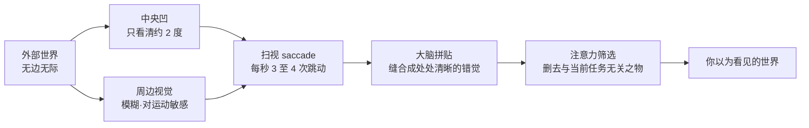

# 第 1 章 看见

> 在按下快门之前，先看见。相机能替你记录，却不能替你停下来。

每天都有许多画面从眼前经过：通勤路上的车窗，早餐桌上的杯子，电梯按钮旁边被磨亮的一小块金属，午间菜单上的油渍，回家路上路灯底下争吵的两个人，还有阳台上正在退去的一道光。这些画面你其实都看到了，只是绝大多数很快便消失了，没有在心里留下一丝痕迹。原因在于，大脑每时每刻都在替你判断眼前的东西与你眼下要做的事有没有关系；一旦判定无关，它便顺手把这个画面放了过去。也就是说，看不见并不是眼睛出了毛病，而是注意力在替你不停地做减法。

也总有一些画面留了下来。至于留下来的究竟是哪一个，事先通常说不清，也没有什么道理可讲。可能是阳台上那道正在退去的光，也可能是路灯下两个人里较瘦那一位的眼睛。你并没有刻意去挑选，只是忽然停了一下，脚步慢了半拍，呼吸也跟着短了半拍，心里掠过一个很小的提醒：这里似乎有些什么。那提醒轻得很，稍一分神就会错过。

那个停下来的瞬间，就是看见。

会拍照与不会拍照，分别不在快门按得多快，也不在一天拍下多少张，而在一天之内，有多少画面能让你停下来。这种分别在现场往往看不出来，两个人都举着相机，也都在不停地按；回到电脑前，分别就显出来了。有人按了两百张，却选不出一张，这多半不是拍得不够多，恰恰相反，而是真正停下来的次数太少。那两百次快门背后，许多时候的指令不过是“这里好看，我也拍一张”，这是一种不加分别的好奇，与看见还不是一回事。与之相对，拍得久的人也许一整天只按三十次，但每一次按下去之前，他都先停过一次：先看清画面里真正吸引他的究竟是什么，再判断这样东西能不能被一张照片留住。换句话说，他按下的不是好奇，而是一个已经想清楚的判断。

---

## 一张照片为什么留下来

*Dorothea Lange, "Migrant Mother", 1936。这张后来被冲印过上百万次的照片，是 Lange 在加州 Nipomo 一个豌豆采摘工营地停留的十分钟里拍下的。她那天下午在阴雨里返家，已经驶过营地，又折返二十英里，走到帐篷下坐着的这位母亲面前，一共拍了六张；后来成为名作的是这组里的最后一张。她当时并不知道，这张照片会成为 20 世纪最被人记住的肖像之一。她后来写道：“我没有问她的名字，也没有问她的故事。她似乎知道我的照片也许能帮她，于是她也帮了我。” (Library of Congress, 公有领域)*

---

## 大脑先删掉了什么

Lange 在那个营地停下来的十分钟，之所以稀有，是因为对我们绝大多数人而言，真正意义上的“停下来看清”几乎从未发生过。这话听起来言重了，可它有着扎实的生理根据。回到本章开头那句判断：看不见，并不是眼睛出了毛病。若肯往深处追究，会牵出一个更让人不安的事实，你以为自己“看清了”眼前的一切，这本身多半就是个错觉。

人的视网膜上，真正能看清细节的区域小得出奇。那一小块叫作**中央凹**（fovea，视网膜正中一处略微凹陷的小坑），直径不过一两毫米，视锥细胞在这里挤得最密，因而只有恰好落在它上面的东西，才会以最高的分辨率成像。一旦偏离这一小块，分辨率便迅速衰减，到了周边视觉，就只剩下模糊的形状和对运动的敏感，几乎连颜色都谈不上了。三者的分工，大致如下表所示：

| 区域 | 大致覆盖的视角 | 分辨能力 |
|---|---|---|
| 中央凹（fovea） | 约 1 至 2 度 | 最高，可分辨约 1 弧分的细节 |
| 旁中央凹 | 约 5 度以内 | 迅速衰减 |
| 周边视觉 | 水平方向可达约 200 度 | 极低，几乎无色觉，但对运动敏感 |

换算成日常的尺度，中央凹这一块清晰区域，差不多相当于你把手臂伸直、竖起一根拇指，那枚拇指指甲盖遮住的那么一点范围。视角的大小，可以用一个简单的公式估出来：设物体的宽度为 \( S \)，它到眼睛的距离为 \( D \)，那么它张开的视角 \( \theta \) 满足

\[ \theta = 2\arctan\frac{S}{2D} \]

拇指指甲盖宽约两厘米，伸直手臂时离眼睛约六十厘米，代入进去，\( \theta \) 差不多正好是两度。也就是说，此刻你自以为尽收眼底的这一整个房间，真正被你看清的，永远只有拇指盖那么大的一小片，其余全是模糊而粗糙、几乎褪了色的背景。

那么，我们为什么从来不曾察觉这种模糊？原因在于，眼睛一刻也不肯安分。它在用一种叫作**扫视**（saccade，眼球在两个注视点之间极快的跳动）的动作，每秒钟三到四次，不停地把那一小块中央凹甩向不同的地方，像一支手电筒，在一间黑屋子里飞快地扫来扫去。大脑再把这一连串前后并不连续的高清小片，悄悄缝合成一整幅看似处处清晰的画面。换句话说，你眼中那个稳定而完整的世界，其实是大脑替你实时拼贴、并且不断打着补丁的一件作品，而非某个一次成像的现成事实。更微妙的是，就在每一次跳动的途中，视觉其实被短暂地关闭了，否则你看到的将是一片连续甩动的模糊，这种关闭被称作**扫视抑制**（saccadic suppression）。你之所以从未体会到这一天里成千上万次的黑屏，只是因为大脑连这些空隙也一并替你抹平了。

一旦明白了这套机制，本章开头那句“注意力在替你不停地做减法”，就落到了实处。既然任何一个瞬间，真正落进高清区域的东西都少得可怜，大脑就必须时时刻刻替你决定，下一次该把这支小小的手电筒扫向哪里；而它所依据的，正是你当下最关心的东西。于是所谓看见，本质上不过是这支手电筒偶尔不肯听从惯常的指令，反而在某个你原本无意停留的地方，多停了半拍。

心理学里有一个流传很广的实验，恰好能说明大脑替你减去的东西可以多到什么地步。1999 年，两位研究者 Simons 与 Chabris 请受试者盯着一段短片，数其中穿白衣的人一共传了几次篮球。就在众人专心计数的当口，一个套着大猩猩玩偶服的人，不慌不忙地从画面正中央走过，中途还停下来捶了捶胸口。事后一问，竟有大约一半的受试者，压根没有看见那只大猩猩。他们的眼睛分明扫过了它，视网膜也分明成了像，只因为“数篮球”这个任务里根本没有大猩猩的位置，注意力便干脆利落地把它整个删去了。这种现象在心理学里称作**非注意盲视**（inattentional blindness，因注意力不在其上而对眼前之物视而不见）。

这个实验之所以让许多人心里一沉，是因为它意味着：你一天当中错过的画面，绝大多数并不是因为它们藏得太深，恰恰相反，它们就大大方方地站在你正前方，只是你当时一心数着自己那几只“篮球”，也就是那些你以为更要紧的事。会拍照的人与普通人之间那一点分别，说到底往往就在这里，他偶尔能够把数篮球的任务暂且放下，于是那只从容走过画面的大猩猩，才终于有机会被他看见。

---

## 观看，还是占有

Susan Sontag 在《On Photography》里写过，拍照本身就是一种事件，同时也是一种占有被拍之物的方式。她所警惕的并非某一台具体的相机，而是拍摄这个动作本身。之所以如此，是因为人一旦把相机拿到手里，注意力就会不由自主地转向那台机器：他急着把眼前的东西收进照片，急着确认自己已经拍到了，反而忘了继续去看那样东西本身。占有代替了观看，也就是从这里开始的。

她写下这些话，是在 1977 年。那个年代拍照还带着一层仪式感：举起相机，对焦，按下快门，事后再把胶卷送去冲洗，隔上几天才拿得到照片。每一个动作都是慢的，也都在提醒你，你正在郑重其事地把眼前的某样东西变成一张照片。正因为这一套动作足够慢，它反而留出了让人继续看下去的余地。到了今天，情形几乎调了个头：更容易打断观看的往往不再是相机，而是手机。手机一举起来，注意力立刻被分成好几份，一份给屏幕，一份给声音，还有一份留给随后的发布，真正在眼前的那个场景，反倒退到了后面。一个人举着手机边走边拍 vlog，一面盯着画面里的自己，一面听着自己说话，还要留神不撞到旁人；这样的状态更像是在生产内容，与安安静静地看一样东西，已经不是同一件事了。

话说回来，相机并不一定就是观看的敌人。很多时候，它反而能让观看慢下来。道理在于，当眼睛贴近取景器的那一刻，世界就不再是四面八方包围着你的那个环境，而是被一道框收拢成了一个有边界的平面。也就是说，取景器替你把无边无际的现实，暂时切成了一块可以端详的东西。而这道边界一旦出现，就逼着你不得不做一个决定：这一整个场景里，你到底要裁去哪些，又只留下最后那一点点。

起初，谁都不情愿接受这种损失。人总想把整个场景尽数装进画面里，怕漏掉旁边站着的那个人，怕漏掉远处那栋楼，也怕观众看了照片，不知道自己当时究竟站在什么地方。要拍得久一些，才会慢慢接受一件起初难以接受的事：一张画面从来不是加出来的，而是减出来的；那些被裁掉的东西并不是损失，恰恰相反，它们正是这张照片得以成立的条件。按下快门本质上就是一次减法：减去取景框之外的一切，把焦平面之外的一切沉进模糊，再减去那一秒之前与之后的所有时间，最后剩下的，才是照片。

---

## 从认出到重新看见

去过欧洲博物馆的人，多半都见过这样的场面：一群游客围在 Vermeer 的一幅小画前面，举起手机，按下快门，低头看一眼屏幕确认拍清楚了，随即便转身走开，前后加起来不过半分钟。从字面上说，他们当然“看到了”那幅画。可是如果就在他们转身的那一刻叫住他们，请他们闭上眼睛，说一说画中女子手腕是什么姿势，几乎没有一个人答得上来。

这个动作比观看要浅得多。它所做的，其实只是确认那幅画在那里，确认自己到此一游，有点像随手给朋友发去一句“我到机场了”。同样地，这样一次拍摄也只是一种存在的登记：它记录了“我来过”“它在这儿”，却还远远算不上观看。

许多人的摄影，也一直停在这样的登记里，始终没有再往前走一步。到过法国，便拍下一张埃菲尔铁塔；到过南极，便拍下一张企鹅。照片一旦拍成，任务其实就已经完成了，因为它要做的无非是证明某个人到过某个地方；证明既已完成，这张照片此后便再也不会被打开第二次。判断的办法其实很简单：拍了几年之后，倘若你发现自己整整一年也不曾主动打开过那块旧硬盘，那么里面存着的照片，多半就只是一次次登记，而不是一次次观看。

从登记走到看见，中间并没有什么捷径可抄，只有多花时间。之所以时间管用，是因为观看本身是分层的：只要你肯在一个画面跟前多停留一会儿，第一层最表面的信息就会慢慢退下去，藏在后面的第二层这才有机会浮上来。一开始你只看见画里有一个人，再看下去，你才依次看见她的手腕、她的肩膀、她的眼神，以及最要紧的，她与旁边那道光之间究竟是一种什么样的关系。正因为如此，一张画看上五分钟，和只看三十秒，到手的其实并不是同一张画；同样，在一个场景里站上十分钟，和拍完转身就走，得到的也绝不是同一个地方。

Saul Leiter 从 1952 年起，就住在纽约东村 East 10th Street 的一间公寓里，此后几乎不曾搬过家，一直住到 2013 年去世为止。他一辈子拍的，说来说去也就是窗外那几条街：打着红伞的女人从对面店门口走出来，出租车停在窗子底下，蒸汽从路面升起来，雪后清早第一个邮差沿着街慢慢走过。他大部分时间其实并不按快门，只是坐在窗边喝着咖啡，看着，等着；一直要等到窗外的颜色和形状恰好对上了他心里的某一格，他才不慌不忙地举起相机，按上那么一张。早在别人还认定严肃摄影只能是黑白的年头，他就已经用彩色去拍这些街景，只是这样的眼光当时几乎无人理会，他真正为世人所知，已经是晚年的事；他这几十年如一日的观看，后来才被人称作彩色街头摄影的一种语言。

Leiter 的例子里，其实还藏着一门比“等”更难的功课：他拍的并不是什么远方的异景，而恰恰是自家窗下那几条最普通的街。因为人对陌生的地方天生敏感，初到一座城市，眼睛会自动睁大，连地砖的花纹、邮筒的样式、店招上字体的写法，样样都是新的；可是对于每天都要经过的地方，大脑做的恰恰相反：它嫌一遍遍重新去看太费力气，索性把这些地方压缩成几个现成的标签，楼下那家便利店，每天常坐的那班车，回家必经的那条路。于是你以为自己看见了它们，其实你只是又一次认了出来而已。看见和认出，本就是两回事。

这种“认出”之所以省力，是因为大脑本就不是一台老老实实的摄像机，把眼前的光原样收下；它更像一个抢答的人，永远赶在感官信号还没到齐之前，先凭以往的经验猜出一个答案。近二十年的神经科学越来越倾向于认为，知觉在很大程度上是一个**预测**的过程：大脑先生成一个“这里应该有什么”的模型，再拿实际收到的信号去核对，凡是与预测相符的部分便不再细看，只把那些对不上、出乎意料的地方，当作真正需要处理的新信息。这样做替你省下了海量的力气；代价却是，凡是你反复经过、早已料定的地方，几乎都会滑进这套预测里，被当成“和昨天没有两样”而径直放过。你楼下那家便利店之所以“看不见”，并不是它藏了起来，而是它太合乎你的预测了，以至于大脑认定，根本不值得为它再多睁一次眼。

把一个熟悉的地方重新看成陌生，是需要专门去练的，而且说起来，它比飞去冰岛拍一趟极光还要难得多。之所以更难，是因为在陌生的远方，新鲜感会替你把观看这件事完成一大半；而在熟悉的地方，没有任何新鲜感可以借力，一切都得靠你自己重新睁开眼睛。练法本身并不复杂，难的只是耐心：选一个你每天都会经过的地方，在不同的时间、不同的天气里，反复去拍同一个角落，一连拍上一个月。头几天多半无话可说，因为你看见的仍旧是那几个旧标签；可只要逼着自己一次又一次回到同一个地方，那些标签就会渐渐松动、脱落。光每天都在变，路过的人换了一拨又一拨，同一面墙，在雨天和在晴天里，其实是截然不同的两样东西。等到有一天，你能在一个已经看过一百遍的地方，依然看见一点从前不曾注意的新东西，你的眼睛才算真正开始工作了。Atget 的巴黎，Leiter 的东村，森山大道的新宿，无一不是被这样一遍遍看了几十年的地方。

Eugène Atget 便是把这件事做到了尽头的人。从十九世纪末起，一直到 1927 年去世，他背着一台笨重的大画幅相机，在巴黎一条街一条街地走了近三十年，专拍那些即将在现代化里被拆掉的老巴黎：清晨无人的街角，橱窗里的假人，店铺的旧招牌，庭院深处的一段栏杆，公园里一尊长满青苔的雕像。他生前几乎无人问津，只把照片当作供画家、布景师参考的“素材”低价卖出，价钱低得可怜；直到晚年，才被年轻的美国摄影师 Berenice Abbott 认出其中的分量，并在他身后设法保存下他留下的大批玻璃底片，他的名字这才慢慢为人所知。他几十年如一日地拍同一座城市，凭的正是把巴黎一次次重新看成陌生的这门功夫。

William Eggleston 走的是另一条路，却指向同一件事。他一辈子拍的，大多是美国南方最不起眼的寻常之物：一辆停在郊区人行道上的儿童三轮车，一只塞满食物的冰柜，一间空荡荡的绿色淋浴间，一片只吊着一只灯泡、被漆成血红色的天花板。1976 年，纽约现代艺术博物馆为他办了一场全部由彩色照片组成的个展，这在当时引起了不小的争议，因为在那个年代，严肃摄影被默认为只能是黑白的，彩色是留给广告和游客的。这场展览后来常被人当作一道分水岭：在它之前，美术馆的墙上几乎只挂黑白；自它之后，彩色才第一次被正经承认，也可以是严肃的艺术。他自己后来给这种眼光起了个名字，叫作“民主的”：在他的镜头面前，一辆破三轮车和一座宏伟的建筑并没有高下之分，一切事物都平等地值得被看上一眼。所谓民主的相机，说的正是这样一种不肯偏心的观看，它拒绝事先认定什么才配被拍下来，于是那些被众人当成“不必细看、料定便可放过”的东西，反倒在他那里重新变得可见。

---

## 预判比反应更早

Henri Cartier-Bresson 在 1932 年，于巴黎圣拉扎尔火车站后面，拍下了那张后来极为著名的照片：一个穿西装的男人正腾身跃过一片水洼，人还悬在半空，背景那块广告牌上，恰好是一个跳舞女人的剪影。几乎每一本摄影教材都会拿这张照片来讲“决定性瞬间”，可是很少有哪一本教材，肯回头问上一句更朴素的问题：在按下这一张之前，他究竟在那片水洼旁边等了多久？

后来他说明过当时的情形：车站后面有施工木板围挡，他把镜头从板缝里伸进去看，缝不够宽，画面左缘因此被木板挡住了一块。跳过水洼的男人并不是他凭空预判出来的，而是他守在那条缝前窥看时，恰好撞上的一幕。真正值得注意的，是他已经在按下快门之前把焦距和曝光准备好，站在能看见水洼的位置上，把相机留在那条缝前。那一下来了，才接得住。这张照片表面上看像是撞了大运，可运气的前面站着等待，等待的前面，还站着一份更早的预备。

“决定性瞬间”这个说法，后来被人越讲越玄，本书第 6 章会专门谈它。眼下只需要记住一点：精彩的画面，极少是一个人漫无目的地走在街上偶然撞见的。那些把全部希望都交给偶然的人，走过一条街，又走过一条街，终究常常一无所获；这未必是因为城市里当真没有画面，更可能是因为他从始至终不曾预测过任何东西。而预测这件事，依靠两样东西：其一，是你肯在一个场景跟前观看的时间够不够长；其二，是你此前拍过的相似场景够不够多。前者从今天下午就可以开始练，后者却急不来，它需要好几年的时间，一点一点慢慢积累。

说到用数量喂养预判，很少有人比 Garry Winogrand 走得更远。这位纽约街头摄影师一生几乎是端着相机在走路，据说状态来时一天能拍掉十几卷胶卷，走过一条街，就把街上发生的事一格一格地收进机身。他留下过一句常被人引用的话，道破了这种拍法的用意：他之所以拍照，是想看看某样东西“被拍成照片之后，究竟会是什么样子”。也就是说，对他而言，快门并不是用来记录一个早已看清的判断，而是观看本身的一种手段，是靠海量地拍，来逼着自己海量地看。他晚年愈拍愈多，1984 年去世时，身后留下了两千多卷根本来不及冲洗的胶卷，再加上大量冲洗了却从未细看、从未编辑的底片，总数是几十万张连他自己都不曾正眼看过一遍的画面。

这堆近乎天文数字的底片，常被人当作反面教材，说他拍得太滥、太不加拣选。可是换一个角度看，它恰恰是“预判要靠数量喂出来”这句话最极端的一个注脚。一个人倘若当真拍过几十万个街头的瞬间，他对“下一秒这里可能会发生什么”的那种预感，必然是常人无从企及的。Winogrand 把这条路走到了尽头，甚至走过了头，以至于观看的数量，最终淹没了拣选的力气。这是另一重值得警惕的教训，本书后面谈选片时还会回到它；但单就“看见依靠时间与数量”这一点而论，再没有比他更清楚的例子了。

---

### 看见有自己的节奏

看见有它自己的节奏。你可能一整天什么也没有看见，车窗、玻璃、花坛，一切照常从眼前滑过；然后，就在某一个再普通不过的早晨，你正站在每天都要经过的那个路口等红灯，忽然，对面一个穿浅灰大衣的女人，站在了一面刚刚被人拖洗过、还泛着水光的玻璃幕墙前，而那面幕墙上，恰好映着对面楼顶的一小块黄色。整个画面就在你眼里轻轻停了一下。几乎在同一瞬间，你的脑海里已经不由自主地转了起来：你在盘算该用多长的焦段，盘算自己该往前走近几步，与此同时，你还留意着左前方那个骑车的人会不会突然闯进画面，也惦记着这个红灯到底还剩下几秒。

至于最后你到底按了快门，还是眼看着绿灯亮起、那个女人走开而终究没有按下，其实倒没有那么要紧。真正要紧的是，那一秒钟你是在场的：你亲眼看见了一个画面是如何一点点形成的，也清清楚楚地知道自己为什么会想拍下它。一天里能有这样一秒，就不算空手而归；一个星期里若能有三天进入这样的状态，就已经相当好了。

归根结底，一个从未真正在场的人，纵然按下一万次快门，也未必能留得下一张真正属于自己的照片；而一个当真在场的人，哪怕整天只按下一张，那一张也自有它沉甸甸的分量。

---

## 格式塔如何组织画面

那一瞬间画面“轻轻停了一下”的感觉，其实比你意识到的还要早发生。在你还来不及分辨自己究竟被什么吸引之前，你的视觉系统已经抢先一步，把眼前这一片杂乱的光影，悄悄归拢成了几个整体。这种先于意识的归拢，早在一百年前就被一批德国心理学家研究过，他们的学派后来被称作**格式塔**（Gestalt，德语，意为“完形”或“整体”）。他们发现的道理说来朴素，影响却极深远：人看东西，从来不是先看清一个个孤立的点和线，再把它们逐一拼起来；恰恰相反，人一上来看见的就是整体，大脑会自动依据几条简单的规则，抢先替你把零散的元素分门别类地组织好。

这几条规则，你其实早已在无意中天天用着，只是从未替它们起过名字。**相近**（proximity）说的是，凡是挨得近的东西，会被自动看成一组；**相似**（similarity）说的是，颜色、形状或朝向相近的东西，也会被归为一类；**连续**（continuity）说的是，眼睛偏爱沿着平顺的方向把一条线接下去，而不情愿它中途突然拐弯；**闭合**（closure）则说的是，一条断了几处的轮廓，大脑会自动替你把缺口补上，几个各缺一角的圆按一定方式摆在一起，你眼前甚至会浮现出一个明明谁也不曾画出来的白色三角形，这就是心理学书里常举的那个例子，人称卡尼萨三角。

这些规则平日里为你省去了极大的麻烦，可一旦拿起相机，它们就成了一把双刃的刀。一方面，一张照片之所以能让人一眼就“看懂”，靠的正是这几条规则替观众把画面里的东西自动归好了类：几个人因为站得近而被读成一群，一排窗子因为形状相似而被看成一个整体，一道栏杆因为方向连续而把视线一路引向远处。另一方面，也正因为这套组织是自动完成、由不得你做主的，画面里那些你根本没有留意的元素，同样会被它擅自归类：背景里一根横过头顶的电线，会不由分说地把两个本不相干的人连成一体；地上一道你根本没想要的影子，会因为方向恰好连续，硬生生把观众的视线从主体身上引开。

构图这件事，一多半其实是在同自己视觉系统里这套自动分组的机制打交道。你在取景器里反复挪动、等待、微调，表面上是在摆布画面里那些看得见的东西，骨子里却是在替观众预先安排好，他的眼睛待会儿会先落在哪里，又会把哪些东西归成一堆。等到后面谈焦段、街头、人像和建筑里的画面组织时你会发现，那一整套看似繁复的法则，追根究底，多半都是从格式塔这几条朴素的规则里生长出来的。

---

## 不带相机的练习

有一个练习，头一回做的时候，多半会让人感到别扭：出门散步时，索性把相机留在家里，一台也不带。

这个练习的用意，并不是要你白白错过一些照片，也不是要你练什么克制的功夫，它真正想做的，只是把观看和拍摄这两件事暂时拆开，让眼睛重新习惯一种不带任何任务的看。第一天多半会很不自在，你会感到空着一只手；走到街角，看见一束光正落在墙上，身体几乎是本能地就要伸手去够相机，可那里空空如也。这时你会生出一点隐隐的不安，认定这样一个好画面，就这么被白白浪费掉了。第二天，这种不安会稍稍缓和一些。到了第三天，你多半会开始留意到一件起初想不到的事：手里不带相机之后，你看见的画面反而比从前更多了。

这里的原因其实并不复杂。相机挂在身上的时候，你一旦看见一个画面，眼睛几乎会在同一刹那就切换进准备拍摄的状态：开始算焦段，算光线，算自己该站在哪里。这个状态一经启动，单纯的观看便被悄悄盖了过去，因为从那一刻起，你看到的已经不再是画面本身，而是它将来落进相机里可能会是的样子。这样一种带着目的的观看，当然自有它的用处；只是它和那种不带任何目的、只是纯粹去看的观看，并不是同一件事。

当然，也不必从此就一直不带相机。每个星期留出一两天不带，也就够了，其余的日子照旧带着相机，照旧认真地去拍。那些在空手的日子里没有被拍下来的画面，固然不会变成任何一件作品，可它们会在你不知不觉之间，一点一点改变你的眼睛：你会记住某一种只在下午出现的光，记住某一种雨后路面上油亮的反光，也记住某一种人懒懒倚在门口的姿态。观看的能力，说到底有点像肌肉：平日里用得越勤，它的反应就越灵敏；而一旦长久搁置不用，它同样会慢慢退化、迟钝下去。

---

## 照片为什么需要秘密

Diane Arbus 有一句被引用得极多的话：“A photograph is a secret about a secret. The more it tells you, the less you know.” 照片是关于秘密的秘密，它告诉你的越多，你反而知道得越少。这句话头一次读到的时候，很容易让人以为不过是故弄玄虚；可是若肯把它放在心里，隔些日子再读，读到第十次，它的意思才会慢慢地、一层一层清楚起来。

初学者拍出来的照片，毛病常常出在告诉人太多。“这是下午四点的埃菲尔铁塔”“这是表姐去年生日切蛋糕”，一张照片里，时间、地点、人物、事件被一次交代得干干净净，灯光还偏偏是正面的，把每一张脸都均匀地打得满满当当。所有的信息就这样被和盘托出，毫无保留；结果观众一秒钟就把它看完了，看完也就看尽了，自然不会再停下第二秒。

Arbus 在 1962 年的中央公园，拍过一张《Child with Toy Hand Grenade》：画面里是个瘦削的小男孩，穿着吊带短裤，右手死死攥着一颗玩具手雷，左手无端蜷成了爪子的形状，脸上绷成一副紧张的鬼脸。她那天其实拍了整整一卷胶卷，其余那些照片里，同一个小男孩有时在笑，有时歪着头，有时在同姐姐说话，全都是寻常不过的小孩模样；然而她偏偏从一整卷里，单单选中了这一张。这张照片几乎什么都没有交代：你看不出他到底在喊什么，看不出他的母亲此刻在哪里，也看不出那一天公园里究竟有没有太阳。正因为它交代得这样少，看它十秒钟是远远不够的：看上一分钟，你会忍不住开始猜想，这个孩子长大以后会变成什么样的人；再看到五分钟，你甚至会由他想起自己的小时候。

信息少的画面，往往反而比信息多的画面更能留得住人。好照片之所以经得起一遍又一遍地反复观看，原因多半就在这里：它们始终没有把答案一次性交齐，总留着一角让人去猜。因此，学会接受画面里的模糊、遮挡与留白，学会有意识地把一部分东西交给观众自己去补全，是每个人早晚都要经历的一次转变。这个转变通常需要好几年才能真正完成，同样急不来。

---

## 长出自己的眼睛

最后要说的，是你自己的那双眼睛。

拍上几年之后，几乎人人都会渐渐发现同一件事：照片里出现的，其实不只是外面这个世界，还有拍照的自己。你会注意到，自己总是被某一种光所吸引，总是在离对象某一个特定的距离上才感到安稳，也总是不由自主地重复某几种构图。这并不是你在有意模仿谁，恰恰相反，它是你的眼睛在这几年里，慢慢长成了那副样子。

Saul Leiter 一辈子就拍东村那几条街，他的画面是温柔的、灰暗的、缓慢的：雾蒙蒙的玻璃，雨后一柄红伞，被霓虹晕染开来的橱窗；构图又常常被一根电线杆，或是某个路人的肩膀，不由分说地切去一半，加上他用的是过了期的 Kodachrome 胶卷，颜色便淡得像是被水轻轻洗过一遍。森山大道长期以新宿为据点，也拍遍日本各地，他的画面恰好走到另一头，粗粝、高反差、急促：《野犬》里那条白天在青森三泽回头瞪视镜头的狗，高跟鞋踩过湿漉漉的沥青，颗粒粗得像一张砂纸。就算让这两个人对调城市，也全然无济于事：Leiter 去拍东京，拍出来的仍旧是一个温柔而灰的东京；森山大道来到纽约，纽约照样会变得粗糙而发烫。一个摄影师拍下的从来不只是某个地方，同时还有他看待这个世界的那一套方式。

你当然也有你自己的一套方式，只是眼下未必看得见它，因为你自始至终都待在自己那双眼睛的里面。能做的事情其实很朴素：持续不断地拍下去，然后在每一年的年底，郑重地回看一次，把这一整年里自己最满意的二十张挑出来，并排放在一起细看。这样过上两三年，一些反复出现的东西便会自己浮出水面，那些东西，就是你。而在看见这些重复之后，通常会接连发生两件事：一方面，你会开始更专注于它们，于是照片越来越像你自己；另一方面，你又会忍不住去挑战它们，因为你心里清楚，一味重复同一套看法，成长也就跟着停了下来。这两件事一前一后、来回交替，大概就构成了一个拍照的人真正意义上的成长。

这条路上，问题本身也在一年年地变。第一年，你最想知道的，是相机上那些参数究竟应该怎样设；到了第三年，你更想知道的，是某一个具体的题材应该怎样去拍；而等到第十年，你真正想知道的，多半已经悄悄换成了另一个问题：我究竟在看的是什么，我又为什么总是一次次被这些东西所吸引。这本书替你走不了第十年的那一步，那一步终究得靠你自己去走；不过在抵达那一步之前的整条路，其实都已经写在这里了。

---

## 练习

出门散步一周，不带相机。每天晚上，从这一天真正看见的画面里挑出一个，在本子上写一句：今天我看见了什么。一周下来，你会得到七行字。它们看上去不起眼，却是七次真正的观看留下的记录。

买一本你最喜欢的摄影师的画册，要实体书。每天看三张，每张至少看两分钟。与此同时，逼自己选片：当天拍下的所有照片里只选一张，并写一行字，说明为什么选它。一年之后，你会有三百多张被认真想过的画面。

这两个练习看似简单，背后要养成的其实是同一个习惯：让自己慢下来，在一个画面跟前多停留一会儿。摄影里其余的能力，无论是构图、时机，还是后面要谈的选片，都要从这个习惯里慢慢生长出来。

---

下一章：[第 2 章 光](02-light.md)
