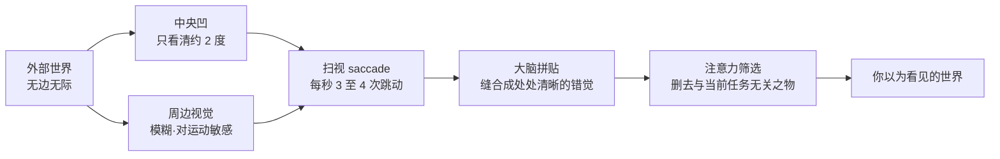

# 第 1 章 看见

> 在按下快门之前，先看见。相机能替你记录，却不能替你停下来。

---

每日清晨推开房门，数不清的物象在视线里流转而过：通勤车窗上凝结的微茫水汽，早餐桌沿一枚微温的瓷杯，电梯按钮旁被无数指尖摩挲光润的黄铜边缘，午间餐单上淡淡的一点油晕，暮色渐沉时街灯下一对低声争执的身影，以及阳台栏杆上正寸寸隐退的最后一抹余晖。这些景象我们分明一一遇见过，然而绝大多数在转瞬之间便湮没无痕，未曾于心底激起半点微澜。

这并非眼眸的迟钝，而是我们的大脑时时刻刻都在进行着冷峻的甄别：它飞速权衡着眼前之物与当下的生计要务是否相关；一旦判定为细枝末节，便悄无声息地将其拂向记忆的边缘。换言之，日常里的“视而不见”，并非生理视觉的残缺，而是注意力在不知疲倦地替我们做着减法。

可总有那么一些画面，出人意料地驻留了下来。究竟是哪一幕得以穿透这层屏蔽，事先往往毫无征兆。或许是阳台上那道将歇未歇的斜阳，或许是街灯下两个人影中身形微瘦者的那一瞥眼神。你并未刻意寻觅，却忽然放缓了脚步，呼吸随之一滞，心底掠过一声极为轻微的叩问：此处似乎有些什么。那声叩问幽微至极，稍一分神，便会随风散去。

那一瞬的驻足，便是“看见”的真正起点。

能否拍出耐读的照片，分野不在于按动快门的频率有多快，亦不在于一日之内捕获了多少张底片，而在于从晨光初起到夜幕低垂，究竟有多少个画面曾真正让你停下来、为之凝视。这种分别在喧嚣的现场往往难以察觉——两人肩并肩站立，同样端着相机，同样在不断寻觅；可一旦归于案头，差别便显露无遗。有人按了数百次快门，却挑不出一张耐看的文件，这多半不是由于拍得太少，反倒是真正停下来深思的时刻太过罕见。那数百次快门的冲动，往往只是出于“此处景致尚好，我也来记下一帧”的浅层好奇，与审美的看见相去甚远。

长于此道的人或许整日只按动二三十次快门，但在每一次指尖下压之前，他的心神都已先完整地停驻过一次：看透了光影深处最牵动自己的那一缕细节，继而审慎地断定这方物象能否被二维平面妥帖容纳。他按下的不是浮泛的好奇，而是一份经过静心思考后的决断。

---

## 一张照片为什么留下来

*Dorothea Lange, "Migrant Mother", 1936。Lange 在加州 Nipomo 的豌豆采摘工营地遇见 Florence Thompson 一家，短暂停留中连续拍了六张；后来成为名作的是这组里最后、构图也最紧的一张。她当时没有记下对方的姓名，只判断这些照片也许能让营地的困境得到关注；这也提醒我们，经典图像背后还存在被摄者身份、处境与叙述权的问题。这张照片后来被广泛复制，成为 20 世纪最容易被辨认的肖像之一。[图片来源与复用说明](image-credits.md#lange-migrant-mother)*

---

## 大脑先删掉了什么

Lange 在那处泥泞营地驻足的十分钟之所以值得细想，是因为对于生活在日常惯性中的大多数人而言，纯粹意义上的“停下来看清”几乎很少真正发生。回到本章开篇的论断：看不见，并非眼眸出了差池。倘若往深处探究，更会触及一个朴素的事实：我们平日自以为将周遭一切尽收眼底，这本身很大程度上便是一种奇妙的错觉。

在人类的视网膜上，真正能够辨析精微细节的区域其实很小。那一处被称为**中央凹**（fovea）的微小凹坑，直径不过一两毫米，密集分布着对色彩与清晰度最敏锐的视锥细胞。唯有目光正正落在此处的事物，才得以享有极高的清晰度与生动色彩。只要视线稍稍偏离这方寸之地，分辨能力便迅速衰退；及至视野边缘，世界只余下朦胧的轮廓与对运动的警觉，色彩亦隐退于灰暗。三者的分工，大致如下表所示：

| 区域 | 大致覆盖的视角 | 分辨能力 |
|---|---|---|
| 中央凹（fovea） | 约 1 至 2 度 | 最高，可分辨约 1 弧分的精细细节 |
| 旁中央凹 | 约 5 度以内 | 迅速衰减，边缘渐趋模糊 |
| 周边视觉 | 水平方向可达约 200 度 | 极低，近乎无色觉，但对动态极其敏感 |

换算为日常的尺度，中央凹所覆盖的清晰区域，大致相当于你将手臂笔直伸向前方、竖起一根拇指，那枚拇指指甲盖所遮蔽的范围。视角的大小，可以通过一个简洁的光学校准公式得出：设物体的物理宽度为 \( S \)，它到眼眸的距离为 \( D \)，那么它在视网膜上所张开的视角 \( \theta \) 满足：

\[ \theta = 2\arctan\frac{S}{2D} \]

一枚指甲盖宽约两厘米，伸直手臂时距离眼眸约六十厘米，将数值代入式中，\( \theta \) 恰好约为两度。这便意味着：在此刻你自以为一览无余的整间屋宇中，真正被视网膜清晰捕获的，永远只有那枚拇指盖般大小的局部，余下的一切皆是粗糙、褪色且含混的背景。

那么，我们为何从未察觉到这份广泛存在的模糊？秘密在于，眼球从未有过片刻的安宁。它正借助一种被称为**扫视**（saccade）的生理机制，以每秒三至四次的频率，迅疾地将那一小块中央凹投向不同的焦点，如同持着一柄极细的手电筒，在暗室里不知疲倦地飞快探照。大脑则在幕后运筹，不动声色地将这一串在时空上并不连贯的清晰碎片，缝缀为一幅看似处处分明、浑然一体的全景图画。

我们眼眸中那个稳固而完满的世界，实则是大脑在毫秒之间实时拼贴、不断填补漏洞的结果，而非一次性整体成像的物理事实。更为幽微的是，在眼球每一次跳跃位移的途中，视觉通路实际上被短暂切断了，否则我们感知到的将是一片天旋地转的拖影——这种生理性屏蔽被称为**扫视抑制**（saccadic suppression）。我们之所以从未觉察到一日之中数以万计的瞬时黑屏，全赖大脑将这些微小的断层悉数抹平。

一旦理解这套精巧的生理机制，我们便更能懂得“注意力在不停做减法”的含义。既然在任何一个瞬间，真正能够享有清晰解析度的物象都少得可怜，大脑就必须时刻替你定夺：下一次该将这支小小的探照灯移向何方；而它所遵循的导航罗盘，正是你此刻最关心的任务。所谓的“看见”，本质上不过是这柄探照灯偶尔挣脱了日常功利的支配，在某个看似无用的角落，多停驻了片刻。

心理学史上有一项著名的经典实验，恰能印证大脑的删减究竟可以决绝到何种地步。1999 年，研究者 Simons 与 Chabris 邀请受试者观看一段录像，要求他们全神贯注地统计画面中白衣队员之间的传球次数。正当众人凝神默数之际，一名身披整套大猩猩玩偶服的人从容穿过场地正中，甚至在镜头前驻足捶胸。事后统计却令人惊讶：近半数的受试者对这只大猩猩的存在毫无知觉。他们的目光分明多次扫过它，视网膜上亦清晰成像，仅仅因为“数传球”的指令里没有大猩猩的位置，注意力便干脆利落地将其从意识中忽略掉了。这一现象在认知科学中被称为**非注意盲视**（inattentional blindness）。

这个实验之所以耐人寻味，是因为它揭示了一个普遍的常态：我们在日常中所错失的动人光景，绝大多数并非藏匿于隐秘之处，恰恰相反，它们往往就坦荡地伫立在正前方；只是由于我们满心挂念着自己的“传球”——那些自以为不可或缺的琐碎目标，便与这些景象擦肩而过。成熟的摄影者与常人的微小分野，往往正在于他拥有随时将手中的“传球”暂且放下的从容，于是那只走过街头的“大猩猩”，才终有被他静静注视的一瞬。

---

## 观看，还是占有

Susan Sontag 在《论摄影》（*On Photography*）中曾写道，拍照不仅是一种事件，更是一种试图占有被摄之物的方式。她所审视与警惕的，并非某一家厂牌的机器，而是拍摄这一行为本身所潜藏的心理变化。人一旦将相机握在手中，心神便极易不由自主地倒向这件机械：急于将眼前之景据为己有，急于确认自己已经成功“拍到”，反而忘却了沉浸其中去细细打量事物本身的肌理。占有悄然取代了凝视，往往正是从这一念之间开始的。

Sontag 写下这些洞见是在 1977 年。彼时的摄影尚裹挟着某种温润的节奏：举机，对焦，下压快门，数日后方能从暗房药水里捧出湿润的相纸。整套动作是舒缓而充满期许的，它在不断提醒你：你正在将眼前的世界转化为平面。正是这道从容的工序，为深入凝视留出了充足的回旋余地。

及至今日，情势已然大为不同。真正切碎我们目光的往往不再是相机，而是无孔不入的移动屏幕。设备一经举起，心神瞬间被分散：一分顾盼屏幕，一分聆听杂音，还有一分早已飞向随后的社交分发；至于真正横亘在眼前的那个鲜活的世界，反倒退居为模糊的背景。一个人举着镜头穿行于街市，一面紧盯着取景框里的自我神态，一面听着自己的独白，还要分心避让身侧的行人；这样的状态更接近内容的生产，与静观万物的澄澈心境已不可同日而语。

然而，相机本身并不必然是观看的阻碍。在许多安静的时刻，它反倒是一剂让心跳慢下来的良药。当眼眸紧紧贴上取景器的刹那，纷杂的世界被一道坚定的框线收拢为一方得以静心端详的二维平面。取景器为你将无边无际的现实，裁切成了一块可以细细凝视的画布。而这道清晰边界的存在，逼迫你直面最根本的决断：在眼前这一整片世界里，究竟该舍弃哪些杂芜，又该留下怎样清晰的筋骨。

初学之时，我们往往对这种割舍心存抗拒。总试图将视线所及的一切全数塞进画面，唯恐漏掉了身侧的同伴，唯恐遗失了远方的楼阁，更担心观者读不懂自己置身何地。唯有经过长时间的摸索，才会渐渐体悟并接纳那个朴素的道理：一张好的画面从来不是累加出来的，而是克制删减的结晶；那些被裁在框外的元素并非损失，恰恰构成了框内主体得以呼吸的空间。按动快门，本质上是一场减法：减去框外无序的世界，将焦平面外的杂乱化为虚实相生的层次，再截取那一瞬的光影，最后沉淀下来的，才是具有生命力的影像。

---

## 从认出到重新看见

漫步于欧洲的美术馆，常能目睹一幕耐人寻味的光景：一群游人簇拥在 Vermeer 的一幅静谧小画前，举起手机，轻触屏幕，低头确认图像已被记录，随即便匆匆转身赶往下一处展厅，整个过程不过数十秒。就物理意义而言，他们确乎已经“看过了”那幅画。然而，倘若在他们转身的瞬间轻声发问：画中那位倒牛奶的妇人，手腕处悬着怎样的微妙曲折？恐怕鲜有人能够从容道出。

这样的举动与真正的凝视相去甚远。它所履行的，不过是确认那幅名作尚在彼处，确认自己曾亲临其境，其性质更接近于在航旅途中发出一句“我已抵达”。同样地，许多人平日里的拍摄，亦不过是一种流于表面的存在登记：证明“我曾来过”，证明“此物确凿”，却未曾触及画面的内里。登记一旦完成，照片的使命便宣告终结；此后它将长久沉睡于存储介质的深处，再无被重新唤醒的机缘。

检验的标准其实极其明确：拍摄数年之后，倘若你发现自己整整一年都未曾由衷地打开过旧日的图库，那么其中尘封的绝大多数记录，多半只是一次次仓促的登记，而非沉静的观看。

从表层的“登记”跨越至深层的“看见”，并无捷径可走，唯有向画面交付足够的时间。时间之所以能重塑视觉，是因为观看本身是层层递进的。只要你肯在一处景致面前多伫立数分钟，第一层浮于表面的标签信息便会如晨雾般缓缓散去，掩映其后的第二层肌理与神韵方能从容浮现。最初你或许只辨识出画中有一个人，凝视片刻，你才依次读懂她的眉宇、她的肩线、她手指用力的沉稳，以及最为关键的——她与身侧那束自窗棂倾泻而下的天光之间，究竟维系着怎样温润的默契。正因如此，在一幅画作前沉浸五分钟，与匆匆掠过三十秒，所得绝非同一幅画；同样地，在一个街角静候十分钟，与拍完即刻转身离去，所邂逅的亦绝非同一座城。

Saul Leiter 自 1952 年起便定居于纽约东村第 10 街的一隅公寓，直至 2013 年去世，六十余年间几乎未曾迁徙。他一生所凝视与定格的，翻来覆去不过是自家窗前的那几条普通街巷：撑着红伞的女子走出街角店铺，黄色的出租车在窗下悄然滑过，白茫茫的蒸汽从路面铁箅子下缓缓升腾，雪后清晨邮差踩着静谧的积雪徐徐前行。他大部分的光阴其实并未急于扣动快门，只是端着咖啡坐在窗前静静守望；直至窗外的色彩、水汽与几何图形在某一刹那严丝合缝地契合了他心底的那道韵律，他才从容举起相机，轻轻按下一格。

在世人普遍认定唯有黑白才配称作严肃摄影的年代，Leiter 便已用彩色胶片去捕获这些日常的诗意。这份超前的敏锐在当时少有人理解，直至晚年，他的作品才被世界重新辨认，被视作早期彩色街头摄影的经典。

Leiter 的从容里，蕴藏着一门比“漫长等待”更为深刻的功课：他所记录的并非远方的奇观，而恰恰是窗下日日相逢的市井。人类对于陌生之境天生怀有本能的警觉与好奇，初抵异地，眼眸不自觉地张大，从地砖的磨损、邮筒的形制到路牌的字体，无一不觉新鲜；然而面对日日穿行的旧路，大脑却反其道而行之：它为了节省精力，往往将这些习以为常之物粗暴地打包成几个现成的概念标签——楼下那家便利店，每日搭乘的班车，归家必经的转角。于是你以为自己依然看见了它们，实则不过是又一次轻车熟路地“认出”了标签而已。“看见”与“认出”，其间横亘着审美的鸿沟。

这种“认出”之所以根深蒂固，是因为我们的大脑本就不是一台如实记录光线的机械传感器；它更像一位习惯抢答的辩手，在感官信号尚未完整抵达之前，便已依据既往的记忆预先抛出了答案。现代认知神经科学越发倾向于揭示：人类的知觉在本质上是一场**预测编码**（predictive processing）的过程。大脑先于潜意识中构建一个关于“此地应当呈现何物”的内部模型，再拿眼眸实时接收的微弱信号进行核验；凡是符合预期的平庸细节便被一概掠过，唯有那些出乎意料的偏离，才会被当作需要耗费精力的新信息来处理。

这套机制极大地庇护了我们免于信息过载的疲惫；但其代价亦同样清晰：凡是你反复踏足、自以为料定无疑的场景，几乎全被这套预测模型所接管，被视作“与昨日别无二致”而径直滤除。你楼下的街角之所以在视线中隐形，并非它失去了光华，而是它太契合你的预设，以至于心灵认定，根本不值得为它再多凝视一眼。

将熟悉之地重新看作异乡，是需要耐心磨砺的心灵功夫；在某种意义上，它远比远赴极地追逐奇观更为不易。异域的新奇感会代你完成大半的审美唤醒；而在熟稔的旧地，没有任何外在的新鲜感可以依凭，一切全赖你亲手拭去心智的尘埃，重新擦亮眼眸。

磨砺之法说来至朴，难在持之以恒的定力：挑选一处你每日必经的寻常转角，在晨昏更迭、晴雨交替的不同时刻，去凝视同一个角落，甚至连续拍摄整整一月。初时几天往往无从下笔，因你目之所及尽是陈旧的标签；但只要让自己一次次重返现场，那些坚固的标签便会在时间的浸润下悄然松动、剥落。光线每日皆在微调，擦肩而过的身影千姿百态；同一堵斑驳的水泥墙，在暴雨如注与斜阳晚照之下，分明是截然不同的两种生命体。

直到某一日，你终于能在一个凝望过百遍的旧地，依然敏锐地捕获到一抹前所未见的光影微澜，你的眼眸才算真正获得了新生。Atget 镜头下的巴黎、Leiter 窗外的东村、森山大道脚下的新宿，无一不是在数十年深情重访中，被反复擦亮的世界。

Eugène Atget 便是将这门功夫践行极深的创作者。自十九世纪末至 1927 年谢世，他背负着沉重的大画幅机身与玻璃底片，在巴黎的大街小巷中独自漫步近三十载，专心记录那些在奥斯曼都市改造洪流中即将消逝的老城痕迹：清晨无人的湿润街角，橱窗里神情幽微的石膏人偶，小酒馆斑驳的锻铁招牌，幽深庭院中一截攀附着藤蔓的栏杆，荒草丛中一尊残破的雕像。他生前近乎隐名，仅以微薄的报酬将这些影像当作供画家与舞台设计师参考的“素材”售出；直至晚年，才被年轻摄影师 Berenice Abbott 辨认出其中沉静的分量，并倾力将这批底片保存于世。他将一整座古老都市重新看作未知的空间，依凭的正是将熟悉之物一次次化为初见的能力。

William Eggleston 则从另一条路径抵达了相近的深度。他毕生所凝视的，尽是美国南部最不起眼的寻常风物：停靠在郊区红砖路边的一辆生锈儿童三轮车，塞满冷冻食品的杂乱冰柜，一间铺满墨绿瓷砖的空荡浴室，以及一间仅悬着一颗裸露灯泡、被漆成深红色的天花板。1976 年，纽约现代艺术博物馆（MoMA）为他举办了一场纯粹由彩色摄影构成的个展，在当时引发了很大讨论，因彼时的艺术界依旧将黑白视作严肃创作的正统，彩色往往被轻视为商业广告与家庭纪念的附庸。

MoMA 在此之前虽已展出过 Ernst Haas、Marie Cosindas 等先驱的彩色探索，但 Eggleston 的这次展览真正成为摄影史上不可绕过的分水岭，它以清晰有力的视觉语言，将平凡琐碎的日常色彩推上了严肃艺术的展台。他后来将这种目光命名为“民主的凝视”（democratic camera）：在他的镜头之下，一辆残破的三轮车与一座宏伟的巴洛克教堂享有平等的尊严，世间万物皆值得被深情打量。所谓民主的观看，正是这样一种毫无偏见的从容：它拒绝预设何者方配入画，从而让那些长久被世人视作平庸、草草放过的物象，在他冷静而温存的注视下重新显现出动人的光彩。[MoMA 对本馆摄影展览史的回顾](references.md#photography-history)翔实记载了这段彩色摄影的历程。

---

## 预判比反应更早

Henri Cartier-Bresson 于 1932 年在巴黎圣拉扎尔火车站后方拍下的那张名作，早已成为摄影史上的标志：一名身着深色西装的男子正飞身跃过一片水洼，身形悬在半空，脚跟即将触碰水面的倒影；而背景斑驳的围栏海报上，恰好印着一名舞者翩然起舞的剪影。几乎所有的摄影教材都会借此阐发何为“决定性瞬间”，然而极少有人深究一个更为根本的前提：在捕获这惊鸿一瞥之前，他究竟在冰冷的水洼旁伫立了多久？

Cartier-Bresson 后来曾回忆过那一刻的实情：车站后方当时立着施工的木板围栏，他将镜头小心翼翼地探入板壁的缝隙之中。缝隙狭窄，画面的左边缘甚至被木板的暗影遮挡了一角。那名腾空跃过积水的男子并非凭空降临，而是摄影师早已将曝光与焦点稳稳设定，静候在透光的缝隙后，凝神等待必然会穿过此处的行者。动人的光影终于降临的那一刻，他才能稳稳接住。这张看似巧合的照片背后，站着漫长笃定的守候；而在守候的前方，更站着一份对于空间、动态与秩序的清醒预判。

“决定性瞬间”的论调在此后常被后人神秘化，本书第 6 章将对其作更具体的剖析。眼下我们只需明晰一点：耐读的画面，极少源于漫无目的的街头游荡。那些将全部希望押注于偶然机缘的人，踏遍千条街道，终究往往空手而归；这并非城市失去了诗意，而是因为他自始至终未曾对现实作出过主动的预判。

预判的能力，依赖两重基石的滋养：其一，是你面对一个场景时，是否肯交付足够从容的时间去细细打量；其二，是你在过往岁月中，是否曾亲手构筑过数以万计相似的空间骨架。前者从今日午后便可沉心践行，而后者绝非一朝一夕之功，它需要数年光阴的磨砺，在反复的凝视中化为身体的直觉。

若论及以海量的拍摄来喂养视觉预判，Garry Winogrand 走得极为坚决。这位纽约街头摄影名家终其一生几乎都在握持相机中度过。兴致勃发之时，他一日便能耗尽十余卷胶卷，穿行于曼哈顿的街巷，将街头流动的众生相一格不落地记录下来。他曾留下一句广为流传的名言，道破了这种近乎执着的拍摄态度：他之所以拍照，是为了看清事物“被拍成照片之后，究竟会呈现出什么模样”。

对于 Winogrand 而言，快门已不再只是记录既定判断的工具，而成为了观看本身的一种手段：借由持续不断的拍摄，逼迫自己持续不断地凝视。他晚年拍摄之甚，以至于在 1984 年离世时，身后留下了两千五百余卷未及冲洗的胶卷，以及数以万计冲洗完毕却未曾细阅、更未曾编辑的接触印样，总计数十万张连他自己都未曾细看过的底片。

这座由底片堆积而成的档案，常被后世评论家视作一种警示，指出其过度泛滥、缺乏克制。然而从另一个维度审视，它恰恰是“预判源于长期积累”的生动注脚。一个人若真切地在街头捕捉过数十万次人性的细节，他对“下一秒此处将发生何事”的直觉预感，必然达到了极高的敏锐度。Winogrand 虽走到了力竭的极端，以至于漫无节制的记录最终压垮了沉静挑选的心力——这亦是我们在后文论及编辑时必须关注的课题；但单就“敏锐的预判源于时间的浇灌”而言，他无疑提供了一个纯粹的范例。

---

### 看见有自己的节奏

真正的看见，有着独属于它自己的舒缓呼吸。

你或许一整天穿行于市井之间，目之所及皆是庸常的车流、玻璃与路阶，万物如水般在眼底滑过，未曾激起一丝波澜。而后，就在某一个再寻常不过的清晨，你正伫立在日日驻足的十字路口静候红灯。晨光初破，斜阳如洗。对面一位身穿浅灰大衣的女子，恰好在一面刚刚被雨水冲刷过、尚且泛着冷蓝水光的玻璃幕墙前驻足；而那面明澈的幕墙深处，恰好倒映着街角楼顶的一抹暖黄。

整个世界仿佛在你的眼眸中静止了下来。

几乎在同一刹那，你心智的齿轮已然无声飞转：你在飞速权衡该选用何等焦段来收拢这份冷暖交织的张力，思忖着自己是否需要向前轻移两步以避开杂乱的立柱；与此同时，你的余光还在留意着左侧穿行而过的单车是否会打破画面的平衡，心底亦在默数着红灯倒计时的最后数秒。

至于在最后的瞬息，你究竟是从容扣动了快门，还是眼看着绿灯亮起、人群散去而终究未曾按下，其实都已退居其次。真正难得的是，在那电光石火的一秒钟里，你是全然“在场”的：你亲眼见证了一幅动人的视觉秩序是如何在日常中悄然萌生，亦清清楚楚地懂得自己为何会被深深打动。一天之中能有这样澄澈的一瞬，便不算虚度；一周之内若能有数次进入这般心无旁骛的凝神境界，摄影的眼光便已在悄然蜕变。

归根结底，一个心智从未真正“在场”的人，即便按下一万次快门，亦无法留下一张具有温度的佳作；而一个真正沉浸其中的人，即便整日只记录下一张，那一帧亦自有一份沉甸甸的分量。

---

## 格式塔如何组织画面

那一瞬画面“静止下来”的契合感，其发生的时间往往比我们的显意识还要早得多。在你尚未来得及用语言剖析自己究竟因何动心之前，你的底层视觉系统早已抢先一步，将眼前这一片混沌交错的光影与线条，悄然归拢为了数个有机统一的整体。

这种先于意识的视觉自组织规律，早在上世纪初便被一批德国心理学家系统揭示，这便是深远的**格式塔心理学**（Gestalt Psychology）。他们发现的核心法则看似至简，却深刻影响了视觉艺术的认知：人类在凝视世界时，从来不是先孤立地辨识一个个零散的点与线再将其拼凑；恰恰相反，知觉一上来所捕获的便是整体，大脑会依据一套内在倾向，本能地将分散的元素编织成秩序。

这些隐秘的规律，我们日日都在不自觉地调动：

*   **相近原则**（proximity）：空间上相互依附靠近的物体，会被视线本能地归结为一个整体。
*   **相似原则**（similarity）：色彩、明度、形状或运动朝向具有共性的元素，会被自动识别为同一谱系。
*   **连续原则**（continuity）：人类的目光偏爱沿着平滑柔顺的轨迹延伸，本能地抗拒突兀生硬的折角断裂。
*   **闭合原则**（closure）：面对并不完整的残缺轮廓，大脑会自动调动想象力将其缺口缝合补齐——几个各缺一角的黑色圆盘若按特定角度排布，中央即便空无一物，眼前亦会清晰浮现出一个纯白无瑕的三角形，这便是著名的卡尼萨三角（Kanizsa triangle）。

这些知觉规律在日常生活中为我们化解了无数认知负担，然而一旦我们举起相机，它们便化作了一柄双刃的利刃。

其善者在于：一幅作品之所以能让观者在一瞬之间“心领神会”，全赖格式塔法则在暗中指引视线——数名行人因站位紧凑而被读作一组群像，一排明窗因几何相似而被凝练为纯净的韵律，一道蜿蜒的栏杆因线条流畅而将目光从容引向远方的地平线。

其险者在于：正因这套组织机制纯属潜意识的自发运作，画面中那些你未曾留意的杂乱元素，同样会被无情地归拢入局——背景中横穿头顶的一根枯燥电线，会在瞬间将两个本不相干的行人捆绑为一体；地面上一道横斜的生硬阴影，会因连续性过强而将观者的目光从真正的主体上强行引开。

构图这门学问，大半心力皆是在与人类视觉系统底层的自组织本能从容博弈。你在取景器前反复微调站位、耐心等待风吹草动，表面上是在摆布那些具体的物象，骨子里实则是在为未来的观者预设一条自然的视线漫游路径：决定他的目光将在何处驻留，又将在何处将万物归拢为纯粹的呼应。

---

## 不带相机的练习

有一个极为质朴的练习，初次尝试之时往往会令人感到无所适从：走出家门漫步之时，索性将所有的相机与镜头留在家中，空手而行。

这项练习的本意，绝非让你白白错失记录的良机，亦非修习某种苦行般的克制；它真正的期许，是将“观看”与“占有”这两件事彻底剥离，让眼眸重新学会一种不带任何功利目的的纯粹凝望。

第一日出门往往会倍感失落，指尖空落无依；行至转角，瞥见一束绝妙的斜阳恰好抚过斑驳的砖墙，身体几乎会本能地探向身侧摸索相机，触及的却只有两手空空。那一刻心头难免会泛起一阵淡淡的怅惘，认定一个难得的画面就此溜走。第二日，这份焦躁便会悄然平复。待到第三日，你多半会惊异地察觉到一个未曾料想的变化：当你彻底放下了拍摄的执念，你所真正看见的世界，反而比以往任何时候都要广阔深邃。

其中的道理并不复杂。当相机悬挂于胸前之时，一旦有景致掠过视线，心智便会在毫秒之间切换至临战状态：飞速计算焦距、测算光比、寻找立足点。这套机械逻辑一旦启动，纯粹的审美凝视便被悄然覆盖；因为从那一刻起，你所注视的已不再是事物本身的生命力，而是它被压缩进感光元件后可能呈现的技术模样。这种带有明确产出目的的注视固然有其专业价值，但它与那种心无杂念、静观万物自得的心境，终究有所不同。

自然，我们不必走向因噎废食的极端。每周择出一两日空手独行便已足矣，其余的光阴依旧可以从容携机、专注创作。那些在空手漫步中未曾被感光芯片记录的光影，固然无法化作具体的作品，但它们会在潜移默化之中悄然重塑你的眼眸：你会深刻记住某种唯有在特定午后才会降临的温润光泽，记住雨后路面上那层细腻的微光反弹，亦会记住市井众生在无所防备时流露出的安详神态。

审美的洞察力，本质上如同一组心灵的肌肉：常加调动，它便愈发敏锐通透；若久置于机械的惯性之中，亦会渐渐趋于麻木迟钝。

---

## 照片为什么需要秘密

Diane Arbus 曾留下一句耐人寻味的警句：“照片是关于秘密的秘密；它向你吐露得越多，你所知晓的反而越少。”（*A photograph is a secret about a secret. The more it tells you, the less you know.*）初读此语，极易将其误解为艺术家的机锋；然而若能将其妥帖安放于心底，历经岁月后再去反复品读，其深意方能慢慢显现。

初涉摄影者的作品，往往失之于倾诉欲过盛。“这是初秋四点的埃菲尔铁塔”，“这是家人生日宴上吹灭的烛火”；在一幅逼仄的画面里，时间、地点、人物与因果被一股脑交代得干干净净，光线往往又处理得格外直白平铺，将每一处角落都照得透亮无余。所有的信息如清单般倾囊相授，毫无遮掩；其结果便是观者在掠过一眼之后便尽收眼底，心灵自然不再产生停留与遐想的渴望。

Arbus 于 1962 年在纽约中央公园拍下的那幅《手持玩具手雷的男孩》（*Child with Toy Hand Grenade*），堪称摄影史上关于留白的经典范本：画面中是一个身形瘦削的小男孩，穿着吊带短裤，右手死死攥着一枚玩具手雷，左手扭曲成抓握状，面孔紧绷着一幅近乎乖张与紧张的神情。

她在当日实际上拍摄了整整一卷胶卷，在其余的画格中，同一个男孩时而舒展欢笑，时而天真歪头，时而与身旁的玩伴嬉戏，皆是寻常天真无邪的孩童模样；然而 Arbus 最终从底片中独独遴选出了这一帧。这张照片几乎未曾交代任何确凿的前因后果：你无法知晓他因何呼喊，不知晓他的双亲此刻身在何处，更辨不清那日的天空究竟是阴云密布还是阳光明媚。

正因它向世界吐露得如此克制，驻足数秒是远远无法看尽的：凝望一分钟，你会去揣摩这具幼小身躯背后所隐喻的情绪张力；凝望至五分钟，你甚至会在那抹乖张的神情里，照见自己童年深处未曾被安抚的孤独。

信息适度留白的画面，往往比信息过载的图景拥有更为持久的吸引力。耐读的作品之所以经得起反复凝视，根本原因正在于此：它们从未将答案粗暴地一次性交付殆尽，永远在光影深处保留着一方供观者心灵栖息与重构的开阔领地。因此，学会包容画面中的幽暗、遮蔽与不言之美，学会有意将叙事的一角留给观者去填补，是每一个创作者走向成熟的必经之路。

---

## 长出自己的眼睛

行文至此，最终要直面的，是独属于你自己的那一双眼眸。

在摄影之路上探索数年之后，许多创作者都会迎来同一个觉醒：原来底片上所显影的，从来不单是外部的客观世界，更是拍摄者内在心境的投射。你会逐渐察觉到，自己总是莫名被某种特定角度的微光所吸引，总是在与对象保持某种特定呼吸距离时才感到心安，亦总是不由自主地在构图中反复建立某几种几何秩序。这并非刻意的模仿，而是你的眼眸在这数载的光阴流转中，已然生长出了它本真的性情。

Saul Leiter 毕生守望着东村的那几条旧街，他的语汇是温润、静谧而略带诗意的：水汽氤氲的玻璃，雨后一柄红色的伞，被霓虹与积雪晕染开的街角；视线常常被一根粗粝的立柱或路人的肩背沉静地切去大半，加之他习惯使用过期的 Kodachrome 胶卷，色调便如被流水冲刷过一般淡雅。

森山大道则长年将东京新宿作为视觉的据点，足迹踏遍列岛，他的镜头却走向了截然相反的另一个方向：粗粝、强烈、逼仄而充满张力——《野犬》中那条在青森三泽清晨回首冷冷瞪视镜头的流浪犬，高跟鞋重重踏过湿漉漉的黑色沥青，颗粒粗重得如同一张砂纸。

即便将这两位创作者的地理位置对调，结果亦不会有根本改变：Leiter 置身于东京，捕获的依然会是一个温润如诗的东京；森山大道漫步于曼哈顿，纽约亦会被他拍成一片粗粝动荡的都市丛林。一位成熟的摄影师所记录的，从来不是某一个具体的地理坐标，而是他凝视这个世界时所秉持的独特心智。

你自然亦拥有独属于你自己的那套审美秩序，只是在当下，身处局中的你未必能清晰辨识它的全貌。能够踏实践行的方法至简至纯：笃定而真诚地拍下去，并在每一年的岁末，举行一场小小的回看——将这一整年中自己最满意的二十张代表作冲印出来，并排铺展于案头，静心端详。

如此沉淀两至三年，某些在不同时空里反复浮现的内在脉络便会自行显露出来。那些历经岁月淘洗依然被你反复选中的光影，便是真实的你自己。而在看清这些重复的印记之后，心智通常会迎来两重交替的演进：一方面，你会更加专注于磨砺这些特质，让作品的辨识度愈发纯粹；另一方面，你又会忍不住向它们发起新的尝试，因为你深知，若一味沉溺于重复熟悉的套路，创作的生命便将走向停滞。这两重力量的推拉与上升，便构成了创作者真正意义上的成熟。

在这条求索的道路上，横亘在心头的问题亦在年复一年地演进。第一年，你最迫切探寻的，是机身各级参数究竟该如何设定；到了第三年，你更渴望理解的，是具体题材的构架与引导之道；而及至第十年，盘旋在心底的追问，多半早已悄然转变为一个更为本质的思考：我究竟在这个世界上凝视着什么？我又为何一次次被这抹光影所打动？

这本书无法代你完成未来的每一步领悟，那一步终究需要你在实践中亲自探索；然而通向那里的台阶与风景，皆已在随后的篇章中为你从容铺展。

---

## 练习

空手漫步一周，不携任何摄影设备。每日向晚，从这一天真正让你心头一动的物象中挑选一幕，在随身手账上认真写下一行字：今日我看见了什么。一周终了，你将收获七行素朴的文字。它们看似微不足道，却是你七次真正“在场”所留下的真实记录。

挑选一本你喜爱的摄影大师经典画册，最好是实体印刷本。每日清晨沉心品读三幅，每幅至少凝神注视两分钟。与此同时，建立严格的选片习惯：在当日拍摄的所有画格中仅挑出一张，并附上一段文字，说明它为何不可替代。坚持一年，你便将拥有三百余幅经过认真挑选的画格。

这两个看似质朴的功课，背后所要培养的实则是同一个至关重要的习惯：让自己在物象面前慢下来，在动人的光影前多停驻片刻。摄影体系中其余一切技艺与直觉，无论是构图的严谨、时机的敏锐，还是暗房的取舍，皆将从这片土壤中自然生长出来。

---

下一章：[第 2 章 光](02-light.md)
