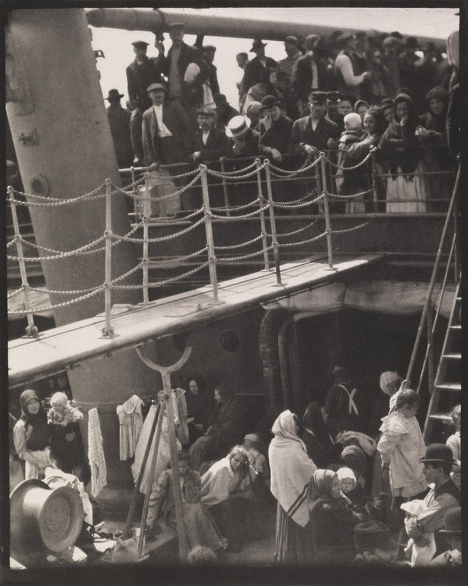
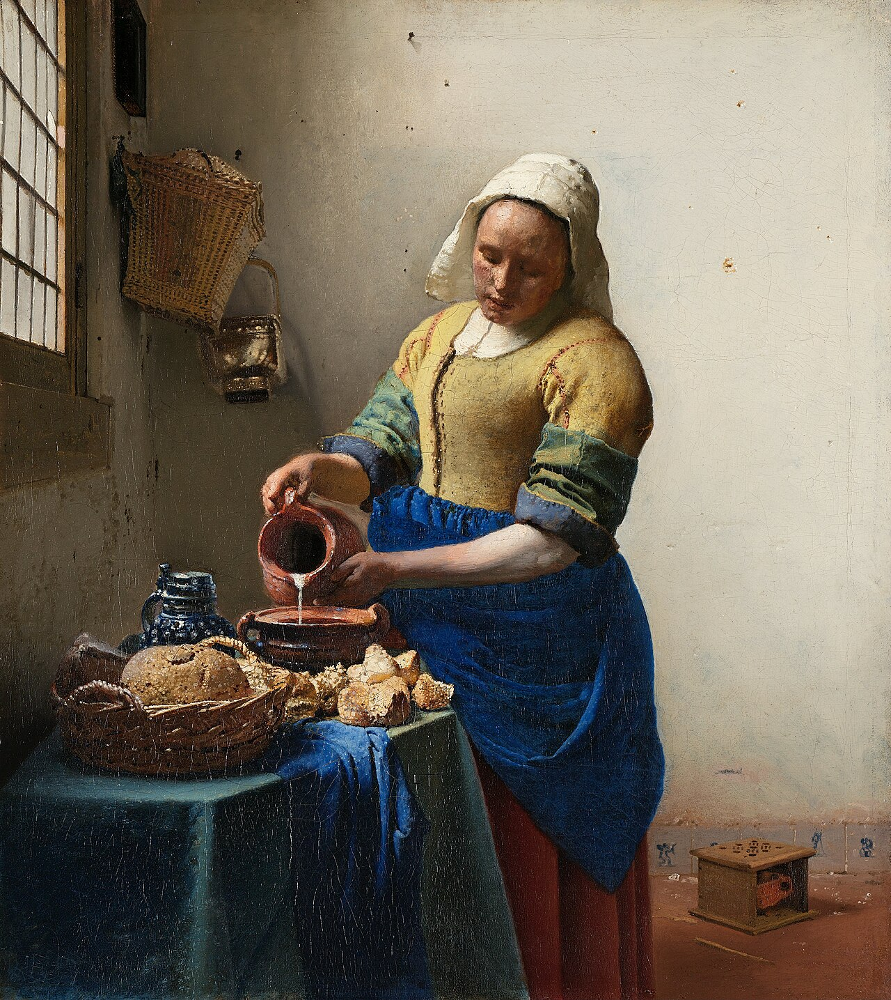

# 第 2 章 光

> 摄影是用光画画。这句话被说烂了，但它仍然是真的。到了现场以后，先别急着问亮度够不够，先看这束光从哪里来，怎样落到人和物上，又能不能把画面里最重要的东西撑起来。

---

你在京都银阁寺院子里站着。深秋的下午已经往傍晚走，一束斜阳穿过院门外那棵老枫树，在白砂庭园上拉出一道金黄。两个穿黑色和服的工作人员背着扫帚经过那道光，脚步不快，身体一会儿落进亮处，一会儿又进到阴影里。

相机在包里，拿出来、开机、举到眼前，都要一点时间。

如果你急着把镜头举起来，把测光交给评价模式，然后立刻按下去，回看时很可能会发现，原本让人停住的金光被相机平均成了不冷不热的中灰，黑色和服浮在一片土黄色的砂面上，刚才那种亮处和暗处交替出现的戏剧感也不见了。

更稳的反应，是在拿相机之前先把光看一遍。光从西边低处斜穿过院子，硬度很高，砂面上被扫过的纹路一条条都很清楚；金光和阴影之间差得很远，曝光不可能两边都照顾得一样舒服；下午晚段的光比正午更黄，角度也更低，黑色衣服一走进去，轮廓会被衬得很清楚。

这些判断不需要想得很慢，却会决定后面所有动作。曝光交给金光区，构图让黑色和服切开那道斜光，工作人员已经进入画面，就不要再等。照片有没有机会成立，其实在相机举起来以前，已经被这几次对光的判断决定了一大半。

---

*Alfred Stieglitz, "The Steerage", 1907。Stieglitz 当时正坐头等舱从纽约去欧洲。船行途中，他走到甲板上，往下看到通往三等舱的钢梯把画面切成两层：上层是头戴硬礼帽的中产阶级，下层是统舱里的移民，绳索、烟囱、白色斜帆把整个空间分成几块。他后来写道，他看到一些形状互相关联，让他感到从未有过的解放。很多摄影史都会把这张照片放在现代摄影开端的位置。光在这里已经不只是照亮甲板，它把空间切开，也把阶层、距离和几何关系一并推到画面里。 (Wikimedia Commons, 公有领域)*

---

摄影师对光的判断，永远走在曝光和构图之前。曝光是在决定这束光怎样被记录下来，构图是在决定它被收进怎样的边界里；这两件事都重要，但它们解决不了更早的问题：眼前这束光能不能让照片成立。一束不合适的光下面，构图再完整也会显得吃力；光本身有力量时，画面即使有一点小缺口，也常常还能站住。

刚开始拍照时，人最容易盯着“够不够亮”和“测光准不准”。这两个问题当然要处理，只是它们太晚了。更值得慢慢练的是在按快门之前，先看光的方向、硬度、反差和颜色。

---

光的方向最容易识别，也最容易被忽略。说“侧光”两个字很简单，在一个场景里三秒内看出这是低角度、左前方三十度来的侧光，就需要练。

太阳在你身后，照到主体正面，就是顺光。顺光最容易曝光，颜色也饱和，所有细节都能被看见。问题正出在这里：没有足够的阴影，画面就很难有体积。

你在故宫前给家人拍合影，为什么常常像证件照？很多时候不是构图出了大问题，而是太阳正对着人脸。脸被均匀照亮，鼻梁没有影子，下巴没有影子，眼窝也没有影子。人脸需要阴影，才会像真实的人脸。没有阴影的人脸，很容易变得像塑料模型。

顺光当然也能用。花、食物、商品这类题材本来就看重颜色和表面细节，正面光常常很方便，樱花、铁板烧、橱窗里的糕点，都可以靠它把颜色稳稳托出来。只是拍人、街头、建筑和风光时，如果全靠顺光，画面经常会缺少体积和层次。

光从主体侧面来，就是侧光。它打到墙上、人脸上、山脊上、椅子上，会沿着光来的方向出现一条过渡：亮，半亮，阴影。这个过渡就是立体感。

刚开始练光时，可以先盯住侧光。下午三点的地铁站口，一个抽烟的男人靠在墙上，太阳从他左侧打来。他半张脸亮，半张脸暗，烟从亮的那边慢慢升起。这样的画面每天都会发生。你以前看到的可能只是一个男人在抽烟，真正值得拍的，是他和这束光之间的关系。

练侧光，可以从看自己的影子开始。影子长，说明光低；影子贴在脚下，说明光高。影子在你的左前方，光就从你的右后方来。这样练久了，在看到画面之前，你已经大致知道光从哪里来，也知道自己应该站到哪里。

---

很多人一开始怕逆光，因为评价测光很容易把主体压成一片黑。可逆光也正因为这种强烈反差，才会带来剪影、轮廓光和空间分离。你不必一上来就避开它，先学会决定曝光交给谁。

逆光最直接的用法是剪影。给天空曝光，主体变成纯黑。人物的脸、衣服颜色、年龄、表情都被抹掉，只剩一道轮廓。剪影的力量就在这种抹掉里。一对在落日里牵手的剪影，往往比一对在落日前微笑的清晰人像更打动人，因为你看不到他们是谁，很多细节由观众自己补上。清晰人像只是在告诉你，两个人在那里度假；剪影会把画面往更大的经验里推。

逆光还能让半透明的东西从内部亮起来。叶子、薄布、玻璃、花瓣、湿头发、被风吹起的裙摆，这些东西在正面光下只是表面，到了逆光里就会发亮。同一片秋天的红枫，顺光下只是红叶；太阳从叶子背后穿过来时，每一片都像被点亮，叶脉也跟着出来，红里能看见橙和金的层次。

第三种是轮廓光。主体头发、肩膀、毛绒外套的边缘，被背后来的光镶上一道亮边，人和背景之间就有了清楚的分离。商业人像常约黄昏，就是因为这半小时天然给你一道金边。让模特背对夕阳，前面用白卡或反光板补一点脸的亮度，头发和肩膀就会自己亮起来。

逆光难在选择。给天空曝光，主体会黑成剪影；给主体曝光，天空会过曝。两边都想保住，最后常常得到一个灰、脏、没有态度的折中。很多逆光照片失败，并不是因为参数算错，而是拍摄现场没有决定这张照片到底要保住哪一边。

---

太阳在头顶，是顶光。眼窝变成两个黑洞，鼻子下面一条横影，下巴下面一片黑。人脸需要阴影，但不需要这样的阴影。11 点到 13 点的太阳，几乎是一天里最不适合拍普通人像的光。

顶光不是绝对不能用。表现压迫感，沙漠、监狱、空旷的水泥地，顶光可以让人觉得无处可躲。表现宗教感，教堂中央从天窗落下来的光柱，也需要顶光。表现酷热感，巴塞罗那七月正午街边等公交的人，顶光也是对的。关键是你得清楚自己在用它做什么。

如果顶光当头，又非拍不可，最快的办法是走进开放阴影。所谓开放阴影，是一栋楼、一道墙、一棵大树投下的大片阴影，头顶没有直射太阳，四周却仍然敞开，天光从各个方向进来。正午把人拉到临街建筑的背阴一侧，原本在脸上挖洞的顶光会立刻消失，剩下柔和、均匀、从四面来的天光。很多看起来像影棚里拍出来的干净人像，其实只是摄影师让人往阴影里挪了三步。

开放阴影也要看方向。阴影里光从哪一侧的开口进来，脸就应该朝那一侧偏一点。如果一边临街、一边贴墙，光会从临街那边斜进来，于是它又变回一束柔和的侧光，立体感还在，只是反差被压到舒服的程度。

再细一点看，阴影并不是纯黑。户外的阴影总有东西在补光：白墙、浅色地面、玻璃幕墙的反射，甚至一地积雪，都会把天光弹回来。同样站在背阴处，旁边是一面白墙还是一道黑栅栏，脸上暗部亮度可以差出一两档。懂得看这一点之后，你会在现场下意识替主体找一块天然反光板。

---

出门前先把一天里的几个光线窗口记住。它们会直接改变你什么时候到现场，什么时候架好相机，也决定你要不要为一张照片多等一会儿。

日出前半小时到十五分钟，是晨蓝调。天还没真亮，蓝色深得发紫，路灯还在亮，街上几乎没人。城市天际线、桥梁、教堂和老街在这段时间会变得安静，建筑内部的灯还亮着，外面的冷蓝没有完全压下来，冷暖关系自然出现。

日出后半小时到一小时，是早黄金。太阳刚翻过地平线，光几乎横着扫过来，颜色金中带粉，每个东西后面都拖着长影子。风光、人像、街头都适合。脸上不会有死阴影，地面有体积，空气里常常还有一层薄雾。

日落前一小时到半小时，是晚黄金。它比早黄金更戏剧，因为一天积累的灰尘和湿气会把太阳过滤得更暖，云也更容易在下午晚段出现层次。光每隔几分钟就会变一次，画面里的色温也跟着走。

日落后十五到三十分钟，是晚蓝调。太阳已经下去，天还没有全黑，城市灯一盏一盏亮起来。白天混乱的街道，灯亮之后会忽然有秩序。夜景最好看的时段，往往不是全黑以后，而是这段还带着蓝的时间。

早晚加起来，一天容易出好光的窗口并不长。风光摄影师愿意在天亮前出门，通常是因为到达、架脚架、试构图、等第一道光落下都需要时间。太阳升起前后的变化很快，几分钟就可能换一层颜色，半小时以后光线也许已经变硬。你如果到现场时才开始找机位，最好的那段光很可能已经过去了。

新手常见的错误，是中午吃完饭才开始拍。下午一点的光通常是这一天最难用的光。整个下午都在补救光不对，注意力自然会被消耗掉。

---

光的品质，也就是硬还是软，取决于光源相对主体有多大。

晴天正午的太阳是硬光。太阳本身巨大，可离我们太远，在地面上看只是一个小光点。它打到墙上，影子像刀切出来。阴天正好相反。云把直射阳光散开，整片天空都变成了一个巨大的柔光箱，光从四面八方来，所以阴影很浅，边缘也软。

新手常嫌阴天光不够。其实阴天的价值不在亮，而在均匀。它会先替你把很多难处理的反差压下来，让人脸、颜色和质地都更容易整理。人像在阴天里常常很讨巧，脸部过渡平滑，没有死黑和死白。秋叶、湿石头、青苔、生锈的金属和深色木头，也常常比晴天更好看，因为直射阳光会把颜色晒薄，而漫射光能让颜色留在它原来的位置。

阴天不适合的，是需要戏剧光的大场景风光，以及依赖硬阴影构成的街头。这两个题材确实更吃晴天。除此之外，很多题材在阴天至少不比晴天差。下次阴天，先别急着把相机放在家里。

窗光是最容易被低估的光。不上灯，不带反光板，免费，安静，随时可用。让主体侧对窗户站，距离窗一两米。窗越大，离主体越近，光越软。阴天的窗光尤其软，因为窗外整片天都在送漫射光。窗外如果是直射阳光，挂一块白窗帘，窗帘会把阳光散开，变成一个巨大的柔光箱。

主体正对窗户时容易眯眼，脸也太平；背对窗户时又很容易变成剪影，除非你本来就想要这个效果。大多数时候，侧对窗户会舒服很多。

---

*Johannes Vermeer，《倒牛奶的女仆》，约 1658。光从画面左侧那扇窗进来，斜打在女仆的额头、手臂和那一股细细的牛奶上，右半边自然落进柔和的阴影。这正是上文说的窗光：大窗、白墙，人侧对着光站。绘画比摄影早两百年，已经把这一套光用熟了。(Rijksmuseum, 公有领域)*

---

硬光不是缺陷，它也是工具。有些题材在软光下会平，有些题材反而需要硬光把力量推出来。

剪影需要硬光。主体在背景前像被切出来一样干净，软光下那种边缘过渡反而会让剪影显得肉。肌理也需要硬光。老人脸上的皱纹、墙面的裂缝、生锈金属上的颗粒、粗麻布的纹路，都靠细小阴影描出来。侧面打下来的硬光，会把每一道凹陷里都填进一笔黑，材质感立刻起来。

Sebastião Salgado 在巴西 Serra Pelada 金矿拍的那组黑白照片，很多就是这种光。赤道下的硬阳光打在工人被黑泥糊住的背、脸和手上，每一块肌肉、每一道汗痕、每一颗泥粒都像浮雕。换成阴天漫射光，那一组就不是那个力量。

黑白也常常需要硬光。反差是黑白的语言。硬光下的彩色片有时显得刺眼，转成黑白之后，那种反差会变成结构。Daido Moriyama 拍新宿、涩谷街头时，并不总是避开中午和下午的直射光。光越硬，画面越粗粝，越接近他要的状态。

硬光不适合的，是需要干净肤色的正面人像，以及许多食物和产品照片。皮肤瑕疵会被强调，高光容易白得难看，阴影也会变粗。

---

光的强度决定 ISO 和快门，反差才真正决定一张照片处理起来难不难。

反差是画面最亮处和最暗处的距离，单位是档。一档，就是亮度差一倍。相机能记录的反差，叫动态范围。现代全画幅大约能记录十四档。也就是说，最亮到最暗如果落在这个范围内，相机能同时给你细节；如果超过这个范围，就要选择保留哪一边。

晴天中午站在阴影里，看阳光下的街道，反差可能有六到八档。这样的场景没有一个能让两边都舒服的“正确曝光”。给阴影曝光，街道会白成一片；给街道曝光，阴影会变成一块黑。取中间值看似安全，最后常常两边都灰、都脏。

刚开始处理这种场景时，人很容易舍不得任何一边，既想要阴影里抽烟的人，也想要阳光下经过的女人，最后得到的往往是两边都没有说清楚的折中。更稳的做法，是先决定画面的主角是谁。主角决定曝光应该交给谁，另一边可以变成剪影，也可以变成纯白，只要这个结果来自现场判断，而不是按完以后才发现救不回来。

两边都重要，就等。等太阳被云挡住一半，反差降下来，你就有机会同时保住。等不到，换角度，或者明天再来。

会看反差的人，站在场景里时，会自动忽略相机根本留不住的部分。肉眼能看见很多细节，相机未必能同时保住。成熟的摄影师看到的，已经接近相机能拍下来的样子。他知道哪些会留下，也知道哪些会消失。

---

色温是光的颜色，单位是 K。烛光大约 1500 到 2000K，钨丝灯 2700 到 3000K，日出日落 3000 到 4000K，下午阳光 5000 到 5500K，正午和阴天会更冷，蓝调时刻可以到 9000K 以上。

拍冬天雪景时，如果相机默认 5500K，阴影里的雪常常发蓝。相机并没有犯错，阴影里的雪反射的是天光，天光本来就偏蓝。也别急着把所有蓝都拉掉。留一点蓝色阴影，往往比把雪全部调成纸白更接近真实雪景。

拍 RAW 时，白平衡只是后期怎样解释数据。Auto WB 通常够用，它给你一个合理起点，回家想改成 5000K 还是 8000K，都不会损画质。JPEG 不一样，白平衡会直接写进像素，后期空间小得多。

混色光是色彩的杀手。一个场景里同时有窗光和钨丝灯，左半边发蓝，右半边发黄，皮肤很容易脏。很多咖啡馆人像看起来不干净，原因就在这里。与其回家以后在后期里反复补救，不如现场关掉其中一种光，或者换一个位置。混色光能避就避，修起来费力，还未必自然。

---

很多好照片都要等。等待并不是站在那里消耗时间，它本来就是拍摄工作的一部分。你等的是光线、人物和环境在某一刻短暂对上，而不是某个从天而降的奇迹。

风光摄影师在一个机位等几个小时很常见。你不必一开始就这么极端，但半小时到一小时的等待，是很正常的拍摄时间。等什么？一片云移到太阳前，把光柔下来一档；太阳从对面建筑后面出来；路灯亮起；烟散开；雾散一半；一辆车经过；一个人走到画面里某个位置。

等的时候也不是站着发呆。可以试机位，试构图，试参数，调三脚架水平，看云怎么走，想好那一刻出现时自己要按哪一个按钮。等到的那一刻，你应该已经知道按完大概是什么样。

很多人按完一张就走，问题是光还在变，人物还在变，刚才那张未必就是最好的那张。Saul Leiter 可以在纽约街头一个店门口等很久，最后留下来的那一张可能成了封面，没留下来的那些照片，观众永远不会看到。

---

光不是抽象概念。要把这一章里的东西带到现场，可以从几个很小的动作开始。

到一个场景，先看阴影。阴影边缘锐，就是硬光；边缘软，就是软光；几乎没阴影，就是漫射。阴影方向告诉你光源位置，阴影长度告诉你光源高度。

把手举到主体位置，绕一圈看。哪个角度手最立体，哪个角度最平，哪个角度最戏剧？主体如果能动，就把人放到那个位置；主体不能动，你自己换位置。

眯眼看场景。眯起眼睛后，细节会被压掉，剩下的是明暗结构。这个结构不好看，细节再多也没用。

拍一张回放时，先别只看好不好看。问自己：主体亮度对吗？阴影是不是太深？高光有没有爆？色温歪不歪？这些问题比“这张有感觉吗”更有用。

再看天空。天空告诉你接下来半小时的光会怎样变。西边有云要遮太阳，日落前那一段光可能就没了；东边云缝透光，接下来可能出现很好的侧光；整片天都被云盖住，就别等戏剧性的阳光了，把它当阴天来拍。

这些动作合起来不需要很久。做得多了，它们会慢慢变成身体反应：你还没有完整地在脑子里说出“侧光、硬光、反差大、偏暖”，脚步和手已经开始往合适的位置移动。所谓光感，最终就是这些小判断反复出现之后留在身体里的反应。

---

## 练习

一周里至少五天，在日出前后或日落前后出门半小时。先不用急着拍很多，可以先说出光从哪里来，硬还是软，反差大不大，颜色偏冷还是偏暖。

下一个阴天，专门出门拍人像、湿石头、咖啡馆窗边的人，或者任何你平时觉得“没有光”的东西。回家看，阴天到底替你省掉了哪些麻烦。

找一个朋友，在下午两三点的窗边拍三十张人像。每十张换一种站位：正对窗、侧对窗、背对窗。回家比较脸上的阴影和眼神光。

出门一上午，一直注意自己的影子在哪、多长、变化多快。练久了，你会在看到照片之前先知道光的方向。

这些练习不是为了把章节里的概念背完整。光感只靠理解没有用，它需要身体记住。走出去的次数够多以后，眼睛才会在你还没有完整思考之前，先一步看见光在哪里。

---

下一章：[第 3 章 曝光](03-exposure.md)
