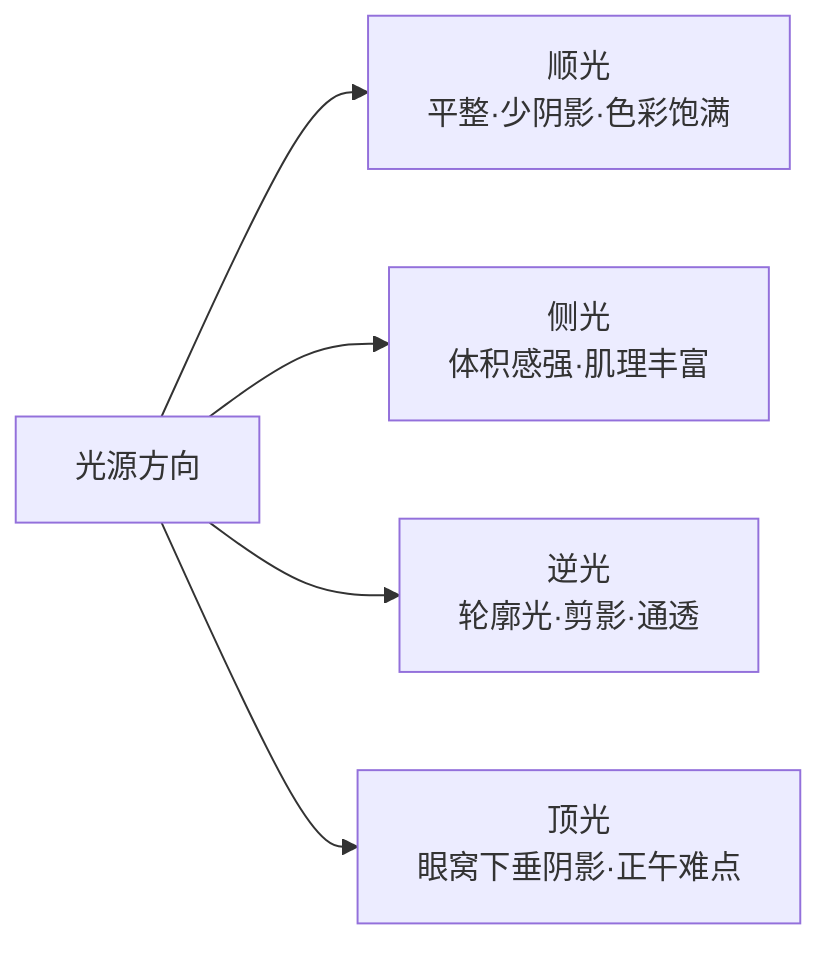
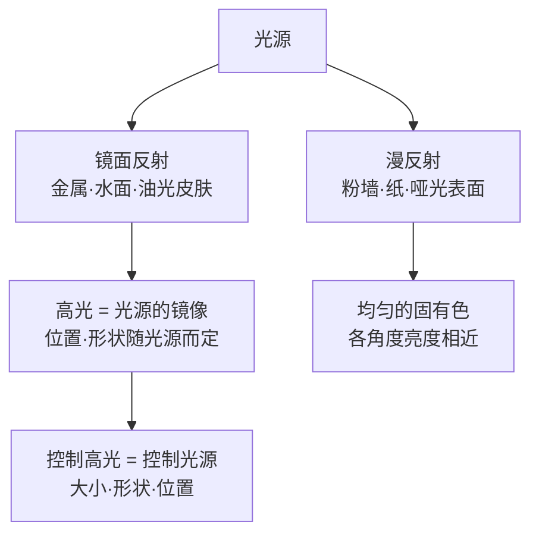
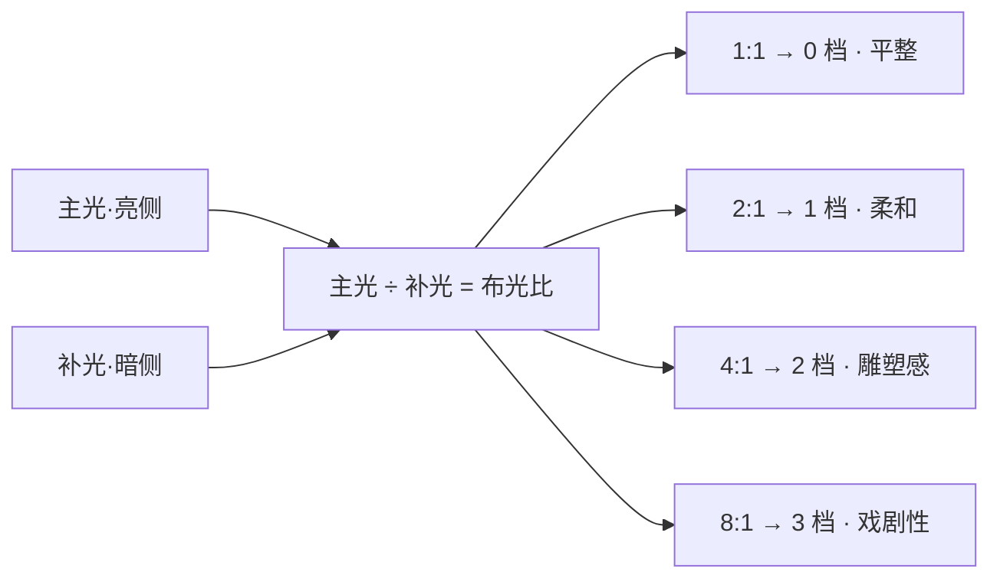

# 第 2 章 光

> 摄影是用光画画。这句箴言虽常被提及，却始终直指本质。置身现场，切勿急于探问照度是否充裕，而应先行研判光线的来向、落于形体之上的塑形效果，以及它能否撑起画面核心的秩序。

---

## 先读光，再读场景

置身京都银阁寺的庭园。深秋的暮色渐次铺展，一道低斜的夕阳穿透山门外的古枫，在白砂铺就的枯山水间投射出凝重的金黄。两名身着黑色和服的庭园职员携竹帚穿行其间，步履沉静，身形在明亮光区与深暗树影中交替穿行。

相机静置于行囊中；取出、开机、举至眼前，皆需数秒间歇。

若仓促举镜，将测光完全托付于评价测光并即刻释放快门，回看时往往会令人失望：原本引人驻足的金黄暖光被算法平均为不冷不热的中灰，黑色和服浮凸于泛黄的砂砾之上，光影交错的戏剧张力被彻底消解。

沉着的操作，始于举机之前对光线的透彻研判。光自西向斜穿庭院，入射角度极低且光质硬朗，白砂上划出的波纹肌理分明；受光区与阴影之间存在巨大的明暗跨度，曝光无法兼顾两端的极致细节；黄昏低角度光线比正午更具暖意，黑色织物步入光束的一瞬，其轮廓将被侧光清晰勾勒。

这些研判在瞬息间便可完成，却主导了后续的所有操作决策：测光基准锁定于金光高光区以保全色彩浓度，构图以黑色和服切入斜射光束为焦点，待人物步入光区的瞬间果断释放快门。画面的成败，在相机举起之前，实则已被这几次对光线的理性审视所确立。

---

### 一张照片里的光线骨架

*Alfred Stieglitz, "The Steerage", 1907。Stieglitz 乘船从纽约去欧洲时，从上层甲板望见统舱区域：钢梯把画面切成两层，绳索、烟囱和白色斜帆又把空间分成几块。旅客的舱位与行动范围让社会差异进入画面，但不能只凭帽子给每个人断定阶级或迁徙身份。Stieglitz 后来尤其强调自己当时看见了形状之间的关系；很多摄影史也因此把这张照片放在现代摄影的重要转折处。光在这里不只照亮甲板，还把空间、距离与几何关系一并推到画面里。[图片来源与复用说明](image-credits.md#stieglitz-steerage)*

---

## 方向先于亮度

摄影师对光线的研判，永远先行于曝光与构图。曝光裁决这束光如何转化为电信号，构图界定它在画幅中的几何边界；两者皆属关键，却无法解答更为前置的问题：眼前的光质能否支撑影像的成立。曝光与构图皆是对既定光线的处理，而光线本身的品相，是先于一切的基准。在缺乏力量的光线下，构图即便严整亦难免生硬；而当光线具备独特的质地与方向时，画面的微小瑕疵亦往往能被光影的厚度所包容。

初涉摄影者极易将注意力局限于“照度是否充足”与“测光是否中准”。这两项考量固然需要解决，但其介入的时序偏于滞后：它们发生于光线已然确立画面基调之后，充其量是对既定局面的被动记录。真正值得潜心磨砺的，是在释放快门前洞悉光线的投射方向、软硬质地、光比反差与色温倾向。这四项维度虽无形体，却在构图成型之前便已奠定了整幅影像的审美基调。

---

### 侧光与顺光

光的方向最易被识别，却也最易被轻忽。“侧光”概念虽简，但在实地场景中于数秒内研判出其为“左前方三十度、低角度斜射侧光”，则需经受严格的视觉训练。投射方向的核心意义，在于它决定了阴影的分布；而阴影的落点与形态，直接奠定了画面的体积与纵深。

在解析各类型光源之前，不妨先将常见的光位进行归纳。光相对于主体的投射方向，大体可划分为四类，每一类皆对应特定的阴影构成与视觉性格：

此图意在确立一个核心意识：面对同一被摄体，光位的迁移必将引发画面性格的剧变。

当光源立于拍摄者身后直射主体正面时，即为顺光。顺光极易完成测光与曝光，色彩还原饱满，表面细节表露无遗。然而局限亦源于此：正面直射将阴影全数驱逐至主体背后，拍摄视角难以捕获明暗过渡。缺乏明暗交界的渐变，物象的立体感便被压缩在均质的明度平面中。

例如在名胜古迹前拍摄纪念肖像，若正对烈日顺光取景，人物面容往往扁平如证件照。其根源往往并非构图失准，而是正面光线将鼻梁两侧、眼窝深处及下颌底部的自然投影悉数填平。人脸的骨骼起伏全赖微小阴影予以界定；阴影一旦丧失，面部体量感随即荡然无存。

顺光在特定题材中亦有其独特价值。花卉微距、静物美馔及商业产品展示往往侧重于固有色与表面肌理的纯净还原，正面光源能够确保色泽均一、反差平缓。然而在人物肖像、街头抓拍、建筑与大画幅风光中，若过度依赖顺光，画面极易陷入层次匮乏的平淡。

当光源自侧向投射而来，即为侧光。无论是拂过墙面、面容、山脊或木椅，光线皆会在向光面至背光面之间形成清晰的明暗过渡：亮部、半明部与阴影。人类双眼正是依靠这种渐变明度推断物体的凹凸与体量，平面画幅因而获得了深度的纵深感。

初练光影洞察，不妨从侧光入手。午后三点，地铁出口处倚墙沉思的行人，日光自其侧方投射，半面明朗而半面沉入阴影，烟气在亮区缓缓升腾。日常场景俯拾皆是，关键在于跳脱单纯的事件记录，洞察物象与侧光交织出的空间雕塑感。

训练对侧光的感知，可从审视自身的投影开始：影长则光低，影缩于足下则光高；影子落于左前方，则光源必源自右后方。久而久之，在举机之前，光线的来向与最佳站位已然在心智中推演成型。

---

### 逆光与轮廓

初学者往往对逆光心存畏惧，源于评价测光容易将主体压为一片死黑。然而逆光所蕴含的强烈明暗反差，恰恰赋予了剪影、轮廓光与主体分离度的表现力，这些皆是顺光无法提供的视觉维度。不必避开逆光，关键在于主动决断曝光的取舍。

逆光最纯粹的表达即是剪影。以亮部天光为测光基准，主体完全沉降为深邃的暗影轮廓。面容细节、衣物色泽与微小表情皆被隐去，仅保留极具辨识度的几何外形。剪影的力量正源于这种信息的剥离：落日余晖中两道相携而行的剪影，往往比正面清晰的留影更具深远意境，它抽离了具体的个体身份，将画面升华为普遍的情感共鸣。

逆光亦能穿透半透明材质，唤醒其内在的通透感。秋日的枫叶、薄纱织物、晶莹器皿或逆光飞扬的发丝，在顺光下仅呈现表面色素，而在逆光穿透下则宛如自发光体，叶脉肌理与色彩层次呈现出丰富的过渡。

第三种运用则是轮廓光。逆向光源沿主体发丝、肩颈或衣物外缘镶嵌上一道明亮的光边，使主体从杂乱深暗的背景中利落剥离。商业人像常选在黄昏时分拍摄，正是为了汲取低角度逆光赋予的黄金轮廓；配合正前方的柔和补光，人物便能兼具通透轮廓与温润神采。

逆光的难点在于取舍的决断。顾及天空细节，主体必沉入剪影；若强行提亮主体，背景天空则不可避免地过度曝光。逆光场景的明暗跨度往往超越传感器的单次宽容极限，必须果断放弃一端。试图两全的折中处理，往往导致画面灰暗浑浊。逆光摄影的失误，鲜少源于参数计算，多源于拍摄者未在现场明确画面的主从秩序。

---

### 顶光与开放阴影

光源高悬于正上方即为顶光。强烈正午日光投射下，眼窝沦为暗黑空洞，鼻底与下颌拖出浓重阴影。人像面容需要阴影塑造体量，却抗拒这种垂直下切的破坏性暗斑。上午十一时至下午一时之间的烈日，向来是常规肖像创作最具挑战的时段。

顶光并非绝对不可用，关键在于是否契合特定情境的表达诉求。在展现旷野荒漠、劳作重压或炙热环境时，顶光能营造出无所遁形的心灵压迫感；在古典建筑或宗教空间中，穹顶垂直倾泻的光柱自上而下，带有肃穆的体量感；在烈日炎炎的南欧街头，正午顶光恰是炽热气候的真实写照。当顶光的物理特质与主题表意高度统一时，它便转化为了无可替代的视觉语言。

若正午时分必须进行人像创作，最有效的应对策略是引入**开放阴影**（open shade）。所谓开放阴影，即建筑背阴面、高墙或树冠遮蔽的大面积阴影区域：头顶隔绝了直射烈日，四周却保持开阔，充盈着来自整个天空穹顶的柔和漫射光。将人物引至临街建筑的背阴处，面部生硬的顶光阴影瞬间消解，转化为均质细腻的柔光。许多看似经由大型柔光箱精细布置的肖像，实则仅是利用了建筑阴影这一天然的控光屏障。

开放阴影亦存在方向性。阴影区域内主要采光开口朝向何方，人物面孔便宜向该方向微倾。若一侧紧贴实体墙面、另一侧面向开阔街道，天光将自街道方向斜射而入，形成柔和的侧向光源，在保全立体感的同时将光比反差控制在宜人的范围。

此外，阴影绝非绝对的死黑。室外阴影中时刻存在环境反射光：浅色地面、玻璃幕墙乃至冬日积雪，皆能将环境光反射回暗部。置身背阴处，邻近是一面白墙还是一道深色栅栏，面部暗部的照度可相差数档。洞察此点，便能在现场敏锐地为主体找寻天然的反光依托。

---

## 一天里的光线窗口

出行前宜在心智中建立清晰的日光窗口时序表。它直接决定了机位勘测的时间、架设脚架的节点，以及守候光线的耐心边界。

日出前三十分钟至十五分钟为**晨蓝调**（blue hour）。破晓未至，天幕深蓝近紫，街灯尚未熄灭，市井静谧无声。城市天际线、跨江桥梁与古老街区在此刻呈现沉稳的秩序，室内透出的钨丝暖光与天际冷蓝并置，构成天然的冷暖光影对话。这种层次在白昼极难复现，因白昼强烈日光会彻底掩盖室内照明的微弱色温。

日出后约一小时为**早黄金时刻**（golden hour）。日光刚跃过地平线，光线以接近水平的角度贴地扫过，色泽金中带粉，物体身后拖出悠长的阴影。近乎水平的投射使其成为天然的绝妙侧光，人像面容无生硬阴影，地面起伏因长影而体量倍增，晨霭更添悠远空间层次。

日落前约一小时至夕阳沉没为**晚黄金时刻**。相较于清晨，傍晚的大气受白昼热对流影响，低空充盈着微尘与水汽，短波蓝紫光被更充分地散射，留存的直射光因而更显浓郁赤金；晚霞云层的层叠变幻，使光线色温在数分钟内便经历剧烈演变，赋予同一机位丰富的色彩变奏。

日落后十五至三十分钟为**晚蓝调**。落日隐入地平线之下，夜幕未完全笼罩，华灯初上。白昼杂乱的街景在暮色中隐退，错落的灯火重新构建出空间的几何秩序。夜景摄影最具质感的时段，往往正是这段保留着天际幽蓝的短暂间歇。

晨昏两端宜于创作的光线窗口极为短暂。专业风光摄影师往往在拂晓前抵达现场，源于勘测机位、校准水平与预判首道光束皆需从容的准备。日出前后的光线质感瞬息万变，半小时后光质便可能转为生硬。若待光线显现方才仓促取景，最具力量的光影瞬间早已悄然流逝。

初学者常犯的误区，是在正午饱餐之后方才启程拍摄。午后一时前后的光线往往最为生硬难测，将精力耗费于弥补光线缺陷，极易在黄昏真正的好光降临时陷入审美疲劳。

---

## 硬光与软光

光线的品质（硬与软），本质上取决于**光源相对于被摄体的视在面积**（角大小）。这是掌控光线性格的核心钥匙：视在光源越大，光质越软；视在光源越小，光质越硬。

晴天正午的烈日属于典型硬光。太阳物理体积虽极其庞大，但因距离地球一亿五千万公里之遥，在地面视角中仅相当于张角约 0.5 度的极小点光源。点光源发出的平行直射光仅能覆盖朝向它的受光面，在墙面与地面投射出如刀切般边缘清晰利落的浓重阴影。阴天则截然相反：云层将直射阳光充分散射，整个天穹转化为巨大的漫射光源，光线自四面八方包覆物象，阴影浅淡且边缘过渡极度柔和。

初学者常视阴天为光线不足的阻碍，实则阴天的价值在于其光质的均质性。它先行削减了严苛的极限反差，使面部过渡平滑自然，无过曝高光或死黑阴影。雨后浸润的秋叶、苔藓、湿石、生锈铁器与深色木质，在漫射光下能呈现出深邃饱满的固有色，摆脱了强光直射下的色彩漂白。

阴天所不适宜的，是需要高反差戏剧张力的大画幅风光，以及依赖坚实几何阴影构建画面的街头抓拍。此两类题材依赖强烈的明暗切割，平淡的漫射光会削弱其结构张力。然而在绝大多数纪实与人像题材中，阴天的柔光皆具备得天独厚的表现力。

窗光则是最易获取却常被低估的高品质光源：无须灯具架设，静谧自然且触手可及。引导主体立于窗边一至两米处，窗户面积越大、主体距窗越近，光质越显柔和，其光学机理与阴天一致，皆源于光源视在角面积的扩大。若窗外直射阳光过于强烈，悬挂一层白色纱帘即可将其转化为大型柔光漫射源。

主体正对窗户取景容易引发眯眼且面部扁平；背对窗户则极易形成剪影。多数情境下，令主体与窗户呈四十五度夹角站位最为舒适：光线自侧前方轻柔漫过，鼻梁一侧明朗、一侧沉入柔和阴影，面部轮廓瞬间立体自洽。

在侧对站位的基础之上，还存在更为精微的朝向抉择：面孔转向窗户还是背离窗户。当面孔微转背离窗户时，朝向相机的为受光较宽的一侧，亮区宽阔而暗区收窄，在人像布光中被称为**宽光**（broad lighting），使面容显得丰满舒展；当面孔转向窗户时，正对镜头的为主体的背光侧，画面主体呈现细腻的阴影渐变，被称为**窄光**（short lighting），能收窄颊部轮廓并加深五官纵深，是古典肖像绘画与经典摄影中最具沉静力量的布光范式。

距离的调整亦构成了调控光比的杠杆。窗户并非理想的点光源，不能机械套用距离平方反比公式；靠近窗户不仅提升照度，更显著增大了视在张角，使光质更为柔和。最稳妥的实践方法是在现场微调半米间距，细致比对鼻影形态与背景亮度的相对平衡。

---

### 窗光

*Johannes Vermeer，《倒牛奶的女仆》，约 1658。光从画面左侧那扇窗进来，斜打在女仆的额头、手臂和那一股细细的牛奶上，右半边自然落进柔和的阴影。这正是上文说的窗光：大窗、白墙，人侧对着光站。绘画比摄影早了近两百年，已经把这一套光用熟了。[图片来源与复用说明](image-credits.md#vermeer-milkmaid)*

---

### 眼神光与反射高光

重审 Vermeer 笔下的那扇窗。当窗光漫过女仆的身形时，亦在眼眸深处凝结出一道微小的光斑，这便是人像神采的核心所在：**眼神光**（catchlight）。

眼神光是光源在眼球角膜湿润曲面上的微缩镜像。眼球表面覆有泪膜且呈微凸弧面，如同一枚精密的凸面镜，将正前方的光源完整倒映于虹膜与瞳孔之间。尽管其物理尺寸微如针芒，肖像的神采与生命感却悉数系于此点。眼中有光，人物便具备凝视的力量；缺乏眼神光，瞳孔深陷为黯淡的孔洞，再精致的五官亦难免流于僵滞。

眼神光的形态忠实映射着光源的物理特征：明窗投射出温润的矩形光斑，边缘柔和且偏于光线来向的一侧；反光板补充出细腻均匀的白光弧面；广袤阴天映射出占据上眼睑的开阔柔和亮区；而在繁华都市夜景中，霓虹与车灯则会碎裂为散乱跳跃的微小光斑。

古典人像技法通常将眼神光引导至表盘十点或两点方位（即眼球斜上方）。其逻辑在于符合人类对天光自上而下投射的视觉习惯；若光源过低导致眼神光坠于瞳孔下缘，面部便会产生戏剧性的诡异阴森感。在窗边调整机位与人物站姿时，凝视模特的眼眸、确认高光落于恰当方位后再释放快门，是极为关键的习惯。

---

#### 硬光不是缺陷

硬光并非缺陷，亦是极具力量的塑形工具。某些题材在漫射软光下易流于平淡，唯有借助硬光方能迸发出雕塑般的体量感。

剪影需要硬光。主体在明亮背景前如利刃切割般清晰，软光的渐变过渡反而会削弱边缘的利落感。肌理呈现同样高度依赖硬光：老者面部的沟壑、斑驳墙面的裂纹、金属构件上的锈迹与粗糙麻布的经纬，皆依赖微小阴影予以勾勒。材质质感本质上是微观凹凸投射出的密集阴影群；唯有硬光能将每一处细小的凹陷填入深沉的暗部。低角度侧向硬光拂过表面，材质的厚重感随即跃然而出。

1986 年 Sebastião Salgado 于巴西 Serra Pelada 露天金矿记录的黑白系列，便是对硬光力量的经典诠释。近赤道的高强度烈日直射于矿工被深色泥浆裹挟的躯体之上，肌肉线条、汗渍流淌与泥沙颗粒呈现出如青铜浮雕般的张力。若置于均质阴天漫射光下，画面的原始冲击力必将大打折扣。

黑白摄影亦高度契合硬光语境。反差是黑白影像的基石。在彩色体系中或显刺目的硬光反差，转化为单色影调后则直接沉淀为画面的几何骨架。森山大道穿行于新宿与涩谷街头时，从不回避正午与午后的直射强光。他源于 1968 年前后聚集于《挑衅》（*Provoke*）杂志周边的先锋摄影群体，该群体以“粗颗粒、晃动、失焦”（アレ・ブレ・ボケ）为美学宣言，主动背离当时追求平整、精致的主流范式。要构建此种美学，硬光构成了不可或缺的前提：直射日光将街道劈裂为明暗交错的几何色块，经由暗房高反差印相处理，中间灰阶被剧烈压缩，高光纯净而阴影深邃，画幅中仅保留强烈的形态与致密颗粒。其传世之作《野犬》中犬只背脊纠结的毛发与沥青地面的粗粝质感，皆倚赖直射日光的雕琢；光质越硬朗，画面的冲击力便越发逼近其核心旨趣。

硬光所不适宜的，是追求细腻肤质的正面肖像以及诸多强调温润质感的商业静物。其成因与肌理呈现互为表里：硬光会无差别地强化表面微小起伏，皮肤瑕疵被过度凸显，高光区易产生生硬的镜面油光，暗部阴影亦显粗糙。

---

## 相对大小决定软硬

光的软硬取决于光源相对于被摄体的视在面积（角大小）。要彻底掌控光质，需进一步厘清两项光学本质：高光形成的机理，以及光源面积如何决定阴影边缘的过渡。

首先审视高光。物体表面对入射光的反射大体遵循两种机制：其一为**镜面反射**（specular reflection），光线遵循入射角等于反射角的几何定律定向反射，常见于光滑金属、水面、玻璃、抛光烤漆以及皮脂湿润的面部区域；其二为**漫反射**（diffuse reflection），光线投射至粗糙表面后向各个方向均匀散射，各观察角度呈现相近的明度，常见于粉刷墙面、纸张及哑光织物。现实物象大多兼具两种反射，人像面部尤为典型：部分光线穿透浅层皮下组织散射后透出，形成温润的固有肤色（漫反射）；另一部分光线则在皮脂油膜上定向反弹，形成清晰的高光点（镜面反射）。

核心洞见在于：画面中呈现的高光亮斑，本质上是光源本身在物体表面的微缩镜像。高光的位置、面积与形态，不取决于被摄物体，而完全由光源决定。金属器皿上延伸的白色亮条，是柔光箱形态被拉伸后的倒影；人物鼻尖的光点，实则是光源在油膜表面的成像。因此，调控高光的本质并非擦除亮区，而是重塑光源：移动光源位置则高光随之位移，扩大光源面积则高光扩散柔化，收缩光源则聚为锐利光点。控光的底层逻辑，始终是对光源形态、视在大小与方位的精准驾驭。

在明晰高光机理之后，进一步量化光质软硬。决定光线柔和度的物理量是光源在被摄体视角中所张开的几何夹角，即光源的**角大小**（angular size）。同一盏控光设备，后撤拉远时视在张角收缩，光质趋硬；逼近主体时视在张角展开，光质转柔。柔光的本质，在于足够宽广的入射角使光线能够从多个方向包覆物体边缘，将本应锐利的阴影边界平滑晕染为渐变过渡。

以此度量日光，其特性便不难理解。太阳物理直径达地球百余倍，然而距地球一点五亿公里之遥，在地面仅张开约 0.5 度的微小视角，相当于两米开外一枚硬币的视在大小。极小的角大小使其物理属性无限逼近点光源，因而晴天直射日光投射出如刀切般的硬质阴影。云层与明窗则截然相反：广阔云穹或邻近的大型落地窗，在主体视角中张开数十度的宽广视角，使光线转化为包覆性的柔光。在室内将人物向窗边移近半米，窗户在面容上的视在张角显著扩大，光质随即更为温润柔和。

针对非金属表面的镜面反光，**偏振镜**（CPL）构成了关键的光学干预工具。光线自水面、玻璃或植物叶片蜡质层斜向反射时，反射光将转化为特定振动方向的偏振光；偏振镜通过阻隔特定振动维度的光栅结构，能够大幅过滤此部分杂乱反光。水面反光消退后水底岩石清晰可辨，橱窗消除倒影后陈设显露，雨后植被剥离白光泛影后色彩深邃饱和。在晴空万里时，由于大气分子散射光亦具偏振性，偏振镜在与太阳呈九十度夹角的天幕区域能够显著压暗天际深蓝、反衬云层体量。使用时需注意两项物理代价：偏振镜会产生一至两档的通光量损耗；在超广角镜头上使用时，天幕压暗仅局限于特定偏振带，易导致天空明度分布不均。此外，光滑金属表面的反射光不具备偏振特性，偏振镜对其无消除效应。

---

## 距离怎样改变照度

光不仅具备方向与质地，更遵循严密的强度衰减法则。对于可视为点光源的发光体，其投射至受光面上的照度遵循**距离平方反比定律**（Inverse-Square Law）：

\[ E \propto \frac{1}{d^2} \]

照度与受光距离的平方呈反比衰减。将光源置于不同间距，主体所接收的相对照度与曝光档位差异如下：

| 光源至被摄体距离 | 相对照度 | 曝光档位差异 |
|---|---|---|
| 1 m | 100% | 设定基准 |
| 1.4 m | 50% | 衰减 1 档 |
| 2 m | 25% | 衰减 2 档 |
| 2.8 m | 12.5% | 衰减 3 档 |
| 4 m | 6.25% | 衰减 4 档 |

此表的核心规律在于：距离每增加一倍，照度断崖式跌落至四分之一（即衰减两档）。这一衰减斜率远超直觉认知。因此，当光源贴近主体时，光线延展至背景的距离衰减速率极快，背景因照度骤降而自然沉入深暗，成为压暗杂乱环境、凸显主体的经典控光手法；反之，将光源后撤拉远，主体与背景之间的相对照度差大幅缩小，空间整体受光趋向均质平缓。平方反比定律构成了调控主体与环境明暗反差的基础杠杆：拉开层次则逼近光源，追求平整匀称则后退光源。

该物理规律不仅适用于影棚人工光源，对于门廊斜光、狭窄窗光或街灯等点状发光体同样严格生效。室内窗边人像创作中，人物向窗前微迈一步或后退半步，面容与背景的明度平衡即刻重构，其底层皆是平方反比定律在发挥效用。

---

### 阳光十六法则

平方反比定律揭示了光线在空间传播中的相对衰减，而在户外旷野中，晴天日光的绝对照度亦具备高度的稳定性，足以在缺乏测光辅助时提供可靠的曝光基准，这便是历经数十年验证的**阳光十六法则**（Sunny 16 Rule）。

其核心表述为：晴天正午直射光下，光圈设定为 f/16 时，基准快门速度约等于当前 ISO 感光度的倒数。例如 ISO 100 时快门速度约为 1/100 秒（就近采用 1/125 秒），ISO 200 时对应 1/200 秒（1/250 秒）。其物理根基在于海平面晴天直射日光的垂直照度在不同地域保持恒定，可作为随身携带的客观标尺：

\[ t \approx \frac{1}{\mathrm{ISO}} \quad (f/16,\ \text{晴天正午}) \]

以 f/16 为基准锚点，根据天候与阴影形态梯次开大光圈，即可推演出严密的户外曝光对照体系。现场判断无须仪器，观察被摄物投影的清晰度即可确定：

| 天候环境 | 投影形态特征 | 基准光圈（快门速度≈1/ISO） |
|---|---|---|
| 积雪原野 / 白沙海滩 | 投影极其坚实且短促，地表眩光强烈 | f/22 |
| 晴空万里 | 投影轮廓边缘清晰锐利 | f/16 |
| 薄云掩日 | 投影边缘略显弥散模糊 | f/11 |
| 均质阴天 | 投影浅淡，轮廓依稀可辨 | f/8 |
| 浓云密布 | 投影完全消解于漫射之中 | f/5.6 |
| 建筑开放阴影 / 落日地平线 | 完全无投影分布 | f/4 |

现代机身测光系统虽已极尽精密，阳光十六法则依然具备不可替代的价值：首先在极端雪景、大面积逆光等容易诱导测光系统误判的场景中，它能提供绝对客观的曝光基准；其次，它促使拍摄者在心智中将天候形态、阴影边缘与曝光参数深度锚定，形成抬眼观天即知参数区间的敏锐直觉。

---

## 反差决定处理难度

光的绝对照度决定快门与感光度的设定，而场景的**明暗反差**（光比）才真正决定画面影调处理的复杂度。

反差是指场景中最亮高光区与最深阴影区之间的明度跨度，通常以曝光档位衡量（每相差一档代表照度翻倍）。传感器在特定信噪比阈值下所能完整记录的最大明暗跨度即为**动态范围**，其数值随感光度设定、RAW 编码模式及传感器工艺而动态变化。现场曝光研判的核心，在于确立重要高光区是否溢出截断，以及关键暗部是否保留可用信噪比。

晴天正午立于门廊阴影中审视烈日街道，由向光白墙至骑楼深处的动态跨度常高达六至八档以上。此类场景不存在能兼顾全局的所谓“完美平均曝光”：迁就阴影细节则街道高光彻底过曝漂白；锁定街道亮度则阴影深陷于死黑噪点之中。机械选取中间值往往导致两端皆呈现灰暗浑浊。

面对极限反差场景，首要决断在于确立画面的叙事主体。主体位置决定测光基准，非主体区域或果断沉入剪影，或从容让渡为高调留白；唯有源于自觉研判的取舍，方能在成片中呈现坚定的影调秩序。

若画面要求兼顾明暗两端，可守候云层遮蔽日光，借助天穹漫射降低场景反差；亦可微调机位视角、借助反光设备补光、实施包围曝光堆栈，或在平整地平线场景中使用渐变灰滤镜（GND）。若客观条件皆不具备，则应清醒认知当前光线无法承载预设构思，适时调整取景重点。

善于洞悉反差的创作者，在审视场景时会自动过滤超出传感器记录宽容度的冗余信息。肉眼能同时辨析强烈光影下的微光细节，源于人眼视觉系统并非单次曝光成像：瞳孔随注视点实时缩放，视网膜感知增益动态调整，大脑实时拼贴出明暗兼具的全景感知。成熟摄影师的目光能主动模拟传感器的物理边界，在释放快门前便已清晰预判出哪些层次将被舍弃、哪些结构将有力留存。

---

### 用布光比描述反差

自然场景的反差往往只能被动适应，而一旦引入人工干预（如窗边设置反光板或在空间内布置辅助光源），明暗反差便转化为可主动编排的变量。摄影体系中用于精确量化这一关系的参量即为**布光比**（lighting ratio），通常指主光照射区与辅光填充区在被摄体上的照度之比。

布光比以比例数值呈现，换算为曝光语言即为档位阶梯：照度相差一倍对应一档跨度。1:1 代表两侧照度均等（相差 0 档），面容呈现均质平光；2:1 代表明暗相差 1 档，暗部呈现轻微渐变，影调温润；4:1 代表相差 2 档，明暗分明且体量感坚实；8:1 则相差 3 档，暗部大幅下沉，呈现深沉的戏剧张力。

| 布光比 | 主光与辅光照度差 | 面部视觉感知特征 |
|---|---|---|
| 1:1 | 0 档 | 均质平光，几无立体过渡，适用于高调妆容与严谨证件记录 |
| 2:1 | 1 档 | 过渡极其柔和，五官微有起伏，适用于温润的日常肖像 |
| 3:1 | 约 1.5 档 | 古典肖像经典配比，面部圆润而富有纵深 |
| 4:1 | 2 档 | 骨骼轮廓分明，反差硬朗，适用于情绪浓烈的肖像 |
| 8:1 | 3 档 | 暗部深沉浓重，低调硬朗，具强烈的叙事张力 |

需要明确的是光学计算的口径差异：严格的光学定义中，受光面实际接收主光与辅光的叠加照度，背光面仅接收辅光，因此“辅光弱于主光两档”对应的亮暗总照度比实为 (4+1):1（即 5:1）；影棚实践中常沿用主光与辅光输出强度的直接对比。两者数值偏差约半档，理解其物理原理即可从容应对。初涉人像创作易陷入 1:1 的平光安全区，光线虽稳妥却缺乏性格；要塑造鲜明的形体张力，通常需将光比推向 3:1 或 4:1，通过主侧偏光建立立体骨架，辅以适度补光保留暗部肌理。

实地研判光比无须繁琐测算：先观察单一主光投射下暗部的自然沉降，再引入补光设备观察暗部被提亮的阶梯。在窗边拍摄时，靠窗侧为主光，背窗侧的明度完全取决于对侧墙面或反光板的回弹效率。人物向室内深处推移，暗部逐步加深，光比由 2:1 渐次拉开至 8:1；适时在暗侧架设白卡，比值即刻收拢回稳。

光比决定明暗跨度的大小，而光位则决定阴影在形体上勾勒的几何形态。同样维持 4:1 的光比反差，光源自侧上方与正上方投射，面部阴影形态截然不同。人像布光传统中确立了数种经典的阴影几何范式：
- **伦勃朗光**（Rembrandt lighting）：主光置于面部斜前方约四十五度、略高于视线水平，鼻影与颊影连成一体，仅在背光侧颧骨处保留倒三角形光斑，影调深沉凝重；
- **环形光**（loop lighting）：主光角度收浅，鼻底投射出向下微弯的小环状阴影且不与颊影粘连，普适而精致；
- **蝴蝶光**（butterfly lighting）：主光高悬于面部正前方上方，鼻底投射出对称的蝶形阴影，凸显颧骨轮廓并收窄下颌；
- **分割光**（split lighting）：主光置于正侧方九十度，将面部清晰平分为明暗两半，戏剧张力极强。

结合前述的宽光与窄光朝向，便构成了完整的人像用光词汇库：布光比界定反差跨度，光位界定阴影形态，二者交织方能精准雕琢面孔的神采。

这些布光范式绝非影棚专属。落地窗光、街灯、室内吊灯等具明确方向性的环境光源，皆在物象表面投射出上述几何形态，其差异仅在于影棚中光源依从人物布局，实地拍摄中则是人物顺应光影定位。人工闪光灯与常亮光源同样遵循此套物理逻辑：它们实则是可受控调配的人造光源，其投射方位、视在张角与传播距离皆可由创作者裁决（加设柔光罩以扩大张角，拉远距离以利用平方反比衰减，跳闪天花板以重构漫射天穹）。

---

## 色温与白平衡

色温量化了光线的色彩倾向，单位为开尔文（K）。数值越低，光谱能量越偏向长波红黄（暖调）；数值越高，能量越偏向短波蓝紫（冷调）。烛光色温约为 1800–2000K，钨丝灯约为 2700–3200K，日出日落贴近地平线时约为 2000–3000K，日光升起后逐步升至 4000K 以上，午后阳光约为 5000–5500K，正午日光与阴天更为冷冽，暮色蓝调时刻可攀升至 9000K 以上。

| 光源类型 | 典型色温区间（约） |
|---|---|
| 烛火微光 | 1800–2000 K |
| 白炽灯 / 传统钨丝灯 | 2700–3200 K |
| 日出 / 日落（贴近地平线） | 2000–3000 K |
| 日出后 / 日落前约一小时 | 3500–4500 K |
| 上午 / 午后的斜射阳光 | 5000–5500 K |
| 正午直射日光 | 5500–6500 K |
| 均质阴天漫射光 | 6500–7500 K |
| 建筑阴影 / 晴空蓝天光 | 7500–10000 K |

相机白平衡机制执行的是逆向补偿运算：它依据预设的色温基准，向互补色方向施加色彩偏移，旨在将目标色温还原为中性纯白。若将相机设定为低色温基准，系统将注入冷蓝以抵消偏暖色调；若设定为高色温基准，则注入暖黄以中和冷蓝倾向。

掌握色温刻度，现场偏色的物理成因便一目了然。黄金时刻之所以泛着浓郁暖金，因日光色温处于低数值区间；而建筑阴影中的人像之所以泛青发冷，源于背阴处的主导光源已转换为天穹散射的极高色温天光。

色温仅界定了色彩在暖橙至冷蓝轴线上的分布，而现实光谱还存在与其垂直的第二维度：**色调**（tint，绿至品红轴线）。热辐射光源（太阳、烛火、白炽灯）的光谱连续分布于黑体轨迹之上，仅凭色温即可精确描述；而非热辐射光源（荧光灯、低显色指数 LED、高压水银灯）光谱存在离散断裂，常整体带有绿色偏色，必须协同调节色调滑块向品红轴向补偿方能校准中性色彩。后期软件中白平衡工具并列设置色温与色调双滑块，正是为了在二维色彩空间中完整定位光源的真实光谱。

冬日雪景拍摄中，若相机维持 5500K 白平衡，阴影中的积雪必呈现幽蓝。此非测光失误，阴影积雪反射的正是高色温的蓝天天光；保留适度幽蓝阴影，往往比强行校准为纸白更具冰雪的冷冽质感。

拍摄 RAW 格式时，白平衡仅作为元数据供后期解析，自动白平衡（Auto WB）能提供稳妥的预览基准，后期无损重构色温空间；若直出 JPEG，白平衡运算将固化于像素矩阵中，大幅压缩后期色彩调校的宽容度。

混色光源是色彩纯净度的大敌。当同一场景中窗口漫射冷光与室内钨丝暖灯交织，主体受光面呈现剧烈冷暖撕裂，肤色极易显得灰脏。两类光源不仅色温相异，色调轴亦往往无法重合，单一白平衡设定注定顾此失彼。面对复杂混合光源，现场关闭冲突灯具、调整机位规避杂光，远比后期繁复的分区修饰更为高效自洽。

---

### 天空光与大气散射

晴朗户外环境中，照亮万物的实则是双重光源的协同运作：

其一为直射日光，源自天际的高亮度点光源，光质硬朗、方向明确且偏暖，负责塑造高光结构与坚实投影；其二为**天空光**（skylight），源自整个天穹的漫射光源，光质柔和、无明确方向且偏冷，持续填充并浸润阴影区域。背阴处物象的照度与色彩，完全由这第二重天穹漫射光源所赋予。

天幕之所以呈现幽蓝、阴影之所以泛青，其根源在于日光穿透大气层时发生的**瑞利散射**（Rayleigh scattering）。日光由不同波长的连续光谱构成，短波蓝紫光的散射截面远大于长波红黄光，其散射强度与波长的四次方成反比：

\[ I \propto \frac{1}{\lambda^4} \]

蓝光波长约仅为红光的三分之二，按四次方反比计算，其在大气中的散射强度高出数倍。短波蓝光被空气分子频繁散射至整个天穹，构成了蔚蓝的天幕。天幕漫射光本身偏蓝，投射于背阴处的物象自然蒙上一层青蓝冷调。在第 4 章探讨色彩关系时，这一物理机制将反复显现：直射日光覆盖区偏暖，天空漫射覆盖区偏冷，画面天然形成了宏阔的冷暖互补秩序。

同一散射规律亦阐释了晨昏时刻光线泛红的机理。太阳贴近地平线时，日光斜穿大气层的物理路径大幅拉长，短波蓝绿光在漫长旅途中被散射殆尽，抵达地表的留存光束主要由穿透力强烈的长波红黄光构成，万物因而被镀上浓郁的暖金。

大气介质不仅塑造色彩，亦在空间维度构筑**大气透视**（aerial perspective）。空气中悬浮的水汽与微尘对光线进行二次散射，使远景物象随距离增加而逐步衰减明暗反差、饱和度降低并蒙上淡淡青灰。大画幅山水摄影中重峦叠嶂层层退晕的悠远意境，正源于此种物理效应。雾气弥漫之日更是将大气透视推向极致，杂乱背景被天然软化，空间层次自成秩序。当空气悬浮微粒密度适中且光线斜射穿透时，光路本身显影为清晰的光柱结构，即**丁达尔效应**（Tyndall effect）。捕捉此种光影奇观，需具备两个前置条件：空气中富含雾气、烟尘或水汽介质，且机位必须处于逆光或侧逆光角度。

---

## 等待也是拍摄

经典影像的诞生往往伴随着漫长而专注的守候。等待绝非时间的虚掷，它本身即是影像创作的核心环节。创作者所守候的，是光线流转、物象形态与环境节奏在某一节点上的精妙咬合。

风光摄影中数小时的机位守候极为普遍，纪实拍摄中半小时至一小时的专注等待亦属常态：守候云层遮蔽强光以柔化反差，守候斜阳穿透建筑峡谷，守候暮色中街灯渐次点亮，守候晨雾在日光下缓缓消散，抑或守候特定人物步入预设的光影框架。

守候的过程充盈着严密的预先推演：微调机位视角、校准水平阻尼、推敲构图边缘、预判云层漂移轨迹，并在心智中演练快门触发的瞬间。当秩序成型的那一刻降临，一切操作皆能从容完成。

盲目按下一张即刻撤离，往往错失了光影演进的最佳形态。专业创作中存在“深耕场景”（work the scene）的严谨准则：一旦确认特定光影与空间具备深耕价值，便应围绕该轴心反复变换透视、调整距离、静候动态要素切入，穷尽其视觉潜能。Saul Leiter 对此展现了极具定力的示范：他常被一扇凝结水汽的玻璃窗、立于雪地的红伞或雨棚投下的几何阴影所吸引，随后在临近处沉静守候，直至行人、车辆或哈出的白汽恰如其分地步入这层光影秩序之中。最终传世的单张杰作，背后沉淀着对光影演进的深度守候与取舍。

---

## 把光感练成反应

光影研判绝非抽象的理论推演。要将本章的认知转化为现场直觉，可依循以下微小动作展开训练：

1. **观察阴影边界**：阴影是光线在三维世界投射的形态印记。阴影边缘锐利则为硬光，边缘弥散柔和则为软光，几无阴影则为全向漫射；阴影走向指明光源方位，投影长短揭示光源高度。
2. **手部模型参照**：将手掌置于主体受光位置环形转动。手掌与主体处于同等光照环境之中，观察哪个方位手部形体最为立体、哪个角度最为平整。主体可调动时依据该直觉调整站位，主体固定时则依此调整自身机位。
3. **微眯双眼审视**：眯起双眼能够有效过滤细碎的表层纹理，使视野聚焦于核心的宏观明暗架构。决定画面视觉冲击力的核心往往在于宏观影调的骨架；若底层明暗结构松散，细节再丰富亦难挽颓势。
4. **理性回放反思**：检视即时回放时跳脱模糊的“感觉”评价，代之以具体的理性追问：主体曝光是否落于合理区间、暗部阴影是否过度沉陷、核心高光是否产生截断溢出、色彩色温是否存在异常偏差。明确的追问能够直接指引下一张曝光的参数微调。
5. **研读天幕演变**：天穹云层预示着后续光线的演进：西侧厚云逼近预示着落日黄金光即将消退，云隙透光预示着局部光斑即将显现，浓云密布则提示应转入柔和阴天的影调构思。

经过持续的针对性训练，这些研判将内化为深层的肌肉记忆：尚未在意识中完成概念切分，脚步与双手已然朝向最佳的光影点位从容位移。所谓的光影直觉，正是海量理性判断千锤百炼后沉淀的本能反应。

---

## 练习

1. 连续一周选择五日在日出前后或日落前后外出观察半小时。无须急于频繁拍摄，尝试口头清晰描述眼前光线的投射方位、软硬质地、明暗反差以及色温冷暖倾向。
2. 选定一个均质阴天，专注拍摄人像肖像、雨后湿石、咖啡馆临窗人物等题材，深入体会漫射柔光在控制极端反差与保留材质固有色方面的天然优势。
3. 邀请同伴于午后斜阳时分在室内窗边完成一组人像拍摄。每十张切换一组朝向（正对窗光、侧对窗光、背对窗光），归来并置比对面部的阴影过渡与眼神光形态。
4. 漫步半日，持续感知自身投影的方位、长度与动态演变。久而久之，在端起相机前即可凭直觉锁定光线的来向。

这些练习的核心在于让光学规律融入知觉本能。唯有经历深度的实地感知，双眼方能在举机之前先一步洞察光影的脉络。

---

下一章：[第 3 章 曝光](03-exposure.md)
