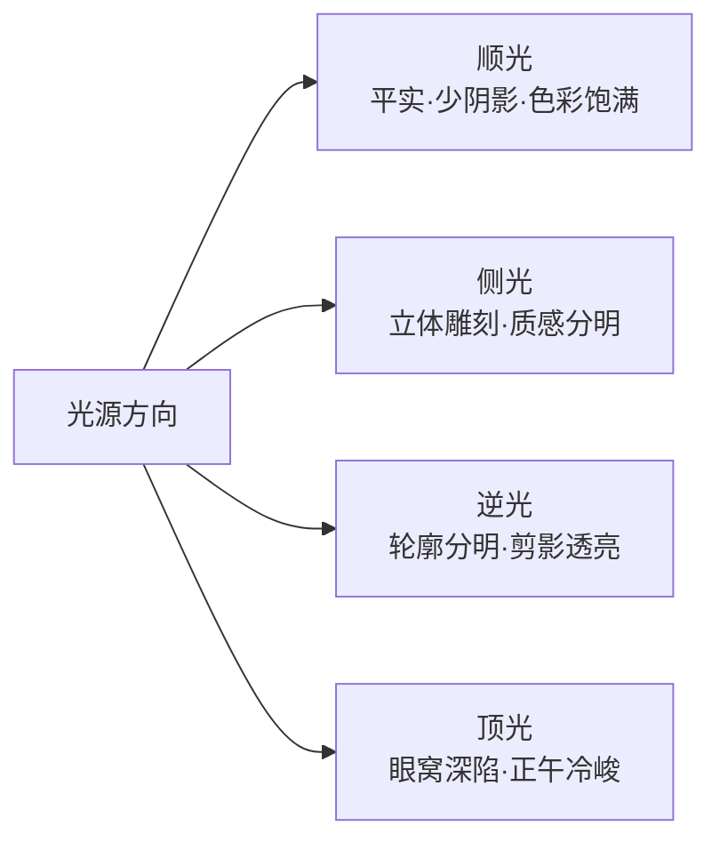
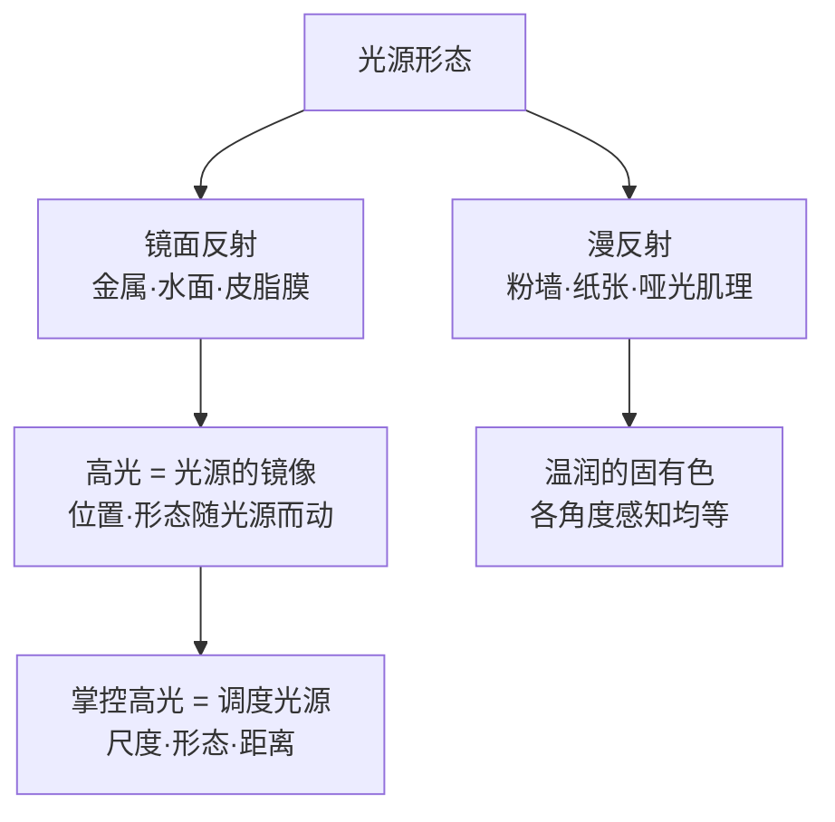

# 第 2 章 光

> 摄影是用光线作画。这句古老的譬喻被重复了多次，依然是摄影的真理。置身现场之时，先别急于询问亮度是否充裕，而应静心看清：这束光自何方照来，如何落在人物与物象的起伏之上，又是否足以将画面中最核心的骨架撑持起来。

---

## 先读光，再读场景

设想你正置身于深秋向晚的京都银阁寺。斜阳穿过庭门外一株老枫的疏影，在苍白静穆的砂石庭园上，横斜拉开一道温热的澄金。两名身着深色和服的僧役肩负竹帚徐徐行过，步履从容，身形在明暗交割的边界间缓缓穿行。

相机尚在行囊之中，取机、开机、贴紧取景框，不过数秒的光景。

倘若你只是仓促举起镜头，将曝光全然托付给相机的评价测光并即刻压下快门，回看时往往会心生落寞：那道令你心动的斜阳金辉，已被测光系统妥协折算为一抹平淡的灰黄；原本深沉的深色和服泛起浮光，砂纹与暗影间那份分明的明暗节奏，亦在机械的平均曝光中消散殆尽。

更从容的应对，是在指尖触碰快门之前，先用目光将这束光重新打量一遍：光自西天低处横穿庭院，质地坚挺，砂石被细细耙洗过的波纹清晰分明；受光面与阴影之间隔着巨大的明暗反差，任何试图两头讨好的曝光，最终都会沦为毫无力度的平庸。斜阳偏晚，色泽比正午更为醇厚泛金，角度极低，深色衣料一旦步入其间，剪影轮廓便会被勾勒得十分利落。

这些直觉的审视无需耗费太久，却在暗中定下了随后的全盘操作。将测光交给那道金光，任由和服的剪影切碎光芒，待行者步入关键位置便果断定格——在相机举起之前，属于这张照片的骨架，早已在你的凝视中悄然成型。

---

### 一张照片里的光线骨架

*Alfred Stieglitz, "The Steerage", 1907。Stieglitz 乘船从纽约去欧洲时，从上层甲板望见统舱区域：钢梯把画面切成两层，绳索、烟囱和白色斜帆又把空间分成几块。旅客的舱位与行动范围让社会差异进入画面，但不能只凭帽子给每个人断定阶级或迁徙身份。Stieglitz 后来尤其强调自己当时看见了形状之间的关系；很多摄影史也因此把这张照片放在现代摄影的重要转折处。光在这里不只照亮甲板，还把空间、距离与几何关系一并推到画面里。[图片来源与复用说明](image-credits.md#stieglitz-steerage)*

---

## 方向先于亮度

成熟的创作者对于光的洞察，永远先于曝光与构图。曝光决定的是这束光该如何被感光介质记录，构图决定的是它被收拢进怎样的二维边界；这两件事固然重要，却皆无法回答更前置的命题：眼前这束光，究竟能否成全一幅有说服力的作品。

曝光与构图皆是在雕琢一束既定的光，而光本身的品质与形态，则是立于它们之前的第一道关口。在一束平庸死板的光线下，构图再精巧亦难掩其疲态；而在光线富有特性的时刻，画面纵使留有一丝不经意的瑕疵，往往亦能从容立住。

初涉摄影之时，心神极易被“环境够不够亮”与“测光是否标准”所牵绊。这两个技术考量自然不可或缺，只是它们发生在光线早已决定了画面性格之后，充其量是在为既成之局做技术注脚。真正值得长久磨砺的心智，是在按动快门之前，先辨明光的方向、硬度、反差与色温。这四项特质在尚未举机之时，便已为整幅画面铺就了底色。

---

### 侧光与顺光

光的方向最易被辨识，却也最常被草率忽略。说出“侧光”二字看似简单，但在短时间内准确辨别出一束自左前方三十度、低斜倾泻而下的光线，则需要眼眸经历长期的训练。方向之所以重要，是因为它决定了阴影的位置；而阴影的落点，几乎决定了二维画面能否呈现出逼真的三维体积感。

在逐一剖析各类光线之前，不妨将常见的四种基本光位铺陈开来。光线相对主体的来向，大致可归为四大类，每一类皆对应着一套独特的阴影分布，亦赋予画面截然不同的气质：

这幅图景旨在点明一个核心机理：对于同一个主体，光源的方位更迭一次，画面的气质便随之改变一回。

当太阳悬于拍摄者身后、正正照射在被摄主体正面之时，便是顺光（正面光）。顺光最利于技术测光，色彩浓郁饱和，表面的细节皆能清晰显现。然而其隐患亦恰恰根植于此：光线既然笔直地落在正面，所有的阴影便全被推至主体的正后方，从拍摄机位望去几不可见。画面失去了由亮至暗的细腻过渡，而视觉上的体积感与空间深度，恰恰源自这层渐变。缺少了阴影的勾勒，万物被均匀地压平在同一明度层级之上，空间便难以展现出层次。

我们在古建筑前为亲友留影，成品往往流于扁平的记录感，症结往往并非构图失当，而是烈日正正打在面颊之上。整张面孔被毫无保留地照亮，鼻梁身侧无影，下巴下方无影，眼窝深处亦无影。人类五官原本依赖这些细微起伏的暗部来显现立体轮廓：鼻梁因一侧的阴影而挺拔，眼眸因眉骨投下的微光而显深邃。一旦阴影被顺光填平，面容便如被压平了一层，失去了生动的起伏。

顺光自有用武之地。花卉、美食、精巧的器物，这类题材本就倚重纯净的固有色与平滑的纹理，正面光往往能将花瓣的色泽、器物的材质表现得十分清澈。这是因为此类物象的魅力本在表面色彩与细节，顺光既能将色调与细节交代得一览无余，反倒恰如其分。然而在刻画人物、漫步街头、凝视建筑与自然之时，若全盘依赖顺光，画面极易显得平淡。

当光线自被摄主体侧方照来，便是侧光。它落在墙垣、面颊、山脊与林木上，会顺着光线的方向拉开一条过渡链：高光、中灰、暗部。人类的知觉正是依凭着这道由明至暗的光影渐变，在瞬间判断出物象的起伏与形态；因此这道过渡一旦出现，二维平面便获得了纵深感。

初练用光，不妨多观察侧光。下午三点的地铁出口，一名行者倚靠在砖墙旁，斜阳自他左侧低低照来。半侧面庞沐浴在光芒中，另半侧则隐于暗部，烟气在亮侧缓缓升腾。以往你眼中或许只看见一个伫立的身影，而摄影的眼光，看见的则是这具身躯与这束侧光之间所形成的明暗对比。

揣摩侧光，可以从观察脚下的阴影起步。影子修长，说明光源低斜；影子紧贴足尖，说明烈日当头。影子在左前方，光线便在右后方。如此反复观察，在尚未举机之前，你便已然在心底知晓光自何处来，自己的脚步又该迈向何方。

---

### 逆光与轮廓

初学者往往对逆光心存犹豫，因相机的自动测光在强烈的逆光下极易将主体压成一片深暗。然而，逆光之所以吸引人，恰恰在于这份明显反差所带来的剪影形态、轮廓光线与空间层次，而这些是平淡的顺光所不具备的。

强烈的反差是逆光的核心特征。我们无需急于规避它，而应首先在心底决定：究竟将曝光的主导权交付给谁。

逆光最纯粹的形态便是剪影。将曝光对准明亮的天空，被摄主体便化作纯粹的剪影。人物的细碎神态、衣饰色彩在此刻隐退，唯余下一道清晰的形体轮廓。剪影的力量，恰恰蕴藏在这份概括之中。暮色里，一对携手漫步的剪影，往往比一张面目清晰的照片更为耐人寻味——因为观者看不清具体的面容，所有的细节都被留给观者用心灵去补全。清晰的肖像讲述着具体个人的片段；而安静的剪影，则更容易引向普遍的情感共鸣。

逆光亦能让半透明的物象从内部被点亮。薄薄的秋叶、轻盈的织物、发梢、在风中飘动的裙摆，这些物象在正面光下不过是寻常的表面，一旦置于逆光之中，光线便会穿透其纤维与肌理，使其显现出通透的光感。同一株秋日的枫树，顺光之下是一树红叶；当夕阳穿透叶脉而来，每一枚枫叶清晰可见其细密的纹络，展现出丰富的层次。

第三种形态则是轮廓光（边缘光）。主体发梢、肩线与衣物的边缘，被身后照来的光线勾勒出一道清晰的亮边，人物便从杂乱昏暗的背景中被清晰地分离开来。人像拍摄常常偏爱黄昏前夕，正是利用这半小时的低角度光线。令被摄者背向落日，身前只需借助微弱的环境反光补足暗部细节，发丝与肩臂便会泛起自然的轮廓光。

逆光的难处在于明确的取舍。若迁就天空，主体必然偏暗；若强求面孔通亮，天空势必过曝成白茫茫一片。逆光场景的动态范围往往超出传感器单次采样的范围，必须有所取舍。若两头皆想完全保全，往往只会得到一张灰暗平淡的折中。逆光画面的关键，不在于繁琐的计算，而在于现场拍摄者是否想清楚了——这一张照片，究竟要以哪一部分为主。

---

### 顶光与开放阴影

当太阳高悬于头顶正中，便是严苛的顶光。眼窝容易出现深陷的阴影，鼻梁之下留有明显的短影，下巴下方亦是一片暗色。人类的面部需要阴影的修饰，但正午顶光的阴影垂直向下，容易落在眼眶、鼻底与唇下，遮蔽面部原有的神采。上午十一时至午后一时之间的直射日光，是一天之中最难拍摄常规肖像的时段。

然而，顶光并非完全不可使用，关键在于你是否清楚自己想表达什么。若旨在表现荒原的严酷、烈日下的干渴或水泥地上的空旷感，顶光能够去掉多余的修饰，将人物置于脚下那一小团阴影之中。若要刻画盛夏的炎热，烈日下街角候车者的疲惫，顶光正是表现这种燥热最真实的光线。在寻常人像中的缺点，一旦与特定的表达意图相契合，反倒成为了有力的工具。

倘若烈日当头而又需要拍摄人像，最稳妥的办法便是步入**开放阴影**（open shade）。所谓开放阴影，是指由高大建筑、树荫或长廊投下的阴凉区域：头顶遮挡了刺眼的直射日光，四周却依然向天空敞开，天光自各个方向柔和漫射而来。正午时分将人物引至建筑背阴的一侧，原本在脸上投下生硬暗影的顶光即刻消散，取而代之的是均匀柔和的漫射天光。许多在户外拍摄的纯净肖像，往往只是让拍摄对象向阴影深处退了几步而已。

身处开放阴影之中，亦需观察光的来向。阴影空间哪一侧的开口更为开阔，面庞便应向那一侧微微侧转。若一侧紧贴高墙、另一侧通向开阔街道，天光便会自临街方向斜斜漫入，阴影之中便又形成了柔和的侧光，立体感得以保留，而反差则处于舒适的范围之内。

细加观察，阴影深处亦非绝对的漆黑。自然环境中处处皆有反射面：浅色的墙面、地砖、玻璃幕墙的漫反射，乃至地面的积雪，皆在将光线反射回暗部。同样伫立在背阴之处，身侧是一面白墙还是一道深色铁栅，面部暗部的亮度可相差一至两档。明白了这一点，置身现场之时，你的目光便会下意识地为拍摄对象寻找身旁的天然反射面。

---

## 一天里的光线窗口

出行之前，理应熟悉一天之中光影流转的几个主要时间段。它们直接决定了你该在何时抵达现场、何时准备机位，亦决定了是否值得为某一刻的光线驻足等待。

日出前半小时至十五分钟，是静谧的**晨蓝调**。天色尚未全亮，天空呈现出深沉的青蓝，街灯依旧在晨曦中亮着，街面少有行人。城市的天际线、大桥、建筑与街巷，在这段光阴里展现出安静的气氛。建筑室内的暖光，与室外深沉的冷蓝形成自然的冷暖对照。这种对照在白天难以见到，因为白天日光过亮，室内较弱的灯光无法在画面中显出色彩。

日出后的一小时左右，是柔和的**早黄金**。朝阳刚刚升起，光线贴着地表照来，色泽温润泛金，物体身后拖曳着柔和的长影。正因光线角度很低，它便成为了自然的侧光，风光、肖像与街头皆宜。面部不会留下生硬的阴影，地面与建筑因长影而富有起伏，晨间空气中往往带着清透的水汽。

日落前约一小时至夕阳西沉，是醇厚的**晚黄金**。它比清晨更为浓郁，因为白天的空气对流将尘埃与水汽带入了低空；傍晚的斜阳穿透厚厚的大气层，短波光被散射滤除，余下的光线便显得比清晨更为红润醇厚。晚霞在云层间变化，光影每隔几分钟便改变一次色调，同一个机位在半小时内足以呈现出截然不同的氛围。

日落后的十五至三十分钟，是**晚蓝调**。落日沉入地平线之下，夜幕尚未完全降临，城市的灯火陆续点亮。白天杂乱的街道，在华灯初上之时会显现出清晰的层次：杂乱的细节沉入蓝调阴影中，只留下温暖的灯火勾勒出画面的轮廓。夜景最为耐读的时刻，往往并非漆黑的深夜，而恰恰定格在这段冷蓝犹存的黄昏余韵之中。

朝夕相加，一天之中最宜人的光线窗口其实相当短暂。风光摄影师在破晓前出发，是因为赶路、选位、试拍与等待朝阳皆需时间。太阳升起的前后几分钟，天色瞬息万变，半小时后光线便逐渐变硬。倘若抵达现场才匆忙寻找机位，最合适的光线往往已经过去。

初学者容易陷入的误区，是在正午饱餐之后才动身出发。午后一时前后的光线，往往是一天之中反差最硬的时段。整整一个下午都在应付生硬的光线，精力被消耗，待到傍晚柔和的天光降临之时，人反倒已经有些疲惫。

---

## 硬光与软光

光的质感——究竟是凌厉（硬光），还是柔和（软光）——核心的物理依据，在于光源相对被摄主体而言所占据的空间视角。这是一条清晰的法则：**光源相对尺寸越大，光线越柔和；光源相对尺寸越小，光线越坚硬。**

晴天正午的烈日是典型的硬光。太阳本身的物理体积巨大，但因其距离地球一亿五千万公里，在地面仰望，它在视界中只是一个微小的光点。光线自这样一个小点直射而来，只能照亮面向它的一侧；投在地面上，阴影边缘十分清晰。

阴天则走向了相反的方向。厚厚的云层将直射的日光漫射开来，整片天空成为了一只巨大的柔光箱；光线自四面八方包围而来，轻柔地绕过物体的各个侧面，因而阴影很浅，明暗交界的边缘非常柔和。

初学摄影者常觉得阴天光线平淡。其实阴天的价值在于包容。它先替你将强烈生硬的反差抚平，使得面部的起伏、色彩的细腻层次与物象的质感皆得以展现。肖像在阴天里往往展现出温润的质感，肤色过渡平滑，既不缺乏细节亦不过曝。深秋的落叶、雨后的石板路、苔藓、旧木材，在阴天里往往展现出丰富的细节，因为直射的烈日会使色彩发白，而漫射的天光能让色彩保持其本来的浓度。

阴天不适合的，是需要强烈明暗对比的风光，以及依赖硬朗阴影构建几何线条的街头快照。这两类题材依赖坚硬的明暗对比来产生视觉冲击；阴天将反差压平之后，那种硬朗的节奏感便减弱了。除此之外，绝大多数题材在漫射天光下皆能展现出安静的层次。

在所有自然光线中，窗光是最易使用的一种。无需昂贵的灯具与繁琐的附件，柔和且随时可用。令被摄者侧向窗户而立，距离窗台一至两米。窗户越大，距离人物越近，光线便越发柔和，其机理与阴天一致——皆是光源在主体视野中所占的有效面积变大了。阴天的窗光格外柔润，因为窗外整片天空都在提供漫射光；倘若窗外是直射阳光，挂上一层薄白纱帘，便能将日光柔化，变成大面积的柔光。

主体若正对窗户，容易因刺眼而眯起眼睛，面部也显得平淡；若背对窗户，则容易变成剪影。在绝大多数情况下，侧对窗户是更合适的姿态。设想在咖啡馆靠窗的位置为同伴拍摄肖像：请他将座椅稍作调整，使面庞与窗户呈约四十五度角；光线便自侧前方照来，鼻梁一侧明亮、一侧留有柔和的阴影，整张面孔的轮廓便清晰地显现出来。

侧对光源之后，还有一个方向的选择：是让面孔朝向窗户，还是背离窗户。

当面庞朝向远离窗户的一侧时，受光的那半侧脸颊便正对相机镜头，画面中亮面较大、阴影较窄，在人像用光术语中被称为**宽光**（broad lighting）。宽光会让面容显得开朗，视觉上略有丰满感。

反之，当面庞朝向窗户深处时，正对镜头的则是背光的那半侧脸颊，画面大半由细腻的阴影过渡所主导，这便是**窄光**（short lighting）。窄光在视觉上能够收窄面庞，五官的高低起伏在阴影的衬托下更显立体，古典油画肖像多以此立骨。同一扇窗，同一副面容，侧转二十度的细微差别，呈现在画格中的，便是两种不同的情绪。

人物前后移动的距离，亦是调节反差的方式。靠近窗户时，窗在人物视野中的有效视角更广，光质更为柔和明澈；同时人物与室内背景至窗台的相对距离亦在变化，配合室内浅色墙面的反射，可以微调明暗反差。最为实用的方法，是请被摄者前后微调半步，亲眼在取景框中观察鼻影的形态、暗部的层次与背景的明暗，由此定夺位置。

---

### 窗光

*Johannes Vermeer，《倒牛奶的女仆》，约 1658。光从画面左侧那扇窗进来，斜打在女仆的额头、手臂和那一股细细的牛奶上，右半边自然落进柔和的阴影。这正是上文说的窗光：大窗、白墙，人侧对着光站。绘画比摄影早了近两百年，已经把这一套光用熟了。[图片来源与复用说明](image-credits.md#vermeer-milkmaid)*

---

### 眼神光与反射高光

回到 Vermeer 笔下的那扇窗。窗光落在女仆的面庞与臂膀上时，还在她眼眸中点亮了一点微光。

这一星微光，便是**眼神光**（catchlight）。

眼神光本质上是光源在眼球表面形成的镜面反射高光。眼球表面覆盖着一层泪膜，其微凸的弧面如同一面小巧的凸面镜，将眼前的光源倒映在瞳孔与虹膜之间。它虽微小，却直接关系到肖像的神态。瞳孔中有光闪烁，人物便显得专注有神；若缺少这点微光，眼部容易显得暗淡无神。许多后期修图将面部过度磨皮，容易误将这抹眼神光擦除，导致神情失去灵气。

眼神光的形状，如实反映着光源的轮廓。高大的窗户在眼中倒映出的，是一块边界柔和的方形亮斑，位置偏于光源一侧，这也是窗边人像显得温和自然的原因。反光板带来的是规整的亮斑，能为主体背光侧的眼睛补充神采。阴天的漫射天空留下的，则是一片柔和的微光，使神情显得宁静。而到了夜间闹市，霓虹与灯火会在瞳孔中形成多处细小的光斑，眼神随之显得生动。

常规肖像多将眼神光安排在时钟十点或两点的位置，即眼眸的斜上方。这符合人类习惯于光自上方照来的视觉习惯；若光源过低，眼神光落在瞳孔下缘，面部容易显出从下往上照射的不自然感。在窗边拍摄时，观察对方的眼睛，待眼神光处于合适的位置，再按下快门。

---

### 硬光不是缺陷

坚硬的光线并非缺点，它同样是表现物象的有效手段。有些题材在软光下显得平淡，唯有硬朗的光线方能将其力量感体现出来。

剪影需要硬光的干脆。主体在明亮背景前轮廓清晰，软光柔和的边缘过渡反而会削弱剪影的利落感。

物象的肌理更需要硬光的雕刻。饱经风霜的面部皱纹、水泥墙面的纹理、锈迹斑斑的铁器、粗麻布料的纹路，全依赖细小阴影的勾画方能显现。所谓“质感”，本质上是微小起伏在受光面投下的细密阴影；坚硬的光线在凹陷处留下清晰的暗部，材质感便随之清晰起来。

Sebastião Salgado 于 1986 年在巴西塞拉佩拉达（Serra Pelada）露天金矿拍摄的黑白作品，大半皆沐浴在这类硬光之中。直射的烈日照在沾满泥浆的矿工脊背、面庞与双手上，肌肉的轮廓与泥沙的颗粒在画面中十分凸显。倘若换成阴天的柔和漫射光，那种强烈的现场力量便会减弱许多。

黑白摄影与硬光天然契合。反差是黑白语言的重要基础。在彩色照片中容易显得刺眼的直射强光，一旦剥离了色彩干扰转为黑白，强烈的明暗对比便转化为清晰的视觉结构。

森山大道在东京街头拍摄，从不避开正午的烈日。他深受 1968 年前后《挑衅》（*Provoke*）杂志的影响，将“粗颗粒、晃动、失焦”作为视觉探索，向传统平滑精致的画质发起挑战。

要实现这种视觉张力，硬光是重要的基础：正午的直射强光将街道划分为明确的明与暗，再经过高反差的暗房处理，中间灰阶被压缩，画面中留下坚硬的黑白对比与粗粝的颗粒感。他著名的《野犬》，皮毛的杂乱与路面碎石的粗糙，全靠强硬的光线支撑。光线越是硬朗，画面越显粗粝，便越贴近他所想表达的都市氛围。

硬光不适宜的，是需要呈现细腻肤质的柔美肖像，以及许多静物与美食题材。硬光会加深每一处起伏，皮肤表面的瑕疵容易被放大，高光容易形成反光，阴影亦显得生硬。

---

## 相对大小决定软硬

光质的软硬，取决于光源相对主体而言所占据的有效视角。这一现象背后有两个清晰的物理机理：一是高光的形成，二是阴影边缘的软化。

高光的生成遵循两种基本的反射路径：

其一是**镜面反射**（specular reflection）：入射角等于反射角，光线规整地反射向特定方向；金属、平静水面、玻璃、光滑漆面以及带皮脂的皮肤皆符合此规律。

其二是**漫反射**（diffuse reflection）：光线落在微观粗糙的表面上，被细微颗粒打散，向四面八方散射开来；无论从何种角度观察，亮度皆相差无几；白墙、纸张、哑光棉麻织物皆属此类。

现实中的绝大多数物象，皆是这两种反射的结合。人类皮肤尤为典型：一部分光线穿透表皮在浅层组织中漫射出来，形成均匀温和的固有肤色，这是漫反射；另一部分光线在皮脂表面直接反射，形成微小的亮斑，这是镜面反射。

关键在于：画面中的高光，本质上正是**光源本身在物体表面上的微缩镜像**。高光的位置、形状与大小，是由光源的形态决定的。金属杯壁上的长条银光，是长形柔光箱在曲面上的倒影；鼻尖上的亮点，是灯体在皮肤表面的反光。

因此，控制高光并非试图去消除光斑，而是从源头上调整光源：改变光源位置，高光随之移动；扩大光源面积，高光随之柔化变大；缩小光源面积，高光则聚拢为小点。

决定光线软硬的，并非光源本身的绝对尺寸，而是它在被摄主体眼中所形成的有效视角，即光源的**角大小**（angular size）。同一盏影室灯，退到数米之外，在人物眼中显得很小，光质便十分坚硬；将其移至近前，灯体在人物眼中占据很大范围，光线便显得柔和。软光的本质，是光源相对主体拥有足够大的视角，使光线能够从不同角度照向物体的侧面，将阴影边缘自然过渡开来。

以太阳为例：太阳直径虽大，但因其距离地球一亿五千万公里，在地面观察，其角大小仅约 0.5 度，相当于在两米半外看一枚硬币。视角如此微小，相当于一个点光源，因此晴天直射阳光是典型的硬光，阴影边缘非常分明。

而云层与大窗则相反：一片厚云、整片阴天的天空、紧挨人物的大落地窗，虽然物理尺寸有限，但因距离主体很近，在主体视角中所占的范围很大，于是直射光被漫射为均匀的软光。在窗边让人物靠近窗台半步，窗户在面庞上的有效视角变大，光质随即柔和一分，原因正在于此。

在应对镜面反射时，**偏振镜**（CPL）是一项实用的工具。当自然光以一定角度照射在水面、玻璃、叶片等非金属表面并反射时，反射光会产生偏振；偏振镜能够过滤特定振动方向的光线，旋转镜框至合适角度，便能消除大部分水面或玻璃的反光。

由此，水面反光减弱，水底的景物清晰显现；橱窗的倒影减少，内部陈列清晰可见；叶片表面的泛白反光被过滤，植物本来的翠绿得以还原。

偏振镜亦可用于压暗蓝天：晴朗蓝天中与太阳呈九十度角的方向，偏振光最为明显，旋转偏振镜能使天空显得更为深蓝，衬托出白云的层次。

使用偏振镜需要注意：其一，它会减少约一至两档进光量；其二，在超广角镜头上使用时，因视野过宽，容易在天空中留下深浅不一的偏振带。此外，金属表面的反光不产生偏振，偏振镜无法消除。

---

## 距离怎样改变照度

光线的物理强度在空间中的衰减，对于点光源而言，严格遵循**反平方定律**（Inverse-square Law）：

\[ E \propto \frac{1}{d^2} \]

照度与距离的平方成反比。将同一盏固定功率的光源置于不同距离，主体接收到的照度会明显下降：

| 光源至被摄物的距离 | 相对照度 | 曝光相差档位 |
|---|---|---|
| 1 m | 100% | 基准照度 |
| 1.4 m | 50% | 衰减 1 档 |
| 2 m | 25% | 衰减 2 档 |
| 2.8 m | 12.5% | 衰减 3 档 |
| 4 m | 6.25% | 衰减 4 档 |

规律清晰可见：**距离每增加一倍，照度下降至四分之一，即减少整整两档曝光。**

因此，当光源非常靠近主体时，光线越过主体到达背景的距离较远，衰减非常迅速，背景容易变暗。将光源靠近主体，是压暗杂乱背景、突出主体的常用方法。

反之，若将光源移远，光线在主体与背景之间的衰减比例变小，整个空间更容易被均匀照亮。反平方定律是调节前后景反差的核心工具：若想拉开明暗层次，让光源靠近主体；若想让整体光线均匀，让光源退后。

这一规律适用于有明确位置的光源。一扇窗、一盏路灯、室内吊灯，皆遵循这一衰减趋势。在窗边拍摄肖像，前后移动半步，人物与身后墙面的明暗关系便会有所变化。

---

### 光比与反差

光比指受光面（亮部）与背光面（暗部）的照度比例：

| 光比 | 亮暗落差档位 | 视觉特征与适用场景 |
|---|---|---|
| 1:1 | 0 档 | 无阴影、平实记录、商业证件照 |
| 2:1 | 1 档 | 极柔和、淡雅肖像、自然日常感 |
| 4:1 | 2 档 | 经典肖像、层次清晰、体积感舒适 |
| 8:1 | 3 档 | 戏剧反差、性格刻画、雕塑感强 |
| 16:1 及以上 | 4 档及以上 | 剪影、强烈对比、黑白风格化 |

古典肖像中常见的用光形态有：

*   **伦勃朗光**（Rembrandt lighting）：主光在面部斜前方约四十五度、略高于视线，鼻影斜下与面颊阴影相连，在暗侧颧骨处留下一小块三角形光斑。情绪沉稳，适合表现成熟、有故事感的面部轮廓。
*   **环形光**（Loop lighting）：主光角度稍小，鼻影在鼻翼一侧形成小巧的阴影，不与颊影相连。这是人像中通用、不易出错的经典光型。
*   **蝴蝶光**（Butterfly lighting）：主光位于面部正前方高处，在鼻翼正下方形成形如蝴蝶的小阴影。常用于凸显颧骨轮廓与面部线条。
*   **分割光**（Split lighting）：主光位于正侧方九十度，将面部清晰分为明暗两半，对比鲜明，适合强调骨骼轮廓。

结合前文所述的宽光与窄光，这些光型构成了人像用光的基础：**光比决定反差强弱，光位决定阴影形状。**

这些方法虽源自影室，却同样适用于自然光。窗光、路灯、吊灯皆在形成这些光型，区别在于影室是“移动光源以配合人”，户外则是“调整站位以配合光”。

---

## 色温与白平衡

色温以开尔文（K）为单位。数值越低，光色偏暖偏黄；数值越高，光色偏冷偏蓝。

| 光源谱系 | 典型色温（约） |
|---|---|
| 烛光 | 1800–2000 K |
| 白炽灯 / 钨丝灯 | 2700–3200 K |
| 日出 / 日落（地平线附近） | 2000–3000 K |
| 黄金时刻（日出后/日落前约一小时） | 3500–4500 K |
| 上午 / 午后的晴天日光 | 5000–5500 K |
| 正午阳光（标准日光参考） | 5500–6500 K |
| 阴天漫射光 | 6500–7500 K |
| 阴影处 / 晴天蓝调时刻 | 7500–10000 K |

相机的白平衡通过反向补偿来校准色彩：在低色温暖光下加入冷蓝，在高色温冷光下加入暖黄，力求还原中性白。

理解色温有助于把握现场色彩。黄金时刻呈现金黄色，因夕阳本身处于低色温区间；阴影下的面部偏冷，因阴影主要接收来自深蓝天空的漫射光。

色温衡量的是黄蓝轴线；在实际环境中，光线还会沿绿与品红的轴线偏移，即**色调**（Tint）。

太阳与钨丝灯等热光源的色彩主要沿色温轴分布；而荧光灯、水银灯与部分 LED 光谱不连续，容易偏绿，需要通过色调向品红方向调整来校正。

拍摄 RAW 格式时，白平衡可在后期无损调整。自动白平衡（Auto WB）能提供良好的基础，回看时可根据需要微调。而 JPEG 直出则将白平衡固定在文件中，后期调整空间有限。

混合色温容易使画面色彩显得杂乱。一侧是冷蓝窗光，另一侧是暖黄灯光，面部容易显出冷暖混杂的颜色。现场可通过关掉多余灯光或调整站位来避免混色冲突。

---

### 天空光与大气散射

晴天照亮环境的有两个主要光源：一是直射的阳光，提供高光与主阴影；二是**天空光**（skylight），即整片蓝天漫射而下的微光，负责照亮阴影部分。

林荫下人物暗部的亮度与色彩，主要来自头顶的蓝天。因此阴影往往带着轻微的冷色调，这是自然的物理现象。

天空显现蓝色，源于**瑞利散射**（Rayleigh scattering）：日光进入大气层时，波长较短的蓝光散射强度远高于长波红光（散射强度与波长的四次方成反比 \(I \propto \frac{1}{\lambda^4}\)），蓝光在空气中漫散开来，使天空呈现蔚蓝。

夕阳呈现暖红色，是因为太阳角度很低，光线穿过厚厚的大气层，蓝光大半被散射掉，只有穿透力强的红黄长波光线到达地面。

空气中的水汽与微尘还会产生**大气透视**（aerial perspective）：远处的山峦因相隔的大气较厚，反差减弱，呈现出层层递进的淡青色。雾天则天然将景物分为前、中、后景，简化了杂乱的背景。

当空气中存在水汽与微尘时，逆光或侧逆光下能看见清晰的光束，这是物理学上的**丁达尔效应**（Tyndall effect）。拍摄这类光柱，需要逆光视角并有深色背景衬托。

---

## 等待也是拍摄

耐读的作品往往离不开耐心的等待。等待是摄影创作的重要部分，旨在守候光线、人物与环境在某一刻的恰当契合。

我们在等待什么？等待云朵遮挡烈日以柔化光线；等待阳光照在特定位置；等待街灯点亮；等待行者走入合适的光影之中。

在等待的过程中，可以推敲构图、确认水平、观察人流规律，提前做好准备。

拍摄一个有潜力的场景时，可以尝试“**把一个场景拍透**”（work the scene）：变换角度、调整景深、观察不同人物经过，探索不同的可能性。

Saul Leiter 便长于这种等待。他常先选定一个有意思的背景或光影结构：带水汽的橱窗、雨棚投下的阴影、雪地中的红伞；然后安静等待行人或车辆进入画面，在契合的瞬间按下快门。

---

## 把光感练成直觉

将对光的理解转化为实操直觉，可以从几个日常习惯做起：

1.  **观察阴影**：阴影边缘清晰是硬光，边缘柔和是软光，阴影缺失是均匀漫射；阴影朝向指示光源方位，阴影长短反映光源高度。
2.  **观察手掌**：在主体位置转动手掌，观察掌纹与指节在哪个角度立体感最明显，由此找到适合的光线方向。
3.  **微眯双眼**：眯起眼睛能过滤细枝末节，看清场景中最基础的明暗大结构。
4.  **具体分析**：回看照片时，具体审视主体亮度是否恰当、暗部是否过黑、高光是否保留细节、色温是否符合预想。
5.  **留意天气**：观察云层走向，预判随后半小时的光线变化。

这些习惯在长期实践中会化为自然的反应，帮助你在现场快速判断光线的特性并做出取舍。

---

## 练习

在一周中选五天，在日出后或日落前半小时出门。观察并判断：光从何处照来，是硬是软，反差大小，色温偏暖还是偏冷。

在阴天出门拍摄肖像、湿润的石板路或安静的街角，体会漫射光在处理反差与色彩时的特点。

在窗边为朋友拍摄三十张肖像，分别尝试正面、侧面和背向窗户的站位，对比不同光位下五官阴影与眼神光的变化。

在晴天漫步时留意自己影子的方向与长短，加深对光源方位的直觉感知。

---

下一章：[第 3 章 曝光](03-exposure.md)
