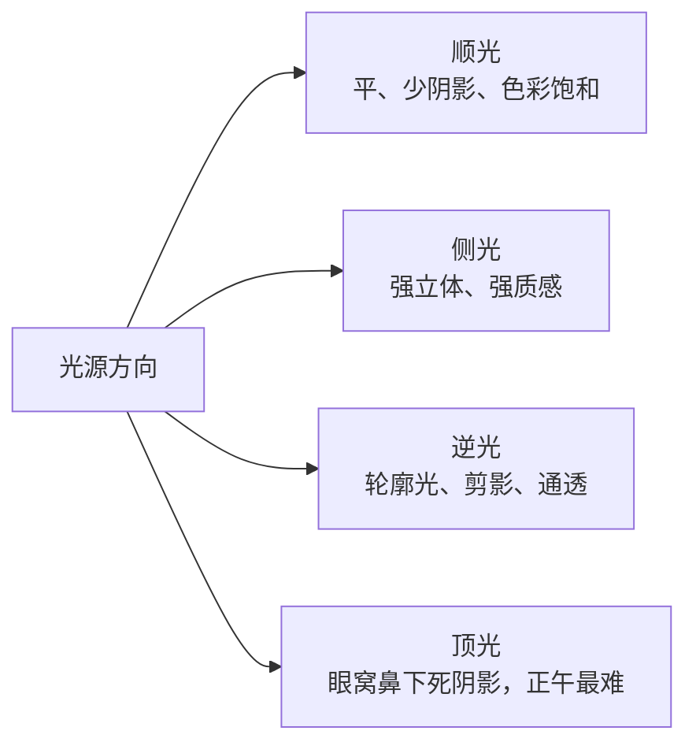
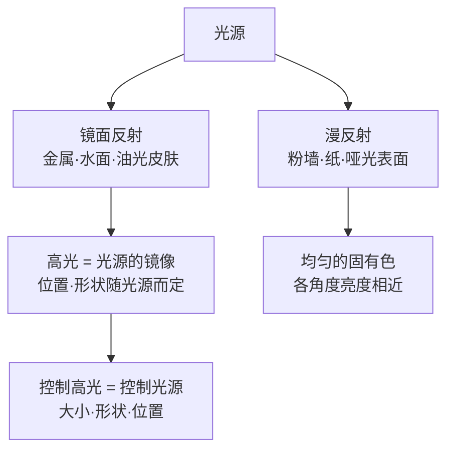
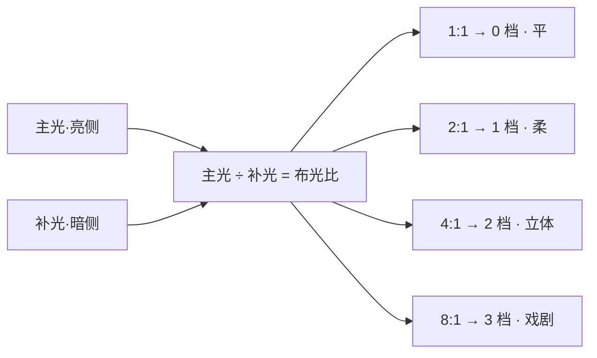

# 第 2 章 光

> 摄影是用光画画。这句话已经被说得太多，可它仍然是真的。到了现场以后，先别急着问亮度够不够，而要先看这束光从哪里来，怎样落到人和物上，又能不能把画面里最重要的东西撑起来。

---

你在京都银阁寺院子里站着。深秋的下午已经往傍晚走，一束斜阳穿过院门外那棵老枫树，在白砂庭园上拉出一道金黄。两个穿黑色和服的工作人员背着扫帚经过那道光，脚步不快，身体一会儿落进亮处，一会儿又进到阴影里。

相机在包里，拿出来、开机、举到眼前，都要一点时间。

如果你急着把镜头举起来，把测光交给评价模式，然后立刻按下去，回看时很可能会发现，原本让人停住的金光被相机平均成了不冷不热的中灰，黑色和服浮在一片土黄色的砂面上，刚才那种亮处和暗处交替出现的戏剧感也不见了。

更稳的反应，是在拿相机之前先把光看一遍。光从西边低处斜穿过院子，硬度很高，砂面上被扫过的纹路一条条都很清楚；金光和阴影之间差得很远，曝光不可能两边都照顾得一样舒服；下午晚段的光比正午更黄，角度也更低，黑色衣服一走进去，轮廓会被衬得很清楚。

这些判断不需要想得很慢，却会决定后面所有动作。曝光交给金光区，构图让黑色和服切开那道斜光，工作人员已经进入画面，就不要再等。照片有没有机会成立，其实在相机举起来以前，已经被这几次对光的判断决定了一大半。

---

*Alfred Stieglitz, "The Steerage", 1907。Stieglitz 当时正坐头等舱从纽约去欧洲。船行途中，他走到甲板上，往下看到通往三等舱的钢梯把画面切成两层：上层有头戴圆草帽与礼帽的中产阶级，下层是统舱里的移民，绳索、烟囱、白色斜帆把整个空间分成几块。他后来写道，他看到一些形状互相关联，让他感到从未有过的解放。很多摄影史都会把这张照片放在现代摄影开端的位置。光在这里已经不只是照亮甲板，它把空间切开，也把阶层、距离和几何关系一并推到画面里。 (Wikimedia Commons, 公有领域)*

---

摄影师对光的判断，永远走在曝光和构图之前。曝光是在决定这束光怎样被记录下来，构图是在决定它被收进怎样的边界里；这两件事都重要，但它们解决不了更早的问题：眼前这束光能不能让照片成立。曝光和构图都是在处理一束既定的光，而光本身合不合适，是比它们更靠前的一道关。一束不合适的光下面，构图再完整也会显得吃力；光本身有力量时，画面即使有一点小缺口，也常常还能站住。

刚开始拍照时，人最容易盯着“够不够亮”和“测光准不准”。这两个问题当然要处理，只是它们太晚了：它们发生在光已经决定了画面性格之后，充其量是在替一个已经定下的局面做记录。真正更值得慢慢练的，是在按快门之前，先看光的方向、硬度、反差和颜色。这四件事看不见摸不着，却在你还没有构图以前，就已经把这张照片的底子铺好了。

---

光的方向最容易识别，也最容易被忽略。说“侧光”两个字很简单，可在一个场景里三秒内看出这是低角度、左前方三十度来的侧光，就需要练。方向之所以要紧，是因为它决定了阴影落在哪里，而阴影落在哪里，几乎就决定了画面有没有体积。

在逐一去看每一种光之前，不妨先把常见的几个光位放在一起。光相对主体的来向，大致可以分成四类，每一类都对应一种阴影的落法，也对应一种画面的性格。

这张图不是让你去背四个名词，而是提醒你一件事：同一个主体，光的来向换一次，画面的性格就跟着换一次。下面会把这四种光位逐一看过去，先从最容易入门、也最容易出问题的顺光说起。

太阳在你身后，照到主体正面，就是顺光。顺光最容易曝光，颜色也饱和，所有细节都能被看见。问题恰恰出在这里：光既然从正面直直打过来，阴影就被挤到了主体背后，从你的角度根本看不见。画面里少了那道由亮到暗的过渡，而体积感正是从这道过渡里来的。没有阴影，一切都被摊平在同一个亮度上，画面就很难有体积。

你在故宫前给家人拍合影，为什么常常像证件照？很多时候不是构图出了大问题，而是太阳正对着人脸。脸被均匀照亮，鼻梁旁边没有影子，下巴底下没有影子，眼窝里也没有影子。人的五官本来是靠这些细小的阴影才显出高低起伏的：鼻梁因为一侧偏暗才立得起来，眼窝因为落着一点阴影才显得深。阴影一旦被顺光填平，这些起伏就跟着消失，脸看上去就像被压扁了一层。人脸需要阴影，才会像真实的人脸；没有阴影的人脸，很容易变得像塑料模型。

顺光当然也能用。花、食物、商品这类题材本来就看重颜色和表面细节，正面光常常很方便，樱花、铁板烧、橱窗里的糕点，都可以靠它把颜色稳稳托出来。这是因为这类东西的魅力本就在表面而不在体积，正面光既然把颜色和纹理都照得干干净净，反而正合适。只是拍人、街头、建筑和风光时，如果全靠顺光，画面经常会缺少体积和层次。

光从主体侧面来，就是侧光。它打到墙上、人脸上、山脊上、椅子上，会沿着光来的方向出现一条过渡：亮，半亮，阴影。人眼正是靠着这种由亮到暗的渐变来判断一个物体是凸是凹、是圆是方的，所以这条过渡一出现，平面立刻就有了纵深。这个过渡就是立体感。

刚开始练光时，可以先盯住侧光。下午三点的地铁站口，一个抽烟的男人靠在墙上，太阳从他左侧打来。他半张脸亮，半张脸暗，烟从亮的那边慢慢升起。这样的画面每天都会发生。你以前看到的可能只是一个男人在抽烟，真正值得拍的，是他和这束光之间的关系。

练侧光，可以从看自己的影子开始。影子长，说明光低；影子贴在脚下，说明光高。影子在你的左前方，光就从你的右后方来。这样练久了，在看到画面之前，你已经大致知道光从哪里来，也知道自己应该站到哪里。

---

很多人一开始怕逆光，因为评价测光很容易把主体压成一片黑。可逆光也正因为这种强烈反差，才会带来剪影、轮廓光和空间分离，而这些恰恰是顺光给不了的。让人害怕的那种反差，同时也是逆光真正的本钱。你不必一上来就避开它，先学会决定曝光交给谁。

逆光最直接的用法是剪影。给天空曝光，主体变成纯黑。人物的脸、衣服颜色、年龄、表情都被抹掉，只剩一道轮廓。剪影的力量就在这种抹掉里。一对在落日里牵手的剪影，往往比一对在落日前微笑的清晰人像更打动人，因为你看不到他们是谁，很多细节由观众自己补上。清晰人像只是在告诉你，两个人在那里度假；剪影会把画面往更大的经验里推。

逆光还能让半透明的东西从内部亮起来。叶子、薄布、玻璃、花瓣、湿头发、被风吹起的裙摆，这些东西在正面光下只是表面，到了逆光里就会发亮。同一片秋天的红枫，顺光下只是红叶；太阳从叶子背后穿过来时，每一片都像被点亮，叶脉也跟着出来，红里能看见橙和金的层次。

第三种是轮廓光。主体头发、肩膀、毛绒外套的边缘，被背后来的光镶上一道亮边，人和背景之间就有了清楚的分离。商业人像常约黄昏，就是因为这半小时天然给你一道金边。让模特背对夕阳，前面用白卡或反光板补一点脸的亮度，头发和肩膀就会自己亮起来。

逆光难在选择。给天空曝光，主体会黑成剪影；给主体曝光，天空会过曝。这是因为逆光下天空和主体的反差往往超出相机能同时兼顾的范围，你必须放弃一头。两边都想保住，最后常常得到一个灰、脏、没有态度的折中。很多逆光照片失败，并不是因为参数算错，而是拍摄现场没有决定这张照片到底要保住哪一边。

---

太阳在头顶，是顶光。眼窝变成两个黑洞，鼻子下面一条横影，下巴下面一片黑。人脸需要阴影，但不需要这样的阴影：顶光的阴影全部垂直往下落，正好堆在眼窝、鼻底和下巴这几处，把一张脸最需要交代清楚的地方遮成一团黑。11 点到 13 点的太阳，几乎是一天里最不适合拍普通人像的光。

顶光不是绝对不能用，关键是你得清楚自己在用它做什么。要表现压迫感，沙漠、监狱、空旷的水泥地，顶光可以让人无处可躲，因为它不留下任何一侧柔和的过渡，人被死死压在自己那一小片影子里。要表现宗教感，教堂中央从天窗落下来的光柱也需要顶光，那束自上而下的光本身就带着一种俯临的意味。要表现酷热感，巴塞罗那七月正午街边等公交的人，顶光同样是对的，因为白花花直射下来的光，本来就是烈日当头最真实的样子。顶光的毛病在拍普通人像时是缺陷，一旦你要的正是它带来的那种感觉，它反而成了别的光替不了的工具。

如果顶光当头，又非拍不可，最快的办法是走进开放阴影。所谓开放阴影，是一栋楼、一道墙、一棵大树投下的大片阴影，头顶没有直射太阳，四周却仍然敞开，天光从各个方向进来。正午把人拉到临街建筑的背阴一侧，原本在脸上挖洞的顶光会立刻消失，剩下柔和、均匀、从四面来的天光。很多看起来像影棚里拍出来的干净人像，其实只是摄影师让人往阴影里挪了三步。

开放阴影也要看方向。阴影里光从哪一侧的开口进来，脸就应该朝那一侧偏一点。如果一边临街、一边贴墙，光会从临街那边斜进来，于是它又变回一束柔和的侧光，立体感还在，只是反差被压到舒服的程度。

再细一点看，阴影并不是纯黑。户外的阴影总有东西在补光：白墙、浅色地面、玻璃幕墙的反射，甚至一地积雪，都会把天光弹回来。同样站在背阴处，旁边是一面白墙还是一道黑栅栏，脸上暗部亮度可以差出一两档。懂得看这一点之后，你会在现场下意识替主体找一块天然反光板。

---

出门前先把一天里的几个光线窗口记住。它们会直接改变你什么时候到现场，什么时候架好相机，也决定你要不要为一张照片多等一会儿。

日出前半小时到十五分钟，是晨蓝调。天还没真亮，蓝色深得发紫，路灯还在亮，街上几乎没人。城市天际线、桥梁、教堂和老街在这段时间会变得安静，建筑内部的灯还亮着，外面的冷蓝没有完全压下来，于是室内的暖黄和室外的冷蓝同时存在，冷暖关系自然出现。这种冷暖并置是白天很难遇到的，因为白天天光太强，室内那点灯根本压不出颜色。

日出后那一小时左右，是早黄金。太阳刚翻过地平线，光几乎横着扫过来，颜色金中带粉，每个东西后面都拖着长影子。正因为光是横着来的，它就成了天然的侧光，风光、人像、街头都适合。脸上不会有死阴影，地面因为长影子而有了体积，空气里常常还有一层薄雾。

日落前约一小时起，直到太阳沉下去，是晚黄金。它比早黄金更戏剧，因为一天积累的灰尘和湿气会把太阳过滤得更暖，云也更容易在下午晚段出现层次。光每隔几分钟就会变一次，画面里的色温也跟着走，同一个机位每隔几分钟都可能给你一张不一样的照片。

日落后十五到三十分钟，是晚蓝调。太阳已经下去，天还没有全黑，城市灯一盏一盏亮起来。白天混乱的街道，灯亮之后会忽然有秩序，因为大部分杂乱的细节都沉进暗里，只剩下一处处灯光把画面重新组织起来。夜景最好看的时段，往往不是全黑以后，而是这段还带着蓝的时间。

早晚加起来，一天容易出好光的窗口并不长。风光摄影师愿意在天亮前出门，通常是因为到达、架脚架、试构图、等第一道光落下都需要时间。太阳升起前后的变化很快，几分钟就可能换一层颜色，半小时以后光线也许已经变硬。你如果到现场时才开始找机位，最好的那段光很可能已经过去了。

新手常见的错误，是中午吃完饭才开始拍。下午一点的光通常是这一天最难用的光。更麻烦的是，整个下午都在补救光不对，注意力自然会被消耗掉，等到傍晚真正的好光来临时，人反而已经乏了。

---

光的品质，也就是硬还是软，取决于光源相对主体有多大。这一点是理解所有光线的钥匙：光源越大，光就越软；光源越小，光就越硬。

晴天正午的太阳是硬光。太阳本身巨大，可离我们太远，在地面上看只是一个小光点。光既然是从这样一个小点直射过来的，它就只能照到物体朝向它的那一面，打到墙上，影子像刀切出来，边缘干脆利落。阴天正好相反。云把直射阳光散开，整片天空都变成了一个巨大的柔光箱，光从四面八方来，绕过物体的各个侧面，所以阴影很浅，边缘也软。

新手常嫌阴天光不够。其实阴天的价值不在亮，而在均匀。它会先替你把很多难处理的反差压下来，让人脸、颜色和质地都更容易整理。人像在阴天里常常很讨巧，脸部过渡平滑，没有死黑和死白。秋叶、湿石头、青苔、生锈的金属和深色木头，也常常比晴天更好看，因为直射阳光会把颜色晒薄，而漫射光能让颜色留在它原来的位置。

阴天不适合的，是需要戏剧光的大场景风光，以及依赖硬阴影构成的街头。这两个题材之所以更吃晴天，是因为它们的力量本来就建立在强烈的明暗对比上，阴天把反差一压平，那份戏剧性也就跟着没了。除此之外，很多题材在阴天至少不比晴天差。下次阴天，先别急着把相机放在家里。

窗光是最容易被低估的光。不上灯，不带反光板，免费，安静，随时可用。让主体侧对窗户站，距离窗一两米。窗越大，离主体越近，光越软，道理和阴天一样，都是光源相对主体变大了。阴天的窗光尤其软，因为窗外整片天都在送漫射光。窗外如果是直射阳光，挂一块白窗帘，窗帘会把阳光散开，变成一个巨大的柔光箱。

主体正对窗户时容易眯眼，脸也太平；背对窗户时又很容易变成剪影，除非你本来就想要这个效果。大多数时候，侧对窗户会舒服很多。

---

*Johannes Vermeer，《倒牛奶的女仆》，约 1658。光从画面左侧那扇窗进来，斜打在女仆的额头、手臂和那一股细细的牛奶上，右半边自然落进柔和的阴影。这正是上文说的窗光：大窗、白墙，人侧对着光站。绘画比摄影早两百年，已经把这一套光用熟了。(Rijksmuseum, 公有领域)*

---

再回到刚才那扇窗。窗光落在女仆身上时，还悄悄做了一件容易被忽略的事：它在人的眼睛里留下了一点亮。这一点亮就是眼神光。

眼神光，是光源在眼球上的反射。眼球表面覆着一层泪膜，本身又是弧面，就像一面小小的凸镜，会把面前的光源缩小、映在瞳孔和虹膜之间。别看它只有针尖那么大，一张人像有没有生气，常常就系在这一点上。眼睛里有光，人就像是活的，正在看着什么；眼睛里没有光，瞳孔黑成一口枯井，再精细的五官也会显出一种没有神采的呆滞。很多人像修得很干净，却总像差一口气，问题往往就出在丢了眼神光。

眼神光的样子，直接来自光源的样子。窗户在眼睛里留下的，是一块柔和的方形亮斑，边缘不硬，位置偏在光来的那一侧，这也是为什么窗边人像总显得温润。反光板留下的，是一片更均匀的白，能把窗光在背光那侧的眼睛里补上一点，让两只眼睛都不至于失了神采。阴天的整片天空留下的，是一大片弥漫开来、几乎占满上半只眼睛的亮，人像因此显得柔而安静。到了夜里的城市，霓虹、车灯、店招会在眼睛里留下细碎又杂乱的小光点，眼神跟着就乱。

传统人像讲究把眼神光放在时钟的十点或两点方向，也就是眼睛的斜上方一点。道理并不难：人本来就习惯光从天上来，眼神光落在斜上方，脸看起来最自然；一旦光源压得太低，眼神光跑到瞳孔下缘，人就会透出一点从下往上打光的诡异。你在窗边给人换站位时，不妨盯着模特的眼睛看，让那一点亮停在舒服的位置，再按快门。

---

硬光不是缺陷，它也是工具。有些题材在软光下会平，有些题材反而需要硬光把力量推出来。

剪影需要硬光。主体在背景前像被切出来一样干净，软光下那种边缘过渡反而会让剪影显得肉。肌理也需要硬光。老人脸上的皱纹、墙面的裂缝、生锈金属上的颗粒、粗麻布的纹路，都靠细小阴影描出来。质感其实是无数细小的凹凸投出的无数细小阴影，而只有硬光才能在每一道凹陷里都填进一笔黑。侧面打下来的硬光，会把这些阴影一一挖深，材质感立刻起来。

Sebastião Salgado 在巴西 Serra Pelada 金矿拍的那组黑白照片，很多就是这种光。赤道下的硬阳光打在工人被黑泥糊住的背、脸和手上，每一块肌肉、每一道汗痕、每一颗泥粒都像浮雕。换成阴天漫射光，那一组就不是那个力量。

黑白也常常需要硬光。反差是黑白的语言。硬光下的彩色片有时显得刺眼，转成黑白之后，那种反差会变成结构。Daido Moriyama 拍新宿、涩谷街头时，并不总是避开中午和下午的直射光。光越硬，画面越粗粝，越接近他要的状态。

硬光不适合的，是需要干净肤色的正面人像，以及许多食物和产品照片。原因和肌理那一段正好互为反面：硬光既然会把每一处细小的起伏都挖出阴影，皮肤上的瑕疵就跟着被强调出来，高光容易白得难看，阴影也会变粗。你想要的干净和它天生要做的事，恰好相反。

---

前面反复说，光的硬软取决于光源相对主体有多大。这句话是对的，可它底下还压着两个更基本的问题：为什么高光偏偏出现在那个位置，以及为什么光源一大，阴影的边缘就跟着软下来。把这两件事想清楚，你对光的控制才算真正落到实处。

先看高光。物体把光反射回来，大致有两种方式。一种叫镜面反射（specular reflection），光线像撞在镜子上一样，入射角等于反射角，规规矩矩地弹向一个方向；金属、水面、玻璃、抛光的漆面，还有沾了油或汗的皮肤，都是这样。另一种叫漫反射（diffuse reflection），光线打在粗糙的表面上，被打散成朝各个方向去的一片，无论你站在哪个角度，看到的亮度都相差不多；粉墙、纸张、哑光的布料、大多数干燥的物体表面，都是这样。多数真实物体两种反射都有，皮肤尤其典型：一部分光钻进表皮下面，被打散后再透出来，给出柔和的固有色，这是漫反射；另一部分在皮肤最表层的油膜上直接弹回来，形成那一粒粒发亮的高光，这是镜面反射。

关键在于，你在照片里看到的那块高光，其实是光源本身在物体表面上的一次镜像。高光的位置、大小、形状，并不由物体决定，而由光源决定。金属杯壁上那条长长的白，是柔光箱被拉长后的倒影；模特鼻尖那一点亮，是灯的形状缩在油光上的一次成像。既然如此，控制高光就不是去擦掉那块亮，而是去改光源：把光源挪一挪，高光就换位置；把光源做大，高光就摊开、变柔；把光源收小，高光就聚成刺眼的一点。专业布光里所谓的收拾反光，追到根上，收拾的从来都是光源的形状、大小和位置。

想清楚了高光，再来量化硬软。决定光软不软的，并不是光源绝对有多大，而是它在主体那里张开多大的角，这个角叫光源的角大小（angular size）。同一盏灯，离得远，在主体眼里只占一小块，光就硬；挪近，它在主体眼里铺开成一大片，光就软。软光的本质，是光源相对主体张开了一个足够大的角，让光能从多个方向绕到物体的侧面，把阴影的边缘一点点填过渡开。

拿这把尺子回头量太阳，前面那个看似矛盾的说法就通了。太阳的直径是地球的一百多倍，绝对尺寸大得惊人，可它离我们一亿五千万公里，在地面上望过去，只张开约 0.5° 的角，和一枚硬币举到两米开外差不多大。角这样小，等于一个几乎是点的光源，所以晴天的太阳是标准的硬光，影子边缘利落得像刀切。云和窗户则相反：一片云、一整片阴天的天空、一扇贴着人的大窗，本身够大、又离主体够近，在主体那里张开的角可以有几十度，于是同一束阳光被摊成了软光。你在窗边把人往窗口挪近半米，窗在脸上张开的角就大了一截，光当场就软一分，靠的正是这个道理。

---

光除了有方向、有硬软，也有强度，而强度并不是一个笼统的亮或暗。对可以近似看成一个点的光源来说，它落在被摄物上的照度，会随着距离按一条固定的规律衰减：

\[ E \propto \frac{1}{d^2} \]

照度和距离的平方成反比。把同一盏灯放在离人不同的远近，照到主体身上的亮度会像下面这样掉下去：

| 灯到被摄物的距离 | 相对照度 | 相差档数 |
|---|---|---|
| 1 m | 100% | 基准 |
| 1.4 m | 50% | 暗 1 档 |
| 2 m | 25% | 暗 2 档 |
| 2.8 m | 12.5% | 暗 3 档 |
| 4 m | 6.25% | 暗 4 档 |

这张表里最该记住的一行，是距离翻倍、光就掉到四分之一，也就是骤然暗两档。这个衰减，比大多数人凭直觉预期的要陡得多。因此，灯离人越近，光在继续往背景走的那段路上衰减得越快，背景相对就越暗，于是把灯贴近主体，成了压黑背景、让人从环境里跳出来的常用办法；与之相对，把灯拉远，光在主体和背景之间的落差就变小，整片区域被照得更均匀。反平方定律是你在布光时控制前后景亮度差的第一根杠杆：想拉开前后景，就让光靠近；想让画面平铺、匀净，就让光后退。

这条规律并不只对影室里的灯成立。窗光、门洞里透进来的光、路灯，凡是可以当成一个点来看的光源，都走同一条曲线。你在窗边拍人时之所以往窗口挪一步、又退半步，脸和背景的亮度关系立刻就变，背后正是这条反平方在起作用。

---

反平方定律说的是光在路上怎样衰减，它管的是同一盏灯远近之间的相对亮度。可在户外，还有一个更省力的问题：晴天的太阳到底有多亮？这个亮度其实相当稳定，稳定到不必测光表也能估出曝光，这就是流传了几十年的阳光十六法则（Sunny 16）。

它的说法很简单：晴天正午，光圈定在 f/16 时，快门速度大约等于 ISO 的倒数。ISO 100 时用 1/100 秒（就近取 1/125 秒也可），ISO 200 时用 1/200 秒，以此类推。背后的道理是，地面上晴天直射阳光的照度基本恒定，一年四季、天南地北都相差不多，于是它可以被当成一把随身的标尺。

\[ t \approx \frac{1}{\mathrm{ISO}} \quad (f/16,\ \text{晴天正午}) \]

天不总是晴的。把 f/16 当基准，按天气把光圈一档档开大，就得到一张不带测光表也能照用的对照表。判断依据不必去测，看影子就够了：影子越实、边缘越硬，光越强，光圈就收得越小；影子越淡、越找不到，光越弱，光圈就开得越大。

| 天气 | 影子的样子 | 光圈（快门≈1/ISO） |
|---|---|---|
| 雪地 / 白沙滩 | 影子硬而短，反光刺眼 | f/22 |
| 晴天 | 影子边缘清晰锐利 | f/16 |
| 薄云 | 影子边缘发虚 | f/11 |
| 阴天 | 影子勉强看得出 | f/8 |
| 浓阴天 | 几乎没有影子 | f/5.6 |
| 开放阴影 / 日落 | 完全没有影子 | f/4 |

现在相机的测光已经很准，你未必真要靠它来拍。可它仍值得记住：一是断电、逆光、雪地这些容易骗过测光表的场合，它给你一个心里有底的基准；二是它逼着你把天气、影子和曝光三者在脑海里连起来，久了你只要抬头看一眼天，手就知道该往哪个方向拧。

---

光的强度决定 ISO 和快门，反差才真正决定一张照片处理起来难不难。

反差是画面最亮处和最暗处的距离，单位是档。一档，就是亮度差一倍。相机能记录的反差，叫动态范围。现代全画幅大约能记录十四档。最亮到最暗如果落在这个范围内，相机能同时给你两头的细节；可一旦超过这个范围，就没有两全，只能选择保留哪一边，另一边只好放掉。

晴天中午站在阴影里，看阳光下的街道，反差可能有六到八档。这样的场景没有一个能让两边都舒服的“正确曝光”。给阴影曝光，街道会白成一片；给街道曝光，阴影会变成一块黑。取中间值看似安全，最后常常两边都灰、都脏。

刚开始处理这种场景时，人很容易舍不得任何一边，既想要阴影里抽烟的人，也想要阳光下经过的女人，最后得到的往往是两边都没有说清楚的折中。更稳的做法，是先决定画面的主角是谁。主角决定曝光应该交给谁，另一边可以变成剪影，也可以变成纯白，只要这个结果来自现场判断，而不是按完以后才发现救不回来。

两边都重要，就等。等太阳被云挡住一半，反差降下来，你就有机会同时保住。等不到，换角度，或者明天再来。

会看反差的人，站在场景里时，会自动忽略相机根本留不住的部分。肉眼能看见很多细节，相机未必能同时保住，因为人眼的宽容度远比传感器大。成熟的摄影师看到的，已经接近相机能拍下来的样子。他知道哪些会留下，也知道哪些会消失，于是在按下快门之前，他心里已经替相机做完了这道取舍。

---

反差是场景本身给你的明暗差，你多半只能接受，或者回避。可一旦你能控制光，比如在窗边补一块反光板、在影室里加一盏补光灯，明暗差就从被动承受变成了主动设定。摄影师用来描述这种设定的，是布光比，也叫明暗比（lighting ratio），指的是主光那一侧和补光那一侧照到主体上的亮度之比。

布光比习惯用比值表示，而换算成曝光的语言，它其实就是档：亮度每差一倍是一档，所以比值每翻一番，明暗两侧就多拉开一档。1:1 是两侧一样亮，相差零档，脸被均匀照亮，最平；2:1 相差一档，只在暗侧压下淡淡一层，温和；4:1 相差两档，明暗分明，立体感强；8:1 相差三档，暗部沉下去接近死黑，戏剧感最重。放在人脸上，这个比值直接对应着一张脸看起来有多柔，还是多硬。

| 布光比 | 主光与补光相差 | 落在人脸上的观感 |
|---|---|---|
| 1:1 | 0 档 | 均匀平光，几乎没有立体，适合高调、美妆、证件式 |
| 2:1 | 1 档 | 过渡柔和，五官微微起伏，讨喜的日常人像 |
| 3:1 | 约 1.5 档 | 古典人像的常用比，脸自然而圆润 |
| 4:1 | 2 档 | 明暗分明，性格强，偏戏剧的肖像 |
| 8:1 | 3 档 | 暗部接近纯黑，低调、硬朗、情绪重 |

这张表从上往下，是从平走到硬。新手拍人常不自觉地停在 1:1 附近，因为补光加得越足越安全，可太安全的光也最没有性格，脸容易发扁。想让脸立起来，多半要往 3:1、4:1 走：让主光偏到一侧，再用比它弱两到三档的补光托一下暗部，既留住了立体，又不至于让暗部黑到没有细节。补光可以是一盏灯，也可以只是一块白卡、一面墙，甚至暗侧那半间屋子的环境光。

现场怎样估这个比？不必真去测。让主光单独照，记住暗侧还剩多少亮；再把补光加进来，看暗侧被提了几档。想象你在窗边拍人，靠窗那半张脸是主光，背窗那半张脸的亮度，就取决于身后有没有一面墙、一块反光板替你把光弹回来。把人往房间深处挪，暗侧越来越暗，布光比就一路从 2:1 拉到 8:1；在暗侧支一块白卡，比值又立刻收回来。你在窗边反复挪动模特、调整反光板的那半分钟，其实一直在手动拧这个布光比。

---

色温是光的颜色，单位是 K。数值越低，光越偏暖，越往红黄走；数值越高，光越偏冷，越往蓝走。烛光大约 1800 到 2000K，钨丝灯 2700 到 3000K，日出日落 3000 到 4000K，下午阳光 5000 到 5500K，正午和阴天会更冷，蓝调时刻可以到 9000K 以上。

把常见光源的色温列在一起，这条从暖到冷的轴会更直观：

| 光源 | 色温（约） |
|---|---|
| 烛光 | 1800 K |
| 白炽灯 / 钨丝灯 | 2700-3200 K |
| 日出 / 日落 | 3000-4000 K |
| 上午 / 下午的阳光 | 5000-5500 K |
| 正午日光 | 5500-6500 K |
| 阴天 | 6500-7500 K |
| 阴影 / 蓝天 | 7500-10000 K |

这张表从上往下读，正是从暖走到冷：越靠上色温越低，越偏红黄；越靠下色温越高，越偏蓝。相机的白平衡做的是相反的事，它按你设定的色温往反方向补偿，把这一个色温还原成中性的白。你若告诉相机现在是偏暖的低色温光，它就往冷里推，把暖压回中性；你若告诉它现在是偏冷的高色温光，它就往暖里拉，把蓝补回来。

记下这几档数字，现场的偏色就有了来处。黄金时刻之所以暖，是因为这段时间的阳光正落在表里日出日落那一档，本就偏红黄；阴影里的人脸之所以常常发青，是因为背阴处的主要光源其实是天空，色温落在表的最高一档，比直射的阳光冷出一大截。色温不是一个需要死记的刻度，而是一套坐标，让你在举起相机之前，就能预判这一张会偏暖还是偏冷。

拍冬天雪景时，如果相机默认 5500K，阴影里的雪常常发蓝。相机并没有犯错，阴影里的雪反射的是天光，天光本来就偏蓝。也别急着把所有蓝都拉掉。留一点蓝色阴影，往往比把雪全部调成纸白更接近真实雪景。

拍 RAW 时，白平衡只是后期怎样解释数据。Auto WB 通常够用，它给你一个合理起点，回家想改成 5000K 还是 8000K，都不会损画质。JPEG 不一样，白平衡会直接写进像素，后期空间小得多。

混色光是色彩的杀手。一个场景里同时有窗光和钨丝灯，左半边发蓝，右半边发黄，皮肤很容易脏。这是因为你无论把白平衡定在哪一头，都只能照顾其中一种光，另一种立刻偏色。很多咖啡馆人像看起来不干净，原因就在这里。与其回家以后在后期里反复补救，不如现场关掉其中一种光，或者换一个位置。混色光能避就避，修起来费力，还未必自然。

---

色温表能告诉你阴影发青、黄金时刻发暖，却没有说这些颜色是从哪里来的。要把它们讲透，得先承认一件在户外常被忽略的事：晴天里照着你的，从来不是一个光源，而是两个。

一个是直射的阳光。它来自天上那一个点，暖、硬、有清楚的方向，负责给出高光和分明的影子。另一个是天空光（skylight），也就是整片蓝天散下来的光。它冷、软、没有方向，从四面八方漫过来，专门负责填充阴影。你站在树影里拍人，脸上的亮度和颜色，其实不是那个被挡住的太阳给的，而是这第二个光源，头顶那片蓝天给的。所以阴影从来不是纯黑，它暗部的亮度和偏色，全由天空光说了算。前面讲开放阴影时说要替主体找一块天然反光板，其实最大的那块反光板，一直是整片天空。

天空为什么是蓝的，阴影又为什么因此发青，答案藏在阳光进入大气以后的一次散射里。阳光是白的，白光里各种颜色的波长并不一样，蓝紫的短，红黄的长。当阳光撞上空气里的气体分子，波长越短的光被散射得越厉害，散射的强度与波长的四次方成反比：

\[ I \propto \frac{1}{\lambda^4} \]

蓝光的波长大约是红光的三分之二，按四次方算下来，被散射的强度要高出五六倍。于是蓝光被空气反复弹向四面八方，铺满整片天，天就成了蓝色，这就是瑞利散射（Rayleigh scattering）。既然天空散下来的那片补光本身偏蓝，落在开放阴影里的脸自然就带一层青。这不是相机的错，而是给它补光的天空本来就是蓝的。第 4 章讲冷暖对比时会一再用到这一点：暖的是被阳光直接照到的地方，冷的是只靠天空光补起来的阴影，一张照片里的冷暖分区，很多时候就是这两个光源的分区。

同一次散射，也解释了日出日落为什么偏暖。太阳越低，阳光斜穿大气要走的路就越长，一路上蓝光绿光被散射得七零八落，等穿到你眼前时，剩下的多半是散不掉的红光和黄光，太阳和它照亮的一切于是都镀上一层暖。正午的太阳几乎垂直穿过大气，路程最短，散射掉的蓝光有限，光就相对白、相对冷。黄金时刻的暖和正午的白，差的不过是阳光在大气里走过的那段路的长短。

---

很多好照片都要等。等待并不是站在那里消耗时间，它本来就是拍摄工作的一部分。你等的是光线、人物和环境在某一刻短暂对上，而不是某个从天而降的奇迹。

风光摄影师在一个机位等几个小时很常见。你不必一开始就这么极端，但半小时到一小时的等待，是很正常的拍摄时间。等什么？一片云移到太阳前，把光柔下来一档；太阳从对面建筑后面出来；路灯亮起；烟散开；雾散一半；一辆车经过；一个人走到画面里某个位置。

等的时候也不是站着发呆。可以试机位，试构图，试参数，调三脚架水平，看云怎么走，想好那一刻出现时自己要按哪一个按钮。这样等到的那一刻，你不必再临时手忙脚乱，因为你应该已经知道按完大概是什么样。

很多人按完一张就走，问题是光还在变，人物还在变，刚才那张未必就是最好的那张。Saul Leiter 可以在纽约街头一个店门口等很久，最后留下来的那一张可能成了封面，没留下来的那些照片，观众永远不会看到。

---

光不是抽象概念。要把这一章里的东西带到现场，可以从几个很小的动作开始。

到一个场景，先看阴影。阴影是光留在世界上的痕迹，读懂它就等于反推出光的性格。阴影边缘锐，就是硬光；边缘软，就是软光；几乎没阴影，就是漫射。阴影方向告诉你光源位置，阴影长度告诉你光源高度。

把手举到主体位置，绕一圈看。哪个角度手最立体，哪个角度最平，哪个角度最戏剧？手是随身带着的一个小模型，它接受的光和主体接受的光是一样的。主体如果能动，就把人放到你看着最立体的那个位置；主体不能动，你自己换位置。

眯眼看场景。眯起眼睛后，细节会被压掉，剩下的是明暗结构。照片最终打动人的，往往是这个大的明暗结构，而不是细节。这个结构不好看，细节再多也没用。

拍一张回放时，先别只看好不好看。“好不好看”太笼统，帮不了你改进。不如问自己几个具体的问题：主体亮度对吗？阴影是不是太深？高光有没有爆？色温歪不歪？这些问题比“这张有感觉吗”更有用，因为每一个都指向一个你下一张就能调整的动作。

再看天空。天空告诉你接下来半小时的光会怎样变。西边有云要遮太阳，日落前那一段光可能就没了；东边云缝透光，接下来可能出现很好的侧光；整片天都被云盖住，就别等戏剧性的阳光了，把它当阴天来拍。

这些动作合起来不需要很久。做得多了，它们会慢慢变成身体反应：你还没有完整地在脑海里说出“侧光、硬光、反差大、偏暖”，脚步和手已经开始往合适的位置移动。所谓光感，最终就是这些小判断反复出现之后留在身体里的反应。

---

## 练习

一周里至少五天，在日出前后或日落前后出门半小时。先不用急着拍很多，可以先说出光从哪里来，硬还是软，反差大不大，颜色偏冷还是偏暖。

下一个阴天，专门出门拍人像、湿石头、咖啡馆窗边的人，或者任何你平时嫌“没有光”的东西。回家看，阴天到底替你省掉了哪些麻烦。

找一个朋友，在下午两三点的窗边拍三十张人像。每十张换一种站位：正对窗、侧对窗、背对窗。回家比较脸上的阴影和眼神光。

出门一上午，一直注意自己的影子在哪、多长、变化多快。练久了，你会在看到照片之前先知道光的方向。

这些练习不是为了把章节里的概念背完整。光感只靠理解没有用，它需要身体记住。走出去的次数够多以后，眼睛才会在你还没有完整思考之前，先一步看见光在哪里。

---

下一章：[第 3 章 曝光](03-exposure.md)
