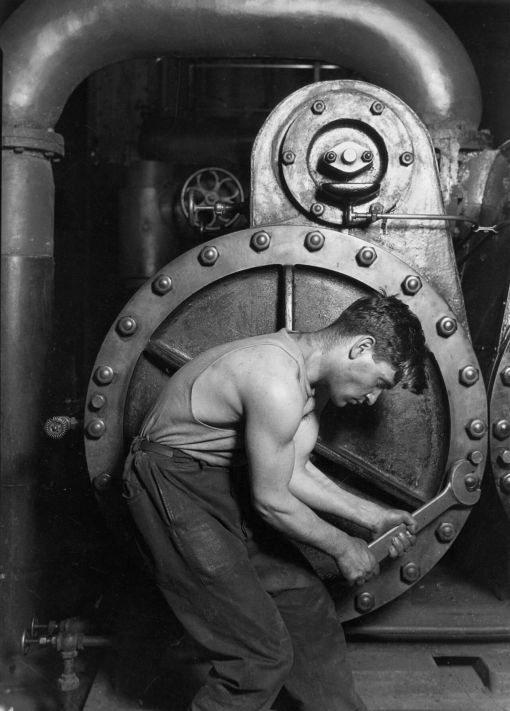
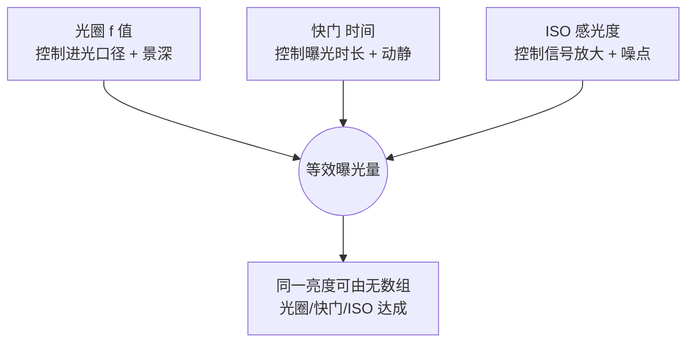

# 第 3 章 曝光

> 曝光从来不是套公式。它是在传感器能记录的范围有限时，决定哪些细节要留下，哪些可以放弃。

---

1936 年 3 月的某个下午，Dorothea Lange 沿着加州 101 号公路往北开。她已经在外面连续奔波了一个月，为安置管理局（Resettlement Administration，次年改组为人们更熟悉的 FSA）拍摄记录，派发的那点差旅费快要见底，心里想的只是尽早回家，见到丈夫和孩子。那一刻她并没有打算再多拍什么，工作在她心里几乎已经结束了。

就在这样的心境里，路边闪过一个手写的牌子，上面写着 “PEA-PICKERS CAMP”。她起初照直开了过去，车又往前开出了二十英里，某种说不清的东西却让她掉头折返。

这段经历，她后来在《Popular Photography》里写过。她说自己一看见那个饥饿而绝望的母亲，就像被磁石吸了过去。孩子紧紧靠在母亲身上，脸上带着受了惊吓的神情。Lange 没有问她的名字，也没有追问完整的来历，只知道那年冻灾把整片豌豆田毁了，母子几个靠着从田里捡来的冻坏的蔬菜，和孩子们打来的鸟，勉强撑着。她在那顶帐篷前后只待了十分钟，拍了六张——她自己晚年记成五张，国会图书馆存下的底片是六张。

就是在这六张之内，Lange 做了几个关乎曝光的决定。她手里是一台 Graflex，4×5 的大画幅。营地外是阴雨里的漫射光，帐篷布又把这份光再拦软了一层。她真正在意的，始终是那位母亲的脸，于是曝光的第一件事，就是先照顾好这张脸。至于帐篷外的亮处，本就不是画面的重点；帐篷内侧的阴影，也尽可以压暗下去，因为那里的细节同样不承担什么。

这六张里的最后一张，就是后来人们所熟知的《Migrant Mother》。它被印了上百万次，挂进博物馆，印上邮票，最终收进美国国会图书馆。可若是单从曝光的角度回头去看，它首先只是 Lange 在那个阴雨天为了保住一张脸所做的一组取舍：她情愿让画面别处丢掉一些细节，只为把这张脸完整地留下来。

这正是曝光的实质。它不能被简单地理解成“准还是不准”，更要紧的问题在于：当相机能记录的亮度范围本就有限时，你究竟愿意让哪些细节留下，又能够接受哪些细节消失。在按下快门之前，这个取舍最好心里已经有了一个大致的方向。

---

*Lewis Hine, "Power House Mechanic", 1920。Hine 在发电厂里拍一位机械师调试巨型蒸汽机。光从机器后面右上方落下来，照到工人弯着的背、汗湿的衬衫和手里的扳手上。不重要的部分被压到暗处，画面最后留下的是工人与机器之间那道弧线。这里的曝光没有炫耀技术，它更像一种判断：大量不重要的信息被压下去，一个人面对工业巨兽时那道紧绷的姿态才留在画面中央。 (Wikimedia Commons, 公有领域)*

---

老教科书常说，曝光就是测量场景的反射率，让 18% 灰记录成中灰。这句话本身没有错，可它解释的其实是测光表的工作方式，而不是一个摄影师站在现场时，究竟凭什么去决定曝光。它描述的是仪表，不是判断。

更贴近实际的说法是这样的：眼前的场景自有一个亮度范围，从最暗处到最亮处，彼此之间可能相差十档；与此同时，传感器也有它自己能够记录的范围，现代全画幅大约在十四档上下。曝光真正要做的，就是把眼前这一段亮度范围，妥帖地放进传感器所能承载的某一段里。

放进哪一段，就会得到不一样的照片。你可以让亮的地方不至于过曝，同时让暗的地方也尽量留住细节，这是最常见的常态曝光。你也可以反过来先保住高光，让最亮处刚刚好卡在不爆的边缘，任由暗部自然沉下去。你甚至可以先照顾暗部，让阴影里始终有东西可看，转而接受高光白掉一小块。这里没有哪一个选择是天然正确的，能分出高下的，只是哪一个更贴合这张照片想要说的那件事。

因此，不要把曝光误当成寻找唯一的标准答案。你真正要做的，是在相机有限的记录能力之内，把整个画面推到那个最合适的位置上。

---

相机屏幕上的那张预览图，其实是会骗人的。屏幕本身的亮度、四周的环境光、当前的显示模式，都会悄悄干扰你的判断。大太阳底下看屏幕，照片往往显得偏暗，让你忍不住想加曝光；到了夜里再看同一块屏幕，照片又常常显得偏亮，诱着你往下压。真正可靠、不受这些外部条件左右的，是直方图。

直方图所做的，是把一张照片里所有像素的亮度，按高低一字排开。它的横轴从左到右，对应着从纯黑到纯白；纵轴则代表在某一档亮度上，究竟堆了多少像素。如果图形在右边撞了墙，就说明高光已经过曝，那里白成一片，再没有细节可言；如果在左边撞墙，则说明暗部已经死黑。至于整体都落在中间，也只能说明这张的曝光比较平均，并不等于照片就对。

因此，直方图该偏向哪一边，要看拍的是什么。雪景的直方图通常应该偏右，否则那片雪就会被拍成灰的；夜景的直方图则通常应该偏左，否则夜晚会被硬生生拍成白天。直方图能够告诉你信息有没有丢失，却没有办法替你判断这张照片究竟有没有味道。它更像汽车的仪表盘，本分只是如实提示状态，至于车往哪里开，方向仍旧握在你自己手里。

不过这块仪表盘自己也有两处盲区，得心里有数。其一，即便你拍的是 RAW，机身给你看的直方图，多半也是按那张 JPEG 预览算出来的，套着机内的色彩和反差设定，而 RAW 真实的余量通常比它显示的还宽半档到一档，所以直方图右缘刚刚碰墙时，RAW 里往往还救得回来。其二，默认显示的常常只是一条亮度直方图，它是三个颜色通道加权平均的结果，而平均是会藏事的：拍日落、红花或者泛红的肤色时，红通道可能早已独自撞墙溢出，亮度直方图看上去却还安然无恙，回家一看，花瓣糊成一片没有纹理的红。所以要在菜单里把直方图切到 RGB 三通道分开显示，三条曲线里只要有一条撞了右墙，那个颜色的细节就已经在丢了。“直方图没报警，照片却救不回来”，十有八九是吃了这两处盲区的亏。

除了直方图，高光警告也值得一并打开。这类功能其实分成两路：Sony 的斑马线来自视频行当，是拍摄之前就叠在取景画面上的一道道斜线，阈值可以自己设，通常放在 95 到 100% 之间，让它在你按快门之前就把快要爆的区域标出来；Canon 的“高光警告”和 Nikon 的“高光显示”则是回放照片时才闪烁提示，玩家们管那一闪一闪的黑块叫 blinkies。两路的差别在于，一个在按下快门之前就提醒你，一个只能在拍完之后替你查验，有斑马线可用，自然优先用它。拍人像时，把这道警告对准脸部的高光尤其管用：只要脸上一闪，就说明那里快要白掉，随手降一点曝光即可。这样的判断，远比对着屏幕凭感觉去看要可靠得多。

---

Ansel Adams 与 Fred Archer 在 1939 年前后共同提出了 Zone System，也就是分区曝光系统，把从纯黑到纯白的灰度切成了十一个区。其中 0 区是全无细节的死黑，10 区是同样没有细节的纯白，介于两端的那几个区则各自保留着不同程度的细节，而 5 区，正好接近前面提到的 18% 灰。

Adams 的工作方式，并不是端着相机站在场景前面，等它告诉自己一个答案。恰恰相反，他会先在脑海里把最终那张底片应该长成什么样想象清楚。譬如远处的雪山，他决定放在第 8 区，让它亮，却仍然留着细节；近处的松林，他放在第 2 区，压得很暗，但还能依稀看出枝干的结构。想清楚了这些，他才动身去逐一测量这些区域的亮度，到最后，连胶片的显影时间都要一并纳进来一起调整。

到了数码时代，很多人认为 Zone System 早已过时。今天既有直方图，又有曝光补偿，还有可以反复回退的 RAW 文件，确实不必再像 Adams 当年那样，郑重其事地对待每一张照片。可是它遗留下来的那个习惯，至今仍然有用：先在心里替画面定下它应该有的样子，再让相机去配合这个决定，而不是空着手站在场景前，坐等相机替你交出答案。

而且这套办法在数码机上有一个非常直接的现代翻译，一段话就能说完。点测光对准画面里的任何一块，相机给出的建议都是把那一块放到第 5 区，也就是中灰；你要做的只是接着告诉它，这一块其实不该待在第 5 区。对准阴影里的岩石点测，心里想让它落在第 3 区，就在点测读数的基础上减两档曝光补偿；对准亮部的白墙点测，想让它站上第 7 区，就加两档。一区一档，加减的档数就是你想把它从中灰挪开的距离。如此一来，Adams 那套要配合胶片显影才能完成的系统，被压缩成了“点测、定区、拨补偿”三个动作，站在现场几秒钟就能做完，而曝光的主导权，也就从测光表那里回到了你手上。

现实里，很多人的做法是先按下一张，回头看屏幕，发现暗了，于是加一档再重拍一张。这样自然也能修正错误，可仍然只是现场的补救。更从容的做法，是在按下快门之前，心里就已经大致清楚：这张照片，究竟该往亮处走，还是该往暗处压。

---

曝光只有三个变量：光圈、快门、ISO。麻烦在于，每一个变量都不只管亮度，还各自拖着一个副作用。光圈在改变进光量的同时，也改变着景深；快门在改变进光时间的同时，也决定了运动是被冻住还是被拖成虚影；ISO 在放大信号的同时，也把噪点一并放大了出来。

这三个变量看上去彼此独立，落到最后却汇进同一处：它们共同凑出传感器接收到的那一份曝光量。无论你先动哪一个，最终要凑齐的始终是同一个总量。

这张图真正要点出的，是最底下那一行：同一份亮度，可以由无数组光圈、快门、ISO 搭配达成。曝光并不存在唯一正确的一组参数。f/2.8 配 1/500，和 f/8 配 1/60，只要其余两项跟着补上，落到传感器上的那份光其实一样多。因此，你站在现场真正要决定的，并不是“亮度够不够”，而是“这一份亮度，我打算拿哪一组副作用去换”。

既然三者可以互相顶替，它们之间就得有一把公共的尺子，否则无从谈起谁补偿谁。这把尺子就是“档”。相邻的两档之间，进光量恰好翻倍或者减半，而光圈、快门、ISO 三者，都能被换算到这同一把尺子上来。下面这张表，把光圈、快门、ISO 三条独立的整档阶梯并排列在一起，按“相对基准亮了几档、暗了几档”对齐。

| 档位 | 光圈 f 值 | 快门(秒) | ISO |
|---|---|---|---|
| 更亮 3 档 | f/2.8 | 1/15 | 800 |
| 更亮 2 档 | f/4 | 1/30 | 400 |
| 更亮 1 档 | f/5.6 | 1/60 | 200 |
| 基准 | f/8 | 1/125 | 100 |
| 更暗 1 档 | f/11 | 1/250 | 50 |
| 更暗 2 档 | f/16 | 1/500 | 25 |

标准整档光圈序列：f/1.4、f/2、f/2.8、f/4、f/5.6、f/8、f/11、f/16、f/22（每档 f 值乘约 1.414，通光面积减半）。

这张表要竖着读，也要横着读。竖着看，光圈、快门、ISO 各自是一条独立的阶梯，每往下一格就暗一档，每往上一格就亮一档；横着看，同一行里的三个数，都表示相对基准亮了或暗了同样的档数。它真正有用的地方，是把互相补偿摆到了明面上：你若为了压暗背景把光圈从 f/8 收到 f/11，那便是暗了一档，想让总曝光不变，就得在快门或 ISO 上补回一档，或是把快门从 1/125 放慢到 1/60，或是把 ISO 从 100 提到 200，二者取其一即可。“档”让三个原本各说各话的数字，第一次能够彼此折算。你在取景器里权衡的，从此不再是三串互不相干的读数，而是同一份光在三条路之间的来回分配。

这份光还可以被更精确地量化。以 ISO 100 为基准，一档曝光能够写成一个确定的数，这个数就是 EV：

\[ EV = \log_2\frac{N^2}{t} \]

其中 \(N\) 是光圈 f 值，\(t\) 是快门时间（秒）。EV 每加 1，曝光量就减半，恰好对应前面所说的“暗一档”。这个式子未必要你在现场心算，可它把“档”从一句口头的约定，落成了一个算得出来的数。譬如 f/8、1/125 对应一个确定的 EV，光圈不动，只把快门提到 1/500，EV 就整整高了 2，对应的正是暗了两档。有了 EV 这把带刻度的尺，你对“再加半档”“再压一档”的判断，才算真正踩在了可度量的地面上，而不再只是停留在感觉里。

与这套精确的刻度并排的，还有第 2 章讲过的那条 Sunny 16：晴天正午 f/16 配 1/ISO 秒，天色每阴一层就把光圈松一档，具体的对照表那一章已经给出，这里不再重复。放到曝光的语境里，它的用处是做一把随身的粗尺：当你一时拿不准相机的读数是不是被大片明暗带偏了，心里先用它估一个档位，再回头去看表，就不至于被表全然牵着走。

由于每个变量都有副作用，更稳妥的顺序，是先把景深和运动这两件更要紧的事定下来，再让 ISO 去兜住剩下的亏空。你想要多深的景深，就先把光圈定好；你想冻结动作，还是想保留一点拖影，就接着把快门定好；至于最后剩下的那点亮度压力，一并交给 ISO 去承担。

光圈优先，是大多数场景里最省心的默认。你负责设光圈，相机替你算快门，而你只需盯住 ISO 和曝光补偿这两处。具体到题材：人像常用 f/1.4 到 f/2.8，全看你想要多浅的景深；街头常用 f/5.6 到 f/8，好让画面里更多的东西都落进清楚的范围；风光常用 f/8 到 f/11，在景深和锐度之间取一个平衡；室内弱光则往往要开到 f/1.4 到 f/2.8，先把进光量拿够再说。而每一次设完光圈，都要回头看一眼快门：一旦它掉到了安全速度以下，就该提起警觉。

不少有经验的摄影师，习惯把 M 模式配手动 ISO 当作某种专业的标志。可真放到现实场景里，M 模式加上 Auto ISO 往往更实用。你用光圈去控制景深，用快门去控制运动，把适应光线明暗变化这件杂事交给自动 ISO，再用曝光补偿去微调整体的亮度倾向。如此一来，构图、时机和运动这些真正要紧的判断始终攥在你手里，与此同时，又不必每次光线稍有变化，就从头把参数重算一遍。

---

前面说同一份亮度可以由无数组参数凑成，这背后其实压着一条被叫作互易律（reciprocity）的老规矩：进光的强弱和曝光的长短可以彼此顶替，强度减半、时长加倍，落到感光材料上的总曝光量并不改变。光圈和快门之间的互相补偿，本质上就是这条互易律在起作用，“等效曝光”这个说法能够成立，靠的也正是它。

只是这条规矩在时间的两个极端上会失灵，胶片尤其明显。曝光一旦长到几秒、十几秒，或者短到几千分之一秒，胶片的感光效率就会掉下来，实际得到的密度比互易律算出来的要低，于是长曝时往往得在计算值之上再补一到几档，这个现象叫互易律失效（reciprocity failure），也叫 Schwarzschild 效应；不同胶片失效的门槛和要补的量各不相同，讲究的做法是去查那卷片子的数据表。数码把光子直接数成电子，在很宽的一段时间里都老实遵守互易律，基本不必为长曝额外补光；可它另有一桩麻烦：曝光时间越长，传感器自身的温度会让像素凭空积起电荷，术语叫暗电流，画面上于是冒出一颗颗位置固定的亮点，也就是热噪点。相机菜单里的“长曝光降噪”正是冲着这个来的——它在正片拍完之后，再用同样的时长、却不打开快门拍一张纯黑的暗场，拿暗场里那些固定的噪点，去抵消正片里对应位置的同一份噪声。

---

一张照片糊了，背后可能是两种完全不同的原因，对应的处理办法也就不一样。

一种是手抖。相机在曝光的那一瞬间动了，于是整张照片连同背景，一起糊成了一片。另一种是主体动。相机明明端得很稳，可画面里的人或车，在快门开着的那段时间里移动了位置，结果背景是清楚的，唯独动的那一部分拖出了残影。两者看上去同样是糊，根子却南辕北辙：前者是相机在动，后者是被摄对象在动。分不清这一点，就容易开错药方。

对付手抖，有一条流传已久的老规矩，叫安全快门。它的意思是，快门速度最好不要慢于镜头焦距的倒数：50mm 的镜头尽量别低于 1/50 秒，200mm 的镜头则别低于 1/200 秒。道理在于，镜头越长，画面被放得越大，与此同时，手上那点抖动也跟着被同比例放大，所以门槛必须相应抬高。如果用的是残幅机身，还得把等效焦距一并算进去。也要知道，这条规矩是胶片和小尺寸照片年代留下的经验，它的及格线只保证照片缩到寻常大小看着不糊；如今动辄四五千万像素的机身，一旦放到 100% 去抠细节，按老规矩拍下来的画面仍可能带着一层微微的抖动，所以讲究锐度的人常把门槛再抬一倍，用两倍于焦距倒数的快门去拍，比如 50mm 用到 1/100 甚至更快。当然，机身或镜头若带着防抖，就可以再往下放慢几档，有时手持 1/8 秒也未必会糊。

但要记住，防抖能管的只是手抖，对主体的运动它无能为力。要冻结一个正常走路的人，大约需要 1/250 秒；要冻结一个奔跑的孩子、一个骑车的人，或者街头快速经过的行人，则常常要 1/500，甚至 1/1000 秒才压得住。因此，按下快门之前不妨先问自己一句：这一张，我怕的到底是自己端不稳，还是对方在动。若怕的是前者，安全快门也就够用了；若怕的是后者，就得撇开安全快门，重新按主体的速度去算。

到这里为止，快门一直被当作防糊的工具在讲，可它还有创作性的另一半：故意慢下来。糊不糊，本来就不该一律算成毛病，运动被拖出来的那道虚影，有时候恰恰是画面想说的东西。把快门放到 1/15、1/30 秒，跟着一辆驶过的自行车平移镜头，让主体清楚、背景拉成一片横向的线条，这是追随拍摄；把相机架上三脚架，用几秒、几十秒的曝光把瀑布抹成雾、把车流抹成光轨、把广场上的人流抹到只剩淡淡的影子，这是长曝光的减法。白天光线太强、快门慢不下来时，就要请出减光镜（ND），一片深灰的玻璃替你按档数扣掉进光，晴天挂上一片十档的 ND1000，1/125 秒就变成了 8 秒。这一路的具体做法，追拍在第 6 章讲时机时展开，长曝和 ND 的换算在第 9 章风光里细说，这里先把观念立住：快门这个变量，一头管着“冻结到多快”，另一头管着“流动到多慢”，只用前一头，等于只学了它的一半。

---

测光模式，说到底是在告诉相机：这一张，你该去看哪一块的亮度。

现代的评价测光已经相当聪明，大多数场景它都能给出一个合理的起点。它聪明在哪里，值得说穿：它并不是简单地把全画面的亮度加起来求平均，而是先把画面切成几十上百个分区分别测量，再拿这套分布去比对机内存着的大量典型场景，猜出你此刻拍的大概是逆光人像、是风景还是夜景，据此给出加权；对焦点落在哪里，那一带的权重就被抬高；新一些的机身认出画面里有人脸、人眼，还会直接把曝光向脸倾斜。所以默认就用它便好，不必为了显得专业，就天天端着点测不放。在评价测光和点测之间，其实还夹着一档更老派的中央重点测光，它固定地偏重画面中央那一圈，不做任何场景猜测，行为完全可预期，一些老摄影师至今偏爱它，图的正是这份不自作聪明。

点测真正的用武之地，是那些反差极强、而主体又只占画面一小块的场景。舞台上，一束聚光灯打在歌手脸上，台下黑得连座椅都看不见；雪地里，站着一个穿黑大衣的人，画面绝大部分都是白；下午逆光时，朋友就站在你面前，背后却是一片亮到刺眼的天空。这些时候，若还让相机去看完整的画面，它就很容易被大片的背景带偏。毕竟评价测光是把整幅画面的亮度平摊开来一起权衡的，一旦画面里绝大部分都极亮或者极暗，这个平均值就被拉向了一边，真正要紧的那一小块主体，反而在里头被稀释得几乎没了分量。

拍歌手时就是如此：评价测光看见满眼的黑，会误以为整体太暗，于是自作主张加曝光，结果歌手的脸白成一片。反过来拍雪地里的人，评价测光看见满眼的白，又会误以为整体太亮，索性把曝光压下去，最终人是黑的，雪也成了灰的。与之相对，点测的做法是对准主体，通常就是那张脸，让相机只认那一小块亮度，背景是明是暗都不参与这个决定。等主体的曝光稳住了，再用曝光补偿去收个尾。

无论评价还是点测，机内测光量的都是被摄物反射回来的光，于是永远绕不开一个死结：它分不清“亮”究竟是因为光强，还是因为东西本身是白的。想从根上绕开这个死结，路也有两条。一条是入射式测光：手持测光表贴到主体位置，乳白的半球迎着光源，量的是落在主体身上的光本身，东西是黑是白从此与读数无关，影棚和电影现场至今离不开它。另一条更轻便，是随身带一张灰卡，把它摆到主体所在的光线里，对着它测光，等于给了相机一个反射率已知的基准。这两条路日常抓拍未必用得上，但道理要懂：反射式测光的一切“被骗”，骗局都出在反射率上，而入射表和灰卡，正是把反射率这个变量从方程里拿掉的两种办法。

---

测光系统交出来的，终究只是一个建议，你并没有义务全盘同意。曝光补偿的作用，正是在相机的建议之上，让你明确地表个态：这一张，应该再亮一点，或者应该再暗一点。

“白加黑减”是这里最实用的一句口诀。雪、白墙、白衣服，相机会习惯性地把它们压成灰，所以要往上加；煤、黑墙、黑衣服，相机又会习惯性地把它们提亮，所以要往下减。测光表默认整个世界都会平均到 18% 灰，而你要做的，就是把本该是白的重新拉回白，把本该是黑的重新压回黑。顺带补一条较真的注脚：按 ANSI 标准，多数机内测光表实际的校准点略低于 18%，在 12% 到 13% 反射率上下，和 18% 灰卡差着约半档，所以柯达灰卡的说明书历来写着“对灰卡测光后再加半档”。日常把基准记成 18% 完全够用，只是知道这半档的存在，某些对不上的读数就有了解释。

具体到数值，各有各的分寸。雪景常常需要 +1 到 +2，否则那片雪就会显脏；黑色物体则常常要 -0.7 到 -1.5，否则黑会泛起一层灰；逆光拍人可能要 +1 到 +2，除非你本就想要一个剪影；夜景又常常要 -0.7 到 -2，因为夜晚本来就该留着暗处。再往大处说，高调的画面可以整体加一点，让它显得亮、薄、轻；与之相对，低调的画面则可以整体减一点，让它显得深、重，带上一层戏剧感。

---

ETTR，全称 Expose To The Right，意思是在不让高光过曝的前提下，尽量让直方图往右边靠。

它的原理并不复杂。传感器在记录亮部时，能够留下的灰阶更多、更细腻；越往暗部走，信息就越稀薄，噪点也越容易冒出头来。既然如此，拍摄的时候索性把曝光推到直方图的右侧，但小心别让它爆掉，等回到后期，再把整体压暗回来，如此一来，暗部的噪点就能少上不少。

这套办法，适合用来拍 RAW 的风光、低反差的场景，以及高 ISO 的弱光。反过来，它并不适合高反差的抓拍，因为稍一推就会爆；也不适合那些原本就不愿意花时间后期的人。需要说明的是，ETTR 和“宁欠勿过”这两句听起来相反的话，其实并不矛盾。宁欠勿过讲的是：当你没有把握时，宁可让画面稍微暗一点，也别把高光一刀剪掉；而 ETTR 讲的是：当高光完全在你的掌控之内时，就尽量把信息吃满。两者针对的，本就是不同的处境。

---

下面这几个场景，都特别容易在曝光上出问题。真正的难点其实不在参数本身，而在于现场的反差太大；如果没有事先想清楚这张照片究竟要保住谁，那么快门一按下去，很可能就得到一张事后无论如何也救不回来的照片。这些场景真正考验的，从来不是你会不会拨动参数，而是你在举起相机之前，有没有先替这张照片选定一个非保不可的重点。

第一种是晴天人像，半边脸亮，半边脸黑。太阳从侧面斜照过来，脸的两侧可能相差两三档：亮的那侧脸颊容易过曝，暗的那侧眼窝又整个沉了下去。最省事的办法，是让被拍的人走进树荫、屋檐或者一堵墙的背后，只要整张脸重新落进同一档亮度里，问题立刻就小了大半。想更讲究一些，可以用反光板从暗的那侧补一点光，或者用闪光灯补上一档——大晴天里快门往往快过闪光灯的同步速度上限，这时要打开高速同步（HSS）模式，让闪光灯改成一连串高频的脉冲，才能配合 1/1000 秒以上的快门工作，代价是有效输出会打个折扣。当然，你也可以索性反其道而行，把暗的那半张脸转向相机，让亮侧只在鼻梁旁边留下一道边光，把它拍成一张低调人像。这样的低调，来自现场就已经想透了的选择，等回到电脑前，你需要做的只是顺着这个判断继续往下整理。

第二种是室内的人背对着窗户。主体待在屋里，身后是一面明亮的窗，室内和窗外的亮度可能相差五到七档。给窗户曝光，主体就成了剪影；给主体曝光，窗户又白成一片。这种时候还一味去拧曝光补偿，通常只是在两个同样糟糕的结果之间来回打转而已。更好的办法，是让人往窗边挪两步，再转过九十度，侧对着窗户，如此一来，正面的逆光就变成了侧光，窗外不再那么容易爆，脸上也有了自然的明暗过渡。Vermeer 在近四百年前画窗边人物时，用的正是这一套光。

第三种是博物馆和教堂的内部，光线本就暗，反差又复杂，而且通常既不许用闪光灯，也不许架三脚架。这时先要把进光量推到一个合理的范围：光圈开到 f/1.4 到 f/2.8，ISO 放到 3200 到 12800，快门则压在手持能稳住的极限附近。倘若近旁有石柱、墙面或者座椅，不妨靠一靠身体，把它们当成临时的支撑。测光时，切记别让大片的暗部把整个画面的曝光拉亮，而要去点测雕塑的脸、圣像的手，或者那扇彩色玻璃里最要紧的一块，再把曝光补偿压到 -1 到 -2。不要把教堂拍得像一间普通房间那样通亮，它的力量，很大一部分本就藏在暗处。

第四种是演唱会和舞台，主体被聚光灯罩着，四周一片漆黑。这里点测主体，再把曝光稍稍压一点，往往更稳妥。原因在于，聚光灯下的脸本来就比寻常的脸要亮，唯有略微压暗，才保得住那点高光不至于爆掉。快门则靠高 ISO 去顶住，同时记得拍 RAW，给后期留出回旋的余地。

第五种是雪景和雾景，它们看上去很亮，实际上却最容易被相机压成灰。雪景常常需要加曝光，但也别一路加到把雪调成纸一样的死白，留下一点淡淡的蓝色阴影，那片雪才有冷意，也才有空间感。雾景则可以让直方图稍稍偏右，同样不能爆，因为雾一旦爆掉，就成了一堵没有任何层次的白墙。

---

前面一直在讲，反差太大时通常只能选一边去保。对手持抓拍而言，这个说法是对的。可是，如果眼前的场景是静止的，你手里又恰好带着三脚架，那么就还剩下第三条路可走，那就是包围曝光。

它的做法是这样：让相机固定不动，一口气连拍三到五张，其中一张专门照顾高光，一张照顾中间调，一张照顾暗部，每一张彼此之间相差一到两档。等回到家里，再把每一张里曝光正确的那一部分挑出来合在一处，于是天空和地面的细节就能同时被保住。带窗的室内，还有日出日落时那种反差极大的风光，都很常用到这个办法。

用它之前，有几处坑先要知道。合成的前提是几张画面能严丝合缝地对上，手持包围哪怕对得再稳，后期也要靠软件自动对齐，边缘常常得裁掉一圈，所以能上三脚架就上三脚架。画面里但凡有会动的东西，走过的行人、被风吹的枝叶、翻涌的海浪，几张之间它们的位置对不上，合成时就会留下半透明的重影，术语叫鬼影（ghosting），软件能压掉一部分，压不掉时只能选一张作基准手工处理。机内自带的 HDR 模式做的是同一件事，只是把合成也在机内完成、直接吐出一张 JPEG，方便是方便，可取舍全被机器代劳，余地也一并交了出去，讲究的做法还是包围拍 RAW、回家自己合。另外，静态场景其实未必要拍满三五张：一张保住高光、一张保住暗部，两张就够合，文件也省一半。最后记得，这条路之外还有一条物理的近道，第 2 章提过的渐变灰滤镜（GND），天亮地暗的经典构图里，一片玻璃当场把反差削平，连合成都省了。

不过要分清楚，包围合成和那种一眼就能被认出来的 HDR 风格，完全是两回事。后者的毛病并不出在“合成”这件事上，而是出在处理得太过：天空发乌，云的边缘泛起一圈光晕，石头看着像塑料，处理的痕迹比画面本身还要抢眼。好的包围合成，追求的目标恰恰相反，是要让一张反差过大的照片，看上去就像人眼当时亲眼所见的那样自然。真正合得好的时候，观众根本不会察觉到它其实是合成的。

---

前面反复用到“档”这个单位，也说过传感器只能记录有限的一段亮度。那么各种介质究竟能记住多少档，彼此又差出多少，不妨摆到一处对照着看。需要先说明的是，下面这些数字都只是大致范围，会随具体的机型、胶片、冲洗方式和显示条件上下浮动，不必当成精确的定值。

| 介质 | 动态范围(约) |
|---|---|
| 现代全画幅相机 RAW | 13-15 档 |
| 负片 | 10-12 档 |
| 人眼(单一场景、瞳孔不变) | 10-14 档 |
| 手机传感器(单帧) | 9-11 档 |
| JPEG(8 bit 输出) | 约 8 档可用 |
| 反转片(正片) | 5-6 档 |

把这一列数字读下来，几件平时零散的经验就串到了一起。现代全画幅相机的 RAW，能容纳的范围远比 JPEG 和绝大多数显示介质都宽，正是凭着这一份余量，才谈得上“向右曝光”，也才谈得上把欠曝的暗部在后期重新拉回来；这些操作之所以留有空间，靠的正是 RAW 比最终那份 8 bit 输出多出来的那几档。与之相对，反转片的宽容度在这张表里最窄，只有五到六档，几乎没有多少容错的余地，因此拍反转片对曝光也最为苛刻，差上半档，高光或暗部可能就再难找回。你手里记录的是什么介质，直接划定了现场允许你犯错的边界：介质越宽，越可以先把画面拍下来，回过头再慢慢处理；介质越窄，就越要在按下快门之前，把这一份曝光量算准。

---

这张表列出的是每一种介质能记住多少档，却还没有回答一个更靠底的问题：一块传感器所谓的十三到十五档，究竟是被什么撑起来的，它的上限和下限又各自卡在哪里。要把这件事讲透，得先回到光本身，回到光落在传感器上那一刻真正发生的事。

光并不是一片连续、均匀地泼下来的水幕。它是一颗一颗的光子，各自独立、带着随机性地抵达传感器，落点和到达的时刻都服从一种叫泊松分布（Poisson distribution）的统计规律。这句话落到实处的后果是：哪怕一小块区域的亮度恒定不变，同一个像素在同样长的时间里收到的光子数，每一次也会略有出入。这种出入本身就是一种噪声，它有一个专门的名字，叫光子噪声（photon noise），也叫散粒噪声（shot noise）。

泊松统计给了这份涨落一个很干净的形状。如果一个像素平均收集到 N 个光子，那么涨落的大小，也就是标准差，差不多正是 N 的平方根。于是把信号除以噪声，得到的信噪比（SNR，Signal-to-Noise Ratio）就写成下面这个样子：

\[ SNR = \frac{N}{\sqrt{N}} = \sqrt{N} \]

收集到的光越多，信噪比越高，而且是按平方根的速度稳稳往上走。

这条看似不起眼的平方根，几乎解释了曝光里所有关于噪点的经验。先说为什么亮部干净、暗部脏：画面里亮的地方落进去的光子多，N 大，信噪比高，那点涨落相对信号显得微不足道；暗的地方光子稀少，N 小，信噪比低，同样一份涨落就在画面上浮成了肉眼可见的颗粒。再说为什么“多收一点光”几乎永远是划算的：只要能把 N 做大，信噪比就跟着往上抬，无论那是靠开大光圈、放慢快门，还是索性等光线更好的时候再按下快门。下面这张表，把这层关系摊成了具体的数字。

| 收集到的光子数 N | 散粒噪声（约 √N） | 相对噪声（噪声÷信号） |
|---|---|---|
| 100 | 10 | 10% |
| 1,000 | 32 | 3.2% |
| 10,000 | 100 | 1% |
| 100,000 | 316 | 0.32% |
| 1,000,000 | 1,000 | 0.1% |

竖着读这张表，那件有点反直觉的事就显出来了：光子数每涨十倍，散粒噪声的绝对值其实也在涨，从 10 涨到 32，再涨到 100；可它涨得远比信号慢，于是噪声占信号的比例一路走低，从一成压到千分之一。信噪比正是这份比例的倒数，随着进光量增多而稳稳抬升。噪声从来不会随进光量增多而凭空消失，真正在改善的，是信号相对噪声的那一份优势。因此，散粒噪声是光自带的属性，并不是传感器的缺陷，再精良的传感器也没有办法把它抹去，只能靠多收光去压过它。

---

散粒噪声来自光本身，可它并不是画面里唯一的噪声来源。传感器要把捕获的电荷读出来、放大、再转成数字，这一整条电路自己也会掺进一份几乎固定的噪声，称作读出噪声（read noise）。它的脾性是大体恒定，不太随信号的多少而起伏：无论那个像素这一次收了很多光，还是几乎没有光，这份底噪都差不多是那么大。

正因为它恒定，它在亮部和暗部所占的分量便完全不同。在亮部，信号本身很强，散粒噪声也随之放大，读出噪声相比之下几乎可以忽略；可到了最深的暗部，信号本就微弱，散粒噪声跟着变小，这时那份恒定的读出噪声就冒了出来，反客为主，成了噪声的主导。这正是暗部噪声最难看的缘由，也顺带解释了为什么后期一旦把暗部大幅提亮，噪点就成片地翻上来：你提亮的，本就是一段信号紧贴着读出噪声地板的区域。

把这一层想透，前面讲过的 ETTR 才算真正落到了物理上。向右曝光之所以奏效，根子恰在这里：在不让高光溢出的前提下尽量多收光，等于把真正的信号整体往上抬，让它远远高过那道读出噪声的地板；等回到后期再把画面压暗，信号被同比例缩小，可它相对读出噪声的那份优势却完整地保留了下来。于是同样一张最终亮度的照片，先曝到右边、再压回来的那一张，暗部会明显更干净。

---

既然多收光几乎总是划算的，那为什么不索性一路往右推到底。答案藏在传感器的另一端：每个像素能装的电子，并不是没有上限的。感光的每一个像素，本质上是一口用来盛电子的小井，它的容量有一个顶，这个顶叫满阱容量（full-well capacity）。光子打进来，转成电子，一颗一颗落进这口井里；一旦井被灌满，再多的光子也盛不下了，读出来的数值就顶死在最大值上，不再往上动分毫。

这正是直方图右侧那堵墙的物理含义。所谓高光过曝、白成一片，说到底就是那一片像素的电子井全被灌满了：它们记录下来的都是同一个“满”，至于现场那里究竟比这个“满”还要亮多少，这份信息在灌满的那一刻就被抹平、被削去了，术语叫削波（clipping）。也正因为井一旦溢出便再无任何层次可分，被剪掉的高光在后期几乎无从找回，这跟暗部欠曝还能靠提亮抢救回来，是两种截然不同的处境。

把这口井的两端合起来看，一块传感器的动态范围也就有了着落。它的上限，是满阱容量，也就是井被灌满之前能盛下的最多电子；它的下限，是读出噪声那道地板，信号一旦低到淹进这道底噪，就再也分不出明暗。拿这两个数相除，再取以 2 为底的对数，换算出来的档数，差不多就是这块传感器的动态范围。前面那张表里，现代全画幅相机的十三到十五档，量到根上，正是这口电子井的容量与那道读出噪声地板之间的比值。

---

电子井里盛下的电子，最终要被数成一个具体的数字，存进 RAW 文件，而这个数字能有多少级，取决于位深（bit depth）。12-bit 的 RAW 能表示 4096 级色阶，14-bit 则能表示 16384 级。级数越多，从暗到亮的过渡就能切得越细，也就越不容易在平滑的天空或肤色上留下一道一道的断层。

关键在于，传感器记录光的方式基本是线性的：进光翻一倍，读出的数值也跟着翻一倍。这条线性有一个容易被忽略、却影响深远的后果：每往暗处走一档，能分到的色阶数就减半。最亮的那一档，独自占去了全部色阶的一半；次亮的一档，占去剩下的一半；如此对半分下去，越往暗部，可用的色阶就越是捉襟见肘。下面这张表，以 14-bit、16384 级为例，把每一档各自摊到的色阶数列了出来。

| 相对最亮处 | 该档可用色阶数 |
|---|---|
| 最亮 1 档 | 8192 |
| 暗 1 档 | 4096 |
| 暗 2 档 | 2048 |
| 暗 3 档 | 1024 |
| 暗 4 档 | 512 |
| 暗 5 档 | 256 |
| 暗 6 档 | 128 |

这张表把话说得很直白：最亮的那一档，光是它自己就分到八千多级色阶，细腻得绰绰有余；而暗到第六档的地方，整整一档亮度只剩一百多级来描述，稍不留神，平滑的过渡就会退化成肉眼可辨的色阶断层。于是同一件事，从色阶这个角度又一次指向了向右曝光：把要紧的影调尽量安放到直方图偏右、色阶密集的那一段，它们被记录得就更充分；至于本就该沉在暗处的影调，让它待在色阶稀疏的地方，也无伤大局。需要补一句，这里说的是 RAW 最原始的编码方式，现代的去马赛克与色调映射会在后端做不少弥补，但色阶按档对半分配这一条底层事实，并不会因此改变。

---

讲到这里，就能回过头把 ISO 这个变量看得更清楚一些。很多人心里的印象是：提高 ISO，传感器就变得更“敏感”，能收到更多的光。这个印象其实并不成立。一个像素在一次曝光里究竟能收多少光，早已被光圈和快门锁死了，光子该来多少就是多少，ISO 高一点低一点，都改变不了这个数目。

提 ISO 真正在做的，是在光已经收好、信号已经确定之后，把这份信号放大。放大分作两种。一种发生在信号转成数字之前，动用的是读出链路上的模拟放大电路，叫模拟增益（analog gain）；它在放大信号的同时，理想情形下并不会等比放大那部分要到后面才掺进来的读出噪声，所以这一段增益带来的是实打实的好处。另一种发生在信号已经变成数字之后，纯粹是把数值乘上一个倍数，叫数字增益（digital gain）；它把信号和噪声一同乘大，并不会带来任何新的信息，效果和后期在电脑上拉亮曝光并没有本质区别。

由此引出一个在现代传感器上越来越常见的现象，叫 ISO 不变性（ISO invariance）。如果一块传感器的读出噪声足够低、又掺得足够靠后，那么在机内提 ISO 去放大信号，和先用低 ISO 拍下、回到后期再把画面提亮，这两条路得到的噪声表现会几乎一样。对这样的机身而言，暗光下与其在现场把 ISO 拉得很高，不如就用较低的 ISO 先保住高光，把提亮留到后期去做，反正结果相差无几，却白白多留了一层高光的余地。

更耐人寻味的是双原生 ISO（dual native ISO），它背后是一项叫双转换增益（dual conversion gain）的硬件设计。这类传感器备着两套硬件增益模式，当 ISO 升到某个门槛，它会切换到高增益的那一档，读出噪声随之明显降低。其直接后果是反直觉的：在某些机器上，跨过那道门槛之后的高 ISO，暗部反倒比它下面一两档更干净。这道门槛，也就是第二个原生 ISO，具体数值因机型而异，静态照片机型常见的落在 ISO 640 前后，视频与电影机型才常见两三千一带。因此，与其笼统地信奉“ISO 越低越干净”，不如花一点工夫弄清自己这台机器的第二原生 ISO 究竟落在哪里：在光线很暗、注定要动用高 ISO 的场合，直接踩到那一档，往往比停在它下面更划算。

---

和原生 ISO 相对而立的，是每块传感器都有的一个基准 ISO（base ISO），通常是 100，也有些机型定在 64 或 200。之所以基准 ISO 的动态范围最大，道理和前面那口电子井一脉相承：正是在基准 ISO 上，满阱容量被完整地用满，井里盛下的电子最多，于是满阱与读出噪声之间的比值也最大，换算成档数，动态范围自然最宽。只要光线允许，用基准 ISO 拍，拿到的宽容度就是这块传感器的上限。

于是那些标在基准以下的所谓扩展低 ISO（extended ISO），比如 ISO 50，或者菜单里那个“L”挡，就需要多留一个心眼。它们大多并不是真正更低的硬件感光度，而是先按基准 ISO 曝光、再在软件里把整幅画面压暗一档凑出来的。这么做是有代价的：进光实际上比基准 ISO 还多了一档，高光因此更早触顶、更早削波，算下来，扩展低 ISO 往往要牺牲掉将近一档的高光宽容度。同样的道理也适用于另一头的扩展高 ISO，那些标着 H1、H2 的挡位，多半只是把最高的原生 ISO 再做一次数字放大，并不会凭空多出任何真实的细节。扩展 ISO 更像菜单上的一种便利，而不是白得的好处：真要把画质和动态范围压榨到尽头，还是回到基准 ISO 最稳妥。

---

把这条从光到数字的链路整个串起来看，前面拆开讲的那几处，其实各自守着链路上的一站。

光子带着散粒噪声进来，转成电子，落进那口有容量上限的电子井；读出电路在这里掺进一份恒定的读出噪声，随后 ISO 增益把信号整体放大，最后由模数转换按位深把它切成有限的色阶，写成 RAW 文件里的一个数值。曝光时的每一个决定，无论是开多大光圈、快门给到多久、ISO 定在哪一档，还是让直方图往左靠还是往右靠，说到底，都是在这条链路的某一站上，为信号与噪声之间的那一份比值做取舍。越是理解这条链路，就越会明白前面那句“尽量多收光”为什么几乎总是对的：它不是一句空泛的口号，而是从这条链路的头一站，一路贯穿到最后一站的同一个道理。

---

拍 RAW，在曝光上要比 JPEG 宽容得多。欠曝两档，后期往往还能拉得回来，代价不过是噪点会多一些；可过曝一档就不同了，高光一旦被剪掉，大概率就再也找不回来。因此，当你拿不准的时候，宁可让画面稍微暗一点，把曝光补偿放在 -0.3 到 -0.7，给高光留出一线余地。

但这绝不等于要你永远把照片往暗里拍。真正成熟的曝光判断，是清楚地知道什么时候该保高光，什么时候该保暗部，什么时候可以把直方图大胆推到右边，什么时候又该让整个画面沉下去。练到后来，曝光就不再只是停留在知识层面的东西，它会慢慢长成手指上的习惯。于是你看见一个场景，相机都还没举起来，心里已经大致有了数：这一张，该加半档，还是该压一档。

---

## 练习

出门一天，每按一张快门马上看直方图，不要先看预览图。看三十张以后，你应该能从现场亮度大致预判直方图会长什么样。

打开高光警告，阈值设到 100%。拍人像三十张，每次留意脸上有没有闪烁。有就降曝光，直到高光不再闪。

设 f/5.6、1/500s、Auto ISO，上限 6400，出门拍街头一小时。让相机适应光线变化。回家看 ISO 跨度多大，对应画面有什么变化。

找一个反差大的场景，比如雪地、暗厅、逆光人。先按相机默认拍，再判断需要什么补偿，再拍一张。比较两张哪个更接近你想要的结果。重复十次。

曝光靠背概念练不出来。你要反复在现场看直方图、看高光警告、看回放，再回头想自己当时为什么加、为什么减，手指才会在你还没有完全说出理由之前，先知道这个场景该往哪边调。

---

下一章：[第 4 章 色彩](04-color.md)
