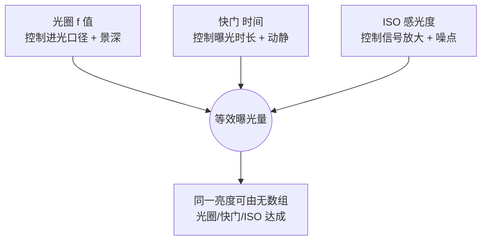

# 第 3 章 曝光

> 曝光从来不是套公式。它是在传感器能记录的范围有限时，决定哪些细节要留下，哪些可以放弃。

---

1936 年 3 月的某个下午，Dorothea Lange 沿着加州 101 号公路往北开。她已经在外面连续奔波了一个月，FSA 派发的那点差旅费快要见底，心里想的只是尽早回家，见到丈夫和孩子。也就是说，那一刻她并没有打算再多拍什么，工作在她心里几乎已经结束了。

就在这样的心境里，路边闪过一个手写的牌子，上面写着 “PEA-PICKERS CAMP”。她起初照直开了过去，车又往前走了一英里，某种说不清的东西却让她掉头折返。

这段经历，她后来在《Popular Photography》里写过。她说自己一看见那个饥饿而绝望的母亲，就像被磁石吸了过去。孩子紧紧靠在母亲身上，脸上带着受了惊吓的神情。Lange 没有问她的名字，也没有追问完整的来历，只知道母子几个是靠野菜和孩子打来的鸟勉强撑着。她在那顶帐篷前后只待了十分钟，一共拍了六张。

就是在这六张之内，Lange 做了几个关乎曝光的决定。她手里是一台 Graflex，4×5 的大画幅。帐篷外面是正午的硬光，直白而强烈；帐篷布则像一层滤网，把这股硬光揉成了柔和一些的漫射。她真正在意的，始终是那位母亲的脸，于是曝光的第一件事，就是先照顾好这张脸。至于帐篷外那片强光，尽可以让它过曝，本就不是画面的重点；帐篷内侧的阴影，也尽可以压暗下去，因为那里的细节同样不承担什么。

这六张里的第三张，就是后来人们所熟知的《Migrant Mother》。它被印了上百万次，挂进博物馆，印上邮票，最终收进美国国会图书馆。可若是单从曝光的角度回头去看，它首先只是 Lange 在那个正午为了保住一张脸所做的一组取舍：她情愿让画面别处丢掉一些细节，只为把这张脸完整地留下来。

这正是曝光的实质。它不能被简单地理解成“准还是不准”，更要紧的问题在于：当相机能记录的亮度范围本就有限时，你究竟愿意让哪些细节留下，又能够接受哪些细节消失。归根结底，在按下快门之前，这个取舍最好心里已经有了一个大致的方向。

---

*Lewis Hine, "Power House Mechanic", 1920。Hine 在发电厂里拍一位机械师调试巨型蒸汽机。光从机器后面右上方落下来，照到工人弯着的背、汗湿的衬衫和手里的扳手上。不重要的部分被压到暗处，画面最后留下的是工人与机器之间那道弧线。这里的曝光没有炫耀技术，它更像一种判断：大量不重要的信息被压下去，一个人面对工业巨兽时那道紧绷的姿态才留在画面中央。 (Wikimedia Commons, 公有领域)*

---

老教科书常说，曝光就是测量场景的反射率，让 18% 灰记录成中灰。这句话本身没有错，可它解释的其实是测光表的工作方式，而不是一个摄影师站在现场时，究竟凭什么去决定曝光。换句话说，它描述的是仪表，不是判断。

更贴近实际的说法是这样的：眼前的场景自有一个亮度范围，从最暗处到最亮处，彼此之间可能相差十档；与此同时，传感器也有它自己能够记录的范围，现代全画幅大约在十四档上下。曝光真正要做的，就是把眼前这一段亮度范围，妥帖地放进传感器所能承载的某一段里。

放进哪一段，就会得到不一样的照片。你可以让亮的地方不至于过曝，同时让暗的地方也尽量留住细节，这是最常见的常态曝光。你也可以反过来先保住高光，让最亮处刚刚好卡在不爆的边缘，任由暗部自然沉下去。你甚至可以先照顾暗部，让阴影里始终有东西可看，转而接受高光白掉一小块。这里没有哪一个选择是天然正确的，能分出高下的，只是哪一个更贴合这张照片想要说的那件事。

正因为如此，不要把曝光误当成寻找唯一的标准答案。你真正要做的，是在相机有限的记录能力之内，把整个画面推到那个最合适的位置上。

---

相机屏幕上的那张预览图，其实是会骗人的。屏幕本身的亮度、四周的环境光、当前的显示模式，都会悄悄干扰你的判断。大太阳底下看屏幕，照片往往显得偏暗，让你忍不住想加曝光；到了夜里再看同一块屏幕，照片又常常显得偏亮，诱着你往下压。真正可靠、不受这些外部条件左右的，是直方图。

直方图所做的，是把一张照片里所有像素的亮度，按高低一字排开。它的横轴从左到右，对应着从纯黑到纯白；纵轴则代表在某一档亮度上，究竟堆了多少像素。如果图形在右边撞了墙，就说明高光已经过曝，那里白成一片，再没有细节可言；如果在左边撞墙，则说明暗部已经死黑。至于整体都落在中间，也只能说明这张的曝光比较平均，并不等于照片就对。

正因为如此，直方图该偏向哪一边，要看拍的是什么。雪景的直方图通常应该偏右，否则那片雪就会被拍成灰的；夜景的直方图则通常应该偏左，否则夜晚会被硬生生拍成白天。也就是说，直方图能够告诉你信息有没有丢失，却没有办法替你判断这张照片究竟有没有味道。它更像汽车的仪表盘，本分只是如实提示状态，至于车往哪里开，方向仍旧握在你自己手里。

除了直方图，高光警告也值得一并打开。这个功能各家叫法不同：Sony 叫斑马线，Fujifilm 叫高光警告，Canon 和 Nikon 则多半叫闪烁；阈值大致可以设在 95 到 100% 之间。设好之后，画面里哪一块过了曝，那一块就会闪烁，或者浮起一道道斜线。拍人像时，把这道警告对准脸部的高光尤其管用：只要脸上一闪，就说明那里快要白掉，随手降一点曝光即可。这样的判断，远比对着屏幕凭感觉去看要可靠得多。

---

Ansel Adams 在 1939 年提出了 Zone System，也就是分区曝光系统，把从纯黑到纯白的灰度切成了十一个区。其中 0 区是全无细节的死黑，10 区是同样没有细节的纯白，介于两端的那几个区则各自保留着不同程度的细节，而 5 区，正好接近前面提到的 18% 灰。

Adams 的工作方式，并不是端着相机站在场景前面，等它告诉自己一个答案。恰恰相反，他会先在脑海里把最终那张底片应该长成什么样想象清楚。譬如远处的雪山，他决定放在第 8 区，让它亮，却仍然留着细节；近处的松林，他放在第 2 区，压得很暗，但还能依稀看出枝干的结构。想清楚了这些，他才动身去逐一测量这些区域的亮度，到最后，连胶片的显影时间都要一并纳进来一起调整。

到了数码时代，很多人觉得 Zone System 早已过时。今天既有直方图，又有曝光补偿，还有可以反复回退的 RAW 文件，确实不必再像 Adams 当年那样，郑重其事地对待每一张照片。可是它遗留下来的那个习惯，至今仍然有用：先在心里替画面定下它应该有的样子，再让相机去配合这个决定，而不是空着手站在场景前，坐等相机替你交出答案。

现实里，很多人的做法是先按下一张，回头看屏幕，发现暗了，于是加一档再重拍一张。这样自然也能修正错误，可归根结底仍然只是现场的补救。更从容的做法，是在按下快门之前，心里就已经大致清楚：这张照片，究竟该往亮处走，还是该往暗处压。

---

曝光归根结底只有三个变量：光圈、快门、ISO。麻烦在于，每一个变量都不只管亮度，还各自拖着一个副作用。光圈在改变进光量的同时，也改变着景深；快门在改变进光时间的同时，也决定了运动是被冻住还是被拖成虚影；ISO 在放大信号的同时，也把噪点一并放大了出来。

这三个变量看上去彼此独立，落到最后却汇进同一处：它们共同凑出传感器接收到的那一份曝光量。也就是说，无论你先动哪一个，最终要凑齐的始终是同一个总量。

这张图真正要点出的，是最底下那一行：同一份亮度，可以由无数组光圈、快门、ISO 搭配达成。换句话说，曝光并不存在唯一正确的一组参数。f/2.8 配 1/500，和 f/8 配 1/60，只要其余两项跟着补上，落到传感器上的那份光其实一样多。正因如此，你站在现场真正要决定的，并不是“亮度够不够”，而是“这一份亮度，我打算拿哪一组副作用去换”。

既然三者可以互相顶替，它们之间就得有一把公共的尺子，否则无从谈起谁补偿谁。这把尺子就是“档”。相邻的两档之间，进光量恰好翻倍或者减半，而光圈、快门、ISO 三者，都能被换算到这同一把尺子上来。下面这张表，把光圈、快门、ISO 三条独立的整档阶梯并排列在一起，按“相对基准亮了几档、暗了几档”对齐。

| 档位 | 光圈 f 值 | 快门(秒) | ISO |
|---|---|---|---|
| 更亮 3 档 | f/2.8 | 1/15 | 800 |
| 更亮 2 档 | f/4 | 1/30 | 400 |
| 更亮 1 档 | f/5.6 | 1/60 | 200 |
| 基准 | f/8 | 1/125 | 100 |
| 更暗 1 档 | f/11 | 1/250 | 50 |
| 更暗 2 档 | f/16 | 1/500 | 25 |

标准整档光圈序列：f/1.4、f/2、f/2.8、f/4、f/5.6、f/8、f/11、f/16、f/22（每档 f 值乘约 1.414，通光面积减半）。

这张表要竖着读，也要横着读。竖着看，光圈、快门、ISO 各自是一条独立的阶梯，每往下一格就暗一档，每往上一格就亮一档；横着看，同一行里的三个数，都表示相对基准亮了或暗了同样的档数。它真正有用的地方，是把互相补偿摆到了明面上：你若为了压暗背景把光圈从 f/8 收到 f/11，那便是暗了一档，想让总曝光不变，就得在快门或 ISO 上补回一档，或是把快门从 1/125 放慢到 1/60，或是把 ISO 从 100 提到 200，二者取其一即可。也就是说，“档”让三个原本各说各话的数字，第一次能够彼此折算。你在取景器里权衡的，从此不再是三串互不相干的读数，而是同一份光在三条路之间的来回分配。

这份光还可以被更精确地量化。以 ISO 100 为基准，一档曝光能够写成一个确定的数，这个数就是 EV：

\[ EV = \log_2\frac{N^2}{t} \]

其中 \(N\) 是光圈 f 值，\(t\) 是快门时间（秒）。EV 每加 1，曝光量就减半，恰好对应前面所说的“暗一档”。这个式子未必要你在现场心算，可它把“档”从一句口头的约定，落成了一个算得出来的数。譬如 f/8、1/125 对应一个确定的 EV，光圈不动，只把快门提到 1/500，EV 就整整高了 2，对应的正是暗了两档。归根结底，有了 EV 这把带刻度的尺，你对“再加半档”“再压一档”的判断，才算真正踩在了可度量的地面上，而不再只是停留在感觉里。

正因为每个变量都有副作用，更稳妥的顺序，是先把景深和运动这两件更要紧的事定下来，再让 ISO 去兜住剩下的亏空。也就是说，你想要多深的景深，就先把光圈定好；你想冻结动作，还是想保留一点拖影，就接着把快门定好；至于最后剩下的那点亮度压力，一并交给 ISO 去承担。

光圈优先，是大多数场景里最省心的默认。你负责设光圈，相机替你算快门，而你只需盯住 ISO 和曝光补偿这两处。具体到题材：人像常用 f/1.4 到 f/2.8，全看你想要多浅的景深；街头常用 f/5.6 到 f/8，好让画面里更多的东西都落进清楚的范围；风光常用 f/8 到 f/11，在景深和锐度之间取一个平衡；室内弱光则往往要开到 f/1.4 到 f/2.8，先把进光量拿够再说。而每一次设完光圈，都要回头看一眼快门：一旦它掉到了安全速度以下，就该提起警觉。

不少有经验的摄影师，习惯把 M 模式配手动 ISO 当作某种专业的标志。可真放到现实场景里，M 模式加上 Auto ISO 往往更实用。你用光圈去控制景深，用快门去控制运动，把适应光线明暗变化这件杂事交给自动 ISO，再用曝光补偿去微调整体的亮度倾向。如此一来，构图、时机和运动这些真正要紧的判断始终攥在你手里，与此同时，又不必每次光线稍有变化，就从头把参数重算一遍。

---

一张照片糊了，背后可能是两种完全不同的原因，对应的处理办法也就不一样。

一种是手抖。相机在曝光的那一瞬间动了，于是整张照片连同背景，一起糊成了一片。另一种是主体动。相机明明端得很稳，可画面里的人或车，在快门开着的那段时间里移动了位置，结果背景是清楚的，唯独动的那一部分拖出了残影。两者看上去同样是糊，根子却南辕北辙：前者是相机在动，后者是被摄对象在动。分不清这一点，就容易开错药方。

对付手抖，有一条流传已久的老规矩，叫安全快门。它的意思是，快门速度最好不要慢于镜头焦距的倒数。也就是说，50mm 的镜头尽量别低于 1/50 秒，200mm 的镜头则别低于 1/200 秒。道理在于，镜头越长，画面被放得越大，与此同时，手上那点抖动也跟着被同比例放大，所以门槛必须相应抬高。如果用的是残幅机身，还得把等效焦距一并算进去。当然，机身或镜头若带着防抖，就可以再往下放慢几档，有时手持 1/8 秒也未必会糊。

但要记住，防抖能管的只是手抖，对主体的运动它无能为力。要冻结一个正常走路的人，大约需要 1/250 秒；要冻结一个奔跑的孩子、一个骑车的人，或者街头快速经过的行人，则常常要 1/500，甚至 1/1000 秒才压得住。正因为如此，按下快门之前不妨先问自己一句：这一张，我怕的到底是自己端不稳，还是对方在动。若怕的是前者，安全快门也就够用了；若怕的是后者，就得撇开安全快门，重新按主体的速度去算。

---

测光模式，说到底是在告诉相机：这一张，你该去看哪一块的亮度。

现代的评价测光已经相当聪明，大多数场景它都能给出一个合理的起点。所以默认就用它便好，不必为了显得专业，就天天端着点测不放。

点测真正的用武之地，是那些反差极强、而主体又只占画面一小块的场景。舞台上，一束聚光灯打在歌手脸上，台下黑得连座椅都看不见；雪地里，站着一个穿黑大衣的人，画面绝大部分都是白；下午逆光时，朋友就站在你面前，背后却是一片亮到刺眼的天空。这些时候，若还让相机去看完整的画面，它就很容易被大片的背景带偏。毕竟评价测光是把整幅画面的亮度平摊开来一起权衡的，一旦画面里绝大部分都极亮或者极暗，这个平均值就被拉向了一边，真正要紧的那一小块主体，反而在里头被稀释得几乎没了分量。

拍歌手时就是如此：评价测光看见满眼的黑，会误以为整体太暗，于是自作主张加曝光，结果歌手的脸白成一片。反过来拍雪地里的人，评价测光看见满眼的白，又会误以为整体太亮，索性把曝光压下去，最终人是黑的，雪也成了灰的。与之相对，点测的做法是对准主体，通常就是那张脸，让相机只认那一小块亮度，背景是明是暗都不参与这个决定。等主体的曝光稳住了，再用曝光补偿去收个尾。

---

测光系统交出来的，终究只是一个建议，你并没有义务全盘同意。曝光补偿的作用，正是在相机的建议之上，让你明确地表个态：这一张，应该再亮一点，或者应该再暗一点。

“白加黑减”是这里最实用的一句口诀。雪、白墙、白衣服，相机会习惯性地把它们压成灰，所以要往上加；煤、黑墙、黑衣服，相机又会习惯性地把它们提亮，所以要往下减。归根结底，测光表默认整个世界都会平均到 18% 灰，而你要做的，就是把本该是白的重新拉回白，把本该是黑的重新压回黑。

具体到数值，各有各的分寸。雪景常常需要 +1 到 +2，否则那片雪就会显脏；黑色物体则常常要 -0.7 到 -1.5，否则黑会泛起一层灰；逆光拍人可能要 +1 到 +2，除非你本就想要一个剪影；夜景又常常要 -0.7 到 -2，因为夜晚本来就该留着暗处。再往大处说，高调的画面可以整体加一点，让它显得亮、薄、轻；与之相对，低调的画面则可以整体减一点，让它显得深、重，带上一层戏剧感。

---

ETTR，全称 Expose To The Right，意思是在不让高光过曝的前提下，尽量让直方图往右边靠。

它的原理并不复杂。传感器在记录亮部时，能够留下的灰阶更多、更细腻；越往暗部走，信息就越稀薄，噪点也越容易冒出头来。既然如此，拍摄的时候索性把曝光推到直方图的右侧，但小心别让它爆掉，等回到后期，再把整体压暗回来，如此一来，暗部的噪点就能少上不少。

这套办法，适合用来拍 RAW 的风光、低反差的场景，以及高 ISO 的弱光。反过来，它并不适合高反差的抓拍，因为稍一推就会爆；也不适合那些原本就不愿意花时间后期的人。需要说明的是，ETTR 和“宁欠勿过”这两句听起来相反的话，其实并不矛盾。宁欠勿过讲的是：当你没有把握时，宁可让画面稍微暗一点，也别把高光一刀剪掉；而 ETTR 讲的是：当高光完全在你的掌控之内时，就尽量把信息吃满。两者针对的，本就是不同的处境。

---

下面这几个场景，都特别容易在曝光上出问题。真正的难点其实不在参数本身，而在于现场的反差太大；如果没有事先想清楚这张照片究竟要保住谁，那么快门一按下去，很可能就得到一张事后无论如何也救不回来的照片。换句话说，这些场景真正考验的，从来不是你会不会拨动参数，而是你在举起相机之前，有没有先替这张照片选定一个非保不可的重点。

第一种是晴天人像，半边脸亮，半边脸黑。太阳从侧面斜照过来，脸的两侧可能相差两三档：亮的那侧脸颊容易过曝，暗的那侧眼窝又整个沉了下去。最省事的办法，是让被拍的人走进树荫、屋檐或者一堵墙的背后，只要整张脸重新落进同一档亮度里，问题立刻就小了大半。想更讲究一些，可以用反光板从暗的那侧补一点光，或者用闪光灯高速同步补上一档。当然，你也可以索性反其道而行，把暗的那半张脸转向相机，让亮侧只在鼻梁旁边留下一道边光，把它拍成一张低调人像。这样的低调，来自现场就已经想透了的选择，等回到电脑前，你需要做的只是顺着这个判断继续往下整理。

第二种是室内的人背对着窗户。主体待在屋里，身后是一面明亮的窗，室内和窗外的亮度可能相差五到七档。给窗户曝光，主体就成了剪影；给主体曝光，窗户又白成一片。这种时候还一味去拧曝光补偿，通常只是在两个同样糟糕的结果之间来回打转而已。更好的办法，是让人往窗边挪两步，再转过九十度，侧对着窗户，如此一来，正面的逆光就变成了侧光，窗外不再那么容易爆，脸上也有了自然的明暗过渡。Vermeer 在四百年前画窗边人物时，用的正是这一套光。

第三种是博物馆和教堂的内部，光线本就暗，反差又复杂，而且通常既不许用闪光灯，也不许架三脚架。这时先要把进光量推到一个合理的范围：光圈开到 f/1.4 到 f/2.8，ISO 放到 3200 到 12800，快门则压在手持能稳住的极限附近。倘若近旁有石柱、墙面或者座椅，不妨靠一靠身体，把它们当成临时的支撑。测光时，切记别让大片的暗部把整个画面的曝光拉亮，而要去点测雕塑的脸、圣像的手，或者那扇彩色玻璃里最要紧的一块，再把曝光补偿压到 -1 到 -2。不要把教堂拍得像一间普通房间那样通亮，它的力量，很大一部分本就藏在暗处。

第四种是演唱会和舞台，主体被聚光灯罩着，四周一片漆黑。这里点测主体，再把曝光稍稍压一点，往往更稳妥。原因在于，聚光灯下的脸本来就比寻常的脸要亮，唯有略微压暗，才保得住那点高光不至于爆掉。快门则靠高 ISO 去顶住，同时记得拍 RAW，给后期留出回旋的余地。

第五种是雪景和雾景，它们看上去很亮，实际上却最容易被相机压成灰。雪景常常需要加曝光，但也别一路加到把雪调成纸一样的死白，留下一点淡淡的蓝色阴影，那片雪才有冷意，也才有空间感。雾景则可以让直方图稍稍偏右，同样不能爆，因为雾一旦爆掉，就成了一堵没有任何层次的白墙。

---

前面一直在讲，反差太大时通常只能选一边去保。对手持抓拍而言，这个说法是对的。可是，如果眼前的场景是静止的，你手里又恰好带着三脚架，那么就还剩下第三条路可走，那就是包围曝光。

它的做法是这样：让相机固定不动，一口气连拍三到五张，其中一张专门照顾高光，一张照顾中间调，一张照顾暗部，每一张彼此之间相差一到两档。等回到家里，再把每一张里曝光正确的那一部分挑出来合在一处，于是天空和地面的细节就能同时被保住。带窗的室内，还有日出日落时那种反差极大的风光，都很常用到这个办法。

不过要分清楚，包围合成和那种一眼就能被认出来的 HDR 风格，完全是两回事。后者的毛病并不出在“合成”这件事上，而是出在处理得太过：天空发乌，云的边缘泛起一圈光晕，石头看着像塑料，处理的痕迹比画面本身还要抢眼。好的包围合成，追求的目标恰恰相反，是要让一张反差过大的照片，看上去就像人眼当时亲眼所见的那样自然。也就是说，真正合得好的时候，观众根本不会察觉到它其实是合成的。

---

前面反复用到“档”这个单位，也说过传感器只能记录有限的一段亮度。那么各种介质究竟能记住多少档，彼此又差出多少，不妨摆到一处对照着看。需要先说明的是，下面这些数字都只是大致范围，会随具体的机型、胶片、冲洗方式和显示条件上下浮动，不必当成精确的定值。

| 介质 | 动态范围(约) |
|---|---|
| 现代全画幅相机 RAW | 13-15 档 |
| 负片 | 10-12 档 |
| 人眼(单一场景、瞳孔不变) | 10-14 档 |
| 手机传感器(单帧) | 9-11 档 |
| JPEG(8 bit 输出) | 约 8 档可用 |
| 反转片(正片) | 5-6 档 |

把这一列数字读下来，几件平时零散的经验就串到了一起。现代全画幅相机的 RAW，能容纳的范围远比 JPEG 和绝大多数显示介质都宽，正是凭着这一份余量，才谈得上“向右曝光”，也才谈得上把欠曝的暗部在后期重新拉回来；这些操作之所以留有空间，靠的正是 RAW 比最终那份 8 bit 输出多出来的那几档。与之相对，反转片的宽容度在这张表里最窄，只有五到六档，几乎没有多少容错的余地，正因如此，拍反转片对曝光也最为苛刻，差上半档，高光或暗部可能就再难找回。也就是说，你手里记录的是什么介质，直接划定了现场允许你犯错的边界：介质越宽，越可以先把画面拍下来，回过头再慢慢处理；介质越窄，就越要在按下快门之前，把这一份曝光量算准。

---

拍 RAW，在曝光上要比 JPEG 宽容得多。欠曝两档，后期往往还能拉得回来，代价不过是噪点会多一些；可过曝一档就不同了，高光一旦被剪掉，大概率就再也找不回来。正因为如此，当你拿不准的时候，宁可让画面稍微暗一点，把曝光补偿放在 -0.3 到 -0.7，给高光留出一线余地。

但这绝不等于要你永远把照片往暗里拍。真正成熟的曝光判断，是清楚地知道什么时候该保高光，什么时候该保暗部，什么时候可以把直方图大胆推到右边，什么时候又该让整个画面沉下去。练到后来，曝光就不再只是停留在知识层面的东西，它会慢慢长成手指上的习惯。于是你看见一个场景，相机都还没举起来，心里已经大致有了数：这一张，该加半档，还是该压一档。

---

## 练习

出门一天，每按一张快门马上看直方图，不要先看预览图。看三十张以后，你应该能从现场亮度大致预判直方图会长什么样。

打开高光警告，阈值设到 100%。拍人像三十张，每次留意脸上有没有闪烁。有就降曝光，直到高光不再闪。

设 f/5.6、1/500s、Auto ISO，上限 6400，出门拍街头一小时。让相机适应光线变化。回家看 ISO 跨度多大，对应画面有什么变化。

找一个反差大的场景，比如雪地、暗厅、逆光人。先按相机默认拍，再判断需要什么补偿，再拍一张。比较两张哪个更接近你想要的结果。重复十次。

曝光靠背概念练不出来。你要反复在现场看直方图、看高光警告、看回放，再回头想自己当时为什么加、为什么减，手指才会在你还没有完全说出理由之前，先知道这个场景该往哪边调。

---

下一章：[第 4 章 色彩](04-color.md)
