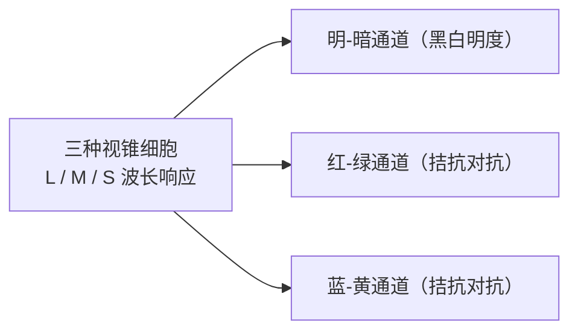

# 第 4 章 色彩

> 色彩承载着画面的情绪，亦决定画面的纯净。若未能妥善梳理色彩，画面容易显得杂乱；观者尚未来得及看清主体，视线便已被突兀的色块所分散。

---

## 色彩成为摄影语言

1976 年 5 月，纽约现代艺术博物馆（MoMA）举办了一场在摄影史上影响深远的展览，题为《威廉·埃格尔斯顿指南》（*William Eggleston's Guide*）。

展厅白色的墙面上，挂着七十五幅记录美国南方寻常小镇的彩色照片：一辆停在红砖车道上的旧儿童三轮车，普通人家斑驳的门廊、凌乱的餐桌与后院，以及几条从水泥墙角拉向天空的电线。这些物象十分日常，在生活中很容易被匆匆略过；然而它们被装裱进画框，走进了当时的现代艺术殿堂。

要理解这场展览在当年的意义，需要回顾当时的艺术背景。在 1976 年之前，彩色摄影在严肃艺术领域中少有立足之地。被普遍推崇的摄影多为黑白银盐作品，而彩色则常被视作商业广告、家庭快照、风光明信片与时尚杂志的实用媒介，而非探索艺术语言的形式。

正因如此，当年《纽约时报》艺术评论家 Hilton Kramer 在报端写下了直接的批评——针对策展人称赞这些照片“完美”的说法，他写道：“完美？或许是完美地平庸，无可置疑地完美无聊。”

然而数十年过去，这批照片深刻影响了现当代彩色摄影的发展。

原因在于：Eggleston 镜头下的色彩，并非为了迎合明信片式的悦目风光。他所记录的，正是战后美国日常生活的真实色彩：深红色的天花板下悬着的一颗裸露灯泡，廉价工业油漆刷出的绿墙，公路边闪烁的霓虹，加油站塑料瓶上的反光，皮卡上的红漆，快餐店的明黄。

这些色彩植根于工业制造与日常生活之中，平实普通。然而他以冷静而专注的目光将它们定格，让观者在展厅中重新审视这些被忽视的日常细节。

色彩在摄影中的表现力，往往正蕴藏在这些真实的肌理之中。它不仅关乎视觉上的协调，更能够记录一个时代的物质印记、一座城市的具体气质，以及某种生活方式的日常样貌。

色彩从来不仅是画面的修饰，它本身就是叙事与记忆的一部分。

---

## 先做减法

初学彩色摄影时，容易被丰富的色彩所吸引，红黄蓝绿一同涌入画面，看似热闹。

然而问题往往也由此产生：许多不够耐看的照片，原因通常不在于色彩贫乏，而是颜色过多且缺乏主次，最终在画面中相互分散注意力，削弱了主体的表现力。

在一幅成熟的画面中，通常两三种核心色彩便足以支撑起整体氛围。

Saul Leiter 住在纽约东村，多年来拍摄的大多是自家门前几条街巷的日常。他常使用过期的彩色胶片（如 Kodachrome），色调沉稳，红、黄、棕在水汽与微雨中自然展开：一把红伞穿过落雪，一辆黄色出租车在窗后形成色块，深色大衣的身影融入暗部。他的画面中很少有多种鲜艳色块的冲突，大面积由深暗、薄雾、玻璃反光与中性灰调构成，被保留下来的色彩因而显得格外清晰。

Steve McCurry 拍摄的《阿富汗少女》，红头巾与绿眼眸之间的色彩对比直接而明确。那张肖像的力量不仅来自神情，红与绿的色彩搭配亦强化了画面的视觉焦点。McCurry 的作品色彩浓郁饱满，但通常保持着清晰的秩序：有一两种核心色调作为主导，其余色彩退为衬托。

Joel Sternfeld 在《美国前景》（*American Prospects*）中则呈现了另一种克制的色调。他漫游全美记录景观，画面多呈现灰绿、土黄与淡蓝。在一幅作品中，搁浅的抹香鲸停留在清冷的灰白海滩上；在另一幅作品中，远处的木屋在演习中燃烧，而近处的消防员在路旁平静地挑选南瓜。色彩淡雅克制，却真实地呈现出环境的质感。

色彩的表现力，并不只靠浓烈来体现；在许多时候，恰当的克制往往更具表现力。

Stephen Shore 拍摄《非寻常之所》（*Uncommon Places*）时，色彩同样平实：米黄、水泥灰、淡蓝与暗黄。那些色彩并不喧宾夺主，却恰如其分地记录下当时街道与空间的真实秩序。

反之，过度拉高饱和度的处理往往容易产生视觉疲劳——所有颜色都在争夺注意力，反而让画面失去了呼吸感。

更稳妥的方法，是让次要色彩适度退让，保持画面的纯净，让观者的视线自然落在主体之上。

---

### 彩色摄影从三通道开始

*Sergey Prokudin-Gorsky 早在 Eggleston 之前六十多年，就用三次曝光分别通过红、绿、蓝滤色片记录画面，再把三张分色影像合成为鲜明的彩色。这张 1911 年的布哈拉埃米尔肖像里，真正鲜艳的是那身钴蓝长袍，背景的墙、地毯和草地都低下去，变成灰绿和土黄。一种颜色站出来，其余颜色让开，画面立刻安静。可见控制色彩并不是现代人的趣味，彩色摄影刚能被拍出来时，这件事就已经重要了。[图片来源与复用说明](image-credits.md#prokudin-gorsky-emir)*

---

## RGB 与 CMYK

Prokudin-Gorsky 的分色技法，直观地展示了色彩物理的底层规律。

他在野外拍摄时，使用特制相机透过红、绿、蓝三色滤光镜连续曝光三次，得到三张明暗不同的黑白底片；展示时，再用红、绿、蓝三色光线将这三张影像重叠投影在幕布上，还原出完整的色彩。

色光在空间中叠加形成白光，这便是**加色法**（Additive Color Mixing）。

今天我们使用的电子屏幕皆基于这一原理。放大手机或显示器屏幕，可以看到每个像素由红（R）、绿（G）、蓝（B）三个子像素构成；它们按不同亮度比例发光，在一定距离外混合成不同颜色。三色全开为白，三色全关为黑。

数码相机传感器亦建立在此基础上：感光元件表面的拜耳阵列分别记录红、绿、蓝单色信息，再通过算法插值还原。从拍摄到屏幕显示，数码影像主要运行在加色法的 RGB 体系中。

与此相对的是**减色法**（Subtractive Color Mixing）。

颜料与印刷油墨依赖对环境光的吸收和反射来显色。白纸反射日光中的全光谱；涂上青色（Cyan）油墨会吸收红光而反射青蓝光；叠印品红（Magenta）则进一步吸收绿光。

减色法的三原色为青、品红、黄（CMY）；油墨叠加越多，反射的光线越少，颜色越深。由于工业颜料无法做到绝对纯净，三色混合通常只能得到深褐色，因此现代印刷增加了黑墨，形成 CMYK 体系（K 代表 Key Plate）。

了解这两套体系有助于理解屏幕与印刷的差异：在调色板上红与绿混合变暗变浊，这是减色法；而在屏幕上红光与绿光叠加呈现明亮的黄色，这是加色法。

从拍摄到数码后期主要在 RGB 环境中进行；而在实体画册印刷时则进入 CMYK 环境。屏幕上部分高饱和的色彩在印刷油墨中可能超出其色域范围，因此印前需要进行软打样以确认印刷效果。

| 维度对比 | 加色法（Additive Mixing） | 减色法（Subtractive Mixing） |
|---|---|---|
| 物理三原色 | 红、绿、蓝（RGB） | 青、品红、黄（CMY） |
| 作用机制 | 光线能量的叠加放射 | 介质对特定光波的吸收与过滤 |
| 三原色叠满 | 汇聚为纯白（全能量） | 沉降为深黑（无能量反射） |
| 核心领地 | 电子屏幕、感光芯片、舞台灯光 | 绘画颜料、印刷油墨、纸张显影 |

---

## 色相、饱和度与明度

分析色彩时，可以从三个基本维度来理解：

*   **色相**（Hue）：颜色的基本相貌（如红、绿、蓝），对应色相环上的角度位置；
*   **饱和度**（Saturation / Chroma）：颜色的鲜艳程度与纯度，从纯色到中性灰；
*   **明度**（Lightness / Value）：颜色的明暗程度；同一种红色，可以是明亮的浅粉，也可以是深沉的暗红。

日常所说的“颜色刺眼”，可能是饱和度过高，也可能是色相对比过于突兀，或是明度反差过大。理清这三个维度，在后期使用 HSL 工具时便能更有针对性地微调。

在拍摄前，可以观察场景中的色彩关系：

**单色主导**：画面整体以一种主要色调为主，依靠明度层次展开。如大雾清晨的灰调、蓝调时刻的深青、沙漠正午的土黄。这类画面整体感强，适合保持纯净。

**互补对比**：使用色轮两端的对立色彩，如红与绿、蓝与橙、黄与紫。互补色具有较强的视觉张力，通常建议以一种色彩为主（占据大部分面积），另一种色彩作为点缀。若两种互补色面积相当，容易产生视觉冲突。

**邻近和谐**：使用色轮上相邻的色彩，如红、橙、黄的暖色过渡，或蓝、青、绿的冷色过渡。这类搭配过渡自然，容易营造统一温和的氛围。

---

### 对立色与视觉适应

互补色之所以具有强烈的视觉张力，源于人类视觉神经的生理机制。

视网膜上的视锥细胞对长波（红）、中波（绿）、短波（蓝）产生响应后，信号在神经节细胞层被编码为三对互相对立的通道：**红-绿通道**、**蓝-黄通道**与**明-暗通道**，这便是**视觉对立过程理论**（Opponent Process Theory）。

每对通道在同一时间只能偏向一端。红与绿、蓝与橙处于同一通道的两极，因此在视觉上产生强烈的对比感。

长时间注视红色方块后再看白纸，眼前会出现淡绿色的虚影，这是视觉神经疲劳后产生的**视觉后像**（Afterimage）。了解这一原理，有助于在构图与调色中更有意识地运用色彩对比。

---

## 颜色也来自光

物体的颜色不仅由其自身的材质决定，还深受环境光线的影响。

白色的墙面，在正午日光下呈现中性白，在夕阳下被染上暖黄色，在蓝调时刻则呈现冷蓝色。

物体自身具有物理反射率决定的**固有色**（Local Color）；但最终进入镜头并被记录下来的，是固有色与环境光混合后的结果。

黄昏的暖光能让红砖与秋叶色调更趋统一，但也会使冷色元素显得明显；阴天的漫射光降低了反差，使整体色彩趋于柔和。光线的色温是画面的基底，决定了色彩的整体倾向。

---

## 白平衡是在选择解释

同一张白纸在烛光下反射出偏橙的光线，在日光下反射接近中性的光线，但人类通常都能认出它是白纸。

这是人类视觉的**颜色恒常性**（Color Constancy）：大脑会自动适应并过滤环境光的色偏，还原记忆中物体的固有颜色。这一过程在生理学上常用**冯·克里斯模型**（von Kries Model）来描述：

\[ L' = k_L\,L,\quad M' = k_M\,M,\quad S' = k_S\,S \]

数码传感器则会客观记录实际接收到的光线。如果光线偏暖，传感器便如实记录偏暖的数据。

**白平衡**（White Balance）的作用，正是告诉相机在当前光线下以什么为中性参考，重新调整 RGB 通道的比例，使白色得以准确呈现。

调节白平衡通常涉及两个维度：

1.  **色温**（Color Temperature，单位 K）：调节黄与蓝之间的冷暖轴线。
2.  **色调**（Tint）：调节绿与品红之间的轴线，用于修正荧光灯或部分 LED 灯具造成的偏绿现象。

| 典型光源 | 大致色温 | 常见偏色特点 |
|---|---|---|
| 烛光 | 约 1800–2000 K | 明显橙红暖光 |
| 钨丝灯 / 白炽灯 | 约 2700–3200 K | 室内偏黄光 |
| 日出 / 日落（地平线附近） | 约 2000–3000 K | 浓郁金黄与橙红 |
| 正午日光 / 闪光灯 | 约 5500 K | 标准中性日光 |
| 阴天漫射光 | 约 6500 K | 偏冷偏灰 |
| 阴影处 / 蓝调时刻 | 约 8000–10000 K | 明显冷蓝调 |
| 荧光灯 / LED | 视具体型号而定 | 容易偏绿，需调整色调（Tint）补偿品红 |

在拍摄时，**建议使用 RAW 格式**，白平衡数据可无损后期调整。而在 JPEG 格式下，白平衡被固定在像素数据中，大幅调整容易损失画质。

需要明确的是，白平衡不仅用于还原中性，更是营造氛围的工具。夕阳下的暖意若被强行校正为正午的冷白，便失去了黄昏原本的情绪。根据创作意图保留适度的环境色温，往往比追求绝对的“中性白”更具感染力。

---

## 主色与跳色

在色彩搭配中，常用的有效方式是建立大面积的**基底主色**，配合少量的**跳色**（Accent Color）作为视觉焦点。

例如：大面积绿色草地上的一抹红衣；灰色水泥墙边的一束黄色小花；蓝调夜幕下一盏温暖的路灯。

小面积的跳色能迅速引导观者的视线，成为画面的焦点，使原本平淡的画面产生视觉中心。

在街头拍摄中，中性色调的背景中出现一把亮色的雨伞或一件醒目的外套，往往能起到聚拢视线的作用。

相反，如果画面中红、黄、蓝、绿面积相当且都很饱和，容易缺乏视觉重心，显得散乱。

---

### 饱和度与自然感

在后期调整色彩时，过度提升全局饱和度容易使颜色失真，尤其是肤色、绿色植物与天空最容易显得不自然。

当某一颜色通道的数值过早达到上限时，色彩的明暗过渡会被压缩成色块，同时可能伴随色相偏移（如红色偏向燥橙，蓝色偏向紫青，肤色发假）。

适度降低饱和度可以使画面更显温和纯净；但若无节制地降低饱和度，画面也容易失去生气。

低饱和度的画面通常需要良好的光影反差或清晰的线条结构来支撑；若原片构图平淡、光线缺乏层次，单纯抽离饱和度只会使画面显得灰暗。

更细致的做法是使用 **HSL 面板** 分别调整各个色彩通道：仅对需要强调的核心色彩进行微调，让其余色彩保持自然协调。

**自然饱和度**（Vibrance）主要提振画面中原本较淡的色彩，对已经饱和的区域保护较好，对人物肤色的影响相对温和，适合作为基础调整。

---

## 记忆色不是测量值

人类对某些常见事物有着明确的认知印象，即**记忆色**（Memory Colors）：健康的肤色、晴朗的蓝天、翠绿的草木。

人们对这些颜色的偏离非常敏感：肤色发绿容易显得不适，植物发枯容易显得缺乏生机。

研究表明，人们偏好的记忆色往往比物理实测值略微鲜明一些。但在调整时需保持适度，让色彩服务于整体的画面氛围与情感表达，避免脱离实际的过度修饰。

---

## 色域、位深与输出

理解数字色彩管理，有助于保证成片在不同设备上的一致性：

**色域**（Color Space）定义了色彩的范围：
*   **sRGB**：通用色域，适合网页浏览、社交媒体与常规冲印；
*   **Display P3**：现代广色域屏幕（如手机、平板及多数现代显示器）支持的色彩范围，在红绿区域比 sRGB 更宽；
*   **Adobe RGB**：传统广色域标准，涵盖更多青绿区域，适合专业印刷输出；
*   **ProPhoto RGB**：范围极宽的后期工作色域，适合 16 位 RAW 文件处理。

**色彩位深**（Bit Depth）：
*   8 位（8-bit）：每个通道 256 级灰阶，共约 1670 万色；
*   16 位（16-bit）：每个通道 65536 级灰阶，过渡更平滑，后期调色时不易产生色彩断层。

调色工作建议在经过校色的显示器上进行，保证屏幕显示的准确性。网络发布时导出为 sRGB 色域与 8-bit JPEG，以获得广泛的兼容性。

---

## 练习

出门拍摄时寻找以单一主色调构成的场景（如全灰的大雾、全蓝的傍晚、土黄的街墙），练习用明暗层次支撑画面。

在街头寻找一组互补色（如红与绿、蓝与橙），尝试让其中一种颜色占主导面积，另一种作为小面积点缀。

用 RAW 格式拍摄一组夕阳下的照片，在后期中分别尝试：自动白平衡、校准为正午色温、以及保留暖色温，对比三种处理方式对画面情绪的影响。

挑选一张色彩丰富的照片，在 HSL 面板中尝试降低除主体以外其余颜色的饱和度，观察画面焦点的变化。

---

下一章：[第 5 章 镜头语言](05-lens.md)
