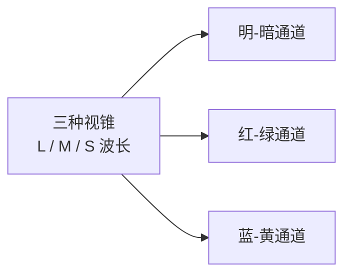

# 第 4 章 色彩

> 色彩决定画面的情绪，也决定画面干不干净。控制不好色彩，照片很容易变得吵，观众还没看清内容，先被颜色推开了。

---

## 色彩成为摄影语言

1976 年 5 月，纽约现代艺术博物馆办了一场展览，叫 *William Eggleston's Guide*。展厅的墙上挂着 75 张美国南方小镇的彩色照片：一辆停在车道上的儿童三轮车，平常人家的门廊、餐桌和后院，还有几条从墙角胡乱拉出去的电线。这些东西平淡到几乎没有人会多看一眼，可它们被一张一张郑重地裱起来，挂进了当时最重要的现代美术馆。展览办了两个多月。

要理解这件事在当时有多刺眼，得先知道那一年的空气。在 1976 年，彩色照片在艺术摄影里几乎没有地位。被认真对待的摄影师大多拍黑白，彩色则被顺理成章地归到另一类用途里：商业广告、家庭快照、明信片和杂志插图。彩色是拿来卖东西、拿来留念的格式，而不是拿来进美术馆的语言。也正因为如此，当年最有分量的艺术评论家之一 Hilton Kramer 在《纽约时报》上留下了那句著名的讥评——针对策展人所谓“完美”的照片，他写道：“完美？也许是完美地平庸。肯定是完美地无聊。”

几十年后再回头看，那 75 张照片却改写了后来的整个彩色摄影。原因在于，Eggleston 拍的并不是一般意义上讨人喜欢的漂亮颜色。他拍的是美国日常生活本身的颜色：被漆成血红色的天花板和吊在下面的一只白炽灯泡，廉价油漆刷出来的墙，深夜还亮着的霓虹招牌，加油站，汽车配件店塑料件上那种反光，福特皮卡的红，汉堡连锁店的黄。这些颜色都长在工业、消费和地方生活里，本来平庸到极容易被人一眼滑过去。可是他偏偏让它们停了下来，被人认真地、长久地看。

色彩在摄影里能做的事，常常就藏在这里。它当然会影响一张照片好看不好看，但它更深的用处，是能把一个时代的消费痕迹、一座地方特有的气味，以及某一类正在过去的生活方式，一并封存进画面。归根结底，颜色不只是装饰，它也是记忆。

---

## 先做减法

刚开始拍彩色照片时，人很容易喜欢上“色彩丰富”这四个字，因为第一眼确实有冲击力，红黄蓝绿一起扑过来，看着热闹。可问题恰恰出在这份热闹上：很多照片之所以无聊，并不是因为颜色太少，而是因为颜色太多，彼此又没有关系，最后只剩一堆互相争抢的色块，谁也压不住谁。

一张照片里，通常有两三种主要颜色就足够了。Saul Leiter 住在纽约东村，几十年里拍来拍去就是 East 10th Street 附近那几条街，有时从二楼公寓的窗户往下望，更多时候走在街面上。他常用各种过期的彩色胶卷，包括 Kodachrome，颜色因此常常是温柔的中调，红、黄、棕慢慢从画面里浮出来：一把红伞从落雪里穿过，一辆黄色出租车被玻璃切成几块，一个穿棕色大衣的人在橱窗后面淡成剪影。他的画面里很少出现许多鲜艳色块同时争抢的局面，剩下的往往是黑、雾、玻璃和大片的灰，那点被留下来的颜色便有了分量。

Steve McCurry 1984 年在白沙瓦的难民营里拍的那张“阿富汗女孩”，红头巾和绿眼睛之间的关系非常清楚。那张照片的力量当然不只来自颜色，可是一旦抽掉红与绿之间那种紧绷的对峙，画面会立刻塌下去一大半。McCurry 后来在印度、缅甸、西藏拍的许多照片，也都能看出同一种习惯：颜色饱和，却始终有秩序，一张照片里总留着一两种颜色真正负责主唱，其余的退到伴奏的位置。

Joel Sternfeld 的《American Prospects》走的则是完全相反的一条路。他开着一辆大众露营车走遍美国，前后拍了八年。画面里的颜色常常是灰绿、土黄、淡蓝。一张照片里，一群搁浅死去的抹香鲸横陈在俄勒冈的海滩上；另一张里，远处一栋房子正在火里烧着——那其实是一场消防演习的受控焚烧——近景处一个消防员却在路边的南瓜摊前不慌不忙地挑南瓜。颜色克制到近乎冷淡，可也正因为冷淡，那种荒诞才显得更刺眼。这说明色彩的力量不一定来自浓烈，有时恰恰来自节制。

Stephen Shore 1973 年开车横穿美国拍《Uncommon Places》，用的是大画幅。他拍加油站，拍汽车旅馆，拍餐桌，拍空荡荡的停车场，颜色也很平：白、米、灰、浅蓝、淡黄。那些颜色一点都不抢，但正是这份不抢，把美国路边空间那种秩序、空旷和无聊，原封不动地留了下来。

与这些相比，Instagram 式那种下手极重的滤镜正好站在另一个极端。所有颜色都被推到顶，第一眼确实有效，第二眼就开始累，因为每一种颜色都在扯着嗓子喊。这样的色彩不是在组织画面，而是在抢夺注意力。更稳的做法，是让颜色少一点、准一点，把画面本身交还给观众，而不是先让观众看见你的处理。

---

### 彩色摄影从三通道开始

*Sergey Prokudin-Gorsky 早在 Eggleston 之前六十多年，就用三次曝光分别通过红、绿、蓝滤色片记录画面，再把三张分色影像合成为鲜明的彩色。这张 1911 年的布哈拉埃米尔肖像里，真正鲜艳的是那身钴蓝长袍，背景的墙、地毯和草地都低下去，变成灰绿和土黄。一种颜色站出来，其余颜色让开，画面立刻安静。可见控制色彩并不是现代人的趣味，彩色摄影刚能被拍出来时，这件事就已经重要了。[图片来源与复用说明](image-credits.md#prokudin-gorsky-emir)*

---

## RGB 与 CMYK

Prokudin-Gorsky 那套方法之所以值得停下来多讲一句，是因为它把彩色最底层的一条道理直接摆到了明面上。他拍摄时，先后透过红、绿、蓝三块滤色片曝光三次，得到三张黑白底片；放映时再用三束分别染上红、绿、蓝的光，把这三张影像叠回同一处，颜色便重新长了出来。三束有色光叠加，合成出来的竟然是接近白的亮，这就是**加色法**（additive）。

我们今天用的屏幕，走的正是同一条路。凑近一块手机或显示器的屏幕去看，你会发现每一个像素其实是红、绿、蓝三个极小的发光点，它们按不同比例一起发亮，眼睛在一段距离之外再把它们并成一种颜色。三点都亮到满，看到的是白；三点都熄灭，就是黑。相机也生活在这套逻辑里：传感器表面覆着一层红绿蓝相间的滤色阵列，每个像素只记录三原色中的一种，事后再由算法把缺的两种补齐。也就是说，从拍摄到显示，这条链路自始至终都待在 RGB 的世界里，靠光的相加来生成颜色。

与之相对的，是另一套方向完全相反的逻辑：**减色**（subtractive）。颜料、油墨和印刷靠的不是发光，而是吸收。一张白纸本来把各种波长的光都反射回来，你在上面涂一层青色的墨，它就吃掉红光，只留下青；再叠一层品红，又吃掉绿光。减色三原色是青、品红、黄（cyan、magenta、yellow），它们叠得越多，被吃掉的光越多，画面就越暗，理论上三色叠满会趋向黑。印刷因此还要额外补一版真正的黑墨，这就是 CMYK 里的那个 K。

分清这两套逻辑，能解开一个从小就埋下的错觉。我们在美术课上调颜料，红加绿会调出一片发脏的暗色，那是减色的直觉；可屏幕上红光加绿光，得到的却是明亮的黄，方向正好相反。摄影从取景到修图基本都在加色的 RGB 世界里，只有到了打印那一步，才真正踏进减色的领地。很多人第一次把屏幕上鲜亮的照片印出来，发现颜色明显发闷，原因往往就在这里：加色能到达的一些明亮而饱和的颜色，减色的油墨本来就无从企及。

| | 加色（additive） | 减色（subtractive） |
|---|---|---|
| 三原色 | 红、绿、蓝（RGB） | 青、品红、黄（CMY） |
| 机制 | 光相加 | 颜料吸收（相减） |
| 三色叠满 | 趋向白 | 趋向黑 |
| 典型场合 | 屏幕、相机、投影 | 颜料、油墨、印刷 |

---

## 色相、饱和度与明度

谈颜色的关系之前，先把描述颜色的三个词立起来，后面所有讨论都要踩着它们走。任何一种颜色，都可以拆成三个互相独立的属性：**色相**（hue）说它是红是绿是蓝，也就是它在色轮上站的位置；**饱和度**（saturation）说它有多纯，纯到艳丽，淡到接近灰；**明度**（lightness）说它有多亮，同一个红，可以亮成粉，也可以沉成酒红。平时说“这颜色太冲”，冲的可能是饱和度，也可能是色相冲突，还可能只是明度太跳，把这三个维度拆开来看，问题在哪一维就清楚在哪一维。后面要讲的 HSL 工具，名字里那三个字母，正是这三个属性。

按下快门之前，最好先问自己一句：这张照片里的颜色，彼此到底是什么关系？这个问题看起来简单，却几乎能替你把画面提前理顺一遍。

有时，一个画面基本上只有一种颜色，全靠明暗的深浅撑起层次。雾天里，整个世界都浸在灰里，剩下的只有浓和淡的区别；蓝调时刻，天和地是同一种青蓝，路灯还没有完全亮起来；沙漠的正午，一切都是米黄，连影子里也掺着沙的颜色。这种画面安静、整体，它最怕的从来不是颜色不够多，而是中途忽然混进一个毫不相干的鲜艳色块，把观众的视线硬生生拽走。

有时，一个画面靠两种颜色互相顶住。红和绿，蓝和橙，黄和紫，这些互补的搭配都会带来很强的张力。只是这类颜色关系一定要分出主次：一般来说，应该让一种颜色占据大部分面积，另一种只做小小的点醒。最难处理的情形，恰恰是两边各占一半，因为那样它们会同时争夺主体的位置，谁也不肯退让，画面于是被撕成两半。

还有一种，是几种相邻的颜色慢慢过渡。红、橙、黄连在一起，让人想到黄昏、火焰和秋叶；蓝、绿、青连在一起，像雨林、湖面和阴天的海；紫、红、粉连在一起，则像日落、花丛和霓虹。这一类颜色不靠冲突取胜，而是靠一层气氛把整个画面缓缓包住。

如果你站在一个场景前，说不清这里的颜色究竟是什么关系，那通常说明颜色还没有被整理好。而颜色一旦没有秩序，画面几乎必然会显得脏。

---

### 对立色与视觉适应

前面说互补色之间会互相顶住、会带来最强的张力，这条经验其实有一层生理上的来路，值得往下挖一层。

颜色进入眼睛时，先由三种视锥细胞分别对长、中、短波长的光作出反应，可这三路信号并不是就这样一路直送进大脑的。在视锥之后，视觉系统会把它们重新编码成三对互相拮抗的通道：红-绿是一对，蓝-黄是一对，明-暗（黑-白）又是一对。这套解释叫**对立过程理论**（opponent process theory）。每一对通道在同一时刻只能偏向一端，要么偏红，要么偏绿，不可能又红又绿，所以我们从来见不到一种“带红的绿”，也见不到“带黄的蓝”。

互补色的张力就从这里来。红和绿正好落在同一条神经通道的两端，把它往相反的两极同时拉扯，对比因此被推到最满。蓝和橙之所以同样强烈，是因为橙本身偏黄，蓝配橙约等于在蓝-黄那条通道上做同样的事。严格说来，生理上的两对色轴是红-绿和蓝-黄，画家口中的那几组互补色只是贴着它们走，可张力的来源是一致的。

有一个现象能顺手印证这套机制：盯着一块饱和的红色看上半分钟，再把视线移到一张白纸上，你会看到一团淡淡的绿色浮出来。那是被持续刺激的红-绿通道疲劳之后向反方向的反弹，也就是所谓的视觉后像。懂得这一层，再回头安排红配绿、蓝配橙，你就不只是照着“好看”的经验在摆，而是知道自己正在拨动观众眼睛里的哪一根弦。

---

## 颜色也来自光

这里还有一层，最容易被忽略：画面里的颜色，并不只来自物体本身。

一面白墙，在正午是白的，到了黄昏会被夕照染成橘红，到了蓝调时刻又会沉成青灰。也就是说，物体有它固有的颜色，可真正进到照片里的，是这份固有色被当时的光线重新染过之后的结果。你以为自己在控制墙、衣服和树叶的颜色，很多时候其实是在控制落到它们身上的那束光。

懂得这一点以后，看色彩的方式会跟着变。你不再只问眼前有哪些颜色，还会顺带问一句：此刻的光是什么颜色，它会把这些物体各自推向哪里。黄昏的暖光会让红和黄更统一，也会让画面里的冷色显得突兀；阴天的冷光则会把所有颜色一起压灰。换句话说，光的颜色是底色，物体的颜色长在这层底色之上。第 2 章讲的是光的方向和质感，这里要补上的，正是光怎样改变颜色。

---

## 白平衡是在选择解释

既然光的颜色是底色，就有一个问题绕不过去：明明是同一张白纸，在烛光下反射回来的光其实是橙的，在正午反射回来的光才接近中性，为什么我们两次都把它看成白？

答案在于，人脑会替我们把光源的颜色折算掉。这种能力叫**颜色恒常性**（color constancy）：不论环境光偏暖还是偏冷，大脑都会尽量把物体还原成它“本来的”颜色，让白纸在烛光下、在阴天里、在荧光灯下都仍旧是白纸。它背后的机制通常用**冯·克里斯模型**（von Kries model）来近似描述，说的是三种视锥各自独立地调节自己的增益：环境光里哪种波长偏多，对应的那一路视锥就把灵敏度调低一些，几路一起重新标定，白便又被拉回中性。这是一套自动运行、且我们完全无从察觉的运算。若把三种视锥对当前光源的响应分别乘上各自的一个系数，冯·克里斯模型做的事大致就是把它们归一化回白点：

\[ L' = k_L\,L,\quad M' = k_M\,M,\quad S' = k_S\,S \]

其中每个系数正比于该路视锥对当前光源白点响应的倒数。三路各调各的，正是这套分通道的重新标定，让白纸在不同光下都还是白。

相机没有人脑那套会自动折算的机制。它只会老实记录落到传感器上的光，光是橙的，纸就被记成橙的。于是我们必须替它补上这一步，这一步就是**白平衡**（white balance）：告诉相机在此刻这束光下什么才算白，它再据此把三个通道重新标定一遍。说到底，白平衡就是一次手动的冯·克里斯，把人脑本能完成的事，改由参数来完成。

描述这束光的偏色，需要两个维度，而不是一个，这一点很多人只做了一半。

第一个维度是**色温**（color temperature），单位是开尔文（K），管的是暖-冷、也就是黄-蓝这条轴。这里有一处反直觉的地方：色温越高，颜色反而越偏蓝、越“冷”。原因是这个数值本来描述的是一块理想黑体被加热到某温度时发出的光：一块铁烧到一千多度发红，这是低温那头；再往高走，现实里的铁早就化了，可温度这条轴还在继续——太阳表面接近六千开，发出的光近乎中性的白，而那些表面温度上万开的恒星，看上去就是泛蓝的。所以一千九百开的烛光是暖橙，五千五百开的日光接近中性，六千五百开已经略偏冷，上万开的蓝天阴影则冷得发青。摄影师口中的冷暖，和物理上的高低温正好相反。

第二个维度是**色调**（tint），管的是另一条与色温垂直的轴：绿-品红。荧光灯和不少 LED 的光谱里带着一道绿色的尖峰，拍出来整体会浮起一层脏绿，这种偏色单靠调色温永远调不干净，因为色温只在黄和蓝之间移动，触及不到绿。你得往品红那一侧补一点，才能把绿压回去。很多人白平衡怎么调都总差一口气，问题就出在只拧了色温，漏掉了色调这一维。

| 光源 | 大致色温 | 常见偏色倾向 |
|---|---|---|
| 烛光 | 约 1800-2000K | 极暖，偏橙 |
| 钨丝灯 | 约 3000K | 暖，偏黄 |
| 日出 / 日落（贴近地平线） | 约 2000-3000K | 极暖 |
| 闪光灯 / 正午日光 | 约 5500K | 接近中性 |
| 阴天 | 约 6500K | 略冷 |
| 蓝天阴影 | 约 8000K 以上 | 冷，偏蓝 |
| 荧光灯 / 部分 LED | 视型号而定 | 偏绿，需往品红校正 |

知道了这两个维度，还得落到手上怎么定。这里有一条几乎不用犹豫的前提：尽量拍 RAW。RAW 把白平衡留成可以重新解释的参数，调整余地远大于 JPEG；JPEG 则把当时的白平衡写进成片，大幅修正更容易损伤颜色。真要在现场建立可靠中性基准，最稳的是让中性灰卡进入同一束光，再用白平衡吸管取样。白墙、水泥和灰衣服看起来中性，材料本身却可能偏色或带荧光增白剂，只适合作为已知条件下的粗略退路。相机的自动白平衡也不总靠得住，尤其当画面被某一种颜色大面积占据时，它可能误把主体颜色当成光源偏色，转手压掉，于是大红的墙被拉灰，金黄的落日被抽走暖意。

也正因为白平衡是可以拧的，它就不只是一道“校正”，更是一个表达的选择。中性并不总是目的：把黄昏强行还原成绝对中性，那股暖意也会跟着被洗没。所以更好的问法不是“怎样才算准”，而是“我想让这束光在画面里留下多少颜色”。第 2 章说光有方向和质感，这里可以再补一句——光的颜色留多留少，同样是你在替画面定调。

---

## 主色与跳色

最实用的一条办法，是让画面里先有一种主色，再安排一个小小的跳色。

大片绿草坪里站着一个穿红衣服的人，一面灰墙前摆着一束黄花，蓝调的天空下有一盏黄路灯刚刚亮起来。那一小块颜色会先一步抓住眼睛，替观众指明该往哪里看。它给了画面一个重心，也给了照片一点脉搏，让原本均匀的画面有了一个心跳的位置。

街头摄影特别常用这个办法。一片中性的背景里忽然出现一把红伞，画面立刻就有了落点。你当然仍要判断构图、人物和时机，可色彩已经先替你把视线收住了一半。

反过来说，如果红、黄、蓝、绿同时都很强，它们就会彼此争抢。画面看起来并不会因此更丰富，只会让每一种颜色都当不成真正的主体。很多被人称赞为“色彩丰富”的照片，毛病其实正出在这里：颜色太民主了，谁的话都听不清。

---

### 饱和度与自然感

到了后期处理饱和度时，最容易犯的错，是抬手就把整体往上推。画面一开始确实显得热闹，可很快就会变脏，尤其是皮肤、绿色和蓝色这几处，最先失真。

变脏是有机理的。把一个颜色的饱和度往上推，等于把它朝色域的边缘赶，可红、绿、蓝三个通道并不会同时到顶：往往是其中一个先撞上上限被截平，另外两个还留着余地。一旦某个通道被截断，这个颜色内部原有的明暗层次就被抹成一块死实的色，细节跟着糊掉；更麻烦的是，几个通道触顶的先后不齐，色相还会悄悄偏移——饱和的红推过头会朝橙里滑，蓝天推狠了会往青或紫里走，肤色里的红一旦冲顶，整张脸就泛出发橘、发蜡的假色。所谓“变脏”，多半就是这种截断加偏色叠出来的结果。皮肤、绿叶、蓝天之所以最先出事，恰恰因为它们都是我们盯得最紧的记忆色，一点偏移就看得出来。

反过来，把整体饱和度压低一点，照片会立刻安静下来，但如果没有理由地压，画面又会显得没精神。这里的“有理由”，值得说清楚。低饱和成立，通常是因为画面里另有东西顶了上来：雾天和阴天，本来就靠影调的浓淡和层次说话；旧城、旧物、带年代感的题材，褪色本身就是内容的一部分；本章前面的 Sternfeld 和 Shore，颜色压得那么低，撑住画面的是光线、空间和物与物之间的关系。反过来，如果一张照片本来靠的就是颜色的冲击，构图松散、光线平淡，你再把饱和度一压，等于把它唯一的支柱抽掉，剩下的自然只有没精神。还有一条技术上的补偿要记住：饱和度降下来之后，颜色之间的区分度变弱，明度对比就必须顶上去——把黑压实一点，把该亮的提起来——否则画面会又灰又平，那不叫克制，叫泄气。

更细一层的办法，是干脆别去碰“整体饱和度”那根总闸，改用分通道的 HSL，让红、橙、黄、绿、青、蓝、紫各自有独立的色相、饱和与明度，只把真正需要出彩的那一两种颜色抬起来，其余按住。这样既躲开了所有颜色一起冲顶的截断，也让调色有了方向，而不是让全部颜色一齐扯开嗓子喊。

还有一个常比总饱和度温和的旋钮，叫自然饱和度（vibrance）。在许多软件里，它会优先提升原本较淡的颜色，并对已经很饱和的区域收手；部分实现也会保护常见肤色色相。不过这不是一个跨软件统一的标准算法，同样写着 vibrance，结果未必相同。它适合作为较安全的起点，却不能替代观察直方图、肤色和局部颜色；画面里有人时，也不要因为软件声称“保护肤色”就一路推高。

还有一件事值得记住：人眼记忆里的颜色，常常比相机直出的更鲜艳，可人眼同时也能接受相当低的饱和度。你看一片秋天的落叶，心里记住的是那份丰富，可真的测出来，未必有那么高。正因为如此，后期时要格外小心，不要把记忆里的“很红”，直接拉成屏幕上那种刺眼的红。

更稳的做法，是让整体饱和度少一点，再把真正需要鲜艳的地方留给主体。背景压低，主体保留，画面自然就有了方向。若是所有东西一起鲜艳，等于所有东西都在同时说话，观众反而不知道该听谁的。

---

## 记忆色不是测量值

上面说人眼记忆里的颜色往往比实测的更鲜艳，这背后其实有一个站得住的概念，叫**记忆色**（memory colors）。

有几类东西，我们心里早就存好了它“应该是什么颜色”的样板：健康的肤色是暖的，晴朗的天空是干净的蓝，草木是有生气的绿。这些预期非常牢固，牢固到只要照片里的它们稍微偏离一点，我们立刻便感到不对劲。一张脸偏绿，会让人下意识地怀疑这人是不是病了；一片草地失了生气，就显得像塑料假草。正因为盯得这样紧，这几种颜色也最经不起过度处理：肤色一旦被推过头就发橘、发假，蓝天拉得太狠，也会一眼就显出虚假。

一些实验发现，人们偏好的天空、草地和肤色，可能会比测量值更饱和，或在色相上略向典型印象偏移。不过这里没有摄影曝光意义上的“一档”，偏好幅度也会随观察条件、文化经验和具体图像改变。它能提醒你的只是：观看并非纯粹测量，观众会带着预期看颜色；不能据此把“天空更蓝、肤色更暖”写成固定配方。让颜色接近这张照片的用途和观看语境，比追求一个虚构的普遍甜区更可靠。

---

## 色域、位深与输出

再往技术里走一层：颜色在数字世界里并不是想有多少就有多少，它被装在一个既有边界、又有精细度的容器里。看清这个容器，能解释很多修图时说不清的怪现象。

先说边界，这叫**色域**（gamut）。CIE 1931 xy 色度图常画成马蹄形，它展示的是色度关系，不包含亮度这一维，也不是一张把“全部颜色”完整摊平的地图。由三原色定义的 RGB 空间可在图上画成三角形；三角形覆盖的色度越广，可编码的高饱和颜色通常越多，但实际颜色还受白点、传递函数和数值范围影响。ProPhoto RGB 的部分假想原色落在可见色度边界之外，是为了用数学上的大容器覆盖更多可见色度；这也要求高位深编辑，避免在宽容器里把有限代码值拉得过稀。

| 色彩空间 | 色域大小 | 典型用途 |
|---|---|---|
| sRGB | 表中范围最小，兼容性最广 | 网络、社交平台、多数普通屏幕 |
| Adobe RGB | 比 sRGB 大，绿-青一带更宽 | 印前、商业印刷 |
| P3（影院用 DCI-P3，手机与显示器用 Display P3） | 比 sRGB 大，红与绿方向覆盖更广 | 数字电影、新款手机与显示器 |
| ProPhoto RGB | 极大，原色取在可见色之外 | 高位深下的编辑余量 |

面向未知网页和设备时，最稳妥的交付仍是转换到 sRGB，并把 ICC 配置文件嵌进图像。需要强调的是，现代浏览器通常能够读取嵌入的 Adobe RGB 或 Display P3 配置并做色彩管理；真正危险的是文件实际处在宽色域空间，却没有正确标签，或发布平台剥离配置文件后把它误当作 sRGB。编辑阶段可以保留宽色域余量，输出时则按目标平台能力选择，而不是把“所有浏览器只认 sRGB”当成事实。

容器的另一个属性是精细度，这叫**位深**（bit depth）。常见的 8-bit 图像每个通道有 256 个代码值；经过合适的传递函数、抖动和压缩，一张完成良好的 8-bit 照片通常可以平滑显示。风险出现在大幅拉伸平缓渐变、反复转换或高压缩时：相邻级差被放大，天空等区域可能出现**色带**。色带也可能来自 JPEG 压缩、显示链路或原图本身，不能只凭现象断言“8 bit 不够”。

稳妥办法是在高位深管线里完成主要调整。相机 RAW 常以 12 或 14 bit 量化，编辑软件的“16 bit”文档则提供更大的计算余量；具体有效级数与内部算法因软件而异，不能简单理解为原始信息凭空变成 65536 级。高位深减少多轮曲线、合成与颜色变换累积量化误差的机会，完成后再按用途导出 8-bit 成品。

还有一环必须点破，否则前面关于“准不准”的一切讨论都悬在空中：你用来判断颜色的那块屏幕，本身准不准。一块出厂就偏蓝、亮度又开到顶的显示器，会让你在不知不觉中把每张照片都往反方向补偿。可靠流程会先把显示器校准到适合环境与用途的状态，再测量并生成描述设备行为的 ICC 特性文件；打印前还有软打样。这些属于后期的基础设施，第 13 章会专门讲。这里只需先立下一条意识：谈论颜色之前，先确认从你的眼睛到屏幕这一整条链条是可信的。

---

## 按快门前控制颜色

有些色彩上的决定，必须在按快门之前做好，事后很难在电脑里补回来。

其中最重要的是背景颜色。同一个穿白衣的人，站在白墙前会几乎消失；站在灰墙前，主体清楚，画面安静；站在红墙前，人物会跳出来；站在一片绿色植被前，那种冷暖关系又会更强烈。所以按快门之前，先看一眼背景的颜色。背景若不服务主体，就换一个机位，这比回家以后反复补救省力得多。

在人像里，衣服的颜色同样是你能提前控制的一部分。想拍一组安静的人像，可以请对方穿白、灰、米、黑这类单色；想拍得活泼一些，可以让对方穿红、黄、橙这样的跳色，但要记得把其他部分收住。最容易把画面弄脏的，是花衬衫、巨大的 logo 和多色图案，因为它们会毫不客气地跟脸抢戏。

灯光也会改变颜色。闪光灯默认大约是 5500K，而室内的钨丝灯大约只有 3000K。如果在钨丝灯的环境里直接打闪，常常会出现主体偏冷、背景偏暖的脏色。解决的办法有两个：给闪光灯加一片 CTO 滤色片，让它的色温靠近环境光；或者索性关掉一部分环境灯，别让两种色温在同一张脸上搅在一起。选前一条路时，有几处细节要跟上。CTO 分档，四分之一、二分之一和全档各扣不同的量，从 5500K 一路拉到 3000K 上下用的是全档，只想稍微中和一点用四分之一就够；贴好色片之后，记得把相机的白平衡整体设到钨丝灯那一档，这样闪光和环境光一起被校回中性，画面才真正干净。至于为什么不反过来给满屋的环境灯贴蓝片，把它们提到闪光灯的色温——道理很实际：灯多面积大贴不过来，蓝片还要吃掉环境灯本就不多的输出，永远是让一只闪光灯迁就一屋子灯，而不是反过来。

---

### 光谱、显色性与同色异谱

顺着混合光这个麻烦再往下想，会碰到一个叫**同色异谱**（metamerism）的现象，它能解释不少“明明看着一样，换个场合就不一样”的怪事。

两种颜色，只要在某一种光源下看起来完全相同，就说它们互为同色异谱，哪怕它们的光谱成分其实相差很远。会有这种事，是因为人眼只有三种视锥，等于把一整条连续的光谱压缩成了三个数字，不同的光谱只要最后算出来的这三个数字一样，看上去就是同一种颜色。问题在于，这个“算出来一样”是绑在特定光源上的：一旦换一束光，两种光谱各自的反应重新分配，原本对得上的颜色就分道扬镳了。

最典型的例子，是商店里两块布料在射灯下看起来同色，拿到门口日光下却明显分开：两者的反射光谱不同，只是在第一种照明与观察条件下恰好给出相同视觉响应。印刷品在一种验收灯下与屏幕软打样接近，换一盏灯后偏差显现，也可能包含同色异谱的问题。混合光下半边脸暖、半边脸冷则是另一件事，主要因为同一主体同时受不同光源照明，不能把它直接当作同色异谱。两个问题都会让单一白平衡难以收拾，却应把名字和机理分开。

顺着光谱这条线，还有几个买灯时真正有用的指标。**CRI** 用一组测试色评价光源相对参考光的显色表现，满分 100；R9 另看饱和红色，对肤色和红色物体尤其重要。但高 Ra/CRI 并不保证相机一定还原得好：传统 CRI 样本少，也主要按人眼设计。视频灯还可以参考 TLCI，要求更高时再看 SSI 或厂商公开的完整光谱。与其只认“CRI 95”四个字，不如同时看 R9、光谱图、色温漂移与实际相机测试；某段光谱真的缺失时，后期确实无法凭空补回没有记录到的信息。

---

## 常见场景的色彩策略

几种常见的场景，可以先各自备一套基本策略。

晴天的蓝天本身就很饱和，在高海拔、空气干净的地方尤其如此。处理它大致有两条路：要么让蓝天占据大部分面积，主体只作为一小块颜色出现在其中；要么让蓝天只留一线，给画面一个冷色的呼应。想让蓝更深一层，还有第 2 章讲过的偏振镜：对着与太阳成直角的那片天最有效，蓝沉下去，云被衬得更白，只是超广角下深浅会不匀。最怕的是主体本身不强，天空又占了一半，整张照片于是塌成一块普通的蓝。

黄昏和日落的光本来就是暖的，画面会自然而然统一到暖色里，所以这个时段格外讨好。也正因为如此，后期反而要克制，不要再往上叠很重的暖色滤镜，否则黄色和橙色会糊成一团分不开。画面里最好留一点冷色来平衡，比如蓝调时刻残留的天空，或者阴影里一点淡淡的紫。

阴天通常降低方向性反差，却不等于颜色必然灰淡；雨后湿润的叶片、路面和墙面，反而可能显得很饱和。现场先看颜色是否已经形成关系：若颜色弱，可以找红伞、黄花、蓝车这样的小目标，也可以接受柔和影调；若湿润表面已经很鲜明，就不必为了符合“阴天应当灰”而主动压色。阴天也常适合黑白，但理由仍是明度结构是否成立，而不是天气标签。这个维度里最反直觉的一件事是：一颗鲜红的苹果和一丛深绿的叶子，色相上势不两立，明度却可能几乎相等，转成黑白立刻融成一片难分彼此的灰。颜色的冲突不等于明暗的冲突，靠色相撑起来的画面转黑白会塌，靠光影撑起来的画面转黑白反而更强。至于怎样在转换时按颜色重新分配灰阶——让红下沉、让蓝压暗、让绿提亮——那是第 12 章的正题。

夜景和霓虹的色彩极端，混色严重，反差也大。这时千万不要让满屏都是颜色。先选定一种主要颜色，比如粉、绿或蓝，再把其他颜色压暗一些，让画面里留出足够的黑来喘气。蓝调时刻拍夜景，通常比等到天完全黑透更好看，因为天空还带着蓝，霓虹便不至于完全失控。

雪景通常是白和蓝的组合。白占据大面积，蓝藏在阴影里，最好再有一点暖色作为落点，比如一件红毛衣、一栋黄房子、一盏橙路灯。这里同样要提醒：不要把雪全部调成纸一样的白，留下一点蓝色的阴影，雪才有冷意，也才有空间。

雾本身就是低饱和、低反差的，像一层天然的留白。也正因为周围如此克制，雾里一旦出现一点颜色，就会比平时更显眼：红伞、黄叶、橙路灯、绿苔，都会被这层灰白放大。

!!! example "案例推演：黄昏巷口的红灯笼"

    黄昏的巷口挂着一串红灯笼，天空还剩最后一层蓝，店里透出暖黄的光。自动白平衡会想把暖黄拉回中性，结果灯笼发闷，天也跟着变灰。

    - 先定主角：这张照片靠的是红灯笼与蓝天的冷暖对峙，还是灯下那个人？前者把白平衡定在日光一档，让暖的更暖、蓝的更蓝；后者以脸为准，让环境色退半步。
    - 再管饱和：灯笼的红本已接近饱和上限，后期宁可压亮度、不再推饱和；红色通道一旦削波，灯笼就成了一块没有纹理的死色。
    - 最后清陪衬：画面边上若混进一只绿色垃圾桶这类不相干的高饱和色块，当场挪半步机位，比回家再修省力得多。

    三步走完会发现，颜色的秩序在按快门之前就定了大半；白平衡与饱和度只是让这份秩序说得更清楚。

---

## 建立个人色彩档案

拍上一段时间以后，你会开始想知道，自己的色彩习惯究竟是什么样的。

方法并不复杂。选出三十张你最喜欢的照片，逐张去看：主色是什么，饱和度是高还是低，整体偏暖还是偏冷，画面是大色块加一点跳色，还是接近单色。看完之后，你通常会发现，自己总是被某几种颜色吸引。那还不是答案，但它是一条清楚的线索。

如果你用的是 Fujifilm，可以固定一种胶片模拟，连续用上三个月，中途不要换。Classic Chrome 低饱和、带灰调，很适合街头和日常；Velvia 饱和度高，红和绿都很满，适合山、海和落日；Astia 柔和，肤色干净，本来就是为时装和人像准备的；Acros 是黑白，颗粒和层次都很稳。Classic Negative 和 Eterna 也各有各的倾向，前者带着旧负片那种偏色和粗粝，适合日常和街头，后者平而柔，原本是为视频准备的电影调，给后期留下了余地。

到这一步，不必急着判断哪一种最好。更有用的做法，是选一种用得久一点。用久了，你自然会知道它是怎样处理红色、绿色、肤色和阴影的，也会知道哪些场景配它最合适。其他系统也是一样的道理，可以在 Lightroom 或 Capture One 里建一个属于自己的起点。具体做法一句话就能说清：先在软件里选定一个相机配置文件（camera profile）作为色彩的底子——Adobe Color 中性稳妥，各家的相机匹配档更接近机内直出——再把你每张照片反正都要动的那几项基准值调好，比如轻微的对比、一点点去雾、固定的锐化量，然后把这一整套存成一个预设，并在导入设置里指定它自动套用。从此每张照片进来时站的都是同一个起点，你在这个起点之上做的才是针对这一张的判断。照片与照片之间的那种一致感，就是这样一点点长出来的。

---

## 常见错误

色彩上的错误，通常绕不开下面这几种情况。

最常见的一种，是饱和度拉满。这样一来，阴影会变脏，肤色会变橘，亮部和暗部之间的过渡也容易断裂。补救的办法往往很简单：先把饱和度退回来，许多问题会自己消失。

互补色一半一半，也很危险。红和绿各占一半，两种颜色于是同时争夺主体的位置。更好的办法，是先定下一个主色，让另一种颜色只做一点回应，而不是平起平坐。

背景里的鲜艳色块同样会抢戏。主体是一个穿白衣的人，身后却贴着一张巨大的蓝色海报，观众的眼睛一定会先跑去看海报。这时你有三条路：要么换个角度把它移出画面，要么用景深把它虚化掉，要么索性承认，这张照片真正有意思的其实是那张海报，而不是眼前这个人。

---

## 练习

连续七天，每天找一张以一种颜色为主的画面。每天回家选一张，并写下主色是什么。一周之后，看你最容易被什么颜色吸引。

出门一次，专门找“大背景加一个小色块”的画面。拍二十张，选五张。看那个小色块有没有真的帮画面收住视线。

不带相机，只用眼睛走半小时。每看到一个可能拍的画面，就问自己：主色是什么？有没有跳色？颜色之间是接近，还是冲突？说不出来，就多看一会儿。

如果用 Fujifilm，选一种胶片模拟用三周不换。用其他系统，就在 Lightroom 或 Capture One 里建一个固定色彩起点。三周之后回看，看照片之间有没有更一致。

---

下一章：[第 5 章 镜头语言](05-lens.md)
