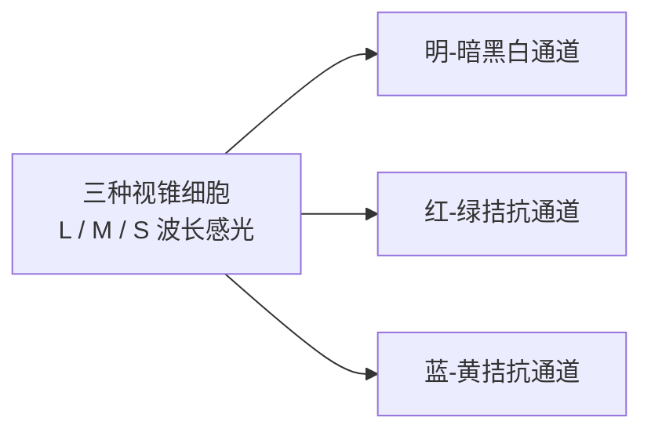

# 第 4 章 色彩

> 色彩是画面的情绪底色，也是视觉秩序的试金石。未经节制的芜杂色彩往往会沦为视觉噪音，在观者触及画面内核之前，便悄然耗尽了他们的注视。

---

## 色彩成为摄影语言

1976 年 5 月，纽约现代艺术博物馆（MoMA）举办了一场在当年激起轩然大波的展览：《威廉·埃格尔斯顿指南》（*William Eggleston's Guide*）。展厅四周陈列着 75 幅记录美国南方日常景致的彩色影像：停在车道上的儿童三轮脚踏车、普通农舍的门廊与餐桌、自墙角杂乱延伸的架空电线。这些物象寻常得令人极易视而不见，却被赋予前所未有的庄重感装裱成框，堂而皇之地步入现代艺术殿堂。

要理解这场展览在当年的颠覆性，需要回到当时的艺术语境中去体察。在 1976 年的严肃摄影界，彩色摄影几乎毫无立足之地。主流名家几乎一致固守黑白银盐体系，而彩色影像被普遍视作实用与商业的附属品：百货橱窗的推销海报、家庭相册里的度假快照、旅游景点的明信片，或是通俗杂志的印刷插图。彩色被认定是兜售消费欲望的工具，难登纯艺术的大雅之堂。正因如此，时任《纽约时报》首席艺术评论家 Hilton Kramer 留下了著名的尖刻评述：针对策展人称赞其照片“完美”，他写道：“完美？或许是完美的平庸，确凿是完美的乏味。”

历经数十年的岁月沉淀，这 75 幅影像最终彻底重塑了彩色摄影的历史地位。Eggleston 最具颠覆性的贡献，在于他完全摒弃了传统沙龙摄影那种悦目甜俗的“漂亮色彩”，而是将镜头对准了战后美国日常生活中最真实的色彩质感：涂抹着刺目血红的天花板与低垂的裸露灯泡、廉价工业涂料粉刷的外墙、深夜公路旁长明不灭的荧光霓虹招牌、加油站雨后泛着油光的塑料机壳、福特皮卡坚硬浓重的红，以及快餐店千篇一律的柠檬黄。这些颜色深植于现代工业、大众消费与在地生活的肌理之中，因过于熟悉而被人们视若无睹。Eggleston 却逼迫人们在这些日常颜料前驻足，正视它们所承载的物质现实。

这正是色彩在摄影语境中的深层力量：它不仅关乎构图形式的美感，更将特定时代的消费印记、地域风土的物质质感以及生活形态的变迁，封存在感光乳剂与像素矩阵之中。色彩从来不只是画面表层的妆容，更是时代的视觉物证。

---

## 先做减法

初学彩色摄影时，最容易让人着迷的往往是那种色彩斑斓的视觉刺激。然而画面的平庸与杂乱，也往往始于对色彩的贪多求全：当过多饱和的色块挤在同一取景框内互相争夺视线，色彩便从情感的向导退化为彼此倾轧的噪音。

经典影像的色彩编排往往高度节制，全幅画面维持两至三种主导色调便已足够。Saul Leiter 隐居于纽约东村，数十年来几乎只在第 10 街周边的几个街区漫步，或是隔着公寓窗台俯瞰湿润的街巷。他偏爱使用过期的 Kodachrome 彩色反转片，胶片在漫长的岁月里退去浮躁，沉淀出温润雅致的中性灰调。红、黄、棕等颜色在画幅中显影得极为克制：飞雪中一柄骤然撑开的红伞，水汽斑驳的玻璃后隐现的黄色出租车，深色大衣的行人悄然隐入橱窗深处的暗影。他的画面几乎从未出现过多色混杂的躁动，大面积的阴影、水汽、玻璃折射与柔和的灰调构成了静穆的基底，那仅存的一两抹纯色因而获得了沉实的分量。

Steve McCurry 1984 年在白沙瓦难民营记录的《阿富汗少女》，红头巾与碧绿眼眸之间构成了经典而凝练的色彩对峙。这幅肖像的震撼力固然深植于人物神情，然而若抽离了红绿互补之间紧绷的情感张力，画面的叙事能量便会折损大半。McCurry 在南亚与中东的经典作品皆遵循严密的色彩秩序：色彩浓烈饱满，但主次分明，始终确立核心主色统领全局，其余色调则退居辅助与铺垫。

Joel Sternfeld 在《美国前景》（*American Prospects*）中则走了一条截然不同的冷峻路径。他驾车耗时八年行遍美国腹地，画幅中充斥着灰绿、土黄与淡青等低反差中性色：一幅画面中搁浅的抹香鲸陈尸于俄勒冈荒芜海滩；另一幅画面中远方农舍在烈火中受控焚毁，近景的消防员却在路边摊位前闲适地挑选南瓜。色彩平淡克制得近乎冷漠，而正是这份冷峻，让荒诞的现实张力显露无遗。色彩的力量绝非单纯依赖饱和度的堆砌，克制往往能催生更为持久的凝视。

Stephen Shore 1973 年拍摄《不寻常之地》（*Uncommon Places*）时动用 8×10 大画幅相机，记录加油站、汽车旅馆、空旷停车场与清冷餐桌。画面充盈着米白、水泥灰、淡蓝与土黄等低调色彩，毫无刻意取悦之态，却将美国公路景观的空旷、规整与疏离精准定格。

相较于上述大师实践，数字社交网络中盛行的高饱和度滤镜则走向了反面：所有色彩被推向极限，初看抓人眼球，久看则极易引发视觉疲劳。高明的色彩驾驭在于化繁为简、精准设色，让色彩退回空间与形态的骨架之中，而非让浮夸的色调遮蔽了影像的本质。

---

### 彩色摄影从三通道开始

*Sergey Prokudin-Gorsky 早在 Eggleston 之前六十余年，便通过红、绿、蓝三色分离滤镜实施三次物理曝光，再将三帧分色底片光学合成为鲜艳的天然彩色。在这幅 1911 年的布哈拉埃米尔肖像中，高纯度的钴蓝锦袍成为唯一的视觉重心，背景墙垣、地毯与草地皆退隐为低明度的灰绿与土黄。主色确立而杂色隐退，画面即刻呈现深沉的庄重感。[图片来源与复用说明](image-credits.md#prokudin-gorsky-emir)*

1911 年，受沙皇尼古拉二世特批，俄罗斯化学家兼摄影先驱谢尔盖·普罗库金-戈尔斯基（Sergey Prokudin-Gorsky）乘坐一节配有专用暗房的火车车厢，深入广袤帝国的中亚腹地。在威廉·埃格尔斯顿让彩色摄影跨入现代美术馆大门的六十多年前，普罗库金-戈尔斯基便发明了一套精巧的三色分离拍摄系统：一台特制的狭长画幅相机，让一块长条玻璃感光板顺次向下移动，分别透过红、绿、蓝三色滤镜完成三次连续曝光。三道光波各取所需，在一块玻璃板上留下了三组黑白分色影像；放映时，再用三盏配备对应滤镜的幻灯机将光束精确叠合于银幕之上，沉睡的色彩便如幻境般复苏。

布哈拉末代埃米尔穆罕默德·阿利姆汗（Mohammed Alim Khan）端坐在铺设着几何图腾地毯的雕花木椅上。整幅画面最摄人心魄的，是他身上那一袭流光溢彩的钴蓝色丝绸锦袍。在彩色摄影尚属荒原的二十世纪初，这绝非一次漫不经心的随手抓拍，而是一场近乎严苛的设色布局：埃米尔面容威严、身形魁梧，纯正厚重的深蓝锦缎上绣着繁复的金线纹饰，随着衣袍的起伏散发着冷冽而尊贵的光泽；而作为衬托的背景——中亚泥砖院墙的浅褐、拱券投下的幽暗阴影、脚下斑驳地毯的低明度赭红，以及庭院角落若隐若现的灰绿草木，全都温顺地退隐为低饱和度的中性基调。

这一抹钴蓝之所以能穿越百年光阴依然直击人心，正在于四周没有分毫多余的艳色与之相争。即便在彩色感光技术尚处萌芽的探索期，真正深邃的影像也早已明晰了“主色当立、杂色退避”的克制之美。普罗库金-戈尔斯基用三块滤镜向后世昭示了一个朴素的真理：彩色摄影的精妙，从来不是把调色盘上的颜色倾泻一空，而是以严谨的节制，让唯一的主角在静穆的底色中赫然伫立。

---

### RGB 与 CMYK

普罗库金-戈尔斯基的探索清晰揭示了彩色成像的底层规律：拍摄时透过红、绿、蓝三原色滤镜分别曝光，获取三张单色分色底片；放映时以对应的彩色光束精确叠合投射，光束叠加便能唤醒全彩光谱与明澈的白光，这便是**加色法**（additive color mixing）。

现代数字显示终端完全承袭了加色法的物理机制：在显微视界下，屏幕的每个像素点都由红（R）、绿（G）、蓝（B）三种微型发光单元构成，依靠不同强度的色光混合唤起人眼的视觉感知；三色全开即为纯白，三色熄灭即为纯黑。数码相机传感器表面覆有一层拜尔阵列（Bayer pattern）红绿蓝微滤镜，单像素仅记录单色光强，后续依靠反马赛克算法还原全彩。整个数字拍摄与屏幕呈现，皆完全运行于加色法的 RGB 体系之内。

与之相对的，是实体物料印刷所遵循的**减色法**（subtractive color mixing）。油墨与颜料本身并不发光，而是通过吸收（减去）特定光谱波长、反射剩余光波来呈现色彩。白纸原本能全向反射白光，涂上青色油墨便吸收了红光而反射青蓝光；若叠加上品红与黄色油墨，则进一步吸收绿光与蓝光。减色法的三基色为青（C）、品红（M）、黄（Y），理论上三色全满即吸收所有光线呈现黑褐色；现代印刷工业在此基础上追加了专用黑色油墨以强化暗部浓度，构成了 **CMYK** 四色印刷体系。

理清这两种光学逻辑，便能解开许多常见的调色困惑：在传统水彩或油画调色经验中，红绿颜料混合只会得到浑浊暗沉的深褐（减色法）；而在数字屏幕上，红光与绿光交叠却能激发出明亮纯正的鲜黄（加色法）。摄影创作在前期拍摄与后期屏幕修饰时，始终处于广色域的加色法世界；而一旦迈入实体印制，便要受制于减色法油墨对光的吸收极限。屏幕上绚烂通透的高饱和亮色无法原样搬上纸面，根源正在于物理显色机制的本质鸿沟。

| 机制对比 | 加色法（Additive） | 减色法（Subtractive） |
|---|---|---|
| 原色构成 | 红、绿、蓝（RGB） | 青、品红、黄、黑（CMYK） |
| 物理机制 | 光束叠加激发视觉 | 介质吸收特定波长（光强相减） |
| 三基色全满 | 趋向纯白（光强最大） | 趋向深黑（光强归零） |
| 典型应用 | 相机传感器、显示屏、投影设备 | 艺术微喷、传统油墨印刷、绘画颜料 |

---

## 色相、饱和度与明度

要理清画面中的色彩秩序，需依托色彩学的三大基础属性（HSL 空间）：
- **色相**（Hue）：界定色彩在色环上的光谱定位，即红、橙、黄、绿、青、蓝、紫的本质归属；
- **饱和度**（Saturation / Chroma）：界定色彩的纯度与浓烈程度，由纯正鲜明渐变为中性灰；
- **明度**（Lightness / Value）：界定色彩在明暗轴线上的能量等级，同一种红色既可延展为浅粉高光，亦可沉降为深褐暗影。

我们常说的画面色彩生硬，往往需要辨清其具体症结：究竟是色相之间产生抵触、饱和度过度溢出，还是明度反差失去了平衡。唯有分清这三个独立变量，掌控色彩才有了抓手。

取景构图时，不妨先在心中厘清场景内的色彩关系：

1. **单色调与微差影调**：全幅画面由单一色相统领，依托明度深浅与饱和度梯度构建层次。晨雾中万物皆浸润于灰蓝之间；暮色蓝调时分天际与建筑泛着冷青；大漠旷野中土黄与米白层叠交织。此类画面纯粹静谧，最怕偶发的突兀杂色打破整幅画面的沉静。
2. **互补色张力对抗**：色轮上相对 180 度的对立色彩（红与绿、蓝与橙、黄与紫）能激发出最强烈的视觉张力。驾驭互补色需严守**主次从属法则**：一种色彩占据大面积的主导地位，另一种色彩作为精巧的“跳色”点醒空间；若两色均分画面，往往会导致视觉重心剧烈撕裂。
3. **邻近色温和渐变**：色轮上相邻 60 度以内的色相温和过渡（红-橙-黄如秋叶与晚霞，蓝-青-绿如林莽与湖海，紫-红-粉如霓虹与落日）。此类搭配不追求强烈对抗，而是依托和谐的光谱韵律营造沉浸式的空间氛围。

若置身现场却辨不清色彩的主线，往往意味着眼前的色彩秩序尚未理顺；失序的色彩堆叠必然会导致画面呈现浑浊感。

---

### 对立色与视觉适应

互补色之间强烈的视觉张力，有着深厚的神经生理学根源。

光线穿透晶状体投射至视网膜，首先由视锥细胞（L、M、S 分别对应长波红、中波绿、短波蓝）捕获光强。然而，这三路神经信号并非直接送达大脑视觉皮层，而是在视网膜神经节细胞阶段被重新编码为三组互相拮抗的对抗通道：**红-绿对抗通道**、**蓝-黄对抗通道**以及**明-暗黑白通道**，这便是赫林创立的**对立过程理论**（opponent process theory）。

每条拮抗神经通道在同一瞬间只能向单一极向兴奋，非红即绿、非蓝即黄。人类的生理结构决定了我们无法感知“带红的纯绿”或“泛黄的纯蓝”。红与绿恰好锚定在红-绿通道的对立两端，蓝与橙则激烈拨动着蓝-黄通道。互补色的视觉冲击力，直接源于对视觉神经通道极限拉伸的生理反应。

凝视高饱和红块半分钟后将视线迅速移至白纸，视野中会浮现出淡淡的青绿残影，这便是视网膜神经通道疲劳后产生的**视觉负后像**。理解了这一神经生理机制，便能明白当我们把红与绿、蓝与橙并置于画面时，究竟在以何种方式拨动观者的知觉神经。

---

## 颜色也来自光

画面中的色彩，从来不是物体孤立固有的永恒属性。

一面石灰白墙在正午烈日下呈现纯白，在夕阳熔金时分被染作浓郁暖橙，到了蓝调暮色降临时则沉淀为幽蓝冷灰。物象固然有其对光谱反射的**固有色**，但最终映射在传感器上的，永远是固有色经由环境光源洗练后的**环境色**。掌控色彩的本质，始终是对光源光谱能量的洞悉与借用。

晨昏的低色温暖光天然能融合红黄暖色，却会让冷色调显得格外突兀；阴天的冷调漫射光则会普遍压低全场色彩的纯度。光的色彩构成了画面的基底，万物的色彩皆依附于这层流动的光幕之上。

---

## 白平衡是在选择解释

既然环境光源时刻重塑着物体色彩，为何置身于烛光暖影下的白纸，在我们眼中依然被确认为“白色”？

此现象源于人类大脑视觉系统的**颜色恒常性**（color constancy）：大脑能自主计算并剥离环境光源的偏色干扰，将物象色彩校准回其“本应具备”的中性认知。其底层机制可用**冯·克里斯色适应模型**（von Kries chromatic adaptation model）近似表征：视网膜三路视锥细胞依据当前光源的光谱分布动态调节各自的电信号感知增益：

\[ L' = k_L\,L,\quad M' = k_M\,M,\quad S' = k_S\,S \]

其中调节系数 \(k_L, k_M, k_S\) 分别正比于当前光源白点响应的倒数，通过各通道独立缩放将整体白点归一化。

数码传感器不具备生物中枢的自主恒常机制，它仅忠实记录入射光子的客观波长。为重现人类视觉认知，机身必须引入**白平衡**（white balance）算法：向系统界定当前光源下的中性参考点，据此重构 RGB 通道的信号增益。白平衡本质上是以数字算法模拟人类大脑的色适应调节。

量化并校准光源偏色，主要依托两条相互垂直的调节轴向：
1. **色温**（Color Temperature）：单位为开尔文（K），衡量暖橙至冷蓝轴线上的黑体辐射轨迹。色温数值与日常心理体感相反：数值越低光谱越偏红黄（暖），数值越高光谱越偏蓝紫（冷）。烛光约为 1800–2000K，正午日光约为 5500K，均质阴天约为 6500K，天穹散射阴影可高达 8000–10000K。
2. **色调**（Tint）：衡量绿至品红轴线上的正交偏移。荧光灯、低显色 LED 等非连续光谱光源常带有离散的绿色能量峰值，仅凭色温滑块无法完全抵消，必须协同调节色调滑块向品红补偿方能达成中性平衡。

| 光源类型 | 基准色温区间（约） | 常见色彩倾向与校准基准 |
|---|---|---|
| 烛光与炭火 | 1800–2000 K | 极暖橙红，低黑体辐射 |
| 传统钨丝白炽灯 | 2700–3200 K | 温暖泛黄，光谱连续 |
| 贴近地平线之日出日落 | 2000–3000 K | 极暖金红，大气长波散射 |
| 正午阳光与标准闪光灯 | 5500–5600 K | 均衡日光，中性参考白点 |
| 均质阴天薄云天光 | 6500–7500 K | 偏冷青白，漫射增强 |
| 晴天背阴与开阔蓝天光 | 8000–10000 K | 极冷深蓝，短波瑞利散射 |
| 荧光灯与低品质 LED | 视具体光谱而定 | 明显偏绿，需协同品红补偿 |

稳妥的创作准则要求优先选用 RAW 格式记录，以将白平衡参数保留为无损元数据；若需建立绝对客观的中性基准，应将标准灰卡置于主体光照环境中采样式校准。

需要明了的是：白平衡绝非单纯的“纠错工具”，更是奠定画面审美基调的主动抉择。机械地将暮色夕阳强行矫正为 5500K 纯白，只会彻底剥离黄昏本应具备的温润韵致。真正重要的追问应当是：我们决意让这束光在画幅中沉淀下怎样的情感氛围。

---

## 主色与跳色

在构图实践中，最清晰有力的设色法则当属**主色铺垫与跳色点睛**。

广袤的绿野中孤立着一袭红衣，冷峻的水泥灰墙前静置一抹金黄，暮色蓝调笼罩的街巷中一盏暖橙街灯初绽光华。那微小而明艳的色块能瞬间锁住观者的视线焦点，赋予平缓的空间以明确的视觉中枢与呼吸节律。

街头纪实摄影常依凭此法构建秩序：在复杂中性的市井背景中，一柄骤然出现的明艳雨伞便能化繁为简地确立焦点。形式感已由色彩抢先完成了引导。

若画面中红、黄、蓝、绿诸色争奇斗艳且面积均等，色彩便失去了统御力。视觉元素的全面民主往往意味着表达重点的彻底消解。

---

### 饱和度与自然感

在后期调色流程中，最常见的失误往往是机械地整体推升全局饱和度。画面初看似乎绚丽夺目，实则极易迅速劣质化，皮肤、植物与天空等关键记忆色最先产生失真。

色彩失真具备明确的数字机理：过度推升单一颜色的饱和度，实质上是将该色彩推向目标色彩空间的色域边界。然而红、绿、蓝三个通道并非同步见顶，往往某一单色通道率先触发数值截断（clipping），而其余通道尚有余量。通道截断将彻底抹平色彩内部原有的明暗灰阶过渡，使其退化为僵死色块；更为严重的是，通道截断的异步性会诱发色相的隐蔽漂移：过饱和的红色向橙黄滑移，蔚蓝晴空向青紫裂变，肤色中的红色一旦冲顶，面庞即刻呈现泛橘、蜡黄的假面质感。所谓画面显得脏杂，其根源正是通道截断与色相漂移的双重叠加。

反之，适度收敛全局饱和度能够迅速平抑视觉躁动；然而若缺乏结构支撑而盲目降饱和，画面便会显得萎靡乏力。低饱和度美学的成立，必然依赖画面中其他要素的坚实托举：
- 阴雨大雾天候中，依靠细腻的明暗影调与空气透视支撑纵深；
- 历史遗迹与老旧街区中，材质表面的风化褪色本身即是叙事内核；
- 如前述 Sternfeld 与 Shore 的大画幅创作，在低饱和色彩掩映之下，严密的几何构图、深远的空间透视与物象关系构筑了坚不可摧的骨架。

如果前期的构图松散、光影平淡，强行压低饱和度只会让画面愈发空洞。此外还有一项常被忽略的技术规律：当色彩的饱和度收敛后，色彩之间的边缘反差随之减弱，此时往往需要适当拉开明度反差（例如压实暗部、提亮受光面），画面方能重获内在的筋骨与精神。

更为严谨的调控策略，是避免粗暴拉动全局总饱和度滑块，转而使用分通道 **HSL 工具**（色相、饱和度、明度独立调节），精准提亮核心主色，适度沉降背景杂色。

许多后期软件中配备了**自然饱和度**（Vibrance）功能，优先提振画面中欠饱和的暗淡色彩，对已接近饱和的区域施加保护性阻尼，并对肤色区间施加保护。尽管其实际算法因软件而异，依然可作为相对温和的调校起点，但绝不可替代对直方图与肤色通道的理性监控。

人类视觉记忆对色彩的留存往往带有主观强化的倾向：记忆中的秋叶似乎比实测光谱更为浓郁，然而在审美直觉中，人眼其实完全能体味温润含蓄的真实质感。后期调色时应当警惕这种心理错觉，切莫将记忆里的浓烈，机械地兑现为屏幕上刺目溢出的荧光色。

稳健的调色之道在于：克制全局饱和度，将最纯正的色彩让渡给视觉主体。背景沉静而主体自显，视觉层次方能井然有序。

---

## 记忆色不是测量值

前文指出人类对特定物象的色彩留存带有心理修正，此概念在色彩心理学中被称为**记忆色**（memory colors）。

人类在漫长的演化与生活经验中，对特定核心物象建立了极为稳固的心理色彩范式：健康肤色当呈现温润暖调，澄澈晴空当呈现通透蔚蓝，繁茂草木当呈现生机郁葱。这些内在预期极其敏锐而牢固：面部肤色稍有偏绿，便会让人联想到病态或虚弱；植被色彩稍有失真，便会显露出塑料假草般的生硬感。正因人类的潜意识对此极为苛求，这些关键色相在后期调色中的容错空间格外狭窄。

大量视觉实验表明，受众所偏好的天空、草木与肤色，通常较客观实测值略为饱和，或在色相上轻微偏向典型印象。然而这并不构成通用的机械调色模板：偏好区间随环境光照、文化语境与具体图像风格而动态浮动。这一原理的核心启示在于：摄影观看并非纯粹的物理测色，观者始终携带着经验预期去解码影像。让色彩精准契合画面的叙事语境，远比追逐虚妄的绝对标准更为可靠。

---

## 色域、位深与输出

深入数字底层，色彩在虚拟空间中由具备物理边界与采样精度的数学容器所承载。

首先界定边界，即**色域**（color gamut）。CIE 1931 xy 色度图呈现为经典的马蹄形曲线，描绘了人眼可见的全部色度范围（不包含绝对明度）。由红、绿、蓝三基色坐标定义的 RGB 色彩空间在色度图上呈现为三角形；三角形所覆盖的面积越广，代表该空间能记录的高饱和色彩越丰富。ProPhoto RGB 的部分虚拟基色甚至延伸至可见光谱之外，是为了构建足够广阔的数学容器以容纳极端饱和的色彩；这也决定了它必须在 16-bit 高位深环境下协同运作，以防离散数值在过于宽广的空间中被过度拉稀断层。

| 色彩空间 | 相对色域跨度 | 核心适用领域 |
|---|---|---|
| sRGB | 覆盖范围最小，设备兼容性最广 | 互联网分发、社交平台、通用显示设备 |
| Adobe RGB | 显著宽于 sRGB，绿-青色相覆盖充裕 | 高端印前出版、商业微喷印刷 |
| Display P3 / DCI-P3 | 宽于 sRGB，红与绿轴向延伸广阔 | 数字电影母带、现代高阶移动终端与专业广色域屏 |
| ProPhoto RGB | 范围极其广阔，涵盖部分假想原色 | RAW 高阶后期编辑管道，需 16-bit 支撑 |

面向广泛的互联网交付时，最稳妥的基准仍是转换为标准 sRGB 并完整嵌入 ICC 配置文件。现代浏览器与操作系统大多具备色彩管理能力，能够准确解析嵌入的 Display P3 或 Adobe RGB 文件；最严重的偏色事故往往源于图像处在宽色域空间却丢失了色彩标签，被系统强制以 sRGB 渲染而导致色彩严重发灰。稳妥的工作流应当遵循：在宽色域管道中无损编辑，在最终输出阶段依据交付介质精准转换。

色彩容器的另一重关键属性是采样精度，即**位深**（bit depth）。通用的 8-bit 图像每通道拥有 256 级量化色阶；在具备合理影调过渡与抖动算法时，8-bit 成品足以呈现流畅的视觉过渡。然而在对低反差天空等平缓渐变区域实施大幅度影调拉伸时，相邻色阶间的微小断层会被剧烈放大，极易催生可见的阶梯状**色带**（color banding）。

稳健的工作流应当在**高位深环境**中完成核心影调与色彩重构。相机 RAW 格式记录 12 或 14 bit 原始数据，后期引擎提供 16-bit 乃至 32-bit 浮点运算管道，大幅规避多轮曲线调校累积的舍入误差，直至最终输出阶段再裁切映射为 8-bit 成品。

全流程中至关重要的硬件基石是**显示器校准**：一块出厂严重偏色且背光过亮的屏幕，会系统性误导创作者反向施加错误的色彩补偿。专业工作流要求定期使用校色仪生成标准 ICC 特性文件，并在输出前实施针对特定纸张油墨的软打样（Soft Proofing）。确立了可靠的显色基准，调色与校正方能落到实处。

---

## 按快门前控制颜色

高阶色彩管理的核心，在于将色彩决策前置至拍摄现场：

1. **背景色彩与分离度**：同一位身着素白衣衫的人物，若倚靠在白墙前极易与背景消融；置于斑驳的水泥灰墙前则显得沉静而纯粹；若立于古朴的朱红宫墙前，身形轮廓立刻跃然而出；若置身于葱郁幽深的林木之间，则展现出清冷的生机与层次。按动快门之前多看一眼背景色彩是否衬托主体，往往比后期费心费力的局部处理更为干净利落。
2. **服饰道具设色**：人像创作中衣着色彩具备极高权重。追求凝练沉静可选用黑、白、灰、米等中性单色；追求视觉张力可选用红、黄、橙等纯度跳色；最容易劣化画面的，是繁杂琐碎的大面积商标图案与高频碎花纹理，它们会剧烈分散观者对人物面部神态的凝视。
3. **混合光源与色片校准**：机顶闪光灯基准色温约为 5500K，而室内传统的钨丝灯约为 3000K。若在温暖的钨丝灯环境中直接使用裸灯闪光，主体面部往往显得惨白冷冽，而背景却昏黄油腻，形成生硬割裂的混光。优雅的化解方式，是在闪光灯头加装 **CTO 橙色色温转换滤片**（依据环境强度选择 1/4、1/2 或全阶 CTO），将闪光灯色温压低至 3000K 与环境光同频，机身白平衡统一设定为钨丝灯档位，使全场受光面与阴影面同步回归中性纯净。

---

### 光谱、显色性与同色异谱

审视混色光线的深层机理，必然涉及**同色异谱**（metamerism）现象。

两种物理反射光谱迥异的色样，在特定光源照明下激发了完全相同的三刺激值，使人眼感知为毫无二致的同一色彩，此即同色异谱。人类视觉系统仅凭三种视锥细胞将连续光谱压缩为三个离散信号，不同的光谱组合完全可能计算出相同的感知响应。然而该平衡极其脆弱：一旦切换光源的光谱成分，两种色样反射的光谱能量重新分布，原本一致的色彩即刻显现出显著偏差。

商场试衣镜下色调和谐的西服面料，行至户外日光下显现出色差，正是织物染料同色异谱现象的显现；印刷打样在特定标准光源箱下与屏幕吻合，置于普通荧光灯下产生偏色亦同属此理。

在考量人造光源品质时，需依托严密的物理显色指标：
- **CRI / Ra**（显色指数）：衡量光源对标准色块的还原能力（满分 100），其中 **R9 指数**专门表征饱和红色的还原精度，对通透肤色的塑造至关重要；
- **TLCI**（电视照明一致性指数）与 **SSI**（光谱相似度指数）：专为数码传感器设计的显色评价体系。

评估灯具品质不可仅凭单一标称参数，更应审视其光谱能量分布的连续性。若人造光源在特定波长区间存在缺失，传感器在曝光瞬间便根本未曾记录下该处的光谱信息，后期的算法再强大，也无法凭空还原出不存在的真实色彩。

---

## 常见场景的色彩策略

针对典型场景，可确立严谨的设色基准：

- **高原与晴空原野**：蓝天天光饱和度极高。可采取两种空间构图：要么令蔚蓝天穹占据主导幅面，主体化为纯色锚点；要么将地平线推高，仅留一线冷蓝作为空间呼应。利用偏振镜在侧光方位可进一步沉降蓝天明度，反衬云层体量。
- **晨昏熔金时分**：斜阳低照天然赋予万物金红底色。后期调色需保持克制，不必过度叠加暖调滤镜导致红黄层次粘连模糊；恰恰是保留下背阴处微弱的幽蓝冷调，方能衬托出夕照的醇厚与天地的辽阔。
- **均质阴天与雨后漫射**：阴天漫射光大幅削弱直射反差，然而雨水浸润的岩石、沥青与植被表面往往呈现极其纯正的高饱和度。若色彩关系分明，应顺应展现材质固有色；若环境色调杂乱，可转向提炼明暗影调。需要记住：鲜红的苹果与深绿的树叶在色相上虽然截然对立，明度却可能完全接近；若转换为黑白，两者极易融为一团难分彼此的灰影。色彩的反差，绝不等于影调的反差。
- **暮色夜景与霓虹都市**：人工混色极端繁复。务必确立一至两种主导色相（如品红、钴蓝或青绿），压暗次要杂色，在画面中留存充沛的深黑作为视觉呼吸区。蓝调时分拍摄夜景，天幕残留的深蓝能自然统御纷乱的霓虹灯火。
- **冰雪原野**：构筑纯白与幽蓝的交响。大面积积雪承载明朗白调，背阴积雪折射天穹幽蓝，辅以一抹暖色主体（红衣、木屋、暖灯）点醒全局。保留阴影中的冷蓝层次，是彰显冰雪寒冽质感的关键。
- **雾霭林莽**：低饱和与低反差构筑了天然的留白韵致。在均质灰白雾气包裹之下，任何微弱色彩（落叶、苔藓、雨伞）皆会被赋予极高的视觉纯度。

!!! example "案例推演：黄昏巷口的红灯笼"

    薄暮时分巷口高悬红灯笼，天际残留一抹幽蓝，铺内透出暖黄钨丝灯光。若依赖自动白平衡，系统倾向于将暖黄中和，导致灯笼晦暗、天际泛灰。

    - **步骤一：确立叙事主线**：若意图展现红灯笼与暮色蓝天的冷暖对峙，将白平衡锁定于日光标准（5500K），使暖橙更显醇厚、幽蓝更为深邃；若意图聚焦于灯下人物，则以面部肤色为中性基准，允许环境色调退居辅助。
    - **步骤二：严控饱和边界**：灯笼朱红已逼近色域边界，后期应微调明度而非盲目推升饱和；一旦红通道削波截断，灯笼的丝织纹理将沦为平整死色。
    - **步骤三：净化背景杂色**：若画幅边缘穿插着突兀的高饱和杂物（如塑料垃圾桶），现场移动半步机位予以剔除，远胜后期繁复的修饰。

---

## 建立个人色彩档案

长期的影像实践要求创作者逐步提炼具备辨识度的个人色彩体系：

1. **归纳视觉偏好**：精选数十幅个人代表作并置审视：核心主色为何、饱和度取向偏浓烈还是淡雅、全局影调倾向暖金还是冷灰、空间构成偏向对比还是单色。这构成了确立个人风格的线索。
2. **深耕胶片模拟与色彩配置文件**：
   - 使用 Fujifilm 体系可锁定特定胶片模拟深入探索：Classic Chrome（低饱和、微硬对比，契合纪实人文）、Velvia（极高饱和、浓郁厚重，契合风光大地）、Astia（柔和细腻、肤色通透，契合肖像时装）、Classic Negative（独特的高光泛黄与暗部硬反差，契合复古街头）、Eterna（宽容度极高之电影中性影调，适于精细后处理）。
   - 在 Lightroom 或 Capture One 中确立专属的输入基准：选定契合个人审美的相机色彩配置文件（Camera Profile），将微反差、去雾与基础锐化参数封装为全局导入预设。使每张 RAW 文件皆立足于高度一致的审美原点展开针对性微调，影像序列的一致性与辨识度由此确立。

---

## 常见错误

1. **盲目拉满全局饱和度**：诱发通道截断、色相漂移与暗部浑浊，使肤色呈现不自然的蜡黄。解法在于回归理性基准，依托分通道 HSL 进行局部提炼。
2. **互补色彩均分幅面**：红绿或蓝橙等面积对抗，导致视觉重心剧烈撕裂。解法在于严守主从法则，以一种色彩统御全局，另一种色彩充当点睛跳色。
3. **背景杂色喧宾夺主**：主体受制于背景中高饱和无关色块的干扰。解法在于微调机位剔除杂色、利用浅景深予以柔化，或重构构图秩序。

---

## 练习

1. 连续一周每日专注捕捉一幅以单一主色统御的画面，归来提炼并记录该主色在不同光照下的明度变化。
2. 实地开展“大面积中性背景协同单一点睛跳色”的专项构图训练，记录二十张并精选五张，评估跳色对视觉视线的引导效率。
3. 开展半小时不持相机的纯视觉色彩观察：审视眼前物象的主色构成、冷暖互补关系与环境光重塑效应，训练敏锐的现场色彩知觉。
4. 选定单一色彩配置文件或胶片模拟连续作业三周，深度体悟其对红、绿、蓝及复杂肤色的解算特性，建立稳定的个人色彩基准。

---

下一章：[第 5 章 镜头语言](05-lens.md)
