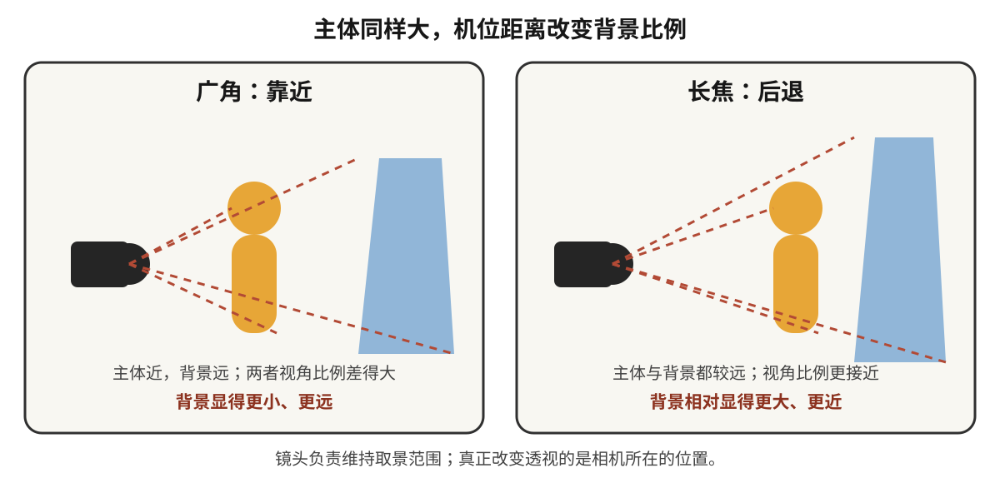

# 第 5 章 镜头语言

> 焦段决定的绝非仅是画面的取景范围。它直接确立创作者立足的空间坐标，重塑与被摄物之间的物理与心理距离，并最终裁决观者在画面中的凝视位置。

---

## 焦段是一种观看距离

1932 年，年仅二十四岁的 Henri Cartier-Bresson 在马赛购入了一台搭载 50mm 标准镜头的 Leica 相机。在其后横跨半个多世纪的职业生涯中，尽管他也曾涉足其他焦段与制式，但那些铭刻于摄影史的巅峰之作，绝大多数皆由这套经典的“Leica + 50mm”组合铸就。青年时代选定的光学视角，往往会化为创作者终其一生审视世界的内在基准。

他曾将徕卡相机比喻为“肉眼的延伸”，而镶嵌其上的核心画笔始终是那支 50mm 镜头。他生平排斥变焦镜头的机械伸缩，坚守摄影师当以双足丈量空间、以位移重构透视。这一带有鲜明古典印记的执念，置于现代摄影语境下无需机械照搬：变焦光学设计与混合对焦技术的成熟，使变焦镜头在复杂工作流中展现出无与伦比的效率。然而抽离器材形态的演进，其核心要义依然历久弥新：成熟的创作者终将生长出独特的观看距离；长期契合于手中的焦段，绝非偶然的技术选择，而是其心智与外部世界互动时最习惯驻足的认知原点。

Robert Capa 同样对 50mm 情有独钟。1944 年 6 月 6 日拂晓，他随美军步兵突击队涉水冲上诺曼底奥马哈海滩，怀中紧护着两台配有 50mm 镜头的 Contax II 旁轴相机。据流传数十年的传统叙述，他在滩头枪林弹雨中记录下一百余张珍贵底片，胶卷送抵伦敦《生活》（*Life*）杂志暗房后，因年轻暗房助理在烘干箱前过度加温导致乳剂融毁，最终仅存 11 张影像，即名载史册的《辉煌十一张》（*The Magnificent Eleven*）。需要补充的是，近年历史学者对该暗房事故版本提出了严密考证，指出银盐乳剂特性难以被单纯烘烤熔化，Capa 当日在严酷战场上极可能本身仅完成了这十余次按压。无论历史真相如何，正是这组焦点晃动、颗粒粗粝、海水浸润般的残卷，奠定了二十世纪战地纪实的经典视觉经验：极端真实的现场绝非平整明晰的构图，慌乱与微震本身即是历史风暴最诚实的呼吸。

William Klein 则将 28mm 广角推向了极致。他将 28mm 视角形容为“逼近至几乎能嗅到对方面部气息的距离”。在 1956 年出版的先锋摄影集《纽约的生活对你很好：在狂欢中狂欢》（*Life is Good & Good for You in New York*）中，曼哈顿街头的摩登女性、地铁车厢中怒目争执的男子、持枪嬉戏的街童以及迎面扑来的巨幅霓虹招牌，皆以迫近的距离挤压入画。28mm 在 Klein 手中绝非为了收纳更多的环境元素，而是一种决绝的进攻姿态：它强行将观者与镜头一同推入纽约街头粗暴而生机勃勃的核心旋涡。

森山大道同样常年倚重 28mm 视角。他常手持轻便随身相机隐匿于东京街巷，步履穿行之间无需举至眼平取景便果断释放快门。新宿的雨夜、幽暗的地下通道、歌舞伎町的杂乱招牌以及流浪野犬的粗粝毛发，在其胶片上显影为晃动、高反差与粗颗粒的视觉丛林。这种失衡与粗粝绝非操作失准，而是高度自觉的美学实践：肉身率先撞击街头现实，快门带着喘息随之留痕。

Saul Leiter 则走向了完全相反的光学维度。他偏好使用长焦镜头，自曼哈顿第 10 街公寓二楼窗口俯身遥望。长焦光学系统在拉近远方景致的同时，剧烈压缩了前后的纵深跨度：一袭红风衣的漫步女子与身后疾驰的黄色出租车在画幅中被压叠至同一平面，宛若拼贴艺术般重构了都市画卷。Leiter 依凭这套独特的凝视距离深耕数个街区，直至暮年依然未曾停歇。

上述大师的迥异实践最终指向了同一命题：每位优秀的创作者皆拥有一套不可替代的观看距离。这既是物理空间的站位抉择，亦是心灵审视世界的距离度量。长年累月的凝练，最终凝固为鲜明有力的镜头语言。

---

### 一张肖像里的机位

*Mathew Brady, Abraham Lincoln, 1860 年 2 月 27 日，纽约 Cooper Union。Lincoln 那天去发表演讲，演讲前到 Brady 工作室拍了这张肖像。湿版摄影需要被拍者在镜头前保持稳定，Brady 也很擅长用姿态、光线和视角让人显得庄重可信。Lincoln 当时虽已因两年前与 Douglas 的辩论小有声望，却还远不是总统提名的热门人选，只是一个来自伊利诺伊州、不被东部政界看好的律师。这张照片和那场演讲一起流传，让他看起来稳重、可信，也更像一个可能成为总统的人。据传 Lincoln 后来说过，是 Brady 和 Cooper Union 的演讲让他当上了总统；这句话虽无严密第一手文献支撑，多半经 Brady 一方流传，但它至少说明当事人都明白这张照片的分量。镜头在这里不只是工具，也参与了政治形象的形成。[图片来源与复用说明](image-credits.md#brady-lincoln)*

---

## 视角与空间

初涉镜头光学时，常有人将焦段的效用简化为两句通俗表述：长焦拉近远景，广角容纳全局。这两句话描述了表象，却遮蔽了更为深层的物理本质：**焦段的选择深刻重塑了画面内部的空间透视秩序。**

广角镜头的特性，在于近距离拍摄时显著夸大前景形体、同时将背景强烈推远，且物理站位越贴近主体，此种空间拉伸越发剧烈。以 24mm 镜头近距离拍摄人物，其手势、鼻梁与近景器物被极度放大，背景则急剧退缩展开；35mm 至 50mm 被称为标准焦段，在于常规画幅与标准视距下，其呈现出平缓克制的透视体验；而使用 85mm 至 200mm 以上的长焦镜头时，为了在画幅中维持相同的主体大小，创作者必须大幅后撤拍摄距离，前后景物的相对距离比率随之收缩，背景因而呈现出强烈的“空间压缩感”。

若要维持主体在画幅中的比例恒定：
- 采用 24mm 拍摄，必须逼近主体跟前，背景被急剧拉开，人物仿佛被浩瀚环境所托举包裹；
- 采用 135mm 拍摄，必须退至数米开外，背景被显著放大并剧烈贴近主体背脊。

必须彻底澄明的核心定律在于：**真正重塑画面透视关系的，是拍摄机位与被摄体之间的物理距离；焦段仅是迫使你在不同距离上维持构图取景的画幅工具。**

*原创示意图：广角靠近与长焦后退的差别来自机位；镜头负责在不同位置维持相近的主体大小。[图片来源与复用说明](image-credits.md#perspective-distance)*

---

## 从 14mm 到 200mm

- **14mm 至 20mm（超广角）**：具备极宽广的视角张力，但伴随着剧烈的前景透视拉伸。适用于宏阔风光、狭小室内空间以及极具视觉冲击力的特定肖像。超广角的核心陷阱在于：极易将杂乱信息全数收揽而导致画面松散空洞。驾驭超广角需主动经营前景：一是放低机位极度贴近前景（将粗糙礁石、积雪纹理置于画幅下端数十厘米内），使其成为引领视线的空间台阶；二是依托地平线、道路、栈桥等斜向线条由画幅对角切入，构筑深远的视觉纵深。此外需注意透视几何特性：球形物象置于超广角边缘会被物理拉伸为椭圆，人物应尽量向中心区域收拢。
- **28mm（经典人文广角）**：兼具充沛的视域与自然的边缘控制，构成了 Ricoh GR 等街头机型的灵魂焦段。它极擅长在交代人物神态的同时完整刻画其所处的生存空间，赋予观者身临其境的现场卷入感。
- **35mm（环境人像与叙事基准）**：最为均衡的全能定焦。视角略宽于人眼专注视域，既能从容交代环境秩序，又确保主体具备坚实的视觉重心。在街头行走中，35mm 既不压迫被摄者的心理防线，亦不剥离空间的温度，是展现“人与环境互动”的黄金焦段。
- **50mm（标准克制之眼）**：视角平实克制，毫无夸张的透视畸变与虚化掩护。一幅 50mm 影像的成败，完全取决于构图骨架、光线雕琢与瞬间捕捉的深厚功力。它迫使创作者摒弃器材噱头，纯粹依靠内容与形式的自洽立足。
- **85mm 至 135mm（经典人像与特写）**：有效压缩背景杂乱元素，提供细腻圆润的虚化过渡与端正的面部比例。实战中需警惕陷入过度虚化的糖水套路，应在光线塑造、微表情捕捉与深层神韵上深耕。
- **200mm 以上（远摄长焦）**：专精于体育竞技、荒野生态、高原山脊与极端压缩感的提炼。长焦镜头对快门安全裕度、机身支撑刚性以及大气湍流具备极高的敏感度。

选拔镜头时还需重点考量两项关键参数：**最近对焦距离**与**最大放大倍率**。50mm 定焦镜头最近对焦极限通常为 0.4–0.45 米，85mm 人像镜头通常在 0.8 米开外；若意图贴近记录精致首饰或咖啡拉花，需借助放大倍率达 1:1 的专业微距镜头（Macro）。

将全画幅常见焦距与对角线视角的映射关系系统梳理如下：

| 物理焦距（全画幅基准） | 对角线绝对视角（约） | 核心美学语境与典型题材 |
|---|---|---|
| 14 mm | 114° | 极限大空间、建筑内景、穹顶星空 |
| 24 mm | 84° | 壮阔风光、建筑外景、强张力环境叙事 |
| 35 mm | 63° | 经典纪实、街头人文、环境人像 |
| 50 mm | 47° | 标准视角、平实沉静、克制写实 |
| 85 mm | 29° | 半身肖像、中景提炼、柔美分离 |
| 135 mm | 18° | 肖像特写、舞台演出、背景空间裁切 |
| 200 mm | 12° | 体育速写、野生生态、地平线压缩 |

视角的几何计算公式如下：

\[ \theta = 2\arctan\!\left(\frac{d}{2f}\right) \]

其中 \(d\) 为传感器对角线物理尺寸（全画幅约为 43.3mm），\(f\) 为物理焦距。由公式可知，视角随焦距的收缩呈现非线性特征：广角端每缩短 1mm，视角便产生剧烈扩张；而长焦端焦距翻倍，视角的收敛却相对平缓。

---

## 等效焦距与等效光圈

在非全画幅机身（APS-C、M4/3 等）上应用上述焦段法则时，需进行严密的光学等效折算。

传感器物理画幅缩小，其实质是截取了全画幅镜头成像圈中央的局部矩形区域，使成像视野收窄。折算基准即为**焦距裁切系数**（Crop Factor）：APS-C 画幅系数约为 1.5×（佳能 APS-C 为 1.6×），M4/3 画幅系数为 2.0×。

| 传感器画幅类型 | 裁切系数 | 50mm 物理镜头的等效视角 |
|---|---|---|
| 全画幅 (36×24 mm) | 1.0× | 50 mm 标准视角 |
| APS-C (约 23.5×15.6 mm) | 1.5× (佳能 1.6×) | 75 mm (佳能 80 mm) 中焦人像 |
| M4/3 (17.3×13 mm) | 2.0× | 100 mm 远摄视角 |
| 1 英寸机型 | 2.7× | 135 mm 远摄特写 |

必须明晰：裁切系数带来的是**视场角的几何截取**，而非物理焦距的真实拉长。小画幅系统在远摄体积与便携性上具备显著优势，但并不意味着凭空获取了全画幅高解析力的光学信息。

此外，画幅裁切系数同样深度改写了光圈在景深维度上的表现，即**等效光圈**（equivalent aperture）。

光圈的物理 f 值严格决定受光面单位面积上的照度：无论画幅大小，f/2.8 在相同快门与感光度下产生等同的曝光明度。然而在**景深景深范围**与**传感器捕获的总光子能量**两个维度上，必须同步乘以裁切系数：

| 画幅系统 | 实际装配镜头 | 等效全画幅视角 | 等效景深与总通光量 |
|---|---|---|---|
| 全画幅 | 50 mm f/2.8 | 50 mm | f/2.8 景深基准 |
| APS-C (1.5×) | 33 mm f/1.8 | 约 50 mm | 约 f/2.8 等效景深 |
| M4/3 (2.0×) | 25 mm f/1.4 | 50 mm | f/2.8 等效景深 |

M4/3 上的 25mm f/1.4 镜头，在提供大两档曝光照度的同时，其焦外虚化体量与全画幅 50mm f/2.8 严格对等。画幅光学并无免费的馈赠：小画幅在长焦便携上赢得的优势，在极限浅景深与暗部信噪比维度上需支付对等的物理代价。

---

## 焦段带来的心理距离

不同焦段在潜意识层面重构着观者的心理感知：
- **24mm / 28mm**：将观者直接抛入事件的核心现场，消除旁观者的抽离感，形成沉浸式的互动张力；
- **35mm**：宛若立于近旁的同行者，既保持亲密的平视，又完整包容周遭生活秩序；
- **50mm**：呈现克制、从容且不带主观压迫的沉静对视；
- **85mm / 135mm**：建立专注的凝视，隔绝嘈杂背景，赋予主体以仪式感；
- **200mm 以上**：拉开遥远的物理与心理鸿沟，赋予画面以冷静审视乃至隐蔽窥视的张力。

焦段的选择，本质上是创作者在为观者设定审视世界的心理坐标。

---

## 景深与超焦距

景深范围由三大物理变量协同决定：**光圈越大景深越浅，焦距越长景深越浅，拍摄距离越近景深越浅。**

盲目追逐大光圈极易陷入“浅景深陷阱”：在极度逼近的拍摄中，f/1.4 的极浅景深厚度往往仅有数毫米，眼睫清晰而鼻尖模糊，空间环境彻底消解于浑浊虚化之中，影像退化为单调的面孔切片。

深度审视景深，当衡量其叙事功能：
- **浅景深**：果断剥离无关背景干扰，强力聚焦于主体的神态与质感；
- **深景深**：将人物与特定的建筑、风土、历史痕迹牢牢锚定于同一物理空间；
- **中景深**：精准勾勒主体与周边关键道具之间的互动纽带。

在光学理论中，界定清晰度边界的核心物理量为**弥散圆**（circle of confusion, CoC）。焦平面之外的点光源在成像面上扩散为圆斑，当圆斑直径小于人眼在特定观察距离下的辨析极限时，即可视作清晰。全画幅工程基准通常取 \(c \approx 0.03\,\text{mm}\)。

在常规物距工况下，景深总厚度可近似表述为：

\[ \text{DoF} \approx \frac{2 N c\, s^{2}}{f^{2}} \]

其中 \(N\) 为光圈数，\(c\) 为弥散圆直径，\(s\) 为对焦物距，\(f\) 为物理焦距。距离 \(s\) 与焦距 \(f\) 皆以二次方形式参与运算，揭示了机位位移与焦段更迭对景深的塑造力度远超单纯的光圈微调。

在风光与建筑摄影中，若追求自近景前景至无限远天际线的全域清晰，则需动用**超焦距**（Hyperfocal Distance）原理。将焦点精确锁定于超焦距点 \(H\)，自 \(H/2\) 至无穷远的广阔空间皆将纳入景深容许范围：

\[ H \approx \frac{f^2}{N \cdot c} \]

以全画幅 24mm 镜头、设定光圈 f/11、弥散圆 \(c=0.03\,\text{mm}\) 计算，其超焦距约为 1.75 米。将对焦点置于 1.75 米处，自 0.88 米至无穷远山脉皆可获得清晰成像。

需要明晰其实战代价：超焦距设定下，无穷远天际线恰好处于“容许模糊”的临界下限；若画面的视觉核心明确位于极远山脊，则应将对焦点直接归位至无限远。

---

## 透视只认机位

必须再次强调：**透视关系的唯一决定因素是相机与物象之间的物理空间位置。**

使用 35mm 镜头逼近至一米，主体形体巍峨而背景退远；后退至五米，主体收敛而环境展平。初学者常因站位过远导致 35mm 构图涣乱，误判为焦段缺陷而盲目更换 85mm；其破局之道在于勇敢前行，使主体与空间建立紧密的几何关联。

长焦镜头所谓的“空间压缩”，实质上是创作者为了取景而主动后撤站位的结果。验证此原理极为简捷：在固定机位上以广角拍摄，随后裁切至与长焦相同的视域范围，其内部物象的前后比例透视与长焦成片完全一致。

电影工业据此奠定了经典的**滑动变焦**（Dolly Zoom，亦称眩晕镜头）：摄影机在轨道上推进或后撤的同时反向变焦，主体在幅面中纹丝不动，背景却产生惊心动魄的膨胀或收缩。其底层依赖的正是“透视仅由机位决定”的绝对物理法则。

---

## 技术展开：光圈两端与镜头测试

!!! note "阅读路径"

    镜头语言的主线是焦段、机位、画面范围和景深。下面的衍射、散景、像差、MTF 与呼吸效应用于解释镜头为何呈现不同结果；不准备比较镜头或处理极端画质问题时，可以先跳到“定焦还是变焦”。

### 光圈两端的代价

除了焦段，镜头本身也各有各的脾气。

首先，大多数镜头在最大光圈的时候，并不是最锐的。f/1.4 给了你漂亮的虚化，与此同时，也牺牲掉了一点锐度和对焦上的容错。这时只要往里收一到两档，画面通常就会稳当很多。所以，如果你并不需要那种极浅的景深，f/2.8 到 f/5.6，往往是一段很可靠的范围。

不过，光圈也不是收得越小就越好。往里收一两档固然能把画面收拾利落，可一旦收过了头，另一个物理限制就会浮上来，那就是衍射。光线穿过一个越来越小的孔径时会发生绕射，一个点光源落到传感器上，便不再是一个干净的点，而是摊开成一小团亮斑，这团亮斑有个专门的名字，叫艾里斑（Airy disk）。它的直径大致是：

\[ d \approx 2.44\,\lambda N \]

其中 \(\lambda\) 是光的波长，约为 0.00055 mm，\(N\) 是光圈 f 值。光圈收得越小，\(N\) 就越大，这团亮斑也随之变大：到了 f/16，艾里斑的直径已经接近 0.021 mm，开始盖过传感器本可分辨的细节，于是整幅画面的锐度会一并跟着下滑。

许多镜头收小一两档后，像差减轻，中心与边角会更均匀；继续收小，衍射又逐渐降低高频反差。最优光圈没有一张适用于所有镜头的表：镜头设计、焦距、对焦距离、传感器、输出尺寸和观看距离都会改变结果。f/16、f/22 并非“不能用”，只是常以一点整体细节换取景深或更慢的快门。

像素更密时，同一艾里斑会覆盖更多像素，因此在 100% 放大检查时更早看见衍射；但高像素机身不会因此在同样输出尺寸下自动比低像素机身更差。所谓“衍射受限光圈”也不是跨过去便突然失效的门槛，而是一条缓坡。实拍应比较最终输出：需要大景深就收小，需要极致细节则考虑焦点合成。

把光圈从头到尾的这段取舍摆到一起，权衡就更清楚了：

| 光圈区间 | 景深 | 锐度表现 | 适合的场合 |
|---|---|---|---|
| f/1.4 到 f/2 | 极浅 | 可能暴露边角像差，也可能正是镜头设计强项 | 弱光、浅景深 |
| f/2.8 到 f/8 | 浅到中等 | 常见镜头往往更均匀，具体峰值需实测 | 人像、日常、风光、通用 |
| f/8 到 f/11 | 中等到深 | 景深增加，衍射影响逐步出现 | 风光、建筑、大景深 |
| f/16 到 f/22 | 很深 | 通常以整体细节换景深或慢快门 | 单张景深优先的场景 |

这张表最该记住的一点，是两端都要付出代价：开到最大，景深和边角画质一起松掉；收到最小，景深是够了，细节却被衍射悄悄吃走。真正稳妥的那一段，几乎总是落在中间。

其次，广角镜头的边缘常常会有暗角，可这不一定就是坏事。暗角会自然而然地把观众的视线往画面中间推，也就可以被当成一种画面引导来用。后期当然能把它校正掉，但你同样可以选择把它保留下来。

再者，镜头可能出现桶形、枕形或更复杂的波浪形畸变，但不能只凭“广角、长焦、50mm”断定类型与强弱；现代镜头也常把一部分校正交给机内配置文件。拍建筑和室内时，应查看未校正 RAW 与最终工作流程，并在现场给校正后的裁切留出余量。

此外，在逆光、强反差的边缘上，常常会冒出紫边或者绿边，便宜的镜头尤其明显，好在这类问题后期一般都能去掉。至于虚化部分的那种质地，有一个专门的名字，叫散景（bokeh），不同的镜头在这上面会有圆滑、二线性、洋葱圈、旋转这些区别。散景当然会影响人像的观感，可话说回来，如果拍的不是商业人像，那么先把画面本身拍好，远比反复去研究散景更值得花时间。

---

### 散景怎样形成

前面顺口提到的散景，值得单独展开，因为它的形状并非什么玄妙难解的东西，而是由几件很具体的事决定的。散景说的是画面里那些脱焦的部分呈现出来的质地，尤其是背景中的点状光源被虚化之后，摊成一个个光斑的模样。

先看光斑的形状。一枚镜头的光圈，是由若干片叶片合拢成的一个孔。当你把光圈开到最大，孔接近正圆，脱焦的光斑也就接近圆形；可一旦收小光圈，叶片的边缘便探进光路，孔于是变成多边形，光斑也跟着现出棱角。叶片越少，棱角越硬，六片叶片收小之后会留下清清楚楚的六边形；叶片越多，又做成弧形，孔就越接近圆，收小之后光斑依旧圆润。所以厂商常把“九片圆形光圈叶片”写进参数表，图的正是这份收小之后仍旧浑圆的焦外。

叶片数还牵动着另一件事，就是点光源被拉出的星芒。画面里一旦有强烈的点光源，光在叶片的棱边上发生衍射，会沿着几个固定方向拖出光针。奇数片叶片会拖出叶片数两倍的光针，七片叶片给你十四道；偶数片叶片则正好两两重合，六片叶片就只留六道。所以想要夜景里那种规整的星芒，把光圈收小、让叶片的棱角显出来即可。

再看一个让很多人困惑的现象：为什么画面正中心的光斑是圆的，越往边角却越被挤成橄榄形，像一只只斜睨的猫眼。这叫口径蚀（optical vignetting），也有人直接叫它猫眼效应。道理在于，冲着画面边角去的那束斜射光，会先后被镜筒的前后两道口径各切掉一部分，剩下能通过的形状就不再是整圆，而是两道弧夹出来的橄榄。越靠边越明显，也正是这一圈方向逐渐偏转的橄榄，凑成了老镜头里那种旋转的“旋焦”。想减轻它，把光圈收小一两档，让通光重新回到圆孔的中央地带，猫眼便会慢慢收敛回圆。

---

### 像差不是一个词

散景的圆润与否，其实已经触到了一个更大的题目：像差（aberration）。理想的镜头，应该把每一个物点都干干净净地还原成像面上的一个点；可现实里的玻璃做不到这么完美，光线穿过镜片时总会跑偏，跑偏的方式五花八门，每一种都有自己的名字，也各自在照片上留下能被认出来的痕迹。前面零散提到的畸变、色差、暗角，还有刚说完的散景，其实都能收进这张大网里。

按传统的分法，像差先分成两支：一支是哪怕只用单一颜色的光也照样出现的单色像差，另一支是因为不同波长的光折射程度不同而来的色像差。单色像差里最经典的一组，是十九世纪由 Seidel 归纳出来的五种。

球差（spherical aberration）说的是，穿过镜片边缘的光线和穿过中心的光线，没有落在同一个焦点上。它留下的痕迹，是一层朦胧的柔光，主体明明对实了，却像蒙着一层薄雾，光圈越大越重，收一两档就明显好转。有意思的是，球差校正得过头或者不足，还会分别改变前景和背景散景的软硬，很多镜头焦外耐不耐看，根源就在这里。

彗差（coma）只在画面边缘露头。一个本该是点的星光，到了角落会被拖成一颗带尾巴的彗星，尾巴朝着画面外或者画面内。拍星空的人对它最敏感，因为满天的星点一到四角就长出翅膀，收小光圈能压下大半。

像散（astigmatism）指的是，一个点在水平和垂直两个方向上没法同时合焦，于是它时而被拉成一道横线，时而又拉成一道竖线。厂商 MTF 图上那两条分开的曲线，量的正是这两个方向上的差别，两条贴得越近，说明像散越小。

场曲（field curvature）说的是，镜头最清楚的那个面，其实是一张弯曲的碗，而不是一块平板。于是当你对着一面平整的墙、把中心对实，边角却因为落在碗沿之外而发虚。翻拍平面文件、拍建筑立面的时候，它最容易现形。

畸变（distortion）不碰清晰度，只动形状。广角常见桶形，直线朝外鼓；长焦常见枕形，直线朝里收；有些变焦还会走出中间鼓、两头收的胡子形。它是几何上的偏差，所以也最容易靠软件按镜头档案校正过来。

色像差则分成两路，认起来要分清楚。一路是纵向色差（longitudinal，又叫轴向 LoCA）：不同颜色沿着光轴落在前后不同的位置上，于是脱焦的高光边缘泛起紫红与青绿，焦前一色、焦后一色，连画面正中心也躲不掉；它收小光圈能减轻，软件却很难彻底根除。另一路是横向色差（lateral，又叫倍率色差）：不同颜色被放大的倍率略有差别，越往画面边角，红青色边越宽，正中心反倒干干净净；它收光圈没有用，好在规律工整，软件几乎一键就能校正。

至于暗角（vignetting），严格说并不算聚焦上的像差，而是画面边角的光量衰减。它一部分来自自然的余弦四次方衰减，一部分来自镜筒对斜射光的机械遮挡，通常收小光圈就能减轻。前面已经说过，它不一定是缺点，压暗四角反而能把观众的视线收拢到画面中央。

像差之外，镜头还有第二类画质上的敌人，专在逆光时现身：眩光和鬼影。光线每穿过一个玻璃与空气的界面，都会有一小部分被反射回去；一颗现代镜头动辄十几片镜片，几十个界面，强光源一旦进入画面或者贴着画面边缘，这些界面之间来回反射的杂光就会在画面上留下痕迹。摊成一片的，是眩光（flare），表现为整幅画面反差下降、发灰发雾，黑的不再黑；聚成形状的，是鬼影（ghosting），沿着强光源与画面中心的连线，排出一串光圈形状的彩色光斑。镀膜就是为此而生：在镜片表面蒸镀上厚度只有光波长几分之一的薄膜，利用干涉把界面反射压到百分之零点几，各家引以为傲的纳米镀膜、T* 、SSC，做的都是这件事。老镜头镀膜简陋，逆光一冲就泛白，有人反倒喜欢那种朦胧，拿它当一种味道，这无可厚非，但要分清那是选择而不是无奈。至于遮光罩，它不是装饰，也不只是磕碰时的保险杠：它的本职是挡住那些不参与成像、却会从斜侧打进前镜片的杂光，等于在镜头前立了一圈屋檐。顺光时它闲着，侧逆光时它就是反差的守门员：画面外一步之遥的太阳、身后一盏路灯，都可能正往你的前镜片上泼散杂光。养成把遮光罩装正的习惯，比事后在后期里拉回反差要划算得多；实在没带，伸出一只手在镜头上方替它遮一遮，老摄影师大多深谙此道。

---

### 怎样读 MTF

认全了这些像差，就有资格去读厂商衡量一枚镜头的那张图了，它叫 MTF（Modulation Transfer Function，调制传递函数）。老一辈评价镜头，爱说“能分辨多少线对”，可那句话只回答了“分得清多细”，答不了“反差还剩几成”。MTF 把这两件事合到了一处，问的是同一个问题：一组黑白相间的条纹，经过镜头之后，明暗之间的落差还能保住多少。

它给出的是一个介于 0 到 1 之间的数。1 表示黑白的反差被原原本本地传了过来，0 表示黑白已经糊成一片均匀的灰、彻底分不出彼此。条纹越细密，也就是空间频率越高，镜头越难守住反差，MTF 也就越低。厂商画 MTF 图，横轴通常是“离画面中心有多远”，从正中一路排到边角；纵轴就是这个 0 到 1 的数；每一条曲线对应一个空间频率，低频（例如每毫米十线对）大体反映反差和通透感，高频（例如每毫米三十线对）大体反映能解析出多细的细节。

读这张图，有几处可以一眼看出门道。曲线整体越高，镜头在该频率和测试条件下保留的反差越多；从中心到边角掉得越缓，说明画面均匀性越好。径向（sagittal）与切向（meridional）曲线分离，可能提示像散等离轴像差，但不能据此直接宣布“散景一定圆润”。焦外质地还受球差校正、口径蚀、光圈形状、纵向色差与拍摄距离影响，而且厂商图可能是设计值或实测值、测试频率与光圈也不一致。MTF 很适合看解析与反差趋势，却不是一张能把全部镜头性格都摊开的总成绩单。

---

### 呼吸效应与入瞳

最后两个概念，平日拍照未必天天记挂，可一旦碰上视频和接片，就绕不过去。

第一个是呼吸效应（focus breathing）。同一颗镜头，当你把对焦从远处拉到近处，它的实际焦距会随之发生细微的变化，于是视角也跟着轻轻缩放，画面像是“吸了一口气”。拍照的时候这点变化几乎无关紧要，可一旦拍视频、做一次拉焦，观众就会看见构图随着焦点游走而微微推拉，画面因此显得不安稳。专门的电影镜头会花大力气把呼吸效应压到最低，一些新的照相镜头也开始把“抑制呼吸”写进卖点，靠机身或镜头的运算把这份缩放补回去。

第二个是入瞳，也叫无视差点（entrance pupil / no-parallax point）。你从镜头正面往里看，会看到光圈孔成的一个像，那个像所在的位置就是入瞳。它的要紧之处在于接片：把好几张照片拼成一整幅全景时，如果相机绕着别的点旋转，近处和远处的景物就会因为视角改变而彼此错动，接缝处便对不齐，这种错动叫视差。而只要让相机严格绕着入瞳去转，近景和远景之间就不再相对滑动，几张照片才拼得严丝合缝。全景云台上那一截可以前后滑动的导轨，作用正是把转轴挪到入瞳上。还要补一句，这个点常被人叫作“节点”，其实并不准确，真正决定视差有无的是入瞳，而不是光学意义上的节点，两者只是位置常常靠得很近，才被混为一谈。

---

## 定焦还是变焦

这本书在镜头上最实用的一条建议，其实说起来很简单：买一颗定焦，35mm 或者 50mm，然后用它整整一年。

只用一颗定焦坚持一段时间之后，这个视角就会慢慢变成一种本能。你看见一个画面，用不着举起相机去试，心里就已经知道这颗镜头能不能拍到它。你也会习惯用脚步和身体去代替变焦，清楚什么时候该往前靠近，什么时候又该往后退。这样做，一方面能替你省下大量的时间、注意力和金钱，另一方面，也是更要紧的一面，你的照片会开始拥有一个稳定的观看距离。

如果你手里已经有了好几颗镜头，那么不妨从今天起，要求自己每次只带一颗出门，连续坚持三十天。三十天之后，你多半会非常清楚自己究竟需要什么，也会少掉很多“要不要再添一颗”的犹豫。

预算不高的时候，一台二手机身，配上一颗 35mm 或者 50mm f/1.8 的定焦，就已经足够你练上很久了。等到进阶以后，可以考虑 35mm 加 85mm 这样一组搭配，让一颗去负责环境和日常，另一颗去负责人像和压缩。如果偏向风光，可以从 16-35mm f/4、24-70mm f/4，再配上三脚架和滤镜开始；如果偏向人像，则可以从 85mm f/1.8、35mm f/1.8，再加上一块反光板开始。

说了这么多定焦的好话，也得替变焦说句公道话，免得这份偏向变成偏见。有些场合，变焦才是对的工具：婚礼、报道、活动纪实，现场不容你退到墙边换镜头，一支 24-70mm f/2.8 在腰间一拧就从环境切到特写，错过的瞬间不会为你的“用脚变焦”重来一次；旅行时一支镜头顶三支，省下的重量和换镜头的功夫，都是实打实的。所谓恒定光圈的“大三元”之所以成为行业标配，正是因为吃这碗饭的人赌不起。而且现代变焦的光学素质早已不是 Cartier-Bresson 那时候的水平，中档变焦在常用光圈下的表现，未必输给同价位定焦。这本书劝你从定焦练起，是因为你在练判断，不是在赶任务；等到哪一天你接了一场不能重来的活，该拿起变焦就拿起变焦，那不是妥协，是专业。

还有一点要提醒：不要一上来就直奔最贵、最重的那支旗舰镜头去。三颗便宜的定焦，未必就比一颗昂贵的变焦更“专业”，可它们有一样长处，就是更能逼着你去练站位、练距离、练现场的判断。

---

## 几个反直觉判断

关于镜头，最后还有几个不太符合直觉的判断，值得单独提一提。

第一，长焦并不是能偷懒的镜头。它表面上看，好像只是把远处拉近而已，实际上却更难，而且这份难处是可以一笔一笔算清楚的。先算抖动：你手上同样幅度的一次晃动，在 200mm 的画面里被放大的倍数是 24mm 里的八倍多：同一个角度的偏移，在传感器上划过的距离与焦距成正比，200 除以 24 就是这个倍数，这正是安全快门要随焦距抬高的原因。再算空气：拍几公里外的远山、隔着柏油路面拍动物，热浪和大气扰动被长焦一并放大，中午的远摄常常糊得莫名其妙，其实是空气在晃，不是你在晃，这份糊连三脚架也救不了，只能等清晨或雨后。再算背景：长焦的背景视角极窄，身后那一小条背景是乱是净，全看你左右挪出的那几步，站位要比广角挑剔得多。所以支撑上也要跟着讲究，独脚架是长焦的老搭档，比三脚架机动，又比手持稳得多。能用 200mm 把片子拍好的人，技术通常都相当扎实。顺带把防抖说清楚：现代机身加镜头的协同防抖，厂商标称的档数动辄五到八档，实拍稳妥地按三到五档去估，它确实把长焦手持的门槛大幅拉低了。可防抖补偿的只是你的手，画面里会动的东西它一样也帮不上；这一条第 3 章讲过，换了镜头也不会变。

第二，大光圈定焦在弱光下，也不一定总是首选。许多相机在对焦时会让镜头保持全开或接近全开，大口径因而能给对焦系统更多光；但无反机身也可能因景深预览、连拍、视频或镜头设计而改变工作光圈，不能一概而论。真正的取舍发生在成片：开大光圈既可换取更快快门，也可降低 ISO，却同时缩短景深并放大对焦误差。主体静止时，可以用防抖或支撑延长快门；主体运动时，再优先守住动作需要的速度。可接受 ISO 与成片率都应按具体机身、输出和人物运动实测。

第三，长焦人像也未必就比短焦人像更好。85mm 和 135mm 的虚化漂亮，背景干净，很多人便顺手把这种干净直接当成了好。可是换成用 35mm 拍人像，画面里会保留下更多的空间、故事和生活的痕迹。85mm 会把一个人从他的环境里剥离出来，结果固然干净，却也可能因此显得冷。所以，如果你真正想讲的，是一个人和他生活之间的那层关系，那么 35mm 往往要更有力量。

!!! example "案例推演：同样大小的头像"

    先用广角靠近，再退到两三米外换长焦，让脸在画面里保持差不多大。第一张里鼻子离镜头的比例明显更近，五官关系被夸张；第二张的五官更平缓，背景也因机位与取景变化而显得收拢。真正改变透视的是**拍摄距离**，换焦距只是让你在新距离上重新取到同样大小的头像。

    现场决策顺序应当是：先选能接受的机位与透视，再用焦距完成取景。不要反过来让镜头替你决定站在哪里。

---

## 练习

挑一颗定焦，35mm 或 50mm，一个月只用它出门。一个月后回看所有照片，看自己怎样被这颗镜头塑造了观看距离。

找一个朋友，让他站定。同一颗镜头从近到远每隔一米拍一张，拍十张。回家排开看，主体大小和背景关系怎样变化。

同一个静物、同一站位，从 f/1.4 到 f/16 每档拍一张。对比景深和锐度，建立自己对各档光圈的直觉。

带 35mm 定焦出门两小时。规则是，所有照片都要走到主体三米内才按。拍一百张，最后选五张。

---

下一章：[第 6 章 时机](06-timing.md)
