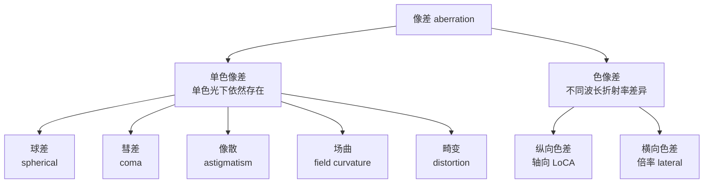

# 第 5 章 镜头语言

> 焦段决定的绝非仅是画面的取景范围。它直接确立创作者立足的空间坐标，重塑与被摄物之间的物理与心理距离，并最终裁决观者在画面中的凝视位置。

---

## 焦段是一种观看距离

1932 年，年仅二十四岁的 Henri Cartier-Bresson 在马赛购入了一台搭载 50mm 标准镜头的 Leica 相机。在其后横跨半个多世纪的职业生涯中，尽管他也曾涉足其他焦段与制式，但那些铭刻于摄影史的巅峰之作，绝大多数皆由这套经典的“Leica + 50mm”组合铸就。青年时代选定的光学视角，往往会化为创作者终其一生审视世界的内在基准。

他曾将徕卡相机比喻为“肉眼的延伸”，而镶嵌其上的核心画笔始终是那支 50mm 镜头。他生平排斥变焦镜头的机械伸缩，坚守摄影师当以双足丈量空间、以位移重构透视。这一带有鲜明古典印记的执念，置于现代摄影语境下无需机械照搬：变焦光学设计与对焦技术的成熟，使变焦镜头在复杂工作流中展现出极高的效率。然而抽离器材形态的演进，其核心要义依然历久弥新：成熟的创作者终将生长出独特的观看距离；长期契合于手中的焦段，绝非偶然的技术选择，而是其心智与外部世界互动时最习惯驻足的认知原点。

Robert Capa 同样对 50mm 情有独钟。1944 年 6 月 6 日拂晓，他随美军步兵突击队涉水冲上诺曼底奥马哈海滩，怀中紧护着两台配有 50mm 镜头的 Contax II 旁轴相机。据流传数十年的传统叙述，他在滩头枪林弹雨中记录下一百余张珍贵底片，胶卷送抵伦敦《生活》（*Life*）杂志暗房后，因年轻暗房助理在烘干箱前过度加温导致乳剂融毁，最终仅存 11 张影像，即名载史册的《辉煌十一张》（*The Magnificent Eleven*）。近年历史学者对该暗房事故版本提出了严密考证，指出银盐乳剂特性难以被单纯烘烤熔化，Capa 当日在严酷战场上极可能本身仅完成了这十余次按压。无论历史真相究竟如何，正是这组焦点晃动、颗粒粗粝、海水浸润般的残卷，奠定了二十世纪战地纪实的经典视觉经验：极端真实的现场绝非平整明晰的构图，慌乱与微震本身即是历史风暴最诚实的呼吸。

William Klein 则将 28mm 广角推向了极致。他将 28mm 视角形容为“逼近至几乎能嗅到对方面部气息的距离”。在 1956 年出版的先锋摄影集《纽约的生活对你很好：在狂欢中狂欢》（*Life is Good & Good for You in New York*）中，曼哈顿街头的摩登女性、地铁车厢中怒目争执的男子、持枪嬉戏的街童以及迎面扑来的巨幅霓虹招牌，皆以迫近的距离挤压入画。28mm 在 Klein 手中绝非为了收纳更多的环境元素，而是一种决绝的进攻姿态：它强行将观者与镜头一同推入纽约街头粗暴而生机勃勃的核心旋涡。

森山大道同样常年倚重 28mm 视角。他常手持轻便随身相机隐匿于东京街巷，步履穿行之间无需举至眼平取景便果断按下快门。新宿的雨夜、幽暗的地下通道、歌舞伎町的杂乱招牌以及流浪野犬的粗粝毛发，在其胶片上显影为晃动、高反差与粗颗粒的视觉丛林。这种失衡与粗粝绝非操作失准，而是高度自觉的美学实践：肉身率先撞击街头现实，快门带着喘息随之留痕。

Saul Leiter 则走向了截然不同的观看方式。他偏好使用长焦镜头，自曼哈顿第 10 街公寓二楼窗口俯身遥望。长焦光学系统在拉近远方景致的同时，剧烈压缩了前后的纵深跨度：一袭红风衣的漫步女子与身后疾驰的黄色出租车在画幅中被压叠至同一平面，宛若拼贴艺术般重构了都市画卷。Leiter 依凭这套独特的凝视距离深耕数个街区，直至暮年依然未曾停歇。

上述大师的迥异实践最终指向了同一命题：每位优秀的创作者皆拥有一套不可替代的观看距离。这既是物理空间的站位抉择，亦是心灵审视世界的距离度量。长年累月的凝练，最终凝固为鲜明有力的镜头语言。

---

### 一张肖像里的机位

*Mathew Brady, Abraham Lincoln, 1860 年 2 月 27 日，纽约 Cooper Union。Lincoln 那天去发表演讲，演讲前到 Brady 工作室拍了这张肖像。湿版摄影需要被拍者在镜头前保持稳定，Brady 也很擅长用姿态、光线和视角让人显得庄重可信。Lincoln 当时虽已因两年前与 Douglas 的辩论小有声望，却还远不是总统提名的热门人选，只是一个来自伊利诺伊州、不被东部政界看好的律师。这张照片和那场演讲一起流传，让他看起来稳重、可信，也更像一个可能成为总统的人。据传 Lincoln 后来说过，是 Brady 和 Cooper Union 的演讲让我当上了总统；这句话虽无严密第一手文献支撑，多半经 Brady 一方流传，但它至少说明当事人都明白这张照片的分量。镜头在这里不只是工具，也参与了政治形象的形成。[图片来源与复用说明](image-credits.md#brady-lincoln)*

1860 年 2 月 27 日上午，林肯踏入马修·布雷迪（Mathew Brady）位于纽约百老汇大街的摄影工作室。当晚，他将在库珀联盟学院（Cooper Union）发表那篇足以改写美国政治版图的重要演讲。彼时的林肯身高六英尺四英寸，身形奇长而消瘦，四肢略显笨拙，面容带着边陲拓荒者特有的粗粝与疲惫。当时的东部政界精英普遍视他为一个来自伊利诺伊州荒野之地的乡村律师，甚至带着某种轻慢的审视。布雷迪深知镜头前站立的是怎样一个人，更清楚透视与拍摄角度具有何等重构现实的力量。

布雷迪没有像常规肖像摄影那样将相机架在平视或微俯的高度，而是特意将沉重的湿版相机放低至胸口以下，让镜头微微向上仰视。这一微小的机位抉择产生了戏剧性的光学蜕变：原本可能显得突兀失调的瘦长身形，在微妙的仰角透视中被重塑为巍峨耸立的纪念碑体量；布雷迪细心地帮他拉高了衬衫领口以修饰过长的颈项，指引他将左手沉稳地按在立柱旁的几卷宪法法典之上，右手自然垂落。整幅构图通过长焦距人像镜头的远距离拍摄，平复了四肢比例的突兀感，将所有视觉重量凝聚于他深邃、坚定且饱经风霜的面容。

演讲结束之后，这张肖像迅速被翻印成木刻版画刊登于《哈珀周刊》（*Harper's Weekly*），并化作无数名片肖像照（carte-de-visite）流传于全美各地。千千万万从未见过林肯真容的选民，在报刊与明信片上看到的不再是传闻中粗鄙的拓荒农夫，而是一位从容、坚毅且具有政治远见的联邦领袖。林肯后来坦言：“布雷迪与库珀联盟演讲共同铸就了我当选总统。”镜头的焦段、站位的距离与机位的高低，从来不仅是冷冰冰的光学几何，它们在无声之中雕刻着一个人的尊严，甚至参与了历史进程的重塑。

---

## 视角与空间

初涉镜头光学时，常有人将焦段的效用简化为两句通俗表述：长焦拉近远景，广角容纳全局。这两句话描述了表象，却遮蔽了更为深层的物理本质：**焦段的选择深刻重塑了画面内部的空间透视秩序。**

广角镜头的特性，在于近距离拍摄时显著夸大前景形体、同时将背景强烈推远，且物理站位越贴近主体，此种空间拉伸越发剧烈。以 24mm 镜头近距离拍摄人物，其手势、鼻梁与近景器物被极度放大，背景则急剧退缩展开；35mm 至 50mm 被称为标准焦段，在于常规画幅与标准视距下，其呈现出平缓克制的透视体验；而使用 85mm 至 200mm 以上的长焦镜头时，为了在画幅中维持相同的主体大小，创作者必须大幅后撤拍摄距离，前后景物的相对距离比率随之收缩，背景因而呈现出强烈的“空间压缩感”。

若要维持主体在画幅中的比例恒定：
- 采用 24mm 拍摄，必须逼近主体跟前，背景被急剧拉开，人物仿佛被浩瀚环境所托举包裹；
- 采用 135mm 拍摄，必须退至数米开外，背景被显著放大并剧烈贴近主体背脊。

必须彻底澄明的核心定律在于：**真正重塑画面透视关系的，是拍摄机位与被摄体之间的物理距离；焦段仅是迫使你在不同距离上维持构图取景的画幅工具。**

*原创示意图：广角靠近与长焦后退的差别来自机位；镜头负责在不同位置维持相近的主体大小。[图片来源与复用说明](image-credits.md#perspective-distance)*

---

## 从 14mm 到 200mm

- **14mm 至 20mm（超广角）**：具备极宽广的视角张力，但伴随着剧烈的前景透视拉伸。适用于宏阔风光、狭小室内空间以及极具视觉冲击力的特定肖像。超广角的核心陷阱在于：极易将杂乱信息全数收揽而导致画面松散空洞。驾驭超广角需主动经营前景：一是放低机位极度贴近前景（将粗糙礁石、积雪纹理置于画幅下端数十厘米内），使其成为引领视线的空间台阶；二是依托地平线、道路、栈桥等斜向线条由画幅对角切入，构筑深远的视觉纵深。此外需注意透视几何特性：球形物象置于超广角边缘会被物理拉伸为椭圆，人物应尽量向中心区域收拢。
- **28mm（经典人文广角）**：兼具充沛的视域与自然的边缘控制，构成了 Ricoh GR 等街头机型的灵魂焦段。它极擅长在交代人物神态的同时完整刻画其所处的生存空间，赋予观者身临其境的现场卷入感。
- **35mm（环境人像与叙事基准）**：最为均衡的全能定焦。视角略宽于人眼专注视域，既能从容交代环境秩序，又确保主体具备坚实的视觉重心。在街头行走中，35mm 既不压迫被摄者的心理防线，亦不剥离空间的温度，是展现“人与环境互动”的黄金焦段。
- **50mm（标准克制之眼）**：视角平实克制，毫无夸张的透视畸变与虚化掩护。一幅 50mm 影像的成败，完全取决于构图骨架、光线雕琢与瞬间捕捉的深厚功力。它迫使创作者摒弃器材噱头，纯粹依靠内容与形式的自洽立足。
- **85mm 至 135mm（经典人像与特写）**：有效压缩背景杂乱元素，提供细腻圆润的虚化过渡与端正的面部比例。实战中需警惕陷入过度虚化的糖水套路，应在光线塑造、微表情捕捉与深层神韵上深耕。
- **200mm 以上（远摄长焦）**：专精于体育竞技、荒野生态、高原山脊与极端压缩感的提炼。长焦镜头对快门安全裕度、机身支撑刚性以及大气湍流具备极高的敏感度。

选拔镜头时还需重点考量两项关键参数：**最近对焦距离**与**最大放大倍率**。50mm 定焦镜头最近对焦极限通常为 0.4–0.45 米，85mm 人像镜头通常在 0.8 米开外；若意图贴近记录精致首饰或咖啡拉花，需借助放大倍率达 1:1 的专业微距镜头（Macro）。

将全画幅常见焦距与对角线视角的映射关系系统梳理如下：

| 物理焦距（全画幅基准） | 对角线绝对视角（约） | 核心美学语境与典型题材 |
|---|---|---|
| 14 mm | 114° | 极限大空间、建筑内景、穹顶星空 |
| 24 mm | 84° | 壮阔风光、建筑外景、强张力环境叙事 |
| 35 mm | 63° | 经典纪实、街头人文、环境人像 |
| 50 mm | 47° | 标准视角、平实沉静、克制写实 |
| 85 mm | 29° | 半身肖像、中景提炼、柔美分离 |
| 135 mm | 18° | 肖像特写、舞台演出、背景空间裁切 |
| 200 mm | 12° | 体育速写、野生生态、地平线压缩 |

视角的几何计算公式如下：

\[ \theta = 2\arctan\!\left(\frac{d}{2f}\right) \]

其中 \(d\) 为传感器对角线物理尺寸（全画幅约为 43.3mm），\(f\) 为物理焦距。由公式可知，视角随焦距的收缩呈现非线性特征：广角端每缩短 1mm，视角便产生剧烈扩张；而长焦端焦距翻倍，视角的收敛却相对平缓。

---

## 等效焦距与等效光圈

在非全画幅机身（APS-C、M4/3 等）上应用上述焦段法则时，需进行严密的光学等效折算。

传感器物理画幅缩小，其实质是截取了全画幅镜头成像圈中央的局部矩形区域，使成像视野收窄。折算基准即为**焦距裁切系数**（Crop Factor）：APS-C 画幅系数约为 1.5×（佳能 APS-C 为 1.6×），M4/3 画幅系数为 2.0×。

| 传感器画幅类型 | 裁切系数 | 50mm 物理镜头的等效视角 |
|---|---|---|
| 全画幅 (36×24 mm) | 1.0× | 50 mm 标准视角 |
| APS-C (约 23.5×15.6 mm) | 1.5× (佳能 1.6×) | 75 mm (佳能 80 mm) 中焦人像 |
| M4/3 (17.3×13 mm) | 2.0× | 100 mm 远摄视角 |
| 1 英寸机型 | 2.7× | 135 mm 远摄特写 |

必须明白：裁切系数带来的是**视场角的几何截取**，而非物理焦距的真实拉长。小画幅系统在远摄体积与便携性上确实具备显著优势，但并不意味着凭空获得了全画幅的高解析力与光子通量。

此外，画幅裁切系数同样会改变虚化与景深表现，这便是**等效光圈**（equivalent aperture）的概念。

光圈的物理 f 值严格决定着受光面单位面积上的照度：无论画幅大小，f/2.8 在相同快门与感光度下都会产生相同的曝光明度。然而在**景深范围**与**传感器捕获的总光子能量**这两项要素上，同样需要乘以裁切系数：

| 画幅系统 | 实际装配镜头 | 等效全画幅视角 | 等效景深与总通光量 |
|---|---|---|---|
| 全画幅 | 50 mm f/2.8 | 50 mm | f/2.8 景深基准 |
| APS-C (1.5×) | 33 mm f/1.8 | 约 50 mm | 约 f/2.8 等效景深 |
| M4/3 (2.0×) | 25 mm f/1.4 | 50 mm | f/2.8 等效景深 |

M4/3 上的 25mm f/1.4 镜头，在提供高出两档曝光照度的同时，其焦外虚化量与全画幅 50mm f/2.8 严格对等。光学世界从没有免费的午餐：小画幅在便携与长焦端赢得的轻巧，在极限浅景深与暗部信噪比上必然要支付对等的物理代价。

---

## 焦段带来的心理距离

不同焦段在潜意识里重塑着观者的感知：
- **24mm / 28mm**：将观者直接推入事件的核心现场，消弭旁观者的抽离感，形成沉浸式的互动张力；
- **35mm**：宛若立于近旁的同行者，既保持亲密的平视，又完整包容周遭生活秩序；
- **50mm**：呈现克制、从容且不带主观压迫的沉静对视；
- **85mm / 135mm**：建立专注的凝视，隔绝嘈杂背景，赋予主体以仪式感；
- **200mm 以上**：拉开遥远的物理与心理鸿沟，赋予画面以冷静审视乃至隐蔽窥视的张力。

焦段的选择，本质上是创作者在为观者设定审视世界的心理坐标。

---

## 景深与超焦距

景深范围由三大物理变量协同决定：**光圈越大景深越浅，焦距越长景深越浅，拍摄距离越近景深越浅。**

盲目追逐大光圈极易陷入“浅景深陷阱”：在极度逼近的拍摄中，f/1.4 的极浅景深厚度往往仅有数毫米，眼睫清晰而鼻尖模糊，空间环境彻底消解于浑浊虚化之中，影像退化为单调的面孔切片。

深度审视景深，当衡量其叙事功能：
- **浅景深**：果断剥离无关背景干扰，强力聚焦于主体的神态与质感；
- **深景深**：将人物与特定的建筑、风土、历史痕迹牢牢锚定于同一物理空间；
- **中景深**：精准勾勒主体与周边关键道具之间的互动纽带。

在光学理论中，界定清晰度边界的核心物理量为**弥散圆**（circle of confusion, CoC）。焦平面之外的点光源在成像面上扩散为圆斑，当圆斑直径小于人眼在特定观察距离下的辨析极限时，即可视作清晰。全画幅工程基准通常取 \(c \approx 0.03\,\text{mm}\)。

在常规物距工况下，景深总厚度可近似表述为：

\[ \text{DoF} \approx \frac{2 N c\, s^{2}}{f^{2}} \]

其中 \(N\) 为光圈数，\(c\) 为弥散圆直径，\(s\) 为对焦物距，\(f\) 为物理焦距。距离 \(s\) 与焦距 \(f\) 皆以二次方形式参与运算，揭示了机位位移与焦段更迭对景深的塑造力度远超单纯的光圈微调。

在风光与建筑摄影中，若追求自近景前景至无限远天际线的全域清晰，则需动用**超焦距**（Hyperfocal Distance）原理。将焦点精确锁定于超焦距点 \(H\)，自 \(H/2\) 至无穷远的广阔空间皆将纳入景深容许范围：

\[ H \approx \frac{f^2}{N \cdot c} \]

以全画幅 24mm 镜头、设定光圈 f/11、弥散圆 \(c=0.03\,\text{mm}\) 计算，其超焦距约为 1.75 米。将对焦点置于 1.75 米处，自 0.88 米至无穷远山脉皆可获得清晰成像。

需要明晰其实战代价：超焦距设定下，无穷远天际线恰好处于“容许模糊”的临界下限；若画面的视觉核心明确位于极远山脊，则应将对焦点直接归位至无限远。

---

## 透视只认机位

必须再次强调：**透视关系的唯一决定因素是相机与物象之间的物理空间位置。**

使用 35mm 镜头逼近至一米，主体形体巍峨而背景退远；后退至五米，主体收敛而环境展平。初学者常因站位过远导致 35mm 构图涣散，误以为是焦段缺陷而盲目更换 85mm；破局之道在于勇敢靠近，让主体与空间建立起紧密的几何关联。

长焦镜头所谓的“空间压缩”，实质上是创作者为了取景而主动后撤站位的结果。验证此原理极为简捷：在固定机位上以广角拍摄，随后裁切至与长焦相同的视域范围，其内部物象的前后比例透视与长焦成片完全一致。

电影工业据此奠定了经典的**滑动变焦**（Dolly Zoom，亦称眩晕镜头）：摄影机在轨道上推进或后撤的同时反向变焦，主体在画幅中纹丝不动，背景却产生惊心动魄的膨胀或收缩。其底层依赖的正是“透视仅由机位决定”的绝对物理法则。

---

## 技术展开：光圈两端与镜头测试

!!! note "阅读路径"

    镜头语言的主线是焦段、机位、画面范围和景深。下面的衍射、散景、像差、MTF 与呼吸效应用于解释镜头为何呈现不同结果；不准备比较镜头或处理极端画质问题时，可以先跳到“定焦还是变焦”。

### 光圈两端的代价

除了焦段，镜头本身也各有其光学性格。

首先，绝大多数镜头在光圈全开时，并非成像最为锐利的形态。f/1.4 赋予了画面柔美的焦外虚化，却往往伴随着边角锐度的妥协与更窄的对焦容错。此时将光圈收缩一至两档，画面的反差与解析力通常会显著扎实。若非执意追求极浅的虚化，f/2.8 至 f/5.6 往往是最可靠的成像素质黄金区间。

然而，光圈也并非收缩得越小越好。收小一两档固然能收敛像差，可一旦过度收小，另一重物理极限便会浮现——光的衍射。光线穿过微小孔径时会发生绕射，原本理想的点光源投射在传感器表面时不再是一个干净的质点，而是扩散为一团微小的衍射斑，即艾里斑（Airy disk）。其直径大致为：

\[ d \approx 2.44\,\lambda N \]

其中 \(\lambda\) 是光的波长（约为 0.00055 mm），\(N\) 是光圈 f 值。光圈收得越小，\(N\) 越大，这团亮斑也随之扩散：到了 f/16，艾里斑的直径已接近 0.021 mm，开始盖过传感器所能分辨的微小细节，整幅画面的锐度便随之全面下滑。

许多镜头收小一两档后，像差减轻，中心与边角趋于均匀；若继续收小，衍射又会逐步削弱高频反差。最优光圈并不存在适用于所有镜头的固定数值：光学设计、焦距、物距、传感器密度与最终输出尺寸都会影响成效。f/16 与 f/22 并非不可使用，只是往往需要以整体细节为代价换取大景深或更慢的快门速度。

高像素机身在 100% 放大审视时会更早察觉衍射的影响，但在相同的最终输出尺寸下，其细节表现并不会劣于低像素机身。所谓“衍射受限光圈”并非一道突然失效的断崖，而是一条缓坡。实拍应权衡最终用途：追求深远景深时果断收小，追求极致细节时则可考虑焦点合成。

| 光圈区间 | 景深特征 | 锐度与反差表现 | 典型适用语境 |
|---|---|---|---|
| f/1.4 到 f/2 | 极浅 | 浅景深氛围强烈，边角像差略显 | 弱光环境、情绪人像、特写微光 |
| f/2.8 到 f/8 | 浅到中等 | 中心与边缘素质均衡，反差扎实 | 日常纪实、经典肖像、风光通用 |
| f/8 到 f/11 | 中等到深 | 景深充分展开，衍射轻微显露 | 风光全景、城市建筑、大景深叙事 |
| f/16 到 f/22 | 极深 | 景深极大，整体细节受衍射轻微削弱 | 单张景深优先、长曝光拉丝水流 |

这张表揭示的核心取舍在于：光圈的两端皆需付出光学代价。开到最大，景深极浅且边角画质易松散；收到极小，景深充沛却会被衍射悄然侵蚀细节。成像最均衡稳健的区域，几乎总是落在中间段落。

广角镜头的边缘常伴有暗角，但在许多情境下这绝非缺陷。边缘光量的自然衰减能不动声色地将视线引向画面中央，成为天然的聚拢机制。后期固然能将其完全消除，但保留适度的暗角往往能赋予画面沉静的胶片韵味。

此外，在逆光或强反差的物象轮廓边缘，往往会泛起紫红或青绿色的边缘色散。至于焦外脱焦部分的质地，在摄影学中被称为散景（bokeh），不同镜头在焦外表现上会有柔顺、二线性、洋葱圈或旋焦等迥异风格。散景固然影响着画面的氛围，但若非专事商业人像，专注于画面骨架与光影叙事，远比沉迷于分辨光斑纹理更有价值。

---

### 散景怎样形成

散景（bokeh）描绘着焦点之外模糊区域的质感与形态，尤其是背景中点状光源虚化后摊开的光斑模样。它的形态直接受制于具体的光学机械构造。

先看光斑的几何轮廓。镜头的光圈是由若干片叶片合拢而成的孔径。光圈全开时，孔径接近正圆，焦外光斑也趋向正圆；一旦收缩光圈，叶片边缘切入光路，孔径显出多边形棱角，光斑亦随之带上棱角。叶片越少，棱角越硬，六片叶片收小后会留下分明的六边形；叶片数量越多且采用弧形设计，收小后孔径依然圆润，焦外光斑也能维持柔顺。厂商常强调“圆形光圈叶片”，图的正是这份收小光圈后依然浑圆的焦外质感。

光圈叶片还决定着强点光源产生的星芒形态。画面中的耀眼点光源经由叶片棱角发生衍射，会向外辐射出锋利的光针。奇数叶片会激发出两倍于叶片数的光芒（七片叶片产生十四道星芒）；偶数叶片的光芒则两两重合（六片叶片呈现六道星芒）。拍摄城市夜景时若需要规整璀璨的星芒，收缩光圈即可自然显现。

再看口径蚀（optical vignetting）：画面边缘的光斑常被挤压为橄榄形或斜睨的猫眼状。这是由于射向画幅边缘的倾斜光束先后受到镜筒前后边缘的机械阻挡，通光截面由正圆退化为两道弧线叠合的梭形。越靠边缘，这一效应越显著；老镜头边缘旋转起伏的焦外风格，正源于此。将光圈收缩一两档，通光重新回归中央孔径，边缘光斑便会逐步恢复浑圆。

---

### 像差不是一个词

散景的质感，直接牵引出更为宏大的光学命题：像差（aberration）。理想的光学系统应将物方每一个点忠实映射为像方的一个几何质点；然而现实中的光学玻璃无法做到绝对完美，光线在折射中总会产生微小的偏折与离散。

传统光学将像差分为单色像差与色像差两大体系：

球差（spherical aberration）是指穿过镜片边缘的光线与穿过中心的光线未能聚焦于同一平面。其外在表现为一层笼罩在物象之上的朦胧柔光，合焦点虽已对准，细节边缘却如蒙轻纱；收缩一至两档光圈通常能显著消除。球差的校正程度还会深层改写前后焦外的软硬过度。

彗差（coma）多见于画面边缘，原本应当汇聚为点的星光被拖曳成带有尾翼的彗星形状，向画幅内外发散。星空摄影对彗差尤为敏感，收缩光圈能有效压制。

像散（astigmatism）表现为物方点在子午与弧矢两个方向上无法同步合焦，呈现为时而被拉伸为横线、时而化为竖线的弥散斑。

场曲（field curvature）表明镜头的最佳成像面并非平整的平面，而是一个微凸的曲面。当对准平整墙面的中心合焦时，四周边缘可能因落在焦平面之外而显得发虚，在翻拍平面或建筑立面摄影时最易显现。

畸变（distortion）改变的是画面的几何形态而非清晰度。广角常见直线向外膨胀的桶形畸变，长焦常见向内收缩的枕形畸变。现代光学通常配合机身固件与后期配置算法予以精准矫正。

色像差分为两类：纵向色差（轴向色差，LoCA）表现为不同波长的色光沿光轴聚焦于前后不同位置，导致脱焦高光边缘呈现焦前紫红、焦后青绿的色边，正中心区域亦无法幸免，收小光圈可减轻；横向色差（倍率色差）则是由于不同色光的放大率不同而在边缘形成的彩色边缘，中心纯净而四角明显，收缩光圈无法消除，但由于规律严整，极易通过数字算法一键修正。

像差之外，镜头在逆光环境下还会遭遇另一重光学挑战：眩光与鬼影。光线每穿过一个玻璃与空气的界面，都会有极微量的光线发生漫反射；一颗现代镜头动辄包含十几片镜片、数十个光学界面，强光源一旦直射或切入画面边缘，多重反射的杂光便会侵蚀画面。弥散开来的是眩光（flare），表现为整幅画面的反差骤降、色调发灰；聚拢成形的则是鬼影（ghosting），沿着强光源与画面中心的轴线排布出一串彩色光斑。现代镜头精密的多层纳米镀膜，正是为了将界面反射率压制至极限。而常被初学者忽视的遮光罩，绝非器材的装饰品，而是阻挡斜射非成像杂光的坚固屋檐。在侧逆光环境中养成装配遮光罩的习惯，远比在后期中苦苦拉回画面反差要从容得多。

---

### 怎样读 MTF

MTF（Modulation Transfer Function，调制传递函数）是衡量镜头光学解析力与反差传递效率的核心科学图表。它回答的核心问题是：一组明暗相间的条纹经过镜头折射后，原有的黑白反差还能保留多少成。

MTF 数值介于 0 到 1 之间。1 代表黑白反差毫无损耗地完整传递，0 则代表黑白彻底融为均质无差别的灰泥。空间频率越高（线条越细密），镜头保留反差的难度越大，MTF 曲线随之走低。曲线横轴代表由画面中心至边角的物理距离，纵轴代表反差传递率；低频曲线（如 10 线对/mm）表征画面的整体通透感与宏观反差，高频曲线（如 30 线对/mm）则表征镜头解析纤细细节的能力。

阅读 MTF 图的关键在于观察整体高度与平缓度：曲线越高，表明镜头反差保留越充分；从中心向边缘下滑越平缓，表明画面四角的均匀度越优异。径向（sagittal）与切向（meridional）曲线的分离度，提示了像散与彗差的残存程度。MTF 图是审视锐度与解析特性的严谨标尺，但并非涵盖色彩、散景质地与机械操控的万能成绩单。

---

### 呼吸效应与入瞳

在动态视频记录与高精度全景接片中，两项进阶光学特性尤为关键：

**呼吸效应**（focus breathing）：对焦距离由无穷远向最近距离拉近时，镜头实际焦距产生细微变动，导致画面视角随之产生类似“推拉缩放”的呼吸感。静态摄影中微小的呼吸感无伤大雅，但在电影摄影下拉焦时会引起画面构图的晃动。专业电影镜头投入巨资抑制呼吸效应，现代数码机身亦逐步引入机内算法补偿。

**入瞳**（entrance pupil / 无视差点）：从镜头前端望向光圈孔所见到的虚像位置即为入瞳。在全景接片中，若相机绕机身脚架孔旋转，前后景物会因视角位移产生几何错动（视差），导致拼接处出现重影与断裂。唯有使旋转轴线严格穿过镜头的入瞳中心，远近物象才不会产生相对位移，全景拼接方能严丝合缝。

---

## 定焦还是变焦

关于镜头的选择，一条历久弥新的朴素建议是：选定一颗 35mm 或 50mm 定焦镜头，专注使用一年。

长期专注使用单一焦距，这个光学视角会逐渐内化为身体的直觉。当你望向现实场景，无需举起相机，心中便已明晰取景框所能容纳的范围与张力。你也将自然学会用脚步去丈量空间，清楚何时该前进一步赋予主体以重量，何时该退后半步让环境参与叙事。这不仅能让人从频繁更换镜头的迟疑中解脱出来，更重要的是，它会赋予你的作品一个稳定而清澈的观看距离。

若手头已有数支镜头，不妨尝试在整整一个月内每次出门仅携带同一支镜头。三十天之后，你对空间与视角的体认必将焕然一新。

预算有限时，一台二手机身搭配一支 35mm 或 50mm f/1.8 定焦，足以支撑漫长而扎实的视觉探索。进阶之后，可逐步构建 35mm 负责环境叙事、85mm 负责凝练特写的双定焦体系。风光创作可依托 16-35mm 搭配三脚架与滤镜，肖像创作则可围绕 85mm 与柔光工具展开。

变焦镜头在快节奏的纪实报道、活动记录与旅行中展现出无可替代的机动性与效率。在不可重来的决定性瞬间面前，一支 24-70mm f/2.8 能从容跨越全景与特写，这是专业的坚实保障。变焦是完成任务的高效武器，而定焦则是磨砺知觉、确立观看距离的心智导师。

---

## 几个反直觉判断

关于镜头语言，有若干颠覆日常直觉的规律值得铭记：

第一，**长焦绝非让人偷懒的捷径**。长焦镜头看似免去了走近主体的劳顿，实则对操作与环境提出了极高的要求。手的轻微晃动在 200mm 视场中被剧烈放大；远距离拍摄时，地表热浪与大气湍流往往导致远景发虚发灰，三脚架亦无能为力；长焦极窄的视角使得背景选择极其严苛，机位微调半步，背景杂乱与纯净便判若云泥。能将 200mm 驾驭自如的创作者，必然具备扎实的支撑与站位功底。

第二，**大光圈在弱光下未必是万能解药**。虽然 f/1.4 能接纳更多光线，但随之而来的极浅景深会剧烈放大对焦失误的风险，且边缘反差可能出现软化。主体静止时，依托机身防抖或三脚架延长曝光时间，往往比盲目全开光圈能获得更为扎实的画质；唯有在主体高速运动的弱光瞬间，大光圈配合高感光度才是守住动态的必要抉择。

第三，**长焦人像并不天然优于短焦人像**。85mm 与 135mm 的奶油虚化与背景剥离固然悦目，却容易让人物脱离其所依存的生活土壤，显出某种悬浮的冷漠。而 35mm 环境人像能够完整保留居所、街道与劳作的痕迹，让人物的目光与周遭空间共呼吸。当意图探讨一个人与他所处时代的关系时，短焦距往往具备更为深沉的力量。

!!! example "案例推演：同样大小的头像"

    先用广角逼近至一米以内拍摄面庞，再退至三米开外换用长焦，使面孔在画幅中维持大致相同的比例。

    第一张影像中，鼻梁与前额的比例被剧烈放大，五官关系透着戏剧性的张力；第二张影像中，五官轮廓趋于扁平沉稳，背景元素被显著放大并贴近脑后。真正重塑透视的不是焦距本身，而是**拍摄机位与被摄体之间的物理距离**。焦距的更迭，只是为了在全新的空间站位上重新确立主体的构图尺度。

    现场的决策顺序应当是：先凭借机位确立心仪的空间透视与心理距离，再选调适宜的焦距完成构图裁切。切莫本末倒置，让手中镜头的焦段禁锢了行走的双足。

---

## 练习

1. 选定一颗 35mm 或 50mm 定焦镜头，连续一个月每次外出仅携带此镜。月末回溯所有作品，体察该焦段如何塑造了自身的观看距离。
2. 邀请一位同伴站定，使用同一镜头由一米处起步，每后退一米拍摄一张，直至十米开外。将十幅影像横向并置，审视主体大小与背景透视的动态演变。
3. 针对同一静态物象，在完全相同的机位下，由最大光圈逐档收缩至 f/16 拍摄。放大对比合焦处细节与焦外过渡，确立对该镜头各档成像素质的理性直觉。
4. 携带 35mm 镜头开展两小时街头观察：规定每一张照片必须走入主体三米以内方可按下快门。拍摄百幅并精选五幅，体察身体迫近对画面张力的重塑。

---

下一章：[第 6 章 时机](06-timing.md)

