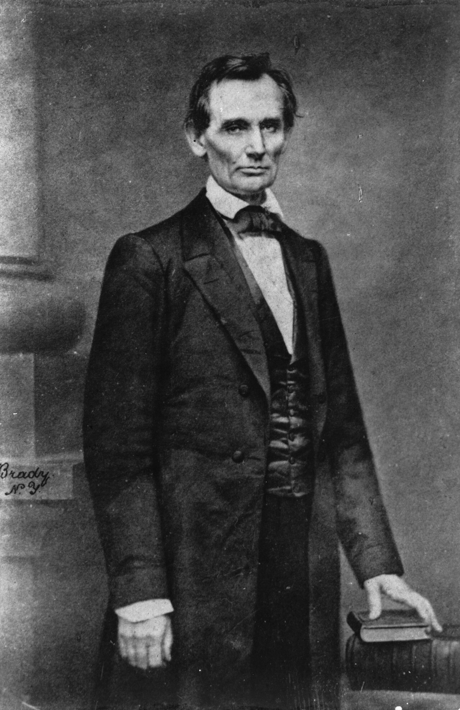

# 第 5 章 镜头语言

> 焦段决定的远不只是你能拍多远。它同时决定你站在哪里，和被拍的东西之间保持着什么样的距离，也决定观众在照片里最终会站到什么位置。

---

Henri Cartier-Bresson 1932 年在马赛买了一台 Leica，配一支 50mm 镜头，那一年他二十三四岁。此后漫长的职业生涯里，他当然也用过别的相机、别的镜头，可是回头去看，许多最被人记住的照片，几乎都出自徕卡加 50mm 这一套组合。一副在年轻时随手挑定的眼睛，后来往往会跟着一个摄影师走过大半生。

他说过，徕卡是他眼睛的延伸；而装在那台徕卡上的，几乎总是那支 50mm。他也不喜欢变焦，认为摄影师应该用脚去思考，用走动来取景，而不是站在原地拧镜头。这句话带着他那一代人的脾气，放到今天，其实不必完全照收：变焦镜头和自动对焦都已经足够成熟，很多工作场景里，变焦确实要方便得多。可是抛开器材的进步不谈，这句话背后的意思仍然成立，那就是一个摄影师会慢慢长出属于自己的观看距离。长期留在手里的那个焦段，通常并不是随便选的，而是他看世界时最习惯站的那个位置。

Robert Capa 也常用 50mm。1944 年 6 月 6 日，他随部队在诺曼底滩头上岸，手里握着的是两台 Contax II，配 50mm 镜头。按流传了几十年的说法，他在滩头拍了一百多张，胶卷送到伦敦《Life》杂志的暗房后，被年轻的暗房助理在烘干时升温过猛毁掉了大半，最后只幸存 11 张，也就是后来被称作“辉煌的十一张”（The Magnificent Eleven）的那一组，全都模糊、晃动，像一段被海水泡过的记忆。要补一句：近些年有研究者对这个暗房事故的版本提出了有力的质疑，认为乳剂并不会那样被烤化，Capa 当天拍下的很可能本来就只有这十来张；真相如何，恐怕已经无从彻底还原。可无论哪个版本成立，正是这十一张站不稳的照片，定义了 20 世纪战地摄影的一种视觉经验：真实往往并不清楚，慌乱和晃动本身，有时就是现场最诚实的样子。

William Klein 用的是 28mm。他形容那是一种靠近到几乎能闻到对方口气的距离。在 1956 年的《Life is Good and Good for You in New York》里，街上的女人、地铁里争吵的男人、孩子和头顶的广告牌，全都离镜头很近，近到几乎要顶到画面外面来。那本书起初在美国被出版社拒绝，后来才在巴黎出版，可到了今天，它却被看成战后最重要的摄影书之一。28mm 在他手里从来不是为了“拍得更广”，而是一种姿态：它把观众连同镜头一起，推到了纽约街头的正中间。

Daido Moriyama 用的也是 28mm，常常是一台揣在兜里的小相机，走着走着，不举到眼前就按了下去。东京的雨夜、地下通道、红灯区，还有野狗和高跟鞋，在他的照片里粗糙、晃动、发虚，对焦不总是准，构图也不总是稳，可这些恰恰就是他要的东西。那种粗粝并非失手，而是刻意：像是身体先一头撞进街里，照片才慌慌张张地跟上来。

Saul Leiter 走的则是相反的方向，他常用更长的焦段，从纽约 East 10th Street 公寓二楼的窗口俯身往下，看着街道。长焦一方面把远处的人拉近，另一方面又把前后的距离整个压扁，于是一个穿红风衣的女人，和她身后的一辆出租车贴在了一起，像是被人从各自的位置剪下来，重新并排摆过。Leiter 就这样拍了几十年同一片街区，直到 2013 年去世，年近九十仍没有停。

这些看似各不相同的选择，最后都会回到同一件事上：每个摄影师，都有一个只属于自己的观看距离。这个距离既是物理上的，也是心理上的：你习惯站得离对象多近，你愿意让观众离主体多近，这两件事日积月累，慢慢就沉淀成了你的镜头语言。

---

*Mathew Brady, Abraham Lincoln, 1860 年 2 月 27 日，纽约 Cooper Union。Lincoln 那天去发表演讲，演讲前到 Brady 工作室拍了这张肖像。湿版摄影需要被拍者在镜头前保持稳定，Brady 也很擅长用姿态、光线和视角让人显得庄重可信。Lincoln 当时虽已因两年前与 Douglas 的辩论小有声望，却还远不是总统提名的热门人选，只是一个来自伊利诺伊州、不被东部政界看好的律师。这张照片和那场演讲一起流传，让他看起来稳重、可信，也更像一个可能成为总统的人。据传 Lincoln 后来说过，是 Brady 和 Cooper Union 的演讲让他当上了总统——这句话没有第一手的出处，多半经 Brady 一方流传，但它至少说明当事人都明白这张照片的分量。镜头在这里不只是工具，也参与了政治形象的形成。 (Wikimedia Commons, 公有领域)*

---

刚开始理解焦段时，人很容易把它压缩成两句话：长焦把远处拉近，广角把更多东西装进画面。平心而论，这两句话都没有错，只是它们各自都只说了一半。真正更要紧、也更容易被忽略的一点在于，焦段还会改变画面里的空间关系。

广角的脾气，是夸大前景，同时把背景往后推远，而且你离主体越近，这种夸张就越是明显。用 24mm 去拍一个凑近镜头的人，他的手、脸和身前的一切都会被放大，背景则被推到很远的地方去。标准焦段，比如 35mm 到 50mm，空间关系相对自然，接近一个人站在现场用肉眼看东西时的感觉。再往上，85mm 到 135mm 会把背景拉近，让前景和后景之间的距离被压缩到一起。到了 200mm 以上的长焦，这种压缩就更强了，远处的一座山，看起来会像是直接贴在人物的背后。

于是，要拍同一个人、并且让他在画面里保持同样的大小，用 24mm 你得凑到跟前，用 135mm 你得退到远处，两张照片的差别就不只是视角宽窄而已，他和背景之间的那层关系，也会变得完全不同：前一张里，背景仿佛退到很远的天边，人被环境撑得开阔；后一张里，背景又像整个压了上来，紧紧贴在他身后。先把话说破，免得记错了账：真正改变透视的，是你为了迁就焦段而前后挪动的那段拍摄距离，镜头只是逼你走到了那个位置——这件事本章后面还会专门验证。焦段真正改变的，从来不只是画面里东西的大小，而是你描述空间的方式。

---

14mm 到 20mm，属于超广角。它一方面能把大量的东西一并收进画面，另一方面也会严重地拉伸前景。风光、室内，以及那些追求戏剧性的人像，都会用到它，但要是拿它去拍普通人像，脸就很容易变形。超广角最大的陷阱在于：画面看上去内容堆得很满，真正有用的东西却往往很少。要用好超广角，你必须主动去安排前景和线条，而不能只是站在原地，把眼前的一切尽数收进来。所谓安排，落到动作上通常是两件事。一是蹲下去、贴上去：找一块岩石、一丛落叶、一道栏杆，把镜头凑到离它半米以内，让它在画面下三分之一里被夸张地放大，成为把观众引进画面的第一级台阶；同一个海滩，站着平拍是一片乏味的开阔，蹲到一块礁石跟前再拍，礁石的纹理占住前景，海和天退成层次，画面立刻有了纵深。二是让线条从画面的边角切进来：栈道、车辙、海岸线，从左下角或右下角入画，一路引向远处的主体。还要提防一件事：超广角把三维世界摊到平面上时，越靠边缘的东西被横向拉得越宽，一个站在画面边角的人会被拉胖一圈，一颗圆球到了角落会变成椭圆，这不是镜头坏，而是投影几何的必然，构图时把人和圆形的东西往中间收一收就好。

28mm 已经够广，却又不至于像超广角那样夸张。因此，Ricoh GR 和许多街头相机，都把这个视角当成自己的核心。28mm 适合去拍一个人连同他所在的那个世界，却不太适合拿来给一张脸做规整的特写；它天生就会把主体和环境一起放进画面，也顺势让观众站得离现场比较近。

35mm 是一颗很稳妥的第一支定焦。它比标准焦段稍微宽出一点，既能带进一些环境，又不至于让主体失了焦点。走在街上，35mm 不逼着你贴到别人脸前，同时也不会把背景挤得一点不剩。它最适合那种人、空间和事件之间还留着关系的画面。

50mm 则要安静得多。它在视角上几乎没有什么戏剧性可言，一张照片能不能成立，更多要靠构图、光线和时机来撑。很多人第一次买 50mm，只是因为它便宜；可如果用过一阵之后还愿意继续用它，往往是因为它逼着你认真去判断：这里既没有广角那种扑面而来的现场感，也没有长焦的压缩和虚化替你遮掩，一张照片到最后，只能靠内容本身站住。

85mm 到 135mm，常常被用来拍人像。它会把背景压近，让虚化更明显，人脸的比例也显得比较舒服。问题在于，这几个焦段太容易让人偷懒了：拍来拍去，所有东西都变成大光圈、半身像、背景糊成一片。想用这些焦段拍出点意思来，你在光线、姿势、背景以及人物关系上，反而要比平时更下功夫。

200mm 以上，则适合体育、野生动物、远山，以及那些需要强烈压缩感的画面。除非你长期就在拍这些题材，否则大可不必急着去买。要知道，长焦其实并不比广角更省事，恰恰相反，它对快门、对焦、稳定性以及背景的选择，样样都更挑剔，本章末尾会专门算这笔账。

逐个焦段过完，还有一项参数值得顺手看一眼，它不写在焦距里，却直接决定一颗镜头的日常好用程度：最近对焦距离，以及与之相连的放大倍率。每颗镜头都有一个无法再靠近的下限，50mm 定焦通常要离主体四五十厘米才能合焦，85mm 人像镜常常要八九十厘米开外——所以拿 85mm 拍得了半身像，却没法凑近去拍一枚戒指、一杯咖啡上的拉花，这不是对焦出了毛病，而是它天生就到不了那么近。放大倍率说的是同一件事的另一面：主体在传感器上成的像，最大能有实物的几分之一，普通定焦多在 0.1 到 0.25 倍上下，而放大倍率达到 1:1 的，就是专门的微距镜头，能把一枚硬币拍满整个画面。买镜头时多看一眼这两个数，能省去日后许多“怎么凑不上去”的懊恼。

逐个焦段说下来，容易只见树木不见森林。把它们并排列在一起，视角的整体规律反而更清楚。焦距决定视角，下面这张表给的，是全画幅机身上，不同焦距对应的对角线视角，以及各自最常见的用途。

| 焦距(全画幅) | 对角线视角 | 常见用途 |
|---|---|---|
| 14 mm | 约 114° | 超广角、建筑、星空 |
| 24 mm | 约 84° | 广角、风光、环境叙事 |
| 35 mm | 约 63° | 人文、街头、纪实 |
| 50 mm | 约 47° | 标准、接近人眼中心视角 |
| 85 mm | 约 29° | 人像 |
| 135 mm | 约 18° | 人像特写、舞台 |
| 200 mm | 约 12° | 长焦、压缩、野生动物 |

这张表值得对照着记，因为它把一件很实际的事挑明了：视角每收窄一档，你能框进画面的范围就成比例地缩小，于是想让主体在画面里保持同样的大小，你就得相应地改变自己和它之间的距离。从 14mm 到 200mm，对角线视角成倍地收窄，这中间差的并不只是“拍得远近”，而是你究竟把多少环境一并交代了进去。50mm 之所以常被说成接近人眼的中心视角，是因为它给出的那块视野，恰好是我们平时不加留意、直视前方时最习惯的那一块。

表上这一串视角数字，并不是谁凭经验一个个记下来的，它们背后其实站着一条很简单的几何关系。把传感器在某个方向上的尺寸记作 \(d\)，镜头焦距记作 \(f\)，那么镜头在这个方向上张开的视角 \(\theta\) 就是：

\[ \theta = 2\arctan\!\left(\frac{d}{2f}\right) \]

如果 \(d\) 取传感器的对角线长度，算出来的便是对角线视角；换成取画面的宽或高，得到的就是水平或垂直视角。全画幅的对角线约为 43.3 mm，代进去，50mm 得到的正好是约 47°，24mm 得到约 84°，与前面表里的数字一一对得上。

这条式子还顺手解释了一件很容易被忽略的事：视角并不随焦距成比例地变化。焦距从 14mm 加到 28mm，只翻了一倍，视角却从一百一十多度一路收到七十五度上下，收得很猛；可焦距从 100mm 加到 200mm，同样翻一倍，视角却只是从二十四度缩到十二度左右，变化平缓了许多。在广角端，焦距差上一两毫米，取景范围就已经天差地别；到了长焦端，却要成倍地加焦距，视角才肯明显收窄。因此，广角镜头的焦距标注常常一两毫米一跳，长焦镜头却动辄以几十毫米为一档。

---

上面这些数字，说的都是全画幅机身上的情形。如果你手里用的是 APS-C 或者 M4/3，那么这些视角在套用之前，都要先换算一遍。

道理在于，传感器越小，它从镜头投下的成像圈里截取的那块范围就越小，于是同一颗镜头装上去，看起来就像被拉长了一截。具体的换算，APS-C 大约要乘以 1.5，佳能的 APS-C 是 1.6，M4/3 则是 2。这样一算，一颗 35mm 装在 APS-C 上，视角就接近全画幅的 52mm，已经不再是前面说的那个偏宽的 35mm 了；同样这颗镜头装到 M4/3 上，视角更是接近 70mm。

把这套换算整理成一张表，用起来会更顺手。它的口径叫作“等效焦距”：同一支镜头装在不同画幅上，视角并不相同，于是我们把它折算回全画幅上“看起来一样宽”的那个焦距，方便彼此比较。下面就以一支 50mm 镜头为例。

| 画幅 | 裁切系数 | 50 mm 镜头的等效焦距 |
|---|---|---|
| 全画幅(36×24 mm) | 1.0× | 50 mm |
| APS-C(约 23.5×15.6 mm) | 1.5×(佳能 1.6×) | 75 mm(佳能 80 mm) |
| M4/3(17.3×13 mm) | 2.0× | 100 mm |
| 1 英寸 | 2.7× | 135 mm |

裁切系数越大，同一支 50mm 的等效焦距就越长，这也解释了为什么小画幅机身在长焦端往往更占便宜：一支本身并不算长的镜头，装到 M4/3 上就相当于 100mm，装到 1 英寸机身上更是接近 135mm，等于凭空多得了一截焦距。不过这份便宜是有代价的，同样这道裁切也意味着，你很难在小画幅上得到真正开阔的广角，想要全画幅那种超广的视野，就必须专门去找焦距更短的镜头来补。

所以，“第一颗定焦买 35mm”这句话，其实要看你用的是什么机身。全画幅可以直接买 35mm；APS-C 若想得到 35mm 的视角，就应该去买 23mm；M4/3 则要买到 17mm 才行。Ricoh GR 就是一个现成的例子：它用的是 APS-C 传感器，配上一颗实际 18mm 的镜头，最后得到的，正好是 28mm 的等效视角。

不过还要记住一点：等效焦距说明的，永远只是视角这一件事。至于透视和压缩感，最终仍然取决于你和主体之间那段真实的距离。你站得远，空间就被压缩；你站得近，前景就被夸大。镜头本身并不直接决定透视，它只是迫使你站到不同的位置上去而已。

裁切系数改写的其实不止焦距，它还悄悄改写了光圈在景深上的分量。这里要引出的概念，叫等效光圈（equivalent aperture）。它说的是这样一件事：同一个 f 值，装在不同大小的画幅上，虽然曝光的明暗完全一样，可它能做出的景深深浅，以及整块传感器最终收进的总光量，却并不相同。

先把话说清楚，免得混淆。光圈的 f 值决定的是单位面积上的照度，也就是画面的明暗。就这一点而言，f/2.8 在任何画幅上都是 f/2.8，配同样的快门和 ISO，拍出来一样亮，这一条永远成立。会随画幅改变的是另外两件事：一是景深，二是整块传感器收下的总光量，而后者又直接牵动到噪点。想把这两件事在不同画幅之间对齐，就得把 f 值也乘上那颗镜头的裁切系数。

于是就有了下面这样一组彼此等价的搭配。它们拍出来视角一样、景深一样、总进光也一样，差别只落在标称的那个 f 值上：

| 画幅 | 实际镜头 | 等效焦距 | 等效光圈(景深与总进光) |
|---|---|---|---|
| 全画幅 | 50 mm f/2.8 | 50 mm | f/2.8 |
| APS-C(1.5×) | 33 mm f/1.8 | 约 50 mm | 约 f/2.8 |
| M4/3(2×) | 25 mm f/1.4 | 50 mm | f/2.8 |

这张表常常让人意外：M4/3 上那颗 25mm f/1.4，光圈数字看着比全画幅的 f/2.8 亮了整整两档，可一旦换算成景深，它给出的虚化其实只和全画幅的 50mm f/2.8 相当，而不是和 f/1.4 相当。多出来的那两档，并没有变成更浅的景深，而是变成了曝光上的余裕：同样的场景，M4/3 用家可以把 ISO 压低两档，用更干净的感光度去拍。可要论整块传感器一共收下多少光，两者又几乎相当，于是把成片放到同样大小来看，噪点也就相差无几。

想明白这一层，画幅之间那些看似占便宜或吃亏的地方，就都有了着落。小画幅在长焦端占的便宜是真的，一颗 300mm 装到 M4/3 上就顶得上 600mm；可它在浅景深上吃的亏也同样真切，想在小画幅上复刻全画幅 f/1.4 那种极致的背景分离，你手里得有一颗物理上更大、更亮、通常也更贵的镜头才行。画幅这件事上从来没有免费的午餐，你在某一头占到的便宜，多半会在另一头如数还回去。

---

不同的焦段，还会带给观众不同的心理距离。

24mm 会让观众感到自己像是站在画面里面：本章开头 Klein 那本纽约摄影集里，孩子把玩具枪顶到镜头跟前，观众不是在看这件事，而是被卷进了这件事。35mm 把观众带到主体近旁，像是和对方坐在同一张桌子边上，人和他的环境都还在，谁也没有被剥离出来。50mm 则更像面对面地看着一个人，HCB 那些巴黎街头的画面之所以显得克制，一半就来自这个不远不近的位置。到了 85mm，画面里就带上了一点凝视的意味，你和主体之间明显隔着一段距离，像隔着一条街望向对面咖啡馆里的人。135mm 会显得更远，像是从旁边远远望见一个人。而 200mm 以上，那份距离感就更强了，有时甚至会带上一点监视般的意味。

街头摄影和人像，都很依赖这种心理上的距离感。正是因此，Cartier-Bresson 的 50mm 让人感到克制而从容，Klein 的 28mm 让人感到自己被一把推到了纽约街头的正中央，而 Bruce Gilden 的 28mm 再加上一只手持闪光灯，更是让画面几乎贴到了脸上。焦段表面上看是一桩器材选择，骨子里，它其实是在替观众决定，他应该站在哪里。

---

景深由三个变量共同决定，而且方向都一致：光圈越大，景深越浅；焦距越长，景深越浅；拍摄距离越近，景深也越浅。

新手很容易一上来就迷恋大光圈。用 f/1.4 拍人，背景糊成柔和的一片，刚开始看确实很漂亮。可问题在于，景深一旦太浅，麻烦就跟着来了：眼睛是清楚的，鼻尖却可能已经虚掉；两只眼睛要是不落在同一个焦平面上，甚至可能只有一只是实的；背景固然被糊掉了，但连同背景一起消失的，还有整个空间，到最后，画面里只剩下一个被虚化团团包住的脑袋。

这不是夸张。拿 85mm、f/1.8 在两米外拍人，用后面要讲的景深公式一算，前后清晰的范围合起来也就六厘米上下，摊到焦点两边，各只剩三厘米左右。可一张脸从鼻尖到耳朵远不止三厘米，所以对上了眼睛、鼻尖和耳朵落到清晰之外，是算得出来的必然，而不是手抖。光圈再开到 f/1.4，这层清晰的薄片还要再窄去两成。明白了这个厚度，你就不会再把“怎么总有地方是虚的”怪到对焦上，而会回头去想：这张脸，到底需不需要浅到这个地步。

所以真正该问的，其实不是虚化到底有多明显，而是这张照片究竟需要保留多少关系。浅景深常常意味着，这张照片主要是关于这个人的，背景暂时可以不重要；深景深则相反，它把人物和他所在的那个世界一起留了下来；至于中等景深，介乎两者之间，常常用来说明主体和身边某一样东西之间的关系。

因此，按下快门之前，不妨先问自己一句：这张照片，到底需要多少背景？如果背景本身能够说明人物、交代地点或者烘托气氛，那就别急着把它糊掉；反过来，如果背景只是一种干扰，那就可以用景深、用站位，或者索性换一个角度，把它压下去。

要把上面这三条规律从感觉落到可以估算，得先交代一个前提，它叫弥散圆（circle of confusion）。一个位于焦平面之外的点，成像时并不会缩回成一个真正的点，而是摊成一小团模糊的圆斑；只要这团圆斑小到肉眼分辨不出，我们就依旧把它当作清晰。弥散圆指的正是这个临界的圆斑直径，也就是那条“可接受的模糊”的界线。它并不是一个绝对的物理常数，而是取决于你最终把照片放到多大、又站多远去看：印得越大、看得越近，能容忍的模糊就越小。工程上对全画幅常取 0.03 mm 上下，大体相当于把对角线除以一千五百。

有了弥散圆这条界线，景深就能写成一道公式。当拍摄距离远小于后面要讲的超焦距时，景深的总厚度大致是：

\[ \text{DoF} \approx \frac{2 N c\, s^{2}}{f^{2}} \]

其中 \(N\) 是光圈 f 值，\(c\) 是弥散圆直径，\(s\) 是对焦距离，\(f\) 是焦距。这道式子把前面那三句定性的话，一次就讲全了：景深与光圈 f 值成正比，光圈开得越大，\(N\) 越小，景深越浅；景深与对焦距离的平方成正比，凑得越近，浅得越快；景深又与焦距的平方成反比，焦距越长，在同一距离上景深越薄。距离和焦距都落在平方项上，这也说明为什么它们对景深的拨动，往往比单纯改光圈来得更猛。

这里还有一个前提值得挑明：上面说焦距越长景深越浅，指的是站在原地不动、只换焦距的情形。倘若你一边换焦距、一边挪动机位，好让主体在画面里的大小保持不变，那么景深反而几乎不随焦距改变，这和后面要讲的透视只认距离，其实是同一条道理。

谈景深，我们多半时间在操心怎么把它做浅；可有些题材，比如风光和建筑，要的恰恰相反：从近处的前景到远处的天际线，最好一并清楚。这时就轮到一个古典而实用的概念登场，叫超焦距。所谓超焦距，指的是这样一个对焦距离，当你把对焦点放在它上面，从这个距离的一半一直到无穷远，就全都落在景深范围之内。它的估算公式是：

\[ H \approx \frac{f^2}{N \cdot c} \]

其中 \(H\) 是超焦距，\(f\) 是焦距，\(N\) 是光圈 f 值，\(c\) 是弥散圆直径，全画幅约为 0.03 mm。把对焦点放在超焦距上，从 \(H/2\) 到无穷远都清晰。举个例子，50mm、f/8、\(c=0.03\) mm 时，算得 \(H \approx 10.4\) 米，也就是把焦点对到约 10 米以外，从 5 米一直到无穷远，就都在景深之内。

这条公式在实拍时的用处，是把“到底该对哪里最保险”从凭感觉变成可以估算。焦距越短、光圈收得越小，超焦距就越近，能用的清晰范围也就越大，这也正是风光镜头偏爱广角加小光圈的缘故。它给的当然只是一个估算而非严丝合缝的标准，弥散圆本身还取决于你最终要放到多大来看，可即便如此，心里先揣着这样一个数量级，也远比把焦点随手丢在画面中央要稳妥。

实拍里常听人说“对到画面前三分之一处”，这其实就是超焦距的一句粗略口诀：真正该对的点不在无穷远，而在中景偏近的位置，前后才好一并兼顾。但它只是口诀，不是定律——它大致成立的前提，正是你已经收到小光圈、用上广角，把超焦距压进了画面里的时候；一旦换成长焦或大光圈，超焦距远在天边，这句话立刻就不管用了。还要认清它的代价：把焦点放在超焦距上，等于让无穷远刚好卡在“可接受的模糊”那条线上，也就是说远山是清晰的下限、而非最实的一点。若这张片子的重心恰恰是天际线那道山脊，那就宁可老老实实对到无穷远，把清晰的余量让给远处，让近处的前景去牺牲。

---

还有一点值得单独说：哪怕是同一个焦段，只要站位一变，透视也就跟着变了。

同样用 35mm，离主体一米去拍，主体就显得大，背景被推得很远，近处的东西也会显得夸张；把同一颗 35mm 退到离主体五米，主体立刻变小，背景和主体之间的关系也随之变松。换镜头改变的是视野，换站位改变的却是透视，而后者对空间感的影响，其实要来得更深。

拿着一颗 35mm，却站得太远，是一个非常常见的问题。这样拍出来，主体太小，背景又散，于是很多人就此认定 35mm 不好用，转头去换了 85mm。可其实，问题往往并不出在焦段上，而是出在站位上。35mm 需要的，是你主动靠近一点，让主体和环境同时进入画面，并且让它们彼此之间真正发生关系。

Robert Capa 那句“如果你的照片不够好，那是因为你离得不够近”，很多时候讲的正是这个意思。

把透视这件事落到人脸上，就能得到一条非常实际的提醒：用广角贴得很近去拍一张脸，脸很容易变形。要注意，问题并不出在广角本身，而是出在距离太近。你想用 24mm 把一张脸拍满，就不得不凑到三四十厘米的地方，这时鼻子离镜头，明显要比耳朵近上一截，于是鼻子被夸大，脸颊则往后退了下去。手机的前置自拍举得太近，鼻子会显得大，背后其实也是同一个道理。

换成用 85mm 去拍一张同样大小的脸，你就得站到两米开外，这一来，鼻子和耳朵到镜头的距离，差别顿时变小了，五官的比例自然也就正常了。所以说，人像镜头并不会替你美颜，它做的其实只有一件事，就是逼着你站得远一点。

这并不是说广角就不能拿来拍人。恰恰相反，广角很适合去拍人和环境的关系，关键只在于摆放的方式：只要别让脸占满整个画面，别把脸摆在离镜头最近、又最靠中心的位置，让它稍稍退开一点、偏离一点，那种夸张的变形自然就会少很多。

顺着透视这条线再往深处追一层，就能戳破一个流传很广的说法，也就是所谓的“长焦压缩空间”。这句话本身不算错，错的是它把功劳记在了焦距头上。真正决定透视关系的，自始至终只有一个量，那就是相机到被摄物之间的距离。长焦之所以看起来把前后压扁，并不是那块玻璃有什么魔力，而是因为你为了把主体取进画面，不得不站得更远，是这段被拉开的距离在压缩空间。

要验证这一点，有一个直截了当的办法：站在原地不动，先用广角拍一张，再把它裁切到和长焦一样的取景范围。你会发现，裁出来的画面里，前后景的透视关系和长焦直接拍的一模一样。想通了这一层，“压缩感”就从一种玄妙的镜头特性，还原成一条可以主动调度的规则：想要更强的压缩，正确的做法是往后退、把距离拉开，而不是盲目地去换一支更长的镜头。

这条规律还能反过来用，做成一个很直观的对照实验：让主体在画面里始终保持一样大，一边换焦距，一边相应地前后挪动机位。你会看到，主体的大小丝毫没变，背景却在悄悄改变。用广角凑近去拍，背景显得又远又小；退到远处换长焦去拍，同一片背景就整个胀大，逼到主体身后。变的从来不是主体，而是背景相对主体的那个比例，而这一切，都是那段拍摄距离在幕后调度。

电影索性把这套原理变成了一种镜头语言。摄影机一边沿着轨道推近或拉远，一边朝相反方向变焦，好让主角在画面里的大小纹丝不动，背景却在他身后诡异地胀缩，人像被钉在原地，世界却在四周变形。这一手叫滑动变焦，也叫眩晕镜头，Hitchcock 在《Vertigo》里用它来渲染那种坠落般的晕眩，后来在《Jaws》等许多影片里被反复借用。它靠的并不是什么特殊镜头，而正是“透视只认距离”这一条最朴素的道理。

---

除了焦段，镜头本身也各有各的脾气。

首先，大多数镜头在最大光圈的时候，并不是最锐的。f/1.4 给了你漂亮的虚化，与此同时，也牺牲掉了一点锐度和对焦上的容错。这时只要往里收一到两档，画面通常就会稳当很多。所以，如果你并不需要那种极浅的景深，f/2.8 到 f/5.6，往往是一段很可靠的范围。

不过，光圈也不是收得越小就越好。往里收一两档固然能把画面收拾利落，可一旦收过了头，另一个物理限制就会浮上来，那就是衍射。光线穿过一个越来越小的孔径时会发生绕射，一个点光源落到传感器上，便不再是一个干净的点，而是摊开成一小团亮斑，这团亮斑有个专门的名字，叫艾里斑（Airy disk）。它的直径大致是：

\[ d \approx 2.44\,\lambda N \]

其中 \(\lambda\) 是光的波长，约为 0.00055 mm，\(N\) 是光圈 f 值。光圈收得越小，\(N\) 就越大，这团亮斑也随之变大：到了 f/16，艾里斑的直径已经接近 0.021 mm，开始盖过传感器本可分辨的细节，于是整幅画面的锐度会一并跟着下滑。

因此，多数镜头最锐的区间，落在 f/4 到 f/8 之间，而不在两端——现代定焦往往收到 f/4、f/5.6 就已到达峰值，再往里收，下面要讲的衍射门槛就开始起作用了。这一点也提醒我们，一味把光圈收到 f/16、f/22 去换取更深的景深，本质上是拿整幅画面的锐度做交换：景深是换深了，细节却换软了。到底划不划算，要看这张照片更在乎的是哪一头。

衍射究竟从哪一档开始吃掉细节，其实还和你机身的像素密度有关。艾里斑是一团有实际大小的亮斑，而传感器能分辨的最小单位是一个像素；只要这团亮斑还没铺满一两个像素，它的影响就淹没在像素本身的粗细里，看不太出来。可一旦像素做得越来越细密，同样大小的艾里斑就会跨过更多的像素，衍射也就更早地显出形来。于是每一台机身都有一个大致的门槛，习惯上叫它衍射受限光圈（diffraction-limited aperture）：越过这一档，光圈收得再小也换不回更多细节，反而只是把画面进一步抹软。

把像素间距记作 \(p\)，让艾里斑的半径恰好等于一个像素，就能估出这个门槛落在哪一档光圈上：

\[ N_{\text{dl}} \approx \frac{p}{1.22\,\lambda} \]

一台两千四百万像素的全画幅，像素间距约 0.006 mm，代进去得到约 f/9，收到 f/11 往后就该留意了；换成四千五百万像素的机身，像素间距缩到 0.0044 mm 上下，门槛提前到 f/6.7 附近；到了六千万像素这一档，甚至 f/5.6 之后就得当心。这也顺带回答了一个常被问起的问题：为什么高像素机身反倒更“娇气”。它并不是真的更差，只是把镜头和衍射的底细一并放大了给你看，逼着你在光圈的取舍上更用心。还要补一句，这个门槛是一道缓坡而不是悬崖，越过它画面只是逐渐变软，不会在某一档突然崩掉，所以真需要大景深的时候，该收还是可以收。

把光圈从头到尾的这段取舍摆到一起，权衡就更清楚了：

| 光圈区间 | 景深 | 锐度表现 | 适合的场合 |
|---|---|---|---|
| f/1.4 到 f/2 | 极浅 | 略软，边角与色差更明显 | 弱光、强行分离主体 |
| f/2.8 到 f/8 | 浅到中等 | 多数镜头最锐的一段 | 人像、日常、风光、通用 |
| f/8 到 f/11 | 中等到深 | 仍然扎实，高像素机身渐显衍射 | 风光、建筑、大景深 |
| f/16 到 f/22 | 很深 | 衍射明显，整体发肉 | 只在需要极大景深时妥协使用 |

这张表最该记住的一点，是两端都要付出代价：开到最大，景深和边角画质一起松掉；收到最小，景深是够了，细节却被衍射悄悄吃走。真正稳妥的那一段，几乎总是落在中间。

其次，广角镜头的边缘常常会有暗角，可这不一定就是坏事。暗角会自然而然地把观众的视线往画面中间推，也就可以被当成一种画面引导来用。后期当然能把它校正掉，但你同样可以选择把它保留下来。

再者，广角往往带有桶形畸变，画面里的直线会朝外鼓出去；长焦则相反，带的是枕形畸变，直线会朝里收进来；而在 50mm 附近，这类畸变通常最少。软件固然能校正掉一部分，可如果你拍的是建筑和室内，最好还是在现场就留意好那些线条。

此外，在逆光、强反差的边缘上，常常会冒出紫边或者绿边，便宜的镜头尤其明显，好在这类问题后期一般都能去掉。至于虚化部分的那种质地，有一个专门的名字，叫散景（bokeh），不同的镜头在这上面会有圆滑、二线性、洋葱圈、旋转这些区别。散景当然会影响人像的观感，可话说回来，如果拍的不是商业人像，那么先把画面本身拍好，远比反复去研究散景更值得花时间。

---

前面顺口提到的散景，值得单独展开，因为它的形状并非什么玄妙难解的东西，而是由几件很具体的事决定的。散景说的是画面里那些脱焦的部分呈现出来的质地，尤其是背景中的点状光源被虚化之后，摊成一个个光斑的模样。

先看光斑的形状。一枚镜头的光圈，是由若干片叶片合拢成的一个孔。当你把光圈开到最大，孔接近正圆，脱焦的光斑也就接近圆形；可一旦收小光圈，叶片的边缘便探进光路，孔于是变成多边形，光斑也跟着现出棱角。叶片越少，棱角越硬，六片叶片收小之后会留下清清楚楚的六边形；叶片越多，又做成弧形，孔就越接近圆，收小之后光斑依旧圆润。所以厂商常把“九片圆形光圈叶片”写进参数表，图的正是这份收小之后仍旧浑圆的焦外。

叶片数还牵动着另一件事，就是点光源被拉出的星芒。画面里一旦有强烈的点光源，光在叶片的棱边上发生衍射，会沿着几个固定方向拖出光针。奇数片叶片会拖出叶片数两倍的光针，七片叶片给你十四道；偶数片叶片则正好两两重合，六片叶片就只留六道。所以想要夜景里那种规整的星芒，把光圈收小、让叶片的棱角显出来即可。

再看一个让很多人困惑的现象：为什么画面正中心的光斑是圆的，越往边角却越被挤成橄榄形，像一只只斜睨的猫眼。这叫口径蚀（optical vignetting），也有人直接叫它猫眼效应。道理在于，冲着画面边角去的那束斜射光，会先后被镜筒的前后两道口径各切掉一部分，剩下能通过的形状就不再是整圆，而是两道弧夹出来的橄榄。越靠边越明显，也正是这一圈方向逐渐偏转的橄榄，凑成了老镜头里那种旋转的“旋焦”。想减轻它，把光圈收小一两档，让通光重新回到圆孔的中央地带，猫眼便会慢慢收敛回圆。

---

散景的圆润与否，其实已经触到了一个更大的题目：像差（aberration）。理想的镜头，应该把每一个物点都干干净净地还原成像面上的一个点；可现实里的玻璃做不到这么完美，光线穿过镜片时总会跑偏，跑偏的方式五花八门，每一种都有自己的名字，也各自在照片上留下能被认出来的痕迹。前面零散提到的畸变、色差、暗角，还有刚说完的散景，其实都能收进这张大网里。

按传统的分法，像差先分成两支：一支是哪怕只用单一颜色的光也照样出现的单色像差，另一支是因为不同波长的光折射程度不同而来的色像差。单色像差里最经典的一组，是十九世纪由 Seidel 归纳出来的五种。

球差（spherical aberration）说的是，穿过镜片边缘的光线和穿过中心的光线，没有落在同一个焦点上。它留下的痕迹，是一层朦胧的柔光，主体明明对实了，却像蒙着一层薄雾，光圈越大越重，收一两档就明显好转。有意思的是，球差校正得过头或者不足，还会分别改变前景和背景散景的软硬，很多镜头焦外耐不耐看，根源就在这里。

彗差（coma）只在画面边缘露头。一个本该是点的星光，到了角落会被拖成一颗带尾巴的彗星，尾巴朝着画面外或者画面内。拍星空的人对它最敏感，因为满天的星点一到四角就长出翅膀，收小光圈能压下大半。

像散（astigmatism）指的是，一个点在水平和垂直两个方向上没法同时合焦，于是它时而被拉成一道横线，时而又拉成一道竖线。厂商 MTF 图上那两条分开的曲线，量的正是这两个方向上的差别，两条贴得越近，说明像散越小。

场曲（field curvature）说的是，镜头最清楚的那个面，其实是一张弯曲的碗，而不是一块平板。于是当你对着一面平整的墙、把中心对实，边角却因为落在碗沿之外而发虚。翻拍平面文件、拍建筑立面的时候，它最容易现形。

畸变（distortion）不碰清晰度，只动形状。广角常见桶形，直线朝外鼓；长焦常见枕形，直线朝里收；有些变焦还会走出中间鼓、两头收的胡子形。它是几何上的偏差，所以也最容易靠软件按镜头档案校正过来。

色像差则分成两路，认起来要分清楚。一路是纵向色差（longitudinal，又叫轴向 LoCA）：不同颜色沿着光轴落在前后不同的位置上，于是脱焦的高光边缘泛起紫红与青绿，焦前一色、焦后一色，连画面正中心也躲不掉；它收小光圈能减轻，软件却很难彻底根除。另一路是横向色差（lateral，又叫倍率色差）：不同颜色被放大的倍率略有差别，越往画面边角，红青色边越宽，正中心反倒干干净净；它收光圈没有用，好在规律工整，软件几乎一键就能校正。

至于暗角（vignetting），严格说并不算聚焦上的像差，而是画面边角的光量衰减。它一部分来自自然的余弦四次方衰减，一部分来自镜筒对斜射光的机械遮挡，通常收小光圈就能减轻。前面已经说过，它不一定是缺点，压暗四角反而能把观众的视线收拢到画面中央。

像差之外，镜头还有第二类画质上的敌人，专在逆光时现身：眩光和鬼影。光线每穿过一个玻璃与空气的界面，都会有一小部分被反射回去；一颗现代镜头动辄十几片镜片，几十个界面，强光源一旦进入画面或者贴着画面边缘，这些界面之间来回反射的杂光就会在画面上留下痕迹。摊成一片的，是眩光（flare），表现为整幅画面反差下降、发灰发雾，黑的不再黑；聚成形状的，是鬼影（ghosting），沿着强光源与画面中心的连线，排出一串光圈形状的彩色光斑。镀膜就是为此而生：在镜片表面蒸镀上厚度只有光波长几分之一的薄膜，利用干涉把界面反射压到百分之零点几，各家引以为傲的纳米镀膜、T* 、SSC，做的都是这件事。老镜头镀膜简陋，逆光一冲就泛白，有人反倒喜欢那种朦胧，拿它当一种味道，这无可厚非，但要分清那是选择而不是无奈。至于遮光罩，它不是装饰，也不只是磕碰时的保险杠：它的本职是挡住那些不参与成像、却会从斜侧打进前镜片的杂光，等于在镜头前立了一圈屋檐。顺光时它闲着，侧逆光时它就是反差的守门员——画面外一步之遥的太阳、身后一盏路灯，都可能正往你的前镜片上泼光。养成把遮光罩装正的习惯，比事后在后期里拉回反差要划算得多；实在没带，伸出一只手在镜头上方替它遮一遮，老摄影师大多深谙此道。

---

认全了这些像差，就有资格去读厂商衡量一枚镜头的那张图了，它叫 MTF（Modulation Transfer Function，调制传递函数）。老一辈评价镜头，爱说“能分辨多少线对”，可那句话只回答了“分得清多细”，答不了“反差还剩几成”。MTF 把这两件事合到了一处，问的是同一个问题：一组黑白相间的条纹，经过镜头之后，明暗之间的落差还能保住多少。

它给出的是一个介于 0 到 1 之间的数。1 表示黑白的反差被原原本本地传了过来，0 表示黑白已经糊成一片均匀的灰、彻底分不出彼此。条纹越细密，也就是空间频率越高，镜头越难守住反差，MTF 也就越低。厂商画 MTF 图，横轴通常是“离画面中心有多远”，从正中一路排到边角；纵轴就是这个 0 到 1 的数；每一条曲线对应一个空间频率，低频（例如每毫米十线对）大体反映反差和通透感，高频（例如每毫米三十线对）大体反映能解析出多细的细节。

读这张图，有几处可以一眼看出门道。曲线整体的位置越高，镜头越通透、越锐；曲线从中心到边角掉得越缓，说明边角越跟得上中心。每个频率往往还画成两条，分别对应径向（sagittal）和切向（meridional）两个方向，前面说的像散越小，这两条就贴得越近，落到焦外，也往往意味着光斑越圆。于是一张 MTF 图，等于把锐度、反差、边角的均匀，还有散景的圆润，一并摊开给你看了，比单一个线对数要完整得多。

---

最后两个概念，平日拍照未必天天记挂，可一旦碰上视频和接片，就绕不过去。

第一个是呼吸效应（focus breathing）。同一颗镜头，当你把对焦从远处拉到近处，它的实际焦距会随之发生细微的变化，于是视角也跟着轻轻缩放，画面像是“吸了一口气”。拍照的时候这点变化几乎无关紧要，可一旦拍视频、做一次拉焦，观众就会看见构图随着焦点游走而微微推拉，画面因此显得不安稳。专门的电影镜头会花大力气把呼吸效应压到最低，一些新的照相镜头也开始把“抑制呼吸”写进卖点，靠机身或镜头的运算把这份缩放补回去。

第二个是入瞳，也叫无视差点（entrance pupil / no-parallax point）。你从镜头正面往里看，会看到光圈孔成的一个像，那个像所在的位置就是入瞳。它的要紧之处在于接片：把好几张照片拼成一整幅全景时，如果相机绕着别的点旋转，近处和远处的景物就会因为视角改变而彼此错动，接缝处便对不齐，这种错动叫视差。而只要让相机严格绕着入瞳去转，近景和远景之间就不再相对滑动，几张照片才拼得严丝合缝。全景云台上那一截可以前后滑动的导轨，作用正是把转轴挪到入瞳上。还要补一句，这个点常被人叫作“节点”，其实并不准确，真正决定视差有无的是入瞳，而不是光学意义上的节点，两者只是位置常常靠得很近，才被混为一谈。

---

这本书在镜头上最实用的一条建议，其实说起来很简单：买一颗定焦，35mm 或者 50mm，然后用它整整一年。

只用一颗定焦坚持一段时间之后，这个视角就会慢慢变成一种本能。你看见一个画面，用不着举起相机去试，心里就已经知道这颗镜头能不能拍到它。你也会习惯用脚步和身体去代替变焦，清楚什么时候该往前靠近，什么时候又该往后退。这样做，一方面能替你省下大量的时间、注意力和金钱，另一方面，也是更要紧的一面，你的照片会开始拥有一个稳定的观看距离。

如果你手里已经有了好几颗镜头，那么不妨从今天起，要求自己每次只带一颗出门，连续坚持三十天。三十天之后，你多半会非常清楚自己究竟需要什么，也会少掉很多“要不要再添一颗”的犹豫。

预算不高的时候，一台二手机身，配上一颗 35mm 或者 50mm f/1.8 的定焦，就已经足够你练上很久了。等到进阶以后，可以考虑 35mm 加 85mm 这样一组搭配，让一颗去负责环境和日常，另一颗去负责人像和压缩。如果偏向风光，可以从 16-35mm f/4、24-70mm f/4，再配上三脚架和滤镜开始；如果偏向人像，则可以从 85mm f/1.8、35mm f/1.8，再加上一块反光板开始。

说了这么多定焦的好话，也得替变焦说句公道话，免得这份偏向变成偏见。有些场合，变焦才是对的工具：婚礼、报道、活动纪实，现场不容你退到墙边换镜头，一支 24-70mm f/2.8 在腰间一拧就从环境切到特写，错过的瞬间不会为你的“用脚变焦”重来一次；旅行时一支镜头顶三支，省下的重量和换镜头的功夫，都是实打实的。所谓恒定光圈的“大三元”之所以成为行业标配，正是因为吃这碗饭的人赌不起。而且现代变焦的光学素质早已不是 HCB 那个年代的水平，中档变焦在常用光圈下的表现，未必输给同价位定焦。这本书劝你从定焦练起，是因为你在练判断，不是在赶任务；等到哪一天你接了一场不能重来的活，该拿起变焦就拿起变焦，那不是堕落，是专业。

还有一点要提醒：不要一上来就冲着最贵的挂机牛头去。三颗便宜的定焦，未必就比一颗昂贵的变焦更“专业”，可它们有一样长处，就是更能逼着你去练站位、练距离、练现场的判断。

---

关于镜头，最后还有几个不太符合直觉的判断，值得单独提一提。

第一，长焦并不是能偷懒的镜头。它表面上看，好像只是把远处拉近而已，实际上却更难，而且这份难处是可以一笔一笔算清楚的。先算抖动：你手上同样幅度的一次晃动，在 200mm 的画面里被放大的倍数是 24mm 里的八倍多——视角从八十几度收窄到十二度，同一个角度的偏移，占掉画面的比例就翻了这么多倍，这正是安全快门要随焦距抬高的原因。再算空气：拍几公里外的远山、隔着柏油路面拍动物，热浪和大气扰动被长焦一并放大，中午的远摄常常糊得莫名其妙，其实是空气在晃，不是你在晃，这份糊连三脚架也救不了，只能等清晨或雨后。再算背景：长焦的背景视角极窄，身后那一小条背景是乱是净，全看你左右挪出的那几步，站位要比广角挑剔得多。所以支撑上也要跟着讲究，独脚架是长焦的老搭档，比三脚架机动，又比手持稳得多。能用 200mm 把片子拍好的人，技术通常都相当扎实。顺带把防抖说清楚：现代机身加镜头的协同防抖，厂标动辄六到八档，实拍稳妥地按三到五档估，它确实把长焦手持的门槛大幅拉低了。可防抖补偿的只是你的手，画面里会动的东西它一样也帮不上——这一条第 3 章讲过，换了镜头也不会变。

第二，大光圈定焦在弱光下，也不一定总是首选。先纠正一个常见的误会：自动对焦是在镜头全开光圈下工作的，所以 f/1.4 在暗处合焦其实比小光圈镜头更快更有底气，这正是它的传统长处。真正的麻烦在合焦之后：景深薄成一层纸，你或对方在按快门前后哪怕晃动几厘米，焦点就从眼睛滑到了眉毛，成片率跌得厉害。所以 f/1.4 在弱光里的正确用法，是拿它换快门速度去凝住动作，而不是图它省 ISO；要知道，现代相机的 ISO 6400 已经相当可用，被摄的人如果基本不动，防抖加慢门加中等 ISO 反而更稳；对方一旦在动，才轮到大光圈加高快门出场，并且要接受成片率的折损。

第三，长焦人像也未必就比短焦人像更好。85mm 和 135mm 的虚化漂亮，背景干净，很多人便顺手把这种干净直接当成了好。可是换成用 35mm 拍人像，画面里会保留下更多的空间、故事和生活的痕迹。85mm 会把一个人从他的环境里剥离出来，结果固然干净，却也可能因此显得冷。所以，如果你真正想讲的，是一个人和他生活之间的那层关系，那么 35mm 往往要更有力量。

---

## 练习

挑一颗定焦，35mm 或 50mm，一个月只用它出门。一个月后回看所有照片，看自己怎样被这颗镜头塑造了观看距离。

找一个朋友，让他站定。同一颗镜头从近到远每隔一米拍一张，拍十张。回家排开看，主体大小和背景关系怎样变化。

同一个静物、同一站位，从 f/1.4 到 f/16 每档拍一张。对比景深和锐度，建立自己对各档光圈的直觉。

带 35mm 定焦出门两小时。规则是，所有照片都要走到主体三米内才按。拍一百张，最后选五张。

---

下一章：[第 6 章 时机](06-timing.md)
