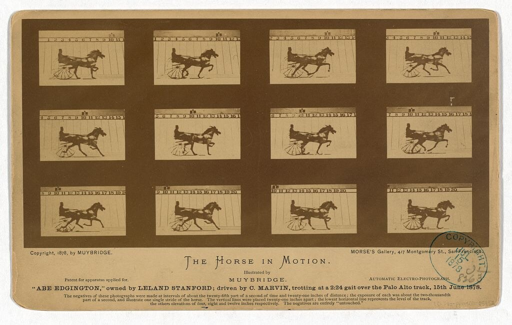

# 第 6 章 时机

> 决定性瞬间不是教条，是物理。一张照片要么时机对，要么不对。

---

*Eadweard Muybridge, "The Horse in Motion", 1878。Leland Stanford 当年和朋友打赌：马在奔跑时是不是会有四蹄完全离地的一瞬间？为了赢这个赌，Stanford 雇 Muybridge 在 Palo Alto 的赛道边布了一排 12 台连环相机。每台快门由马蹄踩到的一根细线触发。这组照片证实了赌局的答案 - 第三帧确实四蹄全离地。摄影第一次把人眼看不到的瞬间变成了证据。「时机」作为一个摄影概念从这一刻开始。 (Library of Congress, 公有领域)*

---

Henri Cartier-Bresson 1952 年出版的《Images à la Sauvette》（英译《The Decisive Moment》）改变了一切。中文翻译「决定性瞬间」让这话听起来像禅意 - 等一个完美瞬间从天上掉下来。

法语原话不是这个意思。「À la sauvette」是「偷偷的、抓的」 - 更接近「偷拍来的画面」。Bresson 不是等天上掉完美瞬间，他是在一个发展中的局面里**预测下一秒**，然后准备好相机等下一秒到达。

他自己的原话比翻译准：「在所有事情里都有一个决定性瞬间 - 创造性的几分之一秒，意识对一个发展中的局面变得越来越敏锐，然后人按下快门。」

要点是「**意识对发展中的局面变得越来越敏锐**」。意识是慢慢敏锐的，不是瞬间反应。所以决定性瞬间不是反应力的事，是**在一个场景前停留多久**的事。

---

不是所有题材的时机判断都一样。大致分四种。

**等到的时机**。主体在变，你预测它会到达某个状态。一个人走过你的画面正好踩上地上的光斑。一只鸟飞向画面里某个位置。一个孩子的笑容出现。海浪到达岩石的那一刻。这种时机要求站好位置不动、提前对焦在预测点、曝光锁定、等。这是 Bresson 的范畴，也是街头摄影的主战场。

**制造的时机**。你让主体到达你想要的状态。人像里引导对方看哪、笑不笑、动作什么。静物里让东西放某处、光打哪边。环境里等行人离开、灯亮起再按。婚礼里站到将要发生事情的方位。商业摄影、人像、婚礼大多是这种。**新手对「摆拍」的偏见来自上一代摄影教育，摆拍和抓拍只是工具不同，不分高低**。

**连拍碰运气**。主体动作快、不可预测。体育、野生动物、婚礼上的笑哭瞬间、小孩。新手会鄙视连拍：「不像专业的」。其实 - **专业婚礼摄影师、体育摄影师都用连拍**。不是「乱按希望蒙到」，是用快帧率提高拍到那个对的表情/姿态的概率。

**长曝光时机**。主体不动，环境在变。你拍的是「一段时间的累积」。海面被慢门拖成丝。人流被慢门拖成虚影。星轨。夜景车流。**时间维度从「瞬间」扩到「持续」**。

---

新手不会等。在一个画面前停 5 秒就「算了」。

老法师能在一个机位等几小时。差别不是耐心，是**他知道在等什么**。

下面这些判断要在停下之前做完。主体在发展中吗？下一个状态会是什么？多久会到达？可能性多高？如果发生，画面会比现在好多少？

判断完，决定等不等、等多久。

短等 30 秒以内是街头常用。一个画面差一个人走过、差一辆车经过、差一个表情。策略：举着相机（或挂胸前手放在快门上），盯着，预想各种可能。

中等 1-30 分钟是风光、城市常用。等光、等云、等人潮散去、等灯亮。三脚架架好、构图锁定、曝光参数设好。期间可以喝水、调整一下。

长等 30 分钟以上是风光、野生动物、特殊事件。**必须有计划**（不是闲着等），给自己定上限（最多 2 小时），到了走人不要赌。

---

新手等不下去的两个原因。

不相信会发生 - 站着等一只鸟，10 分钟没鸟就放弃。鸟在第 11 分钟来。这是经验问题。多等几次就知道大致频率。

怕浪费时间 - 等 1 小时没等到，觉得这 1 小时白费。其实没白费 - **你看了 1 小时这个场景，对它的理解比没等的人深一层**。下次预测会更准。

等不到也不亏。

---

抓拍不是「快速按快门」。是从看见 → 预判 → 动作 → 按这一连串。

反应链分解：余光看到一个发展中的场景（0ms），转头看清、意识到值得拍（50ms），举相机（200ms），取景、构图、对焦（500ms），调整曝光或确认默认 OK（700ms），按（1000ms）。

老法师能压到 300-500ms。新手通常 1500-3000ms。差别在哪 - 相机习惯（不看就知道按钮位置）、预判（事情发生前已经举起相机）、预设（曝光 / 对焦 / 模式提前设到合适状态）。

街头举相机的瞬间，参数应该是：A 模式或 M + Auto ISO，光圈 f/5.6-f/8，快门（如 M）1/500s，ISO Auto 上限 6400，对焦单次 AF + 中心对焦点 + AF-on 后键对焦，曝光补偿 0，测光评价，焦段 35mm 定焦。这组参数适合 90% 街头日间场景。**举起来按就行**。

预设的意义：让动作变成本能，**把脑力留给取景**。

---

后键对焦（Back Button Focus）是一个会改变你抓拍能力的小设置。

默认相机的设定：半按快门 = 对焦，按到底拍。后键对焦：把对焦从快门按钮移到机身背面的 AF-ON（或 *）按钮。**对焦和快门分开**。

为什么有用 - 对焦后构图微调不会因为半按快门重新对焦。同一焦点连拍多张不用每次重新对焦。拍移动主体时按住 AF-ON 不放 = 持续对焦，按快门 = 拍。

每个相机设置不一样，搜「机型 + back button focus」。**一旦设了再回不去**。

---

街头、人像、风光、建筑默认单帧。

理由：训练判断（每张都要主动决定）、选片省时间（一组里不会有 10 张几乎一样的）、锻炼预判力。**老一代街头摄影师几乎都用单帧**。Bresson 的 Leica 没有连拍。这不是限制，是逼着你想清楚再按。

下面情况打开连拍：体育、野生动物、小孩、动物（动作快）、婚礼仪式（笑哭、举杯、拥抱的连续动作）、跳跃、奔跑、回头的人物。连拍模式下 AF-C 连续对焦（不要 AF-S），快门 1/500s 起，大容量快卡（写入慢的卡连拍后会卡住），自动 ISO 到尽可能高。

连拍的 trap：**回家选片很痛苦**。一组 50 张几乎一样，要快速过滤。所以连拍要节制 - 不是按住不放，是预判到关键瞬间附近按一段。

---

慢门把时间维度变成画面里的元素。

1/15s - 1/4s 主体微动模糊，街头里走路的人变虚影。1/2s - 2s 主体明显拖影，海浪丝、瀑布丝。5-30s 长时间累积，夜景车流、流云。1 分钟以上极长时间累积，星轨、慢门海景。

慢门必须三脚架 + 快门线 + 长曝光降噪关闭（或开看你愿不愿意等）。白天慢门必须用 ND 滤镜（不然光圈关到 f/22 还是过曝）。ND8 减 3 档，ND64 减 6 档，ND1000 减 10 档（白天 30 秒慢门用）。

最难掌握的是 1/15s - 1/2s 这个区间。**这个速度主体微动有模糊但还能辨认**，画面有时间感但不至于纯抽象。街头摄影师常用 1/30s - 1/15s 手持慢门：主体走过有微微模糊，静止的环境清晰，效果像电影。**Daido Moriyama 大量用这个手法**。

---

老手很多时候面对一个画面是**决定不按**。

差一口气但等不到 - 那个东西差一点就完美。你没时间等了，不会按。**新手会按一张「算了不按白不按」**，结果回家选片永远不入选。判断「差一点」的时候，不按。

表象级别的「好」 - 啊那个好看 → 啊我也拍。一年下来全是这种。你觉得拍了「好的」，其实只是把别人拍过的东西复制了一遍。判断：这个画面是我看见的，还是我想起别人拍过类似的所以想拍？后者，不按。

只是「美」没意思 - 风景如画但没有发现。一道彩虹但是大家都拍过的明信片角度。**美和好不是一回事**。这张拍出来除了「漂亮」还有什么？说不出来 → 不按。

不知道为什么按 - 按之前问自己「我为什么要按这张」。说不出 → 不按。这习惯在第一年特别有用。**会把你的「按下率」降一半，入选率翻几倍**。

---

几个反直觉的时机判断。

好画面常常在你刚走过的地方 - 回头看。这一秒和上一秒的画面常常完全不一样。新手按了往前走，老手按了再回头看几秒。

第二张往往比第一张好 - 看到一个画面按一张。然后稍微调整（站位、参数、等一秒）再按一张。**第二张是判断过的，第一张是反应**。第二张选率高得多。

等下一个比这一个更值得 - 看到一个差不多的画面，按了。但走两步可能有更好的。新手按了就走，老手按了停一会儿，看看周围。

有时候不看取景器更好 - 街头有些瞬间转瞬即逝，举起相机就晚了。**盲拍**（不看取景器、靠肩部记忆构图）有它的用场。35mm 定焦 + 小光圈（f/8-f/11）+ 超焦距对焦 + 高 ISO 让快门 1/500s 以上 = 一切清楚的盲拍。**Bruce Gilden 的纽约街头大量这么拍**。

---

## 练习

找一个有发展的场景（街角、地铁口、咖啡馆门口）。**站定 30 分钟**。期间不能走开。所有片在这个机位拍。一小时下来站 4-6 个机位。每个机位拍到的最好那张选出来。

把相机预设好。带 35mm 定焦出门一小时。按之前不再调任何参数。看 100 张里有多少是因为参数错的。

拍同一题材两次。第一次单帧，每按之前必须想 1-2 秒。第二次开连拍，按住不放。回家两次都选 5 张，比较哪一组质量更高。

出门一小时。规则：按之前必须心里默念「我为什么按这张」，说不出就不按。一小时下来按下次数会比平时少 70%。看选率（入选 / 总按数）有没有提高。

---

下一章：[第 7 章 人像](07-portrait.md)
