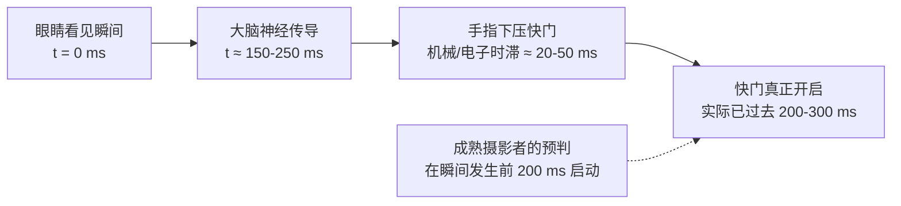

# 第 6 章 时机

> 决定性瞬间从来不是一句教条。它关乎时间流动与生命节奏之间的契合。一幅耐读的作品，往往并不单凭按下快门那一刻的运气，而取决于在那一刻到来之前，是否早已做好了充分的观察与准备。

---

## 摄影怎样切开时间

*Eadweard Muybridge, "The Horse in Motion", 1878。流传最广的说法是，铁路大亨 Leland Stanford 与人打赌：马奔跑时会不会有四蹄完全离地的一瞬间。赌局的细节其实从未被当时的证据坐实，更可靠的记载是，Stanford 出于养马和运动研究的兴趣，自 1872 年起出资委托 Muybridge 做这项实验。Muybridge 在 Palo Alto 的赛道边布下一排连环相机，每台快门由马经过时绊触的细线触发。这组照片给出了答案：马在某一帧里确实四蹄离地。摄影第一次把人眼看不到的瞬间变成了证据。时机作为一个摄影问题，从这里开始变得非常具体。[图片来源与复用说明](image-credits.md#muybridge-horse)*

---

## 决定性瞬间之后

1952 年，Henri Cartier-Bresson 出版了他的摄影集《匆匆掠影》（*Images à la Sauvette*），其英译本定名为 *The Decisive Moment*，中文通常译作“决定性瞬间”。

这个译名在流传中容易给人一种误解，仿佛摄影师只需要在原地安静等待，完美的瞬间就会自行掉入取景框中。

然而，Cartier-Bresson 自己的实践并不是守株待兔式的。在法语语境中，“à la sauvette”指的是一种机敏、迅速抓住机会的动态过程。Cartier-Bresson 是在一个动态发展的场景中，预先观察到可能出现的秩序，提前调整好机位与焦距；待那一刻出现的瞬间，果断按下快门。

他在画册卷首引用了雷兹红衣主教（Cardinal de Retz）的话：“世间万物之中，皆潜藏着一个决定性的瞬间。”

Cartier-Bresson 自己的阐述是：**在几分之一秒的时间里，同时辨识出一件事态的内在意义，并借助形式结构将这份意义清晰地传达出来。**

这句话包含两个前提：
1.  **意义与内容**：理解眼前正在发生什么，理解事件中的情绪与故事；
2.  **几何与形式**：线条、光影与人物身形在这一刻组合成平衡的视觉结构。

回看他在圣拉扎尔车站后方拍摄的名作，男子的跃起姿态、倒影以及背景海报上的舞者剪影形成了呼应。时机与构图共同构成了画面的完整性。

形式与时机通常需要同步考虑：在等待合适瞬间的同时，先搭好画面的空间框架，静候主体进入合适的位置。

时机的捕捉，考验的不仅是指尖的反应速度，更是面对一个场景时是否愿意耐心观察。

---

### 瞬间不是唯一答案

《决定性瞬间》确立了一种经典的抓拍范式，但它并不是摄影艺术唯一的路径。

在 Cartier-Bresson 之后，许多创作者用不同的方式拓展了摄影的边界。

Robert Frank 在 1955 年获得古根海姆资助后漫游美国，拍摄了大量胶卷，最终精选出八十三幅作品出版了《美国人》（*The Americans*）。书中的照片往往带着倾斜的地平线、松散的构图和粗糙的颗粒，并不刻意追求几何上的严丝合缝；但这组照片真实地呈现了战后美国的社会氛围与人们的日常状态。Frank 关注的不是瞬间的巧合，而是画面的情绪与社会现实。

Garry Winogrand 拍摄了海量的街头底片，他曾说：“我拍照，是为了看清事物被拍成照片之后究竟是什么模样。”这种工作方式打破了“单张精准预设”的教条，表明摄影也可以是对现实的持续探索与记录。

1967 年，MoMA 的《新纪实》（*New Documents*）展览展出了 Winogrand、Lee Friedlander 与 Diane Arbus 的作品，标志着一种更自由、更贴近日常的纪实语言获得了认可。

“决定性瞬间”是一种高超的观看方式，但并非唯一的评判标准。

有些佳作来自精确抓拍的瞬间；也有许多耐读的作品，其力量来自于真实的情绪、松散的氛围，或是不经意的日常神态。

在实际拍摄中，“瞬间”通常可以分为两类：

1.  **物理峰值瞬间**：跳跃的最高点、运动中的击球点、浪花翻涌的顶端。这类动作遵循物理规律，轨迹可预测，可以通过预判在最高点按下快门。
2.  **神情与姿态的瞬间（Gesture）**：行人的手势、交谈时的眼神、一抹转瞬即逝的微笑。这类神态不易通过公式推算，需要对人性的细致观察与耐心等待。

---

## 不同题材的时间尺度

不同的拍摄题材，面对着不同的时间节奏：

**1. 预判与守候**：主体在移动，拍摄者预先看好光影与构图，等待主体走入预设的画框。例如：行人走入建筑投下的光斑、飞鸟掠过合适的位置、水花溅起。操作要点在于：提前选好机位、锁定对焦与曝光，在主体进入画面时按下快门。

**2. 引导与构筑**：在肖像与静物拍摄中，通过情境营造来捕捉真实神态。例如：为拍摄对象安排舒适的环境，引导其谈论熟悉的话题，捕捉自然的微笑与眼神；在静物拍摄中，细致调整物体的摆放与光线角度。摆拍与抓拍皆是手段，关键在于画面是否自然真实。

**3. 连拍辅助**：对于极快速且不可预测的动作（如体育竞技、动物奔跑、孩童动态），借助高速连拍可以提高捕捉关键画面的几率。连拍的关键在于把握启动与停止的时机，而非无节制地长按快门。

**4. 慢速长曝与时间堆叠**：通过慢门将一段时间的运动轨迹记录在单张照片中。流水被雾化，人流变为流动的虚影，车流化作光轨，星空形成星轨。相机在这里记录的是时间流逝的过程。

---

## 预判与反应时间

人眼从看到画面、大脑发出指令到手指按下快门，通常存在 **150 至 250 毫秒** 的生理反应时间。加上相机的快门时滞，总延迟通常在 200 毫秒以上。

如果等完全看清动人瞬间才开始按下快门，往往已经错过了最佳时机。

真正的抓拍多依赖**预判**（Anticipation）：
*   观察行人的行走节奏与路线，在他距离光斑还有半步时按下快门；
*   观察谈话者的神情变化，在他情绪刚刚调动起来时按下快门；
*   观察运动员的起跳准备动作，在起跳瞬间完成击发。

预判建立在对被摄对象行动规律的熟悉之上。

---

## 快门速度与时间质感

快门速度决定了动态物体的呈现方式：

| 快门速度区间 | 视觉效果 | 典型应用场景 |
|---|---|---|
| 1/2000 秒及以上 | 彻底凝固极速动态 | 飞鸟振翅、赛车疾驰、水滴飞溅 |
| 1/500 – 1/1000 秒 | 冻结常规运动 | 奔跑的孩童、体育抓拍、快速动作 |
| 1/125 – 1/250 秒 | 抓拍日常行人 | 街头漫步、常规肖像、手持安全快门 |
| 1/30 – 1/60 秒 | 边缘轻微动感 | 室内弱光、慢速行走的人流虚影 |
| 1/4 – 1/15 秒 | 动静对比与摇拍 | 追随拍摄（Panning）、流动的人群 |
| 1 秒 – 数秒 | 水流雾化与光轨 | 瀑布水流、城市夜间车流 |
| 数十秒至数分钟 | 极致平滑与星轨 | 雾化海面、慢门风光、星轨堆叠 |

---

## 连拍的使用与节制

高速连拍是现代相机的实用功能，但合理使用更显效率：

1.  **短促点射**：每次按下 2 到 4 张的小连拍，既能覆盖关键瞬间的微小神态差异，又不会在后期产生海量的冗余文件。
2.  **单张优先**：在街头纪实与常规人文中，保持单张拍摄的习惯有助于训练自己的预判能力与对时机的敏锐度。

---

## 练习

找一个有明暗分界光影的街角，固定机位与曝光，预先构思好画面。等待行人走入光影中，练习通过预判在他踏入光斑的一瞬间按下快门。

在路边练习追随拍摄（Panning）：将快门设为 1/15 或 1/30 秒，双手握稳相机，身体随经过的自行车或汽车平稳转动，尝试拍出背景拉丝而主体清晰的照片。

在与朋友交谈时为对方拍摄肖像，不喊口令，在交谈与倾听的过程中寻找自然的眼神与表情进行捕捉。

---

下一章：[第 7 章 人像](07-portrait.md)
