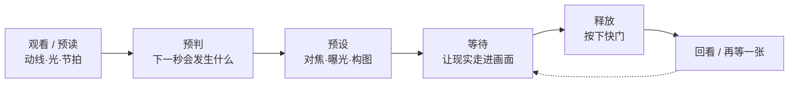
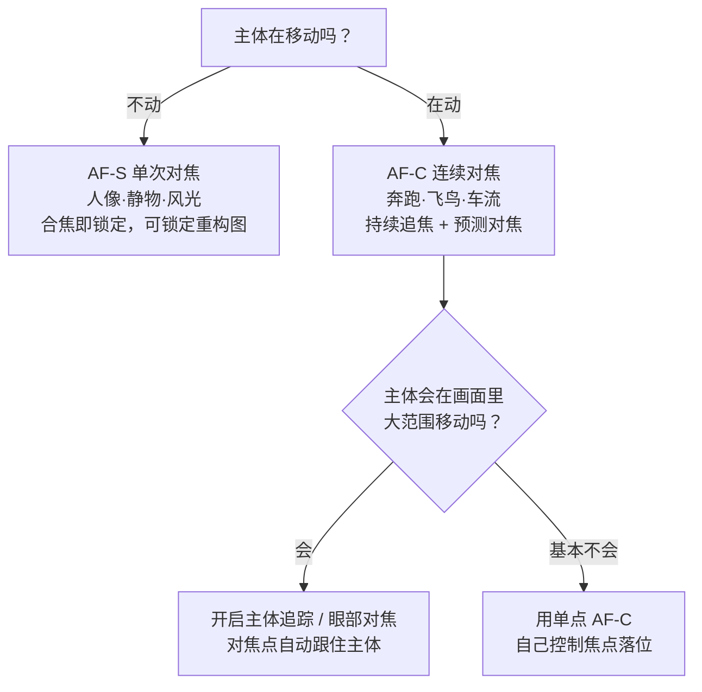

# 第 6 章 时机

> 决定性瞬间不是一句教条。它首先是时间和动作之间的关系。一张照片能不能成立，很多时候并不取决于那一秒本身，而取决于你有没有在那一秒到来之前就准备好。

---

*Eadweard Muybridge, "The Horse in Motion", 1878。流传最广的说法是，铁路大亨 Leland Stanford 与人打赌：马奔跑时会不会有四蹄完全离地的一瞬间。赌局的细节其实从未被当时的证据坐实，更可靠的记载是，Stanford 出于养马和运动研究的兴趣，自 1872 年起出资委托 Muybridge 做这项实验。Muybridge 在 Palo Alto 的赛道边布下一排连环相机，每台快门由马经过时绊触的细线触发。这组照片给出了答案：马在某一帧里确实四蹄离地。摄影第一次把人眼看不到的瞬间变成了证据。时机作为一个摄影问题，从这里开始变得非常具体。 (Library of Congress, 公有领域)*

---

Henri Cartier-Bresson 在 1952 年出版了《Images à la Sauvette》，英译本取名 *The Decisive Moment*，中文后来便常常译作“决定性瞬间”。这个译法流传很广，却也带着一点误导。它听上去像是一种安静的、甚至带着几分禅意的等待，仿佛摄影师只要在原地站定，那个完美的瞬间迟早会自己降临到镜头前，摄影因此成了一件守株待兔的事。可 Cartier-Bresson 本人的做法，恰恰不是这样。

问题多半出在翻译上。法语里的 “à la sauvette”，更接近于迅速抓住、趁着机会一把攫取的意思，那是一种带着动作的、近乎偷偷摸摸的敏捷，而不是端坐着守候。Cartier-Bresson 并不是在等一个完美瞬间凭空降临，而是在一个正在发展的局面里预先判断下一秒会发生什么，把相机提前准备停当，然后等那一秒真正到来的时候，稳稳地把它收下。

他在卷首引了红衣主教 de Retz 的一句话：任何事物里，都藏着一个决定性的瞬间。Cartier-Bresson 自己给出的定义则更完整，值得原原本本地记住：在几分之一秒之内，同时认出一件事的意义，并认出足以恰当表达这份意义的那套形式的精确组织。这句话是两个并列的条件，缺一不可——前半句说的是内容，你得看出眼前正在发生什么、它意味着什么；后半句说的是几何，画面里的线条、形状、人物的位置，恰好在这一刻扣合成一个成立的构图。

这段话常常只被记住一半。人们谈“决定性瞬间”，多半只谈时间那一半：反应要快，按得要准。可圣拉扎尔车站那张照片的妙处，一半在男人腾空的那一秒，另一半在他的跳姿与背后海报上舞者的剪影互为镜像，在水面把整个画面对称地倒映了一遍——时机对了、几何没对，照片照样不成立。所以练时机的人，迟早要把另一半也练上：在等那一秒到来的同时，先把画面的形式安排妥当，让那一秒落进一个已经站得住的框子里。

这段话另一处真正的重点，落在“发展中的局面”这几个字上。意识并不是在某一刻突然变敏锐的，它是在持续不断的观看里，一点一点被调动、被磨利。时机考验的并不只是你的反应够不够快，更考验你愿不愿意在一个场景面前停留下来，一直看，直到看出这件事接下来可能朝哪个方向发展。好的时机往往属于那些肯多站一会儿的人，而不是路过时随手一按的人。

---

《决定性瞬间》这个名号一经传开，几乎立刻就成了后来者绕不过去的一道题。它太有概括力，以至于很容易被当成摄影唯一的正解，仿佛每一张好照片都必须是某种几何关系恰好咬合的零点几秒。可就在 Cartier-Bresson 之后不过十来年，另一批摄影师开始对这个说法提出异议，他们的方式不是写文章反驳，而是直接用照片给出另一种答案。

Robert Frank 是其中最先动手的一个。这位从瑞士移居美国的摄影师，1955 年拿到一笔古根海姆奖金，此后一年多里开着一辆二手车走遍美国，拍下数百卷胶卷、两万多张底片，最后狠心只挑出八十三张，编成《美国人》（The Americans）。这本书先在巴黎以《Les Américains》之名出版（1958 年）；第二年在美国印行时，卷首配上了 Jack Kerouac 专门写的一篇序。通篇是些构图松散、颗粒粗重、地平线歪斜的画面，几乎没有一张符合“决定性瞬间”所暗示的那种精确，可它们合在一起，却道出了一个更复杂也更沉郁的美国。Frank 要的显然不是几何上的完美咬合，而是一种情绪和社会层面的真实，哪怕为此牺牲掉画面的工整也在所不惜。

紧随其后的 Garry Winogrand 走得更远。他一生按下的快门数量惊人，1984 年去世时，光是根本没来得及冲洗的胶卷就有约两千五百卷，再加上那些冲了却从未细看的底片，合起来是几十万张几乎无人过目的画面。他有一句常被引用的话，大意是他之所以拍照，是想看看事物被拍成照片以后会是什么样子。这种态度本身就动摇了“决定性瞬间”的前提：如果连拍摄者自己都要等照片冲出来才知道好坏，那么所谓在现场精确捕捉的那一秒，就不再是唯一的标准了。1967 年，纽约现代艺术博物馆的策展人 John Szarkowski 把 Winogrand、Lee Friedlander 和 Diane Arbus 三人的作品并置在一个叫《新纪实》（New Documents）的展览里，等于正式为这种更松散、更暧昧、更贴近日常的拍法正了名。

经过这一番修正，“决定性瞬间”便从一条唯一的教条，退回到它本来的位置：它是一种极其有效的观看方式，却不是唯一的一种。有的照片确实成立在某个精确咬合的瞬间上，也有的照片，力量恰恰来自它的不完美，来自那一点歪斜、那一点模糊、那一点欲言又止的暧昧。你越早明白这两条路都走得通，就越不会为了追一个几何上的完美，而白白放走那些同样有力、只是不那么工整的画面。

在这个基础上，还需要把“瞬间”本身再拆细一层，因为它其实包含着两种很不一样的东西。一种是峰值动作的瞬间，另一种是姿态与表情的瞬间，英文里常把后者称作 gesture。这两者都可能是一张照片真正的决定点，可它们所要求的判断并不相同。

峰值动作，指的是一个物理动作走到顶点的那一刻：跳高运动员腾到最高、身体即将回落之前的那一段悬停，网球正贴上球拍的接触点，海浪炸开却还没散落的顶端。它的好处在于有迹可循，动作的轨迹大体由物理决定，你只要看熟了，就能相当准确地预判峰值会落在哪一刻。尤其是抛体运动的顶点这一类，物体升到最高处时垂直速度短暂地降到零，那里便天然有一小段近乎悬停的时间，比上升或下落途中要从容得多——篮球运动员扣篮前的滞空、跳水者翻腾到最高点的那一刹，看上去像是被凭空定住，正是这个缘故，它也顺带给你多留出几十毫秒去按下快门。相比之下，球拍击球那种接触点几乎没有停顿，转瞬即逝，就更得靠预判提前量和连拍去兜住。体育摄影里大量令人过目不忘的画面，拍下的正是这一类峰值。

姿态与表情的瞬间则要微妙得多。它可能只是一只手抬到半空的位置，一个眼神刚好投向画外，一丝笑意正浮上来、还没来得及被自我意识收回去。这一类瞬间没有物理轨迹可供推算，它转瞬即逝，也更难预判，可一旦抓住，往往比任何峰值动作都更接近一个人真实的内在。Cartier-Bresson 真正的过人之处，其实多半在这里：他拍的常常不是最用力的那一下，而是姿态与神情恰好对齐的那一刻。峰值考验的是你对物理的熟悉，而 gesture 考验的，是你对人的理解。

---

不同题材处理时间的方式并不相同。街头、人像、体育、风光都讲时机，可它们面对的其实不是同一种时间。有的时间需要你去等，有的时间由你亲手安排，有的时间快到只能交给连拍，还有的时间索性被拉长、被叠在同一张画面上。把它们分开来看，时机这件事就不再是一句笼统的口号，而变成几种可以分别练习的具体功夫。

第一种，是等来的时机。主体正在变化，你预先判断它会走向某个状态，于是站定，等它一步步到达那个状态。一个人正穿过画面，眼看就要踩上地面那块从百叶窗漏下来的光斑；一只鸟沿着自己的飞行弧线，就快抵达画面右上角那个位置；一个孩子被路边的东西吸引，笑容刚浮起来，还没被自我意识收回去；海浪打到岩石上，水花刚炸开，还没散。这一类时机的共同点，是它要求你先把位置站好，提前完成对焦，把曝光也锁定下来，剩下的只有一件事，就是等。真正的功夫下在那一秒到来之前，而不是那一秒本身。

Cartier-Bresson 在圣拉扎尔车站后面拍下的那个跳过水洼的男人，正是这种等来的时机。车站后面有施工木板围挡，他把镜头从板缝里伸进去看，缝不够宽，画面左缘因此被木板挡住了一块；跳水洼那一下，是他守在缝前窥看时恰好发生的。照片冲出来以后看起来像是天赐的巧合，可这份巧合的背后，是焦距和曝光已经预备好，是人已经守在能接住水洼的位置上。那一下来了，才接得住。

第二种，是你亲手制造的时机。拍人像时，是你让对方把视线投向某处，让他把手放下来，或者让他把刚才那个动作重新做一遍；拍静物时，是你决定杯子搁在哪里，光从哪一边打进来，阴影最终落到桌面的什么位置。制造时机最实用的一种中间形态，是先安排情境、再抓真实反应：你把两个许久不见的朋友引到同一张桌边，或者请对方讲讲最得意的一件事，情境是你搭的，可随后浮上来的笑意和手势是真的，你抓的仍是抓拍——人像摄影师的大半功夫其实都在这里。而在摄影史的另一端，Jeff Wall、Gregory Crewdson 这些人干脆把制造推到极致，像拍电影一样搭景、布光、调度演员，整个画面从头到尾都是编排出来的，照样成为严肃的艺术。所以摆拍和抓拍在这里只是工具上的分别，并没有谁天然更高级。归根结底，重要的从来不是画面是摆出来的还是抓出来的，而是它成不成立，其中的状态可不可信。

第三种，是靠连拍托住的时机。有些动作实在太快，而且难以预料。体育比赛最后十米冲刺时脸上的表情，动物扑向猎物的那一下，婚礼上一位亲戚忽然笑出眼泪，孩子从一片阳光里朝你跑过来，这些瞬间都很难指望单次快门每回都恰好卡在最好的那一帧上。专业的体育和婚礼摄影师普遍依赖连拍，原因很实在：没有谁的反应神经能够次次都稳稳落在那决定性的零点几秒上。不过要注意，判断的高下并不在于你按了多少张，而在于你什么时候开始按，又在什么时候停手。

还有第四种时机，它不是某一个瞬间，而是一段时间的累积。海面被慢门拖成一片柔滑的丝，地铁站里的人流化成半透明的影子，星轨在夜空里绕着北极星缓缓画出一道弧，高速公路被往来的车灯拉成红白两条长长的光流。这个时候，你记录下来的不再是某一个被利落切下来的瞬间，而是一整段时间如何层层堆叠、最终落在同一张照片里。与前面几种争分夺秒的时机相比，它要的恰恰是耐心地让时间自己流过镜头。

---

很多人是等不下去的。在一个画面前站上五秒钟，眼看没有任何变化，心里就开始打退堂鼓，觉得算了吧。可这未必只是没有耐心那么简单，更多的时候，真正的原因是他还不知道自己究竟在等什么。等待之所以难熬，是因为它缺了一个明确的目标；人一旦不知道自己在等什么，几秒钟都会显得漫长。

反过来，一个人能在同一个机位上守很久，表面看去是耐心过人，实际上更关键的是他心里有判断。他清楚自己在等的是什么，也清楚那件事一旦出现，画面会比此刻好在哪里、好多少。正因为有这份判断在支撑，等待对他而言就不是煎熬，而是一件有把握、有指望的事。

所以在决定停下来守下去之前，不妨先在心里问自己几个问题：主体还在变化吗？它下一个可能出现的状态是什么样？大概多久会到？发生的可能性到底高不高？真要发生了，照片会比现在好上多少？把这几个问题都想过一遍，等待才算有了意义。这样一来，你既可以清醒地决定要不要等下去，也可以顺手给自己设一个时间上限。等待于是不再是漫无边际的空耗，而变成一个界限分明的拍摄选择。

最短的一种等待，通常在半分钟以内，街头摄影里最常遇到。一个画面往往已经八九分成型，只差一个人从旁经过，只差一辆车驶进那个位置，或者只差一个表情在某张脸上浮现出来。这种时候，你可以一直把相机举在眼前，也可以把它挂在胸前，手指搭在快门上，眼睛盯住那个画面，同时在心里预想接下来可能出现的几种变化，好在它一发生就立刻按下。

中等长度的等待，可能持续一分钟到半小时，多见于风光和城市题材。你等的也许是光线一点点移过来，是云层慢慢散开，是眼前这拨人潮过去，也可能是街灯在暮色里次第亮起。这类等待适合把三脚架先架稳，构图和曝光都提前锁定下来；在等的这段时间里，你可以不时小幅地检查一下画面边缘，看看有没有新的干扰悄悄挤进来。

最长的一种等待会超过半小时，常见于风光、野生动物和某些特殊事件。这种等待非有计划不可，绝不能只是茫然站着碰运气。你得清楚自己等的究竟是什么样的条件，也得预先给自己定一个结束的时间。真到了那个时间还没等到，就利落地收起相机离开；这次空手而归，也好过在原地把精力和判断力一点点耗散掉。下一回再来，往往比硬守在这里更划算。

何况就算最后什么也没等到，这段时间也不算白费。你在一个场景前认真看了一个小时，就比那些径直路过的人多知道了一层：光是怎样一点点移动的，人流大约在什么时候变稀，哪些你原本以为会发生的变化其实根本不会发生。这些都会沉淀成经验。于是下一次再站到类似的场景面前时，你的预判就会比这一次更准。

---

到这里，“预判”这个词已经出现过好几次，是时候把它单独拿出来讲清楚了。好的时机几乎都建立在预测之上：你不是在拍已经发生的事，而是在拍即将发生的事。而预测这项本事，说穿了并没有什么诀窍，它只来自两件最朴素的功夫，一是看得久，二是拍得多。这一点其实和第 1 章讲过的观看是同一件事，只不过在这里，它要落到几个非常具体的对象上。

第一个要预读的，是人的动线。一个人走进街角，多半不会凭空拐弯，而是沿着一条大体可以推断的路线前进。你若肯多看几秒，就能看出他接下来会踏上哪一块地砖、会在哪一点和另一个行人交错、又会在什么位置正好走进那束光里。看得多了，这种对动线的判断会越来越快，快到几乎不假思索。

第二个要预读的，是光的变化。云层正往太阳那边移，你大致能算出再过多久，地面那片阴影会退开、光会重新铺到主体身上。傍晚的光每一分钟都在变暖、变低，街灯则会在某个临界点忽然一齐亮起。光不像人那样会突然改变主意，它的变化是连续而有方向的，因此格外适合预判。你要做的，只是比它早一步站好位置。

第三个要预读的，是事件的节拍。很多场合本身就带着节奏：地铁大约每隔几分钟到一班，喷泉隔一段时间喷涌一次，街头卖艺的表演有固定的段落，婚礼的仪式一步接着一步地推进。一旦你听出了这套节拍，便能预知高潮会落在哪一拍上，从而提前把相机架好，只等那一下到来。拿婚礼上交换戒指这一幕，把整套动作完整走一遍。仪式的流程表上，它排在誓词之后，所以誓词开始时你就该动身了：绕到能同时看见两人手部和新娘面部的那一侧，通常是主持人斜后方四十五度，把光圈开到 f/2.8 一带、快门定在 1/250 秒以上，对焦模式切到连续、锁在新娘脸上。誓词念完、伴郎伸手进口袋去摸戒指盒，这就是留给你的最后一个提示——把相机举起来。真正的画面有两层：戒指套上手指的那一秒是动作的顶点，而更珍贵的常常是紧随其后的半秒，两个人抬起头相视而笑的那一下。短促地连按一小段，把这两层都收进来。整个过程里没有一步靠运气：流程表告诉你它何时到来，节拍告诉你何时举起相机，预设则让你举起来就能拍。

把这三样合起来，其实就是一种视觉化。这个说法来自 Ansel Adams 的 visualization，指的是在按下快门之前，先在脑海里把最终照片的明暗层次完整地想象出来。放到时机上，道理是一样的：你先在心里把那张还没发生的照片看清楚，包括主体会落在哪里、光会是什么样子、姿态又是什么样子，然后让现实一点点走进这个预先想好的框子里。等到现实真的和脑中的画面对上了，你要做的就只剩按下快门这一个动作。

这一整套过程，可以粗略地画成一条链：

链的末端特意绕回到“等待”，是想提醒你：按下第一张往往不是结束。前面讲过的第二张比第一张更好、耐心等下一个组合，说的都是同一件事，也就是让这条链多转一两圈，而不是按完就走。

---

抓拍并不等于单纯地把快门按得快。它其实是一条连续的反应链：先是看见，然后预判，接着身体跟上、把相机举到位，最后才轮到手指按下去。快门只是这条链的最后一环，真正决定一张照片成还是败的，往往是前面那几步。

用眼角的余光扫到一个正在发展的场景，是这条链的第一步。随后你转过头去看清楚，意识到它值得一拍，于是举起相机，取景、构图、对焦，再确认一下曝光，最后才按下快门。有经验的摄影师能把这一整条链压得非常短，几乎在一瞬间走完。新手之所以慢，多半并不是手指本身慢，而是相机还不够熟，参数事先没有预设好，往往要等看到画面之后，才开始临场去想自己到底该怎么拍。等他想明白，那个瞬间早就过去了。

走上街头、在举起相机之前，参数就应该已经落在一个合理的范围里了。白天可以用 A 模式，或者用 M 模式再加上 Auto ISO，光圈定在 f/5.6 到 f/8 之间，快门至少保持 1/500 秒，ISO 的自动上限放到 6400。对焦不妨用单次 AF、中心点，配合后键对焦，测光用评价测光，焦段则选一支 35mm 定焦。这一套设置当然不可能适合所有情况，但它是一个足够可靠的起点，好处在于让你举起相机的那一刻不必再从零开始调，能把全部注意力都留给画面里的人物、边界，以及即将到来的下一秒。

预设的意义正在这里。它让那些操作尽可能退回到身体里，变成近乎本能的动作，从而把注意力重新交还给画面本身，而不是在最关键的那一刻，反倒被菜单和参数拖回到相机内部去。参数越早想清楚，现场就越不必分心。

后键对焦同样能帮上抓拍的忙。在相机的默认设置里，半按快门这一个动作要同时负责对焦和测光，按到底才是拍摄。后键对焦做的事，是把对焦这项任务单独挪到机身背面的 AF-ON 键或者星号键上，让快门只管拍摄这一件事。这样一来，你可以先把焦对好，再从容地微调构图，而不必担心因为重新半按快门，焦点又被相机重新找了一遍。想在同一个焦点上连拍好几张，也不用每一张都重新合焦。遇到移动的主体更方便：按住 AF-ON 就是连续对焦，按下快门就是拍摄，两件事各归各的按键，互不打扰。

还有一套更老派的办法，叫区域对焦。它索性把自动对焦整个关掉，改为依靠景深，让镜头前的一段距离同时保持清楚。举例来说，把一支 35mm 镜头收到 f/8，再手动把焦点固定在两米半上下，那么从大约一米七到五米左右，画面都能落在可以接受的清晰范围之内。要注意，这段清晰的范围远端并不到无穷远：想让远处也一并清楚，就得把焦点再往后推，推到后面要细讲的超焦距上——35mm、f/8 的超焦距约在五米，对到那里，从两米半到无穷远才全都清楚。把焦点预设在哪一段，取决于你打算在什么距离上接住人；街头常用两米到三米，正是把清晰段对准了擦身而过的行人。如此一来，只要有人走进这一段距离，你就不必再等相机慢慢合焦，抬手即可拍。它的代价是画面不会每一处都锐到极致，可街头摄影真正要的本就是那个瞬间，而不是发丝级别的锐度，这点损失完全值得。

---

前面反复提到“对焦要提前设好”，可对焦本身其实分成好几种模式，选错了模式，再快的手也接不住一个移动的主体。所以在讲连拍和快门之前，有必要先把对焦这件事讲透。现代相机的自动对焦，最基本的分野是两种：单次自动对焦和连续自动对焦。

单次自动对焦（AF-S，Single-servo AF，佳能称作 One-Shot AF）的逻辑是“对一次就锁住”。你半按快门，镜头合上焦，随后焦点便固定在那里不再变动，直到你松开重来。它适合静止的主体：一个坐着的人，一处风景，一件静物。它还有一个顺手的用法，叫锁定重构图，也就是先用中心点对准主体合焦，锁住之后再平移相机重新构图；因为焦点已经固定，平移并不会让它跑掉。

连续自动对焦（AF-C，Continuous-servo AF，佳能称作 AI Servo）则是另一套逻辑：只要你按住不放，它就一刻不停地重新合焦，紧追着主体的距离变化。更要紧的是，它多半带着一套预测对焦（predictive AF）的算法，会根据主体前几帧的移动，推算出在快门真正开启的那一瞬间，主体会走到哪里，从而把焦点提前送到那个位置上。这一步之所以关键，是因为从你按下快门到传感器真正曝光，中间总有一小段延迟，主体在这段时间里仍在移动；没有预测，焦点就会永远慢主体半拍。凡是奔跑、骑行、飞行、扑跳这一类主体，都该交给 AF-C。

在这两种模式之上，现代相机又叠了一层主体追踪。早先的追踪，是让选定的那个对焦点自己在画面里跟着主体跑，你把主体框住，它便一路跟住不放，即便主体从画面这一头移到那一头也不脱开。这几年更进一步，机身里装上了基于深度学习的主体识别，能自己认出画面里的人、动物、飞鸟、车辆乃至飞机，锁定之后持续追着。它把你从“手动挪动对焦点”这件费神的事里解放了出来，让你能把注意力还给时机本身。

其中对拍人最有用的，是眼部对焦（Eye AF，眼睛识别对焦）。相机会在识别出的人脸上进一步找到眼睛，把焦点牢牢锁在眼球上，哪怕对方转头、走动，焦点也一直跟着眼睛走。人像和抓拍最怕的，就是在最关键的那一刻还在手忙脚乱地安放对焦点，而眼部对焦几乎替你把这一步取消了，你只需要管构图和表情，对焦交给机器盯着。

回过头看前面讲的后键对焦，它和这两种模式配合起来会更顺手。把机身设成 AF-C，再把对焦挪到 AF-ON 键上，于是你的拇指就成了对焦模式的开关：按住 AF-ON，相机连续追焦，等同于 AF-C；一松手，焦点就停在原地不再变动，又等同于 AF-S。同一套设置，靠拇指一按一松，便能在追焦和锁焦之间自由切换，不必再钻进菜单去改模式。

到底该用哪一种，可以简单地按主体动还是不动来分：

---

即便对焦模式选对了，从你决定按下、到传感器真正记录下光线，中间还隔着一段无法回避的延迟。这段延迟叫做快门时滞（shutter lag），它常常是新手百思不得其解的地方：明明在最好的一刻按了快门，拍出来却总是差了那么一点点。

快门时滞其实由两截拼成。头一截是对焦所花的时间，相机要先合上焦才肯开快门；后一截叫做释放时滞（release time lag），指的是焦点已经合好、纯粹从按到底到快门开启之间那段机械或电子上的延迟。前一截可长可短，遇到暗处或低反差，相机来回反复地寻找焦点，可能拖上好几百毫秒；后一截则要稳定得多，如今的中高端机身大多能压到几十毫秒，专业机身还要更短。

不过在机器这两截之前，还压着一截更长的延迟，出在你自己身上：人的反应时间。从眼睛看见峰值，到神经把指令传到手指、手指真正压下快门，一个反应正常的人也要一百五十到两百五十毫秒。把这三截叠起来看，比例其实很悬殊——相机的释放时滞几十毫秒，你自己的反应却要两百毫秒上下，慢的从来是人，不是机器。这也解释了为什么反应时间练不出质变：那两百毫秒是生理的地板，怎么练也压不掉多少。真正能绕过它的只有一条路，就是预判：不等看见峰值才动手，而是提前判断它何时到来，让手指在它到来之前就已经在往下压。

明白了这个道理，抓拍时就该有意地提前一点点按。你若严格等到看见峰值那一刻才按，等身体和相机走完这整段时滞，峰值早已过去。老练的做法是把时滞算进去，在峰值到来之前的一瞬先按下，让快门开启的时刻正好落在动作的顶点上。这一点点提前量，靠的正是前面讲的预判。

要把时滞压到最短，最直接的办法是预对焦（pre-focus）。趁主体还没到位，先半按快门，或者用后键把焦对好锁住，于是那长长的一截对焦时间被提前消化掉了，真到按下的时候，只剩下短短的释放时滞。凡是你已经知道主体将要经过哪里的场合，都可以这样先把焦对好。

把预对焦推到极致，就是陷阱对焦（trap focus，也叫焦点陷阱）。你预先把焦点固定在某个位置上，比如一根鸟很可能落上去的树枝、滑板少年即将掠过的栏杆、赛跑选手将要冲过的终点线，然后守在那里，等主体一进入这个预设的焦平面就按下。有些机身甚至可以设成：一旦主体在这个位置合焦，快门便自动释放。它的妙处在于，把“对焦”和“构图”这两件费时的事全部提前做完，现场要判断的就只剩“什么时候按”这一件。

顺着这个思路再往前走一步，就回到了前面提过的区域对焦和超焦距。它们本质上都是预对焦，只不过预设的不是一个点，而是一整段清晰的距离。超焦距（hyperfocal distance）常用下面这个近似式估算：

\[ H \approx \frac{f^{2}}{N \cdot c} \]

其中 \(f\) 是焦距，\(N\) 是光圈 f 值，\(c\) 是弥散圆（circle of confusion，指画面上仍被眼睛接受为“一个点”的最大模糊斑）。全画幅的弥散圆通常取 0.03mm 上下。把一支 35mm 镜头收到 f/8 代进去，算出来的超焦距大约是 5 米：只要把焦对在 5 米处，从大约 2.5 米一直到无穷远，画面就都落在可接受的清晰范围之内。街头摄影里，不少人会把焦对得比这更近一些，好让身边一两米的人也清楚，代价是远处那道清晰的边界从无穷远收了回来。无论怎么取舍，道理是一致的：焦提前锁死，等的就只剩那一下快门。

---

什么时候该用单帧，什么时候该切到连拍，这两者需要分清楚。它们并不是谁比谁先进，而是各自对应着不同的拍摄处境。

街头、人像、风光、建筑，这些题材在大多数时候都可以用单帧来拍。单帧有一个不易察觉的好处，它会不断训练你的判断，因为每按一张，你都必须主动地做一次决定，而不是把选择推迟到事后。它同时也替你省下大量选片的时间，让你回家以后不必对着一大堆几乎一模一样的照片发愁。老一代的街头摄影师几乎清一色用单帧，这固然是因为当年的机器还没有今天这样的连拍能力，可正是这个限制反过来逼着他们在按下快门之前，先把画面想清楚。那个年代的约束是有实感的：一卷胶卷三十六张，上街一天带三五卷，每按一下都是看得见的成本，拍完还得等冲洗，按错了连当场后悔的机会都没有。正是这份斤斤计较，把“先想清楚再按”刻进了那一代人的手上。约束本身成了一种训练。

到了体育、野生动物、小孩、宠物、婚礼仪式，以及那些跳跃、奔跑、忽然回头的人物面前，就可以放心打开连拍了。这种时候要相应地把对焦切成连续对焦，快门速度至少从 1/500 秒起步，ISO 的上限也放得高一些，同时还得留意存储卡的写入速度能不能跟得上这一连串的拍摄。

连拍的代价其实很明确，那就是回家选片会变成一件苦差事。一组五十张几乎相同的照片一字排开摆在你面前，你得快速地逐一比较，判断究竟哪一张的姿态、眼神、手势和边缘最恰到好处。除此之外，连拍还容易制造一种错觉，让人误以为自己拍到了很多，可事实上，真正有效的判断往往只发生在其中短短几秒里。用连拍时最稳妥的做法，是在预判关键动作即将到来的那一刻，短促地按下一小段，而不是从头到尾一直把快门摁住不放。

---

前面说过，用连拍时最稳妥的是短促地按一小段，而不是从头到尾摁着不放。这个建议背后，其实牵涉到相机连拍的几个硬限制，把它们厘清，就明白为什么“一路连拍不停”并不等于稳稳抓住了时机。

第一个数字是帧率，也就是每秒能拍几张（fps，frames per second，每秒帧数）。入门机身大约每秒三到六张，进阶机身能到十张上下，专业机身用机械快门可以到每秒十二到十六张，换上电子快门更能冲到二三十张，某些机型在降低画质的前提下甚至能到上百张。帧率听上去越高越好，可它真正的意义要换一个角度看：帧与帧之间，其实存在一段拍不到的空隙。

| 连拍速度 | 相邻两帧之间的间隔 |
|---|---|
| 5 fps | 200 ms |
| 10 fps | 100 ms |
| 20 fps | 50 ms |
| 30 fps | 33 ms |

这张表说的是同一件事：哪怕每秒十张，两帧之间也隔着一百毫秒，而很多峰值动作的顶点比这还要短。那决定性的一刻完全可能正好掉进两帧之间的空隙里，被你整组照片一致地错过。帧率越高，这道空隙越窄，被漏掉的概率越小，可它终究只是把空隙收窄，并没有把它填平。抓时机这件事，说到底还是得看你什么时候开始按，而不能指望帧率来替你补救。

第二个限制来自缓冲区（buffer，也叫缓存）。相机拍下的照片，会先堆进机身里一块高速的缓存，再慢慢写进存储卡。缓存的容量有限，连拍一旦超过它能容下的张数，速度就会陡然掉下来，掉到存储卡的写入速度那么慢。这意味着，你若从头就一路连拍不停，很可能在真正的高潮到来之前，缓存已经被前面那些无用的画面填满，相机正忙着往卡里写，偏偏在最该连拍的一刻卡住。用一张更快的卡，UHS-II 的 SD 或者 CFexpress，能把这道墙往后推一些，却推不掉。

第三个限制，是取景器的黑视（blackout，取景器黑屏）。用单反时，反光镜每拍一张都要翻起又落下，机械快门每拍一张也要开合一次，于是在连拍的过程里，取景器会一下一下地发黑，你对快速主体的追踪就被这一连串的黑屏切得断断续续。无反相机配上够快的电子快门，可以做到几乎不黑屏，索尼的 A9 当年就以“无黑视取景”著称，让你在整段连拍里都能连续地看着主体。这一点，正好接上后面要讲的电子快门。

所以，盲目连拍之所以不可靠，坏在两处：帧与帧之间的空隙让它并不保证拍到那一帧，而缓存见底和取景器黑屏，又会在最要紧的时候拖你的后腿。真正管用的，依旧是那句话：在预判到关键动作即将发生的那一刻，才短促地按下一小段。

不过，机器最近几年给出了第三种答案，值得单独记一笔：预拍摄（pre-capture，各家叫法不一，奥之心叫 Pro Capture，尼康叫预释放拍摄）。它的做法听上去近乎作弊：半按快门时，相机就已经开始用电子快门连续拍摄，把最近几十帧滚动地存在缓存里，旧的不断丢弃；等你真正按到底，它不但从这一刻起往后拍，还把按下之前缓存里的那零点几秒到一秒一并写进卡里。也就是说，你看见鸟起飞才按快门，起飞前后的画面都在——你的两百毫秒反应延迟，被机器整个吞了回去，时滞在效果上成了负数。对拍鸟、拍体育、拍孩子那种永远快你半拍的题材，这个功能几乎是量身定做。当然它也有代价：只能用电子快门（果冻效应的账要照算，下一节就讲），半按期间机器持续高速拍摄也更耗电。但要紧的是想明白它改写了什么、没改写什么：它把“按晚了”这件事从后果里划掉了，可什么时候该半按、镜头该对着哪里、画面成不成立，这些判断一样也没有替你做。那么预判从此就无用了吗？并没有——它只是从“何时按下快门”退后了一步，变成了“何时举起相机”。

---

连拍解决的是“哪一帧”的问题，却并不保证每一帧都清楚。真正决定一个动作在画面里是被凝固还是被拖糊的，其实是快门速度本身。快门越快，被摄对象在曝光那一小段时间里移动的距离就越短，记录下来的影像也就越接近静止；快门一旦放慢，哪怕只慢一点，快速移动的主体也会在画面里留下一道拖影。在按下快门之前先对自己要凝固的动作有个大致的判断，往往比事后从一连串照片里逐一挑选来得主动。

这里可以给出一组大致的参考。它算不上精确的门槛，更像是一个起步的量级，帮你在举起相机之前，先把快门定在一个不至于糊掉的范围里。

| 被摄对象 | 大致可凝固的快门 |
|---|---|
| 静止人像(手持) | 1/125 s 起 |
| 行走的人 | 1/250 s |
| 奔跑、跳跃 | 1/500 s |
| 骑行、跑动的孩子 | 1/500 - 1/1000 s |
| 行驶中的汽车 | 1/1000 s |
| 飞鸟、体育比赛 | 1/1000 - 1/2000 s |
| 追随拍摄(主体清、背景拉成线) | 1/30 - 1/60 s，配合镜头跟随 |

需要说明的是，表里这些数字都只是大致的起点，具体还要看主体移动得有多快，以及它在画面里朝哪个方向移动。同样一个速度，横穿画面的主体会比迎面而来的主体更容易拖糊，因为前者在画面里划过的距离更长，同样的时间里走过了更大的一段位移。所以真遇到把握不准的场景，与其事后懊恼整组都差了那一点清晰，不如当场就把快门再往快里定一些。

上面这张表针对的是主体自身的运动，也就是主体动得太快、在曝光期间把自己糊掉的那一种模糊。可画面糊掉还有另一个来源，它和主体动不动并没有关系，那就是手持相机时，手本身那点难以完全消除的抖动。这两种模糊常常被混为一谈，其实应该分开来看。

手持不糊的经验下限，大约是 \( 1/\text{等效焦距} \)：50mm 镜头约 1/50 s，200mm 约 1/200 s。焦距越长，轻微的抖动在画面里被放得越大，也就越要靠提高快门来把它压住。带防抖的镜头或者机身，可以在这个基础上再往下放慢：如今机身镜头协同防抖的厂标动辄五到八档，实拍稳妥地按三到四档去估。

不过要留意，这条规则给出的只是“不糊的下限”，它管的是相机的抖动，而不是主体的运动。真要凝固主体的动作，还得回到上面那张表，按主体的速度来定快门，然后在这两个数值之间，取更快的那一个。安全快门保证的是你自己不抖，凝固动态保证的是主体不糊；只有当快门同时越过这两道门槛，画面才算真正稳稳地清楚下来。

把快门一路往快里推，为的是把动作牢牢钉在某一帧上。可时间在摄影里并不总是需要被凝固，有些时候恰恰相反，让它在画面里流淌、被拉长，本身就是另一种表达。

---

慢门做的事，是把时间本身变成画面的一部分。快门一旦放慢，相机记录下来的就不再是某一个凝固的瞬间，而是一段被摊开、被拉长的时间。

不同的快门速度，会把时间拉成不同的样子。1/15 秒到 1/4 秒之间，走路的人会带上一层轻微的模糊，但你仍然认得出他是谁。1/2 秒到 2 秒，水流和人影就会明显地拖开、化虚。5 秒到 30 秒，足以拍下夜景里的车流和天上流动的云。而到了一分钟以上，星轨、极缓的海面和长时间移动的云，都会一层层叠进同一张画面里。你选定的秒数，其实决定了画面里的时间被稀释到什么程度。

要拍慢门，通常离不开三脚架，再配上快门线或者延时快门，用来避免手一碰相机带来的抖动；到了白天，还得给镜头加上 ND 滤镜来压掉多余的光。常见的减光量是这样：ND8 减三档，ND64 减六档，ND1000 则能减十档。这笔账可以当场心算：晴天 f/11、ISO 100 的基准快门大约是 1/125 秒，想把它拉到 30 秒，从 1/125 到 30 秒差着约十二档，挂上一片 ND1000 补掉十档，剩下两档把光圈从 f/11 收到 f/22，正好凑齐。若嫌 f/22 衍射太重，就再叠一片 ND8，用六档加三档的组合换回光圈的余地。顺带提醒一句可变 ND 的隐患：它靠两片偏振镜对转来调节减光量，拧到接近最深的那一头时，广角画面上常会浮出一道深色的 X 形叉痕，那是两片偏振片夹角的几何必然。用可变 ND 别拧到头，是用惯它的人都记着的一条规矩。

在整条慢门的区间里，最耐人寻味的往往是 1/15 秒到 1/2 秒这一小段。这个速度恰好能让主体的细微动作产生模糊，却又不至于把主体彻底抹掉，你依旧辨认得出它是什么。放到街头摄影里，用 1/30 秒或者 1/15 秒手持拍摄，行人的腿脚和衣角会化成一团流动的影子，而脸和背景仍旧留在那里。于是画面既染上了一层时间感，又没有完全滑向抽象，虚与实之间保持着一种微妙的平衡。

Daido Moriyama 的许多照片，正带着这种手持慢门特有的晃动。在他 1972 年的《再见摄影》里，浴缸里的女人、电线杆、街边醉倒的人，看上去都像是被一双匆忙掠过的眼睛在某一瞬间随手留下来的。他要的从来不是稳定，恰恰相反，他选择接受身体和整座城市一起摇晃，把那份晃动本身也当作照片的内容留了下来。

慢门还有一种反着用的办法，让主体相对清楚，反倒把背景拖成一道道线，这就是所谓的追拍。具体做法是把快门压到 1/30 秒上下，让相机跟着移动的主体一起匀速横摇，在摇动的过程中按下快门，而且按完之后手不要停，要继续顺着原来的方向把镜头摇出去。只要你摇动的速度和主体前进的速度大致对上，主体就会相对清晰，背景则被拉成一条条横向的线。自行车、奔跑的人、进站的地铁，都很适合拿来练这一手。一开始十张里能成两三张就已经不错，关键在于身体要跟得稳，转动时以腰为轴，而不是光靠手腕去甩。失败的样子也有规律可循，认得出病因才好对症：主体也糊了，多半是你摇的速度没跟上或忽快忽慢，练到匀速为止；主体清楚可背景没拉开、只是轻微发虚，那不是手的问题，而是主体横向速度不够快、或者离你太远，画面里的角速度太小，要么等更快的主体，要么把快门再压慢一档。对焦用 AF-C 连续追焦最省心，老派的做法则是预对焦在主体将要经过的那条线上，两条路都通。

慢门的时间还能和闪光灯叠在同一张画面里，这一手在夜里格外好用，叫慢门同步（dragging the shutter）。道理是把一次曝光拆给两个光源：慢快门负责收环境光，让夜色、霓虹和街灯有时间沉进画面；闪光灯负责在其中的某一毫秒里把主体凝住——闪光的持续时间只有千分之一秒到几万分之一秒，在暗环境里它才是真正的快门，比帘幕快得多。于是主体锐利，背景带着流动的光轨，两种时间并存在同一张照片里。这里还有一个前帘与后帘的讲究：闪光默认在快门刚开启时炸响，叫前帘同步，主体被凝在曝光的开头，随后拖出的光轨就出现在他的行进方向前方，看起来像在倒退；切成后帘同步，闪光改在快门即将关闭前炸响，光轨甩在主体身后，动感才顺。拍夜里骑车的人、舞池里的人，切后帘，几乎是定式。

---

无论是把飞驰的主体凝固下来，还是压慢快门去追拍，我们其实一直默认着一件并不完全成立的事：快门一开一合，整张画面是在同一瞬间被记录下来的。可事情并非总是如此，在用电子快门的时候尤其如此。要说清这一点，得先分清相机上两种截然不同的快门机制。

机械快门（mechanical shutter）靠的是两片实实在在的帘幕，一前一后掠过传感器，用它们之间的缝隙控制曝光。这种方式有它自己的一套讲究，但对大多数运动来说，它记录一帧的方式足够接近“整幅同时”。电子快门（electronic shutter）则没有帘幕，它靠传感器自己逐行地读出信号，从画面顶端一行一行扫到底端。问题就出在这个“逐行”上：顶端和底端并不是同一时刻记录的，两者之间隔着整块传感器读完一遍所需的时间。

这段读出时间一旦碰上快速运动，就会露出破绽，这便是所谓的果冻效应（rolling shutter，卷帘快门效应）。因为画面上半部分比下半部分早一点点被记录，一辆横向疾驰的汽车会被拍得整个歪斜，车轮也从正圆被拉成倾斜的椭圆；笔直的电线杆在快速摇拍里会变成斜的；高速旋转的螺旋桨会被扭曲成弯钩的形状。追拍尤其容易撞上这种变形，因为你正是在让相机和主体一起高速横向摇动，垂直的线条最经不起这样的逐行扫描。

这段读出到底有多长，取决于传感器。普通的非堆栈式 CMOS，整帧读出大约要二十到六十毫秒，果冻效应就比较明显；而堆栈式（stacked）传感器把读出速度压到了几毫秒，倾斜和扭曲便轻微得多。近年索尼在 A9 III 上首次把全域快门（global shutter）用到全画幅相机上，让整块传感器的所有像素在同一瞬间一起曝光、一起读出，从根本上消除了卷帘变形，只是这类机型眼下还不多见。

所以什么时候该切回机械快门，其实有一条清楚的界线。碰上横向的快速运动、大幅度的摇拍、螺旋桨旋翼这一类场面，或者在会频闪的人造灯光下拍摄（电子快门在这种光里还容易拍出一条条明暗相间的横带），就应当切回机械快门。至于电子快门，它的长处在别处：安静无声，适合不便出声的场合；速度极快，能带来前面说过的高帧率和几乎无黑视的取景；没有帘幕的机械振动，也就不会有轻微的快门抖动。拍静止或缓慢的主体时，这些好处尽可以放心享用，果冻效应根本轮不到出场。

---

有些时候，最好的判断反而是把手停下来，什么都不按。懂得不按，和懂得按下去一样，都是判断力的一部分。

第一种情况，是画面差着一口气，可你偏偏等不到。它也许只差一个人走进来，只差一束光落下来，或者只差一个动作发生，而时间恰恰不允许你继续在原地守下去。很多人会抱着“既然都看到了”的心理勉强按上一张，可这张照片回家以后，多半永远不会被他选中。能够看出这个画面“就差那么一点”，并且因此果断停手，这本身就已经是一种进步。

第二种情况，是画面表面上很好看。你看见某个场景，脑海里几乎立刻冒出一句“这个我好像见别人拍过”。这时候值得停下来问自己一句：我究竟是真的看见了眼前这个画面，还是只不过认出了一种早已流行、被人拍熟了的样式？如果答案是后者，那么这一张，完全可以不按。因为你追的其实是别人的照片，而不是自己的。

第三种情况，是仅仅漂亮，可漂亮往往并不足够。一道彩虹，一轮落日，一条难得干净的街道，如果最后拍出来除了“漂亮”之外再没有别的东西，就很难真正留得下来。所以在按下快门之前，不妨先问自己一句：我为什么非要拍这一张？倘若一时答不上来，那就先别急着按。这个习惯在学摄影的头一年里尤其管用，它会让你按快门的次数明显减少，可留下来的照片入选率反而会一路上去。

---

除了上面这些，还有几条经验，刚开始学的时候你未必会相信，可拍得多了，就会慢慢体会到它们确实有用。

其一，好画面常常出现在你刚刚走过的地方。拍完一处之后，记得回头再看一眼。同一个路口，这一秒和上一秒可能是两副完全不同的样子。许多人按下快门就径直往前走了，其实在原地多停留几秒往往更稳妥，因为有些画面偏偏是在你转身之后才刚刚完成的。

其二，第二张往往比第一张更好。看到一个画面，先本能地按下一张，这没有问题，那是身体的自然反应。可按完之后不要立刻抬脚离开，而是稍微调整一下站位，检查一遍画面的边缘，再多等上一秒。原因很简单：第一张多半只是反应，第二张才轮到判断真正介入。

其三，有时候，耐心等下一个，比守着眼前这一个更值得。一个差不多的画面按完以后，别急着认定这件事已经结束了。在原地再站上半分钟，说不定就会有一个更好的组合出现在你面前。很多本该更好的照片之所以没能拍成，并不是因为第一眼看上去不够好，而仅仅是因为摄影师离开得太快了。

其四，不看取景器同样有用。街头上有些瞬间实在太快，等你把相机举到眼前，往往已经晚了。这时候，凭借一支 35mm 定焦，配上小光圈、区域对焦和较高的 ISO，把快门维持在 1/500 秒以上，就完全可以盲拍。Bruce Gilden 在纽约街头就大量采用这种方式，他手里举着闪光灯，那台配了 28mm 镜头的 Leica 就抵在身体前方，一看见目标便是一闪一按。这种打法相当有攻击性，未必适合每一个人，但它至少说明了一件事：在某些时刻，抓住时机，比端端正正地取景更重要。

---

## 练习

找一个会发展的场景，比如街角、地铁口、咖啡馆门口。站定半小时，不能走开。所有照片都在这个机位拍。回家只选一张，看它是不是出现在你已经站了一段时间之后。

把相机提前设好，带 35mm 定焦出门一小时。按之前不再调参数。回家看有多少失败是因为参数错，有多少失败是因为你没有看准。

同一题材拍两次。第一次单帧，每按之前停一两秒再决定。第二次开连拍，在关键动作出现时短按。回家两组各选五张，比较哪组更好，也比较哪组更难选。

出门一小时，按之前先在心里说一句“我为什么要拍这张”。说不出来就不按。你会发现按下次数少了很多，但留下来的照片更容易解释。

---

下一章：[第 7 章 人像](07-portrait.md)
