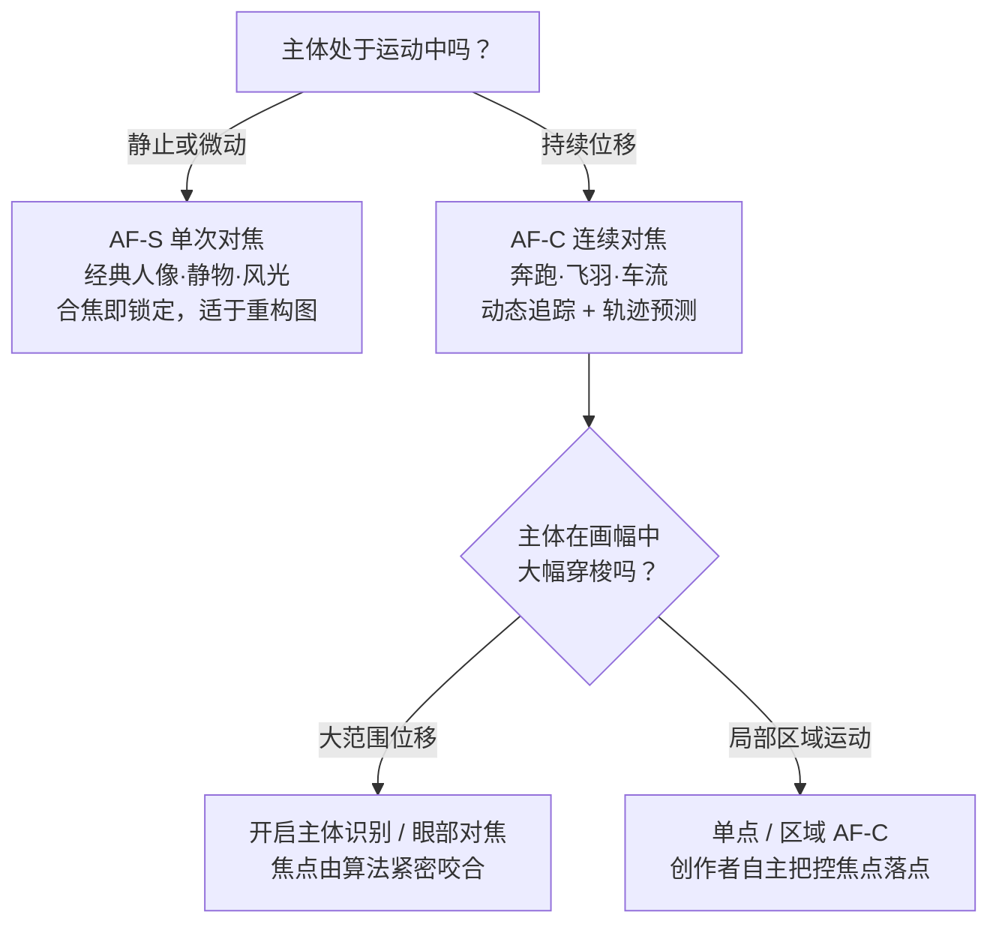

# 第 6 章 时机

> 所谓决定性瞬间，从来不是某种虚妄的玄学。它首先是时间与动作之间严丝合缝的默契。一幅影像能否立足，往往并不取决于按下快门那一秒的运气，而取决于在那一秒到来之前，你是否早已为它筑好了形式的容器。

---

## 摄影怎样切开时间

*Eadweard Muybridge, "The Horse in Motion", 1878。流传最广的说法是，铁路大亨 Leland Stanford 与人打赌：马奔跑时会不会有四蹄完全离地的一瞬间。赌局的细节其实从未被当时的证据坐实，更可靠的记载是，Stanford 出于养马和运动研究的兴趣，自 1872 年起出资委托 Muybridge 做这项实验。Muybridge 在 Palo Alto 的赛道边布下一排连环相机，每台快门由马经过时绊触的细线触发。这组照片给出了答案：马在某一帧里确实四蹄离地。摄影第一次把人眼看不到的瞬间变成了证据。时机作为一个摄影问题，从这里开始变得非常具体。[图片来源与复用说明](image-credits.md#muybridge-horse)*

1878 年，在加利福尼亚州帕洛阿尔托的赛马场边，埃德沃德·迈布里奇（Eadweard Muybridge）沿着跑道并排架设了十二台（后增至二十四台）装有特制电磁快门的照相机。每台相机的快门连着一根横跨跑道的细线，当纯种赛马“萨莉·加德纳”（Sallie Gardner）以每小时近六十公里的高速疾驰而过时，马胸相继撞断细线，以千分之一秒的极速完成了连续曝光。在冲洗出的湿版底片上，世界第一次看清了运动在微观时间里的解剖切片。

千百年来，从古罗马浮雕到热里柯（Théodore Géricault）1821 年的名作《埃普松的赛马》，西方绘画史上的奔马始终保持着一种“飞奔姿态”：前后四蹄向外笔直伸展，如飞鸟振翅般平行贴近地面。艺术家们坚信自己的眼睛，但人类视网膜约十分之一秒的视觉暂留机制，注定了快速奔涌的现实只能融汇为模糊的连续幻象。迈布里奇的机械快门像一把精密的手术刀，强行切开了人眼生理极限所无法企及的时间盲区。而底片揭示的真相令当时的整个艺术界陷入惊骇：奔马在疾驰中确实存在四蹄同时离地的瞬间，但绝非四肢向外舒展之时，而是在四蹄蜷缩收拢于腹部下方的那个极短顿挫。

这组连续切片构成了摄影史上至关重要的分水岭：它不仅催生了其后的活动电影技术，更从根本上确立了摄影对于时间的特权。从此，摄影不再仅仅是绘画的模仿者或记忆的附庸，它拥有了独立勘探时间微观奥秘的能力。流动的时间在此刻被粉碎为离散的晶体；而所谓“时机”，也自此从漫无边际的等待，化作了对微观时间碎片的精确辨识与捕捉。

---

## 决定性瞬间之后

1952 年，亨利·卡蒂埃-布列松（Henri Cartier-Bresson）出版了其代表作《Images à la Sauvette》。当该书被译为英文引入美国时，出版家将其命名为 *The Decisive Moment*，后世中文遂普遍译为“决定性瞬间”。这一译名流布极广，却在无形中滋生了某种带有禅宗色彩的误读——它听上去宛如一种静穆的、近乎冥想式的等待，仿佛只要摄影师执着守候于原地，那个至臻完满的瞬间便终将如神迹般自行降临到镜头前。然而，布列松一生的行摄实践，恰恰站在了这种守株待兔的对立面。

在法语的原生语境中，“à la sauvette”源自街头小贩为躲避盘查而疾步撤离的姿态，意指迅捷、敏锐、带着行动自觉的骤然攫取。布列松从不是在虚无中等待奇迹降临，而是在一个处于动态发展中的现实局势里，凭借敏锐的知觉预先体察下一瞬间的走向；他在现实尚未完全成型之际便已将相机悄然备妥，唯待那一瞬真正到来时，以极度的克制稳稳将其收纳。

他在卷首引述了雷茨红衣主教（Cardinal de Retz）的名言：“天下万物，皆有一决定性瞬间。”布列松自己给出的定义则更为完整，值得每一个创作者深思：“在几分之一秒的刹那，同时体察一件事物的意义，并洞悉能够恰切展现该意义的严谨形式组织。”这句话包含了两个不可分割的并列支柱：前半句关乎**意义**，你必须敏锐看清眼前事件的内核所在；后半句关乎**几何**，画面中的线条、明暗、体量与人物的站位，恰好在这一刻咬合为严密成立的构图形式。

这一断语在后世的流传中常常被遗忘了一半。许多人谈论瞬间，往往只执着于反应与速度；然而在布列松那张著名的圣拉扎尔车站后方跳跃的水洼照片中，其震撼力一半源于男子腾空跃起的动势，另一半则深植于他腾空的姿态与背景海报中跳舞女郎的剪影互为镜像，以及水面将这组几何关系完满倒映的严密对称。倘若几何结构不成立，哪怕快门掐算得再准，照片依然无法站立。追寻时机的人，必须先为那一秒准备好形式的骨架，让那偶然到来的瞬间，安稳地落入早已成立的构图之中。

真正有力量的直觉，从不是在某一刻凭空爆发的灵感，而是在持续凝视中被反复淬炼的心智状态。好的时机永远属于那些愿意在一个场景前驻足沉吟的人，而不是匆匆掠过的路人。

---

### 瞬间不是唯一答案

《决定性瞬间》确立的经典美学太有统御力，以至于在其后数十年里，常常被奉为严肃摄影唯一的法典。然而就在布列松声名鼎盛之时，另一批摄影师开始对这一神话提出反思，他们用截然不同的影像实践开辟了新的疆域。

罗伯特·弗兰克（Robert Frank）便是最具颠覆性的先锋。这位自瑞士移居美国的摄影师，在 1955 年获得古根海姆基金资助，开着一辆二手雪佛兰行遍美国腹地。他拍摄了两万多张底片，最终严苛挑选出八十三幅影像，汇编成划时代的摄影集《美国人》（*The Americans*）。整部画册充斥着粗粝的颗粒、倾斜的地平线、失焦的人群与松散的边缘；它没有布列松式严丝合缝的古典几何，却以一种沉郁、疏离而冷峻的视角，刺破了战后美国繁荣表象下的空虚与阶级断层。弗兰克所追寻的，不再是几何构图的刹那平衡，而是情绪与社会现实的真实质地。

紧随其后的加里·维诺格兰德（Garry Winogrand）则走得更为决绝。他身后留下了数十万张未曾冲印的底片，并留下了那句名言：“我拍照，是为了看事物被拍成照片后是什么模样。”这一宣言彻底瓦解了“决定性瞬间”的先验神话：倘若连创作者自己都必须在显影后才能审视画面的成败，那么现场的精确预设便不再是唯一的金科玉律。1967 年，约翰·萨考夫斯基（John Szarkowski）在纽约现代艺术博物馆策划了著名的《新纪实》（*New Documents*）展览，将维诺格兰德、李·弗里德兰德（Lee Friedlander）与黛安·阿巴斯（Diane Arbus）并置展出，正式确立了这种更松弛、更暧昧、带着现实粗粝感的摄影语言。

这一系列美学流变并非为了推翻瞬间的价值，而是让它回归到应有的坐标：它是一种极其深邃的观看方式，却绝非唯一的正解。有的照片因几何咬合的纯净而永恒，有的照片则因边缘的犹疑、暧昧与残缺而充满生机。

在这一认知基础上，我们还需将瞬间细分为两种截然不同的形态：**物理峰值瞬间**与**神态姿势瞬间**（gesture）。

物理峰值，关乎机械运动抵达顶点的刹那：跳高选手越过横杆、即将在重力下坠落之前的短暂停顿；海浪翻涌至极高处、水沫尚未四溅的聚合之态；或是击球瞬间球体与球拍的接触点。抛体运动在上升终点垂直速度短暂归零，天然提供了一个微小的悬停窗口，留给眼睛和快门极宝贵的判断余地。体育摄影的经典之作，大多诞生于此。

而神态姿势的瞬间（gesture）则要幽微得多。它可能只是一只悬在半空犹疑不决的手、一个不经意间掠过画外的眼神，或是嘴角刚刚泛起却尚未被社交警惕收敛的微笑。这种瞬间无法依靠牛顿力学推演，它稍纵即逝，极其脆弱，却往往直抵一个人真实的内心深处。布列松真正的过人之处，正在于对这种幽微姿态的敏锐洞悉：他所捕捉的往往不是肉体最用力的那一瞬，而是人物神态与内在气息完全对齐的刹那。物理峰值考验的是对运动规律的熟悉，而姿态与神情所考验的，则是对人性的深沉体察。

---

## 不同题材的时间尺度

不同题材处理时间的方式截然不同。街头、人像、体育与风光皆言时机，然而它们所直面的，从来不是同一种时间形态。有的时间需要静心守候，有的时间由创作者亲手编排，有的时间转瞬即逝需托付于高速连拍，亦有的时间被刻意拉长、重叠封存在单幅画面之中。将它们分门别类，时机便不再是一句空洞的口号，而化作具体可感的视觉实践。

**第一种，是等来的时机。** 主体处于持续的动态演变之中，你预先体察其必将行经的轨迹，于是从容站定，静候其步入预设的境界。一个人正穿过冷清的巷陌，几秒后便将踏入百叶窗漏下的那一束斜阳；一只飞鸟掠过天际，正沿着平缓的弧线飞向画面留白的黄金分割点；孩童被路旁的景物吸引，纯真的笑意刚浮上面颊、尚未被自我警惕收回；浪花撞击在黑色礁石上，激起的水沫刚刚绽放成花冠、尚未散落。这一类时机的共同底色，在于功夫全在快门落下之前：机位早已站定，景深与对焦早已锁定，曝光参数早已了然于心。当那一瞬真正降临时，所需要的只是一次不动声色的确认。

布列松在圣拉扎尔车站木栅栏后接住的那个飞跃水洼的旅人，正是等来时机的典范。成片看似上帝赐予的绝妙巧合，然而巧合的前方，站立着一位早已锁好距离与曝光、并在水洼前静心驻足良久的守候者。

**第二种，是亲手制造的时机。** 在人像创作中，你引导被摄者将视线转向窗外、让肩膀自然放松，或是请对方重拾方才那一段生动的谈吐；在静物摄影中，你决定了器皿摆放的间距、侧光的倾角，以及阴影在桌案上延伸的斜度。制造时机最具生命力的形式，在于“搭建情境以激发真实”：邀请两位故友围坐一桌，或是请对方讲述一件深藏心底的往事；情境固然由你布设，但随之涌现的笑意、沉思与手势却是无法伪装的真实。在当代摄影语境中，杰夫·沃尔（Jeff Wall）与格雷戈里·克鲁德逊（Gregory Crewdson）更将这种制造推至极致——如电影剧组般搭建庞大布景、调制复杂光效、精密调度演员，整幅画面从头至尾皆为编排，却同样具备震撼人心的艺术力量。摆拍与抓拍从来不是高下之别，真正决定成败的，是画面的内在逻辑是否自洽，人物的精神状态是否可信。

**第三种，是依靠高速连拍托住的时机。** 某些剧烈运动极其迅疾且轨迹无常：体育赛场最后冲刺时面部紧绷的肌肉、猛禽俯冲扑向猎物的电光石火、婚礼现场亲友骤然涌出的热泪，以及孩童奔向阳光时的雀跃。这类极速瞬间，单次快门很难保证次次分毫不差地卡在动作的峰顶。专业的体育与纪实摄影师依赖连拍，是因为人类生理反射神经存在不可逾越的时间下限。然而必须牢记：摄影判断的高下，绝不在于连拍张数的多寡，而在于何时果断启动、又在何时从容止步。

**第四种，是时间在画幅中的长久累积。** 潮汐被漫长曝光抚平为如烟似练的柔丝，繁华枢纽中穿梭的人潮化为半透明的虚影，斗转星移在夜空中绕着极星画出静穆的同心圆弧，深夜高速公路上往来的车灯拉出两条交织的金红流光。此时，镜头记录的不再是一个被利落切开的瞬间晶体，而是一整段时间如何层层堆叠、凝固于同一平面。相较于争分夺秒的敏捷，它所要求的是耐心地任由光阴在传感器前沉静流淌。

---

## 等待是主动工作

许多人是耐不住等待的。在一个场景前伫立片刻，见毫无波澜，便心生退意。然而等待之所以难熬，往往不是因为耐心匮乏，而是因为心中尚未看清自己究竟在等什么。缺乏清晰愿景的等待只是徒劳的耗散；而一旦明晰那一瞬间将为画面带来怎样的质变，等待便不再是虚无的煎熬，而化作一种有把握的筑巢。

反之，一个能在一个机位前静候良久的人，看似只是耐力过人，内核深处却是其强大的视觉预判在支撑。他清楚那一道光线移动过来后空间将如何被点亮，也明白一个行人走入阴影时画面的张力将如何倍增。因为心中早已勾勒出那一幅理想的画卷，等待便有了明确的锚点。

在决定驻足守候之前，不妨在心中审视几道关卡：主体尚在演变吗？它可能抵达的下一个完美状态为何？大约需耗时多久？出现的几率有几成？那一瞬间的成立，能否为画面注入不可替代的精神力量？逐一叩问之后，等待才具备了专业意义。你既能清醒地全神贯注，也能为自己设定理性的止损界限。

最短的等待通常在数十秒以内，多见于街头纪实。空间骨架已然齐备，唯待一个脚步、一辆单车或一个侧脸将空间点醒。此时手指搭在快门之上，屏息凝神，静候画面的最后一块拼图自行落位。

中等尺度的等待在数分钟至半小时之间，多见于城市建筑与暮色风光。你所等待的是夕阳恰好沉入楼宇缝隙的金光，是云层裂开投下的一缕天光，或是街灯次第亮起的蓝调时分。此类守候当依托三脚架筑牢基底，预先锁定严谨的构图与曝光，唯留目光审视光影的细微流转。

漫长的等待往往超过半小时，常见于深邃风光与野生动物记录。这种守候必须依托周密的计划与天气预判，绝非漫无目的的盲目碰运气。为自己划定清晰的收工时限；即便未能如愿，这漫长的凝视也绝非虚度——你亲眼目睹了光影如何寸寸推移、风云如何汇聚消散，这些对自然的细腻体察都将化为潜意识里的视觉养分，滋养下一次更为精准的预判。

---

## 预判从哪里来

好的时机几乎全赖预判：你所记录的并非已经发生的事实，而是即将成型的刹那。这项知觉能力并非天赋秘术，而是深植于对现实规律的敏锐洞察之中。

首先当预读的是**行人的动线与动势**。人行于街道，其行进路线往往受到地面铺装、障碍物与视线焦点的隐秘牵引。若肯多看几秒，便能看出他将在哪一步踏入那片柔和的天光，又会在哪一处拐角与另一位路人交错。阅历日深，这种对动线的直觉甚至无需经由理智推演。

其次当预读的是**光线的律动**。厚重云层向太阳缓慢推移，你能大致估算出阴影褪去、金光重新覆上建筑的精确时刻；暮色低垂时分，天际每分钟都在沉降色温，路灯将在特定照度阈值下骤然亮起。自然之光遵循着严谨的物理轨迹，它从不突兀变卦，只要你比它早半步站到正确的位置。

再者当预读的是**事件的内在节拍**。世间万象皆有其节奏：列车进站的轰鸣间隔、潮水涌向防波堤的周期、街头艺人表演的起承转合，抑或是仪式流程的步步推进。一旦捕捉到这份节拍，便能预知高潮将落在哪一拍之上。以婚礼交换戒指为例：誓词终了便是行动信号，移步至能兼顾手部动作与新娘神态的角度，预设连续对焦与充足快门；伴郎掏出戒指盒的刹那举机入位，套上指环的顶点固然庄重，而紧随其后二人相视一笑的舒缓，往往才是全场最动人的灵魂所在。

这三者合而为一，便是安塞尔·亚当斯所推崇的**预视觉化**（visualization）：在按动快门之前，心中早已洞见成片的光影格局与神韵所在，只待现实步履从容地踏入这早已筑就的画幅之中。

---

## 抓拍是一条反应链

抓拍绝非盲目比拼按下快门的手速。它是一条由知觉引领、肉身协同的完整反应链：始于敏锐的觉察，继以精确的预判，而后身形与器械同步就位，最终才是指尖轻柔的果断定格。快门不过是链条收口的终点，决定成败的关键，全在前端的铺垫。

余光察觉异样，目光随即跟进看清，这不过是第一步。经验丰富的创作者能将构图、测光与对焦化为肌肉记忆，一呼一吸之间便已完成。新手之所以屡屡错失良机，往往并非手速迟缓，而是对器械尚未纯熟，面对骤然降临的场景手忙脚乱地拨动拨盘、寻找菜单，待到理清参数，光影早已散逸无踪。

步入街头之前，参数便应预设在安全区间之内：光圈收缩至 f/5.6 或 f/8，快门速度守在 1/250 秒至 1/500 秒以凝固步履，ISO 开启自动并设定合理上限。如此预设的目的，是为了让机械操作退隐于无形，将全部心神交还给眼前的世间万象与流动的人群。

**后键对焦**（Back-Button Focus）是强化抓拍敏捷度的经典利器。相机默认设置将半按快门同时赋予了测光与对焦的双重职责。后键对焦则将对焦功能剥离至机身背部的 AF-ON 键，快门按键仅专事纯粹的曝光触发。如此一来，你可从容合焦后重新微调构图，无须担忧二次半按导致焦点漂移；追随运动主体时，拇指按定即为持续追踪，松手即为瞬间锁定，双向切换从容自如。

而更富古典智慧的手段，当属**区域对焦**（Zone Focusing）。将镜头切至手动，依托景深标尺将光圈收至 f/8，焦点预设在两至三米处，便能在两米至五米这一极具现场张力的人文距离内，构筑起一道无须合焦等待的清晰屏障。只要主体步入这道无形的景深回廊，抬手便可果断定格。它虽牺牲了微观的绝对锐度，却换来了在决定性瞬间面前绝不迟滞的尊严。

---

## 对焦模式要服从运动

机械参数的选择必须严格顺应主体的运动特质。

**单次自动对焦**（AF-S / One-Shot AF）遵循“合焦即锁死”的静态逻辑。半按快门，合焦确认后焦点便固定不动。它极契合于静态肖像、风光建筑与静物创作，并可顺畅配合“中心点对焦后平移重构图”的经典手法。

**连续自动对焦**（AF-C / AI Servo）则遵循“动态追踪与运动预测”的逻辑。只要指令持续，对焦马达便一刻不停地追随主体位移；更重要的是，其内置的**预测对焦算法**（Predictive AF）能依据前几帧的运动轨迹，精确推算快门帘幕开启瞬间主体将抵达的物理坐标，从而将焦点提前送达。凡奔跑、飞翔、车辆穿梭之动态题材，皆须由 AF-C 护航。

在此之上，现代机身依托神经网络构建了**主体识别与眼部对焦**（Eye AF）。系统自主甄别画幅中的人脸、眼眸、鸟类或载具，并在复杂构图中始终咬定主体。它彻底免去了手动拨动摇杆搬运对焦点的繁冗，让创作者得以从琐碎操作中解脱，将全部知觉倾注于神态与时机的捕捉。

---

### 快门迟滞与预拍

### 快门迟滞与预拍

即便对焦模式完全契合，从手指下达按压指令到传感器真正完成曝光，中间仍横亘着无法抹除的物理延迟，即**快门时滞**（shutter lag）。许多初学者常感困惑：明明在视线所及的最完美一刻按下了快门，成片却往往慢了半拍。

快门时滞由两个阶段构成：第一阶段是对焦驱动耗时，系统需先确认合焦方允许快门开启；第二阶段是**释放时滞**（release time lag），即合焦完成之后，由机械快门帘幕升降或电子感光启动所产生的固定延迟。对于现代高端机身，释放时滞通常已被压缩至数十毫秒以内。

然而在机械时滞之前，存在一段更为漫长的生理门槛：**人类的神经反射时间**。从视网膜接收峰值画面、传导至大脑皮层做出决断，再由运动神经指挥食指下压，健康成人的生理反射耗时通常在 150 到 250 毫秒之间。将生理时滞与机械时滞并置，便能看清症结所在：相机的延迟仅有数十毫秒，而人类自身的生理延迟却高达数百毫秒。这从生理学上证明了单凭“反应速度”无法决胜：没有人能依靠纯粹的即时反射超越物理极限。真正逾越这一鸿沟的唯一路径，唯有**预判**——不在看见顶点时才动手，而是在顶点即将显现的刹那，指尖早已提前轻压发力。

由此衍生出抓拍的核心战术：**预对焦**（pre-focus）。在主体尚未就位之前，提前对准其预估的行经路径半按锁定焦距，将漫长的对焦耗时提前消化，临场只承受极微弱的释放时滞。

将预对焦推向极致，即是经典的**陷阱对焦**（trap focus）。将焦点预先锁死在特定的几何点上——飞鸟极可能栖止的枯枝、滑板少年腾空越过的栏杆、终点线拉紧的丝带——而后静心伏击。构图与对焦这两道最耗费心神的工序已在前期从容筑就，临场唯待时机撞入这道无形的陷阱。

---

## 单帧还是连拍

单帧与高速连拍并非落后与先进的代际之分，而是对应着截然不同的创作心智。

街头纪实、经典肖像、风光建筑等题材，在绝大多数语境下当以单帧为准绳。单帧具备一种隐秘的心智磨砺价值：它迫使创作者在每一次按下快门前独立完成全部的审美与几何裁决，而不是将选择的责任懦弱地推迟至后期的海选。老一辈纪实摄影师在银盐时代受制于胶卷物理厚度与冲洗成本，一卷三十六张底片，每一次扣动快门都伴随着真切的物质代价。正是这份对快门的敬畏与克制，铸就了他们对构图纯度与时机节点极为严苛的洞察力。

而在体育竞技、极速生态、嬉闹的孩童以及骤然爆发的情感瞬间面前，高速连拍则是不可或缺的技术保障。此时当将机身果断切至 AF-C，快门速度提升至 1/500 秒乃至 1/2000 秒以上，并确保存储介质具备充沛的写入带宽。

高速连拍的代价在于后期沉重的筛选负担。数十幅微差影像横向铺开，对微表情与手势的辨析极易引发审美疲劳；更危险的是，它容易制造一种“已然捕获”的虚假安全感。驾驭连拍的上乘之道，是在预判到决定性动作即将抵达的峰顶瞬间，以短促而克制的点射截取数帧，而非盲目按死快门不放。

---

### 帧率、缓存与预拍摄

盲目连射之所以无法取代审慎的预判，根源在于相机的几项底层物理边界：

首先是**帧间空隙**。即便是 10 fps（每秒十张）的连拍，相邻两帧之间依然存在 100 毫秒的时间断层；20 fps 下两帧之间亦隔着 50 毫秒。而许多剧烈运动的峰值接触点（如棒球击球瞬间）持续时间不足数毫秒。决定性的动作完全可能精准地跌入两帧之间的盲区，导致连拍扑空。提升帧率固然能收窄这一空隙，却无法从根本上消除断层。

| 连拍帧率（fps） | 相邻帧之间的时间盲区 |
|---|---|
| 5 fps | 200 ms |
| 10 fps | 100 ms |
| 20 fps | 50 ms |
| 30 fps | 33 ms |

其次是**机身高速缓存（Buffer）边界**。连拍数据先暂存于机身内存中，再由主控芯片分流写入存储卡。一旦持续连拍耗尽了缓存空间，机身将被迫降速甚至锁死；若在真正的高潮降临前盲目狂扫，极易导致系统在高潮显现的刹那陷入写入停滞。

近年的先进微单机身引入了**预拍摄**（Pre-capture）功能：半按快门时，机身以电子快门在环形缓存中循环预录最近半秒至一秒的画面；待全按快门后，连同按压前的一组切片一并固化写入。这使得创作者在目睹飞鸟振翅起飞的刹那按下快门，依然能稳稳挽回起飞前几毫秒的完整序列。然而这项黑科技依然无法代替形式判断：它仅仅拓展了反应的缓冲带，画面的构图骨架与意义成立与否，依旧系于拍摄者心中的准绳。

---

## 先决定怎样呈现动作

连拍决定了捕捉的频次，而快门速度则直接裁决着动作在画幅中显影的物理姿态：是被绝对凝固为静止的标本，还是化作富有动势的虚幻流光。

针对不同运动烈度的主体，可确立严谨的安全基准：

| 被摄运动形态 | 凝固动态的快门基准 |
|---|---|
| 静止人像与沉静呼吸 | 1/125 秒 起步 |
| 缓步徐行的路人 | 1/250 秒 |
| 奔跑、跳跃与翻腾 | 1/500 秒 起步 |
| 骑行穿梭与奔跑孩童 | 1/500 至 1/1000 秒 |
| 城市疾驰的车辆 | 1/1000 秒 起步 |
| 疾飞野禽与竞技赛事 | 1/1000 至 1/2000 秒 |
| 动态追随横摇（背景拉丝） | 1/30 至 1/60 秒，配合平稳转动 |

需辨明两重完全不同的模糊来源：**主体位移模糊**与**机身抖动模糊**。安全快门法则（\(1/\text{等效焦距}\)）防范的是拍摄者自身的肉体微颤；而凝固主体位移，则必须严格以主体的实际速度与运动方向为标尺。横向切过画面的物象，其产生的角位移远大于正向迎面而来的主体，因而需要高出一倍以上的快门速度方能彻底锁死。

---

## 慢门把时间画出来

将快门推向极速，是为了将时间钉死在某一微观切片上；而反向放慢快门，则是让时间在画幅中延展、流淌并重叠显影。

快门速度的深浅，决定了时间在画面中被稀释的浓度：
- **1/15 秒至 1/2 秒**：这是最具人情韵味的半凝固区间。行人的衣袂与足尖化作流动的暗影，而面庞与建筑却保持着辨识度；虚实相生之间，赋予了市井画面沉静的呼吸与岁月感。
- **2 秒至 30 秒**：流水化作凝脂丝绒，夜色中的车流交织成炽热的光带，流云在天际被拉伸出油画般的笔触。此区间需依托稳固三脚架与高密度中灰减光镜（ND 镜），精准压制过量光子。
- **数分钟至数小时**：大自然的漫长巡礼。潮汐化作虚无的轻雾，繁星在天幕深处刻画出苍茫的星轨圆环。时间彻底脱离了瞬时的喧嚣，沉降为宇宙尺度的寂静。

森山大道在《再见摄影》中大量使用手持微慢门的晃动质感，将东京街头的雨丝、夜色与狂乱醉意凝固为高反差的视觉丛林。他主动迎纳晃动，是因为摇摆本身正是都市粗粝脉搏的诚实记录。

而**追随拍摄**（Panning）则是慢门的奇特倒错：快门放慢至 1/30 秒，镜头以腰腹为轴平稳追随横向移动的主体同步转动。主体在画幅中保持相对静止而清晰，背景却被拉伸成平行的流光飞线，动感呼之欲出。

---

### 电子快门与果冻效应

在运用电子快门捕捉疾速运动时，必须正视其底层物理机制带来的**果冻效应**（Rolling Shutter）。

机械快门通过物理帘幕的开合切削光线，而在多数非全域快门传感器上，电子快门是通过由上至下的逐行扫描完成电荷读取。如果主体运动速度极快，当传感器扫描至底部时，主体已发生显著位移，导致原本垂直的电线杆在快速横摇中呈现斜向倾倒，疾驰的汽车车轮被扭曲为倾斜的椭圆。

全画幅全域快门传感器（如 Sony α9 III）的问世，使全部像素在同一微秒窗口内同步曝光并锁存电荷，从底层彻底根除了卷帘果冻畸变。但在传统机身工作流中，面对高速旋翼、激烈体育挥拍或频闪人工光源时，回退至机械快门依然是最为稳妥的防线。

---

## 有时最好的选择是不拍

懂得何时松开食指、果断不拍，与懂得何时按下快门同样重要，甚至更能检验一个创作者的心智成熟度。

**其一，意境差之一线而局势已逝。** 画面万事俱备，偏偏差了一缕光、一个点睛的脚步或一个微妙的神情，而时间已不容继续守候。初学者常抱着“来都来了”的侥幸勉强按下一张，但这类底片往往终生不会被再次审视。能够一眼看出画面的不完满并淡然收手，本身就是知觉的跃升。

**其二，画面落入陈词滥调的俗套。** 眼前景致悦目，但脑海中立刻浮现出无数相似的网红明信片构图。此时不妨自省：我究竟是真正看见了当下的独特生命力，还是在无意识地临摹某种烂熟的形式套路？若是后者，不如放下相机，用双眼纯粹去体味风景。

**其三，仅止于肤浅的漂亮。** 晚霞瑰丽、街道整洁，若抽离了甜俗的色彩后空无一物，便很难经得起岁月的淘洗。扣动快门之前，在心底自问一声：“我为何非要留下这一张？”倘若心中茫然，不妨让这束光静静滑过。

---

## 几条反直觉的现场经验

在漫长的实战探索中，有若干反常识的规律历久弥新：

1. **惊艳的瞬间往往隐匿于刚刚转身的背后**。穿过街角或拍完一组场景后，切莫急于前行，务必回首重看一眼。许多决定性的光影与人物互动，偏偏在你以为事件终结的那一刻悄然完成。
2. **第二张成片往往超越第一张**。初次举机按动快门多半源于身体的本能反射；按完之后切莫抽身离去，在原地略微调整半步站位，复核画面边缘，沉静再等一瞬。第二张的诞生，才真正标志着审美判断的深度介入。
3. **耐力比敏捷更能成全杰作**。在一处充满潜力的空间前，与其急躁地追逐路人，不如安稳驻留半小时，静待最契合那道光影的人物自行步入画中。
4. **不经取景器的盲拍具备奇特的生命力**。在距离极近、转瞬即逝的人文街头，将 35mm 或 28mm 镜头设为区域对焦，把相机悬于胸前或贴近腰际，盲按定格。它打破了取景框对身体的僵死束缚，让镜头以最不具侵略性的姿态与街头现实融为一体。

---

## 练习

1. 选定一个具备人流演变特征的街角或车站出口，机位固定站定半小时，期间不移动站位。回溯成片，审视最成立的那一帧是否诞生于观察渐入佳境的后半程。
2. 将相机参数全面预设（f/8、1/500 秒、Auto ISO），手持 35mm 镜头漫步一小时，期间严禁调整任何机械拨盘，将全部专注力倾注于行人动线与光影切片的预判。
3. 针对同一运动题材分两次作业：第一次全用单帧，每按一次前静心审视构图两秒；第二次切换至高速连拍，仅在峰值预判瞬间短促点射。并置比对两组各选出的五张代表作，体察两种心智状态的成片差异。
4. 外出拍摄一小时，按动快门前在心中明确叩问拍摄缘由，无动于衷则绝不下压快门。体察这种克制如何精简无用底片、提纯画面的精神分量。

---

下一章：[第 7 章 人像](07-portrait.md)

