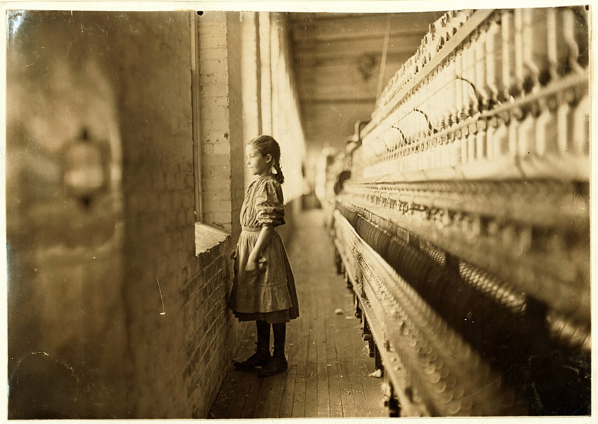
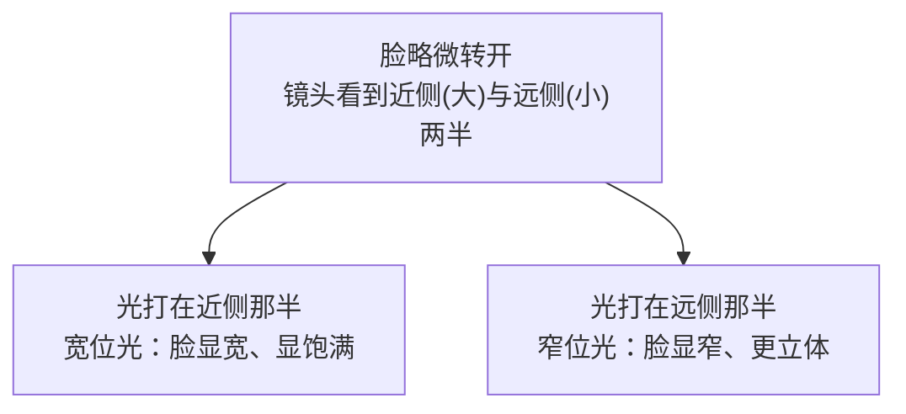
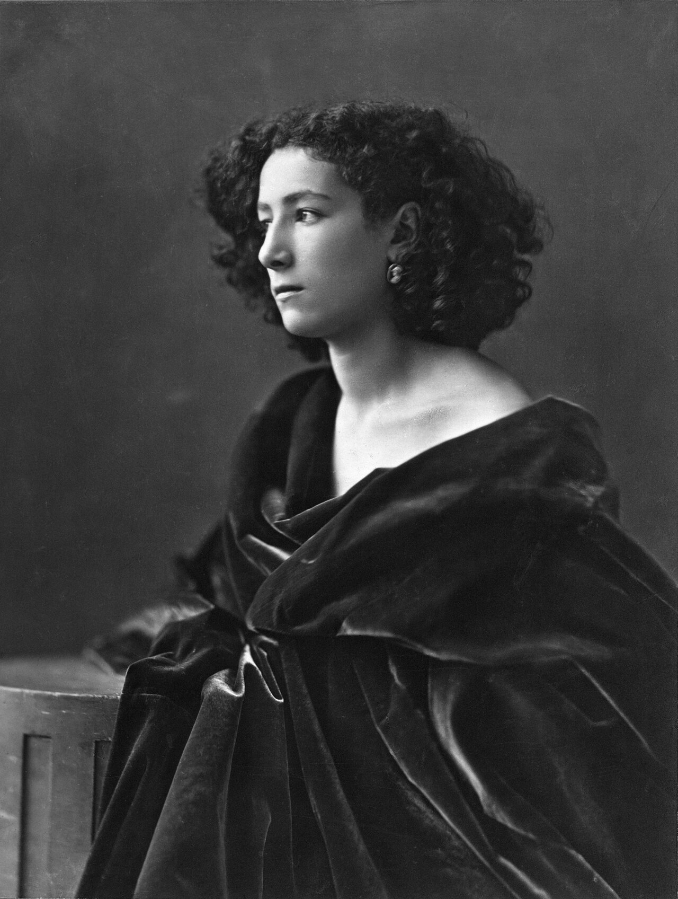

# 第 7 章 人像

> 人像从来不只是把一张脸拍清楚。真正进入画面的，是你和被拍者之间正在发生的关系。

---

## 人像从关系开始

一张好人像，往往不是在被拍者刚刚坐好、刚刚把表情摆出来的那一刻出现的。相反，真正的那一张，通常还要再往后等一等。刚开始的几分钟里，人会不自觉地管理自己：肩膀该怎样放，嘴角要不要往上牵一点，眼睛是不是一直盯着镜头，两只手摆在哪里才不至于尴尬。这时候他调动的，其实是一整套关于“该被拍成什么样”的想象。你当然能在这个阶段拍到清楚、端正、体面的照片，可那常常只是一个人知道自己正在被拍时，主动递给镜头的那个样子，而未必是他本来的样子。

真正值得等的，是他暂时忘了相机存在的那一下。这样的瞬间往往来得很轻：也许他低头去看手里的东西，也许转头和旁边的人搭了一句话，也许只是随手整理一下衣袖，又或者目光从镜头上移开，落到窗边，落到桌面。无论是哪一种，共同点都在于，他的注意力在那一刻离开了相机。就在这一两秒里，他不再努力扮演“正在被拍的人”，绷着的身体和神情会松下来一点，脸上也随之浮出一些更接近日常状态的东西。

人像里最动人的部分，常常就藏在这样的瞬间里。摄影师当然要懂光、懂焦段、懂站位，这些是基本功，缺一不可；然而换个角度看，这些技术到最后都只是手段，它们统统要服务于同一件事，那就是让被拍者在画面里像一个真正的人，而不是一个被摆布、被安排好的形象。技术要为那一点真实让路，而不是反过来。

---

### 当照片反过来看你

*Lewis Hine, "Girl Spinner, Rhodes Manufacturing Co.", 1908。Hine 的原始记录称这位北卡罗来纳纺织厂女童工 11 岁。她在纺纱机旁停下来，厂房的窗光从画面左边进来，照到她的头发、肩膀和脏围裙上。她侧对镜头，目光望向窗的方向，不微笑，也不摆姿势。Hine 为 National Child Labor Committee 长期记录童工；这些照片与调查、倡议和立法行动一起改变了公众讨论。1916 年，美国通过 Keating-Owen 童工法案，该法两年后被最高法院裁定违宪；联邦层面的童工限制要到 1938 年《公平劳动标准法》才获得更稳定的基础。[图片来源与复用说明](image-credits.md#hine-spinner)*

---

## 技术之前，先建立信任

谈人像，不妨先从你和被拍者之间的关系说起。这层关系看似和技术无关，其实决定了很多东西：关系不同，你在这张照片里所承担的责任也就跟着不同，能控制的和不能控制的，也随之划出不一样的边界。

当被拍者清楚地知道你在拍，同时也愿意配合你的时候，照片就进入了摆拍肖像的范围。婚纱、写真、商业、家庭合影，都属于这一类。在这种关系里，你能控制的东西是最多的：光、姿势、表情、场景，乃至衣服，几乎都握在你手上；与此同时，被拍者通常也抱着一个明确的期待，就是希望自己被拍得好看。杂志封面、时装大片、正式肖像，也都落在这一支里。需要说明的是，摆拍并不因此就低人一等，它只是换了一种分工，把更多的责任从被拍者那里转交到摄影师身上而已。

如果被拍的人待在他自己的环境里，木匠在工作间，医生在诊室，奶奶在厨房，画家在画室，那么照片就比单纯的摆拍多出一层关系。这时候你仍然能控制一部分，可你不能把环境整个抽掉，因为环境本身就已经是画面的一部分，其分量几乎和人物不相上下。Arnold Newman 1946 年拍 Stravinsky，就是一个常被提起的例子。Newman 被视作“环境肖像”（environmental portrait）这一路的开创者，主张把人放回他工作和生活的场所里去拍，让身边的物件替他说话。那张照片里，作曲家坐在画面的左下角，右半边则是一架打开了盖子的三角钢琴，那块支起的黑色琴盖被压成一个又大又硬的几何形，几乎喧宾夺主，成了画面的主角，也像一个被放大的音乐符号。那张照片真正关心的，从来不是把人拍得多漂亮，而是把一个人和他所属的那个世界，一起放进同一个画框里。

还有一类人像，发生在被拍者根本没有意识到，或者虽然意识到了却并不刻意配合的时候。街头、家庭、纪实，大多归在这里。在这层关系里，你能控制的东西最少，于是时机和距离就变得格外要紧。Vivian Maier 在芝加哥当保姆的几十年里，拍下了大量街头人像，其中很多人始终不知道自己被拍进了画面。Saul Leiter 从二楼的窗口望向 East 10th Street，他拍到的路人，也只是恰好从他的画面里经过而已。Helen Levitt 用一只直角取景器去拍纽约 East Harlem 的孩子，被拍的小孩往往以为她在拍别的方向。这几个人的共同之处在于，他们都不去打扰对象，而是让自己退到一个不被察觉的位置上，等生活自己走进画面。

刚开始学拍人的时候，大多数人通常会从摆拍肖像入手，原因也很实际：它容易安排，也容易得到一个体面的结果。可是拍得越久，你就越会意识到，那些并不完全受你控制的瞬间其实更难，也因此更有价值。在那样的瞬间里，表演的成分被压到了最低，最后留在画面上的，反而更接近一个人自然流露出来的状态。

这三种关系摆在一起，还照出一件贯穿全章、却很少被正面说破的事：拍人像，从来不是一场对等的交易。相机在你手里，选片的权力在你手里，照片将来给谁看、配什么说明，也都在你手里；对方交出的，是自己的脸。这份不对等本身没有罪，可它要求你自觉地承担相应的责任。几条底线值得早早立下：拍之前，能问就问，哪怕只是一个举一举相机的眼神询问；拍完之后，把照片给对方看一看、传一份过去，是最起码的往来；照片将来若要商用，一纸模特授权书不是繁文缛节，而是对双方的保护；至于修图，把皮肤修匀和把一个人修成另一个人之间隔着一条线，越过那条线，你交出去的就不再是他的肖像，而是你对他的改写。摄影史上不乏争议的例子：Richard Avedon 拍《In the American West》，把西部的矿工、流浪者、屠宰场工人拉到一块白背景前，拍得沟壑毕现，出版后被批评者追问了很多年——他们看到成片时，是否想到自己会被这样呈现？这个问题没有标准答案，但每个拍人的人都躲不开它：你镜头里的人，认不认得出照片里的自己；认出来之后，又是否甘愿被这样呈现。

---

## 光怎样塑造一张脸

第 2 章已经讲过方向、软硬与反差，这里不再重复一套“好光/坏光”清单，而把它们落到一张脸上。先观察三件事：鼻影指向哪里，暗侧是否还留着层次，眼睛里有没有合适的反光。顶光、底光和正面硬光都不是禁忌，只是它们会更直接地暴露眼窝、皮肤纹理或制造陌生感；如果这正是人物和主题需要的语言，就可以有意识地使用。

主光只挪动一点，鼻子和颧骨的阴影就会改换形状。前人把主光从正前方绕到侧面的过程归纳成几种经典布光法；它们不是必须照抄的规定，而是一组便于沟通和复现的坐标。

| 布光法 | 主光位置 | 特征 |
|---|---|---|
| 蝴蝶光(paramount) | 正前方、略高于眼 | 鼻子下方一小片蝴蝶状阴影，显瘦提亮，美颜常用 |
| 环形光(loop) | 前方约 45°、略高 | 鼻侧一小圈阴影，自然，最常用 |
| 伦勃朗光 | 侧前约 45°、更高 | 暗侧脸颊出现一块三角形光斑，古典油画感 |
| 分割光(split) | 正侧 90° | 半边亮半边暗，硬朗、戏剧、有力量 |

把这四种布光法排在一起看，其实是主光从正前方一步步绕向正侧方的四个停靠点。越靠近正前方，光越平，脸上的阴影越小，人也显得越柔和讨喜；越往侧面走，阴影铺得越开，轮廓也随之越硬朗、越有力量。早在你按下快门之前，仅仅是决定把主光摆在哪里，你就已经在决定这张脸要偏向甜美，还是偏向硬朗。

前面那四种布光法，说的是主光从正前方一路绕到正侧方，管的是脸上那片阴影长成什么形状。可是在阴影的形状之外，还有另一个同样要紧的问题，它和形状无关，只和一件事有关：当被拍者的脸略微转开以后，光究竟落在离镜头近的那半张脸上，还是落在离镜头远的那半张脸上。前人给这两种情况也起了名字，分别叫宽位光和窄位光。

宽位光（broad lighting，宽光），指的是光照亮离镜头较近、也就是我们在画面里看到面积更大的那半张脸。它把脸铺得更开、更饱满，也更平，因此适合脸偏窄、偏瘦的人，或者你本就想把对方拍得敦厚、富态一些。与之相对，窄位光（short lighting，短光）照亮的是离镜头较远的那半张脸，留在镜头这一侧的反倒是阴影。它把脸收得更窄、更立体，最能起到瘦脸的作用，情绪上也更含蓄、更沉一些，因此在人像里用得更多。

| 布光 | 光落在 | 观感 | 适合 |
|---|---|---|---|
| 宽位光 | 离镜头近的那半张脸 | 脸显宽、饱满、偏平 | 偏瘦的脸；想拍得敦厚 |
| 窄位光 | 离镜头远的那半张脸 | 脸显窄、立体、含蓄 | 大多数人；想瘦脸或加情绪 |

宽位还是窄位，和前面那四种图案是两个可以叠加的旋钮：图案定的是阴影的形状，宽窄定的是受光的究竟是靠近镜头的那半张脸，还是转开的那半张。真正到了现场，你往往是先让对方把脸转开一个角度，再决定让光从哪一侧过来，这两下合在一起，才最终写定了这张脸的胖瘦与情绪。

定下了主光的位置，紧接着要回答的，是暗的那一侧到底该暗到什么程度。这就落到了光比上。光比说的是脸上亮的那一侧与暗的那一侧实测的亮度差，两侧每相差一档，比值便翻上一倍。

| 亮侧与暗侧相差 | 光比 | 观感 |
|---|---|---|
| 0 档(等亮) | 1:1 | 平光、柔和、接近证件照 |
| 1 档 | 2:1 | 轻微立体、温和 |
| 2 档 | 4:1 | 明显立体、有戏剧感 |
| 3 档 | 8:1 | 强反差、暗部很深、情绪化 |

需要说清楚的是，调光比并不是在调整画面的总亮度，而是在调整暗的那一侧究竟比亮的那一侧暗上多少。你动的从来不是曝光的高低，而是明暗两侧之间的落差。这里沿用的是第 2 章定下的口径，直接比脸上两侧的最终亮度——亮侧本来就同时吃着主光和补光；老影室教材另有一套算法，只比主光与补光各自的强度，忽略补光落在亮侧的那一份。同一盏补光在两套口径下报出来的数字会差上半档，遇到对不上的数别慌，多半是口径不同。光比可以看作决定一张人像究竟是甜柔还是硬朗的核心旋钮：比值越接近等亮，脸就越显得平顺温和；落差一旦拉开，戏剧性和情绪也就跟着一并涌上来。

光比调的是明暗两侧的落差，而在这之外，还有一样小得多、却同样能左右一张脸的东西，那就是眼神光。所谓眼神光（catchlight），是主光在瞳孔或虹膜上留下的那一小块反光。它在画面里往往只有针尖那么大，可一旦缺了它，眼睛就会显得发木、发死，整张脸也跟着失了神；反过来，只要那一点亮还在，眼睛就活了。

眼神光的位置，其实是主光位置的直接投影，所以摄影师习惯拿钟面来给它定位：把眼睛想成一只表盘，眼神光落在 10 点或者 2 点的方向，也就是斜上方，通常最自然，也最显精神。这一点又绕回了前面那句话，主光放在斜前方、略高于眼，它映进眼睛里，恰好就是这个位置。如果眼神光跑到了正下方的 6 点方向，多半是底光在作怪，眼睛会显得古怪不安；而要是干脆一点反光都找不到，那往往说明光位太偏、太高，或者对方低头太狠，把光整个挡在了眼睛外面。

想给眼睛补上这一点神，最省事的办法，是让对方的脸稍稍抬向光源那一侧，或者在正前方略低的地方补一块反光板、一张白纸，哪怕只是一件浅色的衣服，让它在眼睛里映出一小片亮来。这一点又和第 2 章相互印证：光源越大越柔，映进眼里就是一整片温润的亮斑；光源越小越硬，就缩成一个刺眼的小点。眼神光的形状，其实悄悄泄露了你究竟用的是一扇窗、一只柔光箱，还是一盏赤裸的灯。

---

### 读一张经典肖像

*Nadar，莎拉·伯恩哈特，约 1864。Nadar 是 19 世纪最重要的肖像摄影师之一，许多巴黎文人、画家和演员进过他的影楼；他常使用影楼天窗的自然光。这张照片里，光从斜上方落下，照亮额头、鼻梁和一侧脸颊，另一侧自然沉进阴影，颈部和披风都没入暗处，只剩一张脸和一段肩颈被光拎出来。一个多世纪过去，这种由方向、明暗比例与背景控制共同形成的人像光仍然有效。[图片来源与复用说明](image-credits.md#nadar-bernhardt)*

---

### 窗光的距离与方向

窗光在这一章里已经反复被提起，说它是最简单也最不花钱的人像光。这里不妨把它单独拆开，从站位一直走到成片，完整地过一遍，也算是把第 2 章讲过的窗光，落到一张具体的人脸上真正做一次。

第一步是挑窗，也是挑天。优先找当下没有阳光直射、天空光相对稳定的窗；“朝北窗”只是北半球部分地区的常见经验，不是全球规则。直射阳光太硬时，可以拉上纱帘或使用耐热、阻燃并与灯具保持安全距离的专业柔光材料。普通纸张、布料靠近高温灯具可能引发火灾，不要随手固定在灯头上。

第二步是定人和窗之间的距离与角度。让被拍者侧对着窗户站，脸转向窗的方向，一侧受光，另一侧落进阴影。人靠近窗时，窗在他眼里张开的角更大，光会更软、更亮；同时，光从近侧脸到远侧脸、再到背景的相对距离变化更明显，亮度衰减也可能更快。往房间深处退，光通常更弱、方向更集中，却未必自动“更平”。真正决定脸部反差的，还包括窗外天空的方向、房间墙面的反射和补光。先别急着背结论，让对方前后挪半米，直接观察鼻影、暗侧脸颊和背景怎样一起变化。

第三步，是决定暗的那一侧补还是不补。窗光天生是单侧光，暗部往往掉得很深。你若想要干净柔和的效果，就在人的暗侧支一块反光板，白色的板、一张大白纸、甚至一面浅色的墙都行，把窗光反一点回去，暗部提亮了，光比也跟着收窄。你若要的恰恰是那种半边脸隐进暗处的情绪，那就索性什么都不补，甚至再拿一块黑布或深色衣服放到暗侧，把暗部压得更实。说到底，这一步就是在现场亲手去调前面讲过的光比。

第四步才轮到按快门。想要窄位光，相机站到暗侧，让受光较多的远侧脸朝向窗；站到亮侧，得到的则是宽位光。两种都成立，关键是知道机位正在改变哪一侧脸占据画面。让眼睛稍稍朝向窗，检查眼神光，再根据拍摄距离、画幅和需要清楚的范围选择光圈；双人、近距离或半侧脸往往需要比单人正面更深的景深。对焦也不必机械地永远锁“近眼”：以最终观看尺寸为准，先保证承担情绪和叙事的眼睛清楚。

从窗光再往前走一步，就是你自己的第一盏灯。不必一步跨进影棚，最小的一套人工光系统只有三样东西：一只能离机引闪的闪光灯，一把柔光伞（或小柔光箱），再加一块反光板。伞把发光面撑大，灯架决定方向和距离，反光板照旧控制暗侧。曝光时要记住“相对独立”而不是“彼此完全分开”：在同步速度范围内，放慢快门主要增加环境光，对极短的闪光贡献影响很小；光圈与 ISO 却同时影响环境和闪光，闪光输出、距离与修饰附件再单独改变主体受光。起步时用手动闪光从低功率试拍，逐档观察，会比只记一个八分之一输出更可靠，因为不同灯具、距离与柔光附件的有效亮度差得很远。

---

## 景深要服务于关系

景深决定的，是主体和背景被分开到什么程度。f/1.4 到 f/2 的景深很浅，适合单人特写，能把背景化开，但它的容错也低，稍有偏差就会出问题。f/2.8 到 f/4 要稳当得多，用来拍半身人像，背景仍然会虚化，脸部却更容易保持清楚。至于 f/5.6 到 f/8，则更适合环境人像，道理很直接：既然环境也要被看见，那就不能把景深收得太浅。

新手常常有一个习惯，就是把所有人像都开到 f/1.4。这样做确实容易得到一片糊开的背景，可它的代价也同样明显：鼻尖可能虚掉，往往只有一只眼睛是清楚的，甚至整个画面到最后只剩一张脸，再没有多余的空间可言。与其背“85mm 配 f/2”这样的固定配方，不如先决定脸上哪些部位必须清楚，再用景深预览或试拍检查，也可以先用[景深估算工具](tools.md#dof-calculator)看个量级。焦距、画幅、拍摄距离、输出尺寸和观看距离都会改变最终感受到的景深。

焦段同样要按关系来挑。24mm 到 28mm 适合那种环境感很强的人像，距离近，环境交代得多，只是脸不能离镜头太近。35mm 适合把人放在环境里，那种感觉大约像隔着一张桌子看对方。50mm 适合半身，也适合比较安静的、带一点对话感的画面。再往上，85mm 和 135mm 就更像一种凝视了，它们把背景压缩，把人物从周遭剥离出来，单独托到眼前。需要提醒的是，广角镜头不要贴着脸去拍，除非你要的正是鼻子被夸大变形的那种效果。

如果把上面这些焦段换算成等效焦距，再稍作归拢，会得到一个更便于记忆、也更贴近临场判断的区间。等效 85mm 到 135mm，是人像里最常用的一段：它的透视足够自然，既不会把五官往外推、显得夸张，又能把背景压缩收拢，让人物从周遭清楚地凸显出来。等效 50mm 则更适合带一点环境的人像，视野略宽，画面里能多留下一些人物所处的空间。至于等效 35mm 乃至更广的镜头，长处固然是能把场景一并交代进来，可一旦凑近了去拍脸，问题也随之而来：越是靠近画面边缘，鼻子和额头就越容易被透视放大、被拉扯变形。所以真要用这类广角去拍半身或特写，对这一点就得格外当心。

关于焦段，还有一层更根本的道理值得单独讲清楚，因为它常常被理解反。很多人以为是长焦“压缩”了脸、广角“放大”了鼻子，仿佛透视是镜头凭空变出来的。事实并非如此。真正决定面部透视的，从来不是焦距，而是你站在离这张脸多远的地方。

透视，说到底，是画面里近处的东西和远处的东西之间的大小关系。当你贴到离脸三四十厘米去拍，鼻子到相机的距离，比耳朵到相机的距离近得多，这一近一远的比例差被拉到很大，于是鼻子被画得又大又前凸，脸颊往两侧撑开，整张脸看着就夸张。而当你退到两三米开外，鼻子和耳朵到相机的距离已经相差无几，这个比例趋于均匀，五官的相对大小也就回到了正常，脸看上去才舒服。是距离在决定透视，鼻子被放大也好、脸被压平也好，根子全在你站在哪里。

那么焦距管的又是什么？焦距管的是取景的松紧。你既然为了某种面部比例退远，这时若仍用广角，脸在画面里就会变小；换长镜头，是为了从这个新机位重新取得需要的画面范围。等效 85mm 到 135mm 因此常用于头像和半身，却不是“最美”的物理定律：空间大小、交流距离、人物意图和环境信息都可能让 35mm、50mm 或更长焦段成为更好的选择。

下面这张表，说的就是在拍一张头肩像、让脸大致充满画面的前提下，焦距、你要站的距离，以及由此得到的面部观感三者之间的对应关系。

| 焦距（等效） | 拍到头肩像大约要站的距离 | 面部透视观感 |
|---|---|---|
| 24mm | 约 0.7 米 | 鼻子明显放大、脸往两侧撑、边缘被拉变形 |
| 35mm | 约 1 米 | 略有夸张，环境感强 |
| 50mm | 约 1.5 米 | 交流距离较近，环境仍有分量 |
| 85mm | 约 2.5 米 | 五官比例舒服，背景开始收拢 |
| 135mm | 约 4 米 | 透视平顺、脸最“正”，背景压缩明显 |

把这张表反过来读，同样成立：你不妨先决定自己要站多远、要让那张脸有多“正”，再回过头去挑那支正好能把它框满的镜头。这样一想，选镜头这件事，就从“我该用多少毫米”，悄悄变成了“我想站在离他多远的地方去看他”。

站位和角度也一样，不要走极端。平视是最稳的，也最诚实，它既不偏袒，也不夸张。相机略微高一点，会让脸显得小一些，眼神也随之更柔和；略微低一点，则会让人显得更有力量。这背后的道理，仍然是刚讲过的透视：机位一高，额头和眼睛离镜头近了、被画得大些，下巴退远、被收小，脸型于是朝尖里走，眼睛也显得更大；机位一低，同一条道理反过来运作，下颌和身躯占了便宜，人便显得挺拔、有分量。可一旦过了头，问题就来了：过度俯视会拍成头大身小，过度仰视又会把下巴生生推到镜头前面。实用的基准可以记成一句话：拍头像，镜头大致齐眼；拍半身，齐胸；拍全身，齐腰——全身像的镜头一旦抬得太高，向下的透视会把腿压短一截，很多人像里的腿短，其实是机位站高了。角度的分寸，往往就落在这一点点高低之间。

---

## 把人物从背景里分出来

把人从背景里分出来，是拍人像时反复要处理的一件事。它并不是单靠一个大光圈就能包办的，实际上你手里握着三个各自独立的旋钮，配合着一起用，效果要比一味开大光圈干净得多。

第一个旋钮是光圈，这也是最直接的一个，前面已经说过：光圈越大、景深越浅，背景就化得越开。可它偏偏也最容易被用过头，一味往大里开，代价就是景深薄到连睫毛和鼻尖都难以两全。

第二个旋钮是距离，而且是两段距离：一段是你离人有多近，另一段是人离背景有多远。同样一支 85mm、同样开到 f/2，如果人紧贴着墙站，背景照样是清楚的；可只要让他往前走开两三米，把背景推远，那堵墙立刻就化了。道理和景深是一样的：背景离合焦面越远，它落在画面上就越模糊。所以现场一旦分不开主体和背景，先别急着开大光圈，第一反应应该是把人从背景前面拉出来。

第三个旋钮，是背景本身的明暗和颜色。一张脸能不能跳出来，靠的其实是它和背景之间的反差：浅色的脸配深色的背景，深色的头发衬明亮的窗，人自然就被拎了出来；反过来，浅色的衣服贴着一面浅色的墙，或者背景又杂又和肤色撞在一起，那么哪怕虚化得再厉害，人也容易糊在里头。所以挑背景的时候，除了看它虚不虚，还得看它的亮度和颜色，究竟是在帮这张脸，还是在跟它抢。分离主体这件事，一半落在镜头上，另一半其实落在你挑站位、选背景的那一眼里。

合影里若几个人前后错开，浅景深会顾此失彼。收小光圈是常见办法，也可以让人物尽量靠近同一距离，或者后退机位降低放大率。人物会呼吸、眨眼和轻微移动，焦点合成很容易在脸和身体边缘留下错位，不应当作普通合影的常规方案。对焦位置也不是机械地落在“中间一排”；应根据最近与最远面孔的实际距离和景深分配，让两端都进入可接受清晰范围。

这里有一条现场够用的经验，可以照着起手，再看回放微调：

| 人数与排布 | 起手光圈 | 说明 |
|---|---|---|
| 两三个人、基本一排 | f/2.8 - f/4 | 让他们尽量站成一条弧线，脸到镜头大致等距 |
| 一排四五个人 | f/4 - f/5.6 | 站成微微朝前弯的弧，两端的人别缩到后面去 |
| 两三排的合影 | f/5.6 - f/8 | 先测最近和最远面孔；对焦放在这段实际纵深内，而不是固定认准中排 |
| 多排大合影 | f/8 - f/11 | 尽量借台阶站出高低，压缩前后的实际距离 |

需要提醒的是，光圈一收，进光就少了，所以合影往往要靠提 ISO 或者补光，把丢掉的曝光重新找回来。还有一个常被忽略的办法，是让大家站成一道微微环抱相机的弧线，而不是笔直的一排：想象所有人都站在以相机为圆心的同一段圆弧上，两端的人向前收拢半步。这样一来，每个人的脸到镜头的距离都更接近，等于主动替景深减了负担。

合影还有一个比景深更大的失败来源：眨眼和表情涣散。人数越多，单张里人人都睁着眼、看着镜头的概率就掉得越快，七八个人的合影，指望一张定乾坤几乎是赌博。对策朴素而有效：口令要先设计好——喊“一、二、三”，在“二”和“三”之间按下，因为多数人听到“三”才绷紧，反而恰在那一刻眨眼；连按三五张，别只按一张，回家哪怕真有人闭了眼，也还有从相邻几张里移花接木的余地；按完立刻回放放大，逐张脸看过一遍再让队伍散开，请大家重站一次的代价，远比事后无片可用要小。合影比的从来不是背景化得有多开，而是每一张脸都清清楚楚。

---

## 表情来自安全感

人像里最难的部分，往往并不在光圈和焦段这些看得见、算得清的东西上，而在表情和动作这类无法直接设定的地方。

你若直接对人下指令，效果多半不好。“笑一下”通常只能换来一个僵硬的笑；“看镜头”会让人立刻紧张起来；而“自然一点”更是最不自然的一句话，因为没有人真的知道“自然”到底该怎么做出来。

更好的办法，是边聊边拍，不要让对方时时刻刻都意识到每一张都在发生。与此同时，给具体的动作，往往比提抽象的要求更管用。你不要说“放松一点”，而可以说“你看一下那扇窗”“把头发别到耳后”“手里拿着杯子”“往墙上靠一点”。这里的区别在于，抽象的要求需要对方自己去翻译，具体的动作却可以直接照做。于是当对方开始做这些日常的小动作时，身体通常会比刻意摆出一个姿势更自然。

有时可以对被拍者说：“你不用一直看镜头，我会找我要的。”这句话能把一部分压力从对方身上拿回来。之后可以先拍手、背影和环境，让快门声逐渐变成背景；是否回放，则要看对方会因此安心，还是反而开始自我审视。有人几分钟就放松，有人需要更久，也有人从一开始便很自在，摄影师要读的是眼前这个人，而不是照着时间表推进。

人像拍摄常需要一段适应时间，但没有“五分钟、十五分钟、三十分钟”的普遍节奏。证件照、熟人抓拍、名人肖像和长时间合作面对的是完全不同的关系。更有用的观察是：刚开始时多留余量，不要一得到技术合格的照片就宣布结束；当对方的肩膀、手势、说话节奏和目光开始松下来，再判断是否进入了真正适合拍摄的状态。

还有一点值得说透：僵硬的笑和自发的笑，差别经常能从眼周参与程度看出来。心理学里常把颧大肌抬起嘴角、眼轮匝肌同时收紧的表情称为“杜氏微笑”（Duchenne smile）。它是观察表情的一条线索，却不是识别真假的测谎仪：有人能主动调动眼周肌肉，疲倦、年龄和个体差异也会改变外观。摄影上真正有用的部分，是不要把嘴角上扬当成唯一目标。与其反复命令对方“笑一个”，不如通过谈话或动作等到一个与他本人更相称的反应，再判断那一刻是否值得按下快门。

---

### 用动作代替僵硬摆姿

所有的引导，最后都会落到身体上来。这里有几条经验很实用，值得一条一条说清楚。

第一，不要让身体完全正对镜头。正面平站会把人压得最宽，看上去也最呆板。你可以让对方把身体转开大约三十度，把重心压到后脚上，让肩膀和镜头之间形成一点角度；这样一来，人立刻会显得更立体，整个姿态也更放松。

第二，关节不要绷直。手肘、手腕、膝盖，都可以留一点自然的弯曲。原因在于，完全绷直的四肢总是显得僵硬，而略微弯着，才更接近一个人日常放松时的身体状态。

第三，要留意脖子和下巴。很多人一紧张，就会不自觉地缩脖子、收下巴，结果照片里的人既没精神，也容易显出双下巴。补救的办法，是让对方把额头微微往前送，下巴略往下压。这个动作听起来有点别扭，可拍出来的轮廓却更利落。而且不必要求对方一次到位，在拍摄的过程中一点一点地提示，往往比一开始就让他摆出一个大姿势要自然得多。

第四，手是最容易没地方放的。解决的思路，是给它一个任务：拿杯子、扶椅背、翻书、把头发别到耳后、插进口袋，或者轻轻碰一下下巴。只要手上有了事情做，身体的其余部分也会跟着松弛下来许多。

---

## 环境人像要留下语境

环境人像的关键，不只在那张脸上，而在人物和环境之间的关系上。这个人为什么会在这里，他和这个空间之间又有着怎样的联系，这些信息本身就应该进入画面，成为照片要交代的内容之一。

拍木匠，就让工作间、工具和满地的木屑一起出现在画面里；拍画家，就让那些未完成的画、颜料、铺在地上的布，还有墙上经年累月留下的旧痕迹一并进来；拍奶奶，就让厨房、灶台，以及她平日里常坐的那把椅子留在画面中。在这些照片里，环境从来不是一块背景板，而是在替人物说话，说明这个人究竟怎样生活、怎样工作，又怎样和自己身处的空间相处。

正因为如此，画面里的环境元素最好都和人物之间有某种关系。你可以留意这样几件事：衣服的颜色和墙的颜色有没有呼应，人物的手是不是正在做着什么，他坐的是不是自己平时就坐的那把椅子，身旁又有没有能说明其身份和习惯的物件。除此之外，人物在画面里占多大的比例，也会悄悄改变一张照片的意思。人只占三分之一时，环境就会说得更多；人占到三分之二时，环境便退到一旁，只是在做补充。

就焦段而言，环境人像通常从 28mm 到 35mm 起步。50mm 会显得紧一些，85mm 则很容易把环境压扁，让它退化成单纯的背景。光圈也别急着开大，f/4 到 f/5.6 是更常见的落点，环境既然要被看清，就不能把它糊成色块。实际的布置顺序，最好和拍单人像反过来：先别管人站哪，先在这个空间里找出那一两件非入画不可的东西——木匠那把用出包浆的刨子，画家立在墙边的那批画——决定它们和相机的位置关系，再把人安进这个已经想好的画面里去，请他做平时真正会做的动作。先安环境、后安人，拍出来的才是人在他的世界里；反过来先框住人再捎带环境，环境多半沦为杂乱的背景。既然你想讲的是一个人和一处空间之间的关系，那就先别急着用长焦把环境糊掉。

---

## 抓拍、家庭与儿童

抓拍人像，大致可以分成几种不同的场景，各有各的讲究。

街头抓拍面对的是陌生人，这部分第 8 章会专门展开，这里只说最基本的一条底线：尊重对方。不要用长焦躲在远处偷拍，也不要专挑那些带有羞辱意味的瞬间去按快门。万一被对方发现了，就笑一下，点点头，必要时把回放递过去给他看。如果对方要求你删掉，那就删掉。还要记住，拍陌生人的法律边界在不同国家和地区差别极大——有的地方公共场合拍摄基本自由，有的地方肖像权直接写进法律，发布比拍摄更敏感——这套“笑一下点点头”的礼数走不遍全世界，出门前把当地的规矩弄清楚，第 8 章会展开细说。

家庭抓拍最容易出真实的瞬间，原因很简单，因为你本来就在场。器材上不必复杂：35mm 或 50mm，A 模式配最低快门，或 M 模式配 Auto ISO，都够用；人物会动时，AF-C 加眼部识别通常比单次 AF 中心点更省心。光圈可以从 f/2.8 起步，再根据人数和距离收放。这里的关键不在模板，而在心态：你不是“安排一场拍照”，而是待在家人和朋友之间，随时准备把那一刻留下来。

婚礼和活动的抓拍则是任务型的。你既要拍到所有重要的瞬间，又要让每一张照片都保有质量。为此，双机身、24-70 和 70-200 两支镜头、连续对焦、连拍、Auto ISO，这些配置都很现实，几乎是标配。可是比器材更重要的，是站位的预判。你不该是追着正在发生的事情跑的那个人，而应该提前站到下一件事即将发生的地方，等着它来。

小孩值得单独拿出来说一说。对付大人的那一套“看这里、笑一个”，用在他们身上几乎完全无效。正确的做法，是先蹲下来，把相机降到他们的视线高度。你若站着俯拍，画面里永远只会是一个低着头的小不点，加上一大片空荡荡的地板；只有蹲下来以后，这个世界才真正从他们的角度重新展开。与此同时，快门速度要提上去，1/500 秒往上会更稳妥，光线不够就索性去推 ISO。道理在于，孩子几乎一刻也停不下来，一张清楚的高 ISO 照片，远比一张干净却糊掉的照片要有用得多。

拍孩子时，不必只会让他们站定、看镜头，也不必把“绝不导演”变成另一条死规矩。可以给一个球、一桶水或一件具体任务，让动作自然发生；也可以在安全和时间受限时给简短、能听懂的引导。关键是别要求孩子持续表演成人想象中的“可爱”，并在拍摄和发布前让监护人理解用途、尊重孩子当下的不愿意。

---

## 自拍也是严肃练习

自拍肖像并不只属于社交媒体，它同样可以是一种严肃的练习。

Vivian Maier 留下了数量可观、贯穿多年的自拍：芝加哥商店橱窗的反射、公寓的镜子、路边汽车的后视镜，都被她用来安放自己的身影。现存档案并没有给出足以支持“几千张自拍”的可靠分类统计，因此不必替它补一个漂亮却无法核实的数字；重要的是她反复使用反射、影子和取景器研究自己怎样进入画面。[档案方公开的自拍作品](references.md#photography-history)可以看到这条持续的线索。Cindy Sherman 则从 1977 年开始拍《Untitled Film Stills》，前后拍了近七十张，全都是她自己：戴上假发，换上不同年代的衣服，置身不同的场景，去扮演 1950 到 60 年代 B 级电影里的女性形象——受惊的、出神的、若有所思的家庭主妇、都市女郎、失意的女明星。耐人寻味的是，画面里每个人看着都似曾相识，它们却不对应任何一部真实存在的电影：这些“剧照”出自一部部根本不存在的片子。那不是普通意义上的自拍，而是她把自己当作模特，研究电影怎样塑造“被拍的女人”。

自拍之所以值得练，是因为所有的变量这时候都握在你自己手里。你可以拿自己当模特，反复地观察同一束光是怎样改变一张脸的，又是怎样改变姿势、改变整个画面的重心的。与此同时，三脚架、自拍计时和取景预览这一整套流程，会逼着你从画面的外面重新去看自己，而不再只凭镜子里那种早已习惯的印象来做判断。

这样坚持一个月练下来，你对人像用光的判断多半会进步不少。原因也很朴素：你亲身体验过那束光落在自己脸上究竟是什么感觉，而这种感觉，是隔着镜头看别人时很难替代的。还有一层收获更深：你会第一次真正尝到“被镜头对着”是什么滋味——灯光晃眼，手不知道往哪儿放，明知没有别人在看，身体照样绷着。把这份局促记住，下一次站到相机后面，你对面前那个僵硬的人就会多出一份实打实的体谅，你说出的每一句引导，也会因此更贴着对方的感受走。这一章开头说，人像拍的是你和被拍者之间的关系；自拍的妙处，是让你把这段关系的两头都亲自站过一遍。

---

## 对焦优先级与例外

在以脸和目光为重心的传统肖像里，眼睛通常是最需要清楚的地方。它是一条强默认，却不是铁律：若模糊本身承担情绪，或焦点有意落在手、衣服和环境上，眼睛当然可以不实。用单点 AF 时把点落在眼睛上；现代机身则优先开启眼部识别 AF。尤其在大光圈下，景深很浅，连续追焦往往比“先合焦、再大幅重构图”更稳，因为相机或人物前后移动几厘米就足以让焦平面滑开。

当脸略微转开、两只眼睛不在同一焦平面时，通常先照顾离镜头近的那一只，因为观众往往先落到那里；不少相机也允许指定左眼或右眼。若 f/1.4 让睫毛清楚、虹膜却已经发软，解决办法不必是屏住呼吸碰运气，而是收一档光圈、提高快门、使用连续眼部 AF，或让脸转回一点，使两眼更接近同一焦平面。连拍可以提高命中率，却不能替代景深判断。

除了眼睛，人像还有一笔常被漏掉的技术账：肤色的曝光。不要把某一种肤色机械地放到某个固定灰阶，也不要用“浅色加、深色减”替代判断；那样很容易把测光习惯误当成一个人应该被拍成多亮。更可靠的做法，是先决定这张脸在画面里的明暗关系，再看 RGB 直方图和高光警告：额头、颧骨上的镜面高光可以很亮，但重要皮肤纹理与任何单独颜色通道都不应无意削波；暗部则要保留足够信噪比，不要因为担心高光而把整张脸严重欠曝。若现场有灰卡或手持测光表，可以用它建立一致的基准，再按创作意图调整，而不是按肤色标签调整。

黑白在人像里也很常用，不过它不能被当成一块万能的遮羞布。判断标准第 4 章末尾已经立过：把颜色抽掉之后，画面靠明度结构还站不站得住。落到人像上，靠光影和结构撑起来的脸，转黑白往往更强——硬光、大反差、皱纹和肌理，去了颜色，那些沟壑和块面反而成为主角；而靠色彩关系撑起来的画面，转过去就塌。所以当颜色确实在拖累画面的时候，比如背景太杂、肤色不对、衣服的颜色难看，黑白能把观众的注意力重新拉回到结构和表情上来。可是话说回来，不要仅仅为了让一组照片看上去统一，就把每一张人像都一律转成黑白。只有当颜色确实没能帮上忙，或者黑白能够更好地突出结构与情绪的时候，这个转换才真正有意义。

---

## 练习

找一个朋友或家人，下午有窗光时在窗边拍三十张。每十张换一种站位：侧对窗、面对窗、半侧。回家选五张，写下为什么留下它们。

拍一个有职业或爱好身份的人，在他的环境里。用 35mm。要求一张照片里同时看到人、能识别身份的物件，以及一个能说明生活或工作的细节。

约朋友拍一小时。前五分钟不拍脸，只拍手、背、环境和动作。十五分钟以后再开始拍脸。记录你说过哪些引导词，哪些有效，哪些让对方更僵。

三脚架加自拍计时，拍十张自拍。十张用十种不同光位或角度。不要发出去，只给自己看。找出最喜欢和最不喜欢的两张，分析原因。

用一盏灯或者一扇窗做主光，把它从被拍者的正前方，一点一点绕到正侧方，依次拍下蝴蝶光、环形光、伦勃朗光和分割光四张。四张拍的是同一个人、同一张脸，回来把它们并排放在一起，看阴影的形状怎样一步步改变了这张脸的甜柔与硬朗。

找同一个人拍头像，分别站到不同的距离，配不同的焦段：先贴到半米以内用广角拍一张，再退到两三米外用 85mm 拍一张，两张都把头像放到差不多大。回来比较鼻子和脸型的变化，亲眼验证一遍那句话，决定透视的是距离，而不是镜头。

---

下一章：[第 8 章 街头](08-street.md)
