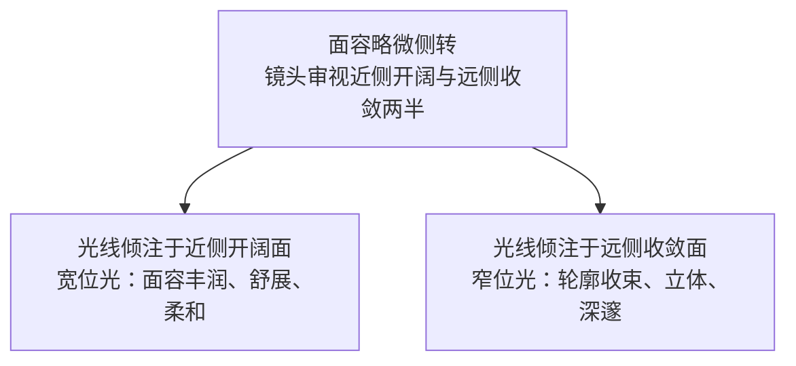

# 第 7 章 人像

> 人像从来不只是把一张脸拍清楚。真正进入画面的，是你和被拍者之间正在发生的关系。

---

## 人像从关系开始

一幅真正打动人心的人像，极少诞生于被摄者刚刚落座、神情严阵以待的开端。在镜头竖起的最初几分钟里，人几乎会本能地启动精密的自我防卫与形象管理：肩膀该端平还是微沉，嘴角是否该牵起礼貌的弧度，目光该直视镜头还是投向画外，无处安放的双手又该摆出怎样的姿态。此时他在潜意识里调动的，是一整套关于“自己应当如何被观看”的社会化想象。在这一阶段，你固然能轻易斩获清晰、端正乃至无可挑剔的画面，然而那往往只是一个人面对被凝视的压力时，主动递交出来的一副妥帖面具，而非其生命本真的居所。

真正值得屏息守候的，是面具在某一瞬悄然滑落的裂隙。这样的时刻往往降临得轻若微风：或许是他低头拨弄袖口的片刻出神，或许是转头与旁人搭话时的哑然失笑，又或许只是目光从逼仄的取景框上移开，散淡地落向窗外流转的天光。无论由何而起，其共通的玄机皆在于——注意力在那一秒决绝地脱离了相机。正是这稍纵即逝的间隙，人卸下了“正在被拍摄”的繁重表演，紧绷的骨骼与肌肉悄然舒展，生命原本的质地与神采才得以破土而出。

人像摄影最深沉的魅力，恰恰深植于这层心理空间的舒展与坦诚。懂光位、谙透视、精研焦段与景深，固然是每一位执机者不可或缺的底层造诣；然而从终极的视觉哲学审视，一切光学技巧终归只是渡船。它们的全部使命，皆在成全画面中的对象成为一个有呼吸、有尊严、不可替代的真实生命，而非沦为受制于创作者摆布的僵死符号。技术永远应当为真实的神采让路，而非反客为主。

---

### 当照片反过来看你

*Lewis Hine, "Girl Spinner, Rhodes Manufacturing Co.", 1908。Hine 的原始记录称这位北卡罗来纳纺织厂女童工 11 岁。她在纺纱机旁停下来，厂房的窗光从画面左边进来，照到她的头发、肩膀和脏围裙上。她侧对镜头，目光望向窗的方向，不微笑，也不摆姿势。Hine 为 National Child Labor Committee 长期记录童工；这些照片与调查、倡议和立法行动一起改变了公众讨论。1916 年，美国通过 Keating-Owen 童工法案，该法两年后被最高法院裁定违宪；在联邦司法体系内针对童工的限制，直到 1938 年《公平劳动标准法》才获得更为稳固的根基。[图片来源与复用说明](image-credits.md#hine-spinner)*

1908 年，刘易斯·海因（Lewis Hine）受美国国家童工委员会（NCLC）委托，携带着沉重的 5×7 大画幅相机与易燃的镁粉闪光灯，冒着被驱逐与殴打的风险，伪装成火灾保险调查员或机械商人，悄然潜入北卡罗来纳州林肯顿的罗兹纺织厂。在这幅被命名为《纺织女童工》（*Girl Spinner, Rhodes Manufacturing Co.*）的传世之作中，海因并未将镜头推近至猎奇的惨状特写，而是后退数步，以一种庄严、克制而深怀悲悯的中景视点，定格了一个年仅十一岁的小女孩。

整幅影像在形式与光影上构筑了震撼人心的戏剧张力。画面右侧，两排高大、冰冷、宛如无尽长廊般向远方纵深延伸的庞大棉纺机，以近乎压倒性的工业透视牢牢统御着空间；而在庞杂的机械轮轴与无数高速旋转的纱锭之间，身材瘦削得令人心碎的女孩静静伫立。来自厂房左侧高大排窗的自然天光，如洗礼般倾泻而下，温柔地勾勒出她蓬松凌乱的发丝、单薄的肩胛，以及那件落满棉絮与油污的粗布围裙。她没有在机器前机械地劳作，也没有顺从于镜头去伪饰欢颜，而是微微侧过身躯，将平静、清澈却深不见底的目光投向画外的窗棂——投向那扇连通着童年、微风与自由日光的窗户。

海因的伟大，在于他从未将底层的苦难沦为廉价的煽情。在这张照片中，小女孩不是一个被动等待救赎的受难客体，而是一个拥有绝对精神尊严的独立个体。在资本机器轰鸣吞噬一切的厂房深处，她以一种超越年龄的沉静凝视反观着世界，也反观着百年后站在取景框另一侧的我们。这张照片与海因拍摄的数千张童工纪实汇聚成无可辩驳的历史铁证，直接推动了美国针对童工立法的变革，更从根本上重新定义了人像的道德厚度：摄影不是侵夺，而是一次平等的注视；真正的肖像，拥有穿透时代迷雾、叩问人类良知的永恒目光。

---

## 技术之前，先建立信任

探讨人像，必须从拍摄者与被摄者之间的精神契约切入。这层隐秘的关系看似游离于曝光和构图之外，实则决定了整幅影像的精神命脉：关系不同，你在画面中承担的伦理分寸迥异，能掌控与不可掌控的边界亦截然不同。

当被摄者明确知晓镜头的存在并愿意全力配合时，影像便归入**摆拍肖像**的范畴。商业写真、时装大片、正式肖像与家庭合影皆属此列。在这层协作中，摄影师享有最高的调度权：光线的质感、形体的朝向、神态的微调、环境的取舍乃至衣饰的褶皱，几乎皆在执机者的掌控之中；与此同时，被摄者通常怀揣着清晰的审美期待，渴望被交付一副理想化的形象。摆拍肖像绝非艺术上的下乘之选，它只是重构了创作的权责，要求摄影师以高超的形式直觉与调度造诣，去提炼一个人精神气质的结晶。

当被摄者置身于其赖以生存的真实原生场域——木匠立于木屑飞扬的工坊、医生坐于堆满病历的诊室、长辈倚于炊烟缭绕的灶台、画家隐于画布斑驳的画室，照片便升华为更为深邃的**环境肖像**（environmental portrait）。在这类创作中，你无法将空间背景简化为无关痛痒的陪衬，因为环境本身就是与人物并驾齐驱的叙事主角。阿诺德·纽曼（Arnold Newman）1946 年为作曲家斯特拉文斯基（Igor Stravinsky）拍摄的名作，堪称环境肖像的丰碑：画面中，三角钢琴高高支起的黑色琴盖被压缩成一块巨大、坚硬且带有尖锐几何张力的黑色块面，如同一枚被无限放大的音符或现代主义抽象画布，将作曲家紧凑的身躯稳稳压在画面的左下角。这张照片并未执着于精雕细刻人物的面容，而是将创作者与其所创造的宏大声响宇宙凝铸为不可分割的几何共鸣。

还有一类人像，诞生于被摄者未曾察觉、或是察觉却无暇顾及的真实流动之中。街头行摄、家庭抓拍与社会纪实大抵归于此途。在这层关系中，摄影师的主动控制权被压缩至极限，决断的重量几乎完全倾注于时机与距离的拿捏。薇薇安·迈尔（Vivian Maier）在芝加哥担任保姆的漫长岁月里，手持禄来双反相机在街头捕获了数以万计的面容，大多数路人甚至终生未曾察觉自己曾被光影永久定格；索尔·雷特（Saul Leiter）倚在二楼工作室的窗边，隔着凝结水汽或落雪的玻璃凝望东十街，匆匆掠过的行人只是偶然而诗意地穿行过他的画面；海伦·莱维特（Helen Levitt）则在徕卡相机上装配了特制的直角取景棱镜，漫步于纽约东哈莱姆区的街巷，在孩童浑然不觉中记录下最纯真未凿的街头游戏。这些大师的共通智慧，在于懂得在现实面前收敛相机的攻击性，主动退居为一个不惊扰岁月的观察者，静候生活自身步入画框。

从摆拍肖像入门是极为自然的路径，因其易于调度且成片稳定；然而随着视界的开拓，你终将领会：那些脱离了绝对掌控的瞬间往往蕴含着更坚韧的生命力。在那些毫无防备的间隙里，表演的成分被剥离殆尽，显影出来的方是一个人未经驯化的真实灵魂。

审视这三重关系，亦揭示出一项贯穿全章却极少被正视的伦理命题：人像摄影从来不是一场绝对对等的交涉。相机握在你的手中，按下快门、挑选底片乃至公开展出的权力皆属于你；而对方交托出的，则是其最不可让渡的容颜与尊严。这份不对称性赋予了摄影师沉重的道德责任。若要立下长久的创作准则，几条底线当深植于心：在公共空间拍摄前，尽可能报以尊重的致意，哪怕只是一个温和抬举相机的探询眼神；成片之后，若有机缘，向对方回放或赠送底片是极为珍贵的善意；若涉及商用出版，一纸规范的肖像授权协议并非繁文缛节，而是对彼此人格的庄严守护；而在后期暗房或数字修图时，抚平临时瑕疵与彻底改头换面之间有着明确的界河——一旦越过真实面孔的肌理，你呈递的便不再是他的肖像，而是创作者傲慢的投射。理查德·阿维顿（Richard Avedon）在创作《在美国西部》（*In the American West*）时，将矿工、屠宰场工人与漂泊者拉至苍白无物的背景板前，以冷酷锋利的焦点将他们面容上的沧桑沟壑毕现，出版后引发了艺术界长达数十年的伦理激辩。这一质问当常驻于每一位摄影师心头：你镜头下的人物，能否认领照片中的自己；而认出之后，又是否甘愿以此种面目留驻人间。

---

## 光怎样塑造一张脸

第二章已系统阐述过光线的方向、软硬与反差；在此处，这些物理量不再是抽象的参数，而是一柄柄雕刻面容的手术刀。凝视一张面孔，执机者当先审视三处核心：鼻影投向何方、暗侧是否葆有通透的呼吸层次、瞳孔深处是否点亮了凝聚生气的眼神光。顶光、底光或是直射硬光皆非禁忌，它们会毫不留情地揭示眼窝骨骼、皮肤肌理或是制造陌生疏离的心理张力；只要这恰是人物特质与叙事意图所需的形式语言，便可坚定驱策。

主光源仅需挪移数寸，颧骨与鼻梁的阴影便会随之改换形态。摄影先驱将主光自正前方向侧翼环绕的轨迹，提炼为四组经典的光影坐标；它们绝非不可逾越的戒律，而是便以心领神会的视觉语法：

| 布光法 | 主光位置 | 视觉特征与审美意蕴 |
|---|---|---|
| 蝴蝶光（Paramount） | 正前方、略高于眼平 | 鼻翼下方投射出一抹小巧对称的蝴蝶状阴影，收窄两颊，明艳端庄，经典影星写真常法 |
| 环形光（Loop） | 侧前约 45°、略高于眼 | 鼻侧留下一道含蓄闭合的小弧圈阴影，温润自然，最为广泛从容 |
| 伦勃朗光（Rembrandt） | 侧前约 45°、角度更高 | 暗侧脸颊勾勒出一枚标志性的倒三角光斑，兼具戏剧张力与古典油画沉郁质感 |
| 分割光（Split） | 正侧 90° | 面部被利落划分为明暗各半，冷峻硬朗，具雕塑感与抗衡力量 |

将这四种坐标并置审视，本质上是主光源由正面逐步绕行至正侧方的渐进位移。越贴近正面，光感越平坦，阴影被压缩至最小，人物显现出柔和、无瑕且易于亲近的甜美；越转向侧翼，阴影漫卷展开，骨骼轮廓随之深刻硬朗。早在按下快门之前，仅仅是决意将那一束光安放于何种角度，你便已经在无声中为这张面孔锚定了抒情抑或沉郁的精神基调。

在阴影的几何形状之外，还有一项左右肖像神韵的根本法则：当被摄者的面庞略微偏转时，光芒究竟落在距镜头较近的那半张脸上，还是落在偏转背离镜头的远侧。这便是古典人像构架中的**宽位光**与**窄位光**。

宽位光（broad lighting），指光线全面铺展于靠近镜头、亦即在画幅中显露面积更为开阔的那半侧脸庞。它将面容撑得饱满、明朗而相对平顺，极其契合面庞清瘦、下颌狭窄的对象，抑或创作者意欲传达温厚、丰润的心境；反之，窄位光（short lighting）则将光线倾注于转开背离镜头的远侧面庞，将朝向镜头的这一侧大半隐于阴影。阴影如暗色的披风收束了两颊的轮廓，五官的立体起伏被最大程度地托举而出，情绪内敛沉静，往往成为严肃肖像创作中更为偏爱的选择。

| 光型取向 | 受光面分布 | 空间观感与情绪 | 适用心境与面部特质 |
|---|---|---|---|
| 宽位光 | 朝向镜头的开阔面 | 面颊饱满、反差平缓、温厚 | 面形偏瘦狭窄；传达舒缓安详之态 |
| 窄位光 | 背离镜头的远侧面 | 轮廓收敛、雕塑感强、沉郁 | 绝大多数面容；雕琢骨骼与深邃内省 |

光斑形状与宽窄朝向是两重可以自由复合的画笔：前者定下阴影的构图骨骼，后者决定光芒依附于面部的哪一段纵深。临场之际，往往先请被摄者微侧面庞，继而审度光源掠过的侧向，两者浑然交融，方能落笔定下画面的丰瘦与情绪。

确立了主光的方向，紧随其后的抉择，是暗侧究竟该沉沦至何种幽暗。此即**光比**（lighting ratio）的分寸。光比衡量的是受光亮部与背光暗部之间的照度落差，明暗每相差一档曝光，比值便翻增一倍。

| 亮侧与暗侧落差 | 光比 | 视觉质感与情绪刻度 |
|---|---|---|
| 0 档（照度相若） | 1:1 | 洁净平整、柔和无欺，近于日光漫射或标准证件照 |
| 1 档 | 2:1 | 浮现轻盈立体的微澜，温润而葆有常态细节 |
| 2 档 | 4:1 | 骨骼清晰挺拔，戏剧冲突与沉稳分量兼备 |
| 3 档及以上 | 8:1 及以上 | 强烈明暗撕裂，暗部深邃如夜，极富神秘与肃穆 |

调校光比绝非改动整幅画面的总体曝光，而是在雕琢明与暗之间的落差阶梯。在此延用第二章确立的基准，直接度量面部受光与背光两侧的最终反射亮度。光比是决定肖像趋向明媚舒展还是深沉悲悯的核心转轴：当两端趋近等亮，画面流淌着安详与宁谧；而一旦阶梯拉开，人性的复杂与幽深便随之在阴影中盘桓涌现。

在宏大的光影反差之外，尚有一处极其微渺、却能一瞬定乾坤的细节——**眼神光**（catchlight）。它是光源在晶状体表面留下的镜面反光。在浩瀚的画幅中，它往往微若针芒，然而一旦遗失，双眸便会沦为黯淡发钝的玻璃球，整座灵魂的门户随之闭锁；只要那点微芒跃动，目光便骤然被赋予了灵动的呼吸。

眼神光的位置是主光源在眼眸上的忠实映照。摄影师惯以钟面方位度量其分寸：落在十点或两点的斜上方位置最为自然舒展，神采奕奕，恰与斜上方洒下的理想主光浑然相合；若滑落至下方的六点方位，多半是失控的底光在滋生诡异与不安；若双眸全然不见微光，则昭示着光位过高过偏，或是被摄者低垂额头将其遮蔽殆尽。

若要唤醒眼中的微光，最从容的办法是请对方将下颌微微迎向光源，或是在近侧低位铺展一块白色反光板、乃至一页白纸，将柔和的反射轻轻点入眼底。光源的物理尺度亦在此展露无遗：宽阔的漫射天窗或柔光箱在眼中化作一泓温润的月牙，裸露的灯珠则凝成刺目的锐点。瞳孔中的倒影，早已不动声色地泄露了执机者布设光影的全部秘密。

---

### 读一张经典肖像

*Nadar，莎拉·伯恩哈特，约 1864。Nadar 是 19 世纪最重要的肖像摄影师之一，许多巴黎文人、画家和演员进过他的影楼；他常使用影楼天窗的自然光。这张照片里，光从斜上方落下，照亮额头、鼻梁和一侧脸颊，另一侧自然沉进阴影，颈部和披风都没入暗处，只剩一张脸和一段肩颈被光拎出来。一个多世纪过去，这种由方向、明暗比例与背景控制共同形成的人像光仍然有效。[图片来源与复用说明](image-credits.md#nadar-bernhardt)*

约 1864 年，在巴黎卡普辛大道三十五号那间拥有巨大倾斜玻璃天顶的影楼里，加斯帕尔-费利克斯·图尔纳雄（Gaspard-Félix Tournachon，世人皆称其为“纳达尔”，Nadar）迎来了年方双十、初出茅庐的法兰西喜剧院女演员莎拉·伯恩哈特（Sarah Bernhardt）。在那个维多利亚式影楼风靡以繁复画幕、科林斯罗马柱石膏道具与天鹅绒扶手椅堆砌资产阶级虚荣的时代，纳达尔以一种惊世骇俗的现代性叛逆，将一切浮华道具扫荡一空。背景被纯粹的沉暗虚无取代，年轻的伯恩哈特被一袭粗织的深色斗篷如古典雕像般层层裹挟，将观者的全部视线死死锁扣于她的头颅与一段优雅倾斜的肩颈。

主宰这幅肖像灵魂的，是纳达尔对天顶北向漫射天光的极度掌控。天光自斜上方从容倾洒，犹如文艺复兴雕塑大师手中的凿刀，极其精微地摩挲过伯恩哈特饱满的额骨、挺拔的鼻梁与一侧微扬的脸颊。这是古典伦勃朗光与窄位光（short lighting）近乎天衣无缝的交响：受光面积较小的远侧脸颊被提亮为莹润的视觉核心，而靠近镜头的大半侧面部与下颌则沉入深邃却保留着通透呼吸感的阴影之中；卷曲蓬松的发丝在半明半暗的明暗交界线上泛出微茫的光泽，那双微微凝望画外的眼睛里，两枚精准落于斜上方的眼神光，赋予了整副面孔不可名状的梦幻与警醒。

纳达尔晚年在其回忆录《当我曾是摄影师时》（*Quand j'étais photographe*）中写下了一段人像摄影史上的无上箴言：“摄影的机械与光学原理，任何人花上一两个小时皆可精通；然而关于光的感觉、对光线落于脸庞不同质感的辨析……尤其是与被摄对象建立道德上的共鸣、以敏锐的心智瞬间把握其性格本质的能力，是任何技法手册都无法传授的。”在伯恩哈特尚未成为日后君临欧洲舞台的一代戏剧女王之前，纳达尔的这束光，便已借由光影的雕塑与灵魂的洞悉，提前在湿版底片上为这位旷世名伶铸就了永恒的神性。

---

### 窗光的距离与方向

在一切人造光源之上，流转的天光与一扇明窗永远是造物恩赐的至美工坊。在此不妨将窗光细致拆解，从站位直抵成片，完成一次对自然光影的虔敬操演。

**其一，挑窗与辨天。** 寻觅一扇避开烈日直射、天光平缓纯净的窗户。直射烈日往往过于酷烈刺目，此时拉上一层轻薄的白色纱帘，窗户便瞬间化作一面巨大的天然柔光屏，将刚硬的阴影抚平为渐变的青灰。若在室内借用人工光源，务必选用阻燃且保持安全间距的专业柔光介质，切莫将易燃纸布贴附于高温灯头之上。

**其二，定夺距离与角度。** 引导被摄者侧向立于窗前，将面庞迎向天光，一侧受光，一侧自然隐入阴影。当人物步步靠近窗棂，窗户在人物视角中所占的立体包围角愈发广阔，光质愈发温润柔滑，包裹感极强；与此同时，近侧脸庞到远侧脸颊的距离落差显著，明暗光比往往更为鲜明。若将人物引向房间幽深之处，光量衰减而方向趋于聚拢，此时需综合考量室内四壁的漫射与反差。无须急于背诵公式，请被摄者前后挪移半步，静心观察其鼻影拉伸、下颌暗面以及背景深浅的连带流变。

**其三，斟酌暗部之补与抑。** 窗光是纯粹的单侧光源，暗侧往往坠入浓墨。若企求温润安详的语汇，便在背光一侧架设一面白色反光板、抑或利用浅色墙体，将天光轻柔反哺回暗颊，收束光比；若渴求半边面庞沉沦幽暗的冷峻戏剧感，不仅无需补光，甚至可在暗侧悬挂一袭黑色呢绒或深色厚呢，阻绝一切环境杂光，将阴影压榨得愈发纯粹坚实。

**其四，裁定机位与光型。** 渴求窄位光的内敛，便将机位移至暗侧，让沐浴在天光中的远侧面庞占据画幅；移至亮侧，则收获宽位光的丰朗。两者各具美质，重在执机者清醒知晓机位转换所赋予面容的精神分量。微调面庞使眼眸捕捉到窗光的微澜，再依循拍摄距离与景深意图裁定光圈。对焦不必死板定位于“近侧眼眸”：当两眼不在同一焦平面时，应当以承载情绪与叙事灵魂的那只眼睛为准绳。

迈过窗光的门槛，人工光影的最小完备系统亦触手可及：一支可离机引闪的闪光灯、一柄白色透光柔光伞（或便携柔光箱），以及一面折叠反光板。伞面撑开了点状光源的发光面积，灯架奠定了光线的高低与投射夹角，反光板则掌控着暗部的喘息。在相机的同步速度界限之内，快门速度的主宰在于调控环境天光的渗入多寡，而光圈与闪光输出功率则牢牢统御着主体的受光丰度。以手动模式从低功率逐级试探试拍，凝视每一次光影咬合的肌理，远比死记硬背枯燥的输出指数更具实效。

---

## 景深要服务于关系

景深所丈量的，绝非单纯是背景虚化的浓淡多寡，而是人物与周遭世界所维系的精神距离。f/1.4 至 f/2 的极浅景深，将周遭万物尽数溶解为梦幻般的朦胧色块，唯独托举出一具无处可藏的五官；这种视点具备惊心动魄的亲密，却也极其脆弱——它将人物从其所栖居的现实网络中彻底剥离，且对焦容错极低，稍有微澜便可能让眼眸失焦。f/2.8 至 f/4 则稳健而温润得多，既能柔化背景杂芜，又能完整保全整副面容的立体骨骼；而行进至 f/5.6 至 f/8，景深便从物理参数升华为了叙事语汇：若环境本身便参与着人物命运的诉说，你便决不能以虚化将其草草抹去。

初学者常有一重迷思，以为唯有将光圈开至极致，方显人像之能事。然而盲目沉溺于浅景深的代价显而易见：鼻尖与耳廓往往化作虚妄，整幅画幅除了孤零零的一张面孔外荡然无存。与其背诵僵化的数值模板，不如先在心底叩问：在这副面容与当下的情境中，究竟有哪些细节承载着灵魂？是眼角的微澜、抿紧的嘴唇，还是身旁那排陪伴他半生的工具架？可借助景深预览或[景深估算工具](tools.md#dof-calculator)建立宏观预期，焦距、画幅、站位与观看尺寸皆在共同裁决着最终的景深质感。

焦段的选择，本质上是你在心理距离上如何划定与被摄者的交往尺度。24mm 至 28mm 具备强烈的现场张力，将人物牢牢锚定于广阔的生活原野中，只须警惕不可过分贴近面庞；35mm 宛如隔着一张茶几相对而坐的促膝长谈，环境与人平分秋色；50mm 恬静内敛，如同一双懂得聆听的克制双眼，半身之间皆是对话的温度；而行进至 85mm 与 135mm，焦段便化作了专注深沉的凝视，它压缩了背景纵深，将人物从尘世喧嚣中静穆提纯。

归纳等效焦距的实践图谱，亦是为了在临场决断中更加从容：等效 85mm 至 135mm 是经典人像的基石，透视平实端庄，背景收拢利落；等效 50mm 适度拓宽视野，留存人物寄居的空间；而等效 35mm 及更广视场固然能容纳宏阔场景，然而一旦迫近面庞，边缘强烈的透视拉扯极易令鼻梁与额头变形。若非刻意追求戏剧性的视觉冲击，广角近摄当极其审慎。

在此更须正本清源：许多人误以为是长焦制造了“面部压缩”、广角制造了“五官拉伸”，仿佛透视是镜头的光学幻术。事实恰恰相反——**真正决定面部透视关系的从来不是镜头焦距，而是相机与面孔之间的物理距离**。

透视的本质，是画幅中近景与远景物象在比例上的相对尺度。当你逼近至三四十厘米的极端近距，鼻尖距镜头的距离远比耳朵近得多，这种夸张的前后物距比例差必然将五官撕裂拉扯，令脸庞外扩变形；而当你从容退至两三米开外，鼻尖与耳廓到镜头的物理距离已相差无几，前后比例趋于平缓均等，面容方得恢复其天然的和谐端庄。距离决定了透视与美感，焦距所决定的，不过是在该距离下裁切取景的开阔与紧凑。选定镜头，本质上是在裁定你想站在离他多远的空间去关照他的存在。

| 等效焦距 | 头肩肖像之大致拍摄距离 | 面部透视观感与美学取向 |
|---|---|---|
| 24mm | 约 0.7 米 | 鼻部剧烈前凸、脸颊外扩被拉扯，具戏剧张力与荒诞感 |
| 35mm | 约 1.0 米 | 略带透视夸张，现场纪实与环境卷入感强烈 |
| 50mm | 约 1.5 米 | 近距交流视点，亲切自然，环境与人物有机交融 |
| 85mm | 约 2.5 米 | 五官比例舒展端庄，背景适度收拢，经典沉稳 |
| 135mm | 约 4.0 米 | 透视极为平顺舒展，背景高度压缩，具纯粹凝视感 |

机位的高低俯仰亦承载着微妙的心智暗示。平视最显诚笃与平等，不偏不倚；微仰机位赋予人物挺拔沉稳的仪态，微俯机位则令神态温婉谦和。然而凡事皆有其度：过度仰拍会将鼻孔与下颌推向侵略性的前端，过度俯拍则易沦为头重脚轻的滑稽变形。沉淀于实战的从容尺度，可概括为朴素的视线基准：特写头像，镜头大致齐平眼眸；半身造像，齐平胸膛；全身造像，则当躬身齐平腰际——唯有将机位沉至腰际，向下的透视才不至将双腿无情压缩，还形体以舒展的挺拔。

---

## 把人物从背景里分出来

将人物从背景的芜杂中唤醒，绝非单纯倚赖一枚大光圈便能一劳永逸。在执机者的调色盘上，实则依凭着三组各自独立的枢纽相互咬合：

其一为光圈，它调控着弥散圆的扩散尺度，却切莫滥用至五官模糊难以两全；

其二为纵深距离，它包含“执机者距人物之近”与“人物距背景之远”两重尺度。即便手持 85mm 镜头开至 f/2，若人物背脊紧贴石墙，墙面依然毕现；唯有引导人物向前迈出数步，将背景推向远方的纵深，空间自会如晨雾般优雅融化。欲分清主次，第一直觉永远应当是拉开主体与背景的物理纵深；

其三为明暗与色彩的图底反差（figure-ground relationship）。浅色面容衬于幽暗阴翳，墨色发丝立于明窗之前，光影的反差自会将轮廓利落托出；反之，若衣着面容与斑驳杂乱的背景混为一谈，再浅的景深亦难以挽救画面的浑浊。

群体合影的成败，核心在于对景深平面的精准分配。若队伍错落排布，收敛光圈（f/5.6 至 f/11）是保全细节的基石。而更为玄妙的临场智慧，是打破机械僵直的一字横排，引导众人形成一道以相机为圆心的柔和微弧——两翼人物微微前移半步，使每一张面庞至镜头的物理距离趋于均等，从容化解景深边缘的虚焦风险。焦点不宜盲目锚定中排，当依循首尾面孔的实际间距测算景深覆盖。

| 人员规模与排布 | 起手推荐光圈 | 现场调度与构图智慧 |
|---|---|---|
| 两至三人、大致成排 | f/2.8 - f/4 | 引导微弧站位，面部至镜头距离均等 |
| 单排四至五人 | f/4 - f/5.6 | 保持内弯弧度，两端切莫后缩退入虚焦区 |
| 两至三排错落合影 | f/5.6 - f/8 | 测定前后极值面孔，将对焦点置于纵深黄金比例内 |
| 多排庞大合影 | f/8 - f/11 | 借助阶梯制造高低错落，极力压缩前后实际物理纵深 |

合影面对的最大敌人，往往是眨眼的瞬息与神情的涣散。人数越多，单张内全员目光如炬的概率越呈指数级坠落。应对之法在于节奏的掌控：口令声起，在节奏的间隙果断按动，避开众人神经紧绷或骤然松懈的闭眼盲区；开启短促连拍捕捉数帧，为神情的甄选留足余地；成片后务必在液晶屏上放大审视各人神态，临场重立的微小代价，远胜于归途面对无可挽回之废片的懊恼。

---

## 表情来自安全感

人像创作中最幽微难驯的关隘，从来不在于光圈与焦距的几何运算，而深植于被摄者内心的安全感。

指令式的催促往往是神采的毒药。“笑一下”只会催生肌肉的抽搐，“看镜头”极易招致本能的戒备，而“自然点”更是天下最令人生硬的咒语。

高明的引导，在于将拍摄消融于日常的交谈与具体的行为之中。不必发出抽象的禁令，而是赋予其明确而习惯的微小动作：“望一眼窗外掠过的飞鸟”、“低头整理一下腕表”、“端起热茶轻抿一口”、“随意将身体斜靠在墙边”。当身体有了明确的寄托，因被审视而滋生的防御机制便会悄然瓦解。

有时一句“不必理会镜头，我自会捕捉那一刻”，便能将沉重的表演包袱彻底卸去。从拍摄手部、背影、或是整理器具的动作开始，让清脆的快门声如雨打芭蕉般化作环境的背景音；待其肩膀松弛、呼吸舒缓、眼眸的焦距真正沉静下来，灵魂的门户方才豁然洞开。

心理学所谓的“杜氏微笑”（Duchenne smile）——由颧大肌提拉嘴角与眼轮匝肌收紧眼角共同编织的真挚笑意，从不是靠严词逼迫出来的，它是内心真正安宁与被接纳时泛起的涟漪。摄影师要做的，不是索取笑容，而是营造一片让人敢于袒露真我的温厚场域。

---

### 用动作代替僵硬摆姿

形体的舒展，有其底层的肢体律动：

其一，**切莫正面对撞镜头**。正面僵立会将身躯展至最宽，亦最显机械。请对方将身体偏转三十度左右，将重心沉落于后脚，肩线与焦平面形成微妙的错落，形体立刻显现出优雅的层次与放松感；

其二，**微曲关节以释重负**。手肘、膝盖与腕关节皆保留若有若无的弯曲，僵直的肢体传递紧张，微曲的骨骼方能流淌出呼吸的从容；

其三，**微送额颈以雕轮廓**。紧张常致使人不自觉地缩颈收颌，导致面容松弛甚至显现双下巴。引导对方将额头微微前探、下颌微沉，虽初感微怪，却能在镜头前铸就极其紧致利落的下颌线条；

其四，**借由物件安顿双手**。无处安放的双手往往是局促的发源地。托起茶盏、轻抚衣领、翻阅书页、信手插袋，乃至轻触下巴——一旦双手寻获了动作的归宿，全身的神经便会随之从容安定。

---

## 环境人像要留下语境

环境人像的深意，在于让空间与器物开口言说，共同谱写一曲人与其所属世界的默契交响。此处的焦点，绝非仅停留于一张孤立的面孔，而是探寻一个人与这片场域经年累月浸润出的血脉关联。

凝视木匠，工坊中飞扬的刨花、磨出温润包浆的角尺、刃口泛着寒光的凿刀，皆是其形体的延伸；凝视画师，未干的油彩画布、斜倚墙垣的旧作、斑驳龟裂的围裙，本身就是其精神的具象显形；凝视暮年的长辈，黄昏厨房里翻滚的白气、磨损的案板、那把被岁月摩挲光滑的藤椅，皆沉淀着生命的温度。在这些画面中，环境从不是被动退居幕后的舞台布景，它以物象的沉静肌理，印证着一个人究竟怎样辛劳、怎样思索、又怎样将自身的生命力浇铸于眼前的方寸天地。

调度环境肖像的玄机，在于打破“先安顿人物、后仓促塞入背景”的惯性，反其道而行之：执机者当先在这个空间中找寻出那一两件不可或缺的精神物证，构筑好空间的骨架与透视关系，继而将人物轻轻安放进这个早已成立的场域中，请他重回平日最习惯的劳作姿态。先定环境，后安人物，显影出的方是“一个人栖居于他的世界”；反之若先框定面庞再扫入背景，周遭便极易沦为芜杂喧闹的视觉噪音。环境人像多倚重等效 28mm 至 35mm 镜头，光圈收束于 f/4 至 f/5.6，让细节从容呼吸；既然意在诉说人与空间的共生，便切莫急躁地用大光圈将生活的注脚化为虚无。

---

## 抓拍、家庭与儿童

抓拍人像将执机者抛入流动的生命现场，面对着截然不同的伦理与机缘。

街头抓拍直面的是茫茫人海中的陌生过客。最根本的戒尺在于尊重：切莫躲藏在极长焦距之后作鬼祟的窥视，亦切莫专挑有损人格尊严的窘迫瞬间按下快门。若被对方目光察觉，坦然报以温和的致意与微笑；若对方心生芥蒂要求删除，当从容照办，绝不纠缠。此外，世界各地针对公共空间肖像权的法律边界迥异，有的地区享有充分的街头记录自由，有的国度则对肖像传播设立了严苛的司法红线，行摄之前必须明晰当地规则（此节将在第八章深入探析）。

家庭抓拍最易捕获未曾设防的本真神采，因你本就是亲历者与同行者。器材无须繁冗：35mm 或 50mm 定焦、大光圈配合适度快门底限，或是 Auto ISO 模式，皆足以应对瞬息万变的生活。此处的关键不在器材，而在心境：你不是在“主持一场仪式化的摆拍”，而是作为家人隐于日常的流光之中，随时准备为爱与记忆静静收纳某一刻的微芒。

面对活动与仪式中的纪实抓拍，任务的严密性便升华为首位。双机身分别搭载标准变焦与中长焦变焦、连续对焦、敏捷连拍，构成了可靠的装备底座。然而凌驾于器材之上的，是对事件脉络的先验知觉——绝不能做一个气喘吁吁追赶事态尾声的尾随者，而当提前半步驻足于情绪即将决堤、高潮即将绽放的必经之地，静候画面的自行圆满。

与孩童同行，成人的规训往往一触即溃。“看镜头、笑一个”的催促只会扼杀灵性。第一要义，是彻底蹲下身来，将镜头降至与他们眼眸平齐的水平线。站立俯拍只能收获扁平的头顶与空旷的地板；唯有躬身平视，世界的比例才真正回归童稚的尺度。快门速度需果断拉升至 1/500 秒乃至更高，宁可推高 ISO 承受适度噪点，亦不可换来一幅模糊的废片——孩童奔涌的生命力从不在原地驻足。引导孩童切莫施加表演的任务，赋予其一捧细沙、一只皮球、或是一项探索的谜题，让动作在沉浸中自然生发。尊重其不可预测的天性，尊重他们面对镜头时偶尔显露的羞怯与退却。

---

## 自拍也是严肃练习

自拍绝非自恋者的专利，在严肃摄影谱系中，它是最纯粹、亦最严酷的视觉自我解剖。

薇薇安·迈尔（Vivian Maier）在漫长的行摄岁月中留下了连绵不绝的自拍影像：清晨商店橱窗的叠影、公寓镜面的折光、街头车辆后视镜中微小的投影，乃至一束斜阳投射在墙垣上的修长剪影。她以不可思议的冷静，反复探寻自己的形骸如何嵌入城市光影的几何裂隙。[档案方公开的自拍作品](references.md#photography-history)清晰记录着这条绵延的线索。辛迪·舍曼（Cindy Sherman）自 1977 年启幕的《无题电影剧照》（*Untitled Film Stills*），更是将自拍推向了观念艺术的巅峰：她化身不同的假发、服饰与神情，在近七十幅画面中扮演着惊惧的家庭主妇、出神的都市女郎或失落的名伶。那些充满张力的画面无一对应任何一部真实存在的胶片，她以自己的血肉为画布，深刻拆解了大众媒介与流行文化如何编织并囚禁女性的社会形象。

自拍之所以是极佳的修行，在于执机者将控制权与承受权集于一身。在三脚架与延时快门之后，你必须迫使自己跳脱出日常照镜子时被驯化的主观幻觉，站在取景框之外冷峻地审视自己。这不仅是对光位、光比与焦距最直接的肉身丈量，更是一场深刻的同理心淬炼：当你亲自尝过直视镜头的冰冷局促、强光晃眼的眩晕、以及不知双手何处安放的惶恐，下一次重新站回相机之后，你对镜头前那个僵硬的面孔便会油然而生无尽的体谅与宽容。你所发出的每一句呢喃引导，也将真正贴着一颗敏感的心灵徐徐展开。

---

## 对焦优先级与例外

在传统肖像的凝视法则中，眼眸是不可撼动的灵魂锚点。它是强烈的审美默认，却非不可打破的教条：当虚焦本身承载着恍惚迷离的心绪，抑或叙事的重心决绝地倾注于交叠的双手、飘动的衣褶或隐喻的物件时，面孔的虚化反倒能滋生出留白的诗意。在使用大光圈近摄时，景深薄如蝉翼，眼部优先对焦（Eye-AF）能极大地解放双手；当面庞转侧、两眼不在同一焦平面时，通常优先锁紧靠近镜头的那只眼眸，因观者的目光本能地会在此处率先落锚。若发现虹膜边缘发软，收敛一档光圈或微调面孔角度，远比屏息赌博更为从容。

肤色的曝光同样需要褪去机械教条。切莫以固定灰阶去生搬硬套不同人种与气质的肤色，更不可用粗暴的“亮加暗减”替代审慎的观察。依托 RGB 直方图审视红、绿、蓝各通道的峰值走势，确保额头与颧骨的高光未曾发生任何单通道的死白削波，同时为暗侧肌理留存清澈的信噪比底色。

黑白之于肖像，绝非掩盖色彩溃败的避难所。第四章立下的铁律在此依然如磐石般坚固：唯有当面庞依靠光影的雕刻、骨骼的起伏与岁月的肌理足以傲然自立时，剥离色彩方能彰显其金石般的质感；若画面全凭色彩的甜美维系，转入单色便会瞬间沦为枯槁的尘埃。只有当色彩真正成为叙事的阻碍，黑白的提纯才显现出超越时光的肃穆。

---

## 练习

1. 寻觅一位挚友或至亲，在午后天光澄澈的窗前拍摄三十帧影像。每十张换置一次朝向：完全侧对明窗、正迎天光、以及四十五度半侧。归来挑选五幅最动人的瞬间，详述留存它们的理由。
2. 寻访一位拥有独特行当的匠人或学者，置身其工作场域之中，手持 35mm 镜头创作。画面须兼备三项要素：人物的姿态、昭示其身份的特定器物，以及一处烙印着时光与劳作的细微物证。
3. 约定一小时的肖像拍摄。最初一刻钟严禁将镜头对准面庞，仅专注定格其双手、背影、凝神静坐的轮廓与周遭环境。待快门声与拘谨完全消融，方开启面部创作，体察神情的前后质变。
4. 架设三脚架与延时自拍，完成十幅神态各异的自我造像。十幅影像分别驱动十种截然不同的光位与机位角度。不作发表，仅供自省，剖析最心仪与最抗拒的两幅画面背后的心理机制。
5. 借由单只窗户或单一灯具作为主光源，将其由正前方向正侧翼逐步挪移，依次定格蝴蝶光、环形光、伦勃朗光与分割光四种经典图谱。将成片并置凝视，审视光斑的几何迁徙如何改写面容的甜润与冷峻。
6. 针对同一面孔进行两组透视对照：先逼近至半米之内以广角镜头拍摄特写，再退至三米开外以 85mm 镜头拍摄等大头像。并置审视两者的五官比例，亲身领会“距离主宰透视”的物理铁律。

---

下一章：[第 8 章 街头](08-street.md)

