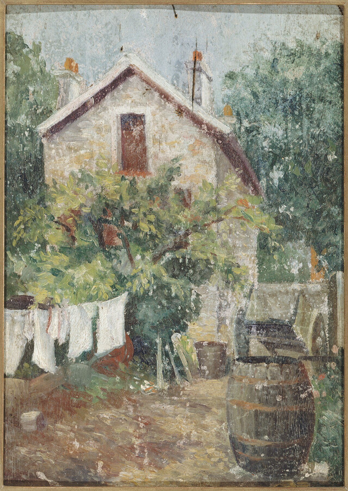

# 第 8 章 街头

> 街头摄影的成片率很低。它练的不是在街上按快门，而是在公共空间里看见正在发生的瞬间。

---

*Eugène Atget 在巴黎拍了三十多年。他从来不自称艺术家，觉得自己的工作是把巴黎在拆迁和改造前留下来。他每天清早五点出门，背一台 18×24 cm 木相机和一打玻璃片，在街上还没什么人的时候拍几张，回家。临死前，他几乎没卖出过多少照片。1927 年他去世后，Berenice Abbott 用 1000 法郎买下他工作室里的几千张底片，运回纽约。后来人们承认的街头摄影，很大一部分就从这种安静、长期、不为发表的观看开始。 (Wikimedia Commons, 公有领域)*

---

很多人把街头摄影理解成在街上拍照。这个说法太宽，也容易把题材带偏。更准确地说，街头摄影是在公共空间里捕捉日常生活的瞬间，被拍者通常不配合，画面也不是事先安排出来的。

它的核心不是地点，而是发生。旅游打卡、朋友在街上的写真、城市建筑特写、没有人的街景，都可以拍得很好，但它们不是这章主要讨论的街头摄影。街头摄影真正关心的，通常是陌生人在公共空间里短暂出现的动作、姿态、关系和痕迹。

---

街头摄影历史里有几条不同的路。知道这些，不是为了背名字，而是为了知道自己在学哪一种观看方式。

早期最被人熟悉的，是黑白、50mm、安静构图和所谓决定性瞬间。Henri Cartier-Bresson 在巴黎圣拉扎尔车站后面拍下跳过水洼的男人，后来成了这个传统最常被引用的例子。Vivian Maier 在芝加哥当保姆，几十年拍了十几万张底片，直到 2007 年底片被人从仓库拍卖里买下，才被重新发现。Saul Leiter 那时已经用彩色拍纽约下东区，但他的街头也常常只在公寓楼下半条街里展开。这一路摄影，重构图、重时机，情绪相对克制。

到了 1950 年代以后，William Klein 把这种秩序打碎。他的纽约很近、很粗、很吵，画面模糊，颗粒重，距离近到能看见鼻孔。那本书在美国被拒绝，后来在法国出版，今天却成了战后摄影史绕不开的书。日本的 Daido Moriyama 接住了这条粗粝的线，把“粗、晃、虚”变成一种主动选择。他拍新宿、野狗、夜街和广告牌，照片里常常有一种城市压到脸上的感觉。Bruce Gilden 更进一步，把闪光灯举到陌生人面前近距离打过去，被拍者那一瞬间的惊愕变成他的标志。这一路不要漂亮，它要的是冲撞、粗糙和不舒服。

后来，彩色街头慢慢进入正统。Joel Meyerowitz 让彩色进入街头和风光的讨论，Martin Parr 用刺眼的闪光灯拍英国海滨度假者，照片里是热狗、泳衣、廉价消费和尴尬。Alex Webb 在墨西哥、海地、伊斯坦布尔拍多层彩色画面，一张照片里有好几件事同时发生：前景有人打电话，中景孩子追球，远处门洞里有人看过来，每个层次都独立，又被颜色和构图牵在一起。

今天每个人都能在街上拍，手机和社交平台让街头图像变得太多，真正稀缺的反而是观看。你不必一开始就决定自己属于哪一路，但至少要知道，街头摄影不是一个空词。它有安静的路，也有粗暴的路；有重几何的路，也有重社会观察的路。先挑一条认真学，比什么都拍一点更容易进入。

---

街头主体大致有三类。

第一类是人。可以是一个人、几个人，也可以是一群人。关键不在画面里有没有人，而在这个人的表情、动作和姿态是否带着信息。一个路人随便经过，不会自动构成街头照片。好的瞬间会让人感觉到，这个人、这个动作和这个场景，在这一秒里真正被看见了。

第二类是场景里的痕迹。人不在画面里，但活动留下来了。一双鞋摆在门口，长椅上忘了的报纸，墙上的涂鸦，窗户里的灯，雪地里的脚印。主角已经走开，画面里留下的是他刚刚在场的证据。Saul Leiter 很多照片就是这种：一把伞在结冰的窗外挪过，一个信号灯在雨里晕开，一只手刚刚从画面边缘退出去。

第三类是公共空间里的几何。线条、影子、建筑切割和人的位置形成关系，人可以很小，也可以没有。香港摄影师 Fan Ho 在 1950 到 60 年代拍中环和上环，常常就是一束斜光打到地上，一个挑担工人走进光里变成黑色剪影；楼梯切出三角阴影，一个学生从顶端走下来。人不是被单独观看的对象，而是被光、墙和街道切进结构里。

你可以三类都拍，也可以先只练一种。先决定自己在找什么，再去街上找，会比漫无目的地举相机有效得多。

---

街头器材的要求不复杂：安静、反应快、不显眼、你不心疼。

Fujifilm X100 系列很适合，23mm 镜头等效 35mm，轻、安静，外观也不太压迫。Ricoh GR III 和 IIIx 能放进口袋，等效 28mm 或 40mm，是最便携的选择。Sony A7C 系列配 35mm 或 28mm 定焦，也很合适。Leica M 适合愿意接受手动对焦、旁轴取景和高成本的人。

不太适合的，是大白头、24-70 f/2.8 和大单反。不是不能拍，而是太显眼，声音也大。街头不是展示器材的场合。相机越像一个普通物件，越容易让你留在现场。

焦段从 35mm 起步最稳。28mm 更近，更需要胆量和控制力；50mm 更克制，容易稍微站远。街头不背摄影包。相机挂胸前或肩上，一颗镜头在机身上，口袋里一块备用电池，已经足够。多一公斤，就会少走很多路。

---

街头反应快，很大一部分来自预设。第 6 章已经讲过，这里再放到街头里说一遍。

日间晴天或阴天，可以用 A 模式或 M 模式加 Auto ISO。光圈 f/5.6 到 f/8，快门保持在 1/500 秒左右，ISO 自动上限 6400。单次 AF、中心点、后键对焦、评价测光，35mm 定焦。这组设置覆盖大多数日间街头。它不是永远正确，只是让你举起相机时不必从零开始。

黄昏和蓝调时刻，可以把光圈开到 f/2.8，ISO 上限放到 12800，快门低于 1/125 秒就要小心手抖和主体运动。夜景可以用 M 模式加 Auto ISO，光圈 f/2 或更大，快门 1/125 秒起，ISO 上限放到 12800 或 25600。

如果走 Bruce Gilden 或 William Klein 那条近距离直闪的路，通常是 f/8、1/250 秒、低 ISO、闪光灯 TTL 轻微压一点。这种方式很有侵入性，争议也大。先看足够多作品和拍摄视频，再决定自己能不能接受。不要只是因为它看起来“有风格”就模仿。

---

在街上，不要只想着找“东西”拍。更有效的做法，是先找一块已经成立的光。

走路时看影子方向，找一束光打到墙上的位置，找一个有人行道光斑的地方，找逆光剪影可能出现的位置。光的位置确定以后，画面就有了舞台，接下来是等人进入。Saul Leiter 很多照片就是这样来的：光、玻璃、雨和窗先在，人物只是后来经过。

也可以先找背景。一面红墙，一个有趣的招牌，一扇反光橱窗，一处涂鸦，一个能托住人物的几何空间。背景找好以后，站到合适距离，等人经过。这样不是在街上乱抓，而是先搭好画面的一半，再等另一半出现。

有些主体本身已经足够吸引人，比如穿着特别的人、表情有故事的人、动作不寻常的人。你可以跟着走一小段，但目的不是贴近打扰，而是等他经过更合适的背景或更好的光。保持距离，给对方空间。街头摄影不需要把人逼到不舒服。

还有一种情况，是两个元素正在靠近同一个位置。一个穿红衣的人走向红墙，一只鸟飞向建筑顶部，一辆出租车驶入一束光。你看到两条线快要交汇，就提前构图，按在它们汇合的瞬间。Bresson 那张水洼照片就是这种预判：男人的跳跃、广告牌上跳舞女人的剪影、铁栅栏和水中倒影，在同一秒对上。

Alex Webb 的多层彩色街头也是这样。前景、中景、远景各有动作，每一层都独立，又彼此呼应。看他的作品时，可以数一数一张照片里到底有几件事在同时发生。街头照片不一定只靠一个主体，有时是几条线一起在画面里短暂对齐。

---

街头是公共空间，但人有边界。法律允许的事，不一定在伦理上舒服。

大多数国家公共场合可以拍照，包括拍到可识别的陌生人，但商业使用通常需要授权。法律只是底线。不要把流浪者的窘态当奇观，不要拍醉酒者、受伤的人、残疾人的难堪瞬间，不要让老人看起来可怜，不要把儿童正面照片随便发布。工人在工作中可以拍，但要让人有尊严。

被发现是迟早的事。被发现后，笑一下，点头，表示友好。必要时给对方看回放。对方让你删，就删，不要争。跑开反而显得心虚。

去一个新城市前，花十分钟搜当地街头摄影法律。日本、法国、美国、中国和中东国家的公共拍摄习惯差别很大。机场、政府机关、军事设施和任何写着禁止拍照的地方，都不要碰。

---

几乎每个新手都会遇到一件事：不敢拍。

把镜头对准一个陌生人，第一次做的时候手心会出汗。怕被瞪，怕被骂，怕被当成偷拍的人。这很正常，没有几个人天生不怕。区别只在于怎么慢慢把这层紧张磨薄。

最稳的入门，不是一上来就贴着人脸按，而是从最不容易引起警觉的地方开始。集市和菜场很好，那里本来就嘈杂，人人都在忙自己的事，一台相机不突兀。先拍摊上的菜、拍手、拍交易动作，等自己习惯在人群里举起相机，再慢慢把镜头抬到脸的高度。

也可以用区域对焦，把相机挂在胸前盲拍，不举到眼前，心理压力会小很多。还有一条很多人忽略：大方一点反而更安全。畏畏缩缩、躲躲闪闪，比坦然举起相机更容易让人起疑。被发现就笑一下、点个头，绝大多数人也会回一个微笑。

如果还是迈不过去，可以直接开口请人让你拍。这已经更接近街头肖像，不是严格的抓拍，但它练胆量很快。走上去说一句：“你今天这身很好看，能让我拍一张吗？”被拒绝就道谢走开，被答应就认真拍几张。这样拍过几十个陌生人以后，你会发现真正发火的人很少。那层恐惧薄了，再回到不打扰的抓拍，手就不会那么抖。

---

街头的时间窗口比想象中窄。

黎明前城市还没完全醒，路灯还亮着，街上人少，适合拍蓝调街景和清洁工。早上通勤时，人开始进入街道，太阳位置低，适合拍长影、剪影和行色匆匆的身体。上午光线充足，但会慢慢变高，更适合利用影子和几何。中午顶光最重，人也少，如果没有明确的硬光意图，效率通常不高。下午光重新有角度，人物、橱窗和建筑表面更容易发生关系。黄金时刻适合暖色和长影，蓝调适合灯光和橱窗，晚上适合霓虹和夜生活。

不要只在天气好时出门。雨天和雪天会改变街道表面，也改变人的动作。湿地反光，撑伞的人会形成重复形状，衣服颜色变深，雪地留下脚印和车辙，玻璃上起雾。雨天会出现晴天没有的画面：透明伞下的人脸，车灯在湿地上的长反射，雨滴把橱窗后的霓虹扭成一团。

地点上，城市核心区更容易有密度。地铁站和火车站有人流、速度和方向；菜场和集市有色彩、手势和交易；广场和公园有闲散的人；步行街和商业街有橱窗、霓虹和人流；地下通道和楼梯间有几何和强光；桥上和河边可以把人物放进建筑、天空和水面之间。纯住宅区和太私人的空间，通常不适合练街头。

---

想从偶尔按几张，进入长期拍摄，最好做一个小项目。

项目不需要宏大。可以是通勤一年，只拍每天经过的地铁口；可以是我家这条街，只拍方圆五百米；可以是下雨的城市，只在雨天出门；可以是影子里的人，只拍剪影；可以是周日早上，只在六点到九点之间拍；也可以是我的城市里的红色，只找红色作为画面主线。

项目的价值在于限制。你不再每天随便拍一点，而是反复回到同一个主题、地点或时间段里。看十次的地方，当然会比看一次清楚。一组照片也更容易形成气质。无论未来发到网上、投稿，还是整理成一本小册子，作品都需要这种结构。

挑一个限制，做三十天。每天至少出门一次，每天选一张。三十天后，从三十张里再选五到二十张，排成一组。不要同时开很多项目。一次做一个，做完再说。

---

## 练习

出门一小时，只能站在固定位置等。每个机位至少十分钟。一小时下来站四到六个机位。回家后，每个机位只选一张。

连续七天，每天带 35mm 出门半小时。每天选一张。一周后看这七张有没有共同特点，那就是你最容易被吸引的街头画面。

挑一个限制：家附近一条街、一种颜色、一种天气、一个时间段。做三十天，每天一张。三十天后选二十张，排成一组。

下一次下雨，专门出门一小时。带 35mm 和透明伞。回家选五张，和晴天拍的街头照片放在一起看，比较雨天到底改变了什么。

---

下一章：[第 9 章 风光](09-landscape.md)
