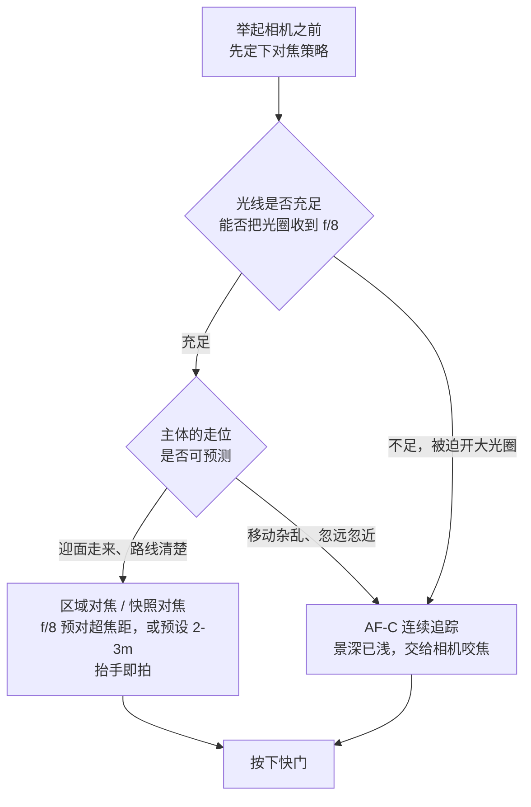
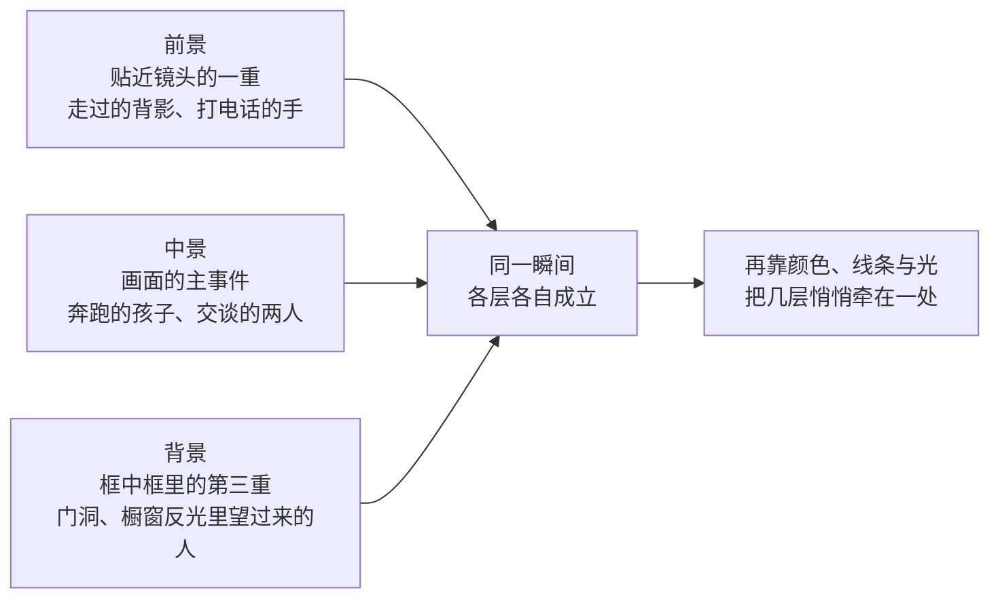

# 第 8 章 街头

> 街头摄影的成片率很低。它练的不是在街上按快门，而是在公共空间里看见正在发生的瞬间。

---

## 街头不只是街上的照片

*Eugène Atget 在巴黎拍了三十多年。他不把自己包装成沙龙艺术家，而是把照片作为给画家、设计师和机构使用的城市文献出售。他常在清早出门，背着大木相机和玻璃底片，在街上还没有完全热闹起来时拍门面、橱窗、街角和院落。晚年，他开始受到 Man Ray、Berenice Abbott 等少数现代主义者注意；1927 年去世后，Abbott 又在画商 Julien Levy 协助下保存、整理并推广其余档案。后来人们承认的街头摄影，很大一部分就从这种安静、长期、不急着发表的观看开始。[图片来源与复用说明](image-credits.md#atget-paris)*

---

## 先确定你在拍什么

很多人把街头摄影直接理解成在街上拍照，这个说法太宽；可把它锁死成“陌生人、公共空间、绝不摆拍”，又会把 Atget 的空街、人的痕迹和许多介于街头与城市摄影之间的作品排除出去。本章采用的是一条便于练习的工作定义：在公共空间里观察未经摄影师完整控制的日常，让人物、痕迹、光线或几何关系在某个时刻成立。它不是替整部摄影史划边界，只是说明接下来主要训练什么。

它的核心不是地点标签，而是现场关系。旅游打卡、朋友在街上的写真和纯粹的建筑记录不是本章主线；空无一人的街景却可能通过橱窗、遗留物、光和时间继续谈论公共生活。人物出现时，一个动作、一种姿态、人与人之间转瞬的关系往往不会等你；人物不在时，你仍要说明这处空间为什么值得被看见，而不能只因为“街上没人”便把它自动算成街头摄影。

---

### 街头摄影的几条传统

街头摄影的历史里，其实分出了几条很不一样的路。了解这些，不是为了把摄影师的名字背下来，而是为了在动手之前先厘清：你想学的到底是哪一种观看方式。不同的路通向不同的照片，也需要不同的性格和胆量，先认清它们的分野，你才不至于把彼此矛盾的追求塞进同一张照片里。

最早为人熟悉的一路，是黑白、50mm、安静的构图，以及所谓的决定性瞬间。Henri Cartier-Bresson 在巴黎圣拉扎尔车站后面按下的那张照片，一个男人正跳过一片水洼，后来几乎成了这个传统被引用得最多的例子：一切都在最恰当的那一秒对齐，多一分少一分都不成立。Vivian Maier 走的也是这条安静的路，她在芝加哥当保姆，几十年里拍了十几万张底片，却一直默默无闻，直到 2007 年这些底片被人从一场仓库拍卖里买下，才被重新发现。Saul Leiter 那时已经用彩色拍纽约 East 10th Street 一带，可即便如此，他的街头也常常只在公寓楼下半条街的范围里展开。归结起来，这一路重构图，也重时机，情绪相对克制，它相信最好的瞬间是等来的，而不是逼出来的。

到了 1950 年代以后，William Klein 把这种秩序整个打碎。他镜头里的纽约很近、很粗、很吵，画面是模糊的，颗粒是重的，距离近到能看见对方的鼻孔。那本书叫《Life Is Good & Good for You in New York》（1956），因为太不像当时人们认可的那种“好照片”，起初在美国找不到愿意接手的出版商，最后是在巴黎印出来的，第二年还拿了法国的 Prix Nadar 摄影书奖，如今更成了战后摄影史绕不过去的一本。日本的 Daido Moriyama 接住了这条粗粝的线索，把“粗、晃、虚”从缺陷变成一种主动的选择。他拍新宿，拍野狗，拍夜里的街和广告牌，照片里常常有一种城市贴到脸上、几乎让人喘不过气的压迫感。Bruce Gilden 走得更远，他索性把闪光灯举到陌生人面前近距离打过去，被拍者那一瞬间来不及掩饰的惊愕，就成了他的标志。与前一路相反，这一路根本不要漂亮，它要的正是冲撞、粗糙和不舒服。

再往后，彩色街头才慢慢进入更广泛的正统讨论。第 4 章讲过的 1976 年 Eggleston 那场 MoMA 个展，常被视为其中一道重要分水岭；而把彩色真正带进街头讨论的，是 Joel Meyerowitz、Stephen Shore、Helen Levitt 这一批各自为战的摄影师：Meyerowitz 六十年代就带着彩色胶卷上纽约街头，偏要逆着当时人人默认的黑白正统走。Martin Parr 则用刺眼的闪光灯去拍英国海滨的度假者，照片里满是热狗、泳衣、廉价的消费和那种说不清的尴尬，他不回避俗气，反而正对着俗气去拍。他那组《The Last Resort》（1983 至 1985 年）拍的就是利物浦附近一个叫 New Brighton 的破败海滨浴场，饱和到近乎失真的色彩配上大白天的闪光，把拥挤、脏乱和普通人的假日一并端到眼前，当年也因为如此呈现工人阶级的度假者而引出过不小的争议。Alex Webb 走的又是另一路，他在墨西哥、海地、伊斯坦布尔拍多层次的彩色画面，一张照片里往往有好几件事同时发生：前景里有人打电话，中景里孩子追着球跑，远处的门洞里还有人正望过来。每一个层次都各自独立，彼此之间却被颜色和构图悄悄牵在一起，谁也离不开谁。

到了今天，每个人都能随手在街上拍照，手机和社交平台让街头图像多到几乎泛滥，真正稀缺的反而不再是图像，而是观看本身。你不必一开始就决定自己究竟属于哪一路，但至少要明白，街头摄影并不是一个空洞的标签。它里面有安静的路，也有粗暴的路；有偏重几何的路，也有偏重社会观察的路。与其每一种都浅尝一点，不如先挑定一条认真去学，反而更容易真正走进去。

---

## 到底在等什么

真正走到街上以后，不妨先想清楚一件事：你到底在等什么。街头照片里的主体，并不总是一个正面朝你走过来的人；它也可能是一种痕迹，是某个人离开之后留下的东西，也可能是公共空间里那种由线条和位置构成的几何关系。先把这一点想明白，你在街上的目光才不会只盯着行人，从而错过其余同样成立的画面。

最直接的一类主体是人，可以是一个人，几个人，也可以是一大群人。关键并不在于画面里有没有人，而在于这个人的表情、动作和姿态是否带着信息。一个路人只是随便经过，并不会自动变成一张街头照片。真正让照片成立的那一瞬，会让看的人感觉到，这个人、这个动作和这个场景，在这短短一秒里被镜头真正地看见了一次，而不只是碰巧被记录下来。

还有一些画面，人其实已经不在了，可他的活动却留下了痕迹。一双鞋摆在门口，长椅上忘了收走的报纸，墙上新添的涂鸦，窗户里仍亮着的灯，雪地上一行脚印，都在无声地说明刚刚有人来过。Saul Leiter 有很多照片就属于这一类：一把伞在结冰的窗外缓缓挪过，一盏信号灯在雨里晕成一团柔光，一只手刚刚从画面边缘退了出去。

再往深一层看，街头还会变成几何。线条、影子、建筑的切割和人所处的位置彼此形成关系，这时人可以变得很小，甚至可以完全不出现。香港摄影师 Fan Ho 在 1950 到 60 年代拍中环和上环，画面常常就是这样构成的：一束斜光打到地上，一个挑担的工人走进光里，整个人化成一道黑色的剪影；在《Approaching Shadow》里，一块三角形的阴影压在墙面上，人物被逼到画面边缘。顺带把底细交代清楚：Fan Ho 本人后来说明，这张照片是请表妹摆拍的，那道著名的斜影也是暗房里加印出来的，并非现场实有；所以它其实不是抓拍，把它放在这里，只因为它把“人被几何吃进结构里”这个道理画得最清楚。在这样的照片里，人不再是被单独端详的对象，而是被光、墙和街道一同切进了整体的结构里。

这三类你可以都拍，也可以先只练其中一种。无论如何，先在心里决定自己究竟在找什么，再带着这个目标走到街上去找，总会比漫无目的地举起相机有效得多。

---

## 器材只需降低阻力

街头器材的要求其实并不复杂，归纳起来无非四条：安静，反应快，不显眼，还有常被忽略的一条，就是轻到你愿意每天带着、风险也在自己能够承受的范围内。

选相机时，与其记一张很快过时的型号表，不如逐项检查阻力：装上常用镜头后能否随身带一整天，开机和唤醒是否足够快，快门声会不会改变现场，自动对焦或预对焦是否符合你的拍法，电池能否支撑一段完整步行，以及遗失或损坏的成本是否会让你不敢拿出来。口袋机、固定镜头相机、小型可换镜机、旁轴和手机都可能合适；名字本身不会替你得到照片。

当然，大光圈长焦、24-70 f/2.8 这样的组合配上一台大单反，也照样能拍街头。只是这类器材体积太显眼，声音也大，很容易让现场里的人先注意到这台机器，而不再按原来的样子自然地流动。说到底，街头并不是展示器材的场合。相机越像一件普通、不起眼的物件，就越容易让你安安静静地留在现场。

沿着这条标准推到底，就绕不开口袋里的手机。满街的人都举着手机，它安静、寻常，也没有额外摄影包。不同手机的短处并不相同：主摄通常偏广，逼着你走近；部分机型的快门响应很快，另一些则会因夜景多帧合成，在移动人物周围留下错位或鬼影。可这些差别没有一条挡得住观看，前面讲的找光、找背景、等交汇，在手机上一条不少。真正要提防的是另一头的便利：从按下到公开只隔着几次点击，关于肖像、位置与发布的分寸，也最容易被略过。

焦段方面，35mm 常是容错较高的起点，它既能交代环境，又不至于像更广的镜头那样总把摄影师逼到很近；这是一种实用折中，不是“人眼焦段”的生理定律。28mm 更要求靠近和管理画面边缘，50mm 则容易形成稍远、更克制的关系。负重也应主动控制：很多时候一机一镜加备用电池已经够用；若天气、工作任务或安全条件需要摄影包，就带它，不必把轻装变成身份规矩。

小机身、单一定焦的价值主要在于预判和降低存在感。固定视角用久以后，还没举起相机，你已经知道站在这个距离大致能框进什么；镜间快门或安静的电子、机械快门，则较少用声音打断现场。变焦同样可以拍街头，只是要避免把所有构图决定都推给变焦环：先通过移动寻找关系，再用焦距处理无法跨越的距离和边界，通常更有意识。

而“接近”本身，也是一门讲分寸的功夫。街头讲究近，可近并不等于莽撞地凑到人脸跟前。更常见的做法，是把自己融成环境的一部分：放慢脚步，不要直勾勾地盯着目标，把相机自然地垂在手边，而不是时刻举在眼前，让往来的行人把你当作又一个在街上信步的路人。等你在一处待得够久，周围的人对你这台相机习以为常，那些真正自然的瞬间，才会重新在你面前流动起来。急着去抢，往往一举手就把什么都惊飞了；沉住气去等，反而拍得到。

---

## 预设比手速更重要

街头讲究反应快，可这份快，很大一部分其实来自事先的预设，而不是临场的手速。第 6 章已经系统讲过相机设置，这里把它重新放回街头的语境里再说一遍，因为同样一组参数，放到瞬息万变的街上，意义会格外具体。

白天不论晴天还是阴天，都可以用 A 模式并设置最低快门，也可以用 M 模式配 Auto ISO。光圈从 f/5.6 到 f/8 起步，行走的人先守住约 1/250 到 1/500 秒；主体横穿画面、离你较近时再提高。ISO 自动上限按自己机身和输出尺寸的可接受画质设置，不必把 6400 当成统一门槛。对焦可以走两条路：现代机身用 AF-C、区域或人物追踪；想让释放时完全没有合焦等待，就用手动区域对焦。测光先用评价测光，再按高光与创作意图补偿。这样一套设置的价值，是让你不必每次从零开始，而不是把所有街头都塞进同一个参数模板。

若想省掉临场合焦，可以把镜头改用手动区域对焦，事先让一段常用距离落进可接受景深。超焦距的公式与边界统一放在第 5 章，现场可直接用[工具箱](tools.md#hyperfocal-calculator)估算；街头并不总要求清晰延伸到无穷远，若人物主要出现在一米半到五米之间，把焦点放在这段活动区域往往比死守超焦距更实用。预对焦省下的是合焦等待，不是构图，也不应成为不看画面的理由。

这套预对焦的做法，后来被归结成一句干脆利落的话，传为 Weegee 所说。Weegee 本名 Arthur Fellig，二十世纪三四十年代在纽约专拍夜里的凶案、火灾和街头事故，扛着一台笨重的 4×5 新闻相机，靠抢在同行前头到达现场谋生。那句在街头摄影圈里流传甚广的话是：f/8，然后到现场去（f/8 and be there），它是否真出自他之口已无从查考，但没有谁比他更配得上这句话。这句话的分量并不在 f/8 这个具体的数字，而在于它把技术彻底降格：光圈收到 f/8，景深足够深，凡是事先能定的都提前定死，剩下唯一要紧的，就是你人是否在场，是否恰好站在那件事正在发生的地方。街头拼的从来不是谁的对焦更精、谁的参数更妙，而是谁真的到了现场，并且在那一秒钟抬起了手。

焦点之外，快门是另一条必须在举起相机之前便已立定的准绳。街头的人几乎总在走动，快门只要太慢，主体就会拖出一层模糊，再好的瞬间也就此失掉。日光下扫街，快门通常放在 1/250 到 1/500 秒之间：这个区间一方面足以凝固行走中的人，让迈出的脚步和摆动的手臂都清晰下来，另一方面又给光圈留出了余地，让你还能把它收到 f/8、乃至 f/11，去换取前面那张表所要求的足够景深。两者本是一体：正因为快门守在这条线上，光圈才有条件收小，超焦距的预对焦也才真正用得起来。

光线一旦转暗，真正要守住的就是这条快门下限。与其为了压低 ISO 而把快门一路拖慢，最后把好不容易等来的主体拍成一团虚影，不如先保住这个下限，宁可让 ISO 升上去。噪点尚可留待后期处理，糊掉的动作却再也无从挽回。

等到黄昏和蓝调时刻，光线迅速变弱，就可以把光圈开到 f/2.8，把 ISO 上限放到 12800，同时留意快门：一旦低于 1/125 秒，手抖和主体的移动都会开始让画面发虚。再到夜景，可以改用 M 模式加 Auto ISO，把光圈开到 f/2 或者更大，快门从 1/125 秒起步，ISO 上限进一步放到 12800 甚至 25600。这一路调整的逻辑始终一致：光越少，就越要靠更大的光圈和更高的 ISO 去补，而快门这条底线尽量守住。

如果你想尝试近距离直闪，f/8、接近机身同步上限的快门、较低 ISO，可以作为白天的试拍起点，但绝不是固定配方。焦平面快门超过同步速度后需要 HSS 或会出现帘幕遮挡；镜间快门能在更高速度同步，却也受具体光圈、快门机构与闪光持续时间限制，不能概括成“任何速度都行”。闪光补偿只改变闪光照到的主体，不会把远处环境一并照白；环境亮度主要由光圈、快门、ISO 与现场光决定。更重要的是，这种拍法会用近距离强光突然打断陌生人，具有很强侵入性。没有对方的明确合作，就不该只为了复制一种风格而贸然使用。

---

### 预对焦的几种方法

前面把光圈收到 f/8、预对到超焦距，是最经典的一种预对焦；但预对焦并不止这一种做法，不同的相机给了它不同的实现，各有各的取舍，值得分开说清楚。

一种是把对焦距离彻底交给手动预设，代表就是理光 GR 系列的快照对焦（snap focus）。你先在菜单里把快照距离设成某个固定值，比如两米，或者两米半，此后只要把快门一次按到底，相机根本不走自动对焦，直接以这个预设距离成像，几乎没有任何延迟。它还留了一道巧妙的余地：半按快门时仍是正常的自动对焦，可一旦你等不及，直接把快门快速按到底，它便跳到快照距离去拍。它把“慢慢合焦”和“抬手即拍”这两种需求，收进了同一个快门行程里。这套逻辑和前面的超焦距其实相通，只是理光把它做成了一个可以随手切换的功能，而不必你去拧动那一整圈手动对焦环。

另一种是索性反过来，把对焦完全交给相机的连续追踪，也就是 AF-C（Continuous AF，连续自动对焦）。今天的无反机身配上主体识别和眼部对焦，追一个在画面里移动的人已经相当可靠，理论上你只要保持半按，焦点便会一直咬住对方。它的长处，是应付那些走位没有规律、忽远忽近的主体；它的短处，则是它需要先“认出”要追的东西，一旦遇到杂乱的背景，或者几个人彼此交叠，焦点就可能在其间游移，而这一犹豫，往往恰好错过那一秒。

于是这里其实有一条朴素的分界：主体越可预测，就越该用预设的死焦点，把不确定性压到最低；主体越杂乱难料，才越值得把对焦交回给相机去追。迎面沿人行道走来的行人，路线清楚，用区域对焦或者快照对焦最稳当；而广场上几个孩子毫无章法地跑动，AF-C 的连续追踪反倒更容易跟得上。两者之间并无谁优谁劣，只是分别对应着两种不同的现场。

---

## 快门也能描述运动

到此为止，快门都被当作凝固动作的工具，目标是把走动的人牢牢定住。可快门也能反过来用，主动留下模糊，让照片里多出一点速度与动势。这层意思，第 3 章讲快门时已经铺垫过，这里把它落回街头的具体情形。

最直接的一种，是把快门放慢到 1/15 到 1/60 秒之间，让走动的人在画面里拖出一道虚影。主体拖出的模糊有多长，可以粗略地估算，它约等于主体的移动速度乘以快门开启的时间：

\[ b = v \cdot t \]

其中 \(v\) 是主体的速度，\(t\) 是曝光时间。一个人以每秒一米四左右的速度行走，在 1/30 秒里大约移动四到五厘米（\(1.4 \times \tfrac{1}{30} \approx 0.047\ \text{m}\)），这点位移落到实际画面上，还要再按镜头的放大率缩小一轮，因此不足以让他面目全非，却足以让摆动的手臂和迈出的脚在边缘化开，整个人看上去正在移动，而不是被凝固成一帧静止。倘若把快门再压到 1/15 秒，位移接近十厘米，虚化便更重，人开始融进环境，这正是 Daido Moriyama 那种“晃”的来路：他并不总在追求清晰，模糊本身就是他要的语气。

另一种更可控的做法是追随拍摄（panning，摇摄）。你把快门放在 1/30 到 1/60 秒，然后让镜头跟着一个横向移动的主体一起转，骑车的人、跑动的孩子、驶过的电车都可以。只要转动的速度和对方大致同步，主体就相对清楚，而静止的背景反倒被拉成一道道横向的线条，速度感便由此显现。转身要以腰为轴，按下快门之后身体还要继续跟着主体转；至于失败的种种成因怎样排查，第 6 章已经细讲过。街头比赛道多出的一层难处，是主体的速度参差不齐，先练熟一种速度的目标，比如电动车，再换下一种，远比见什么追什么长进得快。

要提醒的是，慢门在白天光线过强时容易过曝，这时往往得加一片减光镜（ND，neutral density，中性灰滤镜）把进光压下来，才能把快门放到那么慢。账可以照第 9 章的换算来算，这里给一个够用的例子：晴天 f/16、ISO 100 的快门约在 1/125 秒，挂一片三档的 ND8，就落到 1/15 秒，正好进了拖影的区间。所以白天拍慢门，要备一片 ND；而清晨、黄昏和夜里光线本就不强，快门自然慢得下来，那也正是街上灯光与人流最容易叠出气氛的时刻。

---

## 先找舞台，再等演员

在街上，不要一心只想着去找“东西”来拍。更有效的做法恰恰相反：先找一块本身已经成立的光，让光先就位，让人后到，而不是追着人跑。

走路的时候，留意影子的方向，去找一束光打在墙上的位置，找一处人行道上有光斑落下的地方，找那些逆光剪影可能出现的角落。等光的位置确定下来，画面其实就有了一个现成的舞台，接下来要做的，只是安静地等人走进去。Saul Leiter 的很多照片正是这样得来的：光、玻璃、雨和窗户都先在那里布置好了，人物不过是后来才经过，恰好被这一切接住。

除了找光，也可以先找背景。一面红墙，一个有意思的招牌，一扇会反光的橱窗，一处涂鸦，或者一个能稳稳托住人物的几何空间，都可以充当这样的背景。背景一旦选定，你就站到合适的距离上，然后等人经过。道理和找光是相通的：你已经先搭好了画面的一半，剩下的一半，就交给街上往来的人和不断流逝的时间。这套先把画面的一半布置停当、再等另一半自己走进来的做法，和第 1 章讲的“先看见”、第 6 章讲的“提前准备好”本是同一件事，只不过如今搬到了街头这个你无法支配的现场，风、光、人流都不听你调度，你能做的，只是先占住那个对的位置，然后耐心等。

当然，也有一些主体本身就已经足够吸引人，比如穿着格外特别的人，表情里像是藏着故事的人，或者动作很不寻常的人。遇到这样的人，你可以跟着走上一小段，但目的并不是凑近去打扰他，而是耐心等他经过一处更合适的背景，或者走进一片更好的光里。整个过程都要保持距离，给对方留出空间。街头摄影没有必要把人逼到不舒服的地步。

还有一种情况值得专门练习，就是两个元素正在朝同一个位置靠近。一个穿红衣的人走向一面红墙，一只鸟飞向建筑的顶端，一辆出租车缓缓驶入一束光。当你看到两条线眼看就要交汇，就要提前构好图，把手指搭在快门上，等它们汇合的那一瞬间再按下去。这其实是一种预判：你不是在记录已经发生的事，而是在赌一件即将发生的事。Cartier-Bresson 那张水洼照片正是这种预判的典范，男人的跳跃、广告牌上跳舞女人的剪影、铁栅栏，还有水中的倒影，全都在同一秒里彼此对上。

Alex Webb 的多层彩色街头走的也是同一种思路，只不过他要同时照顾的线索更多。前景、中景、远景各自都有动作在进行，每一层既能独立成立，又和别的层次彼此呼应。看他的作品时，不妨真的去数一数，一张照片里到底有几件事在同时发生。由此也能明白：街头照片并不一定只能依靠一个主体，有时它靠的是好几条线索，在某一瞬间一起在画面里短暂地对齐。

---

### 怎样组织多层画面

Alex Webb 那种一张照片里同时有好几件事的画面，背后其实藏着一套可以拆解的方法，值得单独摊开来讲一层。它的核心叫分层（layering，分层构图）：把前景、中景、背景这几个纵深不同的平面，一并压进同一个画框里，让每一层各自都有内容，彼此之间又互相呼应。

先说它为什么难。人的眼睛站在现场，是会自动挑重点的：你看着那个打电话的人，就自然把他身后的一切虚掉、略过；可镜头不会，它把远近所有平面一视同仁地铺在同一张照片上。于是现场里明明清清楚楚的一个人，落到照片里，常常被身后杂乱的招牌、行人和线条淹没。分层要做的，恰恰是反过来利用镜头这种“什么都收”的特性：既然背景注定要进画面，那就索性让背景也担起内容，让它成为第二重、第三重事件，而不再只是一团噪音。

具体怎么搭，有几件事要同时照顾。第一，景深要足够深，把光圈收到 f/8 到 f/11，让远近几层都落进清晰的范围，这正好又接回前面超焦距那一套。第二，要善用画面里天然的“框中框”：门洞、窗户、拱廊，以及橱窗的反光，都能在一张照片里再切出一小块画面，把更远的一层人物或动作嵌进去。第三，也是最难的一步，你得等。前景、中景、背景各自都要冒出值得一看的东西，而它们偏偏不会同时就位，你只能守住机位，等好几条线索在某一秒钟一起对上。多数时候它们对不上，你就只好放掉；偶尔全对上了，便是一张密度极高的照片。

沿着这条路走得最远的，除了 Alex Webb，还有 Magnum 的 Gueorgui Pinkhassov。他是俄国人，画面比 Webb 更碎，常常借着玻璃、水汽、镜面和光斑，把眼前的现实切成一片片反光的碎块，让人一时分不清哪一层是实体、哪一层只是倒影。看他的照片，你几乎无法一眼看尽，目光得在那些碎片之间来回游走。而这份需要慢慢看、看第二遍第三遍才理得清的密度，正是分层能够给一张照片的东西。

要提醒新手的是，分层不必一上来就追求 Webb 那样五六层俱全。从两层练起就好：先找一个有趣的前景，比如一个正走过的背影，再耐心等背景里浮出第二重内容。把两层稳稳地叠得成立了，再慢慢往里添第三层。贪多的结果，往往是每一层都没能站住，整张照片最后只剩下一团乱。

---

## 边界、同意与发布

街头固然是公共空间，可身处其中的人依然有各自的边界。这里需要分清两件事：法律允许的，和伦理上让人舒服的，并不总是同一回事。能拍，不等于就该拍。

不要把“公共场合通常能拍、商用才需要许可”记成全球通则。法律往往分别处理三件事：**是否可以拍摄、是否可以公开发布、是否可以商业使用**；肖像权、隐私、数据保护、场地规则与新闻或艺术表达的例外，还可能同时适用。以中国为例，《民法典》第 1019 条并不把未经同意的限制只写成“以营利为目的”，第 1020 条另列有限的合理使用情形；德国《艺术著作权法》第 22 条以公开传播和展示需同意为原则，第 23 条再列例外。其他地区也各有自己的判例和边界。最实用的做法，是在旅行或发表前查当地现行法与场地规则，并把“我能否拍”与“我能否把可辨认的人发到公开平台”分开查询；本书的[事实核查与参考](references.md#public-people-buildings)列出几个官方法源入口，但不替代法律意见。

法律终究只是底线，达到底线远不等于做得体面。不要把流浪者的窘态、醉酒者、受伤者或残障人士的难堪当成奇观；儿童与其他难以充分表达同意的人，应采取更高保护标准；也不要靠贬损性说明文字，把一个普通瞬间改写成对具体人物的嘲弄。工人在劳作时可以成为有力量的题材，但画面仍应让人保有尊严。

判断一张照片该不该拍、该不该发，还有一个朴素却好用的准绳：设想画面里那个人换成是你自己，或者是你的父母，你是否还愿意让这张照片被公开地看见。它当然无法替你回答所有情形，却能在犹豫的当口，把问题问得具体起来。与之相关的还有一层区别，就是你究竟是在和画面里的人一起笑，还是在笑话他。前一种里，被拍者哪怕全然不知情，也仍旧保有他的体面；后一种，则是把别人的窘迫当成供人取乐的材料。街头摄影容得下幽默，也容得下荒诞，唯独不该把这份趣味，建立在贬低某一个具体的人之上。

在街上拍久了，被人发现是迟早的事，这几乎无法避免，也不必为此紧张。被发现之后，最好的反应是笑一下，点点头，向对方表示友好；必要时索性把回放拿给对方看，让他知道你拍的是什么。如果对方要求你删掉，那就删掉，不要争辩，一张照片远没有一次不愉快的冲突来得重要。相比之下，转身跑开反而显得心虚，会把一件本可以化解的小事变成误会。

去一个陌生城市之前，最好查清当地关于街头摄影的法律、习俗和场地规则。在一处稀松平常的举动，换个地方可能相当冒犯。军事与受控区域、安检设施以及明确标明禁止拍照的场所应当避开；机场公共航站楼、政府建筑外围等空间的规定并不全球一致，应查看现场标识并服从工作人员要求，而不是靠一张世界通用的禁拍清单猜测。

顺带说一句本土的路。这一章里的名字多半来自纽约、巴黎和东京，可街头摄影从来不是舶来的奢侈品，你楼下的菜市场和这些名字脚下的街道，在观看这件事上完全平等。合肥的刘涛就是现成的例子：一个自来水公司的抄表工，沿着抄表的路线拍了十来年，把街边那些荒诞又温和的巧合（如墙上广告与行人的错位、水洼里颠倒的世界），拍成了被国内外媒体争相报道的作品。他的路线没有换过，换的只是眼睛。中文互联网上这样的拍摄者这些年多起来了，这是好事；它证明这门功课需要的不是护照，而是每天出门的那半小时。

---

## 你选择怎样接近陌生人

面对街上的陌生人，摄影师大体分成两种站位，它们几乎代表着两种相反的性情，也拍出两种相反的照片。

一种是不介入现场：先构好画面，等人进入，在尽量不打断对方行动的情况下按下快门。它能保留未经镜头回应的动作，也要求摄影师耐心、收敛。需要分清的是，“没有打断”不等于“已经获得同意”，隐蔽也不天然比公开举机更合乎伦理；可辨认程度、处境是否敏感、拍后怎样发布，仍要单独判断。

另一种是正面的，直接迎着冲突去拍，最极端的代表便是前面提过的 Bruce Gilden。他索性走到陌生人跟前，近到几步之内，举起相机连着闪光灯当面打过去，被拍者猝不及防的那一下惊愕，就是他要的表情。这样的照片，带着一种隐蔽拍法给不了的强度：人在毫无准备时被强光和镜头一同逼住，那一瞬的真实近乎粗暴。可它的代价同样明摆着，这种拍法带着侵犯性，几乎必然招来对方的错愕、不快乃至愤怒，围绕它的争议也从未平息。Gilden 本人对此并不回避，他清楚自己在做什么，也愿意承担随之而来的一切。

把这两条路并排放在一起，不是要判定一种天然正确，而是看清各自的交换。不介入能减少对现场的即时改变，却可能让被拍者完全不知道图像将被怎样使用；公开接近给了对方回应和拒绝的机会，也可能让动作立刻改变。近距离直闪则把惊扰直接变成方法，风险和责任都更高。在真正说明自己为什么需要这种强度，并准备承担现场、伦理与发布后果之前，不必把冒犯误认成勇敢。

---

## 害怕拍摄时怎么办

几乎每一个新手，都会在某个时刻撞上同一道坎：不敢拍。

把镜头对准一个素不相识的人，第一次这样做的时候，手心多半会出汗。你会怕被对方瞪，怕被骂，怕被人当成偷拍的坏人。这些反应都很正常，几乎没有谁天生就不怕，那份从容大多是练出来的。真正把人区分开的，不是怕或不怕，而是各自用什么办法，一点点把这层紧张磨薄。

最稳妥的入门方式，是从那些最不容易引起警觉的地方开始，而不是一上来就贴着人脸去按快门。集市和菜场就很合适，因为那里本来就人声嘈杂，人人都在忙着自己的事，多一台相机并不显得突兀。你可以先拍摊上的蔬菜，拍买卖时的手，拍交易的动作，让自己习惯在人群里举起相机这个动作本身；等这一步不再让你心跳加速，再一点点把镜头抬高，抬到人脸的高度。

另一个办法，是先用区域对焦、翻折屏或腰平取景练习在较低机位构图，不必每次都把相机举到眼前；重点仍是看清画面，而不是把“对方没有发现”当作成功。大方、动作清楚通常比躲躲闪闪更不容易引起误会。真被人发现了，可以点头示意；若对方表现出不适，就停下来沟通或放弃这张照片。

如果这道坎实在迈不过去，还有一条更直接的路，就是索性开口，请对方让你拍。这样做已经更接近街头肖像，和严格意义上不打招呼的抓拍并不一样，但它练胆量的速度很快。你走上前去说一句：“你今天这身很好看，能让我拍一张吗？”对方拒绝，就道声谢走开；对方答应，就认认真真地拍上几张。这样和几十个陌生人打过交道之后，你会亲眼发现，真正会因此发火的人其实非常少。等那层恐惧被磨薄了，你再回到不打扰的抓拍，手也就不会像最初那样抖了。

---

## 同一条街有不同时间

街头能拍到好画面的时间窗口，往往比人想象的要窄。同一条街，在一天里的不同时刻，几乎是不同的地方，光在变，人流在变，能成立的照片也随之在变。

黎明之前，城市还没有完全醒来，路灯依旧亮着，街上人也稀少，这时候适合拍蓝调的街景和早起的清洁工。到了早上通勤时段，人开始成群涌进街道，太阳的位置还很低，于是适合拍长长的影子、剪影，以及那些行色匆匆的身体。上午光线充足，但太阳会慢慢升高，光越来越硬，这时更适合去利用影子和几何。中午顶光最重，投影几乎踩在脚下，街上的人也少了，除非你有明确要用硬光的意图，否则这个时段的效率通常不高。下午，光重新有了角度，人物、橱窗和建筑表面之间更容易发生关系。再往后，黄金时刻适合暖色和长影，蓝调时刻适合灯光和橱窗，入夜之后则适合霓虹和夜生活。与其笼统地挑一个好天气出门，不如对着你想要的画面，去挑一个对的钟点。

另外，不要只在天气晴好的时候才出门。雨天和雪天会实实在在地改变街道的表面，也改变人在街上的动作，反而常常给你晴天给不了的东西。地面湿了会反光，撑伞的人会在画面里形成重复的形状，衣服的颜色被打湿后变深，雪地上留下一道道脚印和车辙，玻璃上则蒙起一层雾。雨天会出现许多晴天根本没有的画面：一张透明伞下若隐若现的脸，车灯在湿漉漉的地面上拉出的长长反光，还有雨滴把橱窗后面的霓虹扭成模糊的一团。

至于地点，城市核心区通常更容易形成密度，但密度只是其中一种条件。地铁站、火车站、菜场、广场、步行街、地下通道和河岸各有不同的人流、光线与节奏；住宅区也并非天然不属于街头，只是窗内、院落、门牌和日常动线更接近私人生活，需要更谨慎地处理距离、可辨认信息与发布。真正不适合的不是某一种行政分区，而是你无法在不侵入他人生活的情况下说明自己为何要拍的场面。

---

## 用限制进入长期拍摄

如果你想从偶尔按上几张，真正进入一种长期的拍摄状态，最好的办法是给自己定一个小项目。零散地拍，拍再多也只是一堆互不相关的照片；而一个项目，能把这些零散的努力拢到一处，让它们慢慢长成一件东西。

项目本身并不需要多么宏大，恰恰相反，越具体越好。它可以是通勤一年，只拍每天都会经过的那个地铁口；可以是我家这条街，只拍方圆五百米以内的东西；可以是下雨的城市，规定自己只在雨天出门；可以是影子里的人，通篇只拍剪影；可以是周日早上，把时间锁定在六点到九点之间；也可以是我的城市里的红色，专门去找红色，把它当作贯穿整组画面的主线。这些题目看似小，却各自划出了一块清楚的疆界。

项目真正的价值，就在于这份限制。有了它，你不再是每天漫无边际地随便拍一点，而是反复回到同一个主题、同一处地点或同一个时间段里去。道理很朴素：一个地方看过十次，当然会比只看一次理解得更深。与此同时，一组围绕限制拍成的照片，也更容易长出统一的气质。无论你将来是想发到网上，是想投稿，还是想整理成一本小册子，作品都需要这样一种内在的结构，而不只是数量。

具体做法可以很简单：挑定一个限制，坚持三十天。这三十天里，每天至少出门一次，每天从当天的照片里选出一张。三十天结束之后，再从这三十张里挑出五到二十张，把它们排成一组。要提醒的是，不要同时开很多个项目，那样每一个都会浅尝辄止。一次只专心做一个，做完了，再去想下一个。

“每天选一张”说起来轻巧，怎么选，才是街头这门手艺的后一半。章首就说过成片率极低，这意味着一个街头摄影师的大部分工作，其实发生在回家之后的屏幕前。几条经验值得立下。第一，隔一段时间再选。刚拍完的照片上还沾着现场的肾上腺素，你记得当时多紧张、等了多久，于是舍不得删；Winogrand 的做法极端却有道理，他故意让胶卷搁上一年再冲，为的就是选片时把“拍的时候的我”彻底请出房间，只剩照片自己说话。你不必等一年，等一个星期，效果已经很明显。第二，用排除法而不是挑选法：先删掉技术上不成立的，再删掉那些“要是当时再等一秒就好了”的半成品；差一口气的照片最难删，也最该删，留着它们，你的标准就永远差着那一口气。第三，问每张幸存者一个问题：一个不在现场的人，能从这张照片里看到什么？现场的故事你不能附在照片边上讲一辈子。三十天下来，真正教会你东西的，往往不是拍下的三千张，而是删掉的两千九百多张。

选片的眼睛，还可以靠读别人的照片来磨。买一本这一章里提过的画册，随便哪本，挑出最抓住你的一张，别急着翻页，把它拆开：主体站在画面的什么位置，光从哪里来，画面里有几层，按快门的人当时站在哪里、等了什么。然后带着这一张上街，不是去复制它，而是去找它的骨架：同样的光位，同样的层次关系，装着你自己街上的内容。模仿一张具体的照片，比笼统地“学习大师风格”长进快得多，因为它给了你一份可以核对的答案。

!!! example "案例推演：雨后路口"

    你先看见一块被霓虹照亮的积水，却还没有人物。不要追着路人寻找“事件”：先选能同时容纳倒影、出口和干净背景的机位，预设最低快门与可接受的最高 ISO，再等一个人的步幅进入亮区。

    连拍后不要只选最清楚的一张。把相邻帧并排，检查脚步是否打开、脸是否与招牌重叠、倒影有没有被画面边缘截断。这个案例里，舞台、时机和编辑各完成三分之一。

---

## 练习

出门一小时，只许守在选定的机位上等：每处至少守十分钟，一小时下来换四到六处。回家后，每个机位只选一张。

连续七天，每天带 35mm 出门半小时。每天选一张。一周后看这七张有没有共同特点，那就是你最容易被吸引的街头画面。

挑一个限制：家附近一条街、一种颜色、一种天气、一个时间段。做三十天，每天一张。三十天后选二十张，排成一组。

下一次下雨，专门出门一小时，带上 35mm 和一把透明伞。回家选五张，和晴天拍的街头照片放在一起看，比较雨天到底改变了什么。

---

下一章：[第 9 章 风光](09-landscape.md)
