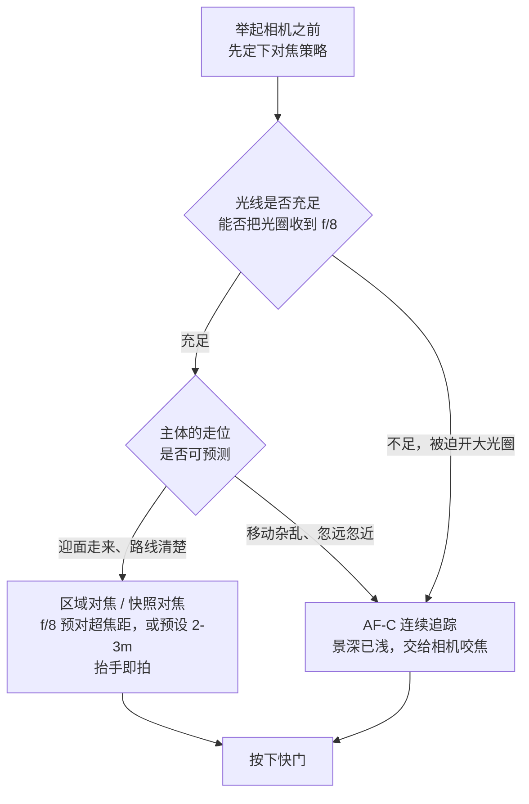
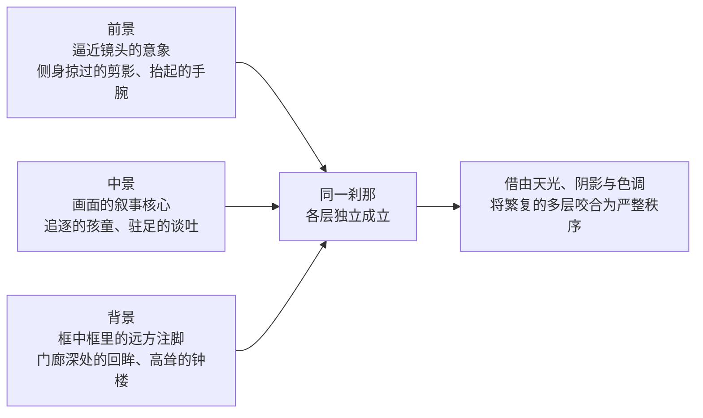

# 第 8 章 街头

> 街头摄影的成片率很低。它练的不是在街上按快门，而是在公共空间里看见正在发生的瞬间。

---

## 街头不只是街上的照片

*Eugène Atget 在巴黎拍了三十多年。他不把自己包装成沙龙艺术家，而是把照片作为给画家、设计师和机构使用的城市文献出售。他常在清早出门，背着大木相机和玻璃底片，在街上还没有完全热闹起来时拍门面、橱窗、街角和院落。晚年，他开始受到 Man Ray、Berenice Abbott 等少数现代主义者注意；1927 年去世后，Abbott 又在画商 Julien Levy 协助下保存、整理并推广其余档案。后来人们承认的街头摄影，很大一部分就从这种安静、长期、不急着发表的观看开始。[图片来源与复用说明](image-credits.md#atget-paris)*

在二十世纪破晓之际的巴黎，尤金·阿杰（Eugène Atget）每日拂晓便背负起沉重的大画幅木质座机与易碎的涂胶干版玻璃底片，在整座喧嚣都市尚未彻底苏醒之前，悄然穿行于古老幽深的街巷。他在蒙帕纳斯的门扉上挂起一块简朴的木牌：“为艺术家提供文献”（Documents pour artistes）。在长达三十载的漫长岁月里，他不附庸沙龙画意派的浮华矫饰，亦不以现代先锋自居，只是以一种近乎苦行僧般的虔敬与固执，为那座在奥斯曼宏大都市改造中迅速土崩瓦解的中世纪老巴黎，编纂着一份极其详尽的视觉挽歌。

在这幅摄于 1905 年的巴黎街景中，整条鹅卵石街巷呈现出一种不可思议的空灵与静穆。阿杰惯用的复消色差镜头在玻璃底片四角留下了微小的暗角暗影，赋予了画面一种宛如时光隧道般的内聚感。黎明平缓冷冽的漫射光，浸润着被无数马蹄与行人格外磨砺得光洁温润的石板路，两侧斑驳风化的古老石墙、紧闭的雕花木门，以及店铺窗玻璃上倒映出的对面建筑幽影，沉静地吐纳着数百年历史的包浆。画面中空无一人，然而一种深沉的“在场”却无处不在——门把手上磨出的铜光、转角处留下的雨渍痕迹、以及檐下微垂的绳索，皆在无声地指认着人类生活的深刻烙印。

瓦尔特·本雅明（Walter Benjamin）在其名篇《摄影小史》中，曾对阿杰的街头影像给出了震颤心灵的断言：“他像拍摄犯罪现场一样拍摄巴黎。犯罪现场同样空无一人，人们拍摄它，是为了在历史的审判中确立不可磨灭的物证。”阿杰的镜头彻底剥离了资产阶级感伤的怀旧滤镜，将巴黎街道提纯为一座静默的物质剧场。正是在这片洗尽铅华的空旷之中，现代街头摄影寻获了其最深邃的母题：街头绝非仅是流动人群的走马观花，它是人类历史、空间记忆与时间幽灵永恒纠缠的见证之所。

---

## 先确定你在拍什么

初涉街头摄影，极易将其泛化为“在街道上按动快门”的偶遇；然而倘若将其狭隘地窄化为“陌生人、公共场域、绝不干预”，又会将阿杰那般沉静的空巷、人类生活的遗痕、以及介于城市景观与建筑考察之间的深邃作品排拒在外。在此，不妨确立一条便于实践的认知基准：**街头摄影，是在公共空间中观察未经创作者预先编排的日常涌流，使人物、痕迹、天光与几何结构在某一刻达成心领神会的视觉咬合**。

它的核心从来不是地理空间的标签，而是现场对话的质感。浮光掠影的旅游留念、朋友在斑马线上的写真、或是孤立的建筑测绘并非此间主线；空无一人的街巷，可以通过橱窗的反光、长椅上的遗弃物、光线的位移与时间的沉淀，持续与公共生活展开对话。当人群涌现时，一个幽微的眼神、一种反常的体态、人与人之间稍纵即逝的引力断层往往不容丝毫犹疑；而当人群退去，你仍需向观者交代这处空间为何值得被凝视，而绝非仅仅因为“街头空旷”便将其盲目归为艺术。

---

### 街头摄影的几条传统

回顾街头摄影的历史谱系，实则分化出数条精神气质迥异的脉络。辨析这些脉络，绝非为了机械地背诵大师名录，而是在举起相机前首先厘清：你究竟渴望以何种目光关照这个世界。不同的路径通向全然不同的影像质地，亦需要截然不同的性情与胆略。

第一脉，是**古典几何与沉静等候的抒情传统**。以黑白单色、35mm 或 50mm 经典视角、以及对“决定性瞬间”的严苛恪守为基石。布列松在圣拉扎尔车站后方水洼前捕获的那一跃，使内容与形式的几何咬合成为了这一流派的至高标杆。薇薇安·迈尔（Vivian Maier）在芝加哥担任保姆的数十载光阴中，亦漫步于这一静穆的轨道，数以万计的底片隐匿于箱匣，直至身后才如奇迹般重见天日。索尔·雷特（Saul Leiter）虽早在五十年代便以早期彩色胶片凝视纽约东十街，然而其视野往往收束于公寓楼下半条街的方寸之间，隔着蒙上水汽或落雪的玻璃，将都市化为一抹抽象抒情的色块。这一传统崇尚形式的完满与情绪的克制，深信至美的瞬间属于耐心的守候，而非暴力的抢夺。

第二脉，是**战后兴起的冲撞、介入与粗粝现实主义**。1950 年代中叶，威廉·克莱因（William Klein）以颠覆性的姿态粉碎了古典的优雅秩序。在其划时代的画册《纽约的生活对你来说很美好》（*Life Is Good & Good for You in New York*, 1956）中，画面逼仄、颗粒粗重、焦点游移、构图倾斜，充斥着都市街道的喧嚣、躁动与侵略感。日本摄影家森山大道承继了这条叛逆的血脉，将“粗、晃、虚”（Are, Bure, Boke）从光学缺陷升华为直觉的哲学，在新宿游荡的野狗与深夜闪烁的霓虹中，展现出城市如肉身般逼至眼前的窒息压迫。布鲁斯·吉尔登（Bruce Gilden）则走得更为决绝，他手持相机与外接闪光灯，在曼哈顿街头直接迎面逼近陌生人，在几步之内以刺目的强光骤然定格行人的错愕与戒备。这一脉络弃绝了甜俗的和谐，它所追逐的，正是现实最原始的摩擦、粗粝与震颤。

第三脉，是**新彩色摄影与复杂社会多维观察**。1976 年威廉·埃格尔斯顿在 MoMA 的个展确立了彩色的学术尊严，而将彩色语言全面引入街头叙事的，则是乔尔·梅耶罗维茨（Joel Meyerowitz）与斯蒂芬·肖尔（Stephen Shore）等先驱。梅耶罗维茨在六十年代便毅然携带着彩色胶片走上纽约街头，逆流对抗黑白正统的垄断。英国摄影家马丁·帕尔（Martin Parr）则以饱和艳俗的色彩与大白天的直射闪光灯，对准了利物浦海滨度假地《最后的度假胜地》（*The Last Resort*），以荒诞而辛辣的镜头解剖廉价消费与大众文化的尴尬与平庸。而亚历克斯·韦伯（Alex Webb）则在海地、墨西哥与伊斯坦布尔的炽热光影中，开创了极致的**多层叙事构图**：一张画幅中往往有三重、四重事件在不同纵深同时发生，各层独立成章，却又在色彩、阴影与几何引导线的严密编织下浑然一体。

在影像泛滥的当下，每个人皆可信手以手机定格街景；技术门槛的消融，反而使“观看的深度”成为了世间最稀缺的禀赋。你不必急于为自己贴上某种流派的标签，但当懂得街头既有静水流深的沉思，亦有电光石火的交锋；先择取一脉深潜体悟，远胜于在各种风格的表皮浅尝辄止。

---

## 到底在等什么

伫立于纷繁流转的街头，执机者心头当常驻一问：你的目光究竟在寻觅什么。街头影像的内核，绝非单单局限于一个迎面走来的清晰路人；它可以是一抹人性的神态，可以是一段生活退潮后留下的余温，亦可以是光影在建筑表面切割出的纯粹几何。厘清这一层，双眼方不至在人潮中盲目流徙。

**其一，为神态与姿态的显影。** 它可以是独行的旅人、并肩的故交、或是庞大的人潮涌流。然而评判成败的关键，不在于形体的多寡，而在于身躯的姿态与眉宇的神色是否承载着可被感知的生命叙事。一个行色匆匆的过客仅仅从镜头前机械掠过，并不能自动成全一幅影像；唯有当他的步伐、回眸的微澜与当下的环境在某一瞬间达成共振，观者才会确信：这个生命在奔涌的时间长河中，被镜头无比郑重地凝视了一次。

**其二，为生活驻足过的余温与痕迹。** 很多时候，人物早已从画幅中抽身退去，然而其存在过的证物却在空间中隐隐回响。台阶上斜倚的一双磨损皮鞋、长椅上被晨风吹拂的报纸、雨棚边缘滴落的水珠、橱窗玻璃上未散的呵气、抑或泥泞雪地上一行渐行渐远的脚印。索尔·雷特的名作常深植于这种物哀之美：一把红伞隐入落雪的转角，红绿灯的光晕在水汽中化为一团温润的朱砂，一只戴着皮手套的手刚刚从车窗边缘缩回。生命虽已离场，呼吸却依然充盈。

**其三，为纯粹光影与建筑的几何构架。** 晨昏投下的冷峻斜影、斑马线平行的黑白律动、高耸楼宇割裂天空的锐利折角，在空间中构筑起严密的框架。此时，人物可以缩微成点景，甚至全然隐去。香港摄影大师何藩（Fan Ho）在五六十年代凝视中环与上环的光影，便是几何构筑的化境：一道刺破浓黑阴翳的斜射光线中，一个挑担的苦力缓步走入，化作一具孤寂挺拔的墨黑剪影；而在《阴影渐近》（*Approaching Shadow*）中，墙面巨大的三角形阴影如命运之巨石压覆而下，将人物逼向逼仄的画幅边缘（即便何藩日后坦陈该作暗房干预与表妹摆拍的缘起，其形式构成依然深刻阐明了人物如何被空间几何完全吸纳）。在此类造像中，人不再是被孤立端详的客体，而是被天光、石壁与街巷一同熔铸进宏大的宇宙骨骼之中。

---

## 器材只需降低阻力

街头摄影对装备的苛求，本质上只有一条铁律：**最大限度地降低从心动到定格之间的物理与心理阻力**。安静、迅捷、平实低调、轻盈得令你乐于终日佩戴且无惧磕碰损耗，远比追求沉重繁复的顶级参数重要得多。

挑选相机时，不必迷信厂商更新迭代的型号清单，当逐一审视其实际阻力：镜头悬挂于脖颈一整天是否会令肌体疲惫；自待机唤醒至首帧曝光是否能在一秒内完成；机械快门的震颤与声响是否会惊扰五步之内的安详；自动对焦或预设景深是否与你的反应节律契合；电池能否支撑长达数小时的漫步；以及相机的价值是否会令你畏首畏尾、不敢在风雨或喧嚣中果断举机。轻巧便携的口袋机、固定焦段旁轴、小型微单乃至贴身手机皆可成为利器；赋予影像灵魂的永远是目光，而非机身铭牌。

长焦大光圈与沉重的旗舰机身固然亦可捕获街景，然而它们巨大的体积与侵略性的金属质感，往往在举手之间便引发周围人群的警觉与防御，使原本流动的真实瞬间戛然而止。街头从来不是炫耀器材的展台；相机越贴近日常生活中一件不起眼的寻常物件，执机者便越能安然沉潜于现实的激流之中。

由此推向极致，口袋中的智能手机便显现出不可替代的优势。人潮汹涌的公共空间里，人人皆在低头浏览屏幕，举起手机不再被视作突兀的“摄影创作”，心理屏障降至最低。手机镜头虽在弱光纯净度与多帧合成的边缘处理上存在物理局限，然而在光影观察、构图张力与时机预判上并无二致。唯需时刻自警的是便利背后的代价：指尖轻点即可完成曝光与网络公开发布，极易让人在轻率中跨过法律与尊严的红线。

就焦段而言，等效 35mm 是容错率与叙事张力最为均衡的起点，既能容纳丰富的环境语境，又不至如更广视角那样逼迫拍摄者步步迫近；28mm 则要求更勇敢的物理逼近与严密的外周边缘管理；而 50mm 则自带一种克制、自省而保持尊严的旁观视点。负重应当严格克制，一机一镜加备用电池往往便是全部家当。

街头摄影中所谓的“逼近”，是一门懂得收敛与尊重的体态修行。逼近绝非鲁莽地将镜头怼至他人鼻尖。高明的观察者懂得让自己溶解于环境之中：放慢行走的节奏，切莫用猎犬般锐利的目光死死锁定目标，将相机自然垂于掌心而非时刻端在眼前，让往来行人将你视作又一个在日光下信步沉思的寻常过客。唯有当你在某一街角驻足足够久，周遭的气息重新归于平静，生活未经粉饰的面容，方会再次在你眼前从容绽放。急躁的扑捉只会惊飞一切飞鸟；沉静的驻守，方能等来光影的筑巢。

---

## 预设比手速更重要

街头摄影常被赋予“敏捷迅猛”的神话，然而临场之快，大半源自举机前对参数的精密预设，而非手忙脚乱的应激反射。第六章已系统剖析过相机的操控逻辑与光学原理，若将其投射进瞬息万变的街头，各项参数的分量便显得格外具体。

日光之下，无论晴空万里亦或阴云密布，皆可采用光圈优先（A 模式）绑定最低快门底限，抑或手动曝光（M 模式）配合自动感光度（Auto ISO）。光圈起手收束至 f/5.6 至 f/8，行走中的行人先以 1/250 至 1/500 秒为安全红线；若主体横穿取景框或与镜头距离迫近，快门当果断进一步提速。对焦路径大致分化为两条：现代机身驱动连续对焦（AF-C）配合人物眼部识别追踪；而若渴求按下快门瞬间彻底消除合焦计算的微小延迟，手动超焦距或区域对焦依然是不二法门。

在预设对焦的谱系中，将镜头光圈收小至 f/8 并根据摄距锁定景深，是一套历经岁月淘洗的经典经验。这一法门后来被凝练为街头摄影圈流传最广的一句箴言：“收小到 f/8，然后到现场去”（f/8 and be there）。相传此语出自二十世纪三四十年代纽约传奇纪实摄影师维吉（Weegee，原名阿瑟·费利格）。他常年手提沉重的 4×5 大画幅新闻座机，在午夜的凶案、火灾与车祸现场穿梭抢拍。无论此句是否确系其亲口所言，其精神内核皆无比契合：将光圈收紧至 f/8，景深辽阔浩荡，技术参数在举机前便已彻底固化；剩下的全部胜负，皆系于拍摄者肉身是否真正驻足于现场、并在那命运交汇的一秒果断按动快门。街头比拼的从不是谁的拨盘旋动得更快，而是谁真正置身于激流之中。

快门速度是另一道不可妥协的底线。街头的人潮永在流动，快门稍慢，行人的肢体便会化作失控的模糊，再惊艳的瞬间亦随之涣散。日光行摄，1/250 至 1/500 秒既能凝固脚步与摆动的手臂，又为光圈收缩至 f/8 提供了通光量支撑；而当天光向黄昏与蓝调时刻倾斜，最该死守的依然是快门的绝对下限。宁可放开 Auto ISO 上限容忍适度的胶片感颗粒，亦切莫为了所谓的纯净画质将快门拖慢至安全线以下——噪点尚可在后期暗房中被包容与雕琢，然而一帧因手抖或物动而发虚的面孔，却再无起死回生的可能。

至于近距离直射闪光灯（direct flash），固然能如吉尔登那般带来强烈的戏剧冲击与超现实质感，然而其刺目的光芒带有极强的现场侵入性。若非在被摄者知情同意的语境下，切莫为了效仿某种粗粝的风格而将其沦为公然的冒犯。

---

### 预对焦的几种方法

预对焦的智慧，在于将对焦的主动权提前收回。临场实践中，主要依托于两种截然不同的心智逻辑：

其一，是**物理距离的绝对锚定**。其代表便是理光 GR 系列广受推崇的“快照对焦”（Snap Focus）。执机者在菜单中预设某一固定物距（如两米或两米半），一旦遇到突发局势，快门无须半按合焦，直接一按到底，相机便绕过一切自动对焦算法，以预设物距瞬间完成曝光。它甚至设计了绝妙的双重机制：轻柔半按仍是精准的单点自动合焦，而骤然击穿行程则直接调用快照距离。这与古典旁轴镜头的区域对焦景深尺（Zone Focusing）本质相通，将科技的繁复消解为肌肉记忆的直接延伸。

其二，是**借助现代算法的智能咬合**。在当代无反旗舰机身中，AF-C 配合深度学习的主体追踪，已能极其强悍地锁定移动中的眼眸与形体。它的长处在于应对轨迹无常、忽远忽近的随机动态；然而其软肋亦同样分明——在杂乱纷扰的街头背景、或是数人交错重叠的复杂景深中，算法难免产生瞬间的犹豫与焦点漂移，而那犹豫的十分之一秒，往往便是好瞬间消逝的永诀。

分水岭由此明晰：**主体的轨迹越可预判，越当依凭固定区域对焦以斩断一切不确定性；主体的穿梭越错综多变，才越当借助相机的追踪算法随行伺候**。

---

## 快门也能描述运动

快门绝不仅是一具冰冷凝固动作的断头台，它亦可反向施展，主动挽留流动的虚影，为影像注入速度与情绪的波澜。

最直观的实践，是将快门压慢至 1/15 至 1/60 秒之间，让穿梭的行人拖曳出流动的墨痕。模糊的位移量遵循简练的物理规律：

\[ b = v \cdot t \]

其中 \(v\) 为主体行进速度，\(t\) 为曝光时长。寻常行人以每秒约 1.4 米的步幅前行，在 1/30 秒中位移约四至五厘米，反映在画幅的缩微比例上，恰好能让摆动的手足与飘扬的衣袂泛出柔和的动势，整个人物如同一道穿行在静止街道间的微风。若进一步将快门收慢至 1/15 秒，位移扩展至近十厘米，人物身形便开始半透明地消融于空间之中——这正是森山大道镜头中那种“晃与虚”的生命力：模糊并非失误，模糊本身即是叙述的语气。

另一种深具掌控力的手法则是**追随摇摄**（panning）。将快门定于 1/30 至 1/60 秒，双脚稳健站定，以腰脊为轴心，让镜头以完全均等的速度平滑追踪横向飞驰的自行车、电车或奔跑的孩童。在快门开启并延续转动的片刻，运动的主体在画面中保持相对恒定而清晰，而周遭原本凝固的建筑与街道却被水平拉扯出如飞丝般的流线。白日若遇强光导致过曝，挂上一片三档中性灰滤镜（ND8），便能从容让快门坠入诗意的慢速区间。

---

## 先找舞台，再等演员

漫步街头，切莫盲目追赶着行人奔波。最为沉着老练的心智，是**先找寻一处在形式与光影上业已完满成立的“舞台”，让光影与几何先行就位，静候生活自身步入画中**。

穿行于街巷，时刻留心影子的走向：一面斑驳石墙上切割出的冷冽金光、人行道上树影斑驳筛出的光斑、或是高楼夹缝间落下的狭长逆光带。当那一处光的舞台被你敏锐锁定，画面的骨架便已立起一半，接下来所要做的，唯有在阴影中安详驻足，静候那个契合这一氛围的人物从容步入这片光芒。索尔·雷特的大多数经典之作皆源于此道：雨渍、玻璃的反光、霓虹的暖调早在此处安然伫立，行色匆匆的旅人只是刚好穿越了这抹沉静的光色。

亦可先行找寻背景的戏剧张力：一面浓烈纯粹的红墙、一块饱经风霜的旧式招牌、一处充满隐喻意味的街头涂鸦、抑或建筑柱廊严密的透视网格。选好机位，搭好画框，将另一半的命运托付给时间。这正是全书反复贯穿的知觉预判：创作者绝非无序事件的被动记录者，而是早早筑好巢穴，静待奇迹的降临。

另一种高阶的预判，是**两条运动轨迹在几何上的交汇**：一个身披红衣的女子走向一面朱红的砖墙、一只掠过檐角的飞鸟即将触碰钟楼尖顶、一辆黄色出租车即将切入金色的夕阳斜晖。当你洞悉两条动线即将合流，便当提前构好骨架，手指轻搭快门，在咬合的刹那果断定格。

---

## 怎样组织多层画面

亚历克斯·韦伯式的多层街头叙事，代表了街头构图在复杂性上的极境。其内核被称作**分层构图**（layering）：将前景、中景与背景数个不同的纵深剖面，重叠压缩进同一个二维画幅之中，使每一层皆有独立的事件在发生，而层与层之间又在光影、色彩与隐喻上达成神秘的咬合。

分层的难度在于抗衡人类肉眼的“选择性知觉”：人眼凝视前景的故人，会自动将背景视作模糊的背景板；然而相机的传感器却公正无私地收录一切。分层的奥秘，恰恰在于将这种“巨细靡遗”化为叙事的丰碑：

1. **景深奠定全清基座**：将光圈收紧至 f/8 至 f/11，配合超焦距，确保从半米的前景直至无穷远的背景皆在清晰的承载区间；
2. **巧借天然画框切割空间**：门廊、拱门、车窗玻璃的倒影、乃至投射在墙面上的深重阴影，皆可在画幅中开凿出“框中之框”，为不同层次的事件划定各自的疆界；
3. **静心守候异步的齐聚**：前景的过客、中景交谈的背影、远景门洞中投来的凝视，它们各自遵循着独立的生命节律。十之八九，它们彼此错位涣散；然而只要有一瞬它们奇迹般地在几何上彼此呼应，一幅密度惊人的史诗画卷便就此诞生。

玛格南摄影师格奥尔基·平哈索夫（Gueorgui Pinkhassov）更将这种多层结构推向了微观的解构：他借由飞溅的水雾、斑驳的玻璃倒影与破碎的光斑，将现实碾碎为纷乱的反光碎片，令观者的视线在虚实难辨的迷宫中流连忘返。初学者切莫急躁贪多，不妨从坚实的“两层结构”起步：先以一个富有意蕴的近景为锚点，再耐心等候中景浮现第二重注脚，循序渐进，方得从容。

---

## 边界、同意与发布

街头固然是敞开的公共空间，然而穿行其中的每一个灵魂皆拥有不可侵犯的尊严边界。在此必须正视一道横亘在拍摄者心头的准绳：**法律允许的底线，与伦理上令人心安的体面，从来不是同一回事**。能拍，绝不等于应当拍。

切莫将“公共空间皆可随意拍摄”误作为放之四海而皆准的通则。在现代法理中，往往严格区分三重边界：**现场是否允许拍摄、是否可以公开发表传播、以及是否可以用于商业牟利**。在中国《民法典》第 1019 条与第 1020 条中，肖像权的保护早已超越了单纯的营利边界；在德国《艺术著作权法》（KunstUrhG）中，未经许可公开传播肖像更构成了原则上的违法，仅留存了极少数的新闻与艺术例外。在远行行摄之前，明晰当地法度不仅是职业的素养，更是对自身与他人的基本庇护。

而在法理之上，更有良知的度量衡。切莫将流浪者的困顿、醉酒者的失态、伤病者的痛苦或底层挣扎的窘迫当成廉价的视觉猎奇；对孩童及无法充分表达意志的弱者，更当持守最高的审慎与护持。

检视一幅街头影像是否高尚，有一条虽朴素却直抵本心的诫命：**倘若画中之人换作你自己、抑或换作你挚爱的亲人，你是否甘愿让这幅影像被世界长久注视？** 沉思这一问，浮躁的猎奇便会悄然退散。街头容得下幽默与荒诞，但这份趣味应当是创作者与画中人“相视一笑”的体恤，而绝非居高临下的嘲弄与审丑。

若在街头被他人目光察觉，最从容的姿态永远是温和坦荡的微笑与颔首。若对方流露出被冒犯的不安或明确要求删除，当即平和地删去影像，向对方致歉离去。一张照片的分量，永远敌不过对一个真实生命的尊重。

而在凝视西方大师的同时，亦当懂得回望我们脚下的土地。街头摄影从来不是异国情调的特权，你家楼下的菜市场、黄昏的弄堂与老街，在光影与人性的深度上完全平等。安徽合肥的自来水抄表员刘涛，在每日骑车抄表的巡回路线中拍摄了十余年，在平凡的街道角落中捕获了无数荒诞又温厚的诗意巧合，最终赢得了世界摄影界的共鸣与敬意。他的双脚未曾踏出故土，改变的只是凝视世界的目光。街头摄影所苛求的，从来不是昂贵的护照，而是对平凡日常永不磨灭的虔敬与深情。

---

## 你选择怎样接近陌生人

面对街头奔涌的陌生面孔，执机者的站位折射出截然相反的心智与性情，亦铸就了美学质感两极分化的影像世界。

一种是**不介入的沉静凝视**。先构好画面的几何秩序，静候人物步入，在尽可能不打乱现实原有节律的前提下定格。它能完整保全未经镜头规训的自然神态，亦要求执机者具备极高的隐忍与谦和。然而需时刻明辨：“未曾惊扰”绝不等于“已获首肯”，隐蔽亦不天然具备伦理上的崇高性；成片如何发表、人物是否陷入敏感窘境，依然需置于良知的审判台前。

另一种是**迎着冲突直面交锋**。其极端的标杆便是布鲁斯·吉尔登。他欺身逼近至陌生人数步之内，在毫无防备的距离下举起相机、同步引爆刺目的外接闪光灯，以极度的侵入性强行撕下现代人用于社交防卫的面具。那猝不及防的惊愕、震颤乃至怒意，构成了其画面令人过目难忘的强悍张力。吉尔登对此甘之如饴，亦坦然承担随之而来的争议与对抗。

将这两条道路并置审视，并非为了裁定孰优孰劣，而是为了看清各自背后的代价：**不介入降低了对现实的即时扰动，却可能将肖像推向被动的失控；公开逼近赋予了对方知情与抗拒的权利，却几乎必然将现实的自然流动瞬间击碎**。在真正确信自己的艺术意图非此不可、并准备坦然背负现场与伦理后果之前，切莫将浅薄的冒犯误认作真正的勇敢。

---

## 害怕拍摄时怎么办

几乎每一位初涉街头的执机者，皆会在某个关口迎面撞上同一座高山：**心生的战栗与不敢举机**。

当镜头初次对准一个素昧平生的过客，掌心沁出的冷汗、剧烈的心跳、对投来鄙夷目光的恐惧、乃至被误解为图谋不轨的羞耻感，皆是极其真实且普遍的生理反射。世间极少有天生无畏的街头漫步者，从容的仪态，皆是在风雨现场中被千百次打磨出的定力。

化解这份惶恐，当循序渐进：

其一，**自市井烟火深处起步**。清晨的菜市场、嘈杂的跳蚤集市、游人如织的广场是最佳的筑基之所。那里人声鼎沸，人人皆在全神贯注于眼前的交易与劳作，多出一台相机绝不显得突兀。不妨先将镜头对准摊位上沾着露水的果蔬、买卖中交递硬币的双手、或是切肉剔骨的利落动作，让肌体逐步适应在人群中举起相机的物理动作；待心律恢复平缓，再从容将机位徐徐抬升至面容的视线。

其二，**借助翻转屏与腰平视点建立从容**。将相机悬垂于胸前或腰际，俯视液晶屏构图，或是依托区域对焦进行盲拍盲按。然而关键在于心智的坦荡——动作清晰、步态沉稳的执机者，远比眼神闪烁、躲躲闪闪的窥视者更不易招致猜忌与误会。若目光偶然交汇，一个大方温和的微笑与颔首，往往便能瞬间融化坚冰。

其三，**以真诚的探询破除心魔**。若内心屏障难以逾越，索性反客为主，微笑着走向对方：“您今天的衣着很有气质，能否允许我为您拍一幅肖像？”这虽已转入街头肖像的范畴，却是磨砺胆量最神速的利刃。在真诚与数十位陌生人交涉之后，你终会顿悟：世间大多凡人皆心怀温良与善意。待那层因未知而滋生的恐惧被彻底磨薄，重回街头抓拍之际，你的双手便再也不会因紧绷而战栗。

---

## 同一条街有不同时间

同一条街道，在光阴流转的二十四小时里，实则是截然不同的数座世界。光在流变，人潮在更迭，空间的呼吸与能成立的影像语汇亦随之剧烈迁徙。

*   **破晓拂晓**：城市在薄雾中半梦半醒，冷冽的蓝调天光笼罩着沉睡的街道，街灯尚未熄灭，早起的清道夫与环卫工人划出孤寂而诗意的剪影；
*   **晨光通勤**：红日初升，极低的光位将长长的阴影如拉风箱般延展在柏油路面上，行色匆匆的上班族化作一具具穿梭于光暗分割线中的剪影；
*   **正午硬光**：太阳行至天顶，垂直俯冲的烈日将阴影死死踩在脚下，反差酷烈刺目。若非刻意追求包豪斯式的硬朗几何切割，此际往往效率平平；
*   **午后斜阳**：光线重新恢复温柔的倾角，建筑立面、橱窗玻璃与行人身躯之间重新交织出丰富的立体起伏；
*   **黄昏与蓝调时刻**：金色的余晖渐渐沉入黛青色的夜幕，街灯与店铺橱窗相继亮起，暖色的钨丝灯与冷色的天光在画面中激烈撞色，都市最迷离的情绪往往绽放于此；
*   **深夜霓虹**：喧嚣褪去，闪烁的霓虹、末班车内昏睡的面容、深夜便利店溢出的孤光，构成了现代都市夜游者的精神孤岛。

此外，**切莫因风雨而阖上相机的镜头盖**。雨雪天气是对城市表层质感最慷慨的重塑：被积水洗刷得如明镜般的柏油路面、重叠穿梭的半透明雨伞、被水雾彻底晕染的霓虹灯斑、以及行人在风雪中裹紧风衣的生动体态，皆是晴朗白日所无法馈赠的视觉奇迹。

---

## 用限制进入长期拍摄

若渴望从零散盲目的“扫街”进阶至具备严肃艺术自觉的创作状态，最笃定的途径，是**为自己设立苛刻而清晰的“创作限制”（Creative Constraints）**。零星散乱的抓拍，积攒千百张亦不过是一堆无法成章的碎片；唯有一项具体的母题与边界，方能将这些零散的火星淬炼成一把利刃。

限制的设定应当越具体、越严密越好：
*   **空间的限制**：以家或工作室为圆心，严格局限于方圆五百米之内的巷弄；或在整整一年的通勤中，只拍摄同一座地铁出站口的台阶；
*   **天气的限制**：晴天决不举机，唯在暴雨倾盆或大雪纷飞的时刻踏入街道；
*   **时间的限制**：将镜头严格锁死在周日清晨六点至八点之间，凝视宿醉与初醒交织的街道；
*   **形态的限制**：整组作品弃绝一切正面面孔，通篇只拍摄投射在墙面与地面的拉长剪影；或只追寻一抹在城市各处穿梭的猩红。

限制的无上价值，在于迫使执机者跳脱出浅尝辄止的浮躁，反复在同一片泥土中深掘。一个角落凝视过十次，你所洞悉到的空间肌理，必然比匆匆掠过千百处街景深刻百倍。

而街头摄影后半程的决定性战场，在归家后熄灯的屏幕前。街头成片率极低是客观法则，这意味着卓越的街头摄影师，首先当是一名冷酷无情的编辑者。

三条选片法度当铭记于心：
1. **冷藏发酵**：切莫在拍摄归来的当晚急于选片。彼时你的神经依然浸润着现场的肾上腺素，依然执念于自己为了那一帧等候了多么漫长的时间；如加里·维诺格兰德那般将底片搁置数周乃至数月，让那个激动的“拍摄者”彻底退场，唯留下一双客观冷峻的“审视之眼”；
2. **以减法剔除瑕疵**：首先剔除焦点失准与快门抖动的废片；继而狠心删去那些“差一点就完美”的半成品。正是那些差一口气的照片最容易令人留恋，然而留存它们，你的审美标准便永远差着那一口气；
3. **叩问画面的独立自洽**：凝视留存的画面，自问一声：“一个全然不在现场、对我的辛劳一无所知的异乡观者，能否单凭这幅二维画面感知到震撼？”现场的故事无法永远附着在边注中诉说，影像必须具备独立站立的骨骼。

!!! example "案例推演：雨后路口"

    你先看见一块被霓虹照亮的积水，却还没有人物。不要追着路人寻找“事件”：先选能同时容纳倒影、出口和干净背景的机位，预设最低快门与可接受的最高 ISO，再等一个人的步幅进入亮区。

    连拍后不要只选最清楚的一张。把相邻帧并排，检查脚步是否打开、脸是否与招牌重叠、倒影有没有被画面边缘截断。这个案例里，舞台、时机和编辑各完成三分之一。

---

## 练习

1. 选定一处光影与构图完全自洽的街角或车站出入口，固定站定一小时，期间严禁移动站位。一小时内仅允许捕捉自然穿行过该空间的过客。归来仅挑选最成立的一张，体察“舞台就绪、静待演员”的心智状态。
2. 连续七天，每日携带 35mm 镜头漫步街头半小时，每日且仅选出一幅自认最具代表性的画面。一周后将七幅影像平铺并置，审视自己的知觉本能最易被何种现实形式所俘获。
3. 设立一项为期三十天的严苛限制（如某一固定色彩、某条百米弄堂、或特定光影时段），每日记录，最终从三十幅成片中甄选出十二幅，编织为一组内在气息浑然一体的微型画册。
4. 择一风雨大作之日外出拍摄一小时，携带透明雨伞与 35mm 镜头。将雨中所得成片与晴日扫街作品并置参详，细致比对积水倒影、雨雾漫射与行人体态如何彻底颠覆了街道的平庸现实。

---

下一章：[第 9 章 风光](09-landscape.md)

