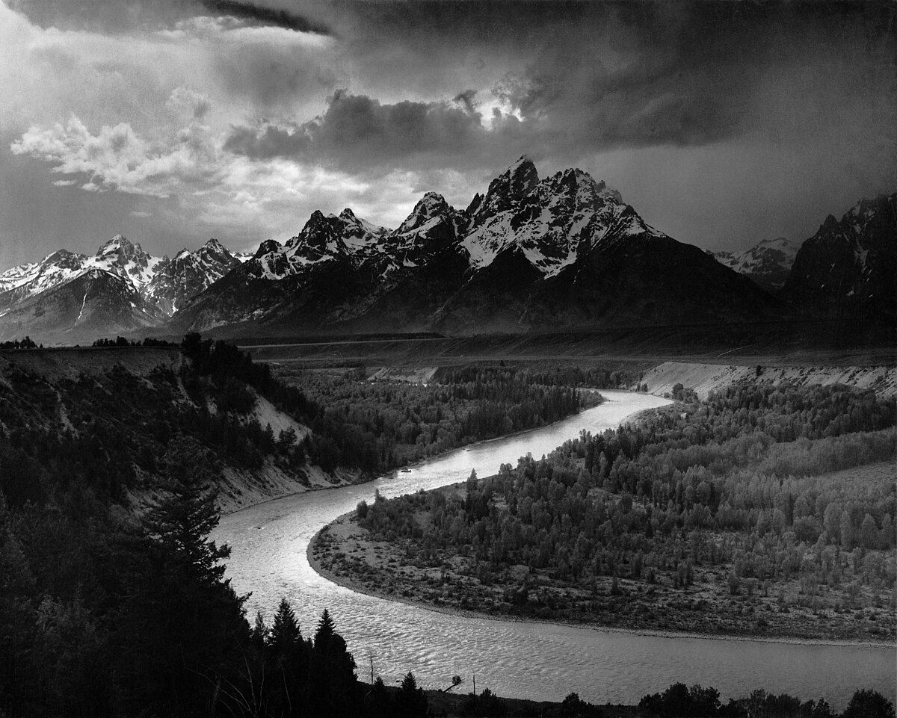

# 第 9 章 风光

> 风光摄影很慢。它练的不只是怎样按快门，而是怎样为了一个画面，愿意回到同一个地方，等一次真正合适的光。

---

*Ansel Adams, "The Tetons and the Snake River", 1942。Adams 当时受美国国家公园局委托拍摄西部风景，每年有很长时间在山里行走。这一张拍于黄石以南的 Grand Teton。他后来在《The Negative》里写过当时的曝光判断：远处雪山和近处松林相差约 7 档，已经超过当时胶片能稳稳记录的范围，于是他保住山和云，让前景松林沉成黑色。也就是说，他不是看到什么就平均收下什么，而是在按快门前已经想过，最后这张照片应该让谁留下细节，让谁退成重量。这张底片后来被放进 Voyager 的金唱片，跟着飞船离开太阳系，成为人类拿来说明地球面貌的照片之一。 (NPS, 公有领域)*

---

很多人第一次拍风光，是在旅行途中顺手举起相机。山很大，云很好，海也在眼前，于是拍几张留作纪念。这当然有价值，它记录了你到过一个地方，也记录了那一天的心情。可是严格说，这还不是本章要讲的风光摄影。风光摄影更像一种慢工作：你先在心里有一个画面，然后为了它查天气、看季节、踩机位、算日出日落方向，再把自己放到那个地方，等光真正落下来。

按快门常常只占很短的一段时间。更多时间花在走路、等待、辨认云层、观察风向和判断自己要不要继续留在原地。有时一次出行只得到一两张能留下来的照片，甚至什么也没有。一个机位第一次去没遇到光，第二次去被雾挡住，第三次风太大，第四次才碰上云缝打开的几分钟，这在风光摄影里并不稀奇。你如果把它当成旅行附带的记录，就会觉得麻烦；你如果把它当成一项需要反复回到现场的工作，这种慢反而是题材本身的一部分。

历史上的风光大致有两条路。一条是宏阔的风光，画面里有山、河、云、峡谷、海岸，常常用广角把前景、中景和远处的山天叠起来，光也要有戏剧性。Ansel Adams 在 Yosemite 和 Sierra Nevada 走了多年，他那张《Clearing Winter Storm》不是随手碰见的：冬雪刚停，云层散开，Half Dome 从缝隙里露出来，他在 Inspiration Point 等到了那一刻。Galen Rowell 在西藏为了让彩虹落到布达拉宫顶上，跟着光跑了很远。这样的照片一眼就抓人，也最容易被社交平台复制成模板，因为壮丽本身很容易让人惊叹。

另一条路更安静，拍的是近处、小处和细节。Eliot Porter 那本《In Wildness Is the Preservation of the World》里，森林并不总是以大场面出现，有时是一片叶子、一段溪水、石头上的苔藓和水珠。Michael Kenna 在北海道拍了多年雪地、孤树、木桩和海面，很多画面只剩几块灰和一点黑。Hiroshi Sugimoto 的《Seascapes》甚至长期保持同一种构图，上半是天空，下半是海面，地点换了，海和天的关系还在那里。这一路不急着给人一个“真壮观”的反应，它更像让人慢慢看，越看越能感到细节里有时间。

两条路没有高下，也不必强行二选一。刚开始时，多数人会被大山大海吸引，这是自然的；拍久了以后，很多人会慢慢转向更小的东西，因为大场面要靠天时地利，小地方反而更能训练观看。

---

风光器材的逻辑和街头、人像都不太一样。三脚架比很多人以为的重要，它不是为了显得专业，而是为了让你在慢门、低 ISO、精准构图和长时间等待里有一个稳定的支点。一个合用的三脚架要能升到眼睛附近，能扛住两三公斤的相机和镜头，收起来又不能重到你不愿意带出门。铝架便宜，碳纤维贵一些但轻，山里风大时也更稳。球形云台最省事，L 板可以让横构图和竖构图切换得很快，到了冷风里你会感谢这些小方便。

镜头不必一上来追最亮的光圈。风光常用 f/8 到 f/11，f/4 的 16-35、24-70、70-200 已经能覆盖大多数情况。16-35 适合把前景和天空一起收进来，尤其是脚边有石头、花、湿沙和小路时，广角能让近处的东西把观众带进画面。24-70 最灵活，一次远行里很多照片其实都会落在这个范围内，因为它既能拍稍微宽一点的湖岸，也能收住一段山腰和云。70-200 则适合把远处山脊、云层、树线抽出来，让画面更紧。背着器材走八公里上山时，你会发现轻一半的镜头比多一档光圈更实在。

长焦在风光里尤其容易被低估。很多人以为风光就该用广角，把眼前所有东西都装进去，可真正让画面成立的，有时只是远处一层山脊压着另一层山脊，或者云影从一个坡面慢慢移到另一个坡面。广角会强调你脚边的入口，长焦会强调远处事物之间的关系。两种镜头不是谁更风光，而是让你看见不同距离里的秩序。

滤镜也有用。CPL 可以削掉水面、叶面和玻璃上的反光，让天空更深、颜色更稳，但拍水面倒影时不要把反光全削掉，否则倒影也没了。ND 是为了把白天的快门拖慢，拍水流、云和人流的时间痕迹。GND 是一半深一半浅，用来压住过亮的天空。数码时代可以用包围曝光解决很多问题，但滤镜在现场就能让你看见接近最终的画面，这种直接反馈仍然很有价值。

还有一些东西不进入参数表，却决定你愿不愿意继续等。头灯、防雨罩、保温水壶、干粮、薄手套、能坐一会儿的折叠垫，都是风光摄影的一部分。很多照片不是技术赢来的，是你比别人多留了四十分钟。

---

风光最值得等的光，通常集中在几个短窗口里。黄金时刻是日出前后和日落前后那一段，太阳贴近地平线，光从低处擦过地面，山脊、草地、石头和浪头都会被拉出长影。早晨往往比傍晚安静，因为愿意摸黑起床的人少；傍晚则更容易有云和人活动后的痕迹。拍山、海岸和峡谷时，先看地形朝向。东侧山坡吃早光，西侧山坡吃晚光；东海岸等日出，西海岸等日落，这些判断比到现场碰运气可靠。

蓝调时刻在日落后和日出前，太阳已经不在地平线上，但天空还没有完全黑。这个时候的蓝带一点紫，城市灯、码头灯、屋子里的暖光刚好亮起来，冷暖关系很自然。许多城市天际线、灯塔、雪山和港口照片，看起来像夜景又不死黑，其实拍的就是这几十分钟。等到天空彻底黑下去，灯和背景之间的反差会突然变硬，画面反而难处理。

风暴前后也值得留下来。雨刚停，空气被洗过，远处会突然清楚；云还没有散尽，太阳从缝里落下一束，可能只照亮一座山、一片田，或者河面的一小段。地面湿了以后会反光，城市和树林都有了第二层光。许多平时平淡的地方，到了这种天气才显出结构。遇到风暴前后，不要急着收相机回车里，最好的几分钟常常在你以为已经结束之后才来。

---

经典风光构图常从三层开始：前景、中景、背景。前景是一块石头、一束草、一朵花、一条湿沙上的纹路，它让眼睛先落到近处；中景通常是湖、河、山脚、田地或树林，是画面的主要空间；背景则是山、云、天、远树。新手的风光常常只有山和天，当然也可能好看，但观众没有入口，眼睛一下子撞到远处，又不知道从哪里走进去。

找到主体以后，不要马上站着拍。蹲下来，往前走一点，再往后退一点，看有没有一个能放在画面下方的前景。河流、小路、栅栏、田垄和海浪的边缘都能把视线往里带，S 形的线会显得舒展，对角线会让画面有动势，透视线则能把人拉进深处。水面可以做对称，但要等风小，水平线也要认真校准。拍倒影时，CPL 转到一半即可，让水面还保留反射。

风光曝光的大原则是保高光。天空、云、雪和水面一旦彻底爆掉，细节很难回来。拍 RAW，看直方图，让右侧接近边界但不要撞死。反差太大时，可以包围曝光，也可以用 GND，或者干脆接受地面变暗，让山和人变成剪影。剪影不是退路，很多时候它比勉强拉开暗部更有力量。

对焦同样不能偷懒。把焦点对在无穷远，近处石头可能虚；对在脚边花草，远山又会软。一般可以对到画面纵深的三分之一处，让景深往前后铺开。更讲究时用超焦距，PhotoPills 之类的工具能直接算。当前景离镜头很近，远山又在无穷远时，f/16、f/22 不一定能解决，画面还可能因为衍射变肉。此时用对焦堆栈：三脚架不动，从近处到远处拍几张，回去把每张最清楚的部分合在一起。

---

风光的成败很大一部分在计划。先在地图、摄影网站或自己平时经过的地方找到机位，再用 PhotoPills 看日月方向，用 Google Earth 或 Street View 预判到达后能看见什么，查天气和云量，再计算路程。真正到现场，最好提前半小时到一小时。先架好脚架，试构图，确认曝光和对焦，等光开始变化时，你就不用一边慌张一边拧旋钮。

天气不对，不必硬拍。记下时间、风向、云层和哪里受光，下次再来。风光摄影不是“一次去过”，而是“一个地方被你看过很多次”。同一机位回去五次并不夸张，你是在给自己增加遇见好光的机会。

不同场景也有不同脾气，不能用同一套期待去拍所有地方。

山最需要低角度侧光。日出和日落时，光从一侧斜斜扫过来，岩面、雪线和山脊才会一层一层分开。阴天不是不能拍山，但没有方向的光会让山体很容易变平，远处看上去像一块贴在天边的剪影。拍山可以从三层构图开始，脚边放石头、草坡或一棵树，中间留出山脚和谷地，远处让主峰压住画面。广角适合把人放进山的尺度里，长焦则适合抽出山脊、积雪和云影之间的细微关系。

海岸要先看方向。东海岸通常等日出，西海岸通常等日落，因为低角度的光会同时照亮浪尖、湿沙、礁石和天空。慢门不是只有一种效果，半秒左右还能看见浪的力量，浪花会拉成丝；十几秒以后，水会变成一层雾，礁石像从雾里露出来。拍海岸时，前景可以找水边的石头、海蚀洞、潮水留下的线，或者一段完整的倒影。最需要小心的是潮汐，别只顾着画面，忘了自己站的位置过一会儿会被水包住。

森林适合阴天、雾天和雨后。硬晴天会让树干黑成一团，叶尖又白得刺眼，画面里到处都是碎亮点。阴天像给森林盖了一层大柔光，树皮、青苔、落叶和湿土的颜色会慢慢浮出来。拍森林不一定要拍大场面，35mm 到 100mm 之间反而好用，你可以拍几棵树之间的间距，一片苔藓怎样爬上石头，或者一组树叶从浅绿到深绿的过渡。

水会放大天空的颜色，也会放大风。黄金时刻的水面会留住一层金色，蓝调时刻则会变成深蓝。阴天拍溪流和湖边，可以用偏振镜削掉一部分反光，看见水底的石头和水草；但如果你要拍倒影，偏振镜就不要转到最强，否则水面会失去镜子的作用。雪地和冰面则要记得加曝光，相机会把大片白误判成中灰，最后雪会脏。让雪保持一点蓝色阴影，比把它修成纸白更有冷空气的味道。

沙漠的关键是影子。太阳低时，沙丘的脊线被自己的影子勾出来，一道一道往远处走，沙子才有起伏。中午直晒时，影子被压到脚下，画面很容易只剩一大片单调的黄。极光和星空更像户外工作，除了参数，还要照顾身体。电池贴身放，镜头从车里拿出来要先适应室外温度，金属三脚架在严寒里不要空手碰。你准备得越细，真正抬头看见光的时候，手上越不会乱。

---

风光新手最常见的问题，是不等光。正午拍山，硬晴天拍森林，中午拍海岸，最后再靠后期拉颜色，画面自然会显得用力。另一个问题是只靠变焦环凑构图，35mm 太挤就拧到 28mm，28mm 又太空就拧回 32mm，脚却没有动。焦段能改变取景范围，但透视和前景关系要靠站位改变。往前五米、后退五米、蹲下、站上石头，常常比换一个焦段更有用。

后期里最容易过头的是 HDR 和饱和度。高光暗部全都有细节，不等于照片更好；自然界本来就有明处和暗处，暗部太干净，反而像被洗掉了重量。绿色调成荧光绿，蓝天调成玻璃蓝，晚霞调成番茄汁，都会让画面离现场越来越远。风光不是越艳越美，它需要让观众相信那片光曾经真实落在那里。

---

## 练习

连续七天，在日出前后或日落前后去同一个你能到达的地方拍风光。每天只选一张，七天后放在一起看，比较光线、天气和你自己的站位有什么变化。

找一个住处附近的风光点，可以是公园、河边、山脚或一片空地。连续三次去拍同一个画面，每次换不同时间或天气。把三张并排，看同一个地方怎样被光改写。

找有水或云的场景，用 1/100 秒、1 秒和 30 秒各拍一张。不要只看哪张更漂亮，要看时间被记录成了什么样子。

带 50mm 或 70-200mm 去树林、岩石或水边，放弃宏伟场面，只拍小范围、纹理、几何和重复。回家选 5 张，看它们是否能组成一组安静的照片。

用 PhotoPills 或同类工具计划下一次拍摄。写下机位、日落或日出方向、到达时间和预想画面，拍完后把计划和实拍放在一起比较。

---

下一章：[第 10 章 建筑与城市](10-architecture.md)
