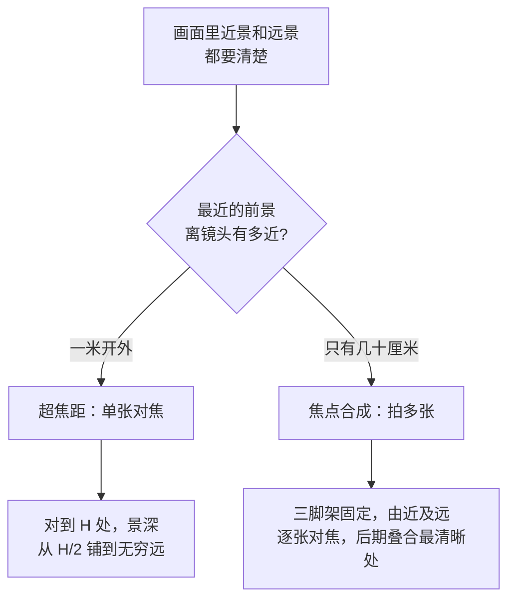

# 第 9 章 风光

> 风光摄影很慢。它练的不只是怎样按快门，还包括你愿不愿意为了一个画面回到同一个地方，等一次真正合适的光。

---

*Ansel Adams, "The Tetons and the Snake River", 1942。Adams 当时受美国内政部委托为其壁画项目拍摄西部风景，每年有很长时间在山里行走。这一张拍于黄石以南的 Grand Teton。从成片就能读出他的曝光取舍：远处雪山和近处松林反差很大，他把细节给了山、云和那条发亮的蛇河，让前景松林沉成深色的重量。他没有把眼前所有东西平均收下，而是在按快门前已经想过，最后这张照片应该让谁留下细节，让谁退成重量。这张底片后来被放进 Voyager 的金唱片，跟着飞船离开太阳系，成为人类拿来说明地球面貌的照片之一。 (NPS, 公有领域)*

---

很多人第一次拍风光，是在旅行途中顺手举起相机。山很大，云很好，海也在眼前，于是拍几张留作纪念。这样的照片当然有它的价值，它记录了你到过一个地方，也记录了那一天你站在那里的心情。可是严格说起来，这还不是本章真正要讲的风光摄影。风光摄影更像一种慢工作：你先在心里有一个画面，然后为了它查天气、看季节、踩机位、算日出日落方向，再把自己放到那个地方，安安静静地等光真正落下来。画面在你出门之前就已经开始成形，现场要做的，只是把心里那张照片和眼前的光对上。

按快门在整个过程里常常只占很短的一段时间。更多的时间，其实花在走路、等待、辨认云层、观察风向，以及判断自己要不要继续留在原地这些看不出成果的事情上。有时一次出行下来，只得到一两张能真正留下来的照片，甚至可能什么也没带回来。一个机位第一次去没遇到光，第二次去被雾挡住，第三次赶上风太大，直到第四次才碰上云缝打开的那几分钟，这在风光摄影里一点也不稀奇。同样一种慢，落在不同的人眼里意味着完全不同的东西：你如果把它当成旅行附带的记录，只会处处嫌麻烦；你如果把它当成一项需要反复回到现场的工作，这种慢反而正是题材本身的一部分。

从历史上看，风光摄影至少发展出两种很常见的方向。第一种是宏阔的风光，画面里有山、有河、有云、有峡谷、有海岸，常常用广角把前景、中景和远处的山天层层叠起来，光线也要有戏剧性，才压得住这么大的场面。Ansel Adams 在 Yosemite 和 Sierra Nevada 走了许多年，所以他那张《Clearing Winter Storm》并不是随手碰见的画面：冬雪刚停，风暴的云层正在散开，左侧 El Capitan 的岩壁和右侧的 Bridalveil 瀑布从翻涌的云雾里显出来，整个山谷像刚被揭开盖子，他在能俯瞰全谷的观景点上一直等，等到的就是那一刻。看上去像是天赐的巧合，其实是长年守候换来的。Galen Rowell 的故事则把“等”换成了“追”。1981 年在拉萨，他傍晚看见一道彩虹挂在雨云下，立刻意识到只要自己移动到某个恰当的位置，彩虹的落点就会正好压在布达拉宫的金顶上——彩虹不是一个固定的物体，它的位置随观察者移动。于是他在海拔三千七百米的高原上，扛着器材狂奔了一英里多，一边跑一边心算彩虹与宫殿的对位，跑到那个点上，拍下了《Rainbow over the Potala Palace》。这个故事说破了风光的一层底细：预判和体力，同样是技术的一部分。这样的照片一眼就能抓住人，也因此最容易被社交平台复制成一套模板，因为壮丽本身几乎不需要解释，就足以让人惊叹。

与之相对，另一种方向要安静得多，拍的是近处、小处和容易被忽略的细节。Eliot Porter 那本《In Wildness Is the Preservation of the World》里，森林并不总是以大场面出现，有时不过是一片叶子、一段溪水，或者石头上的一层苔藓和几颗水珠。Michael Kenna 在北海道拍了许多年的雪地、孤树、木桩和海面，很多画面最后只剩下几块灰和一点黑，却反而更耐看。Hiroshi Sugimoto 的《Seascapes》甚至长期保持同一种构图，上半永远是天空，下半永远是海面，地点一次次换了，海和天的那种关系却始终留在那里。这一路并不急着给人一个“真壮观”的即时反应，它更像是请人慢慢地看，越看越能感觉到，那些细节里其实藏着时间。

这两种方向之间并没有高下之分，也不必强行二选一。刚开始拍的时候，多数人会先被大山大海吸引，这是很自然的。可是拍得久了以后，很多人会慢慢转向更小的东西，原因也不难理解：大场面往往要靠天时地利，可遇而不可求，小地方却几乎随处都有，反而更能日复一日地训练你的观看。

---

风光器材的逻辑，和街头、人像那一套都不太一样。三脚架就是一个典型的例子，它比很多人以为的要重要得多。带三脚架不是为了显得专业，而是为了让你在慢门、低 ISO、精准构图和长时间的等待里，始终有一个稳定的支点。一个真正合用的三脚架，要能升到眼睛附近，方便你直接从取景器里推敲构图；要能扛住两三公斤的相机加镜头而不晃；收起来又不能重到让你在出门前就打退堂鼓。铝架便宜，碳纤维贵一些但轻，而且山里风大的时候也更稳。云台上，球形云台调整起来最省事，一个旋钮就能锁定方向；L 板则能让你在横构图和竖构图之间切换得很快，机身不必歪到一边。等到了冷风里，手指冻得不听使唤，你就会格外感谢这些平时不起眼的小方便。

镜头方面，不必一上来就追最亮的光圈。风光常用的光圈落在 f/8 到 f/11 之间，既有足够的景深，画质又刚好在最好的一段，所以 f/4 的 16-35、24-70、70-200 这三支，已经能覆盖大多数情况。这三支各有各的用处。16-35 适合把前景和天空一起收进来，尤其当脚边有石头、花、湿沙和一条小路时，广角能把这些近处的东西夸张地放大，像一个入口一样，把观众带进画面深处。24-70 是里头最灵活的一支，一次远行下来，很多照片其实都会落在这个范围内，因为它既能拍稍微宽一点的湖岸，也能收住一段山腰和一片云。70-200 则适合把远处的山脊、云层和树线单独抽出来，让画面更紧、更有秩序。选镜头时还要把体力算进去：当你背着器材走八公里上山，你会发现轻一半的镜头，往往比多出一档光圈来得实在。

长焦在风光里尤其容易被低估。很多人以为，风光就该用广角，把眼前所有东西尽数装进去才算数。可真正让一张画面成立的，有时只是远处一层山脊压着另一层山脊，或者一片云影从一个坡面慢慢移到另一个坡面而已，这些关系用广角根本收不住，非长焦不可。广角强调的是你脚边的那个入口，长焦强调的则是远处事物彼此之间的关系。所以这两种镜头，并不是谁比谁更算风光镜头，而是分别让你看见不同距离上的秩序。

滤镜同样有它的用处。CPL，也就是偏振镜，可以削掉水面、叶面和玻璃上的反光，让天空更深、颜色更稳；不过要留一个心眼，拍水面倒影的时候，千万别把反光全削光，否则倒影也会跟着一起消失。ND 是减光镜，作用是把白天的快门硬生生拖慢下来，好让你去记录水流、云和人流走过的时间痕迹。GND 则是一半深一半浅的渐变镜，专门用来压住画面上方那片过亮的天空，把它和地面的亮度拉近。数码时代当然可以用包围曝光在事后解决很多类似的问题，可是滤镜有一个后期替代不了的好处：它在现场就能让你透过取景器看见接近最终的那张画面，这种直接的反馈仍然很有价值。

既然 ND 的用处在于把白天的快门硬生生拖慢，那么它究竟能拖慢到什么程度，就取决于它挡掉了多少光。ND，也就是中灰密度镜，特点是只减光而不改变颜色，所以哪怕在光线很足的白天，也能让你用上平时几乎只有夜里才敢用的慢门。它的型号数字大致对应减光的倍率，也就是 \(2^{档数}\)：每多挡一档光，进光量就减半，快门也就要相应地放慢一档来补回来。

| ND 型号 | 减光档数 | 透光率 | 典型用途 |
|---|---|---|---|
| ND2 | 1 档 | 50% | 轻微减光 |
| ND8 | 3 档 | 12.5% | 流水柔化 |
| ND64 | 6 档 | 1.6% | 白天长曝 |
| ND1000 | 10 档 | 0.1% | 云海、雾化水面 |

这张表真正要说的，其实是一件很直接的事：减掉几档光，就能把快门相应地放慢几档。想把一道瀑布拍成垂下来的丝，或者把翻涌的海面拍成一层雾，靠的正是它，把曝光时间从几百分之一秒一路拉到几秒，甚至几十秒。至于该挂哪一片，全看你想留住多少时间：ND8 已经足以把溪流柔化成有流向的水痕，ND1000 则能在大白天里把流云和水面拖成一层平雾。等到本章后面讲海岸时你会更清楚地看到，同样一片海，快门快一点还是慢一点，记录下来的其实是两种完全不同的东西。

前面提到偏振镜能削掉水面和叶面上的反光，这里不妨把它背后的道理讲清楚，因为一旦明白它究竟在做什么，你就会知道它什么时候管用、什么时候使不上力。日光本来在各个方向上都在振动，可是当它斜射到水面、玻璃或者潮湿的叶片这类非金属表面上，被反射出来的那一部分光，振动方向会集中到某一个平面上，也就是被“偏振”了。偏振镜（polarizer，实际用的多是可以旋转的环形偏振镜 CPL）的作用，就是只放行某一个振动方向的光，因此只要转动它，就能把那层振动方向固定的反光挡在外面，让水底的石头、叶片本身的颜色，从那层白蒙蒙的反光底下重新显出来。

这层反光被削得最干净的时候，落在一个特定的角度上。当光线以某个角度打到界面上，反射出来的光会变得完全偏振，这个角度叫作**布儒斯特角**（Brewster angle），它由界面两侧介质的折射率决定：

\[ \theta_B = \arctan n \]

式中 n 是反射面那一侧介质的折射率（此式假定光从空气一侧入射，摄影里几乎总是如此）。水的折射率约为 1.33，算下来布儒斯特角大约是 53°；普通玻璃约为 1.5，对应大约 56°。当你的视线与水面法线之间大约成五十几度，也就是从三十几度的俯角望向水面时，偏振镜削反光的效果最好。角度一旦偏离得远了，能削掉的反光就随之变少，这也解释了为什么同样一片湖，换一个站位、换一个俯角，偏振镜的效果会差得如此明显。

偏振镜还有第二个常被用到的用处，就是压暗蓝天，而这件事同样有它自己的几何。天空之所以呈蓝色，是因为阳光被空气里的分子散射开来，这种现象叫作瑞利散射（Rayleigh scattering），而散射出来的天光本身就带着偏振，偏振最强的那一圈，恰好落在与太阳成 90° 的方向上。所以当你把镜头对准与太阳垂直的那片天空，再转动偏振镜，蓝天会明显地沉下去，白云于是被反衬得更亮、更立体。反过来，如果你正对着太阳或者背对太阳去拍，这个 90° 的条件不成立，偏振镜压暗天空的效果就几乎看不出来。用超广角拍摄时还要多留一层心：一整片天空里，只有靠近 90° 的那一段被压得最暗，而广角一下子收进太大的天空，就可能出现一边深、一边浅、过渡不匀的蓝，这时反倒要把偏振镜往回转一点，不去追那个最强的效果。

把三种最常用的滤镜摆在一起，各自对付的其实是不同的难处：

| 滤镜 | 物理作用 | 主要用途 | 现场要留意 |
|---|---|---|---|
| **偏振镜** CPL | 只放行单一振动方向的光，滤掉偏振的反光 | 削水面、叶面反光；压暗与太阳成 90° 的蓝天 | 拍倒影别转到最强；超广角容易出不匀的天空 |
| **中灰密度镜** ND | 均匀减光而不偏色 | 白天长曝，把快门拖到几秒乃至几十秒 | 按档数换算曝光；减光强时先对焦，再装滤镜 |
| **渐变灰** GND | 一半压暗、一半透明 | 压住过亮的天空，缩小天与地的光比 | 按地平线选软边或硬边；后期包围可替代 |

除了这些，还有一些东西从来不会出现在参数表上，却实实在在地决定着你愿不愿意继续等下去。头灯、防雨罩、保温水壶、几块干粮、一副薄手套，还有一块能让你坐下来歇一会儿的折叠垫，其实都是风光摄影的一部分。很多照片并不是靠技术赢来的，而是靠你在别人都已经收起相机之后，还愿意多留那么一会儿。

---

前面几次提到慢门，这里把它当作一门独立的技术单独讲一讲，因为把水拍成丝、把云拍成一道轨迹，靠的并不只是挂上一片 ND 那么简单，它是一整套需要彼此配合的动作。先说曝光要拖到多慢。想要的效果不同，需要的曝光时间也差着数量级，大致可以照下面这张表来找感觉：

| 想要的效果 | 大致曝光时间 |
|---|---|
| 浪花见丝、水仍带着力道 | 0.5 - 2 秒 |
| 溪流柔化成一段绸子 | 2 - 5 秒 |
| 海面化成平雾、礁石浮现 | 10 - 30 秒 |
| 流云拉出长长的轨迹 | 30 秒到数分钟 |

知道了要拖到多慢，接下来的问题就是怎样把快门拖到那里。白天光线充足，单靠收光圈和压低 ISO 远远不够，这时候就要靠 ND 来减光，而究竟该减几档，是可以直接算出来的：每加一档 ND，进光量减半，快门就要放慢一档来补，也就是把曝光时间乘以 \(2^{档数}\)。举个例子，假设现场在 f/11、ISO 100 下测光给出的是 1/125 秒，你挂上一片十档的 ND1000，曝光时间就要乘以 \(2^{10}=1024\)，1/125 秒于是变成大约 8 秒；如果换成六档的 ND64，1/125 秒则变成大约 0.5 秒，正好落在把浪花拉成丝的那一段。选哪一片 ND，本质上就是先想清楚要拖到几秒，再倒推需要减掉几档光。

拖到几秒、几十秒之后，另一件事就变得要紧起来：只要曝光的这几秒里相机动了哪怕一丁点，整张画面就会跟着糊掉，而这一点点抖动的来源，往往正是你自己。所以慢门几乎离不开三脚架，而且光有三脚架还不够，按下快门这个动作本身就会把机身压得一沉，因此要用快门线，或者退一步用相机的延时自拍（两秒或十秒），让手离开机身之后快门才真正打开。用单反的话，还要留意反光板：每次曝光的一瞬间，反光板会先弹起，这一下会带来一次不小的震动，所以拍慢门时最好开启**反光板预升**（mirror lock-up），让它先升起来、等震动平息之后，快门再开。无反相机没有这块反光板，却也有一处类似的讲究，就是尽量用**电子前帘快门**（electronic front-curtain shutter），用电子的方式代替机械前帘的启动，把快门自身那一下轻微的震动也省掉。慢门拍的是时间，而在这段时间里，你要做的恰恰是让相机彻底安静下来，一丝不动。

---

风光里最值得等的光，通常都集中在一天当中几个很短的窗口里。黄金时刻指的是日出之后与日落之前、太阳还贴着地平线低垂的那一段，光线从很低的角度擦过地面，山脊、草地、石头和浪头因此都会被拉出长长的影子，景物顿时就有了立体感。这段光不只角度低，颜色也偏暖，而这背后和天为什么是蓝的，其实是同一条道理：太阳贴近地平线时，阳光要斜穿过厚得多的一段大气才能到你眼前，一路上波长较短的蓝紫光被空气分子不断散射掉（也就是前面讲偏振镜时提过的瑞利散射），等这束光走到跟前，剩下的便多是波长较长的橙红，于是同样一块岩石、一片草，在这个时候看上去都像镀了一层暖调。这两段光虽然性质相近，气氛却不太一样：早晨往往比傍晚安静，因为愿意摸黑爬起来的人本就少；傍晚则更容易碰上云，也更容易留下人活动过一整天之后的种种痕迹。拍山、海岸和峡谷之前，先要看清地形的朝向，这一点尤其要紧。道理很简单：东侧的山坡吃的是早光，西侧的山坡吃的是晚光；同样，东海岸适合等日出，西海岸适合等日落。事先把这些朝向想明白，远比到了现场再碰运气来得可靠。

蓝调时刻则在日落之后和日出之前，这时太阳已经沉到地平线以下，天空却还没有完全黑透。这个时候的蓝里往往带着一点紫，恰好城市的路灯、码头的灯和屋子里的暖光又刚刚亮起来，一冷一暖凑在一起，关系显得格外自然。许多城市天际线、灯塔、雪山和港口的照片，看上去像夜景，却又不是死黑一片，其实拍的正是这短短的几十分钟。等到天空彻底黑下去，灯和背景之间的反差就会突然变硬，画面反而更难处理了。

把这两段光放在一起看，也就更容易明白风光拍摄的功夫究竟花在哪里。黄金时刻是日出之后与日落之前太阳低垂的那一段，光线偏暖、角度低、影子拉得很长，是风光里最讨喜的一种光；蓝调时刻则是太阳落到地平线以下不久的那一小段，天空沉成深蓝，光比骤然收窄，城市的灯火和残余的天光恰好彼此平衡，最宜于拍摄夜与昼交界处的城市与水景。这两段窗口有一个共同点，就是都非常短，通常各自只有二三十分钟。也正因为窗口这样窄，真正决定成败的往往不是最后那几下快门，而是你能不能提前到位，然后安安静静地把这一刻等下来。

风暴的前后同样值得你留下来守一守。雨刚停的时候，空气像被水洗过一遍，远处的景物会突然变得异常清楚；云还没有完全散尽，太阳从云缝里斜斜地落下一束光来，可能只照亮一座山、一片田，或者河面上的一小段。与此同时，地面被雨水打湿之后会反光，城市和树林于是都多出了第二层光。许多平时看起来平淡无奇的地方，偏偏要到这种天气里才显出它的结构和层次。所以遇到风暴前后，千万不要急着收起相机躲回车里，风光里最好的那几分钟，常常是在你以为一切都已经结束之后，才姗姗到来。

---

经典的风光构图，常常从三层结构开始搭起：前景、中景和背景。前景可以是一块石头、一束草、一朵花，或者湿沙上的一道纹路，它的作用是让观众的眼睛先落到近处，有一个落脚的地方；中景通常是湖、河、山脚、田地或者树林，是整张画面的主要空间；背景则交给山、云、天和远处的树，负责把画面的深度撑开。新手拍的风光，画面里常常就只有山和天两层，这样当然也可能好看，但更多的时候，问题在于观众没有一个进入画面的入口：眼睛一抬起来就直接撞到了远处，却不知道该从哪里走进去。

找到主体以后，也不要急着就站在原地举起相机。不妨先蹲下来，往前走一点，再往后退一点，一边挪动一边看，画面下方有没有一个可以安放的前景。河流、小路、栅栏、田垄，还有海浪的边缘，这些线条都能把观众的视线顺势往画面里带，而三种线各有各的脾气，也各有最合适的场景。S 形的线舒展从容，一条在谷地里拐了两道弯的河，一条绕过沙丘的小径，都会让画面慢下来，观众的眼睛沿着弯道一段一段往里走；对角线带着动势，一道从画面左下切向右上的海浪线、一条斜穿画面的山脊，会给静止的风景添上一股倾斜的力；透视线则最直接，田垄、栈道、一排电线杆朝着远方收拢，把人不由分说地拉进画面深处。用线条也有一条要防的反例：线是把双刃剑，它把视线引到哪里，观众就看到哪里，一条通向画面边缘、尽头却空无一物的路，等于亲手把观众送出画外——引导线的终点必须有东西接住，一座山、一间屋、一个人，否则宁可不用。如果眼前有水面，可以尝试做对称构图，不过这要等到风小的时候才行，否则水面一皱，对称也就散了，与此同时，水平线务必认真校准，稍微一歪就格外扎眼。

风光曝光的大原则，是先保住高光。天空、云、雪和水面这些地方，一旦彻底爆掉，细节基本上就再也找不回来了。所以稳妥的做法是拍 RAW，随时看直方图，让右侧接近边界，却又不要直接顶到最右端。遇到反差实在太大的场景，办法也不止一个：可以用包围曝光把不同亮度各拍一张回去合并，可以用 GND 直接在现场压住过亮的天空，也可以索性接受地面沉下去，让山和人变成剪影。要说明的是，剪影并不是被迫采用的退路，很多时候，它比勉强把暗部强行拉开还要有力量，因为它把形状本身留了下来。

这里不妨把 GND 单独展开来讲，因为它对付的，正是风光里最常见也最棘手的一种难处。天空往往比地面亮上好几档，单靠一次曝光，常常顾了天就丢了地，保住了地面又留不住天空。渐变灰滤镜，也就是 GND，一半透明、一半压暗，正好用压暗的那一半盖住过亮的天空，把天与地之间悬殊的光比，重新拉回到传感器一次就能容下的范围之内。至于该用哪一种，要看地平线长什么样：软边 GND 的明暗过渡是渐进的，适合地平线并不齐整的场景，比如起伏的山峦和参差的树林；硬边 GND 的分界更利落，则适合海面、平原这类地平线又平又直的地方。边选对了，压暗的那一半和天空交接的地方，才不至于在画面里露出一道生硬的痕迹。

把话说回到反差本身。前面提到，遇上天比地亮太多的场景，可以包围曝光，可以上 GND，也可以索性接受剪影，这里值得把包围曝光这条路再讲深一点，因为它背后其实是一个关于**动态范围**（dynamic range）的问题。一台相机的传感器，在一次曝光里能同时容纳的最亮到最暗的跨度是有限的，如今较好的全画幅传感器，在最低 ISO 下大约能记录十三到十五档的光比。可是日出日落这类场景，天上正对着太阳的那片云，和地面阴影里的一块石头之间，光比常常超过十五、十六档，早已越出了传感器一次能装下的范围。无论你怎样摆布那一次曝光，总会有一头被牺牲掉：保住了天空，地面就黑成一团；照顾了地面，天空就白成一片。

**包围曝光**（exposure bracketing）正是为这种局面准备的。它的做法，是保持机位和光圈不动，只改变快门，围绕一个基准各拍几张：一张按正常曝光，一张压暗一到两档去保住高光，一张再提亮一到两档把暗部的细节拉出来，回到后期，再把每一张里曝光最恰当的那一部分融合到一起。相比 GND 那种在现场硬压天空的办法，包围曝光的好处是它不挑地平线的形状，山峦、树梢、城市天际线这些参差不齐的边界，它都能干净地兜住；代价则是必须架稳三脚架、把几张拍得严丝合缝，而且画面里不能有移动太快的物体，否则合成时就会留下重影。

至于每一次到底要不要包围，除了看直方图和高光警告，还有一个更主动的办法：用点测光把这个场景的光比直接量出来。把测光模式切到点测，先对准天上最亮、又想保住细节的那块云，记下读数；再对准地面阴影里想保住细节的那块石头，记下读数。两个读数之间差几档，这个场景的有效光比就是几档。差六七档以内，单张 RAW 完全兜得住，按保高光的原则曝一张就是；差到十档上下，单张已在传感器能力的边缘，该上 GND 或包围了；差到十二档以上，包围几乎是唯一的路，而且要按差值决定包围的档距和张数——差十二档，三张各隔两档就够；差得再多，便加到五张。这套量法把“要不要包围”从猜变成了算。此外到了现场，直方图有没有一头撞到右侧的墙、高光警告有没有闪，仍是最后一道检查：一旦发现单张无论怎么曝都按不住眼前这个反差，那就说明该架稳三脚架、开始一档一档地包围了。

对焦这一步同样不能偷懒。如果把焦点一味对在无穷远，近处的石头就可能发虚；反过来对在脚边的花草上，远处的山又会跟着软掉。一个折中的常规办法，是对到画面纵深大约三分之一的位置，让景深从这里往前后两边铺开。更讲究的时候，可以用超焦距来计算最佳的对焦距离，PhotoPills 之类的工具能直接替你算好。不过要注意，当前景离镜头很近，而远山又远在无穷远时，光靠收小光圈到 f/16、f/22 未必解决得了问题，画面反而可能因为衍射而整体发软。这种时候就该动用对焦堆栈：让三脚架稳稳不动，从近到远依次拍上几张，每张各对实一段距离，回到家里再把每一张里最清楚的那一部分挑出来合在一起。

这种做法在风光里有一个专门的名字，叫焦点合成。它要应付的，正是近景与远景都想要全清、而单张景深怎么也不够用的那种局面：与其把光圈一味收到 f/16、f/22 去勉强凑景深，反倒把整幅画面拖进衍射，不如固定机位，从最近一路对到最远，拍下若干张对焦点各不相同的照片，再到后期把每一张里最清楚的那一部分叠合起来，最终得到一张前后都通透的合成图。它最大的好处，就在于绕开了小光圈带来的那份衍射损失，因此成了风光追求极致清晰时的常用手段。这一点也正好和第 5 章讲过的超焦距与衍射前后呼应：超焦距是在一次曝光之内做的取舍，用一个折中的对焦点去换取尽量大的景深；焦点合成则索性用多张照片，去换来一份更彻底、也更少妥协的景深。

景深不够，可以用多张去换；视角不够，同样可以。这就是全景接片（panorama stitching）：机位不动，镜头一格一格地横向（或纵向）转过去，相邻两张之间保留约三分之一的重叠，回到后期让软件把它们拼成一整幅。风光里用它的理由通常有两个：一是画幅——一道横贯天际的山脊、一片铺开的海湾，天然就是 2:1、3:1 的横长比例，单张裁出来白白扔掉大半像素，接片却把每一格的像素都留下，轻松拼出上亿像素的大图，放印一米宽的挂画也绰绰有余；二是视角——手里只有 35mm，却想要 16mm 的宽度，横着接四张就有了，而且透视比超广角单张更自然，边缘也没有拉伸。要点有几条：全程手动曝光、手动白平衡、手动对焦，让每一格的参数完全一致，否则拼缝处会出现亮度和颜色的台阶；竖拍横接是老手的习惯，纵向多出的余量给后期裁切留路；转动时尽量绕着镜头的入瞳转（第 5 章末尾讲过这个点），近处有前景时尤其要紧，否则近景与远景在相邻两格里错位，软件怎么也拼不拢——没有全景云台的话，把近前景从画面里让出去，也是一种务实的回避。

---

前面提到可以用超焦距来定对焦点，这里把它讲透，因为它正是风光里用一张照片去换取最大景深的核心办法。所谓**超焦距**（hyperfocal distance），指的是这样一个对焦距离：当你把焦点对到它上面时，从这个距离的一半起，一直到无穷远，都会落在可以接受的清晰范围之内。只要对在超焦距上，你就用一次对焦，同时照顾到了相当近的前景和无穷远处的山。它可以用一个简洁的式子来估算：

\[ H \approx \frac{f^2}{N \cdot c} \]

式中 f 是焦距，N 是光圈 f 值，c 则是**弥散圆**（circle of confusion）的直径，也就是允许一个点模糊到多大仍算清楚的那个尺度，全画幅通常取 0.03 mm 上下。式子里 f 带着平方，所以焦距的影响很重：焦距一旦拉长，超焦距就会迅速变远。

把几个常用焦距在 f/11、全画幅下的超焦距算出来，摆在一起，就能明白风光为什么偏爱广角：

| 焦距 | 超焦距 H（f/11） | 清晰范围 |
|---|---|---|
| 16mm | 约 0.8 m | 约 0.4 m 到无穷远 |
| 24mm | 约 1.7 m | 约 0.9 m 到无穷远 |
| 35mm | 约 3.7 m | 约 1.9 m 到无穷远 |
| 50mm | 约 7.6 m | 约 3.8 m 到无穷远 |

把这几个数字摆在一起，有一件事就很清楚：用 16mm 拍，只要对到不足一米的地方，从半米开外一直到远山就全都清楚了，所以广角想做到近处远处都实，其实相当轻松；可换成 50mm，超焦距一下退到了七米开外，脚边一两米的前景就再难塞进景深里。这也从另一个角度解释了，为什么当你既想要极近的前景、又用上了较长的焦距时，单靠超焦距会力不从心，只能转而求助于焦点合成。

现场究竟该走哪一条路，可以照下面这个判断来定：

---

顺着景深往下说，就绕不开另一个问题：光圈到底该收到多少？直觉上，光圈收得越小，景深越大，前前后后就越清楚，那是不是一路收到 f/22 最保险？答案是否定的，这里面有一个绕不过去的权衡，也正是第 5 章讲衍射极限时埋下的伏笔。光本质上是一种波，当它穿过一个越来越小的孔时，会在孔的边缘发生**衍射**（diffraction）：一个本该聚成一点的光源，最后会在传感器上摊开成一个带着光环的小圆斑，这个斑叫作艾里斑（Airy disk）。它的直径，与光圈 f 值成正比：

\[ d \approx 2.44 \, \lambda N \]

式中 λ 是光的波长（可见光里取绿光，约 0.00055 mm），N 是光圈 f 值。光圈收得越小，N 越大，这个斑就摊得越大，画面的细节也就被它抹得越糊。

把它算成具体的数字，再和前面那个 0.03 mm 的弥散圆放在一起比，就明白 f/22 的问题究竟出在哪里：

| 光圈 | 艾里斑直径 | 主导画质的因素 | 整体锐度 |
|---|---|---|---|
| f/5.6 | 约 0.008 mm | 像差为主，衍射尚小 | 中心锐利，边角略软 |
| f/8 | 约 0.011 mm | 像差与衍射都不大 | 全画面最锐 |
| f/11 | 约 0.015 mm | 衍射开始显现 | 仍然很好，景深更大 |
| f/16 | 约 0.021 mm | 衍射已经明显 | 锐度下降，换来更深景深 |
| f/22 | 约 0.030 mm | 衍射主导 | 艾里斑已逼近弥散圆，全画面明显发软 |

这张表要说的，其实是两股力量的此消彼长。光圈开得很大时，画质主要被镜头本身的各种像差（球差、彗差、场曲等等）拖累，边角尤其软；把光圈往下收，像差会迅速收敛，画面随之变锐；可一旦收得过了头，衍射又反过来占了上风，把好不容易得到的锐度重新吃掉。两股力量一进一退，中间必然有一个最锐的甜区，对多数全画幅镜头而言，这个甜区就落在 f/5.6 到 f/11 之间。这也正是风光常用光圈定在 f/8 到 f/11 的缘故：它既给出了足够的景深，又恰好落在锐度最好的那一段。真要用到 f/16 甚至 f/22，通常是因为景深实在不够、不得不拿一点锐度去换，而不是因为这两档本身更清楚。若一张画面既要极近的前景、又要极远的山，与其把光圈一路收到 f/22 去硬凑景深、反倒白白招来衍射的损失，不如退回 f/8 到 f/11，改用前面讲过的焦点合成，用多张照片去换那份既深又锐的清晰。

---

风光的成败，很大一部分其实在你出门之前就已经决定了，关键就在计划。通常先要在地图、摄影网站，或者自己平时经过的地方里找到一个候选机位，再用 PhotoPills 看清那一天日月升落的方向，用 Google Earth 或者 Street View 预判自己到达之后大致能看见什么，接着查天气和云量，最后把路程和所需的时间也一并算进去。把这套流程落成一次真实的计划，大致是这个样子。目标：某处向西的海岸，拍日落时浪打礁石的慢门。查 PhotoPills，当天日落 18:42，方位角 261°，正好落在那排礁石的斜后方，是带着一点侧向的逆光，这个机位便算成立；查潮汐表，18 点前后是退潮中段，礁石会露出水面，且不至于把你困在滩上；查云量，预报西边低云两成、中高云四成——这个组合值得出门，理由下面马上讲；从停车点走到机位约二十五分钟，倒推 17:30 前必须出发；装包时按清单过一遍：三脚架、快门线、ND64 和 ND1000、GND、头灯（回程天黑）、防水鞋。这样一张纸列下来，现场剩下的就只有等光和按快门两件事。

查云量这一步，值得多学一层怎么判读，因为“多云”两个字对风光而言信息量几乎为零，要紧的是云的高度和位置。日出日落要烧出满天的红霞，最理想的组合是头顶和半空有中高云（卷云、高积云那种带纹理的），而太阳落下的那一侧地平线附近恰好留着一条空隙——太阳沉到地平线下后，光从这条缝里钻出来，从下方把半空的云底整个点燃。反过来，地平线那一侧堆着厚厚的低云，光根本钻不出来，头顶的云再好看也只会灰下去，这是最常见的空手而归。云隙光（一道道光柱从云洞里斜射下来）则要等积云成块、彼此留缝的天气，雨后初晴最容易碰上。至于雾，秋冬季晴朗无风的夜晚，地面散热快，清晨的河谷、湖面最容易起辐射雾，头天夜里看好“晴、湿、静风”这三个条件，第二天摸黑到高处等日出，十有五六能等到雾海。把云和雾读成这样的具体条件，天气预报才真正变成拍摄计划的一部分。

真正动身到了现场，最好能提前半小时到一小时抵达。这段提前量不是白等：你可以先把脚架架好，从容地试几个构图，确认曝光和对焦都没问题，这样等到光真正开始变化的那几分钟里，你就不必一边手忙脚乱一边胡乱拧旋钮。

如果到了现场发现天气不对，也不必勉强拍摄。更聪明的做法，是把当天的时间、风向、云层，以及哪些地方受光这些信息都记下来，留待下次再来。风光摄影从来不只是“一次去过”那么简单，它更像是同一个地方被你反反复复地看过很多次。同一个机位回去五次，在风光摄影里一点都不算夸张，你每回去一次，都是在为自己增加一次遇见好光的机会。

话说回来，不同的场景各有各的脾气，你不能指望用同一套期待去拍所有的地方。山、海岸、森林、水和沙漠，看似都归在风光名下，真正对付起来讲究却各不相同，最好一样一样分开来记。

先说山。山最需要的是低角度的侧光。日出和日落的时候，光从一侧斜斜地扫过来，岩面、雪线和一道道山脊才会被光影一层一层地分开，山的体量这才立得起来。阴天并不是不能拍山，只是没有方向的散光会让山体很容易变平，远远看上去，就像一块贴在天边的剪影，扁扁的没有厚度。拍山可以从前面讲过的三层构图入手：脚边放一块石头、一片草坡或者一棵树当前景，中间留出山脚和谷地这一段中景，远处再让主峰压住整个画面的分量。至于镜头，广角适合把人一并放进山的尺度里，衬出山有多大；长焦则适合从大山里抽出山脊、积雪和云影之间那些细微的关系。

再说海岸。拍海岸，第一步同样是先看方向。东海岸通常等日出，西海岸通常等日落，道理在于低角度的光能够同时照亮浪尖、湿沙、礁石和天空。海边常用的慢门，效果也不止一种，全看你把快门拖到多慢：半秒左右的时候，你还能看见浪本身的力量，浪花被拉成一条条丝；等曝光到了十几秒以后，水就整个化成了一层平雾，礁石仿佛是从这片雾里慢慢露出来的。拍海岸时，前景可以去找水边的石头、海蚀洞、潮水在沙上留下的线，或者一段完整的倒影。而海边最需要小心的，其实是潮汐：别只顾着盯取景器里的画面，一低头忘了自己站的位置，过一会儿很可能就被涨上来的水团团围住了。

森林则正好相反，它最适合阴天、雾天和雨后。强烈直射光下的森林会很难拍：透进来的强光会让树干黑成一团，叶尖又被照得白得刺眼，画面里到处都是零碎的亮点。阴天就像给整片森林盖上了一层巨大的柔光罩，树皮、青苔、落叶和湿土的颜色会一点一点地浮出来。拍森林并不一定非要拍大场面，35mm 到 100mm 之间的焦段反而更好用：你可以拍几棵树之间的间距，拍一片苔藓是怎样爬上一块石头的，或者拍一组树叶从浅绿到深绿的那一段过渡，都比勉强塞下一整片林子更耐看。

水是个放大器，它既放大天空的颜色，也放大风。黄金时刻里，水面会替你留住一层金色；到了蓝调时刻，同一片水又会沉成深蓝。阴天拍溪流和湖边时，可以用偏振镜削掉一部分水面的反光，好让水底的石头和水草显出来；但要提醒的还是那句话，如果你的目的本来就是拍倒影，偏振镜就不能转到最强，否则水面会失去它当镜子的本事，倒影也就没了。至于雪地和冰面，则要记得主动加曝光。相机的测光默认眼前大致是一片反射率约 18% 的中灰，一遇到满画面的雪，它仍旧照这个假设去压，硬把本该雪白的雪拍成灰扑扑的一片，显得很脏。破解的办法是干脆逆着它来，主动增加一到两档曝光，把雪重新提回它本来的白，同时盯住直方图，别让它彻底顶到最右、把雪的层次也一并烧掉。让雪保留一点淡淡的蓝色阴影，会比把它一路修成纸一样的死白，更有冷空气的味道，也更有空间感。

沙漠的关键，则全在影子上。太阳低的时候，一道道沙丘的脊线会被它们自己投下的影子勾勒出来，一道压着一道往远处退去，沙子的起伏这才看得出来。可一到中午，太阳直直地晒下来，影子被压缩到脚底下几乎不剩，画面很容易就只剩一大片单调平板的黄。至于极光和星空，与其说是拍照，不如说更像一场户外工作。曝光的账这里不重复，第 11 章的 500 法则和 NPF 法则会把星空的快门算清楚，极光的起步参数那一章也会给。这里只叮嘱身体和器材：电池要贴身放着保温，镜头从车里拿出来时要先在外面待一会儿，适应室外的温度，金属的三脚架在严寒里也别光着手去碰。你在出门前把这些流程准备得越细，真正抬起头看见那道光的时候，手上就越不会乱。

---

风光新手最常见的第一个问题，是不肯等光。正午顶着头顶的硬光去拍山，大晴天钻进森林里拍，中午再赶到海岸边拍，回来之后全指望靠后期把颜色强行拉回，这样出来的画面自然处处显得用力。另一个常见的问题，是只靠转动变焦环来凑构图：嫌 35mm 太挤，就拧到 28mm，又嫌 28mm 太空，再拧回 32mm，人却始终站在原地一步没动。要知道，焦段能改变的只是取景的范围，而透视关系和前景的远近，却只能靠你自己移动脚步来改变。很多时候往前走五米、往后退五米，蹲下去，或者索性站到一块石头上，都比在原地换一个焦段来得有用得多。

到了后期，最容易过头的两样东西，是 HDR 和饱和度。要明白，高光和暗部全都塞满了细节，并不等于这张照片就更好：自然界本来就有它的明处和暗处，如果把暗部也擦得干干净净，一点都不留，画面反而像是被洗掉了应有的重量。饱和度也是同样的道理，把绿色调成荧光绿，把蓝天调成玻璃一样的蓝，把晚霞调成番茄汁那种红，每往上推一分，画面就离现场真实的样子远一分。风光并不是越艳越美，它真正需要做到的，是让观众相信那一片光，曾经真真切切地落在过那里。

最后还有一笔账，是欠给拍摄对象本身的。这一章从头到尾都在教你回到同一个机位，可当成千上万的人被同一张照片引到同一块礁石、同一片花田，风光摄影就成了它自己拍摄对象的消耗者：热门机位旁的草甸被踩出放射状的秃路，有人为了画面干净折掉挡镜头的树枝，无人机把营巢期的鸟群惊得四散。几条本分应当守住：走已有的路，不为构图开新路；花田和苔原，连画框外的部分也不要踩进去，取景器里干净，不等于身后没有踩坏东西；不为了喂食引来动物，也不飞无人机去追它们；无人机在保护区、机场周边和城市上空各有各的禁飞规矩，起飞前查清楚是义务，不是客气。老一辈风光摄影师有一句话值得记着：除了照片什么都不带走，除了脚印什么都不留下——而在被踩秃的草甸上，连脚印也该省一省。你希望十年后回到这个机位时，它还值得再拍一次。

---

## 练习

连续七天，在日出前后或日落前后去同一个你能到达的地方拍风光。每天只选一张，七天后放在一起看，比较光线、天气和你自己的站位有什么变化。

找一个住处附近的风光点，可以是公园、河边、山脚或一片空地。连续三次去拍同一个画面，每次换不同时间或天气。把三张并排，看同一个地方怎样被光改写。

找有水或云的场景，用 1/100 秒、1 秒和 30 秒各拍一张。不要只看哪张更漂亮，要看时间被记录成了什么样子。

带 50mm 或 70-200mm 去树林、岩石或水边，放弃宏伟场面，只拍小范围、纹理、几何和重复。回家选 5 张，看它们是否能组成一组安静的照片。

用 PhotoPills 或同类工具计划下一次拍摄。写下机位、日落或日出方向、到达时间和预想画面，拍完后把计划和实拍放在一起比较。

---

下一章：[第 10 章 建筑与城市](10-architecture.md)
