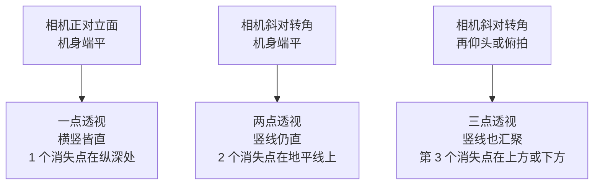

# 第 10 章 建筑与城市

> 建筑摄影表面上拍的是房子，其实拍的是线、面、体和空间。相机稍微偏一点，整栋楼的气质都会跟着变。

---

瑞士摄影师 Lucien Hervé 拍马赛的 Unité d'Habitation 时，并不急着把整栋楼完整地装进画面。那栋楼由 Le Corbusier 设计，是现代主义建筑史里很重要的一件作品，按说最省事的做法，就是退到足够远的地方，让它端端正正地整个立在框子里。可是 Hervé 偏偏没有这样做，他更关心的是别的东西：光怎样落到清水混凝土上，栏杆怎样在墙面上投下一道斜影，墙和墙之间怎样裂开一道细窄的光缝，屋顶的通风孔又怎样在水泥地上拖出长长的影子。换句话说，他拍的不是那栋楼的全貌，而是那栋楼被光照亮时的一个个局部。也正因为如此，看完那组照片，你未必能立刻在脑海里拼出建筑的完整轮廓，却会牢牢记住那栋楼的重量、粗糙、秩序和光。

Le Corbusier 后来说 Hervé 是“建筑师的眼睛”，这句评价值得多想一想。建筑师本人当然最清楚这栋楼是怎样建成的，他知道每一处结构、每一张平面图、每一种材料的来龙去脉；然而知道一栋楼如何被造出来，和懂得它如何被观看，终究是两回事。摄影师的本事，恰恰在于把置身其中的那份观看经验重新组织一遍，再借由一张照片，让一个从未到过现场的人也能就此进入这个空间。也就是说，拍建筑的难处，从来不止于把一栋楼拍得清楚、拍得完整；真正更难的一步，是让别人透过你的照片，看见你究竟是怎样理解这栋楼的。

---

*Eugène Atget, "Boutique Place Dauphine"。Atget 拍巴黎店面和街道时常常正面站定，相机保持水平，垂直线不歪，曝光长到足以让路过的人淡成影子。这家店被光照得像一张正立的版画，没有夸张角度，也没有强行制造戏剧，只是把一面城市日常安静地交给观众。许多后来的建筑摄影师仍然在学这种克制，因为它让建筑自己说话。 (Wikimedia Commons, 公有领域)*

---

建筑摄影首先要看照片究竟为谁服务，因为服务的对象不同，评判它的标准也就跟着变。当照片是拍给建筑师、杂志、项目档案或者商业空间看的，它便更接近一份建筑学意义上的记录：墙线要垂直，水平线要平，空间与空间之间的关系要交代清楚，光线也得安分守己，不能反过来喧宾夺主。Hélène Binet 为 Peter Zumthor、Daniel Libeskind 和 Zaha Hadid 拍了许多年，她的做法是带着大画幅黑白胶片，一次次回到同一栋建筑跟前，耐心等不同时刻的光落下来。正因为如此，她最后真正交出的照片并不多，可每一张都很准。与之相对，Iwan Baan 更愿意把建筑重新放回它所在的城市环境里，站到高处，去看这栋建筑和周围的道路、街区、人流之间究竟是怎样彼此牵连的。

还有另一些照片，则索性把建筑当作一个艺术对象来看待，它既不一定追求把整栋楼收全，也不一定非要把透视拉得绝对端正。这类照片真正在意的，是几何、光影、材质、反射和抽象。Candida Höfer 拍那些空无一人的图书馆和博物馆，画面里明明没有一个人影，却偏偏能让人感觉到，这个空间已经被许许多多人使用过很久很久。Andreas Gursky 的不少作品也带着相似的冷静，他把建筑和城市里那些不断重复的结构，一并压成了巨大的图案。

再到城市摄影里，情形又变了：建筑退居为一座舞台，人和日常生活这才走进画面中央。Stephen Shore 拍美国的加油站、汽车旅馆和十字路口，很多照片乍看上去平平静静，仔细看才发现，底下的构图其实非常严密。Fan Ho 拍五六十年代的香港，仓库高窗上斜斜落下来的那束光，恰好和一个走过的人对上，于是几何铺在前面打底，人则像一个标点，在恰当的位置上轻轻出现。也就是说，城市摄影比单纯的建筑摄影，多出了一层时间：你在现场等的，不只是光何时最好，还有人会在哪一刻正好经过。

---

建筑摄影要处理的第一件大事，是透视。这一点几乎躲不开，因为建筑本身就是由直线构成的：墙线、柱线、窗框、地平线，每一条线都在无声地告诉观众，你这台相机当时端得稳不稳、正不正。道理并不难理解：镜头一旦不再水平，这些本该平行的直线，就会在画面里彼此汇聚。于是相机稍一上仰，原本竖直的垂直线便一齐朝画面上方收拢，高楼看上去就像要往后倒去；相机稍一下俯，墙线又朝下收束，整栋建筑仿佛被压进了地里。当然，某些刻意艺术化的建筑照片，会故意去夸张这种汇聚，把它当成一种表现手段；可问题在于，如果你并不是有意为之，这种汇聚就只会让画面显得摇摇晃晃，站不住脚。

这种向上收拢的现象，在建筑摄影里有一个专门的称呼，叫作梯形畸变（keystoning）。它的成因并不难解释：一旦你仰起头去拍高楼，相机的传感器平面就不再与建筑的立面保持平行，立面上那些本该竖直的边线，于是在画面里一齐朝上聚拢，楼也跟着显得要往后倒去。明白了这一层，应对的思路其实只剩一条，就是设法让相机的背面重新与立面平行：或者在拍摄时把机身端平，退远一些、换用长一点的焦距去平视这栋楼；或者把纠正这一步留到后期，专门做一次垂直校正；又或者交给移轴镜头，在按下快门的当下就地纠正。也正因为如此，一栋楼拍得正不正、稳不稳，观众往往还没顾上细看内容，先就从这几条竖直线的走向上读了出来。

梯形畸变只是一套更普遍的透视规律里的一个特例，把这套规律弄清楚，前面那些线条的脾气就都有了着落。要理解线条为什么会汇聚，得先看相机是怎样成像的。相机用的是中心投影：场景里的每一个点，都沿着一条经过镜头光心的直线，落到传感器平面上。这套几何里有一条基本规律，一组在现实中彼此平行的直线，投影到画面上以后会一齐指向同一个点，这个点就叫消失点（vanishing point）。铁轨向远方并拢、最终交于地平线上一点，正是这条规律最直观的样子。要紧的是，消失点落在哪里，只由这组平行线的方向决定，而与它们在空间里的具体位置无关：方向相同的线，无论相距多远，都汇向同一个消失点。

有一种特殊情形值得单独记住。当一组平行线恰好与传感器平面平行时，它们的消失点会退到无限远，于是在画面里，这组线看上去依旧根根平行，永不相交。建筑的垂直线之所以在许多照片里保持笔直，道理正在这里：只要你把相机端平，让传感器平面与楼的立面平行，那些竖直的边线便与传感器平行，消失点落到无限远，画面里的竖线自然笔直。反过来，相机一旦仰起，竖直方向不再与传感器平行，它的消失点便从无限远处收回到画面上方的一个有限位置，竖线于是朝那里聚拢，这正是梯形畸变的由来。

顺着这条线索，就能把建筑照片里的透视归成三种，它们的分别只在于机位和朝向。

一点透视，指的是你正对着一面立面站定，相机端平，传感器平面与这面墙平行。此时墙上的水平线和垂直线都与传感器平行，消失点都在无限远，于是画面横平竖直，只有那些朝纵深退去、与视线方向一致的线，比如一条笔直望进去的长街、一道走廊的两壁，才汇聚到画面中央唯一的一个消失点。正面对称的教堂中殿、笔直望到底的老街，拍出来往往就是这种一点透视，端庄而稳定。

两点透视，出现在你不再正对立面，而是斜斜地对着建筑的一个转角，把相邻的两面墙一起收进画面的时候。这时相机若仍旧端平，垂直线依然与传感器平行、依然笔直；可两面墙各自的水平线，会分别汇向地平线上左右两个不同的消失点。街角那种能同时看见两个立面的经典建筑照片，多半是两点透视，它比一点透视更有纵深，体积感也更强。

三点透视，是在两点透视的基础上，再把相机仰起来或者俯下去。相机一旦离开水平，垂直线也就不再与传感器平行，于是它们同样开始汇聚，交向画面上方或下方的第三个消失点。也就是说，前面反复讲的那种仰拍高楼、竖线向上收拢，本质上就是第三个消失点被引了进来。想让高楼保持笔直，等于是想把这第三个消失点重新推回无限远，而端平相机、移轴、后期校正这几种办法，说到底做的都是同一件事。

要对付这种汇聚，最直接的解决办法是移轴镜头。它的原理是让相机机身始终保持水平，与此同时，又能把取景的范围单独往上移，于是画面里的垂直线依旧笔直。移轴镜头价格不菲，掌握起来也需要一段学习的过程，可真正认真做建筑的人，迟早会理解它为什么会存在。倘若手边没有移轴，也还有别的办法可想：拍摄时尽量把相机端平，让画面顶部多留出一点余量，回到后期再用透视校正把汇聚的线条重新拉直，代价则是边缘的那一圈像素会被裁掉一些。此外，索性站得远一点，改用 50mm 或者 85mm 这样更长的焦段，同样能减轻透视的夸张，只不过在拥挤的城市里，未必总有让你从容后退的空间。

移轴镜头之所以值得单独说一说，是因为它握着两组彼此独立的动作。头一组叫平移（shift）：让镜头相对于传感器，上下或左右地平行移动。它的用处在于，你可以让相机始终保持水平、竖直线毫不变形，却又能把原本落在取景范围之外的高处楼顶一并收进画面，而这一手，恰恰是建筑摄影最为看重的能力。另一组叫倾斜（tilt），它动的不是位置，而是焦平面的朝向：依照沙姆定律（Scheimpflug），它能让一个原本并不与传感器平行的面，也整个落进合焦的范围里去。说到底，这两组动作各管一头，平移管的是透视，倾斜管的是景深。分清了这一层，真正站到一栋楼跟前时，你才好判断自己缺的究竟是哪一样：是把倾倒的竖直线重新扶正，还是把一个斜过去的立面从头到尾拍实。

移轴的平移之所以能做到这一点，得从镜头投出的像说起。任何镜头投到机身内部的，其实是一个圆形的像，称作像场（image circle），而矩形的传感器只是从这个圆里截取中间的一块。普通镜头的像场，仅仅比传感器大出一圈余量，刚好够用；移轴镜头则特意把像场做得大出许多，于是传感器可以在这个更大的圆里上下或左右地滑动。当你把取景范围整体上移，传感器截取的便是像场里偏上的那一部分，楼顶因此被收进画面，而传感器始终与立面平行，竖直线也就始终笔直。它的代价在于，一旦平移量推到极致，传感器就逼近了像场的边缘，画面的角落容易发暗，也就是所谓的暗角，或者变软，所以移轴用到尽头时，画质总要打一点折扣。

移轴镜头的这些本事，其实并不是什么新发明，它只是把大画幅座机（view camera）用了一个多世纪的动作，搬到了小型相机上而已。老式的座机把镜头和后背分别装在两块可以各自移动的板上，中间用皮腔相连，于是镜头可以相对后背升降（rise/fall）、平移（shift），也可以俯仰和摆动（tilt/swing）。当年拍建筑的人，靠的正是升降这一手：镜头板往上一抬，就等于把取景范围抬高，把楼顶收进画面，而胶片后背始终竖直，竖线于是笔直。今天 35mm 系统上的移轴镜头，做的不过是同一件事，只是把这套动作浓缩进了一枚镜身里。

把这几种扶正竖线的办法摆到一处，各自的长短就一目了然了。归根结底，它们要么在拍摄的当下动手，要么把问题留到后期，而每一种都得付出一点代价。

| 校正办法 | 怎样做到竖线笔直 | 代价 |
|---|---|---|
| 端平相机（背平行立面） | 机身端平，让传感器平面与立面平行，把竖线的消失点推回无限远；不够高就退远、换长焦平视 | 城市里未必退得开；平视往往拍不到需要的仰视气势 |
| 移轴镜头的平移（shift） | 机身保持水平，在放大的像场里把传感器上移，收进楼顶而不改变竖线 | 镜头贵、上手慢；平移到极致时角落发暗或变软 |
| 后期透视校正 | 在软件里把上窄下宽的梯形重新拉成矩形 | 顶部被拉伸、分辨率下降，边缘要裁掉一圈；楼容易被拉得偏瘦长 |

当然，还有一种情况正好相反：你从一开始就想让这栋建筑显得压迫、倾斜、巨大或者不稳定，那么这种汇聚不但可以接受，甚至还值得刻意去加强。这里的关键，只在于别让观众误以为这是一次失误。也就是说，在建筑摄影里，歪斜的线条完全可以成立，前提是要让人一眼看得出，这是你有意做出的选择，而不是没端稳相机的结果。

---

前面讲的线条汇聚，是透视本身的规律，画面里那些线其实是被如实地投影出来的，只不过它们的走向让人不适应而已。可还有另一种线条变弯，来路完全不同，它不是透视，而是镜头的一种像差，叫作畸变（distortion）。理解它的关键在于放大率：一枚理想的镜头，画面里每一处的放大率都应当一致，可现实中的镜头做不到这么完美，越靠近画面边缘，放大率往往越会偏离中心的数值，于是本该笔直的线，一到边角就弯了。

畸变主要有两种相反的样子。第一种叫桶形畸变（barrel distortion）：边缘的放大率比中心小，直线便朝画面外侧鼓出去，就像木桶的桶壁那样中间粗、两头收。它最常出现在广角镜头上，尤其是变焦头拧到最广的那一端。第二种叫枕形畸变（pincushion distortion）：边缘的放大率反过来比中心大，直线于是朝画面里侧凹进来，像一只四角被绷紧的坐垫。它更多见于长焦，或者变焦头拧到最长的那一端。有些变焦镜头还会把这两种一并带上，中心一段是桶形，到了最边上又转成枕形，两者接在一处，成了所谓的胡子畸变（mustache distortion），这一种最难对付，因为它并不是简单地朝一个方向弯。

在别的题材里，畸变常常被别的东西盖过去，不太看得出来；可一到建筑上，它立刻无所遁形，因为建筑给了满画面的直线做参照。识别它有一个简单的办法：把一条你确知笔直的边，比如楼的轮廓线、屋檐或者地平线，摆到接近画面边缘的位置，再看它有没有鼓出或者凹进。校正则通常交给软件里的镜头配置文件（lens profile）：厂商和软件方逐一测量过每一枚镜头的畸变量，校正时照着这份数据把画面反向掰回来即可。这里有一个容易混淆的地方需要厘清：畸变校正和梯形校正是两码事，各治各的病。梯形畸变是几何透视造成的，用垂直校正去扶正倾斜的竖线；桶形和枕形则是镜头光学造成的，得用镜头配置文件去掰直边角的弯。两者常常要先后各做一遍，顺序上一般先套镜头配置文件把边角掰直，再做垂直校正把整体扶正。

---

拍一栋建筑的外观，有两个选择最好在动手之前就定下来：用多长的焦距，以及借什么样的光。就焦距而言，最常用的是等效 24mm 到 35mm 这一段。它广得足以把整栋楼容纳进来，却又不至于像更广的超广角那样，在画面的边角处把笔直的线条拉弯。

不过焦距的选择远不止够广这一条。往广的方向去，超广角能把逼仄的室内一口气收进来，也能在退不开的窄街上勉强容下整片立面，代价便是前面说过的边角畸变，以及近大远小被夸张之后那种要扑到脸上来的纵深。往长的方向去，等效 70mm 以上的中长焦则做着相反的事：它把远处层层叠叠的楼群压扁成一片密实的图案，也能从一栋楼身上单独抽出一扇窗、一道檐、一段被光照亮的墙。Andreas Gursky 那些把城市压成巨大图案的作品，很多正是靠长焦的这种压缩得来的。

这里要接着第 5 章说过的一句话往下讲：真正决定画面里纵深被压缩还是被夸张的，从来不是焦距本身，而是你与建筑之间的距离。长焦之所以显得压缩，是因为它逼着你退到很远的地方去拍，远距离本身就把前后的景物拉到了相近的视觉大小；广角之所以显得夸张，是因为它容许你贴得很近，近距离把前景猛地推大、把背景猛地缩小。也就是说，换焦距的同时你几乎总在换距离，而观众感受到的空间关系，其实是那段距离在起作用。明白了这一层，站到一栋楼跟前，你便不会只问自己该用多少毫米，而会先问：我想站多远，想让这栋楼显得多深。

光则更微妙一些。正侧光最擅长交代建筑的体积和材质的质感，光从侧前方斜斜擦过，墙面的凹凸和砖石的纹理便一寸寸显了出来；至于整座城市的建筑，最值得守候的黄金窗口，还要数蓝调时刻，此时室内外的灯光刚刚点亮，又恰好和天边尚存余晖的深蓝达成一种亮度上的平衡，楼体不至于黑成一片剪影，天空也不至于白得没有层次。

建筑对光的挑剔，其实没有风光那么苛刻，可这并不意味着光无关紧要，恰恰相反，不同的光会把同一栋楼变成完全不同的东西。直射的阳光能把墙面的纹理和阴影一刀刀切出来，因此格外适合混凝土、石材、楼梯、屋檐，以及那些本就强调光线的现代建筑。Tadao Ando 的许多空间，如果抽掉了硬光，墙面和缝隙之间那种紧张的关系，立刻就会弱下去大半。不过硬光自有它的麻烦，那就是反差太大：一面墙可能亮到彻底失去细节，另一面却又沉得过深，几乎什么都看不见。正因为如此，拍这类建筑时，要先在心里定下一件事，你究竟要的是一个完整的立面，还是光和影切割出来的那一处局部。倘若要的是完整的记录，阴天反而更稳妥；倘若要的是建筑的戏剧性，那么直射光就值得你耐着性子去等。

与之相对，阴天则更适合建筑学意义上的记录。这时的光是均匀铺开的，各处的细节都看得清清楚楚，玻璃、墙面和地面也不容易被某一道强烈的反光突然打乱。它的问题在于，画面很容易变得平淡，缺了立体感，于是就得靠构图和材质本身把它重新撑起来。拍砖墙、木门、旧厂房或者老街的立面时，阴天并不见得是坏天气；恰恰是这种不偏不倚的光，会让材料本身的质地浮现出来。也就是说，你大可以把注意力转移到别处：墙面老化剥蚀的痕迹，一排窗框的重复，屋檐和街道之间那点微妙的关系，而不是一味懊恼天空为什么不够漂亮。

德国摄影师 Bernd 和 Hilla Becher 夫妇几十年里做的，正是把这种均匀的光用到了极致。他们专门挑阴天出门，一座接一座地拍水塔、高炉、井架和煤仓这类工业构筑物，每一张都尽量正面、平视、居中，把天光压得平平的，不留一点戏剧性的阴影。这样做自有它的用意：让不同的构筑物之间可以被摆在一起逐一比较。光既然一致、角度既然一致，剩下的差别便全是结构本身的差别。他们把这些照片按类别排成整齐的方阵，称之为类型学（typology）。这套做法后来影响了一整代人，前面提到的 Höfer 和 Gursky，正是从他们门下走出来的。

黄金时刻会让整栋建筑顿时变暖，斜斜拉长的影子则能强化立面的纹理。传统建筑、石墙、木构乃至玻璃幕墙，都很吃这一段光。玻璃在夕阳里会摇身变成一面金色的镜子，老城的石头也会从原本一片灰白当中，重新分出深浅不同的层次。蓝调时刻则尤其适合现代城市。日落之后大约二三十分钟，天空还残留着一层深蓝偏紫的色调，办公室的灯和街灯又恰好刚刚亮起，建筑便在这短短一段时间里，从白天那种沉甸甸的体块，转而变成夜里会自己发光的东西。外滩、维港、曼哈顿天际线的许多经典照片，都依赖着这稍纵即逝的一段光。原因也很实在：再晚一些，天空就全黑了，灯光和背景之间的反差会变得太硬，那份冷暖相接的平衡也就随之消失。

蓝调时刻之所以这样好用，背后其实是一道色温上的巧合，这一点在第 2 章讲白平衡时已经埋下过伏笔。白天的日光色温大约在 5500K 上下，钨丝灯和暖白的室内灯则低到 2700K 到 3000K，偏橙偏黄；而日落之后那片深蓝的天空，色温高得多，于是在同一个画面里，暖橙的室内和冷蓝的室外被一并摆到了一起。真正难得的还不只是这一冷一暖的对照，更在于此刻两者的亮度恰好接近：楼里的灯还没有比天空亮出太多，天空也还没有暗到只剩一团黑。正因为两边的亮度落进了同一档，相机才能一次把室内的暖和室外的蓝都记录下来，而不必舍弃其中任何一头。这段窗口通常只有二三十分钟，天一旦全黑，灯与天的亮度差便迅速拉大，冷暖并存的平衡也就散了。

美国建筑摄影师 Julius Shulman 在 1960 年为 Pierre Koenig 设计的第 22 号案例住宅（Stahl House）拍的那张照片，常被人拿来当作这种平衡的范本。画面里，一间四壁皆玻璃的客厅悬挑在半空，两位女子坐在灯火通明的室内，脚下则是洛杉矶铺开的万家灯火。Shulman 借助长时间曝光，让室内的灯光和远处城市的灯火在同一张底片上同时成立，室内不至于亮得刺眼，城市也不至于沉进死黑。那张照片后来几乎成了那栋房子本身的代名词，可它真正拍下的，其实是那一小段冷暖恰好两全的光。

雨后和雾中，也都值得专门挑这样的天气出门。雨后湿漉漉的地面，会像一面镜子那样，把楼和灯统统倒映回来；雾则会把远处高楼的下半截整个吞掉，只留下顶部孤零零地浮在半空中。许多城市在大晴天里其实平平无奇，可一旦罩进雾里，反而生出了一点只属于它自己的秘密。

---

拍那些有名的建筑时，最叫人头疼的常常不是光，而是人。门口总归站着人，广场上也总归站着人，游客会停下脚步拍照，也会不偏不倚地站在你最想要的那一块空地上。对付这种情形，Atget 当年拍空街的办法，到今天依旧管用，那就是长曝光。把三脚架架稳，光圈收到 f/8 或者 f/11，白天光线太强时再加一片 ND 减光镜，把快门足足拖到几秒、甚至几十秒。道理在于，建筑是纹丝不动的，而来往的人流在这么长的一段时间里会被逐渐平均掉，最后只剩下一层淡淡的虚影，或者索性消失得无影无踪。需要留意的是，站着不动的人反倒会留下残影，所以这一招最适合对付的，是持续流动的人群。

城市夜景其实也在利用同一个道理。蓝调时刻拍桥、广场、码头和天际线，本来就需要几秒钟的曝光，于是来往的人和车便被时间悄悄抹成了一道道线。也就是说，画面看上去那样干净，并不一定说明现场当真空无一人，而只是摄影师让相机看得比人的眼睛更久，久到足以把短暂的东西从画面里淘洗出去。

---

建筑的构图，不妨先从几何入手。面对一栋楼时，第一步是去找画面里最强的那条线：它究竟是垂直线，是水平线，是对角线，还是一道舒展的曲线？找到主线之后，第二步再看重复：窗、柱、楼梯、瓷砖、梁和栏杆，这些元素有没有排成某种节奏？到了第三步，才去端详各个形状之间有没有彼此呼应的关系，比如一个圆和一个方，一面空墙和一组密集的窗格，一块被照亮的平面和一片沉下去的阴影。归根结底，构图的要点并不在于把眼睛看到的东西统统塞进画面，而在于只留下那么几条真正能说明这栋建筑的关系，其余的则果断舍去。

在这些几何关系里，有一类线值得单独拎出来说，就是引导线。它指的是画面里那些能把观众的视线牵着走的线条：一道楼梯的扶手、一排廊柱、一条收向远处的街道、地砖拼出的缝，甚至栏杆投在地上的一道斜影。引导线的用处，在于替观众安排一条进入画面的路径，让视线顺着它，一路滑向你真正想让人看见的那个地方。用得最顺手的，往往是那些一齐汇向消失点的线：它们本是透视的产物，可一旦被有意识地组织起来，就会把观众的目光稳稳地送到画面深处。反过来，若是画面里的线各自为政、彼此打架，观众的视线便无处落脚，照片也就散了。也正因如此，找机位的时候，除了看主线的方向，还值得多留意脚下和身侧那些不起眼的线，它们常常就是把整个画面缝起来的那根线。

对称会让建筑显得庄重而稳定，因此格外适合教堂、宫殿、政府建筑，以及某些庄严的公共空间。不过拍对称有一个前提：相机要尽量精确地居中，横平竖直，哪怕只差一点点，也会被人一眼看出来。非对称则更常用在现代建筑上，主体可以偏靠在一侧，另一侧则特意留出空间，让画面两边形成一种重量上的差别。除了这些，尺度同样重要。这里的道理是这样的：一栋楼如果画面里没有任何参照物，观众其实很难判断它到底有多大。一个人、一辆车、一把椅子，都可以充当这样的尺度提示，替观众换算出建筑真实的体量；只是这样的提示通常一个就够了，一旦放得太多，画面反而会重新变得杂乱。

抽象在建筑摄影里非常好用。凑近玻璃幕墙，那些反射就会碎成一块块色块；仰起头去看楼梯，一级级台阶便排成了节奏；若只截取一小块墙面和一道投在上面的影子，建筑的全貌固然消失了，可留下来的，恰恰是最纯粹的形式和材质。也就是说，很多建筑并不需要你一上来就急着拍全景；先从局部去看，反而更容易摸到它真正的性格。

---

现代城市是绕不开玻璃的。玻璃幕墙有着双重身份：它既是建筑的表皮，同时又是一面镜子。正因为如此，它会把对面的老楼、天上的云、傍晚的晚霞、路过的行人，连同你自己，一并收进画面里去。新手常常把这些反射当成干扰，一心想着如何避开；可事实往往相反，反射恰恰是城市建筑里最耐看的一部分。一座老教堂映在旁边写字楼的玻璃上，新与旧就被压进了同一个平面；蓝天和流云被玻璃切割成许多方格，整面墙于是像一幅不断变化的抽象画；而弧形的幕墙，还会把笔直的楼扭成起伏的波浪，让本来规整的城市，忽然带上一点轻微的失真。

要控制反射的强弱，可以借助 CPL 偏振镜。转动偏振镜的时候，同一面玻璃有时会显得更像一面镜子，有时又会变得更透明，任你取舍。

偏振镜之所以能做到这件事，得从反射光的性质说起。光打到玻璃这类非金属的表面上，反射出来的那一部分并不是杂乱无章的，而是被部分地偏振了，也就是它的振动方向被梳理到了某个特定的方位上；偏振镜正是一道只让特定振动方向通过的闸门，把它转到与反射光相垂直的角度，就能把这部分反射大幅挡掉。这里还藏着一个角度上的讲究：当入射角，也就是光线与玻璃表面法线之间的夹角，大约落在 56 度时，反射光几乎被完全偏振，偏振镜的压制效果也最为彻底，这个角度称作布儒斯特角（Brewster's angle）。入射角一旦偏离这个值，能压掉的反射便随之减少。这也解释了为什么拍幕墙时，站位和偏振镜要一起调：你既在用转环挑选偏振的方向，也在用脚步挑选入射的角度。还要留意的是，偏振镜本身会吃掉大约一到两档的光，弱光下用它，快门就得相应地放慢。

此外，反射对站位极其敏感：往左挪上一步，映进玻璃里的可能就从这一栋楼换成了另一栋。正因为如此，拍玻璃时切忌只钉在原地反复变换焦段，唯有多走几步、多换几个位置，才能真正找到那个画面。

---

城市摄影比单纯的建筑，多出了人和时间这两样东西。就题材而言，天际线适合从桥上、山顶、高楼或者观景台去看，其中又数蓝调时刻最为稳妥；街区则要留意建筑是怎样和道路、店招、车流、人群组织在一起的；至于街角，它其实已经很接近街头摄影了，一个人一个不经意的动作，都可能决定整张照片的成败。有一条经验值得记住：让建筑占去画面的大部分，人只在其中出现那么一点点，往往比把画面拍得满是人更耐看。归根结底，建筑负责提供秩序，人则负责提供那个转瞬即逝的瞬间。

商业室内又另有一套细致的活儿。这里头最先要对付的，是混色光。可行的办法是分开来拍：白天索性把所有灯都关掉，只借窗光拍上一组；等到晚上，再打开室内灯拍另一组，必要时留到后期去合成。有一件事要格外当心，那就是不要把窗光、暖白灯、卤素灯和彩色灯尽数同时打开，因为一旦这些色温各异的光混在一处，墙面、地板乃至人的皮肤都会跟着变脏。许多酒店和餐厅，现场看着明明很温暖，照片里却发黄发绿，症结正在于不同灯具彼此相冲突。稳妥的次序是这样的：先把灯全部关掉，看一看自然光是怎样进到这个房间里来的；再一盏一盏地把灯打开，逐一分辨哪一盏是真的在帮忙，哪一盏只是在制造脏色。这一步看似麻烦，却比事后在电脑前拉白平衡要重要得多。

拍室内时，也不要盲目地抄起 16mm，因为焦段太广，会把墙角、沙发和桌子统统拉变形。24mm 往往要稳当得多，它既能把空间交代清楚，又不至于让整个房间看上去像被硬生生扯开。拍小房间尤其如此：很多人习惯站在门口，一心想把屋里所有东西都塞进画面，结果拍出来的照片，活像房产中介留档用的记录图。更好的做法，是先想清楚这个空间里最要紧的那一层关系究竟是什么，是窗和床，是餐桌和灯，是沙发和墙上那幅画，还是厨房和人在其中走动的动线。只有把这层关系定下来，站位才算真正有了依据。至于三脚架、f/8、ISO 100、慢门、RAW 和透视校正，这些不过是室内商业照片的基本底子；然而底子之外，真正决定一张照片看着舒不舒服的，终究还是你有没有把那层空间关系理顺。

站位同样需要慢慢去找。门口通常并不是最好的位置，它之所以被人反复选中，无非是因为最方便罢了。相比之下，站到房间的对角，贴近某一面墙，或者把身子稍微蹲低一些，让窗和家具之间的关系一并进入画面，往往更能说明这个空间平日里是怎样被使用的。

---

不同的建筑，各有各的拍法。就拿摩天楼来说，你可以贴着底部往上仰拍，去强调它的高度和那份压迫感；也可以退到远处，改用长焦去拍，让它的线条显得更干净。这两种办法给人的感受并不一样：前一种让人真切地觉得自己正站在建筑的脚下，后一种则更像是在远处从容地整理城市的轮廓。欧洲的老城又是另一回事，它适合从街道两侧的墙、广场、河边，以及屋顶的观景台入手，因为低角度的暖光，能把石材那些细微的颜色一一分开。这一点在正午是看不出来的：砂岩、石灰岩和花岗岩在当头的强光下，可能都是一样的灰白；可一到傍晚，它们便会各自显出不同的温度来。

日式建筑则往往相反，它不一定需要强烈的戏剧光。雾、雪、阴天，以及庭院里那种被反复漫射过的柔光，常常更合它的性子，因为这类建筑真正看重的，是屋檐、水面、木头和空气之间的关系，而这种关系在硬光下反而会被切碎。拍它的时候，与其等一束刺眼的直射，不如等一场雨、一层雾，让木料的颜色沉下来，让檐口的线条在灰白的天光里慢慢显出来。

现代极简建筑给的元素本来就少，一面墙、一束光，往往就够组成一整个画面。面对它，不必害怕留白，也不必总想着再往画面里塞点什么，因为那片空白本身就是这栋建筑的秩序的一部分，把它填满，等于把设计者最在意的东西涂掉。工业遗迹是另一个极端，它看的是尺度、锈迹、剥落的表面、一排排重复的梁柱和望不到头的长走廊。材料越是粗糙，就越要让光从侧面擦过去，让那些坑洼、焊缝和岁月留下的痕迹在斜光里一寸一寸地立起来。

宗教建筑要单独说一句。进门之前，先确认这里能不能拍、能不能用三脚架，因为在这类空间里，尊重比拍到一张照片更重要。有的地方允许你拍外部，却不允许拍进行中的仪式；有的地方并不禁止，可你的快门声和脚架，本身就会惊扰到正在其中的人。所以真正该做的第一件事，是慢下来，先在一旁看别人怎样使用这个空间，等自己也成了这份安静的一部分，再决定要不要举起相机。

---

## 练习

找一栋建筑，从正面、仰视、俯视和侧面各拍一张。回家做透视校正，再把校正前后放在一起看，体会相机角度怎样改变建筑气质。

找一个城市制高点，在蓝调时刻拍 30 分钟，每 5 分钟拍一张。回家比较天空亮度和建筑灯光在哪一刻最平衡。

拍 10 张完全抽象的建筑照片，让人看不出是哪栋楼，只看见几何、材质、反射和影子。

找一栋你常路过的建筑，连续十天每天用一种新方式拍它。不要急着换地点，逼自己在同一栋楼里找新关系。

---

下一章：[第 11 章 弱光与夜景](11-lowlight.md)
