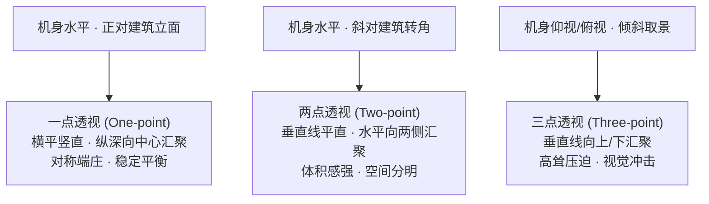

# 第 10 章 建筑与城市

> 建筑摄影表面上记录的是建筑形态，实质上是在与线条、平面、体量与光影所构筑的空间进行对话。机位与视角的微小调整，都会影响建筑物在画面中呈现的气质。

---

## 建筑先从抽象开始

摄影师 Lucien Hervé 在记录勒·柯布西耶（Le Corbusier）设计的马赛公寓（Unité d'Habitation）时，并没有急于把整栋建筑完整地框入画面。

他关注的是建筑的局部与细节：阳光斜照在粗粝的清水混凝土上的纹理、栏杆在墙面上投下的几何阴影、两面墙体之间狭窄的光隙，以及屋顶通风雕塑在地面拉出的影子。

他记录的不是单纯的立面测绘，而是建筑在光线下呈现的质感与光影关系。

看过这组照片的人，可能无法凭此画出建筑的施工图，却能清晰感受到建筑的体量感、材质的肌理与空间的光影秩序。

柯布西耶在看到这批底片后，曾致信称赞：“**您拥有一颗建筑师的灵魂。**”此后两人长期合作。

这句话指出了建筑摄影的核心：不仅要记录建筑的外观，更要理解建筑的空间逻辑、材质特点以及光线在建筑设计中的作用。

摄影师的任务，是**将三维的空间体验转化为二维平面的视觉秩序，让观者通过画面理解建筑的结构与空间气质**。

---

### 城市如何留下时间

*Eugène Atget, "Boutique. Place Dauphine", 1924。Atget 拍巴黎店面和街道时常常正面站定，相机保持水平，让垂直线保持稳定；较长的曝光也可能让路过的人淡成影子。这家店被光照得像一张正立的版画，没有夸张角度，也没有强行制造戏剧，只是把一面城市日常安静地交给观众。许多后来的建筑摄影师仍然在学这种克制，因为它让建筑自己说话。[图片来源与复用说明](image-credits.md#atget-shop)*

---

## 建筑是摄影最早的题材

建筑是摄影史上最早被记录的题材之一。

现存最早的照片——Niépce 于 1826 年前后拍摄的《窗外风景》，记录的正是庄园里的屋顶与鸽舍。早期的感光材料曝光时间长达数小时，静止不动的建筑自然成为了最合适的拍摄对象。

1851 年，法国政府发起“摄影考察团”（Mission Héliographique），委派摄影师前往全国记录历史建筑遗迹，开启了建筑文献记录的传统。

在今天的建筑摄影中，主要有几种不同的取向：

**1. 严谨的建筑记录与档案摄影**：注重垂直与水平线条的准确性，清晰展现空间结构与材料质感。Julius Shulman 与 Ezra Stoller 记录了大量现代主义经典建筑；Hélène Binet 长期使用大画幅胶片记录 Peter Zumthor 等建筑师的作品，以沉稳的光影展现空间质感；Iwan Baan 则常结合城市全景与航拍，展现建筑与周边街区、河流及人群的联系。

**2. 几何与抽象形式的艺术探索**：提取建筑中的线条、色块与图案。Candida Höfer 拍摄空旷的图书馆与歌剧院，呈现对称与静穆的空间感；Andreas Gursky 则通过大尺度的密集构图，展现现代建筑与都市立面的秩序。

**3. 融入日常生活的城市风光**：将建筑作为背景，记录城市中的生活气息。Stephen Shore 记录路边的街角与建筑，线条平整自然；何藩（Fan Ho）在老香港街头借助建筑投下的斜阳记录行人的剪影。

---

## 透视与垂直线

建筑摄影中常需注意**透视与垂直线条的控制**。

建筑由大量的水平线与垂直线构成。物理规律表明：**当相机发生仰角或俯角倾斜时，三维空间中平行的垂直线条在二维画面中会产生汇聚（向上或向下收缩）**，即**梯形失真**（Keystoning）。

当**感光元件平面（Sensor Plane）与建筑立面保持平行（即相机保持水平不仰不俯）**时，建筑的垂直线条在画面中将保持平行不汇聚。

常见的建筑透视形式：

*   **一点透视**：相机水平正对立面。垂直线与水平线皆保持平行，仅纵深线条向中心消失点汇聚（如教堂对称中轴回廊），画面端庄对称；
*   **两点透视**：相机水平斜对建筑转角。垂直线保持平直，两侧立面的水平线分别向左右地平线汇聚，立体感与体积感明显；
*   **三点透视**：相机向上仰拍或向下俯拍，垂直线产生汇聚，常用于表现摩天大楼的高耸感与仰视张力。

控制垂直线条的常用方法：

| 控制方式 | 原理与操作 | 特点与注意事项 |
|---|---|---|
| **保持相机水平** | 不仰俯机身，垂直线自然平直；若视角不够可后退或移至高处 | 在狭窄街道有时无法充分后退，画面下方容易留白过多 |
| **使用移轴镜头平移（Shift）** | 机身保持水平，镜头光轴在更大像场中向上平行移动 | 可在狭窄街道拍全高楼且无汇聚；镜头相对昂贵且多为手动 |
| **后期透视校正** | 软件算法对梯形画面进行拉伸校正 | 操作灵活，但拉伸后边缘像素会被插值，且需裁剪四周边缘 |

仰拍产生的垂直汇聚并非错误，若拍摄意图本就是为了表现大楼的高耸与视觉冲击，仰拍完全合情合理；关键在于明确这是出于表达需要的选择，还是因未注意水平导致的偏差。

---

## 光线与建筑立面

光线方向直接影响建筑形态的表现：

*   **顺光（正面光）**：整个立面被均匀照亮，阴影较少，适合表现建筑本身的色彩与平面图案，但立体感相对较弱。
*   **侧光（约 45° 侧照）**：在建筑立柱、窗框与凹凸结构上投下清晰的阴影，是表现建筑体积感与材质肌理最常用的光线。
*   **逆光与剪影**：在黄昏或清晨，背光的建筑呈现为清晰的外轮廓剪影，适合表现具有标志性天际线的建筑群。
*   **蓝调时刻与夜景**：日落后的蓝调时刻，天空的深蓝与室内暖色灯光形成冷暖对比，是拍摄建筑夜景外观的经典时间窗口。

---

## 人物作为尺度参照

在建筑摄影中，适度纳入人物能够起到重要的作用：

1.  **提供尺度参考**：人物的身高提供了直观的物理标尺，使观者能够真切感受到建筑挑高、大门或大厅的真实体量。
2.  **赋予空间生命力**：一位在长廊漫步的行人或坐在台阶上的读者，能表明建筑的实际使用状态，使建筑不显冰冷。
3.  **成为构图支点**：在大面积平整的几何背景中，一个小巧的人物常能成为聚拢视觉焦点的有效支点。

---

## 练习

寻找一座具有现代感或几何线条分明的建筑，尝试机身保持绝对水平（使用相机内置水平仪），分别拍摄一张正面的“一点透视”与转角处的“两点透视”，感受平直线条带来的稳定感。

同一座建筑，尝试使用超广角贴近仰拍一张“三点透视”，对比其与水平拍摄在视觉感受与情绪上的差异。

在建筑中寻找一处光影对比鲜明的局部（如楼梯转角、栏杆阴影、窗格光斑），不拍建筑全貌，拍摄三张纯粹由几何线条与明暗构成的抽象细节。

---

下一章：[第 11 章 弱光与夜景](11-lowlight.md)
