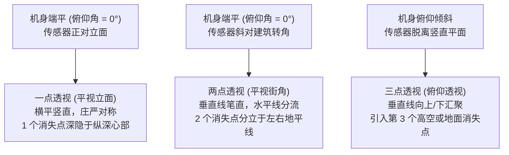

# 第 10 章 建筑与城市

> 建筑摄影表面上拍的是房子，其实拍的是线、面、体和空间。相机稍微偏一点，整栋楼的气质都会跟着变。

---

## 建筑先从抽象开始

匈牙利裔法国摄影师吕西安·埃尔韦（Lucien Hervé）探访马赛的“光芒之城”（Unité d'Habitation）时，并不急于将整座巨构草率地塞满取景框。那座由勒·柯布西耶（Le Corbusier）亲手擘画的公寓大楼，是二十世纪现代主义建筑史上的一座丰碑；寻常的行路者或许会退至远处，求得一帧四平八稳的立面全景。然而埃尔韦的目光却沉潜于截然不同的微观秩序：晨光如何在粗粝的清水混凝土（Béton brut）表面激起如沙丘般的明暗颗粒，水泥格栅如何在白墙上投下一道锋利的几何斜影，两面厚重的承重墙之间如何撕裂出一道狭窄深邃的光隙，而屋顶雕塑般的通风斜井又如何在水泥地上拉长了时间的投影。他记录的绝非冰冷全景的物理拓印，而是这座巨构在被天光唤醒时的一处处精神肌理。掩卷凝视这组影像，观者或许未能立即拼凑出建筑外立面的绝对尺寸，却已将这座混凝土巨兽的重量、粗粝、严苛的模度比例以及光的洗礼，永恒铭刻于心。

勒·柯布西耶在 1949 年阅毕这批照片后，难掩激赏之情致信埃尔韦：“您拥有一颗建筑师的灵魂。”自此，二人结下了长达十余载的挚友之契，直至建筑大师溘然长逝。柯布西耶的赞誉值得深思：他所珍视的，绝非埃尔韦将建筑构件记录得多么清晰齐整，而是惊叹于摄影师真正洞悉了建筑的灵魂——体悟结构背后的用意，熟稔材质内在的脾性，洞察光线在三维雕塑中所占据的统治地位；因而其镜头的每一次停驻与取舍，皆精准暗合了建筑师创制时的深层心智。建筑师自然比任何人都熟悉蓝图、剖面与材质的来龙去脉；而杰出的摄影师，则是在二维平面上重塑知觉经验的艺术家——借由方寸画幅，令未曾亲临现场的人亦能身临其境地步入那座充满呼吸感的空间。建筑摄影的终极考验，从不止于记录一栋建筑的轮廓；其真正幽深的关隘，在于首先参透建筑的意志，继而借助光影的刀锋，让凝视者透过你的视界，与建筑师的灵魂完成一次跨越时空的会晤。

---

### 城市如何留下时间

*Eugène Atget, "Boutique. Place Dauphine", 1924。Atget 拍巴黎店面和街道时常常正面站定，相机保持水平，让垂直线保持稳定；较长的曝光也可能让路过的人淡成影子。这家店被光照得像一张正立的版画，没有夸张角度，也没有强行制造戏剧，只是把一面城市日常安静地交给观众。许多后来的建筑摄影师仍然在学这种克制，因为它让建筑自己说话。[图片来源与复用说明](image-credits.md#atget-shop)*

1924 年，年近古稀的尤金·阿杰（Eugène Atget）扛着沉重的 18×24 厘米木质大画幅座机与粗笨的木质三脚架，缓缓伫立于巴黎西堤岛西端的太子广场（Place Dauphine）。这座由亨利四世于十七世纪初奠基的三角形历史广场，曾饱览波旁王朝的煊赫与近现代巴黎的裂变。此时距离阿杰辞世仅余三年，他在旧巴黎幽深街巷间的独行跋涉已近三十载。面对这家偏安于街角的寻常店铺门面，阿杰并未选取居高临下的俯瞰视角，亦未采用刻意夸张的俯仰戏剧，而是将沉重的座机稳稳安顿于街心，令感光玻璃干板严格与店铺正立面维持着平行的正交关系。

整幅影像展现出一种近乎古典铜版画与精密测绘图纸般的绝对正面性（Frontality）。机身的精密调平将透视汇聚的第三个消失点彻底驱逐至无限远，砖石拱圈与木质立柱的垂直线条垂直挺立，横平竖直的建筑骨骼在二维相纸上构筑起深沉的尊严与肃穆。更为奇妙的是，那面被天光洗礼的临街橱窗化作了一处虚实交织的空间枢纽：大画幅镜头强悍的解像力，不仅纤毫毕现地拓印下木门剥落的油漆、石砌基座受潮风化的微观凹凸与门楣上手工漆写的招牌；同时，平静通透的平板玻璃反弹起微茫的漫射天光，将阿杰身后太子广场葱郁的行道树枝叶、对街古老寓所的屋脊以及巴黎清冷的天穹，幽灵般重叠印入幽暗的店铺腹地。实体的商品陈设与虚幻的城市倒影在感光乳剂中互为表里、彼此渗透，构筑起一重如梦似幻的复调空间。

缓慢的感光乳剂与收缩至极小孔径的光圈，将曝光时间拖慢至数秒乃至十数秒。在漫长时间的悄然洗刷下，巴黎街头匆匆而过的行人并未在底片上留下丝毫杂质，尽皆消融于无形，唯余下被百年风雨浸润、静默伫立的建筑躯壳。瓦尔特·本雅明曾深刻断言，阿杰笔下的巴黎空街宛如“无人问津的罪案现场”——剥离了一切资产阶级感伤主义的罗曼蒂克与人声喧嚣，建筑本身升华为时间的纯粹容器。这幅《太子广场的店铺》为百年来的建筑与城市摄影确立了恒久的崇高范式：真正的敬畏与力量，往往源于克制与凝视；当执机者退后一步，让空间在光影与岁月的包浆中自己开口诉说，历史的真实方得在二维平原上获得永生。

---

## 建筑是摄影最早的题材

交代一层历史的纵深：建筑是摄影最古老的题材，没有之一。现存最早的一帧摄影原物——约瑟夫·尼塞福尔·涅普斯（Nicéphore Niépce）于 1826 年前后自勒格拉（Le Gras）工作室窗台定格的那一幕，记录的正是庄园农舍的屋脊与鸽子笼高墙；彼时感光材料的感度极为低微，曝光动辄耗费八小时之久，流动的人影与奔马皆无法留存，唯有纹丝不动的建筑构架成了大自然注定的模特。1851 年，法兰西第二共和国历史建筑委员会发起著名的“摄影考察团”（Mission Héliographique），委派爱德华·巴尔杜斯（Édouard Baldus）、古斯塔夫·勒格雷（Gustave Le Gray）与亨利·勒赛克（Henri Le Secq）等五位摄影大师分赴全国，系统记录濒临坍塌的历史古迹与中世纪大教堂。这是国家意志首次将摄影作为官方建筑档案与保护文献加以驱动，亦在现代意义上首次确立了建筑摄影的文化坐标。此后一个半世纪，这一题材始终沿循着数条互为激荡的脉络纵深演进。

审视建筑摄影，首要在于厘清影像承载的职能使命：服务对象的异质性，决定了美学衡准与技术范式的流转。当影像受托于建筑设计事务所、学术刊物、项目档案或商业开发时，它更趋近于严谨的建筑学视觉文献：立面竖线必须垂直挺拔，水平基线需严谨校正，体块与空间的承转虚实必须交待清晰，天光需驯顺地勾勒骨架而切莫喧宾夺主。二十世纪中叶美国现代主义建筑的辉煌篇章，很大程度上是由朱利叶斯·舒尔曼（Julius Shulman）与埃兹拉·斯托勒（Ezra Stoller）共同定影的：加州轻盈通透的案例住宅（Case Study Houses）在舒尔曼的明朗影调下化作了战后美国乐观精神的视觉图腾；而东海岸一众密斯式的钢铁玻璃摩天楼，则在斯托勒极其冷峻、严苛如手术刀般的影像中传世，以致业内流传着一句格言：“一栋建筑唯有被斯托勒拍摄过（get Stollerized），其生命才算真正圆满。”当代这一谱系的旗手当属海伦·比奈（Hélène Binet）：数十年来，她为彼得·卒姆托（Peter Zumthor）、丹尼尔·里伯斯金（Daniel Libeskind）与扎哈·哈迪德（Zaha Hadid）持续造像；她坚守大画幅胶片与传统暗房，一次次重返同一处工地与回廊，静候幽暗中那一缕抚过粗石与现浇混凝土的微芒，一个项目交出的底片常仅有个位数，却张张直指空间的核心精神。比奈的工作态度本身便是一项庄严的宣言：建筑值得被长久凝视。与之相对，伊万·巴恩（Iwan Baan）则反其道而行之，执意将建筑剥离孤立的象牙塔、重新投掷回复杂的城市地质肌理之中：他惯常搭乘直升机在低空盘旋俯瞰，审视巨型构筑物与城市干道、贫民聚落与滚滚人潮之间的撕扯与咬合；2012 年飓风桑迪横扫之后，他自空中定格曼哈顿半城断电沉入幽暗、唯余下城区微光的旷世图景，登上《纽约》杂志封面——那一刻，单栋建筑的荣耀退居幕后，整座城市作为有机呼吸的生命体成了当之无愧的主角。

另一条平行的艺术脉络，则索性将建筑视作自足的纯粹视觉母题，既不拘泥于收录全貌，亦不必执迷于立面的绝对端正。这一阵营真正在意的，是形式的冷峻提炼、几何韵律、质地包浆与时空沉淀。坎迪达·霍弗（Candida Höfer）长年沉浸于空无一人的古老图书馆、歌剧院与宫殿大厅，镜头前虽无一人驻留，然而空间的宏伟尺度与整齐排列的书架桌椅，却无声倾诉着千百年来人类精神劳作在此沉淀的巨大重量。安德烈亚斯·古尔斯基（Andreas Gursky）则凭借极度的冷峻与数字化超高分辨率，将现代集合住宅、办公大楼或庞大商场的重复立面，压铸为近乎抽象的宏伟几何挂毯。

当视线延伸至更开阔的城市摄影，语境再次生发嬗变：建筑退隐为宏大的历史舞台，人与流动的市井烟火走向前台。斯蒂芬·肖尔（Stephen Shore）驾车漫游于北美大陆，加油站、十字路口与斑驳的路牌在 8×10 大画幅前展现出不动声色的精密几何秩序；何藩（Fan Ho）在半个世纪前的香港中环街巷，守候仓库百叶高窗倾泻而下的斜射光柱，静候那名挑担的行者或穿旗袍的女子恰好步入光区——在此，严苛的几何与阴影铺设下冷峻的基调，而行人的身影则如同一枚跳动的音符，在精确的节拍上定格了人世的温度。城市摄影比纯粹的建筑造像多了一层不可预知的时间张力：执机者所守候的，不仅是天光演进的弧度，更是人间的机缘与空间的交响。

---

## 透视与垂直线

建筑摄影最先直面的物理铁律，莫过于**透视与垂直线的秩序**。建筑由人类精确的几何逻辑构筑而成：垂直的立柱、水平的楼板、正交的窗框与水平基准，每一道线条皆在无声地检验着取景器的平衡。成像光学本质上遵循着**中心投影**（Central Projection）的法则：三维空间中的物点，皆沿穿过镜头光学节点（Nodal point）的直线投射于二维传感器平面。在这套几何投射系统中，一组在物理现实中相互平行的直线，映射于画面上时必将汇聚于同一个交点，此即**消失点**（Vanishing Point）。

消失点的空间坐标，完全由平行线在三维世界中的方向矢量决定，而与其具体相对位置无涉。由此导出一项决定性的光学定理：**当一组平行线的矢量方向严格平行于传感器平面时，其消失点将被推向无限远，映射于画面中便依然维持着完美的相互平行**。这便道破了建筑竖线纠正的核心密码：**决定建筑立面竖线是否保持竖直平行的唯一充分必要条件，是相机的感光元件平面必须与地面垂直（即俯仰角为零），令机身毫无仰俯**。机身一旦微微仰起，三维垂直矢量的投影面倾斜，消失点瞬间自无限远跌落回画面正上方，所有竖线便一齐向天空收拢坍塌，形成所谓的**梯形汇聚**（Keystoning），高楼在视觉上仿佛摇摇欲坠地向后倾倒；反之若向下俯拍，竖线朝地面收束，建筑便呈现出被重压挤瘪的压迫感。

依照视点朝向与机身姿态的几何关系，建筑透视可严谨划分为三重经典境界：

*   **一点透视**：机身保持水平且正对建筑立面。墙面的水平线与垂直线皆平行于传感器，消失点皆位于无限远；唯有垂直于立面、向画面纵深延伸的平行线汇向中央唯一的消失点。古典教堂中殿、对称回廊与笔直的林荫大道常借此营造庄严肃穆、如神圣律令般的稳定秩序；
*   **两点透视**：机身依然维持绝对水平，但机位斜对建筑的转角。此时垂直线依然与传感器平行、垂直矗立；而两侧立面的水平线则分别向地平线左右两端的两个消失点奔流收拢。街角建筑、雕塑感体块多采用此法，在保全建筑挺拔之骨力的同时，赋予其深沉的体积厚度与空间纵深；
*   **三点透视**：相机在斜对转角的基础上，打破机身水平而发生俯仰。垂直线由此引入第三个消失点，线条朝高空疾速收敛。若创作者并非刻意追求视觉冲击，这种非受控的倾斜往往会带来轻浮失控的摇晃感。

为驯服垂直线的倾斜，光学工业研发出了建筑摄影的终极利器——**移轴镜头**（Tilt-Shift Lens）。移轴镜头的核心机理在于：**机身与感光元件始终维持绝对垂直地面的物理姿态，将第三个消失点死死锁在无限远；与此同时，镜头光轴在平行的导轨上向上或向侧面发生机械平移（Shift），从容将原本高出取景框的屋顶与飞檐纳入视野**。

移轴镜头的精妙之处，源于其握有两组相互独立的力学动作：
1.  **平移（Shift）**：镜头相对于机身传感器作上下或左右的平行滑移。普通 35mm 镜头的光学像场直径仅需勉强覆盖 24×36mm 传感器的对角线（约 43.3mm）；而移轴镜头则设计了高达 60mm 乃至更大直径的庞大像场。机身水平静止时，传感器仅截取庞大成像圆的一部分；通过向上平移镜组，传感器在不仰头的前提下，直接截取像场上方的成像区域，高耸的楼顶便端正落入画框。平移本身并不“纠正透视”，真正维持竖线平行的物理本源是传感器从未离开过垂直地面；平移的作用，是让一台端平的相机拥有了自由重新裁切视野的光学余量；
2.  **倾斜（Tilt）**：镜头平面绕机械轴发生角度偏转，从而不再与传感器平面平行。依照**沙姆普夫卢格原理**（Scheimpflug principle）与铰链规则（Hinge rule），当被摄物平面、镜头平面与传感器平面三者的延长面交汇于同一条轴线时，整条被摄斜面（如一道斜切的廊道墙壁或长长的地砖）即可在极大光圈下完全落在清晰焦点平面之内。它解决的是焦平面的方向偏转，而非垂直线的平行。

关于移轴接片，存在一项极易被误传的物理陷阱：**“机身锁于云台、仅靠镜头左右平移接片天然无视差”的论断在物理上是错误的**。镜头在平移滑轨上移动时，其光学入瞳（Entrance pupil）的位置在空间中发生了绝对物理位移；对于数十米开外的遥远建筑立面，这微小的位移不足以引发肉眼可见的相对位移；然而一旦画面中存在近在咫尺的门柱、雕塑或灯杆，近景与远景便会发生无法弥合的视差错位。严谨的无视差移轴接片，必须使用专用的“镜头支架”将移轴镜筒直接锁死在三脚架上，让后方的机身与传感器在像场内部平移滑动；或者使用全景云台绕镜头入瞳精确旋转。

若手中暂无昂贵的移轴装备，亦可通过严密的现场与数字暗房流程加以替代：
*   **端平取景与后期透视校正**：现场借电子水平仪将机身校至绝对水平，广角端向上留出宽裕的构图余量；后期在数字暗房中通过透视变换（Perspective Warp / Upright）将梯形重新拉直为矩形。代价是画幅边缘将被裁切约 15% 至 30% 的像素，且顶部拉伸区域的有效解析度会略有劣化；
*   **后退与长焦萃取**：退至足够深远的街道对面或邻近建筑的高层回廊，用 50mm 或 85mm 等中长焦镜头平视截取局部，远距离天然削弱了近大远小的透视落差。

| 竖线校正方案 | 物理实现机制 | 核心优势 | 必须付出的代价 |
|---|---|---|---|
| **机身精密端平** | 俯仰角归零，消失点锁于无限远；立面正平 | 纯光学成像，画质无任何数字拉伸损耗 | 逼仄街巷无法后退时，常无法完整收纳楼顶 |
| **移轴镜头平移 (Shift)** | 机身端平，利用超大像场垂直滑移重构画幅 | 现场获得横平竖直的完整构图，像素零浪费 | 设备昂贵沉重；平移至极限（>10mm）边缘可能出现暗角与色散 |
| **数字后期透视校正** | 算法将梯形网格反向拉伸为正矩形 | 门槛低，普通变焦广角镜头皆可后期补救 | 画面边缘被裁剪，顶部像素拉伸导致微观反差与锐度软化 |

当然，亦有相反的审美情境：若创作者从一开始便意图彰显现代摩天楼巍峨逼人的压迫感或天际倾覆的动势，这种向上收拢的汇聚非但完全成立，更可被作为视觉主调刻意张扬。关键在于意志的明确与控制的清醒：画面中的倾斜必须让观者清晰读出这是从容抉择的美学意图，而非出于器材端控失衡的技术疏失。

!!! example "案例推演：窄街上的高楼"

    立面在街对面，人行道只容你退开十几米；一仰头，竖线全部向上收拢。先想清楚这张照片要什么，再选纠正的路。

    - 要一张端正的立面记录：机身端平，楼顶收不进就换更高的机位（如对面楼的楼梯间或天桥），让传感器与立面平行，竖线当场就是直的。
    - 楼顶必须收进来、竖线又要直：有移轴就保持机身水平、向上平移；没有就端平相机、上方多留余量，后期做垂直校正，接受边缘裁掉一圈。
    - 留余量也装不下时：机身保持水平，竖拍两三张上下接片；或者承认这个机位拍不下全貌，改拍局部的光影与材质。
    - 要的本来就是压迫感：贴到楼底用超广角仰拍，把汇聚推到夸张，让人一眼看出这是选择，不是失误。

    四条路没有对错，错的是仰拍完才发现，自己其实想要的是一张端正的立面。

---

### 畸变与镜头校正

需在知觉中严密甄别的一点是：**透视汇聚是纯粹的空间投影几何，而镜头畸变（Distortion）则是镜头光学系统的固有像差**。透视汇聚呈现的线条在物理上依然是绝对笔直的；而畸变则直接将原本笔直的物理边界弯折为弧线。

光学畸变的物理本质在于**垂轴放大率随视场角（Field Angle）的增大而发生非线性偏离**：
*   **桶形畸变（Barrel Distortion）**：边缘视场的放大率小于中心视场，垂直线条如木桶膨胀般向外隆起凸出。常见于超广角定焦或广角变焦镜头的广角端；
*   **枕形畸变（Pincushion Distortion）**：边缘视场的放大率反过来大于中心，直线向中心凹陷收束，如紧绷的枕头边缘。多见于中长焦镜头或变焦远端；
*   **胡子形畸变（Mustache Distortion / 复合畸变）**：画面中央呈桶形微凸，至边缘又诡异转为枕形内凹，波浪状起伏。此乃复杂复消色差光学结构中最难对付的像差。

在风光或人像中，微弱的畸变常被不规则的自然形态掩盖；而在建筑摄影中，笔直的钢梁、玻璃幕墙与立面石缝如同一套冷酷的坐标纸，任何微小的弧度皆无所遁形。校正流程必须遵循严苛的先后次序：**先套用专用镜头光学配置文件（Lens Profile），精准抵消非线性的光学弯曲；待边缘线条彻底恢复为刚性直线后，再执行垂直透视校正以扶正倒伏的斜线**。若次序颠倒，在弧线未被掰直前强行拉伸梯形网格，整栋建筑将陷入无可救药的扭曲与崩塌。

---

## 先决定焦距与光

步入建筑现场，有两个根本性的决策当在举起相机前便已了然于胸：**选用何种焦距的视野，以及借取何种性格的天光**。

等效 24mm 至 35mm 常是建筑摄影最均衡的起步视角，然而它绝非放之四海而皆准的教条。更广阔的镜头（如 14mm 或 17mm）赋予创作者吞吐逼仄空间的体量，亦能在退无可退的狭窄巷弄中勉强收纳高耸立面的全貌；然而其代价不仅在于边缘视场的拉伸畸变，更在于近大远小的透视落差被急剧放大，近景物象以近乎扑面的动势压向观者。与之相对，等效 70mm 以上的中长焦镜头则展现出全然相反的美学性格：它抹平了空间的深度梯度，将远处层层叠叠的城市楼群压铸为一片密不透风的纯粹几何肌理，亦能自庞杂的大厦立面上剥离出一扇窗棱、一道飞檐或一片被斜阳切开的阴影。安德烈亚斯·古尔斯基那些将摩天楼群转化为抽象图案的巨作，核心手法正是仰赖长焦镜头的空间压缩。

此处尤需重温透视的铁律：**真正决定画面空间压缩抑或拉伸的，从来不是镜筒上标注的焦距毫厘，而是相机与建筑实体之间的物理距离**。长焦之所以呈现出压缩感，是因为它迫使执机者退至数百米开外，远距离使得前景构件与背景楼宇到相机的相对距离比例极为接近；超广角之所以视觉张力逼人，是因为它容许你贴近立面仅数米之遥，使得前后景比例落差悬殊。更换焦段的同时几乎总伴随着机位距离的位移；观者知觉中所领会的空间关系，实则是那段物理距离在暗中主宰。明了这一层因果，立于巨构之前，执机者便不会轻率地询问该拧动到多少毫米，而会首先叩问心智：**我想站得多远，意欲让这座建筑在观者眼中呈现出多深的呼吸空间**。

光线的拣选则更为幽微。侧向斜射的硬光常能淋漓尽致地刻画混凝土的粗粝毛孔、石材雕饰与飞檐体块；然而具体哪一面立面于何时受光，必须将经纬度、节气更替、太阳高度角与周边高楼的遮蔽阴影统筹推演。机械的“东立面适晨、西立面宜昏”仅是极粗疏的假定，在不同半球与季节，立面的受光窗口千变万化。

在建筑光影的光谱两极，阴天与晴日各自托举起截然不同的美学流派：

直射烈日如同一柄刚硬的刻刀，切割出明暗悬殊的强烈反差，适合表现现代建筑如雕塑般的体量与光影切面；而**均匀漫射的阴天**，则承载着建筑学最严苛的理性测绘传统。阴沉的天幕如同一只悬于苍穹的巨型柔光箱，抹平了刺目的高光与焦黑的阴影，使得石砖的缝隙、木质的纹路与玻璃的通透皆在不偏不倚的柔光中纤毫毕现。

德国当代摄影大师贝歇夫妇（Bernd & Hilla Becher）在半个世纪的漫长岁月里，将这种漫射光的美学推演至无以复加的极致。他们专挑铅云低垂、毫无阴影的阴天出发，跋涉于欧洲与北美的废弃重工业区，一座接一座地定格水塔、高炉、矿井提升架与储气罐；每一帧底片皆严格采取绝对正面、平视居中的测绘机位，彻底摒除任何戏剧性光影的干扰。这绝非审美的乏力，而是一项冷峻纯粹的知觉实验：当光线恒定、视角恒定、构图恒定之时，所有偶然的杂质皆被剔除，唯余下工业结构自身的异同在画面中赤裸相对。他们将这些被世人遗弃的构筑物命名为“匿名的雕塑”，并以严谨的网格阵列并置展示，开创了举世闻名的**类型学摄影**（Typology）。这一冷静抽离的观察范式，不仅深刻改写了战后当代艺术的演进，更孕育出了名震天下的杜塞尔多夫学派——霍弗的空寂图书馆、斯特鲁斯（Thomas Struth）的冷峻街道与古尔斯基的宏伟城市切片，其精神源头皆深植于贝歇夫妇这套不偏不倚的漫射光体系之中。

**蓝调时刻**则是现代都市最迷人的交响乐章。太阳沉落地平线后，幽蓝苍穹的冷调与室内初醒的暖黄灯火在光谱两端达成短暂的平衡。美国建筑摄影先驱朱利叶斯·舒尔曼在 1960 年为皮埃尔·柯尼希设计的第 22 号案例住宅（Stahl House）拍下的传世杰作，堪称这重平衡的光学教科书：悬挑于好莱坞山崖之上的全玻璃客厅如同一座水晶宫殿，两名身着白裙的优雅女子在通明灯火中闲坐倾谈，落地玻璃外则是洛杉矶无垠的璀璨灯海。舒尔曼的破局之道在于巧妙拆解了光线的时间结构：数分钟的长曝光用于在底片上充分积累远方夜城微弱的灯火与深蓝暮色；然而为了防止闲坐的人物在漫长曝光中因微动而模糊，他在曝光进程中以手动引爆了数盏隐蔽的暖色闪光灯——闪光的瞬息定格了女子的身姿与家具质感，长曝的静候则收纳了整座都市的夜景。两种时间尺度与冷暖光源在同一张感光乳剂上优雅熔铸，不仅让那座钢结构玻璃住宅名垂青史，更昭示了建筑摄影在驾驭复杂光线时的深邃智慧。

遇及雨雪雾霭，亦是造访建筑的绝佳机缘。面对大面积白雪与浓雾，测光系统常易误判而使画面发灰，依循“白加黑减”之理适度增加 1 至 2 档曝光补偿方能还其纯净。至于极寒天气下的器材防护，尤需谨记**冷热交替时的结露防线**：当冰冷的机身与镜头自室外步入温暖潮湿的室内时，空气中的水汽会瞬间在冰冷的镜片与电子主板上凝结为密布的水珠，招致霉变与电路短路。稳妥的防护方案是在室外严寒中便将器材装入密封袋并彻底挤出空气；带入室内后，任其在密封袋内静置数小时，待其温度平缓回升至室温后方可取出使用。

---

## 处理无法避开的人群

探访举世闻名的历史建筑或都市地标时，最令执机者困扰的往往并非光影，而是汹涌的人潮。门廊前游人如织，广场上摩肩接踵，视线极易被纷乱的游人切割得支离破碎。

直面喧嚣，最为优雅的古典解法，正是阿杰在十九世纪末使用的**长曝光时间平均法则**。将相机牢固锁死于三脚架上，光圈收缩至 f/8 或 f/11 的最佳解析区间，镜头前旋上一片 6 档或 10 档高品质 ND 减光镜，将单次曝光时间延长至 30 秒乃至数分钟。建筑与大地是永恒静止的，而在漫长时间中持续流动的游人，其投射在传感器上的光子能量在每一个微小像素点上皆无法形成有效的曝光累积，最终在底片上消融为一缕若有若无的轻烟，甚至被时间彻底淘洗干净，还建筑以一片宁静空旷的纯粹体量。

若广场上存在长时间驻足不动的滞留者，数码暗房则提供了另一重严密的**中位数堆栈**（Median Stacking）路径：机位绝对固定，在数分钟或数十分钟内以相同参数连续拍摄数十张照片；随后在数字暗房中将序列载入图层智能对象，运用“中位数”算法加以融合。对于空间中的每一个固定坐标点，算法将比对所有图层在该像素上的明暗分布并提取中间值；由于游人不断位移，某个像素点绝大多数时间记录的是地面或墙体，仅有极少数帧记录了行人，因而所有流动的过客皆将被算法剔除，从而在白天人潮中还原出一座空无一人的建筑殿堂。

---

## 从几何进入构图

建筑摄影的构图沉思，本质上是一场对纯粹几何形体的勘测与提纯。立于一栋建筑跟前，首要任务是在纷乱中寻获统领全幅的**主导线条**：它是昂首挺拔的垂直骨架、平稳舒展的水平基线，抑或带着迫人动势的斜向对角线？继而审视**重复与韵律**：廊柱的间距、窗格的矩阵、挑檐的叠落，是否在空间中编排出一组富于音乐感的节奏？最终权衡**正负空间的呼应**：实体墙面的厚重体量与窗洞撕开的虚空暗影，是否达成了呼吸上的均势。

在交错的几何要素中，**透视引导线**掌控着观者视线的流向。一道盘旋向上的旋转楼梯扶手、一排向远方深缩的拱廊、一道地砖铺陈的正交接缝，皆是牵引目光步入纵深的桥梁。引导线的终点当有深沉的依托——让它稳稳落在一方受光的玄关、一座沉静的雕像或远方微茫的地平线上；切莫让强烈的引导线盲目滑向虚无的画幅边缘，那无异于粗暴地将观者的目光放逐出局。

*   **绝对对称**：赋予古典大教堂、皇家宫殿与庄严殿堂以近乎神圣不可侵犯的秩序。拍摄对称的前提在于机位的绝对中轴化与机身的严谨横平竖直，毫厘之差便会令整套仪式感荡然无存；
*   **非对称张力**：现代解构主义与流动建筑更青睐偏心构图，让主体沉于一侧，另一侧保留大面积静谧的负空间，在失衡中寻求更深沉的动力学平衡；
*   **尺度的锚点**：建筑的伟岸在二维相纸上极易失去感知参照。在宏伟回廊或参天高墙下，若恰好有一名沉静伫立或缓步行走的过客，人的渺小身躯便化作了丈量空间的黄金钥匙，建筑真实的磅礴体量瞬间在知觉中轰然建立。然而尺度的提示有一两处便已足够，过度密集的人影又将使画面重堕市井的噪杂。

此外，**抽象提纯**是勘探建筑精神的锋利手术刀。摒弃执意收录建筑全貌的贪念，将视点推近至幕墙边缘，审视玻璃反光被割裂成的抽象色块；仰望挑空天井，捕捉天光在几何折角上抚过的冷峻切面。抽离了具象的功能外壳，建筑最本真的形式、质感与光影，方得在抽象的凝视中彰显其摄人心魄的纯粹力量。

---

## 玻璃既是表面也是镜子

在现代都会的丛林里，玻璃幕墙拥有着耐人寻味的**双重人格**：它既是划分建筑内外疆界的物质皮肤，同时又是一面将外部世界尽数收纳的巨大镜面。

寻常执机者往往将玻璃幕墙的反光视为干扰，竭力避之；然而成熟的创作者深知，反射恰是城市摄影最丰饶的诗意温床。一座历经数百年沧桑的新哥特式老教堂，被清晰投射在邻座极简主义玻璃大厦平滑的立面之上，古典与现代在同一处二维平面上完成了戏剧性的对话与咬合；漫卷的晚霞与飞鸟被分割进无数块方格窗棱，整座大厦便化作了一幅随时间流转的动态画卷；而曲面幕墙所带来的波浪起伏，更赋予冷硬的城市以超现实主义的奇异张力。

调控反射的强弱层次，离不开**圆偏振镜**（CPL）的精微斡旋。第 9 章已推导过布儒斯特角的物理原理；对于空气与普通窗用平板玻璃界面（折射率 \(n \approx 1.52\)），布儒斯特角约为：

\[ \theta_B = \arctan 1.52 \approx 56.7^\circ \]

当镜头视线以约 57° 的入射角斜向审视玻璃幕墙时，转动偏振镜环可将杂乱的天光反射几乎全数消解，使玻璃深处的室内结构与钢骨纤毫毕现；反向旋动偏振镜，则可强化表面反射，将周遭的高楼与流云铸为清晰的镜像。然而在实操中需切莫固执地钉在原地盲目拧动镜环：反射镜像的空间落差对视点机位极其敏感，向左或向右迈出三五步，投射在玻璃里的世界便会发生颠覆性的更迭。唯有将脚步的挪移与滤镜的旋动相合一，方能捕获那帧虚实交织的妙境。

---

## 城市还多了人与时间

城市摄影比纯粹的建筑造像，增添了最为生动而难以捉摸的两重变量：**流转的人间烟火与不可逆的时间切片**。

拍摄天际线切莫流于走马观花的平庸明信片：登临制高点或大桥引桥，将河道或老旧街区作为前景铺垫出城市的历史层次；若隔着观景台的厚重玻璃取景，务必将镜头前端严丝合缝地贴合玻璃表面，并以深色布幔或遮光罩彻底遮蔽身后室内照明的刺目光斑。街区摄影则当将目光聚焦于城市的**组织肌理**：岭南骑楼连续蜿蜒的阴凉拱廊、老旧街巷密如蛛网的电线如何切碎狭长的天空、鳞次栉比重叠悬挂的霓虹招牌——这些常被误判为杂乱的要素，恰是一座都市独一无二的掌纹与呼吸。在街角守候时，让沉静庞大的建筑提供骨骼与秩序，让那名疾步走入光区的孤独旅人提供决定性的灵魂点缀。

步入商业室内空间，摄影师面临着一整套更为精密的**混色光治理**工程：
*   **光源的分离与净化**：切莫在同一空间中将室外日光、暖白 LED、卤素射灯与装饰霓虹一股脑全部点亮。各异的光谱与色温一旦在空间中混杂交融，墙面、地板与织物便会泛起脏浊难看的偏色，后期任凭如何拉扯白平衡亦无济于事。老练的室内摄影师遵循着严格的净化流程：首先彻底关闭所有人造光源，静心体察室外自然光是如何穿透窗扉铺陈进室内；继而逐一开启室内灯具，审视每一盏光源是在雕琢空间层次，还是在制造脏乱的杂色干扰，果断熄灭冗余的杂光；
*   **内外悬殊光比的控制**：白昼室内与窗外阳光的照度差常高达 8 至 10 档。除却前文详述的包围曝光数字融合，更为典雅的解法是**挑选中午以外的温和光窗**——选择破晓清晨或暮色初降的蓝调时刻造访，当室外幽暗的天光与室内柔和的灯火自然持平时，单次曝光便可将窗外的都市轮廓与室内的温馨陈设从容兼顾；
*   **镜头焦段的克制**：商业室内拍摄切莫盲目滥用 16mm 以下的极限超广角。极限视角虽然制造了宏大的空间假象，却将近处的沙发、茶几与墙角硬生生拉扯为滑稽怪诞的梯形畸变，沦为廉价的房产租售广告。24mm 至 35mm 的视角平实沉静，既能清晰交待空间的动线与功能分区，又能保全家具真实优雅的体量与比例。

---

## 题材策略与法律边界

面对不同材质、不同精神内核的建筑遗产，摄影师当调遣不同的光影策略以应和其气质：
*   **超高层现代摩天楼**：贴近基座仰拍彰显通天拔地的工业意志，或退至数公里外以长焦压缩萃取纯净的城市轮廓；
*   **石砌古城与古典砌体**：倚重低角度晨昏侧光，以阴影雕凿砂岩、石灰岩与花岗岩粗粝斑驳的历史包浆，正午平白直射光只会将厚重的岁月压扁为单调的死灰；
*   **东方木构与传统庭院**：最宜在薄雾、细雨或微雪的漫射天幕下寻访，让温润的木纹、出挑的深檐、滴水的青瓦与庭院池水在水汽氤氲中生发出幽玄空灵的意境；
*   **神圣宗教建筑**：步入静穆的圣所，首要原则是对信仰与仪轨的至高敬畏。确认场地拍摄许可与脚架规约，切莫让冰冷的金属脚架与机械快门声惊扰沉思冥想的信众。堂内彩绘玻璃的高光与幽暗穹顶的光比极为悬殊，允许架设脚架时可谨慎执行包围曝光，手持拍摄时则仰赖高感光度与大光圈。烛光在幽暗中散发着约 2000K 的极暖色温，无须强行将其校准为惨白的中性白，保留其温暖的摇曳光晕，方显圣所本初的神秘与慈悲。

在美学修养之外，**法律与权益的疆界**是专业摄影师不可逾越的底线：
*   **全景自由（Freedom of Panorama, FOP）的国别差异**：切莫轻信“凡伫立于公共道路即可无限制自由商用”的网络传言。各国关于公共空间永久性建筑与雕塑版权的例外立法差异悬殊：英国与德国享有宽泛的全景自由，而法国等国法律（如法国《知识产权法典》L122-5 条第 11 项）仅对自然人非营利性的非商业复制给予豁免，若涉及商业广告或营利性出版，即便拍摄自公共街心，亦需提前取得建筑师或版权继承人的正式授权；
*   **私有领地与经营场所规约**：商场中庭、机场航站楼、高端酒店大堂与企业总部园区属于对公众开放的私有或特殊管理物业，入内拍摄商业委托务必提前报备并签署物业准入许可（Property Release）；
*   **无人机空域安全法规**：航拍城市建筑受制于极其严苛的低空管制与实名认证体系，禁飞区、人口密集区、机场净空区与隐私红线绝对不可触碰。在动身之前查清法规、备齐许可，本身便是一名成熟创作者对职业尊严与公众安全的郑重承诺。

---

## 练习

1. **绝对正面的秩序测绘**：寻找一处拥有严谨几何立面的建筑门面或老建筑街角，将机身借助水平仪严格调至水平（俯仰角与水平倾角皆归零）。以一点透视或两点透视定格一帧正交影像，审视绝对垂直的线条如何赋予空间以古典铜版画般的崇高尊严。
2. **蓝调时刻的光影天秤**：寻访一座玻璃幕墙现代建筑或城市桥梁，自日落前 15 分钟持续守候至日落后 45 分钟，每隔 5 分钟以恒定机位与光圈拍摄一帧。回家后将序列并置，体察天空幽蓝与室内灯火在哪一个特定时刻达成了最完美的冷暖与明暗均势。
3. **微观肌理的形式提纯**：携带一支中长焦镜头步入一处现代建筑，彻底摒弃收纳建筑全景的欲望。寻觅纯粹的几何折角、混凝土毛孔、排布成节奏的百叶遮阳板与投射其上的阴影，创作 5 幅极简抽象摄影，使观者无从指认建筑的具象功能，唯沉浸于形式本身的音乐性。
4. **时间的流动淘洗**：寻觅一处白昼游人密布的历史地标广场，架设三脚架并加装 10 档中灰减光镜（ND1000），完成一帧时长 60 秒以上的长曝光创作。对比瞬态快照与长曝影像，体悟时间如何将纷繁的过客悄然滤净，只留下静穆永恒的建筑躯壳。

---

下一章：[第 11 章 弱光与夜景](11-lowlight.md)
