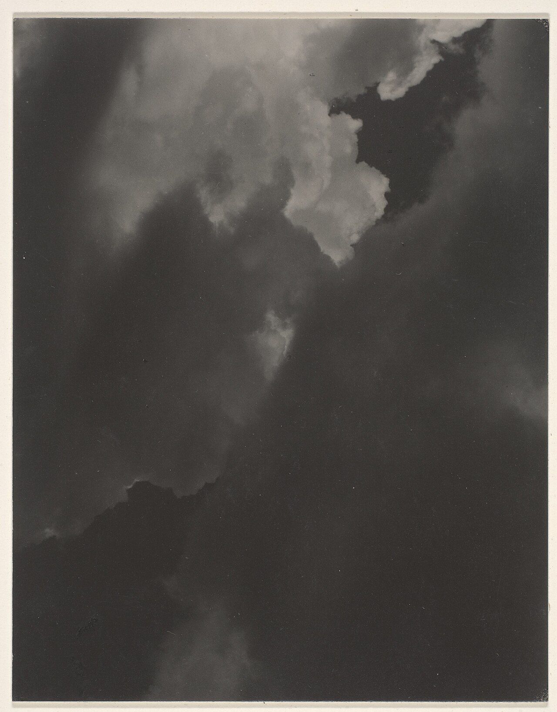

# 第 11 章 弱光与夜景

> 弱光不是白天少了一点亮度。它是另一种光线状态，颜色、气味、距离和情绪都变了。

---

Brassaï 在巴黎拍夜景时，常常面对的是另一座城市。雪刚停的小街、路灯下的薄雾、覆着雪的墙、空下来的巷子，都和白天的巴黎不一样。相机需要架稳，曝光也要拉长；冲出来以后，那些照片让人觉得巴黎在深夜独自醒着。墙上的雪带着蓝色反光，路灯是橙黄的，雾把灯晕成一圈一圈。白天的巴黎属于游客、商店和马车，夜里的巴黎忽然安静下来，像一座刚刚被发现的城市。

他后来连续几年拍这种巴黎夜景，1933 年出版《Paris de nuit》。那本书重要的地方，并不在于证明夜里也能拍清楚，而在于证明光少了以后，熟悉的地方会重新分配自己。白天显眼的招牌和人群退下去，一盏灯、一段墙、一点雾、一个人在街角的影子，反而变得更重。

弱光摄影的核心问题也在这里。不要只问“光不够怎么补”，还要问光少了以后，哪些东西应该消失，哪些东西反而应该留下来。夜晚不是白天的失败版本，它有自己的秩序。

---

*Alfred Stieglitz, "Equivalent"。Stieglitz 从 1922 年开始拍云，拍了十五年，最后整理成《Equivalents》。这些照片没有地标，也没有具体事件，只有云、亮暗和形状。他想说明摄影不必总依赖具体对象，也可以像音乐一样表达一种内心状态。一片云的弱光、灰度和对比，对他来说就是当时的感受。 (Wikimedia Commons, 公有领域)*

---

弱光并不是同一种情况。咖啡馆夜里、博物馆、教堂、家里的一盏台灯、乡村路口的路灯，都是环境本身就暗的场景。光源少，亮处很小，离开光源后很快沉入暗部，颜色也常偏暖。Vermeer 画室内人物时用的就是这种光，一扇窗照进来，人的脸、桌子和墙只被照亮一部分，其余地方慢慢暗下去。今天你用 35mm f/1.4 在咖啡馆里拍一个人，本质上也在处理同样的事：把那一点光的温度留下。

另一种夜晚由人造光主导，城市街道、霓虹、舞台、演唱会、商场外墙都在这里。拍这类场景时，麻烦往往不在光少，而在光太杂：红色招牌、蓝色 LED、绿色霓虹、车灯、手机屏幕和橱窗一起进入画面，每个色温都不一样。东京新宿、香港旺角和许多商业街都这样。它视觉冲击强，但更考验整理能力。你要么选一种主色，让其他颜色退后；要么接受它的混乱，把混乱本身拍成力量。最怕的是所有颜色都同样响，画面会脏。

---

弱光里，器材余量很现实。全画幅在高 ISO、暗部噪点和动态范围上通常更轻松，大光圈镜头也能显著降低 ISO。f/1.4 比 f/2.8 多两档光，在同一个场景里，ISO 6400 可以降到 1600，差别非常明显。35mm f/1.4、50mm f/1.4、85mm f/1.8 或 f/1.4，都是常见弱光镜头。拍静态主体时，三脚架比大光圈还干脆，ISO 100 加慢门可以让一间很暗的教堂或一条城市河岸变得干净。

闪光灯和小 LED 也不是污点，只是要克制。弱光的氛围来自暗部和原有光线，如果补光太亮，人像会像被单独抠出来，夜晚本身被打碎。把补光压低一点，让它只是把眼睛、脸颊或手从暗部里轻轻托出来，通常更自然。

不能用三脚架时，比如咖啡馆、街头、室内抓拍，可以用 M 模式加 Auto ISO，或者光圈优先。光圈尽量大，快门从 1/100 秒起步，焦段越长快门越快，ISO 上限设在你能接受的范围。曝光补偿常常要减一点，因为弱光照片并不需要把一切提到白天亮度。夜里的人脸如果被提得太亮，环境会跟着失去重量，照片看起来像开了闪光灯的快照。

静态夜景则反过来，三脚架、f/8、ISO 100、慢门、自拍计时或快门线，让画面稳定下来。拍桥、河岸、教堂内景和城市天际线时，你不必害怕 5 秒、15 秒甚至 30 秒的快门，因为主体不动，慢门会把噪点压下去，也会让水面、车灯和人流留下时间。星空和极光又是另一组参数，大光圈、手动对焦、数秒到二十多秒的曝光，以及能扛住寒冷的身体和电池。越暗的场景越需要提前想好流程，到了现场再慢慢摸按钮，手和注意力都会先乱。

---

弱光里最先出问题的常常不是噪点，而是对焦。自动对焦需要反差，一面黑墙、一片夜空、一个暗到没有边缘的人脸，它都抓不住。把对焦点移到明暗交界处会好很多：灯的轮廓、招牌字的边缘、头发被光擦亮的那一线、眼睛和脸颊之间的过渡。也可以先对在和主体差不多远的一盏灯、一块屏幕或一处亮边上，锁定后再重新构图。

自动对焦实在不行，就用手动。打开放大实时取景或对焦峰值，慢慢拧到边缘清楚。拍星空、极光和很暗的风景时，手动对焦本来就更可靠。街头夜拍也可以配合区域对焦，把光圈收一点，对在一个估计距离，让一段范围都清楚，这样就不必每张都在黑暗里等相机确认。

---

弱光拍摄经常要在两种代价之间选。提高 ISO 会有噪点，但可以保住快门和主体清晰；压低 ISO 会干净，却可能让人一动就糊。静物、建筑、风光可以用三脚架换干净画质；人物、街头和舞台则宁可让 ISO 高一点，也要保住动作。噪点后期还能处理，动模糊如果不是有意为之，大多救不回来。

也要记住，弱光里的正确曝光不等于把主体拉得像白天。咖啡馆里一个人在窗边读书，如果你把脸提到正常证件照亮度，整个房间的暗和安静都会消失。更合适的做法是让脸比环境亮一点，但仍然属于夜晚。暗部不是空白，它本来就是构图的一部分。一个人站在路灯下，四周沉着黑；一栋楼只有几扇窗亮着，其余都暗；一只手被台灯照到，桌面外沿慢慢消失。那些暗部让照片安静下来，也让被照亮的部分有了重量。

噪点也不必赶尽杀绝。彩色弱光里可以适度降噪，保留一点质感；黑白里噪点甚至可以接近胶片颗粒。过度降噪会让皮肤像塑料，毛发像被涂抹，暗部像一块没有空气的平面。宁可留一点粗糙，也不要把夜晚磨得没有呼吸。

---

几个常见场景可以分别记。

咖啡馆和餐厅要找单一光源，窗边或暖灯下都可以，怕的是窗光和暖灯同时打在脸上，一半冷一半暖，后期很难自然。你可以让人往窗边挪一点，只吃窗光，也可以让人离窗远一点，只留桌上那盏暖灯。拍这种照片时，不要急着把整张提亮，桌角、椅背和房间深处暗下去，反而会让人脸附近那一点光更有分量。

博物馆和教堂常常禁止三脚架和闪光灯，也不适合大声走动。靠墙、靠柱子、把手肘收紧，能让身体稳定一点。对焦不要对一片暗墙，要对雕塑边缘、彩窗图案、烛台亮边，或者人脸上被光擦到的地方。这里的暗不是错误，教堂内部本来就应该有深处，如果你把每根柱子和每一块天花板都拉亮，空间反而会失去安静。

街头夜景先找主色，一片红招牌、一块绿色橱窗、一排蓝色灯管，然后等人走进那片光里。夜里的街道颜色很多，最好先找到一个能统领画面的颜色，再决定其他颜色是留下还是退后，不要一开始就把所有颜色都收进来。演唱会和舞台要保高光，聚光灯下的脸很容易爆，背景黑并不是问题。舞台本来就是从黑里长出来的，一张照片里只有歌手的脸、手和麦克风被照亮，也可以很完整。

城市天际线最好在蓝调时刻拍。三脚架、f/8 到 f/11、ISO 100、几秒到几十秒慢门，天空还有深蓝，建筑灯刚亮，这是夜景里最舒服的平衡。星空要远离光污染，最好是新月前后，手动对焦到星点最小，前景需要一点轮廓，否则只剩一片星点。极光还要照顾寒冷，电池贴身放，镜头先在室外适应，金属三脚架别空手摸。

---

弱光后期要尊重现场。暖光不必校到完全中性，否则钨丝灯、烛光和小餐馆的亲密气氛会被洗掉。冷光也可以保留，它让画面有距离和清冷。霓虹混色不要把所有颜色都抬高，先决定主色，再压低陪衬颜色。蓝调时刻本来已经有天然的蓝橙关系，后期只要微调反差和白平衡，不需要把天空调成夸张的蓝。

后期完成后问自己一句：这张照片看起来还是在夜里吗？如果它像一张白天照片被套了蓝色滤镜，或者像暗室被强行照亮，说明你把弱光最宝贵的东西拉掉了。

---

## 练习

找一个咖啡馆或餐厅，让朋友坐在窗边或暖灯下，用 35mm 或 50mm 大光圈拍 30 张。回家只选 5 张，比较哪些照片保留了当时的暗和暖。

在同一个弱光场景里，ISO 800、1600、3200、6400、12800 各拍一张。回家放大看噪点和细节，找出你自己的可接受上限。

傍晚或夜里找一个亮背景，可以是窗、霓虹、车灯或路灯，让一个人或物站在前面拍剪影。注意轮廓是否清楚。

蓝调时刻去一个城市制高点，用三脚架拍一组夜景，每隔几分钟拍一次。比较哪一张天空和灯光最平衡。

只用一盏台灯、手电或手机灯拍一个人。让画面大部分保持暗，只用那一点光照亮脸、手或衣服的一角。

---

下一章：[第 12 章 黑白](12-bw.md)
