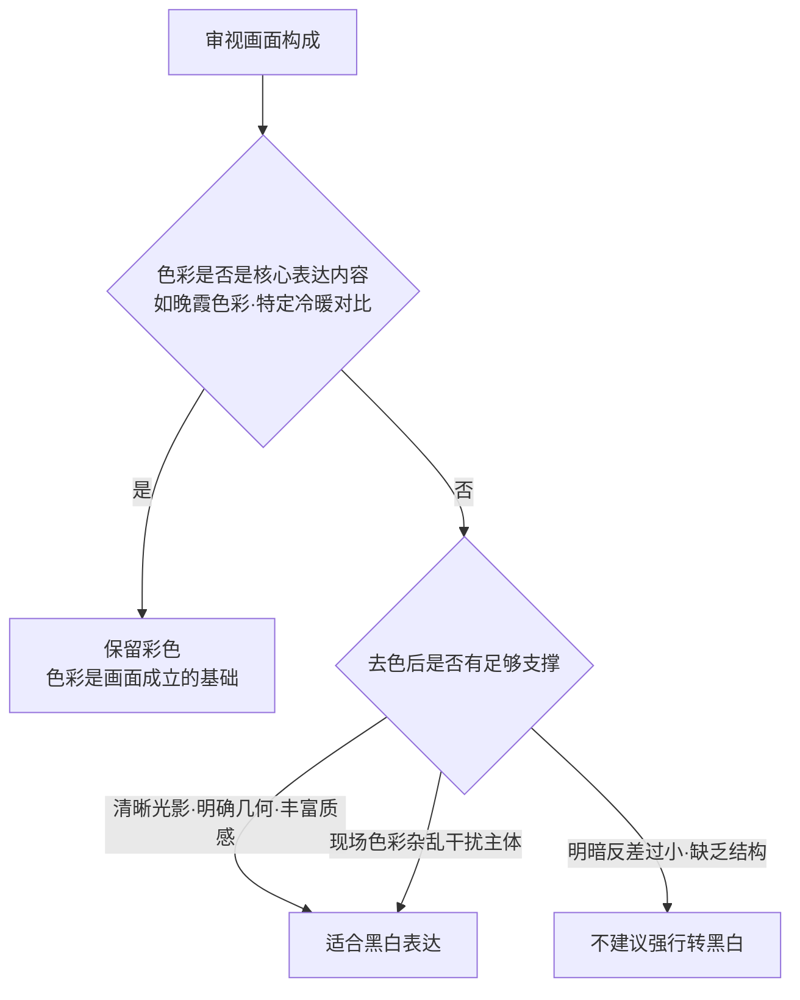

# 第 12 章 黑白

> 黑白摄影不是简单地抽离色彩。它是一种以明暗反差、空间结构、线条与材质肌理为主导的观看方式。

---

## 黑白不是去掉颜色

*Walker Evans, "Coney Island Boardwalk", 1929。Evans 后来在大萧条时期为 FSA 拍美国南方的小镇、农场、门面和广告牌。他的许多重要照片都是黑白，并不只是因为年代限制，而是他主动让颜色退场，专注看木头、铁皮、字体、门窗和人的姿态。按快门之前，他已经在心里把颜色拿掉，只看明暗和结构。[图片来源与复用说明](image-credits.md#evans-boardwalk)*

---

## 黑白重新安排注意力

初学摄影时，容易认为黑白只是把彩色照片直接转为灰度——将饱和度降到零即可。

但在实际操作中往往会发现：直接去色的照片容易显得平淡发灰，缺乏明暗层次。

原因在于：**直接去色只是按照各颜色的物理亮度进行转换，画面中缺乏明确的高光与暗部支撑，所有细节容易挤在中间灰阶。**

成熟的黑白摄影，通常在按下快门前就已经以黑白的逻辑来观察场景：看光影的分布、线条的走向、以及物体表面的质感。当色彩退场后，必须有清晰的光影或结构来支撑画面的重心。

在决定是否转为黑白前，可以问自己：**色彩在当前画面中是起到了增强作用，还是带来了干扰？**

*   **适合转为黑白的情况**：
    *   现场色彩杂乱多变（如街头各色招牌、不同色温灯光混杂），转为黑白能净化背景，让观者的注意力回到人物神态与光影本身；
    *   画面本就依靠强烈的明暗反差、清晰的几何线条或丰富的纹理质感（如老人的面部线条、斑驳的墙面、逆光剪影）；
    *   希望削弱特定时代服装或材质色彩的干扰，强化画面的时间感与经典感。
*   **不适合转为黑白的情况**：
    *   色彩本身就是核心表达内容（如晚霞的色彩、红衣与绿植的冷暖对照、蓝调时刻的天空）；
    *   画面各元素的区分主要依赖色相而非明度（如大雾天中浅绿与浅灰的细微色彩过渡），去色后容易使层次消失。

---

## 在现场预看灰度

练习黑白摄影需要学会在现场预想灰度层次：寻找最亮的高光位置、最暗的阴影区域，观察中间灰阶的过渡，以及材质表面的肌理细节。

需要注意的是：**失去色彩后，原本依靠颜色区分的物体可能会在灰度上重合。**

例如：绿叶中的红苹果，在彩色中对比鲜明；但根据人眼亮度的加权转换公式：

\[ Y = 0.2126\,R + 0.7152\,G + 0.0722\,B \]

红色与绿色在某些明度下转出的灰度可能非常接近。如果直接去色，红苹果与绿叶可能会混为同一层次的灰色。

在后期黑白转换时，使用**黑白混合器（B&W Mixer）**针对不同颜色通道单独调节灰度明暗，是解决这一问题的核心方法：

| 画面元素 | 对应主要通道 | 默认去色效果 | 提高该通道亮度 | 降低该通道亮度 |
|---|---|---|---|---|
| 晴朗蓝天 | 蓝色通道 | 中灰 | 天空变亮发白 | 天空压暗，衬托白云 |
| 白云 | 三通道均高 | 明亮白 | 保持明亮 | 保持明亮 |
| 红砖墙面 | 红色通道 | 中灰 | 墙面提亮，纹理清晰 | 墙面变暗 |
| 人物肤色 | 橙色/红色通道 | 较亮灰 | 肤色白皙柔和 | 肤色偏暗偏重 |
| 绿树草木 | 绿色通道 | 中灰 | 树木提亮显层次 | 树木压暗沉稳 |

---

### 滤镜在黑白中的作用

在胶片黑白摄影中，常用彩色滤镜来改变不同颜色的灰度映射；在数码时代，后期黑白面板中的通道滑块起着相同的作用：

*   **红色滤镜（Red Filter）**：吸收蓝绿光、透过红光。大幅压暗蓝天，使白云格外突出，同时提亮肤色与红砖建筑，反差强烈。
*   **黄色/橙色滤镜（Yellow/Orange Filter）**：温和压暗蓝天，适度增加天空与白云的反差，使景物过渡自然，是风光与户外人像中最常用的滤镜效果。
*   **绿色滤镜（Green Filter）**：提亮树叶与草木层次，略微压暗肤色，适合森林与植物题材。

---

## 用分区组织影调

Ansel Adams 的**分区曝光系统**（Zone System）为黑白影调提供了系统的控制方法。它将纯黑到纯白的影调划分为 11 个区域：

| 分区 | 影调特征 | 对应现实参考 |
|---|---|---|
| **第 0 区** | 纯黑 | 无细节的极暗部 |
| **第 I–II 区** | 极深暗色 | 隐约有轮廓，几乎无纹理 |
| **第 III 区** | 丰富的暗部细节 | 树皮、深色大衣、阴影处的岩石 |
| **第 IV 区** | 较暗的中间调 | 较深肤色、背光建筑面 |
| **第 V 区** | 18% 基准中灰 | 灰卡、风化木材、中性路面 |
| **第 VI 区** | 较亮的中间调 | 浅色皮肤、受光的混凝土 |
| **第 VII 区** | 丰富的亮部细节 | 白墙、浅色衣物、受光沙滩 |
| **第 VIII 区** | 极淡的明亮细节 | 带有细腻纹理的新雪、羽毛 |
| **第 IX–X 区** | 纯白 | 镜面高光、无细节的亮白 |

黑白构图时，可以观察画面中重要元素分别落在哪些分区，保证画面既有扎实的暗部（第 II–III 区），又有通透的亮部（第 VII–VIII 区），以及丰富的中间过渡。

---

## 噪点与胶片颗粒

数码机身的彩色噪点容易影响画质；而在黑白摄影中，适度的单色明度颗粒（Grain）有时能增加画面的质感与时间感。

后期处理时，可先通过降噪去除杂色噪点，再根据需要适度添加细腻的胶片颗粒，为平滑的数码画面增添一分纸质感与纹理。

---

## 练习

将相机的照片风格设为“单色”（Monochrome），出门拍摄半天。直接在取景器中以黑白视角观察世界，重点寻找高反差的光影、清晰的几何线条或强烈的材质肌理。

拍摄一张晴天下的建筑或人物（包含蓝天、植物与人物），在 Lightroom 或 Photoshop 的黑白混合器中，分别尝试“红滤镜预设”与“绿滤镜预设”，观察天空与植物灰度的明显变化。

挑选一张自己拍摄的彩色照片转为黑白，使用曲线工具分别调整暗部（第 III 区）与亮部（第 VII 区），尝试做出低反差（柔和中灰）与高反差（强烈黑白对比）两种不同风格的成片。

---

下一章：[第 13 章 后期](13-postprocess.md)
