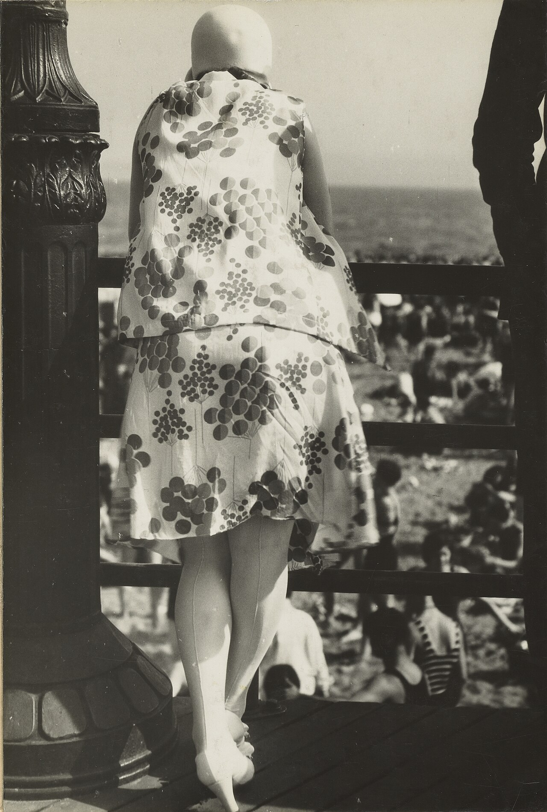

# 第 12 章 黑白

> 黑白不是「把彩色去掉」。黑白是另一种语言。它强调结构、节奏、肌理 - 但去掉了情绪里属于颜色的那一半。

---

*Walker Evans, "Boardwalk", 1929。Evans 1930 年代为 FSA（农业安全局）跑遍美国南方，记录大萧条时代的农场和小镇。他的画面几乎全是黑白 - 不是当时只有黑白胶片，是他**主动选择不让颜色进入画面**。「颜色是给我们眼睛的礼物，」他写过，「但黑白是对结构的承诺。」他的每张片在按下之前已经在脑子里去掉了颜色，只看明暗、几何、纹理。这种工作方式让他的木头门、广告牌、铁皮屋顶有一种你在彩色照片里永远看不到的「被审视过」的感觉。 (Wikimedia Commons, 公有领域)*

---

不是每张片都该转黑白。

该转的画面：颜色在拖累而不是帮忙（背景色乱、主体色丑、混色光脏）。画面靠结构而不是颜色（几何、线条、明暗、纹理是主角）。**反差强**（硬光、明暗对比戏剧的画面，黑白更纯粹）。想去掉时代感（彩色片有强烈年代信息 - 90 年代电视的颜色 vs 2020 年代；黑白模糊年代）。想强调情绪（忧郁、严肃、纪实、戏剧 - 颜色会冲淡这些）。

不该转的画面：颜色本身就是主体（黄昏、霓虹、花、秋叶 - 转黑白等于丢掉了一半）。柔和的中调画面（阴天的港口、雾里的森林 - 彩色微妙的灰绿灰蓝才是它的灵魂）。靠色彩呼应构图（互补色对比、主色 + 点色这种 - 转黑白后画面会瓦解）。

新手陷阱：把所有不会调色的片转黑白。**这是逃避，不是判断**。好的彩色比好的黑白更难，但也是另一回事。

---

转黑白前，要学会「用黑白思维看世界」。

黑白思维 = 看明暗 + 看结构。走在街上，看到一个画面问自己 - 这画面里**最亮的地方**和**最暗的地方**在哪？它们的关系是什么（对比、过渡、互相映照）？去掉颜色这画面还成立吗？哪个区域有纹理（皱纹、墙面、树皮、织物）？哪个区域是纯块（天空、平面、剪影）？

这种思维和彩色思维不一样。彩色看色相、饱和度、色彩关系；**黑白看明暗、对比、纹理、形状**。

三个练习。把所有彩色作品在脑子里转黑白 - 看 Instagram 时强迫自己想「这张转黑白会怎样？」。**眯眼看世界** - 眯眼会过滤颜色信息，留下明暗结构。这就是黑白的视角。**相机切到黑白模式** - Fujifilm 用 Acros，Sony 用 Black & White Picture Profile，Leica Q 黑白模式。让取景器变黑白。一周下来你看世界的方式会变。

---

Ansel Adams 在 1939 年提出「分区曝光系统」（Zone System），把灰度从纯黑（0 区）到纯白（10 区）分 11 个区。

简化版理解：0 区纯黑（无细节，死黑阴影），1-2 区极暗（几乎无细节，深阴影），3 区暗（有细节但暗，黑色衣服、暗墙），4 区中暗（中性偏暗，棕色、暗皮肤），5 区中灰（18% 灰），6 区中亮（中性偏亮，浅皮肤、白人皮肤），7 区亮（有细节但亮，浅墙、白色衣服），8-9 区极亮（几乎无细节，高光区），10 区纯白（无细节，太阳 / 死白）。

好的黑白片**应该用上整个区域** - 有 0 区的死黑、有 10 区的死白、中间过渡丰富。**灰飞飞的中间灰画面 = 死片**。这是新手转黑白最常见的失败：缺反差。

---

黑白没有颜色，反差就是它的全部语言。三种反差气质。

**高反差**（High Contrast）。死黑 + 死白，中间灰少，画面强烈、有力量、戏剧性强。代表是 William Klein, Daido Moriyama, Ralph Gibson。适合街头、戏剧人像、概念作品。陷阱：所有片都拉高对比 = 视觉疲劳 + 缺少层次。

**中反差**（Normal）。黑白都有但不极端，中间灰丰富，画面有层次。代表是 Bresson, Ansel Adams, Sebastião Salgado。适合纪实、肖像、风光、几乎一切。**中反差是默认**。它不刺激但耐看。

**低反差**（Low Contrast）。没有死黑或死白，全是中灰过渡，画面「雾感」、温柔。代表是 Sally Mann, Hiroshi Sugimoto。适合温柔题材、概念、忧郁氛围。陷阱：低反差容易看起来像「没拍好」。要做这种风格需要画面本身有强结构。

---

转黑白有三条技术路径。

**相机直出黑白**。相机里设置黑白模式（Fujifilm Acros、Sony 黑白配置文件、Leica 黑白）。优点：取景器看的就是黑白，帮你用黑白思维。JPEG 直出有质感（特别是 Fujifilm Acros）。**强烈推荐拍 RAW + JPEG 黑白**。RAW 备份了彩色，JPEG 给你即时反馈。

**彩色 RAW 后期转黑白**。最灵活的路径。后期软件给的控制：HSL 通道转灰度（红黄绿青蓝紫各通道分别给亮度。例如：拍人像让「红橙」通道亮一点 → 皮肤变亮、「蓝」通道暗一点 → 天空变深）。预设。胶片模拟（Tri-X、HP5、Acros 等胶片的反应曲线）。

**胶片黑白**。胶卷拍黑白是另一回事。HP5、Tri-X、Tmax 是经典。胶片优点：颗粒美、动态范围广（特别 Tri-X 推到 ISO 1600）、仪式感、你看不到回放每张都更慎重。缺点：慢、贵、麻烦。胶片不是这本书的主线。但你有兴趣可以买一台老 Leica M6 / M3 试试，**会改变你按快门的感觉**。

---

几种题材在黑白下比彩色好。

**黑白街头**。街头的黄金题材之一。反差强（路灯、阴影、聚光），颜色乱（霓虹、招牌、衣服）转黑白后画面干净，戏剧性突出，历史感（黑白让一张当代街头看起来像 50 年代）。代表是 Bresson、Klein、Daido Moriyama、Vivian Maier。

**黑白人像**。经典。去掉肤色不准、衣服颜色丑、背景色乱。强调脸的结构（眼神、皱纹、骨骼）。**时代感被去掉，永恒感增加**。代表是 Avedon、Penn、Lindbergh。光位极重要（侧光最好）。皮肤通道（橙）可以微调。高反差适合男性 / 老人 / 戏剧；中反差适合女性 / 年轻 / 柔和。

**黑白风光**。Ansel Adams 一辈子的工作。大反差自然适合（云、山、雪、阴影）。红 / 橙滤镜（拍胶片时实物滤镜，数码时代是后期红 / 橙通道）让蓝天变深、云变白，戏剧十足。极注重明暗结构（前景中景背景的明暗节奏）。代表是 Ansel Adams、Michael Kenna、Sebastião Salgado。

**黑白纪实 / 报道**。纪实摄影传统上以黑白为主。代表是 Magnum 摄影师 - Bresson、Capa、Salgado、Eugene Smith、Don McCullin。不能太美（题材决定）。中反差为主，给画面层次。主体故事清晰。**颗粒、噪点都是合法风格**。

**黑白建筑**。适合几何感强的现代建筑、老建筑的纹理（石头、木头、铁锈）、极简主义建筑。代表是 Hiroshi Sugimoto, Hélène Binet。构图必须极精准。

---

黑白后期有几个核心判断。

**黑场和白场**。转黑白后第一件事：把直方图最左推到刚好碰墙（设置黑场，让最暗部分死黑）。把直方图最右推到刚好碰墙（设置白场，让最亮部分纯白）。**不要怕「裁掉细节」**。死黑和死白是黑白的语言，全是中灰才是死片。

**HSL 通道控制**。黑白看似没有颜色，但原片每个色彩对应不同灰度。后期分通道调灰度：拍蓝天 + 白云：蓝通道压暗 → 天变深；不动云 → 云保持白 → 戏剧十足。拍人像：橙通道（皮肤）拉亮 → 皮肤亮净；蓝通道（眼白、衣服）压暗 → 眼神更深。拍秋叶：红黄通道压暗 → 红枫黄叶变深；绿通道拉亮 → 绿叶变亮 → 反差出来。**不会用 HSL 的黑白片是没法看的**。这是黑白后期的核心技能。

**颗粒**（Grain）。数码黑白默认平滑。加颗粒像胶片，让画面有「密度」，减弱「数码感」。Lightroom / Capture One 的 Grain 滑块给颗粒。Quantity 20-40，Size 20-30，Roughness 40-60 是起步。

**调色**。黑白也可以调色 - 不是给色彩，是给「色调」。冷调黑白：阴影偏蓝，整体冷峻。暖调黑白：高光偏黄，画面像旧照片。色彩偏移：阴影偏蓝 + 高光偏黄 = 复古胶片感。

调色让黑白片有「个性」。**但不要每张都调**。一组里色调一致比单张特别更重要。

---

20-50 张黑白片放一起，要看起来像**同一只手拍的**。

统一性来自同样的反差（一组都中反差，或一组都高反差）、同样的色调（一组都中性、一组都偏冷、一组都偏暖）、同样的颗粒（一组都加颗粒，且粒度一致）、同样的题材范畴（都是街头、都是肖像、都是建筑）。

经典黑白项目参考：Bresson《决定性瞬间》、Robert Frank《The Americans》、Salgado《Genesis》、Daido Moriyama《Farewell Photography》、Vivian Maier 整理后的芝加哥街头。

挑一个你能持续做的范畴。**做 30-50 张统一风格**。这就是一个项目。

---

几个反直觉的黑白判断。

彩色不一定比黑白容易。新手以为「黑白省事 - 不用调色」。其实黑白对结构、明暗、纹理的要求**比彩色高**。**不要把转黑白当退路**。

高 ISO 黑白比低 ISO 彩色好看。高 ISO 噪点在彩色片里是「瑕疵」，在黑白里是「颗粒美」。弱光场景：拍 RAW，后期转黑白，颗粒拥抱噪点。**Daido Moriyama 一辈子都是这种风格**。

黑白可以让「普通」画面变好看。一张普通的城市街景颜色平淡 → 转黑白后强调几何 → 突然有了趣味。但**不要滥用这个**。如果你的所有黑白都是「用黑白救普通片」，你不在练判断，在掩饰。

---

如果你愿意做点什么把这章变成肌肉：

取景器变黑白模式一周。每天选 3 张。一周后看自己看世界的方式有没有变。

找你过去一年最满意的 10 张彩色片。每张转一次黑白。哪些转后更好？哪些变差？哪些没差异？

拍一张人像 + 一张蓝天云朵。后期转黑白时分别玩 8 个通道。看每个通道对画面影响。

带 35mm，相机切到黑白模式（如果有），出门一天专门找黑白题材：强光影、几何、剪影。回家选 5 张。

找一个朋友，单光源（窗光 / 单灯）。拍 30 张全黑白。回家选 5 张并写：每张为什么是黑白而不是彩色。

---

下一章：[第 13 章 后期](13-postprocess.md)
