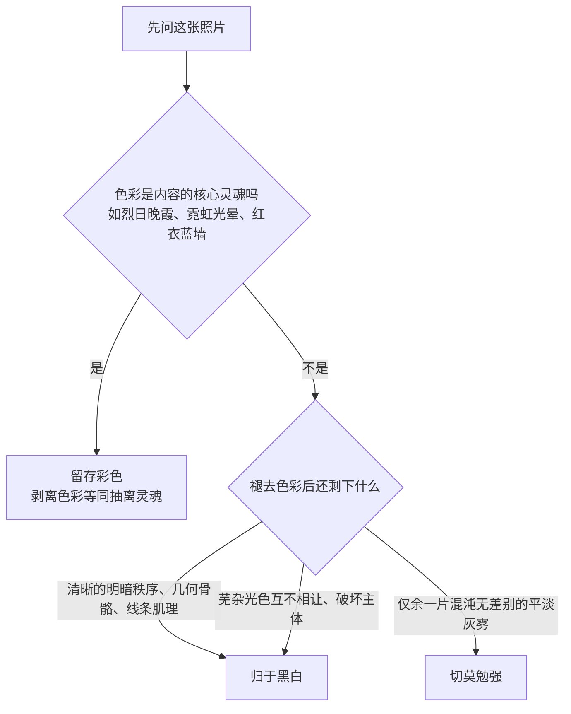

# 第 12 章 黑白

> 黑白绝非抽离色彩的残缺标本。它是一套颠覆性的知觉哲学，让明暗、结构、肌理与时间的重量轰然立于台前。

---

## 黑白不是去掉颜色

*Walker Evans, "Coney Island Boardwalk", 1929。Evans 后来在大萧条时期为 FSA 拍美国南方的小镇、农场、门面和广告牌。他的许多重要照片都是黑白，并不只是因为年代限制，而是他主动让颜色退场，专注看木头、铁皮、字体、门窗和人的姿态。按快门之前，他已经在心里把颜色拿掉，只看明暗和结构。[图片来源与复用说明](image-credits.md#evans-boardwalk)*

1929 年盛夏，刚从巴黎游学归来的沃克·埃文斯（Walker Evans）手持一台小巧的折叠相机，漫步于纽约康尼岛（Coney Island）熙攘的海滨木栈道上。彼时的美国正沉醉于爵士时代的繁荣狂欢，商业海报与画意派摄影充斥着浓郁感伤与甜腻滤镜；然而埃文斯深受福楼拜“冷峻而无动于衷的客观主义”浸润，决意开辟一条截然相反的视觉道路。在这一帧定格于栈道栏杆边的即景中，一位身着盛夏无袖印花裙的年轻女子正背对镜头、倚栏远眺大西洋的漫漫波涛。埃文斯没有乞灵于人物转瞬即逝的面部情绪，亦未将海滨度假胜地的喧腾作为奇观兜售；他将目光凝注于一段背影，以及这一背影在光影与空间几何中所构筑的纯粹秩序。

在这幅杰作中，黑白展现出近乎解剖学般的精确与冷峻美力。时值正午，烈日自头顶倾泻而下，女子的白色钟形女帽（Cloche hat）与小腿上紧致的平滑丝袜反射出刺目的阳光，被推至通透清亮的高光之境（第 VII 区至第 VIII 区）；而画幅左侧那根维多利亚式铸铁灯柱的繁复柱脚，则以沉重坚实的极暗影调（第 I 区至第 II 区）如铁锚般扎入近景，为整幅画卷锚定了不可动摇的空间基座。裙裾上由圆点与植物枝蔓交织而成的几何印花，在失去色彩干扰后，化作了极具现代构形意味的黑白节奏；深色的横向木质栏杆如五线谱般水平横贯，将前景立体的质感与远景虚化的人潮利落划开。在焦外的沙滩上，成百上千赤身嬉戏的浴者缩微成一片由中间灰度构成的流动织体，而女子丝袜后侧那道笔直垂直的缝线，宛如一道精密的铅垂线，将整幅构图的张力牢牢收束于方寸之间。

《康尼岛木栈道》最深邃的美学启示，正在于向世人昭示：**黑白绝非对斑斓现实的无力阉割，而是一场主动剔除感官杂质的本质归纳**。试想倘若此作以彩色胶片呈现，夏日刺目的红蓝花裙、蔚蓝的海水、金黄的沙滩与游人晒成粉红的皮肤，必将瞬间引爆观者的神经末梢，将这幅影像拖入平庸的旅游明信片泥潭。正是由于黑白在快门开启前便完成了对色彩的决绝剥离，布料的棉麻褶皱、铸铁的冰冷肌理、木纹的粗粝、肉体的柔韧与远方的茫茫苍穹，方能平权地汇聚于纯粹的明暗阶梯之中。埃文斯借由此作奠定了日后名垂摄影史的“纪实风格”（Documentary Style）——黑白不是颜色的缺席，它是一套让物象的骨骼、质地与时代精神破土而出的全新认知构架。

---

## 黑白重新安排注意力

初涉此道者常陷入一重认知误区：以为黑白不过是彩色影像被抽去颜料后的朴素标本，只需将饱和度滑块粗暴归零，便能自动蜕变为黑白艺术。然而依样画葫芦的结果，往往只是一幅面目发灰、发闷、毫无精神焦点的浊滞废片。其光学机理并不深奥：无差别的去色，仅仅是将各色光波机械对应到其默认的亮度通道上，原本在画面中应当深沉下潜的暗部未能沉底，理当拔节跃升的高光亦未曾挺立，整幅画面平摊在狭隘混沌的中间灰泥潭中。那不是黑白，只是失却了血色的病态彩色。真正的黑白之道，是在扣动快门之前便换用另一双眼睛审度乾坤——体察明暗如何跌宕分布，几何骨架如何相互咬合，微观肌理是苍劲还是温润。色彩退席之后，必须有更雄健的视觉基石挺身而出；而这副基石，唯有在凝视现场的瞬间被清醒预见。

并非世间所有图景皆宜于托付给黑白。在决意剥离色彩之前，理当向心智叩问一个质朴而锋利的命题：**在这幅画面中，色彩究竟是在相辅相成，还是在喧宾夺主？** 这道追问逼迫执机者在行动之始便勘破影像立足的根本元气。

倘若画面原本的光色芜杂纷乱，背景的霓虹招牌、过客的各色衣料、杂乱的橱窗反光彼此争夺眼球，致使视觉中心支离破碎，那么转归黑白往往能令天地顿归安详。那些依赖鲜艳饱和度抢夺视线的杂质被悉数收拢进同一灰度谱系，观者的目光方能重新聚焦于人物的仪态与光线的流转。倘若画面的灵魂本就栖息于硬朗的线条、严谨的几何、苍老的皱纹、斑驳的石墙、风蚀的树皮、抑或人物眼眸中深沉的凝视，那么涤荡色彩，恰能赋予这些特质以排山倒海的力量。黑白更拥有一重超越时间的隐秘力量：彩色底片中，某种特定的数码发色、某一时季的流行服饰剪裁、某类荧光显像管的微弱偏色，皆会悄然为画面打上鲜明的时代烙印；而黑白将这层浮泛的时代泡沫一概滤尽，影像因而得以超然于岁月流转，显露出古典而永恒的尊严。

反之，倘若色彩本身即是画面的灵魂内核，强行剥离便是一场视觉的灾难。暮色中焚烧般的晚霞、午夜霓虹的迷离光晕、深秋如火的枫叶、抑或深蓝石墙前一袭朱红长裙——它们的成立全系于色相的纯粹张力，一旦翻成灰阶，元神便当场陨灭大半。更有某些脆弱而诗意的景致：晨雾弥漫的幽林、阴郁低沉的海港，那些近乎透明的冷灰绿与灰蓝在明度上本就毫厘相差，硬转黑白，只会坍缩为一团混沌平板的灰雾。初学者极易误入的歧途，是将自己未能妥善驾驭色彩的废片转为黑白，自欺欺人地称之为“风格化”，实则是掩盖临场观察的溃败。黑白当是深思熟虑的主动裁决，绝非避难平庸的技术借口。

由更深层的知觉机理审视，黑白之所以令人回味无穷，因其本质上是一场**高度自律的抽象提炼**。彩色摄影总试图将肉眼所见的物理世界巨细靡遗地复刻呈前，红是红，绿是绿，它与表象世界只隔着一层轻薄的仿生膜；而黑白却在第一步便将色彩这一重丰沛的感官表象决绝抽离，独留影调的深浅起伏、形体的外廓剪影、肌理的微观质地与光影的咬合张力。画面少了一处讨巧的捷径，便不得不以更严酷的骨相示人。黑白影像从不是对物象的机械拓印，而是一场冷峻而深情的视觉归纳。

这重抽象既是黑白的严苛门槛，亦是其雄浑法力所在。它像一面绝不容情的照妖镜：凡是原本仰赖艳俗色彩掩饰的构图松散与立意空洞，在灰阶之下皆现出原形；而真正结实有力的筋骨，亦唯在黑白之境中，方能尽显其无可撼动的尊严。

---

## 在现场预看灰度

研习黑白，第一重内功是在现实场景中学会主动“视而不见”——将眼前的万紫千红按捺于知觉后景，如同雕塑家审视顽石般进行逆向解构：画面的绝顶高光落在何处？最深沉的暗部隐于何方？两者之间是如刀砍斧削般的坚硬明暗交界，还是若水银泻地般的柔滑渐变？继而搜寻物象的微观肌理：饱经风霜的砖石剥落、老人额头的沟壑、粗纺毛呢的织物经纬、暴雨洗刷后的沥青反光。这些在彩色语境下被色相轻易掩盖的触觉质感，一旦进入黑白世界，便会轰然化作沉甸甸的视觉重量。最后在心智中完成终极裁决：倘若此刻骤然切断色彩，眼前剩下的究竟是一副嶙峋有致的精神骨架，还是一堆面目模糊的混沌灰泥？

此处横亘着黑白最易被初涉者轻慢的物理隐患：人们常误以为抽去色彩便精简了视觉变量，实则不然——**色彩的消隐，意味着人类视觉最省力的辨识捷径被彻底切断**。设想一颗鲜红的苹果悬挂于苍翠的绿叶丛中：在彩色视界中，红与绿互为强烈补色，主体呼之欲出，执机者哪怕漫不经心构图，色彩的物理落差亦能替画面完成分割。然而红与绿虽在色相上判若云泥，其在特定光照下的**物理反射亮度却往往高度重合**。一旦机械转化为灰阶，苹果与叶片便双双跌落进完全同等的灰度深渊，原本鲜明的界线瞬间湮灭无形，红苹果就这样悄无声息地溶化在绿叶之中。彩色世界中唾手可得的天然红利被无情没收，要在黑白之境中将物象从背景中挺拔剥离，唯有仰赖纯粹的明度阶梯与光影刻刀。

若仅凭肉眼直觉，尚难窥破“红绿明度何以相差无几”的底层物理奥秘。在色彩科学中，由彩色通向明度的转化，绝非红、绿、蓝三原色亮度的算术平均，而是严谨遵循人类视网膜视锥细胞对各波段光谱的加权敏感度分布。国际电信联盟在 Rec.709 标准中，便为**线性光 RGB** 确立了经典相对亮度方程 \(Y\)：

\[ Y = 0.2126\,R + 0.7152\,G + 0.0722\,B \]

方程中绿光权重高达七成（0.7152），红光占两成出头（0.2126），蓝光仅占不足一成（0.0722）——这精准映照了人类视觉生理对黄绿波段极度敏感、而对蓝紫波段相对迟钝的演化特征。必须清醒认知：公式中 \(R\)、\(G\)、\(B\) 乃是剔除了 sRGB 非线性伽马（Gamma）校正后的线性物理辐射通量，不可将 0–255 的非线性显示编码值直接代入运算。然而这一方程揭示了至关重要的真相：**色相差异极大的色彩，完全可能拥有等额的线性亮度；一旦抽离色相，几何边界便荡然无存**。

洞悉此理，便能精准找寻到黑白数字暗房中最具威力的机关所在。许多人面对发闷的黑白，习惯性地猛推整体对比度滑块；殊不知对比度仅仅是线性放大既有的明度落差，当苹果与树叶本就同处于某一灰度阶梯时，推高对比度只会让它们一同变亮或一同沉暗，既无落差，便无从放大。真正老练的法门，在于**按色彩通道分流调遣其映射灰度**：将红色通道的亮度权重果断抬升，将绿色通道适度下沉，红苹果便能瞬间自阴郁的叶丛中破土而出。在黑白的世界里，**表面调弄的是灰阶，内里操纵的始终是色彩波段**。

数字暗房中的核心重器——**通道混合器**（Channel Mixer），其使命正是让创作者亲手改写三原色的加权分配，重新定义自然界的色彩当以何种影调深浅显影。默认的 Rec.709 加权原本用以还原肉眼的生理均值；而艺术创作恰恰需要颠覆均值：将红色权重拔高，砖墙、晚霞、暖调皮肤便呈现出象牙般的透亮光泽，而深邃的蓝天因在红通道中信号孱弱，顺势沉降为肃穆的墨色天幕。同一张彩色 RAW 原片，在不同的通道配比下，能激荡出气质截然相反的黑白杰作。

在通道混合的操作中，通常使权重代数和维系在 100% 上下以防画面整体曝光发生剧烈漂移；然而更严苛的准绳在于细致审视：检视极亮部是否硬性过曝飞白，暗部噪点是否被过度拉扯放大，天空与面容交界处是否产生断层或伪色光晕。

| 画面核心元素 | 主要富集之通道 | 默认生理加权转出之灰度 | 拔高红通道权重后 | 拔高绿通道权重后 |
|---|---|---|---|---|
| **澄澈蓝天** | 蓝通道 | 中等偏明 | 显著沉降至墨黑，极具戏剧张力 | 略微收紧变暗 |
| **层叠白云** | 红绿蓝三通道均处于高位 | 亮白 | 维持高亮，与暗黑蓝天形成雕塑级反差 | 维持高亮 |
| **古旧红砖、陶瓦** | 红通道 | 中性灰 | 显著提亮，凸显表面风蚀颗粒 | 沉入深暗，肌理硬朗 |
| **人物健康肤色** | 红、橙、黄通道 | 中等明度 | 通透白皙，面容瑕疵与色斑自然隐退 | 暗哑发浊，面色泛出病态泥灰 |
| **林木、茵茵草地** | 绿通道 | 中等灰调 | 沉入沉静深色，成为有力基座 | 显著提亮，叶脉通透，呈现繁复细节 |

这张转换谱系与传统银盐时代镜头前加装的物理黑白滤镜原理完全同构：无论是从数字通道的算法矩阵反推，还是自物理光学滤镜的透射特性前瞻，其内核如出一辙——**同色放行而提亮，补色阻滞而压暗**。

!!! example "案例推演：蓝天下的红砖钟楼"

    在彩色世界中，钟楼依靠红砖与背景澄澈钴蓝的互补冷暖张力卓然屹立；若依默认权重机械转灰，两者却双双落入近乎同等的 18% 中灰，古老钟楼瞬间溶入天空的泥淖，形体溃散。

    - **让建筑质感挺立**：在通道混合器中果断提升红通道（如置于 +80%）、大幅压低蓝通道（至 -10%），红砖墙面被瞬间托举提亮，蓝天如水银泄地般深沉下坠，白云宛如浮雕般撕裂苍穹——此法等同于在镜头前加装深红滤镜（Wratten #25）；
    - **让纯粹几何剪影说话**：反其道而行之，剧烈压制红通道、提升蓝通道，钟楼体量沉入坚实森严的纯黑剪影，整幅画面化作钟楼外轮廓与广阔天空之间的硬朗构成；
    - **权衡物理代价**：大幅压深天空时，所调遣的正是红通道中信噪比最严苛的暗区，务必放大至 100% 细察天幕是否涌现出数字色带（Banding）或高频散粒噪点，必要时在局部施以适度平滑。

    两套方案皆成立。通道混合的选择从不是冰冷的数值堆砌，而是创作者关于“这幅画卷究竟当倾诉砖石的沧桑肌理，还是歌咏轮廓与天际的崇高关系”的心灵抉择。

在现场体察明暗的一门古老窍门，是**微眯眼眸凝望世界**。眼睑轻阖的刹那，微小的色相细节与琐碎杂质率先消隐于知觉深处，大面积的光斑、沉稳的暗影与宏阔的体块便如潮水般涌现，肉眼的生理知觉已然切入黑白的观照之境。现代无反相机更赋予了创作者前所未有的神兵利器——将电子取景器（EVF）预设为黑白胶片模拟（如 Fujifilm 的 Acros、Leica 的 Monochrome 模式）。取景器中浮现的即刻是一个褪尽铅华的纯粹明暗宇宙，彻底消除了从看见到定格的时间落差。最为老练的工作流，是**以黑白 JPEG 辅助取景器现场判断，同时在底片中坚决保留未压缩 RAW 格式**：前者在拍摄现场冷峻检验构图与明暗的自足性，后者则将丰沛的各通道色彩潜能完整封存，静候归来在暗房中从容调度。

黑白影像因斩断了色彩的庇护，反倒对光线的性情产生了近乎苛刻的依附。在彩色世界里，平庸发散的漫射光尚可借由鲜活的色相对冲掩护；而一旦剥离色彩，平光便会使整幅画面瘫软为一块缺乏骨肉的单调灰布。令人惊叹的是，许多在彩色摄影中被视作洪水猛兽的“恶劣光线”——正午直射的烈日暴晒、逼仄窗隙劈入的一道生硬侧光、逆光下如刀锋般灼穿发丝的锐利轮廓光，在彩色中极易招致生硬刺目的批评，然而置于黑白的道场中，这些极端的光影落差却化作了雕刻骨骼、深凿皱纹与构筑建筑雄浑体块的最强刻刀。拍黑白时，不必一味贪恋柔顺温和的阴翳，当主动寻觅光影的高悬断崖：强悍的侧光、冷酷的剪影、从石缝与百叶窗撕裂出的光束，方能为黑白世界支撑起一副傲然挺立的铮铮傲骨。

---

## 用分区组织影调

早在第 3 章探寻曝光机理时，测光的哲学便已借由分区曝光的脉络初露端倪；而一旦步入黑白殿堂，这套体系便不再仅仅是曝光的辅助工具，而是直接升华为构建整幅影像骨骼与血肉的至高法则。安塞尔·亚当斯（Ansel Adams）与弗雷德·阿彻（Fred Archer）共同创立的**分区曝光系统**（Zone System），将大自然从绝对纯黑至耀眼纯白的连续光度，精密厘定为跨度分明的影调阶梯。研习此道，绝非为了机械背诵刻度，而是为了领悟其背后关于“秩序分配”的崇高艺术：一幅上乘的黑白杰作，绝非含混模糊的“偏亮”或“偏暗”，它要求创作者以主宰者的审慎，为画面的每一个局部定夺其影调归属——何处当深陷于不存毫厘细节的绝对黑渊，何处当保留若隐若现的暗部肌理，何处当安坐于沉静的中灰，何处又当攀升至纤毫毕现的通透亮白。黑白摄影的造诣深浅，全系于这柄影调裁决尺度的拿捏。

亚当斯的分区体系，将画面中纯黑至纯白的完整动态跨度划分为 0 至 X 共十一个影调区间。相邻两区在物理曝光量上精确相差一整档 EV，而居于核心枢纽位置的第 V 区，正是反射率为 18% 的标准中性灰——亦即一切测光系统在出厂时默认的校准基准：

| 影调分区 | 视觉特征与代表性实体 |
|---|---|
| **第 0 区** | 极度纯黑，底片全无感光银盐，相纸显影达到最大黑度（D-max），无任何细节 |
| **第 I 区** | 接近纯黑的幽暗基底，仅存极其微弱的影调痕迹，无实质纹理 |
| **第 II 区** | 隐约可辨轮廓的极暗部，开始显露物象边界，织物纹理尚不可见 |
| **第 III 区** | **富含充分细节的坚实暗部**：粗纺深色呢绒的经纬、背光处苍劲的树皮、幽暗门洞内的砖石缝隙 |
| **第 IV 区** | 较深之中灰：古老红砖墙的背光面、深褐色枯木、健康高加索肤色的阴影侧 |
| **第 V 区** | **18% 标准中性灰**：测光表基准读数；风化灰岩、潮湿沙滩、晴空逆光侧之草地 |
| **第 VI 区** | 较明亮之中灰：健康东亚与高加索人种面部受光面、干燥沥青路面、浅色石阶 |
| **第 VII 区** | **富含充分细节的清亮高光**：烈日下白衬衫的轻柔褶皱、雪地背阴处的起伏纹理、白垩纪石灰岩受光面 |
| **第 VIII 区** | 极其明亮的高光边缘：泛着珍珠光泽的白羽、日光下平滑反光的瓷器表面，质感已趋于极限 |
| **第 IX 区** | 接近纯白之境，仅存最微弱的亮灰痕迹，丧失微观纹理 |
| **第 X 区** | 绝对纯白，相纸未感光之纯粹纸基白度，数字底片彻底烧蚀溢出 |

分区系统的革命性意义，在于它终结了摄影史上含糊其辞的“曝光”概念，赋予执机者一种掷地有声的语言：**“我要让背阳处幽深的松林落在第 III 区以保留松针的呼吸，让烈日照射的岩顶稳居第 VII 区以彰显粗粝的花岗岩质地。”** 当画面各处的归宿在心智中被逐一厘清，测光、曝光、显影与印相便被一根严密的逻辑金线紧紧贯穿。

*原创示意图：从第 0 区的纯黑到第 X 区的纯白，相邻两区相差一档曝光；第 V 区就是测光表默认还原的中灰。[图片来源与复用说明](image-credits.md#zone-system)*

实践这套语言，往往始于一项极具颠覆性的顿悟实验：若将测光表对准一望无际的茫茫皑雪并依其读数曝光，冲印出的底片绝非无瑕白雪，而是一片污浊晦暗的泥灰。测光表不具备审美的眼眸，其物理电路被机械固化为“将眼见的一切皆向第 V 区中灰对齐”——测雪，它将洁白压成中灰；测煤，它将浓黑提成中灰。分区修行的破局之策，是彻底摆脱相机的被动摆布，转而实施**主动置位**（Placement）：选定画面中最关键的核心暗部，裁定令其落入第 III 区“有细节的深暗”，便当从测光读数主动收缩两档曝光（-2 EV）坚决钉死；该点一旦锚定，画面其余物象便依凭其天然的光学反差，各自从容**落位**（Fall）。

然而自然界的光比反差变幻莫测，其余物象落位之后，高光一侧未必恰如其分地落在理想区间，这便催生了分区曝光系统名垂青史的黄金律：**曝光定暗部，显影定亮部**（Expose for the shadows, develop for the highlights）。

在传统卤化银负片乳剂中，暗部密度的建立全凭曝光瞬间捕获的光子总量；倘若曝光不足，暗部便是一片全无感光银盐的透明薄膜，纵使事后如何延长显影，亦断难挽回丝毫信息。然而高光区域的密度，却随显影液浸润时间的拉长而急剧陡升。面对阴云笼罩、反差寡淡平庸的场景，创作者在为暗部精准置位后，通过刻意延长显影时间（记作 **N+1** 或 **N+2**，即增显），强行拔高高光密度，从而将平塌的灰度台阶有力撑开；反之，面对烈日直射的酷烈大光比，则通过缩短显影时间（记作 **N-1** 或 **N-2**，即减显），在暗部充分建立的前提下死死按住高光，防止其烧蚀为无法印相的死白。这一机制使单张大画幅底片得以拥有量身定制的动态特性曲线。

行至数字暗房时代，这套古典哲学不仅未曾湮灭，反而被数字传感器全盘继承并重铸。二者的根本转折在于物理介质的容错取向对调：胶片“宁过勿欠”（暗部绝不容欠曝，肩部高光则拥有极其宽和的物理滚降）；而数字传感器则呈现严苛的“宁欠勿过”——高光一旦发生满阱溢出，其数据在物理上便彻底归零，暗部反倒仰赖现代 CMOS 恐怖的动态范围具备充沛的提拉空间。故在数字摄影的道场中，分区的“置位”动作多逆向转变为**高光置位**：以点测光或直方图守住画面最亮处不逾越第 VII 或第 VIII 区，任由暗部顺势下沉，归来再借由暗房中的参量曲线与局域阴影滑块，精密重构当年靠增减显影所调配的灰阶秩序。

在这段宽广的灰阶之河上，明暗反差的分配催生出气质迥异的美学流派：

*   **高反差黑白**：如同一记重拳，深邃浓黑与炽烈亮白直接碰撞，中间过渡灰度被极度压缩剔除。威廉·克莱因（William Klein）镜头下躁动的纽约街头、森山大道在东京新宿街巷狂乱游荡时定格的粗颗粒野狗与虚焦掠影，皆是将黑白推向极致反差的典范。这种视觉语言充斥着压迫感、张力与存在主义式的对抗；然而若整组创作皆滥用此法，过载的感官轰炸极易使观者审美疲劳；
*   **中反差黑白**：黑白摄影最宏阔、耐看的正道。黑场沉实有底，白场通透不焦，而二者之间则舒展着极为丰沛、连绵如歌的中间阶梯。布列松的决定性瞬间、亚当斯的落基山风光、爱德华·韦斯顿（Edward Weston）温润如雕塑的青椒与人体，皆极尽中间灰调之能事。它虽无第一眼的暴烈喧嚣，却经得起岁月反复摩挲，微光与暗影在画幅中缓缓吐纳呼吸；
*   **低反差黑白**：将黑白两极的锋芒悄然收束，整幅画卷在极其细腻克制的灰阶中柔和流淌。杉本博司横跨数十年的《海景》（Seascapes）系列，将水天一色置于近乎无差别的静谧灰度之中；迈克尔·肯纳（Michael Kenna）漫步在北海道风雪中的枯木与湖泊，皆以极其节制的极简灰调赋予时间以凝固的冥想感。低反差绝非发灰的废片，它对物象本身的内在结构提出了至高要求——唯有骨骼至为结实之物，方敢褪尽明暗对抗的浮华，安然立于混沌灰阶之中。

需格外厘清的是**反差**（Contrast）与**影调倾向**（Key）在概念上的分野。反差衡量的是黑白两极之间的落差坡度；而影调倾向关乎的是整幅画卷的视觉重心究竟偏向明朗还是深幽：
*   **高调摄影（High-Key）**：画面 80% 以上的影调汇聚于第 VII 区以上，通透明快、空灵超逸，暗部仅作为极其微弱的视觉锚点轻点即止。它常用于纯真、轻盈与神性题材；其至高境界在于游走于过曝悬崖边缘，将绝顶高光稳稳勒停在纯白之下的微毫毫厘；
*   **低调摄影（Low-Key）**：画面大部沉沦于第 I 区至第 III 区的深暗之中，光线如利刃般划破浓墨，勾勒出主体的局部锋芒。从伦勃朗画作中的明暗对照法（Chiaroscuro），到二十世纪四十年代好莱坞黑色电影（Film Noir）的压抑悬疑，低调影像天然流淌着神秘、沉思与不可测的张力。其操盘难点在于严防暗部糊成死黑一团，必须在深渊中守住隐隐流动的呼吸质感。

---

## 三条黑白路径

在当代语境下，通往黑白的彼岸大致分立着三条截然不同的工艺脉络。它们各自对应着不同的创作节奏与知觉训练，彼此交融互补：

### 第一路径：机内直出与专用黑白传感器
将相机的电子取景器与直出引擎锁定于黑白模式，其根本价值在于**对创作者视觉心智的即刻重塑**。当色彩在取景瞬间被当场剥离，执机者被逼迫在现场直面明暗、几何与结构的真实考验。

而在这条路径的极限之境，伫立着一类极其纯粹孤高的专业造物——专用黑白数码相机（如 Leica M Monochrom、Pentax K-3 Mark III Monochrome）。此类机身在传感器制造时，**物理性地彻底剥离了覆盖在感光单元表面的红绿蓝拜尔滤色阵列（Bayer CFA）**。

这一物理切除带来了惊人的光学红利：
1.  传感器上的每一个物理电荷槽皆全波段接收可见光子，彻底告别了彩色传感器必须仰赖去马赛克（Demosaicing）算法进行猜色插值的宿命，像素级原生锐度与微观反差令人战栗；
2.  通光效率成倍攀升，底噪更低，高 ISO 下呈现出极其类似银盐晶体的纯净单色颗粒。

然而这项神技的代价同样决绝：由于传感器物理上未曾记录任何色相波段信息，**后期暗房中的通道混合器自此彻底失效**。创作者再无法在电脑前将天空单独压暗或将肤色单独提亮；若欲调控各色阶灰度映射，唯一途径是重拾传统摄影术——将物理彩色滤镜重新拧回镜头前端。这类器械是对“黑白操控本质是操纵色彩”的最强力反向论证。

### 第二路径：彩色 RAW 拍摄与数字暗房重构
这是当代绝大多数严肃创作者最为推崇的自由坦途。在现场以高质量未压缩 RAW 格式封存全波段光谱信息，归来后在数字暗房中通过通道混合、曲线分区与局部蒙版，将各色彩通道精密翻译为各阶灰度。此法不仅完全规避了传统物理滤镜的透光损耗与偏色风险，更赋予了创作者无止境反悔、推敲与多向实验的无限自由度。

### 技术展开：胶片滤镜、暗房与颗粒

!!! note "阅读路径"

    下文系统保留胶片感光乳剂、滤镜透射、区域加减光与印相纸基的历史演进，用以揭示现代数码黑白工具底层的工艺血统。纯数码工作流读者亦可借此看透算法工具的原初设计动机。

**感光乳剂的演进与滤镜的诞生**：十九世纪早期摄影史中留存的照片，其天空几乎无一例外呈现为惨白平板的一片死光。其症结非关气候，全在于早期的卤化银感光乳剂具有严重的**光谱色盲性**。最早的银盐涂层仅对紫外线与波长极短的蓝紫光敏感，对橙红黄光毫无反应，被称为**色盲片**；十九世纪末改良出的**正色片**（Orthochromatic）拓展了对绿光的感应，但对红光依然视而不见——这不仅导致照片中蔚蓝天空严重过曝冲刷掉白云，更令早期肖像中人物红润的嘴唇与面庞呈现为阴沉的焦黑；唯一便利之处，是暗房可点亮红色安全灯从容目睹影像显影。直至二十世纪初**全色片**（Panchromatic）问世，感光材料方始对全部可见光谱平权感光。而物理滤镜的整套理论体系，正是立足于全色片这块基石上方才确立：材料既已全面感光，摄影师方能借由有色玻璃决定放行何者、压制何者。

物理黑白滤镜恪守严谨的光学补色定律：**透过同色光线（使其在底片上充分感光，印相呈亮色），吸收互补色光线（使其欠曝，印相呈深暗）**：

| 物理滤镜类型 / 对应数字通道 | 显影提亮之元素 | 阻滞压暗之元素 | 核心美学功效与使用场景 |
|---|---|---|---|
| **黄色滤镜**（如 K2） | 黄色、暖调浅色 | 蓝光、微弱紫外线 | 适度压暗晴空，使浮云自然显现；最贴近人眼生理视觉的经典平衡 |
| **橙色滤镜**（如 G） | 暖橙肤色、砖石红墙 | 蓝天、冷调阴影 | 强力压暗晴空，显著净化人像面容瑕疵，赋予皮肤丝缎般通透感 |
| **深红滤镜**（如 Wratten #25） | 红砖、朱漆、红色服饰 | 澄澈蓝天、绿叶植被 | 极度压暗天幕至近乎墨黑，白云宛如大理石雕塑破空而出；风光戏剧张力之王 |
| **绿色滤镜**（如 X1） | 林木、草地、葱郁田野 | 红光、橙调面容 | 显著丰沛绿植的微观明暗层次；严禁拍人，否则肤色晦暗焦黑 |

**滤镜因数与曝光补偿**：传统物理滤镜因阻隔了特定光谱，必将导致总通光量发生衰减，必须通过放慢快门或开大光圈予以弥补（此即**滤镜因数 / Filter Factor**）。淡黄滤镜通常需补偿 +1 EV，红滤镜（#25）需补偿 +3 EV，而深红滤镜（#29）甚至需强行补偿 +4 EV。在手持拍摄中，补偿数档快门往往意味着三脚架的强制介入或景深的割舍；而数码时代在通道混合器中压暗蓝天，则全无任何物理进光损失。

### 第三路径：传统银盐胶片黑白的物理质感
柯达 Tri-X 400（纪实街头永恒的粗粝象征）、伊尔福 HP5 Plus 400（宽容度惊人、极耐推片冲洗）、柯达 T-Max 与伊尔福 Delta 系列（采用扁平微晶颗粒技术，微观锐度极高）、伊尔福 XP2 Super（采用染料云团呈像的 C-41 显影工艺）。

胶片的感光特性被凝练于经典的 **H&D 特性曲线**（Hurter and Driffield curve）之中：
*   **趾部（Toe）**：对应暗部萌生区间，曲线平缓爬升，决定暗部层次的凝固速度；
*   **直线段（Straight-Line Portion）**：对应中间灰度，斜率（即 Gamma \(\gamma\) 值）表征反差大小，可通过显影时间精准拉扯；
*   **肩部（Shoulder）**：对应高光滚降区间，平滑渐进饱和，赋予胶片绝难过曝死白、柔美温润的高光层次。

所谓**推片（Push Processing）**，是以高于标称 ISO 的曝光指数捕获画面，随后在暗房中成倍延长显影时间或提高显影温度。推片能有效提振中高调的密度与反差，但物理上绝无法凭空变出未曾感光的暗部细节，其代价是颗粒粗化与影调台阶的硬化。

**暗房核心手艺：局部遮挡与加光（Dodge & Burn）**：
安塞尔·亚当斯那幅传世名作《赫南德兹的月升》（*Moonrise, Hernandez, New Mexico*），底片原本的天空远比成片明亮平淡；亚当斯在暗房放大机下，手持开孔纸板对下半部村庄地景施以遮挡（减光），同时对苍穹天幕执行长时间的额外加光（加深），方才铸就了那幕如同宇宙深渊般浓黑静穆的墨色天宇。尤金·史密斯更是著名的暗房苦修者，常为定格一幅完美的灰阶在红灯下反复试印整日。黑白艺术从来不是相机内部的瞬间完工，它是在暗部与亮部之间，由创作者亲手雕凿出的神迹。

**纸基与相纸调色（Toning）**：
放大相纸分为树脂涂塑纸（RC Paper，平整速干，适合练习）与纯纸基钡地相纸（Fiber-Base / FB Paper，银盐深嵌于棉纸纤维之中，黑度纯粹深沉，具备数百年传世保存性）。经显影定影后的银盐相纸，尚可浸入金属盐化学药液中执行**调色**：
*   **硒调色（Selenium Toning）**：微量硒原子置换银晶体，在将暗部 D-max 最大黑度推向更深极致的同时，为阴影镀上一层典雅冷峻的紫褐冷灰，并赋予影像抵御氧化变色的金石之固；
*   **硫化调色（Sepia Toning）**：将金属银转化为硫化银，整幅画卷泛出温暖醇厚的怀旧暖棕色。

数码时代的色彩分离与冷暖微调工具，正是对这一传统化学手艺的数字镜像。

**晶体颗粒（Grain）与数码噪声（Noise）的本质分野**：

| 对比尺度 | 传统银盐胶片颗粒（Grain） | 数字感光元件噪声（Noise） |
|---|---|---|
| **物理起源** | 显影后三维堆叠之金属银结晶物理实体，尺度参差 | 读出电路底噪、光子到达之散粒涨落及热电子泄漏 |
| **空间形态** | 有机随机分布，微观边缘毛茸有呼吸感，与影像形态共生 | 矩阵式规则点阵，微观呈现冷硬马赛克斑纹，极度破坏纯度 |
| **审美接纳度** | 视为赋予画面物质重量与触觉质感的重要造型语言 | 通常视为画质受损瑕疵，仅在转为黑白并平抑杂色后方可充当伪颗粒 |

---

## 哪些题材适合黑白

黑白以其严酷的抽象品格，在广袤视觉题材中历练为不可替代的统治级语言：

### 街头纪实与流动形态
街头环境充斥着现代文明肆意泼洒的芜杂色彩：广告牌的荧光色、出租车的亮黄、行人的花哨外衣在画幅中争权夺利。黑白果断切断了这一层浮躁的感官喧闹，将注意力瞬间收拢回动作的瞬间性、形体的几何构成与光影的戏剧性。布列松依托徕卡相机在巴黎街头猎取几何严整的决定性瞬间；森山大道借由高反差粗颗粒记录战后日本都市的彷徨撕裂。在街头捕捉黑白，当践行“**光影搭骨架，静候人入局**”：先寻得一道被高楼劈裂的纯粹光束、一堵洁白高墙前的斜长阴影、抑或橱窗倒影中的重叠空间，构图已然坚不可摧，再静待有缘之人步入光幕，画龙点睛。

### 肖像摄影与灵魂凝视
当肤色的红润、眼影的斑斓与背景的杂色悉数退场，一张面庞的骨相、眼神深处的微澜、岁月的沟壑与神情的重量方能震撼显现。理查德·阿维顿（Richard Avedon）在《在美洲西部》（*In the American West*）中，以大画幅相机与纯粹白背景直面矿工、牛仔与屠宰场劳工，剔除一切温情脉脉的色彩修饰，让每一寸粗糙毛孔与疲惫眼神无处遁形；欧文·佩恩（Irving Penn）与彼得·林德伯格（Peter Lindbergh）同样恪守黑白肖像的纯粹，让灵魂在明暗交界处从容浮现。拍摄黑白肖像，布光的落差远甚于平淡的漫射：锐利的侧光塑造坚毅骨骼，从容的羽化勾勒沉静柔美。

### 风光建筑与质感丰碑
黑白风光剥离了绚烂晚霞的感官诱惑，迫使执机者直面大地的神圣骨架：雪峰的冷峻、冰川的断裂、云层的积压与风蚀岩石的厚重。亚当斯以严谨的分区曝光，使优胜美地与落基山脉在底片上化作了由十一个灰阶奏响的恢弘交响；迈克尔·肯纳则以长曝光拂平水波，将孤独的泊桩与远树化作东方水墨般的冥想诗篇。

而在建筑语境下，混凝土的冷冽、花岗岩的粗粝、钢架构的锋芒与玻璃幕墙的反射，在黑白之中被推向形式主义的极致。拍摄黑白建筑，垂直线脚的严谨与光影切割的几何力量容不得半点妥协，阴影不再是建筑的阴暗面，而是与实体分庭抗礼的虚实基石。

---

## 一致性比预设重要

当一组黑白作品呈现在展厅墙面或摄影集页码之中，其最高境界在于**宛如出自同一双眼睛与同一颗心智在同一呼吸节律下的凝视**。

初涉此道者最易罹患的通病，是在同一组作品中杂糅截然不同的处理风格：前一张是森山式的死黑高反差，后一张却跌入肯纳式的寡淡低反差；有的颗粒粗粝如砂纸，有的却平滑塑料如数码渲染。这种分裂瞬间摧毁了作品的说服力。

筑牢全组影像一致性的工业准绳：
1.  **统一明暗基准锚点**：为全组作品确立共同的黑场阈值与白场极限，绝不容许某一张黑度发飘、而另一张死黑焦灼；
2.  **统一通道映射与颗粒架构**：在后期暗房中，以统一的底层通道权重与胶片特性曲线作为调配基底；
3.  **缩图全局审度（Contact Sheet Preview）**：在导出成片之前，将全组二十至四十张作品缩放为九宫格微缩图铺满整屏。在缩图的宏观俯瞰下，哪一幅影调发闷发灰、哪一幅过于刺目突兀，肉眼一览无余，必须坚决重返暗房对齐影调，绝不姑息妥协。

黑白从来不是逃避平庸色彩的避风港；恰恰相反，黑白是一场要求严苛的视觉审判。它毫不留情地剥除了所有浮华的掩护，逼迫创作者直面光线、结构与精神的本质。唯有在现场学会以纯粹明暗构筑视界，你手中的相机，方能真正成为勘破天地造化的永恒刻刀。

---

## 练习

1.  **单色盲视实地感知**：将无反相机取景器切换为黑白显示模式，连续手持漫步三小时。在此期间严禁开启回放审视，强迫肉眼仅依据物象的明暗落差、线条交错与几何体块判断快门时机。归来挑选三幅，写下其在没有色彩介入的前提下依靠何种骨架独立挺立。
2.  **红绿互补色明度消融实验**：寻找一处红花掩映于茂盛绿叶中的景致，拍摄标准曝光 RAW 文件。在暗房中分别执行“全局去饱和去色”与“通道混合器优化”：对比机械去色下红绿明度重合导致的花叶不分，与调高红通道、压制绿通道后花朵喷薄而出的形态反差。
3.  **单点测光区域置位实操**：在强烈阳光下寻觅一处高光刺目而阴影幽深的场景（如古老建筑门廊）。以机内点测光精准对准背光石壁，依测光读数主动收缩两档曝光（-2 EV）完成拍摄；再点测强光照射之白石，主动增加两档曝光（+2 EV）拍摄第二张。导入电脑分析两张底片直方图，验证第 III 区暗部细节与第 VII 区高光纹理的保全边界。
4.  **钟楼或建筑双重人格演练**：在澄澈蓝天掩映下拍摄一座红砖古建或深色雕塑。在暗房中制作两版极致反差的黑白底片：第一版提升红黄通道、强力压黑蓝天，营造浮雕级肃穆风光；第二版压低红黄、提亮蓝天，构筑极简剪影构成。对比两版在叙事重心上的根本蜕变。
5.  **单一侧光肖像微观雕刻**：仅仰赖一扇狭长窗扉倾泻的硬朗侧光拍摄朋友半身肖像。以点测光锁定受光侧面颊，让背光侧自然下沉于第 II 至第 III 区。在暗房中借助局部加光与减光（Dodge & Burn），将目光聚焦于眼眸高光与额头纹理，体察古典低调黑白的庄重力量。
6.  **银盐颗粒与数码高感比对**：使用 ISO 6400 拍摄一张数码微光夜景并转为黑白；同时调取一幅经典 Tri-X 400 推片拍摄的底片扫描件。将两幅文件放大至 200% 细致比对：辨析数码色度平抑后留存的微观噪点，与银盐物理晶体三维交织的毛茸质感之间存在何种知觉差异。
7.  **微缩联印影调一致性严苛校准**：遴选自己近期创作的十至十五幅黑白影像，将其统一排列于一张虚拟“接触印相联页”（Contact Sheet）画布之上。退后两米凝视整体灰阶起伏，挑出其中偏离整体反差脉络的两幅“异类”，重回暗房调校其黑白场与中间反差，直至整组画卷呈现出如出自同一熔炉的坚实气度。

---

下一章：[第 13 章 后期](13-postprocess.md)
