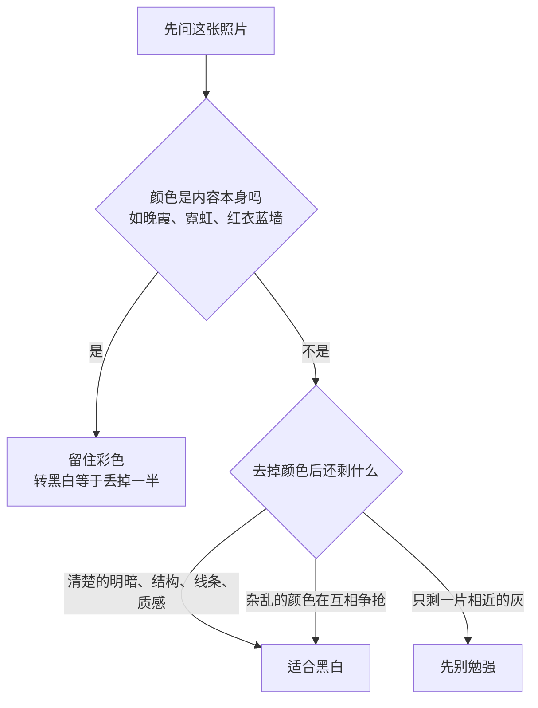
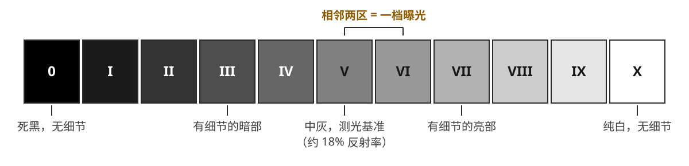

# 第 12 章 黑白

> 黑白并不是简单把彩色拿掉。它换了一套看世界的方法，让明暗、结构、纹理和时间感站到前面来。

---

## 黑白不是去掉颜色

*Walker Evans, "Coney Island Boardwalk", 1929。Evans 后来在大萧条时期为 FSA 拍美国南方的小镇、农场、门面和广告牌。他的许多重要照片都是黑白，并不只是因为年代限制，而是他主动让颜色退场，专注看木头、铁皮、字体、门窗和人的姿态。按快门之前，他已经在心里把颜色拿掉，只看明暗和结构。[图片来源与复用说明](image-credits.md#evans-boardwalk)*

---

## 黑白重新安排注意力

先要破除一个常见的误会：黑白不是把彩色照片的颜色抽掉之后剩下的东西。很多人以为，黑白无非是彩色照片的一个更朴素的版本，把饱和度那根滑块一路拉到零，剩下来的就是黑白了。可真照着做一遍就会发现，得到的往往只是一张发灰、发闷、没有重点的照片。原因并不难理解：这样得到的每一块灰，只是机械地对应着它原来那块颜色的亮度，画面里该重的地方没有重下去，该亮的地方也没有亮起来，整张照片于是平摊在中间那一段灰里，哪里都差不多。那不是黑白，只是失了色的彩色。真正的黑白，是一开始就用另一套标准去看世界，看的是明暗如何分布，结构如何搭起来，纹理是粗是细，而不是这里红、那里蓝。颜色退场之后，得有另一套东西顶上来撑住画面，而这套东西，恰恰是需要你在按快门之前就看见的。

并不是每一张照片都适合转成黑白。动手之前，先问自己一个很朴素的问题：在这张照片里，颜色究竟是在帮忙，还是在添乱？这个问题看似简单，却几乎决定了后面所有的判断，因为它逼你在动手之前就分清楚，眼前这张照片真正依靠的到底是什么。

如果画面里的颜色本来就乱，背景的招牌、路人的衣服、各色灯光和墙面在互相争抢，谁也压不住谁，那么转成黑白，很可能让整个画面顿时安静下来，那些原本靠鲜艳去抢眼的东西一并退到同一层灰里，注意力于是重新回到人和光身上。如果一张照片真正依靠的东西，本就是线条、几何、皱纹、石墙、树皮、强烈的光影或者人物的神情，那么去掉颜色，反而会让这些东西更集中、更有力量，因为再没有色彩在旁边分散目光。黑白还有一个额外的好处，它能抹掉一部分时代信息。彩色照片里，某种流行的色调、某一季的服装、某种屏幕特有的质感，都会悄悄替画面标上年份；黑白把这层信息一并滤掉，观众不至于一眼就被它们带走，照片因此更容易显出一种超出年代的样子。

可是反过来，如果颜色本身就是这张照片的内容，那么黑白就是一场灾难。夕阳的橙红，霓虹的斑斓，一朵花，一片秋叶，蓝墙前面那一件红衣服，它们能成立，靠的正是那点颜色，一旦转成黑白，等于当场丢掉一半。还有一类照片更脆弱：雾里的森林、阴天的海港、那些柔和的灰绿和灰蓝，有时正是靠着极其微妙的颜色关系才勉强成立的，明暗上它们本就相差无几，硬转黑白，就只会糊成一片没有层次的灰。新手常犯的一个错误，是把自己不会调色的照片转成黑白，看上去像是一种风格选择，其实是在躲一个没解决的问题。黑白应该来自主动的判断，而不该沦为调不好颜色时的退路。

从更根本的层面看，黑白之所以耐人琢磨，是因为它做的其实是一件抽象的事。彩色照片总想把世界照原样端到眼前，红是红，蓝是蓝，它离眼睛看见的现实只隔着一层；黑白却先把颜色这一整个维度抽掉，只留下影调的深浅、形状的轮廓、质感的粗细和线条的走向。画面从此少了一个变量，也就少了一条可以取巧的路：它没法再靠一抹惹眼的颜色抓住人，只能靠这几样更基本的东西把自己撑起来。黑白照片因此总带着一点从现实里抽身出来的意味，它不像是对眼前那一刻的复制，更像是对那一刻的一次归纳。

这层抽象，既是黑白的难处，也是它的长处。难，在于少了颜色，画面里能用来说话的手段一下子少了一样，凡是原先靠颜色撑着的东西，此刻都露了底；长，也恰恰在这里，因为当红蓝橙绿一并退场，剩下的影调、形状、质感和线条便被逼到台前，谁也躲不到颜色后面去。一张原本被艳色遮住的照片，转成黑白之后，它的结构是结实还是松散，会立刻现出原形。黑白并不宽容，它把一张照片真正的骨架摊开来给你看。

把前面这几条判断合到一处，就是在按快门或打开后期之前，心里可以默默走一遍的一条线索：

---

## 在现场预看灰度

学黑白，第一步是练习在现场就把颜色放到一边。走在街上看见一个画面，先别急着欣赏它的色彩，而要像做减法一样去看：最亮的地方在哪里，最暗的地方在哪里，这两者之间是一道硬边，还是慢慢过渡的软调。接着再看画面里有没有纹理，墙面、皱纹、衣料、树皮、旧门、被雨打湿的地面，这些东西在彩色里也许并不起眼，因为颜色抢在前头，把它们盖住了，可到了黑白里，颜色一退，它们反倒会一齐变重。最后问自己那个关键的问题：如果此刻把颜色抽掉，这张照片还剩下什么？如果剩下的是一组清楚的明暗关系和结实的结构，黑白就有机会；如果剩下的只是一堆差不多的灰，那就先别勉强。

这里其实藏着黑白最容易被低估的一处难点。很多人想当然地以为，去掉颜色总会让事情变简单，毕竟画面里少了一样东西要操心；实际情况恰恰相反：颜色一旦消失，画面也就失去了一个重要的区分手段。想象一颗红苹果搁在一丛绿叶上，在彩色里，一红一绿，对比强烈，主体一眼就跳出来，你甚至不必费心去构图，颜色自己就把苹果和叶子分开了。可红和绿虽是两种截然不同的颜色，明度却也许相差无几，一旦翻成灰，两者会落到几乎同一层灰度上，于是刚才那道清楚的界线就凭空消失了，苹果就这样陷进叶子里不见了。彩色里那条免费的捷径，到了黑白里被收走了。这正是黑白比彩色更依赖明暗的根本原因：它没有了颜色这条捷径，要把一样东西从背景里分出来，就只能靠亮和暗，靠明度上的落差，别无他法。

上面这段话若只停留在“红和绿的明度也许相差无几”这个印象上，还没有触到底；把它真正算一算，就能看清这层翻译里藏着什么。彩色转灰并不是把红、绿、蓝三个通道简单取平均，而是按人眼对不同波段的敏感度加权。Rec.709 常用下面这组系数来定义**线性光 RGB** 的相对亮度 \(Y\)：

\[ Y = 0.2126\,R + 0.7152\,G + 0.0722\,B \]

绿色的权重最高，蓝色最低，红色居中；这表达的是标准观察条件下的视觉敏感度。需要留心：公式里的 \(R\)、\(G\)、\(B\) 是先去除 sRGB 伽马后的线性值，不能把 0–255 的编码值直接代进去；实际软件还可能先做色彩管理，再用自己的黑白混合算法。因此，这条公式适合解释方向，不适合作为每个软件的逐像素验算器。它仍然说明了关键事实：两种色相即使看起来差别很大，也可能拥有相近亮度；抽掉色相之后，边界便会消失。

想通了这一点，也就想通了黑白后期里真正有力的那个旋钮长在哪里。不少人下意识地去拉明暗对比，以为把反差一提，主体自然会跳出来；可对比只会放大既有的明度差，当苹果和叶子本就落在几乎同一层灰上时，再大的对比也只是让它们一同变亮或一同变暗，没有差，就无从放大。真正管用的做法，是分头去调每一种颜色所对应的明度：把红压暗一档，把蓝沉到更深，让绿留在原处，那颗苹果便会从叶子里重新浮上来。这也是为什么后文会一再回到颜色通道，因为在黑白里，你调的虽然是灰，真正在动的却是颜色，而上面这条加权公式，正是这套从颜色通往灰的翻译最初依据的那一张表。

这里还藏着一层要紧的意思：Rec.709 那组权重只是默认值，不是命令。数字后期里有一个专门的工具，叫**通道混合器**（channel mixer，把红、绿、蓝三条通道按可以调节的权重重新混成一张灰度图），它做的事情，就是让你亲手改写这三个系数，重新决定每一种颜色究竟要变成多深的灰。默认那条公式把七成的分量给了绿，两成给红，蓝还不到一成，为的是让转出来的灰在整体亮度上尽量贴近人眼的感受；可一旦你把红的权重往上抬，画面里所有偏红的东西便一齐变亮，砖墙、屋顶、肤色都跟着提起来，而蓝天因为在红通道里本就很暗，会顺势沉下去。同一张彩色底片，给它不同的权重，能转出深浅完全不同的好几张黑白，它们说的其实不是同一句话。

通道混合器里，让权重总和大致维持不变通常能避免整体亮度大幅漂移，但这不是物理定律。有的软件会自动归一化，有的软件允许负权重来制造更强的分离。判断标准仍是画面：检查高光是否剪切、暗部噪声是否被放大、肤色与天空是否出现不自然的断层。

把常见的几样东西放进这套逻辑里，颜色到灰的这层翻译就具体了：

| 画面元素 | 主要落在哪条通道 | 默认转出的灰 | 提高红权重后 | 提高绿权重后 |
|---|---|---|---|---|
| 蓝天 | 蓝 | 中等偏亮 | 明显变暗 | 略微变暗 |
| 白云 | 三条通道都高 | 亮 | 依旧亮，与天拉开 | 依旧亮 |
| 砖墙、屋顶 | 红 | 中等 | 变亮 | 变暗 |
| 肤色 | 红、橙 | 中等偏亮 | 变亮、通透 | 变暗、发脏 |
| 绿叶、草地 | 绿 | 中等 | 变暗 | 变亮，层次变多 |

这张表和本章后面那张彩色滤镜的对照表，说的其实是同一件事，只是站的位置不同：这里是从后期的通道往回看，后面那张是从当年拧在镜头前的那片滤镜往前看。无论从哪一头进去，结论都一样，没有哪一种转法天生更对，只有你想让画面里的哪种颜色亮起来、又让哪种沉下去。

!!! example "案例推演：蓝天下的红砖钟楼"

    彩色里，这张照片靠红砖与蓝天的对比成立；按默认权重转成黑白，两者却落进相近的中灰，钟楼整个陷进天空里。

    - 想让钟楼站出来：提高红通道、压低蓝通道，砖墙浮起，蓝天沉向墨色，白云被衬得像浮雕——等价于胶片时代拧上一片红滤镜。
    - 想让形状说话：反过来压红提蓝，钟楼沉成剪影，画面只剩轮廓与天空的几何。
    - 无论选哪版都要检查代价：被压深的天空正踩在红通道信噪比最差的一段上，放大看有没有泛起噪点和色带，必要时给天空单独补一道降噪。

    两版都成立。通道混合选的从来不是参数，而是这张照片究竟讲砖的质感，还是讲形状与天空的关系。

有一个朴素却管用的办法，是眯起眼睛看世界。眼睛一眯，颜色和细小的枝节会先退下去，剩下的亮块、暗块和大的形状便浮上来，这已经很接近黑白的观看方式了。相机也可以帮你，把取景设成黑白：Fujifilm 的 Acros，Sony、Canon、Leica 各自的黑白配置，都能让取景器里直接显示一个没有颜色的世界，你看见的当场就是最后那张照片大致的样子。稳妥的做法是同时记录 RAW 和黑白 JPEG：让 JPEG 帮你在现场判断，趁着还站在场景前面就看清颜色退掉之后画面立不立得住，让 RAW 把彩色信息完整地留到回家以后，好在电脑前从容地细调。

也正因为少了颜色这条退路，黑白比彩色更依赖光。在彩色里，颜色有时能替平淡的光撑上一会儿，一片红墙、一件蓝衣服，本身就足够吸引眼睛，哪怕光平得毫无起伏；黑白把这条路彻底关掉，画面里就只剩明暗、形状和肌理这几样东西可用。光一平，这几样都立不起来，黑白照片很容易整个瘫成一片灰。有意思的是，许多在彩色里嫌太硬、太冲的光，搬到黑白里反而正好用得上：正午的直射，窗边一道生硬的侧光，逆光在轮廓上勾出的那条亮边，在彩色里也许会显得刺眼，可到了黑白里，它们都能把皱纹、墙面和人物的骨架清清楚楚地刻出来。所以拍黑白时，不要只顾着找柔和讨喜的光，更要主动去找落差。侧光、逆光、从门缝里挤进来的一道光、阴影和亮处紧贴在一起的那条边界，都会给黑白撑起一副骨架。

---

## 用分区组织影调

早在第 3 章讲曝光时，测光这件事就已经借分区曝光的思路铺过一遍；到了黑白，它不再只是曝光的辅助，而几乎就成了照片本身的骨架。Ansel Adams 与 Fred Archer 共同提出的分区曝光系统，把从纯黑到纯白的灰度切成许多层。你不一定要把它整套背下来，但值得理解它背后那个意思：一张黑白照片，绝不只是“亮一点”和“暗一点”那么粗糙，它需要你替画面里的每一块决定归属，哪些地方该黑到彻底没有细节，哪些地方保留住暗部的质感，哪些地方落在中灰，哪些地方亮到接近纯白。这其实是一种分配的功夫：同样一堆灰，摆布得当，画面就有秩序、有轻重；摆布不当，就挤成一团，谁也压不住谁。会不会做这种分配，几乎就是黑白拍得好不好的分界。

既然提到了分区，不妨把这套语言完整地摊开看一遍，它其实并不深奥。亚当斯的分区系统，把画面里从纯黑到纯白的整段明暗，切成 0 到 X 共十一个区，相邻的两个区之间恰好相差一档曝光，而正中央的第 V 区，就是那块 18% 反射率的中性灰，也正是测光表默认对准的地方（严格说测光表的校准点略低于 18%，差着约半档，第 3 章的注脚交代过，这里照传统按 18% 说）。

| 区 | 含义 |
|---|---|
| 0 | 纯黑，没有细节 |
| III | 有细节的暗部 |
| V | 中性灰（18% 反射率） |
| VII | 有细节的亮部（如白衬衫的褶皱） |
| X | 纯白，没有细节 |

这张表看着简单，真正的分量却在于它给了“曝光”一种全新的说法。没有分区的时候，曝光只是相机上的一个数字，或明或暗，含糊得很；有了分区，曝光就变成一句可以说出口的话：我要让这块被太阳晒白的石头落在第 VII 区，让它足够亮，却仍旧留得住表面的纹理；我要让阴影里那棵树落在第 III 区，让它沉下去，可暗部依然看得见枝叶。把画面里每一块该落到第几区都想清楚，再倒推该给多少曝光、显影时又该如何收放，测光和显影便被一根线牢牢串在了一起。分区系统真正要紧的地方，从来不在那十一个格子本身，而在于它逼着你在按下快门之前，就用这种语言把整个画面的明暗一块一块地安顿好。

*原创示意图：从第 0 区的纯黑到第 X 区的纯白，相邻两区相差一档曝光；第 V 区就是测光表默认还原的中灰。[图片来源与复用说明](image-credits.md#zone-system)*

这套语言真正上手，往往是从一个反常的小实验开始的：你拿测光表对准一片白雪，照它给的读数去曝光，冲出来的雪不是白的，而是一团灰。测光表并不认得什么是白、什么是黑，它被设定成把所测的一切都还原到第 V 区那块 18% 的中灰——对着雪测，它把雪当中灰；对着煤堆测，它照样把煤堆抬成中灰。分区系统的第一步，就是不再被它牵着走，而是主动**置位**（placement，把某块影调有意安排到你要的那一区）：你挑定画面里一处要紧的暗部，决定让它落在第 III 区那种“有细节的暗”，于是从测光读数往下收两档曝光，把它按在那儿。这一处一旦钉死，画面里其余各块便顺着自己与它的真实反差，各自**落位**，落进相应的区去。

置位靠的是曝光，可其余影调落下来之后，最亮那头未必恰好停在你要的位置，这就轮到显影。分区系统那句被反复引用的口诀正是说这件事：**曝光定暗部，显影定亮部**。负片有个脾气——暗部的密度几乎只认曝光，你当初少给两档光，暗部就沉在那里，事后再冲也提不太回来；亮部的密度却随显影时间伸缩，多显一会儿，高光就更厚、反差就更大。于是碰上灰蒙蒙、反差寡淡的阴天，你照常置位暗部，再刻意延长显影，把亮部往上顶，硬把反差撑开，这叫增显，记作 N+1；反过来遇上烈日下刺眼的高反差，就缩短显影，把亮部压回来，免得白到失去细节，这叫减显，记作 N-1。一次曝光配一种显影，等于替这一张底片单独定制了一条灰阶。

这套办法在大画幅上最称手，因为每张底片都是独立的一张，可以一张一种显影；到了一整卷 35mm，三十几张共用一次冲洗，就没法再对单张精打细算。数码其实把这套逻辑原封接了过来，只换了工具：曝光时照看两端别越界——这正是数码里直方图替你盯着的事——回到电脑前，再用曲线和影调滑块，把当年靠延长或缩短显影去伸缩的那段亮部，重新分配一遍。落到手上的动作，第 3 章给过现成的翻译：点测你想安顿的那一块，按“想让它落在第几区”拨曝光补偿，一区一档。但有一处方向性的差别必须记牢：负片怕欠不怕过，暗部只认曝光，所以胶片的口诀是为暗部置位、宁多给光；数码恰恰相反，高光一旦溢出就再也找不回来，暗部反倒还能提，所以数码的“置位”，更多是替最亮的那一块置位——先钉住高光该落的区，让暗部顺势落下去，必要时后期再提。同一套分区的语言，胶片从暗部说起，数码从高光说起，方向对调了，可那个先替一端定生死、再回头收拾另一端的次序，一分没动。

一种常见而有力的黑白处理，会让画面拥有明确的黑场、白场和连续中间灰；初学者若只是机械去色，确实容易让所有东西挤在相近的中灰里，显得混浊。但这不是要求每张照片都必须同时出现纯黑和纯白：高调、低调、雾景、极简与刻意压窄影调的作品，都可能主动放弃其中一端。真正要检查的是，灰阶范围来自明确选择，还是因为没有设定影调关系而偶然发灰。

在这段灰阶上，怎么分配，就形成了不同的反差风格。高反差的黑白像一记重锤，黑和白直接撞在一起，中间灰很少，画面因此显得刚硬、直接、不留余地。William Klein 拍纽约，森山大道拍新宿，都把街头推到这种强度，颗粒、模糊、招牌、人脸和影子全挤在一处，逼视着你。它很适合戏剧性的街头、人像和观念性的作品，那种扑面而来的力量正是它的长处；可也正因为力道太满，要是一整组照片全都这么冲，看的人很快就会疲劳，再强的冲击力反复用下去也会变钝。中反差是最常用、也最耐看的一条路：黑白两端都在，中间灰又足够丰富，画面因此既立得住，又有回旋的余地。Cartier-Bresson 的街头，Adams 的风光，Edward Weston 的静物与人体，都很看重这中间的层次；它未必第一眼最刺激，却经得起长时间反复地看，因为可看的东西是慢慢释放出来的。低反差则更柔，黑和白都不走极端，整个画面在灰里缓缓过渡。杉本博司的海景，Michael Kenna 的雪原与湖面，都靠这种压得很轻的灰调，让时间仿佛慢了下来。要说清楚的是，低反差绝不等于没拍好，它只是把力气收了起来；正因为收着，它对画面本身的结构要求反而更高，一旦结构一弱，没有了强烈明暗替它兜底，照片就会散掉。

反差说的是明暗之间拉开多远，可另有一个和它容易混淆、其实完全不同的说法，叫**高调**与**低调**（high-key / low-key，指整张照片的影调整体是偏亮还是偏暗）。反差管的是黑白两端相距多远，高低调管的却是整幅画面的分量究竟压在明的一侧还是暗的一侧。这两者各说各的：一张照片可以既是高调又是低反差，也可以既是低调又是高反差，彼此并不冲突。

高调的照片，大部分影调都落在中灰以上，画面明亮、通透、干净，暗的地方即便有，也只是轻轻一点。它天生带着一种轻盈、柔和、不设防的情绪，常被用在时装、美妆、母婴这类想要显得纯净明快的题材上，白背景前的高调人像尤其常见，皮肤被光照得均匀，仿佛连瑕疵都被冲淡了。高调的难处在于它离过曝只有一线之隔，稍不留神，最亮的地方就整片糊成死白，什么细节都不剩；所以它真正考验的，是能不能把最亮处稳稳地停在纯白之下那一点点的位置上。

低调则恰好相反，大部分影调沉在中灰以下，画面被暗色主导，光只从很小的一块地方透进来，把主体从黑暗里托出来。这种调子天然显得深沉、神秘、庄重，甚至带一点危险，电影里的**黑色电影**（film noir，四十年代前后那一类布光幽暗、气氛压抑的犯罪片）就是靠低调的布光，把悬疑和不安压进每一个镜头；再往前追，它接的是伦勃朗、卡拉瓦乔那一路明暗对照的传统，让一束光在大片黑暗里雕出一张脸。低调的难处则在另一头：暗部不能一黑到底、糊成没有细节的一团，你得让阴影沉得下去，又还要在里面留住若隐若现的东西。

---

## 三条黑白路径

技术上，通往黑白大致有三条路，各有各的用处，也各自适合不同的人和不同的目的。一条把你按在现场，逼你当场就用黑白的眼睛去看；一条把最大的余地留到回家以后，让你在电脑前慢慢分配每一种颜色对应的灰；还有一条索性改变你按快门的节奏，让每一次按下都变得郑重。它们并不彼此排斥，很多人是同时在走，只是在不同的阶段各取所需。

第一条是相机直接出黑白，它尤其适合用来训练观看，因为你在取景器里看到的，当场就是黑白，没有一点延迟。这样做的好处并不在于省去后期，而在于让你在现场就明白，颜色退掉以后，画面究竟还剩下什么。街上一个穿红衣服的人，在彩色取景器里格外醒目，一眼就抓住你；可切成黑白，取景器会立刻告诉你一个残酷的事实：假如红色变成灰，这个人还够不够亮，能不能和背景分开，还是会像那颗苹果一样陷进去。这种即时的反馈，是纸上谈兵学不来的，因为它把判断和结果之间的那段时间差压到了零。

这条路的尽头，站着一类走到极端的机器：专用黑白数码相机，Leica M Monochrom、Pentax K-3 Mark III Monochrome 都是。它们干脆把传感器上那层红绿蓝滤色阵列整个拿掉，每个像素直接记录亮度，不再需要猜色的去马赛克运算，锐度和高感因此都实打实地占了便宜。可这一刀恰恰砍在本章讲的那个最有力的旋钮上：拍下的那一刻就已经是灰，颜色的信息压根没有被记录，通道混合从此永久失效——你再也不能回家把蓝天单独压暗、把肤色单独提亮，想控制颜色到灰的翻译，只剩下一条老路，把物理的彩色滤镜重新拧回镜头前面。这类机器是对“你调的是灰、动的却是颜色”最好的反证：一旦颜色真的没了，那个旋钮也跟着没了。买它的人图的正是这份破釜沉舟，但你要先想清楚，自己舍不舍得。

第二条是拍彩色 RAW，回家再转黑白，这是最灵活的一条路，因为你可以精细地控制，原本不同的颜色在黑白里各自变成多亮。蓝天可以被单独压暗，而白云依旧留亮，于是天和云之间那道界线就被重新拉了出来；人像里把红、橙通道稍稍提亮，皮肤就会显得更干净；绿叶、红墙、黄色的灯光，都能通过各自的通道被翻译成不同的灰度，你等于握着一整套把颜色翻成灰的开关。这其实是把胶片时代拧在镜头前的彩色滤镜，搬进了后期：当年一片红滤镜能把蓝天压黑、让白云跳出来，靠的是它挡住或放行某种颜色的光，如今一个通道滑块就做到了同样的事，而且事后随时可以反悔。这也正是为什么，哪怕你一心想拍黑白，最好还是保留 RAW：JPEG 黑白给你现场的判断，RAW 让你回到家还能从容地细调每一种颜色对应的灰。

### 技术展开：胶片滤镜、暗房与颗粒

!!! note "阅读路径"

    下面保留胶片乳剂、滤镜补偿、显影、印相与颗粒的技术脉络，用来解释数字黑白工具从何而来。只使用数字流程的读者，可以先跳到“哪些题材适合黑白”。

滤镜这套手艺是怎么来的，值得先补一段历史，因为它解释了黑白摄影里一桩流传至今的悬案：为什么十九世纪照片里的天空，几乎清一色是一片惨白？答案不在天气，而在感光材料。最早的感光乳剂只对蓝光和紫外线敏感，红光橙光落上去几乎不起反应——这种材料后来被叫作色盲片，稍晚改良出的正色片（orthochromatic）补上了对绿的感光，对红依然是瞎的。后果落在照片上处处可见：蓝天在底片上严重曝过了头，印出来自然白成一片，云彩全军覆没；红色的嘴唇、红砖墙被记成近乎黑色；早年人像里那些嘴唇发黑、面色阴沉的面孔，一半要归罪于乳剂的色盲。直到二十世纪初，全色片（panchromatic）才终于让乳剂对整段可见光都有了反应，每种颜色这才各得其灰。而滤镜的整套逻辑，正是踩在全色片这块地基上才成立的：材料既然对所有颜色都感光了，你才谈得上用一片有色玻璃去挑挑拣拣，决定放行谁、挡住谁。顺带一提，正色片有一样全色片羡慕不来的便利——它对红光既然是瞎的，暗房里就可以点着红灯操作，摄影师能亲眼看着影像在显影液里浮现；全色片一来，暗房从此只能摸黑。

既然说到把胶片时代的滤镜搬进了后期，不妨顺势把几种最常用的滤镜和它们各自的效果并在一处看。胶片摄影师会在镜头前拧上一片有色滤镜，它放行与自己同色的光，挡住与自己互补的光，于是同色被提亮、补色被压暗；到了数码，等价的做法就是在后期里提亮或压暗对应那种颜色的通道。原理是同一个，方向也是同一个，下面这张表把两者摆在了一起。

| 滤镜 / 加权的通道 | 变亮 | 变暗 | 常见用途 |
|---|---|---|---|
| 红 | 红、橙（肤色、砖） | 蓝（天空变很黑）、绿 | 压暗蓝天，出戏剧化的云 |
| 橙 | 肤色 | 蓝、部分绿 | 人像肤色通透 |
| 黄 | 暖色略提亮 | 蓝天轻压 | 最自然的天空压暗 |
| 绿 | 树叶、绿色 | 红、肤色 | 风光植被；但肤色会偏暗 |

读这张表，有两处最值得记在心里。一处是天空：从黄到橙再到红，压暗蓝天的力道一路加重，黄滤镜给的是最接近肉眼、也最不着痕迹的一档轻压，红滤镜则能把晴空压到近乎墨色，让白云像浮雕一样从背景里凸出来，风光照片里那种戏剧化的天，多半就是这样来的。另一处是肤色：红和橙会让皮肤显得通透而干净，因为人的肤色本就偏红偏橙，提亮这两路光等于替脸蒙上了一层柔光；绿滤镜却恰好相反，它压红提绿，草木因此在风光里愈发浓郁，可一旦拿去拍人，肤色便会连带着暗下来、脏起来。所以无论是选滤镜，还是调通道，从来没有哪一种天生更好，有的只是你究竟想让画面里的哪种颜色亮起来、又让哪种沉下去。

还有一件事是数码通道不会提醒你、可当年拧滤镜的人必须记着的：滤镜是要吃光的。它既然靠挡住一部分颜色的光来压暗对应的天空或草木，那被挡掉的光也就不再落到胶片上，整张照片都会跟着暗下去，得靠放慢快门或者开大光圈补回来。这份补偿并不小：一片淡黄滤镜大约要多给一档光，常用的红滤镜（如 Wratten #25）约要补三档，真正能把晴空压成近乎墨色的深红（#29），往往要补到四档上下。所以胶片时代选滤镜，从来不只是挑一种效果，也是在拿快门速度、景深和手持的稳当去交换它——想压暗蓝天，就得接受快门慢下来三档，要么把 ISO 或光圈往回找。数码后期把这笔账免了：你在通道里压暗蓝天，并不损失一丝进光，这算是这套手艺搬进后期之后白得的一点便宜。

第三条是胶片黑白，Tri-X、HP5、T-Max，各有颗粒、响应曲线和冲洗生态。Tri-X 400 常被用于街头与纪实，HP5 Plus 400 有丰富的推片资料，T-Max 与 Delta 系列则以较细颗粒见长；具体反差和可用宽容度还会被曝光、显影剂、稀释比例、温度、时间以及扫描或印相共同改变。XP2 Super 虽是黑白影像，却使用 C-41 工艺；这让它有机会交给提供 C-41 服务的实验室，但不等于每一家门店都接收或按黑白方式扫描，送洗前仍要确认。自冲需要显影罐、量具和合适的装片暗袋或全黑空间，也要按药液说明做好通风、手套、存放和废液处置。

这里说的“特性曲线”，几乎就是一种胶片的身份证。把曝光量的对数做横轴、显影后的密度做纵轴，常会看到趾部、近似直线段和肩部；它们共同影响暗部建立、反差和高光过渡。传统立方晶体乳剂与 T-Max、Delta 一类扁平晶体乳剂，在颗粒外观、解析力与冲洗响应上会有差异，但不能仅凭“传统”或“T 粒子”就断言谁的宽容度更大。所谓推片，是按更高的曝光指数拍摄并配合延长或加强显影；它通常提高中高调密度与反差，却不能把曝光时没有记录到的阴影细节重新变出来。

胶片慢，贵，也麻烦，但它会实实在在地改变你按快门的节奏，因为每一张都要付出成本，你不可能像数码那样漫无节制地按下去。你看不到回放，只能在按下去之前就把事情想清楚：光够不够，焦点落在哪里，这一张到底值不值得拍。胶片当然不是通往好照片的捷径，一卷拍完也可能一张不成；可它确实有本事逼一个人慢下来，把原本挥霍掉的注意力重新收回到取景器里。

无论走哪条路，黑白后期的核心都在一件事上：分配黑、白和中间灰，任何预设最多只能给你一个起点，替不了你做真正的判断。先设黑场，让最暗的地方真正沉到底；再设白场，让最亮的地方有一个落点。不要害怕丢掉少量细节，纯黑和纯白本来就是黑白语言的一部分，不是失误，正是它们把画面的两端钉住。接下来，用颜色通道去控制灰度，这一步最见功夫。黑白看似没有颜色，可原片里的颜色恰恰决定了转出来的每一块亮暗，你调的虽是灰，动的却是颜色；会不会用通道，是黑白后期能不能做细的分水岭。颗粒也可以适量加一点，数码黑白默认太过平滑，滑得有些不真实，添一点颗粒能让画面有密度、有实感，街头、人像和弱光尤其吃这一套。黑白同样可以有冷暖倾向，冷调更清峻，暖调则像旧纸或者银盐照片。这层倾向在暗房时代有个正式的名字，叫调色（toning）：把印好的照片再浸进一缸化学药液，让影像里的银起一次反应。硒调是其中最讲究的一种，轻则只把黑场压得更深、顺带大幅延长照片的保存年限，重则给暗部染上一层紫褐的冷；硫化调（俗称的棕褐色、sepia）则把整张照片推向暖棕，老照片那股旧纸的颜色，多半就是它。数码里的分离色调工具，本质上是在模拟这缸药水，给高光和阴影各配一点冷暖，第 13 章讲调色时还会遇到它。只是无论冷暖，在同一组照片里最好保持一致，别一张冷、一张暖，一张颗粒粗得像砂纸、一张又干净得像塑料，否则一组照片看上去就像出自好几双手。

把这一整套工序连起来看，数字黑白从来不是“去饱和”三个字能说尽的：先用黑场和白场钉住两端，再用通道决定每一种颜色的深浅，用对比调整画面整体的软硬，到这里还差最后一道最费工夫的手艺，叫**局部加减光**（dodge & burn，把画面的某一小块单独提亮或压暗）。这道工序原本生在暗房里：印相时，用一小片纸板挡住投影的一角，那块地方接到的光少，冲出来便更亮，这叫减光；反过来，只给某一处多曝一会儿，那一块就更暗，这叫加深。数字后期把这套动作原样搬了过来，你可以只把一个人的脸提亮半档，把一角过分抢眼的亮墙压暗一点，一点一点地把观众的目光往你想要的地方引。

黑白大师大多是加减光的好手。Ansel Adams 那张著名的《月升》（Moonrise, Hernandez, New Mexico），最终印出来的天空之所以那样浓黑、沉静，靠的正是印相时对天空反复的加深，同一张底片落到不同人手里，能印出深浅迥异的照片。W. Eugene Smith 更是出了名地肯为一张照片在暗房里耗上一整天，一遍遍地推敲每一处的明暗。这里面的道理其实很朴素：黑白照片不是从相机里一次成型的，它是在暗部与亮部之间被一点一点安排出来的，最后那层说服力，往往就藏在这些不动声色的局部调整里。

说到暗房，还得补上分区系统被本章漏到现在的第三段。前面讲了“曝光定暗部，显影定亮部”，可 Adams 那套流程其实是三段：曝光、显影之后，还有印相，反差在纸上还能再控一次。传统黑白相纸分号数，零号纸软、反差低，四五号纸硬、反差高，同一张底片换一号纸，就是另一张照片；后来更通行的多级相纸（multigrade paper），靠在放大机上换滤色片，让同一张纸给出从软到硬的整段反差，甚至可以在一张照片里分区域用不同的反差来印。纸基也分两路：树脂涂塑的 RC 纸冲洗快、平整、适合练手，纯纸基的 Fiber 纸费工费时，但黑得更深、层次更沉，也更经得起岁月，严肃的收藏级印相几乎都用它。这一段到了数码时代同样有对应：普通彩色喷墨打印机印黑白，靠彩墨凑灰，稍不留神就偏色；讲究的做法是用带多种灰阶墨的照片打印机，让黑白由真正的灰墨印出来。还有一件事印过的人都知道：屏幕上那张发光的黑白，和纸上那张靠反射的黑白，根本不是同一张照片——屏幕的黑可以黑到发光体熄灭，纸上的黑再深也深不过墨——所以认真的黑白，最后一关永远该在纸上验收。这一点第 13、14 章谈打印时还会回来。

再单独说说颗粒。前面提过，给数字黑白添一点颗粒能让过分光滑的画面重新有密度；可颗粒和噪声这两样东西常被混为一谈，来路其实完全不同，值得分清楚。胶片的颗粒，是感光层里那些银盐晶体显影之后留下的实体，晶体大小本就参差，随机地散在整幅画面上，于是颗粒看着有一种毛茸茸的、有机的质地。感光度越高的黑白片，晶体越大，颗粒也越明显，Tri-X、HP5 这些经典的高感黑白片，那股略显粗粝的颗粒几乎成了它们的签名，很多人拍它们，要的正是这个。

数字噪声则是另一回事。它来自光子到达的统计涨落、传感器和读出电路，以及长曝光时更明显的暗电流与温度影响。它大致分成亮度起伏和色度斑点，最容易在采集曝光不足、后期又被提亮的区域显现。不能把高 ISO 单独写成噪声的原因：在光圈和快门相同的 RAW 拍摄里，提高模拟增益并没有让传感器少收或多收光，有些机身反而会降低后端读出噪声；真正糟糕的通常是为了快门或景深而减少进光，再把微弱信号放大。转成黑白后，彩色斑点不再显色，但明暗起伏仍会留下。通道混合器又可能把某条低信噪比通道连同噪声一起抬高，因此对天空等大面积平滑区域做剧烈通道调整时，应单独检查最终输出尺寸下的噪声和色带。

| | 胶片颗粒 | 数字噪声 |
|---|---|---|
| 来源 | 银盐晶体显影后留下的实体，大小本就参差 | 传感器读取信号时的误差与涨落 |
| 分布 | 随机分布，大小与形态受胶片和显影影响 | 在低采集曝光、提亮后的暗部和长曝光热噪声中更显眼；ISO 的影响取决于机身与拍摄条件 |
| 观感 | 毛茸茸、有机，更像一种质地 | 偏规整死板，彩色斑点尤其扎眼 |
| 态度 | 常被当作风格主动保留，甚至特意添加 | 通常想压掉，去色后剩下的明暗噪声可留作颗粒 |

所以颗粒未必就是缺陷。它有时是胶片留下的印记，有时是你主动铺上去的一层质感，让太过干净的数字画面重新有了呼吸；分清它和噪声的区别，你才不会一边费力压掉本可利用的颗粒，一边又把真正的噪声当成风格留在画面上。

---

## 哪些题材适合黑白

有些题材，几乎天生就适合黑白，街头是其中最典型的一个。街头的颜色常常是乱的，衣服、广告、招牌、车灯都在争抢注意力，谁也不肯让谁；一转黑白，这些干扰退下去，动作、光影和构图立刻清楚起来。Cartier-Bresson 长期用黑白拍街头，就是因为颜色会分他的心，把他从真正要紧的结构和时机上引开；Klein 和森山大道则把黑白街头推向另一个更粗粝的方向，让颗粒和晃动本身成了语言。你在街上练黑白，不妨先从光和形状入手，去找强光下的一道影子，白墙前经过的一个人，玻璃里的一段反射，地铁口涌出来的一束光，别一上来就指望事件本身有多精彩。黑白街头往往是这样发生的：先有光和形状在那里等着，画面的骨架已经搭好，再有人恰好走进去，把它填满。

人像同样适合黑白。肤色、衣服的颜色、背景的杂色统统退场之后，一张脸的结构、眼神、皱纹、骨骼和光位，才被真正看见，观众的目光再没有别处可去，只能落回这张脸上。Richard Avedon 在《In the American West》里，用一块白背景和黑白大画幅拍矿工、牛仔和工人，人被放进一个无处躲藏的空间，背景空得什么都没有，脸上每一道纹路都逃不掉。Irving Penn 拍各行各业的市井肖像，Peter Lindbergh 拍时装人像，走的也是同一条路，把颜色拿掉，让人本身站出来。不过黑白人像绝不是“去掉颜色”就能成立的，光位仍旧要准，甚至比彩色时更要紧：侧光会把脸的骨骼刻出来，正面的柔光会让皮肤显得平，逆光则只留下一圈轮廓。你想要一个什么样的人，就得先给他一束相应的光。

风光转黑白，则要格外看重明暗的结构。Adams 镜头里的山、云和雪，靠的全是灰阶的分配，一层山一个调子，彼此清清楚楚；Michael Kenna 拍雪地和湖面，又把黑白压得极轻，淡得像一幅水墨，靠的是另一端的克制。在数码后期里，红、橙通道能让蓝天变暗、白云变亮，效果很接近胶片时代拧上一片红滤镜。拍黑白风光时要有个心理准备：颜色漂亮不再能救你，一片夺目的晚霞在黑白里可能什么都不是，前景、中景和背景之间，必须在亮暗上自己分出层次。雪山、白云、深色的松林、幽暗的河谷，如果彼此之间没有清楚的灰度关系，各自的深浅拉不开，一转黑白就会糊成难分难解的一团。

还有一些题材，是历史与材质替它们选择了黑白。纪实摄影长期倚重黑白，因为它能减少颜色的诱惑，不让鲜艳的色彩把注意力引到别处，让事件、人物和处境更直接地扑到眼前。第 7 章讲过的 Hine 童工系列是最早的例证之一；W. Eugene Smith 1948 年那组《乡村医生》（Country Doctor），跟着科罗拉多小镇的一位全科医生拍了二十三天，疲惫的脸、深夜的出诊、手术台边垂下的手，全靠黑白的影调把这份沉重稳稳压住；Salgado 拍矿工与移民，也始终守着黑白，他说颜色会让人分心去看衣服的红蓝，而他要人看的是处境。不过要把话说全：这份“黑白等于严肃”的等式，如今已经松动了——Eggleston 之后，彩色早就进了美术馆，当代的纪实与新闻反而多用彩色，因为颜色本身也是事实的一部分。今天再选黑白拍纪实，就不再是行规使然，而得是你自己的判断：抽掉颜色，究竟让这件事更清楚了，还是只让照片更像“老照片”了。建筑黑白则更看几何，石头、木头、铁锈、混凝土和阴影，在黑白里都格外有力量，材质的粗糙和体块的厚重都会被放大出来；只是拍的时候要当心，垂直线稍微一歪就无所遁形，没有颜色替它遮掩，阴影落在哪里也变得比彩色时更要紧。彩色的建筑照片还能靠材质的颜色去吸引人，黑白的建筑照片，就只能靠线条和体块自己站住，多一分少一分都藏不住。

---

## 一致性比预设重要

一组黑白照片摆在一起，应该像同一个人用同一种判断做出来的，而不是东一张西一张凑起来的。这份统一，可以来自相近的反差，相近的色调，相近的颗粒，也可以来自相近的题材，只要有一条线把它们串在一起。当二十到五十张照片凑成一组时，单张的炫目反而没那么要紧了，观众不会再盯着某一张看，而会去看它们彼此之间的关系，去感觉你是不是自始至终用同一双眼睛在看。这份统一不是凭感觉就能达成的，有几个实打实的做法：让全组从同一个起点预设或同一种胶片模拟出发，黑场、颗粒量、冷暖倾向都定成同一套参数再逐张微调（第 13 章讲起点预设，正好用在这里）；导出之前，把整组缩成小图铺在同一屏上并排看一遍，哪一张的黑不够沉、哪一张的灰发闷，缩图里比全屏更一目了然；发现不齐的，回去把黑白场对齐，而不是迁就着放过。Kenna 那些跨越几十年的雪景之所以像一本书里的同一章，靠的正是这种近乎固执的一致。

练黑白的路上，有几件事值得一直记着。彩色未必就比黑白容易，黑白对结构和光的要求，因为少了颜色替它兜底，有时甚至更高。高 ISO 在彩色里常被当成瑕疵，在黑白里却可能摇身变成一种颗粒质感，同一样东西换了语境就换了身份。黑白确实能让一个平常的画面显出更强的形式感，可它救不了一张本来就没有内容的照片，形式感是加在内容之上的，不是用来替代内容的，别指望长期靠它来遮掩空洞。这种判断没有捷径，只能靠一次次在现场把颜色放下、又一次次回头验证换来。你要练的也不只是按下“转黑白”那个按钮，而是慢慢养出一种现场的判断：这张照片，去掉颜色以后，还剩不剩下结构、光和内容。等这种判断长到手上，你还没举起相机，心里往往就已经知道这一张该不该走黑白。

---

## 练习

把取景器切到黑白模式一周。每天选 3 张照片，晚上回看时写一句：这张为什么适合黑白。

找过去一年最满意的 10 张彩色照片，每张都认真转一次黑白。比较哪些变好，哪些变差，哪些几乎没有变化。

拍一张人像和一张蓝天白云。后期转黑白时分别调整各个颜色通道，观察皮肤、天空、云和衣服怎样改变灰度。

带 35mm 出门一天，相机设成黑白取景，只找强光影、几何、剪影和纹理。回家选 5 张，尽量让它们像一组。

用单一窗光或单灯拍一个朋友，全程黑白思维。拍完选 5 张，写下每张为什么不需要颜色。

---

下一章：[第 13 章 后期](13-postprocess.md)
