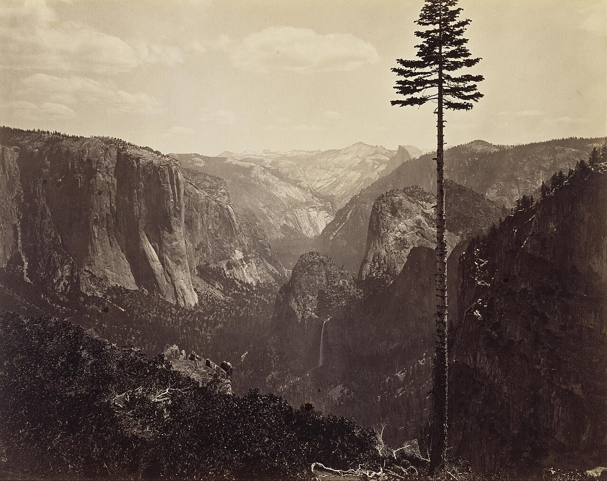

# 第 13 章 后期

> 后期不是把照片修漂亮一点。它是拍摄判断的延续，决定一张照片最后用怎样的亮暗、颜色和纸面气息出现。

---

Ansel Adams 在加州 Carmel 的暗房里工作了几十年。他拍一张底片可能只花半小时，冲印一张照片却可能花几个小时。他反复说过一个比喻：底片像乐谱，照片像演奏。同一张底片，他在 1948 年冲出一个版本，1962 年再冲一次，1980 年又冲一次，三张的灰度、反差和气息都不同。底片记录了那一刻的光，暗房里的他则在多年之后重新决定，这一刻应该怎样被看见。

数码后期并没有改变这件事的本质。滑块替代了药水和遮挡棒，屏幕替代了一部分暗房，但问题仍然一样：你要让这张照片成为什么样子？你是在顺着原片已经有的方向把它讲清楚，还是强行把它扭成另一种东西？后期最重要的判断，不在软件，而在这个问题。

---

*Carleton Watkins, *Yosemite Valley*, ca. 1865。Watkins 比 Adams 早很多年就把 Yosemite 拍成了美国风景想象的一部分。他用 18×22 英寸的湿版玻璃底片进山，每张底片都很重，拍完还要回暗房用蛋清相纸冲印。今天我们把这一切叫作前期和后期，在他那里却是一件完整的工作：去现场、承受重量、曝光、冲洗、印出来，再让照片进入公众视野。1864 年，Watkins 的照片帮助推动 Yosemite Grant 成立，风景因此不只是被看见，也被保护。 (Wikimedia Commons, 公有领域)*

---

后期在整条摄影工作里不是孤立的一步。你先看见，再拍下，再选片，然后才进入后期，最后输出到屏幕、纸张、书或展览墙。这里最容易被跳过的是选片。很多人拍完以后把一整组照片都导进软件，从第一张开始调，调到最后已经忘了自己为什么拍。更稳的顺序是先粗筛，再选出值得认真处理的照片。后期应该服务那些已经通过选择的片子，而不是替所有不成立的照片找借口。

动滑块之前，还要确认你看到的屏幕基本可靠。显示器如果偏蓝、偏暗，亮度又开得很高，你会在不知不觉里往反方向补偿，调出一批在别人屏幕上偏黄、偏亮的照片。最省事是定期用校色仪校准，退一步也要把显示器亮度固定在一个中等、不刺眼的水平，并且尽量在相似的环境光下修图。准备打印的照片还要做软打样，因为纸面通常比屏幕暗，对比也低。后期所有判断都站在“我看见的基本准”这个前提上，前提歪了，越认真越容易错。

软件只要选适合自己的就够了。Lightroom Classic 是最通用的照片管理和调色工具，适合大多数人。Capture One 的色彩和联机拍摄很好，棚拍、人像和商业工作常用。Photoshop 强在合成、复杂修复和精细局部，不必拿它处理每一张日常照片。DxO 的镜头校正和降噪有优势，Affinity Photo 适合不想订阅的人，Apple Photos 和 Snapseed 能完成很多轻量工作。工具价格和版本会变，但选择逻辑不会变：你需要的是稳定管理照片、快速选片、可靠调整 RAW，而不是为了显得正式就打开最复杂的软件。

---

后期有两种常见方向。第一种是顺着原片走。拍摄时的光本来就硬，后期可以让暗部更沉，让亮处更干净；颜色本来很克制，就不要忽然把饱和度拉得很高；构图本来干净，暗角、颗粒和局部加光都要谨慎。这样做不是保守，而是尊重照片原本的性格，让它从“差不多”变成“说清楚”。

第二种是给一组照片套上更明显的处理方式，比如模拟某种胶片、统一成偏冷的城市夜色、让整组人像都有柔和低反差，或者让街头照片都带粗颗粒和强黑场。这也可以成立，但前提是整组一致，而且照片本身已经有内容。一个固定预设用在 30 张照片上，观众会把它理解成作品的语气；一张照片一个调子，就会显得你还没决定自己要说什么。后期不能救一张构图、光线和内容都不成立的照片，它最多让问题变得更有装饰。

还要谈诚实。调整亮暗、色彩、局部明暗和裁剪，一般都属于摄影传统中长期存在的处理。压住天空、提亮脸、校正白平衡、让画面反差更合适，这些和暗房里的遮挡、加光并没有本质区别。可是增删画面内容就要谨慎。把一个碍眼的人抹掉、把飞鸟贴进天空、把两张照片拼成一个本不存在的瞬间，改变的不只是照片长什么样，而是改变了现场发生过什么。

题材越接近新闻、纪实和公共事实，这条线越要收紧。旅行照片里修掉一根电线，更多是个人趣味；报道摄影里挪掉一个物体，照片和摄影师的信誉都会被质疑。入门时可以记一个自检：你这一步是在让照片更接近当时你看见并感受到的样子，还是在制造一个当时根本不存在的场面？前者通常没问题，后者就要清楚告诉自己，这已经进入创作和合成的范围。

---

一个稳妥的后期顺序是：先裁剪和校正透视，再调全局亮暗，然后做局部调整，接着处理颜色，最后锐化、降噪和输出。先裁剪很重要，因为构图变了，亮暗和颜色的平衡也会变。你如果先把颜色调完，再裁掉画面三分之一，原来的判断往往已经不准了。

全局调整先看曝光。目标不是让整张平均变亮，而是让主体的亮度对。人像先看脸，风光先看最重要的山、云或水面，街头先看那个动作发生的位置。高光通常先处理，因为过亮的天空、窗户、皮肤反光会先刺眼。把高光压回来以后，再看阴影是否需要打开。阴影不要一口气拉得太多，暗部本来就应该有暗部，全部拉平会让照片像被清洗过。

白色色阶和黑色色阶负责最亮和最暗的落点，一张照片如果没有真正的黑，常常会发软；如果白场没有落点，也会闷。许多初学后期的人只动曝光、对比、高光和阴影，却忘了黑白场。结果是画面看起来亮度差不多对了，但没有力量。设黑场不是把所有暗部压死，而是给照片一个最低点；设白场也不是让亮部爆掉，而是让画面知道哪里是最亮的那一口气。

很多日常照片只靠基本面板就能完成大半。风光可以压高光、略开阴影、给一点白场和黑场，让云、地面和山体都有位置。人像通常更温和，皮肤不要被对比拉得太硬。街头和黑白可以让黑场更沉，让画面有骨架。数值只能当起点，每张照片都要回到主体、光线和画面内容上看。

局部调整用于把观众的眼睛轻轻带到该看的地方。径向蒙版可以让主体周围稍亮，或让边缘慢慢暗下去；线性渐变适合压天空、提亮前景；笔刷和 AI 蒙版可以单独处理脸、眼睛、天空、背景和衣服。局部调整最好克制，让人感觉画面本来就这样，而不是看出哪里被画了一圈。全局决定照片的基调，局部只负责整理注意力。

---

颜色处理要先问这张照片最重要的颜色是什么。人像里通常是皮肤，橙色通道稍微提亮、饱和度稍降，会让皮肤干净，但不能把人变成没有血色。皮肤最怕被整体饱和度拖着走，背景一鲜，脸也跟着橘；背景一冷，脸又容易发灰。所以人像调色最好先把皮肤稳住，再处理衣服和背景。

蓝天可以压暗蓝通道，让云更出来；秋叶可以稍微增强红黄；绿色最容易过头，许多草地和树叶如果太鲜，会让照片显得廉价，压一点反而更稳。城市夜景里，霓虹本身已经很饱和，后期再推整体饱和度，只会让颜色互相污染。更好的做法是先选主色，让它站出来，再把其他颜色稍微压暗或压灰。

Color Grading 可以给高光、中间调和阴影分别加一点色彩。常见的做法是高光偏暖、阴影偏冷，皮肤和灯光保留温度，暗部和背景退到蓝青里。复古照片常让高光偏黄，阴影偏紫或偏冷。冷峻的城市片可以整体偏蓝，黑场更深。无论哪一种，强度都要轻。颜色加得太重，照片会从“有气氛”变成“像滤镜”。

一组照片比单张更需要统一。你可以为街头、人像、风光各做一个自己的起点预设，它不必复杂，也不必命名得很玄。它只是你常用的黑场、对比、颜色和颗粒组合。每张照片从这个起点出发，再根据现场微调。这样做能节省时间，也能让一组照片看起来像出自同一种观看方式。

---

锐化和降噪放在后面。Lightroom 默认锐化适合许多场景，风光可以多一点，人像要少一点，尤其不要把皮肤锐得像砂纸。蒙版滑块很重要，它能让锐化更多作用在边缘，而不是天空、墙面和皮肤这种平滑区域。高 ISO 照片需要降噪，但不要把噪点全抹掉。保留一点颗粒，照片会有质地；过度降噪会让暗部像一块蜡。

输出时也要按用途来。发网页的照片可以缩到合适尺寸、用 sRGB、适度锐化。打印照片要看纸张、尺寸和观看距离，同一张照片印在亮面纸和哑光纸上完全不同。给作品集或书使用时，还要保持整组的明暗和颜色一致，不要一张亮、一张暗、一张饱和、一张灰。

---

几个常见错误值得反复避开。HDR 拉过头，会让天空、地面、阴影全部有细节，却没有自然的明暗起伏。现实里的光不是每个角落都同样清楚，暗处本来就应该让人看不完。饱和度拉过头，肤色变脏，绿色和蓝色先失真，照片第一眼热闹，第二眼就累。

磨皮过度，脸会失去骨骼和毛孔，表情也跟着变假。真正好的人像修饰，是让皮肤里不必要的瑕疵退下去，但仍然保留这个人原来的结构。锐化过度，边缘出现白边，照片像被硬描过。暗角过度，四周黑得明显，观众一下就看出这是后期手法。白平衡拉到极端，也常会把一张有现场氛围的照片变成统一色罩。修完以后，把照片放小看一眼，如果第一感觉是“这张被处理过”，通常就该往回收。

后期审美要靠看东西来养。只看手机上的社交平台不够，因为那里压缩、锐化、提亮都太重，照片滑过去太快。多看摄影画册和展览，看油墨怎样落在纸上，看暗部从灰过渡到黑，看一组照片怎样保持同一种反差和颜色。也可以把自己最满意的十张照片放在一起，查看它们的共同点：白平衡偏冷还是偏暖，反差高还是低，黑场重不重，饱和度多不多。这些共同点常常就是你的自然偏好。

还可以做极端练习。拿一张照片调出很冷、很暖、高反差、低反差、高饱和、低饱和几个版本，并排看，不是为了最后使用这些版本，而是为了知道这张照片能承受多大变化。限制自己一周只用基本面板，不用 HSL、不用 Color Grading、不用预设，也很有帮助。你会发现，许多照片真正需要的不是花哨处理，而是一个准确的曝光、一个稳的黑场和一点点局部整理。

---

## 练习

找一张 RAW，只用基本面板的曝光、对比、高光、阴影、白色和黑色，调到你满意为止。不要用局部、HSL 和预设。连续做七天。

同一张照片做五个版本：偏冷、偏暖、高反差、低反差、接近原片。并排看，写下哪个最接近你当时的感受。

选出你最满意的 5 张照片，查看它们的共同后期特征。把这些设置保存成一个自己的起点预设，接下来一个月都从它开始，再逐张微调。

找一张五年前不满意的照片，今天重新调一次。第二天不看前一天版本，再调一次。连续十天后并排比较，判断自己真正想要的是哪一种。

---

下一章：[第 14 章 编辑与持续](14-edit-and-sustain.md)
