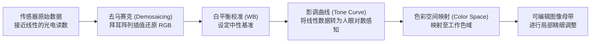

# 第 13 章 后期思维与数字暗房

> 后期并非单纯的画面修饰。它是拍摄过程的延续——通过明暗影调的梳理、色彩关系的校准与输出格式的控制，将拍摄时的意图完整地呈现出来。

---

## 后期不是数字时代的发明

安塞尔·亚当斯（Ansel Adams）的大半生都与暗房工作紧密相连。

他在山野间捕捉一帧底片，或许只需等待合适的光线；然而回到暗房冲印同一张照片，往往需要花费许多时间在放大机下细致推敲遮挡与加光。

亚当斯曾有著名的譬喻：“**底片是乐谱，照片是演奏。**”

乐谱记录了基本的音符与旋律；同一份乐谱，由不同的演奏家在不同心境下演奏，节奏与力度皆会展现出不同的特点。

照片亦是如此：他拍摄于 1941 年的名作《新墨西哥州埃尔南德斯的月升》（*Moonrise, Hernandez*），在四十年代、六十年代以及晚年多次冲印，不同时期印出的版本在天空的暗度与地面的层次上皆有细微演变。

底片记录下的是现场的光线数据；而在暗房中，创作者通过影调的调整，进一步确立画面想传达的情绪与重点。

在数码时代，虽然暗房药水与相纸换成了屏幕与软件滑块，调整过程也变得更加直观可逆；但核心的思考依然相同：**如何通过影调与色彩的调整，让画面自然地表达出拍摄时的感受。**

---

### 从暗房延续到软件

*Carleton Watkins, "Yosemite Valley from Inspiration Point", ca. 1865。Watkins 比 Adams 早很多年就把 Yosemite 拍成了美国风景想象的一部分。他用 18×22 英寸的湿版玻璃底片进山，每张底片都很重，拍完还要回暗房用蛋清相纸冲印。今天我们把这一切叫作前期和后期，在他那里却是一件完整的工作：去现场、承受重量、曝光、冲洗、印出来，再让照片进入公众视野。1864 年，Watkins 的照片帮助推动 Yosemite Grant 成立，风景因此不只是被看见，也被保护。[图片来源与复用说明](image-credits.md#watkins-yosemite)*

---

## 后期属于拍摄流程

在摄影创作中，后期是完整工作流的一部分：**前期观察 → 现场拍摄 → 选片挑选 → 数字暗房处理 → 屏幕与打印输出**。

在这一流程中，**选片（Culling）** 是至关重要的一步。与其将每次拍摄的数百张 RAW 全部粗略调一遍，不如先通过快速筛选，挑出构图完整、主体明确的照片集中进行精修。

在开始调色之前，**显示设备的准确性** 是基础保障：
*   **屏幕校色**：使用校色仪校准显示器的白点（网络用途常用 D65，印刷对齐 D50）与亮度（室内工作通常设为 100–120 cd/m²），避免因屏幕本身偏色或过亮导致调色失准；
*   **色彩配置文件（ICC Profile）**：确保系统与修图软件正确加载显示器的色彩配置文件；
*   **软打样（Soft Proofing）**：在打印输出前，在软件中加载目标相纸的 ICC 文件，预先观察纸张对暗部与色彩的表现。

| 核心参数 | 常用参考设置 | 作用说明 |
|---|---|---|
| **屏幕白点** | D65（屏幕流媒体）/ D50（精细印刷） | 统一白平衡标准，减少视觉误差 |
| **伽马曲线** | Gamma 2.2 | 确立符合人眼视觉的灰阶过渡 |
| **屏幕亮度** | 100 至 120 cd/m² | 避免屏幕过亮导致调出的成片偏暗 |
| **纸张软打样** | 加载打印纸张的专属 ICC 文件 | 预先观察相纸对黑场与色域的反射限制 |

---

## RAW、位深与显影管线

### RAW 与 JPEG 的区别

*   **RAW 格式**：保存的是传感器光电转换后的原始数据，通常具备 14-bit 至 16-bit 的高位深，保留了完整的白平衡调整空间与宽广的高光阴影动态范围；
*   **JPEG 格式**：由机内算法完成去马赛克、白平衡固化、对比度渲染后压缩生成的 8-bit 图像，文件体积小，但后期大幅调整时容易产生色彩断层。

| 颜色位深 | 每通道阶梯数 | 特点与应用 |
|---|---|---|
| **8-bit** | 256 级灰阶 | 最终网络交付与常规显示，不宜深度调色 |
| **14-bit** | 16,384 级阶梯 | 主流无反相机 RAW 标准，宽容度高 |
| **16-bit** | 65,536 级阶梯 | 专业母带与精细修图工作空间 |

---

### RAW 的处理过程

当在修图软件中打开 RAW 文件时，底层通常经过以下处理管线：

1.  **去马赛克（Demosaicing）**：根据拜耳阵列中红、绿、蓝像素的排列，通过算法推算补齐每个像素完整的 RGB 颜色；
2.  **非破坏性编辑（Non-Destructive Editing）**：所有的调整参数均作为指令保存在 XMP 文件或数据库中，原始 RAW 数据不受修改，随时可以重置或调整。

---

## 两种后期方向与伦理边界

后期的处理深度需结合拍摄题材与用途：

**1. 纪实与新闻摄影**：遵循客观真实的原则。允许进行全局曝光、白平衡、适度反差与裁剪调整；严禁添加、消除或移动画面中的物理元素，避免误导观者对事实的认知。

**2. 艺术与商业人像摄影**：允许根据创作需要进行更深入的影调塑造、色彩重构与细节修饰。

无论哪种取向，适度的克制通常是保持画面自然的关键。过度拉升饱和度、过度提亮暗部导致画面发灰、或是磨皮过度抹去皮肤纹理，往往会削弱照片原有的质感。

---

## 完整的后期工作流

一个清晰、高效的数字暗房流程通常按以下步骤进行：

1.  **构图校正与水平校准**：先处理画面的水平、倾斜与二次裁剪。
2.  **基础影调与白平衡**：校正色温与色调，调整整体曝光，设置合理的高光与暗部端点。
3.  **曲线与对比度**：利用 RGB 曲线微调画面的明暗过渡与反差。
4.  **色彩调整（HSL）**：分别微调核心色彩的色相、饱和度与明度，突出主色，淡化干扰色。
5.  **局部调整（蒙版与画笔）**：使用径向渐变或线性渐变提亮主体面部或压暗杂乱边缘，引导视觉焦点。
6.  **锐化与降噪**：按需进行适度降噪与边缘锐化，保持细节自然。
7.  **按需导出**：网络发布导出为 sRGB、8-bit JPEG；打印输出导出为 Adobe RGB 或 16-bit TIFF。

---

## 打印与输出准备

将数字影像转化为纸质实体，需要注意分辨率与缩放：

*   **打印分辨率**：常规画册与展览照片的标准打印分辨率为 **300 PPI**（每英寸像素数）。
*   **像素尺寸计算**：打印宽度（英寸）\(\times 300 = \) 所需的水平像素数。例如输出一张 A4 尺寸照片（约 \(8.3 \times 11.7\) 英寸），约需 \(2490 \times 3510\) 像素（约 870 万像素）。现代 2400 万像素相机足以满足大多数画册与展出尺寸的需求。

---

## 练习

挑选一张大光比下拍摄的 RAW 照片，在软件中分别尝试：仅用阴影/高光滑块调整，与配合曲线工具进行微调，对比两种方式在保持中间调自然度上的差异。

针对同一张人像照片，练习使用 HSL 工具仅微调橙色与红色通道的明度与饱和度，观察在不影响背景色彩的前提下改善人物肤色的效果。

选择一张自己满意的成片，尝试在软件中开启软打样模式（选择某种艺术相纸的 ICC 配置文件），观察屏幕显示与纸张模拟之间的黑场及色彩差异。

---

下一章：[第 14 章 编辑、组照与长期项目](14-edit-and-sustain.md)
