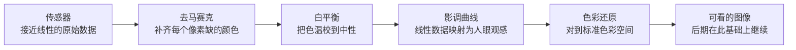
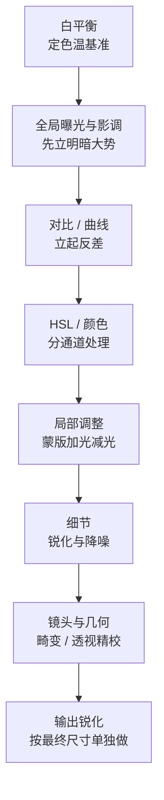

# 第 13 章 后期

> 后期并不是把照片修得漂亮一点。它接着拍摄时的那个判断往下走，决定一张照片最后究竟以怎样的亮暗、颜色和纸面气息出现在别人面前。

---

Ansel Adams 在加州 Carmel 的暗房里工作了几十年。有一个对比常被人提起：他拍一张底片，可能只花上半个小时，可到了暗房里冲印同一张照片，却往往要耗去好几个小时。也就是说，真正漫长的那一部分，从来不在按下快门的现场，而在事后一遍遍地重印。他自己反复说过一个比喻：底片像乐谱，照片像演奏。乐谱一旦写定就不再更改，可同一份谱子，不同的人、不同的心境弹出来，快慢轻重全然不同。照片也是如此：同一张底片，他在 1948 年冲出一个版本，1962 年再冲一次，1980 年又冲一次，三张的灰度、反差和气息各不相同。归根结底，底片记录下的只是那一刻落进镜头的光，而暗房里的他，则在许多年之后重新决定，这一刻究竟应该以怎样的面貌被人看见。

到了数码时代，后期换了一套工具，可这件事的本质并没有随之改变。滑块替代了药水和遮挡棒，屏幕替代了一部分暗房，操作起来干净、快捷，也可以随时回退，然而摆在你面前的问题仍旧是同一个：你究竟要让这张照片成为什么样子？换句话说，你是在顺着原片本来就已经有的方向，把它一点点讲清楚，还是打算强行把它扭成另外一种东西？后期里最要紧的那个判断，从来不在软件，也不在某一个滑块推到多少，而恰恰落在这个问题上。

---

*Carleton Watkins, "Yosemite Valley", ca. 1865。Watkins 比 Adams 早很多年就把 Yosemite 拍成了美国风景想象的一部分。他用 18×22 英寸的湿版玻璃底片进山，每张底片都很重，拍完还要回暗房用蛋清相纸冲印。今天我们把这一切叫作前期和后期，在他那里却是一件完整的工作：去现场、承受重量、曝光、冲洗、印出来，再让照片进入公众视野。1864 年，Watkins 的照片帮助推动 Yosemite Grant 成立，风景因此不只是被看见，也被保护。 (Wikimedia Commons, 公有领域)*

---

后期在整条摄影工作里，并不是一个可以单独拎出来的孤立环节。你先看见，再拍下，再选片，然后才轮到后期，最后把照片输出到屏幕、纸张、书或者展览墙上。在这一串环节里，最容易被人一带而过的，恰恰是选片。很多人拍完以后，习惯把一整组照片一并导进软件，从第一张开始逐一往下调，调到最后，往往已经忘了自己当初为什么要拍这一组。更稳妥的顺序，是先做一遍粗筛，把明显不成立的先搁到一边，再从剩下的里面挑出真正值得认真处理的那几张。也就是说，后期更适合去服务那些已经通过了选择的片子，而不是反过来，替所有本就不成立的照片一张张找借口。

在动第一个滑块之前，还有一件事得先确认，那就是你眼前这块屏幕是不是基本可靠。道理并不难理解：显示器如果本身偏蓝、偏暗，亮度又开得很高，你就会在不知不觉之间往相反的方向去补偿，最后调出一批在别人屏幕上看起来偏黄、偏亮的照片。最省事的办法，是定期用校色仪校准一次；退一步说，哪怕不校准，至少也要把显示器的亮度固定在一个中等、不刺眼的水平，并且尽量在相近的环境光下修图，免得白天一个样、夜里又一个样。准备拿去打印的照片，还要多做一步软打样，因为纸面通常比屏幕更暗，对比也更低，屏幕上看着刚好的照片，印出来常常闷了一截。归根结底，后期里所有的判断，都站在“我看见的基本是准的”这一个前提上；一旦这个前提本身就是歪的，那么你越认真、越用力，反而越容易一路错下去。

至于软件，其实只要挑一件适合自己的就够了，大可不必样样都会。Lightroom Classic 是最通用的照片管理和调色工具，对大多数人来说都够用。Capture One 的色彩和联机拍摄很出色，棚拍、人像和商业工作里常常用到它。Photoshop 真正的长处在合成、复杂修复和精细的局部处理，正因为如此，反而不必拿它去处理每一张日常照片。此外，DxO 在镜头校正和降噪上各有优势，Affinity Photo 适合那些不愿意走订阅制的人，Apple Photos 和 Snapseed 则足以完成许多轻量的活。工具的价格和版本总在变，可挑选它们的逻辑并不会跟着变：能稳定地管理照片、能快速地选片、能可靠地调整 RAW，这几样远比“看起来专业”更要紧。换句话说，仅仅为了显得正式，就打开一件最复杂的软件，通常只会让日常的处理变得更慢。

---

在挑好工具之后，还有一件更靠前的事得先厘清，那就是你手上究竟握着一份怎样的原始素材。一张照片后期能有多大的回旋余地，很大程度上在生成文件的那一刻就已经定了，而不是等你打开软件才慢慢展开。这里最要紧的一道分野，就是 RAW 和 JPEG 的区别。

RAW 保存的是传感器读到的接近线性的原始数据，位深高，白平衡、曝光、色调都留到后期再定，几乎没有不可逆的烘焙。JPEG 则是相机当场把这些决定做完、压成 8 bit 再有损压缩的成品：白平衡、对比度、锐化都已经烤进画面，后期回旋的余地小得多。换句话说，RAW 交付的是配料，JPEG 交付的是成菜。

上面反复提到的位深，值得单独拿出来说清楚。位深决定每个颜色通道能记录多少级明暗，位数越高，能拉伸调整而不出断层的余地就越大。

| 位深 | 每通道级数 | 说明 |
|---|---|---|
| 8 bit | 256 | JPEG 输出，后期拉伸空间小 |
| 12 bit | 4096 | 部分 RAW |
| 14 bit | 16384 | 主流 RAW，后期宽容 |
| 16 bit | 65536 | 中间工作/合成用 |

把这几档摆在一起，差距就一目了然。8 bit 每通道只有 256 级，大幅提亮暗部就容易出现色阶断层，也就是常说的色带；14 bit 的 RAW 有一万六千多级，同样幅度的拉伸仍然平滑。这正是“能后期就拍 RAW”的根本原因：那些多出来的级数，平时根本看不见，可一旦你在后期用力去拉，它们就成了让过渡不至于断裂的余量。

---

既然 RAW 里存的只是传感器读到的原始数据，那么从这样一份数据，到屏幕上一张能看的照片，中间其实还隔着好几道工序。平时你在软件里打开一张 RAW，画面几乎是瞬间就呈现出来的，看不出这中间发生过什么；可它背后，冲图软件替你默默地把一整条管线走了一遍。理解这条管线，你才会明白后期那些滑块，究竟是在管线的哪一环上做文章。

这条管线的第一道，是**去马赛克**（demosaic，去马赛克插值）。绝大多数相机的传感器上，每一个像素其实只测量一种颜色。工程师在感光面前面盖了一层滤色阵列，最常见的一种叫**拜耳阵列**（Bayer array，一种滤色阵列），由柯达的 Bryce Bayer 在上世纪七十年代中期提出：它按红、绿、绿、蓝的方式排布，绿色占了一半，红和蓝各占四分之一，因为人眼对绿色一带的明暗最敏感。也就是说，传感器直接读到的，并不是一张彩色照片，而是一张每个点只知道一种颜色的马赛克。所谓去马赛克，就是根据周围邻居的读数，把每个像素缺掉的那两种颜色推算补齐，最终还原出完整的红、绿、蓝三个通道。

把颜色补齐之后，管线才轮到那几件后期里熟悉的事：先定**白平衡**，把画面的色温校到中性；再套一条**影调曲线**，把传感器那份接近线性的数据，映射成人眼看着舒服的明暗分布；最后做**色彩还原**，把传感器各自的原始响应对到一个标准的颜色空间里去，好让红是红、蓝是蓝。这里要专门说一句传感器数据的“线性”：传感器接收到的光子数量翻倍，它输出的信号也差不多翻倍，是一种成正比的关系；可人眼对明暗的感受却是压缩过的，接近对数。正因如此，那条影调曲线并不是可有可无的装饰，而是把线性的物理测量，翻译成符合人眼观感的必要一步。JPEG 之所以后期余地小，正是因为相机已经把这整条管线一次性替你走完、烤死了；而 RAW 把每一环都留在你手上，你随时可以推翻重来。这一点也呼应了前面第 3、4 章讲曝光与色彩时的思路。

而这“随时可以推翻重来”，本身又牵出后期的另一条根基，叫**非破坏性编辑**（non-destructive editing，又称参数化编辑）。你在 Lightroom 或者 Capture One 里推的每一个滑块，动的都不是那份 RAW 数据本身，软件只是把你的每一步操作，当作一串指令记在一旁的目录或者一个附带的小文件里。原始数据自始至终原封不动地躺在那儿，屏幕上你看到的画面，不过是这串指令实时算给你看的一个预览。也就是说，你把对比拉到顶，转念又改回来，来来回回调整多少遍，都不会真的损伤原片一分一毫。这和当年的暗房恰好相反：胶片一旦下药水显影，那一步就再也收不回来了。数码后期把每一个决定，都变成了可以随时反悔的，于是你尽可以大胆去试，试得不满意，退回来便是。

---

后期大致有两种常见的方向。第一种，是顺着原片本身的性格往下走。譬如拍摄时的光本来就硬，那么后期不妨顺势让暗部更沉、让亮处更干净，把这份硬朗讲透；颜色本来就很克制，就不要忽然反手把饱和度拉得很高，破坏掉那份克制；构图本来已经很干净，那么暗角、颗粒和局部加光这些手段，就都要用得谨慎，别画蛇添足。这样的处理，看似保守，其实并不保守：它是在尊重照片原本性格的前提下，把一张“差不多”的照片，一点点整理到“说清楚”的地步。

第二种方向，是给一整组照片套上一种更明显、更统一的处理方式，比如模拟某一种胶片，把整组统一成偏冷的城市夜色，让所有人像都带着柔和的低反差，或者让街头照片一律带上粗颗粒和很沉的黑场。这一种同样可以成立，只是它有两个前提：一是整组必须保持一致，二是照片本身已经有内容撑着。道理在于，一个固定的预设用在 30 张照片上，观众自然会把这份统一理解成整组作品的语气；可要是一张照片一个调子，各走各的，就会显得你自己都还没有决定究竟想说什么。归根结底，后期救不了一张构图、光线和内容全都不成立的照片，它最多只能让原有的问题变得更有装饰而已。

这里还牵出一个分寸的问题。调整亮暗、色彩、局部明暗以及裁剪，这些一般都属于摄影传统里长期就存在的处理手段。压住过亮的天空、提亮一张脸、校正白平衡、把画面的反差调到更合适的程度，这些做法和当年暗房里的遮挡、加光并没有什么本质区别，不过是把同一件事换到了屏幕上做。可是，一旦走到增删画面内容这一步，手上的动作就要慢下来了。把一个碍眼的人抹掉，把一只飞鸟贴进天空，把两张照片拼接成一个本来并不存在的瞬间，这些改动改变的就不只是照片长什么样，而是连带着改变了现场究竟发生过什么。

正因为如此，题材越是靠近新闻、纪实和公共事实，这条线就越要收紧。同样是动一处内容，分量却相差很远：旅行照片里修掉一根碍眼的电线，更多只是个人趣味上的取舍；可报道摄影里挪掉一个物体，照片本身连同摄影师的信誉，都会一并被人质疑。入门的时候，不妨记住一个简单的自检：你眼下这一步，究竟是在让照片更接近当时你亲眼看见、亲身感受到的样子，还是在凭空制造一个当时根本不存在的场面？如果是前者，通常没有问题；如果是后者，那就要清清楚楚地告诉自己，这已经越过了整理的边界，进入创作和合成的范围了。

---

一个稳妥的后期顺序，大致是这样的：先裁剪和校正透视，再调整全局的亮暗，然后做局部调整，接着处理颜色，最后才是锐化、降噪和输出。把裁剪放在最前面很重要，因为一旦构图变了，画面里亮暗和颜色的平衡也会跟着变。也就是说，你若是先把颜色一路调完，再回头裁掉画面的三分之一，那么原先针对整幅画面所做的那些判断，往往就已经不再准了，等于白费了一遍功夫。

把这个顺序再拆得细一点，一条更完整的处理链，大致会是这样的走向：在最前面的裁剪之后，先定白平衡，再调整体的曝光与影调，接着用对比和曲线把反差立起来，然后进 HSL 去分别处理各个颜色，再用蒙版做局部的加光减光，之后收拾细节上的锐化与降噪，把镜头畸变和几何透视的精细校正安排在靠后，最后按照片实际要输出的尺寸，单独做一道输出锐化。这一长串的先后，并不是谁定下的教条，而是每一步都在为后面的判断打地基：前一步没稳住，后一步就没有一个可靠的参照。

白平衡之所以几乎总是排在最前面，是因为它是一切颜色判断的地基。你若是先埋头把 HSL 里的红橙黄绿一个个调到自认满意，回过头却发现整张照片的色温本来就偏了，那么先前对每一种颜色所下的判断，就等于全都建在一个歪掉的底子上，只能推倒重来。同样的道理，全局的曝光和影调要排在局部之前：只有整张照片的明暗大势先定了下来，你才谈得上判断哪一块局部还需要单独提亮、哪一块还需要单独压暗。至于镜头的自动畸变与暗角校正，许多人会在一开始就顺手打开，而更精细的透视与几何调整，则往往留到构图和影调都稳定之后再动，免得反复来回，做了无用功。

锐化，尤其是那道输出锐化，之所以被牢牢地摁在整条链的最后，是因为它和照片最终的尺寸绑在一起。一张缩到适合网页宽度的照片，和一张要放大打印的照片，需要的锐化量根本不是一回事。你若是在原始大图上就把锐化做足，再一路缩小导出，那些精心加出来的边缘反差，反而会在缩图的重新采样里被搅乱、被糟蹋掉。正因如此，稳妥的做法，是把锐化的最后一道，留到尺寸已经确定、马上就要交付的那一刻再补上。

全局调整，第一步先看曝光。这里的目标，并不是把整张照片一律平均地提亮，而是让主体的亮度落在对的位置上。所以人像要先看脸，风光要先看画面里最重要的那座山、那片云或者那块水面，街头则要先看那个关键动作发生的位置。高光通常最先处理，因为过亮的天空、窗户和皮肤上的反光，往往会第一个跳出来刺眼。等把高光压回来之后，再回头看阴影是不是需要打开。阴影不要一口气拉得太多，暗部本来就理应保留一部分暗部；要是把它整个拉平，照片看上去就像被水洗过一遍，失了原有的层次。

白色色阶和黑色色阶，负责的是画面最亮和最暗那两个落点。一张照片如果没有一处真正的黑，看上去常常会发软，立不起来；如果白场也没有一个明确的落点，画面又容易发闷。许多刚开始学后期的人，往往只顾着动曝光、对比、高光和阴影，却把黑白场给忘了，结果照片的亮度看起来是差不多对了，却总觉得缺了一股力量。这里要说清楚的是：设黑场，是给照片定一个最低点，而不是把所有暗部一律压死；设白场，是让画面知道哪里才是最亮的那一口气，而不是索性让亮部爆掉。

其实很多日常照片，单靠基本面板就已经能完成大半。风光可以压一压高光、略微打开阴影，再给一点白场和黑场，让云、地面和山体各自都有落脚的位置；人像通常要温和许多，皮肤切忌被对比拉得太硬，否则脸上就显得生硬；街头和黑白则可以让黑场更沉一些，好给画面撑起一副骨架。不过要记住，这些数值终究只能当作一个起点，每一张照片最后都得回到它自己的主体、光线和画面内容上，重新去看、去调。

在基本面板那几个滑块之外，还有一件工具值得单独认识。曲线是后期最核心的工具：横轴是输入亮度，纵轴是输出亮度，把某段调亮或压暗，等于重新分配画面的影调。经典的 S 形曲线提亮亮部、压暗暗部，增加对比；反 S 则拉回反差、还原细节。

曲线之所以是后期最核心的一件工具，是因为它做的事，正是前面那条 RAW 管线里“影调曲线”那一环的延续：把输入的亮度，重新映射成输出的亮度。横轴上的每一个位置，代表原图里某一档明暗；你把这一段往上提，它在成片里就更亮，往下压就更暗。所谓 S 形，无非是把曲线的上段抬起、下段压下，于是亮的更亮、暗的更暗，反差便被拉开了；而这一切靠的都只是重新分配各档亮度落在哪里，并没有凭空添进任何新的东西。

曲线还有一个常被用到、却容易被忽略的用法，叫**抬黑位**。你把曲线左下角那个端点，从贴着底边的位置往上提一点，画面里最暗的地方便不再是纯黑，而是变成一层浅浅的灰。就这样一处小小的改动，能立刻给照片染上一种褪色、发旧、像老胶片的哑光气息。近些年流行的那种所谓“电影感”“胶片感”，很多时候在影调上的核心，其实正是这一手抬黑位，再配上把高光那一端稍稍收一收。反过来，如果你把左下角的端点顺着底边往右拖，做的则是相反的事：让更多本来偏暗的像素被压成纯黑，黑场因此更沉、更实。也就是说，仅仅是曲线两个端点的挪动，就足以决定一张照片究竟是清透、是厚重，还是带着一层怀旧的灰。

与整体曲线相对的是局部调整，只在选定的区域，比如天空、人脸，动手，让后期从“整张一起改”细化到“哪块该亮、哪块该暗”的分区控制。

局部调整，作用是把观众的眼睛轻轻地引到画面里该看的地方。具体的手段有好几种：径向蒙版可以让主体周围稍稍提亮，或者让边缘慢慢地暗下去；线性渐变则适合用来压天空、提亮前景；笔刷和 AI 蒙版可以单独去处理脸、眼睛、天空、背景和衣服。局部调整最好用得克制，让人看上去觉得画面本来就是这样，而不是一眼就看出某个地方被特意圈了出来、动过手脚。归根结底，全局决定的是照片的基调，而局部只负责整理观众的注意力，两者分工不同，都不该越位。

这种局部的提亮和压暗，其实一点都不新鲜，它有一个来自暗房的老名字，叫**遮挡与加光**（dodge and burn，减光与加光）。在药水和放大机的年代，印一张照片时，若想让某一块暗部亮一点，就用一块纸板或者手，在曝光的光路里挡住那一块，少给它一点光，这便叫 dodge；若想让某一块亮部沉下去，就反过来单独给那一块多曝一会儿光，这便叫 burn。Ansel Adams 在暗房里反复推敲的，很大一部分正是这件事：哪一道山脊该压、哪一片云该提，一张底片能印出他心里那个样子，靠的就是这一遍遍的遮挡与加光。到了马格南这样的机构，甚至专门养着像 Pablo Inirio 这样的暗房大师，他为许多流传极广的名作做过放大，那些留存下来的工作样片上，密密麻麻标满了每一块该加几秒、该减几秒的记号。今天你在蒙版和图层里做的，本质上就是把这一套遮挡与加光，搬到了屏幕上来做，只不过精细得多，也可以随时反悔罢了。

---

处理颜色，第一件事是先问自己：这张照片里最重要的颜色到底是什么。在人像里，这个颜色通常就是皮肤。把橙色通道稍微提亮一点、饱和度稍微降一点，皮肤会显得干净，但也要有分寸，不能一路降到把人变得毫无血色。皮肤最怕的，是被整体饱和度拖着走：背景一旦鲜艳起来，脸也跟着泛橘；背景一旦偏冷，脸又容易发灰。正因为如此，人像调色最好先把皮肤稳住，让它站在一个对的位置上，然后再回头去处理衣服和背景。

换到别的题材上，思路也类似。蓝天可以压暗蓝色通道，让云的形状更浮出来；秋叶可以稍微增强一点红和黄，让那份暖意更足；绿色则是最容易过头的一种颜色，许多草地和树叶如果调得太鲜，反而会让照片显得廉价，适当压一点，画面倒更稳当。城市夜景又是另一种情形：霓虹本身就已经很饱和了，后期要是再去推整体的饱和度，只会让各种颜色互相污染，越发脏乱。更好的做法，是先选定一种主色，让它站出来主导画面，再把其余的颜色稍微压暗或者压灰，退到从属的位置上去。

Color Grading 则可以给高光、中间调和阴影分别加上一点色彩。最常见的一种做法，是让高光偏暖、阴影偏冷，皮肤和灯光保留住那份温度，暗部和背景则慢慢退到蓝青里去。复古味道的照片，常常让高光偏黄，阴影偏紫或者偏冷；而冷峻的城市片，则可以让画面整体偏蓝，黑场压得更深一些。无论选的是哪一种，强度都要放轻。道理很直白：颜色一旦加得太重，照片就会从“有气氛”滑向“像滤镜”，前者是氛围，后者却只是廉价的痕迹。

比起单张，一组照片更需要统一。为此，你可以为街头、人像、风光各自做一个属于自己的起点预设。它不必做得多复杂，也不必起一个很玄的名字，说到底，它无非就是你常用的那一套黑场、对比、颜色和颗粒的组合罢了。每一张照片都从这个共同的起点出发，再根据各自的现场情况去微调。这样做的好处是双重的：一来能替你省下不少时间，二来也能让一整组照片看上去，像是出自同一种观看方式。

---

锐化和降噪，一般都放在整个流程的最后。Lightroom 的默认锐化其实适合许多场景，风光可以稍微多一点，人像则要少一点，尤其切忌把皮肤锐得像一层砂纸。这里蒙版滑块很重要，它能让锐化更多地作用在边缘上，而不至于波及天空、墙面和皮肤这一类平滑的区域。高 ISO 拍出来的照片需要降噪，但也不要把噪点一颗不剩地全抹掉。适当保留一点颗粒，照片反而有质地、有呼吸；反过来，降噪一旦过度，暗部就会糊成一块呆板的蜡，什么细节都没了。

上面提到的蒙版滑块，其实只是锐化诸多参数里的一个。若要更清楚地把控锐化，不妨把它拆成三样来看。后期锐化本质是沿边缘制造明暗反差的错觉，通常由三个参数控制。强度（amount）决定反差加多重；半径（radius）决定这道反差铺多宽，要与细节的尺度匹配，风景的细密纹理用小半径，人像的大结构用大半径；阈值或蒙版（threshold / masking）决定多大的反差才算“边缘”值得被锐化，用来把平滑的天空、皮肤排除在外，免得把噪点也一起锐出来。

把这三样分开来看，就不难理解为什么风光可以锐得多一点、人像却要收着来：真正该被强化的是边缘的结构，而不是天空和皮肤上那些本该保持平滑的地方。

这套锐化手法有一个听起来自相矛盾的名字，叫**反锐化掩模**（unsharp mask，USM，虚光蒙版）。它之所以带着“反锐化”三个字，是因为这门技术最早出自暗房：制版的师傅会拿一张故意做得模糊的、原图的底片，和清晰的原底叠在一起，靠这层模糊的“掩模”把边缘的反差拱出来。数码时代把同一件事变成了算法，可原理没有变：软件先算出一个模糊的版本，再拿原图去和它相比，凡是两者差得多的地方，就判定为边缘，便在边缘的亮侧再加亮一线、暗侧再压暗一线。这一亮一暗紧贴着边缘的**过冲**（overshoot，边缘处的明暗越冲），就是让照片“显得”更清楚的那点错觉的来源。要留意的是，它并没有真的找回任何丢失的细节，只是在既有的边缘上放大反差；正因如此，锐化一旦下重了，边缘就会冒出那一圈刺眼的白边。

理解了这一层，就该把锐化拆成三种不同的用途来对待，这个分法是修图师 Bruce Fraser 早年梳理清楚的。第一种是**输入锐化**（capture sharpening，采集锐化），用来补偿传感器前那层低通滤镜和去马赛克带来的、几乎每张数码照片都有的一点先天发虚，它量小而均匀，是给整张图先垫一个底。第二种是**创意锐化**（creative sharpening，创意锐化），只针对画面里你想强调的局部，比如人像的眼睛、风光里岩石的纹理，是有选择地去加强某一处。第三种，就是前面反复提到的**输出锐化**（output sharpening，输出锐化），它紧扣最终的尺寸和介质：同一张照片，缩成网页小图、印上哑光纸、印上亮面纸，各自需要的锐化量都不一样，所以它必须留到最后、按用途单独来做。把这三道分开，你才不至于只用一套锐化参数一路走到底，把本该轻手轻脚的地方也一并锐得发硬。

降噪这一头，道理其实和第 11 章讲高 ISO 时是同一套：噪点和细节，往往是绑在一起的一对。传感器在暗处和高 ISO 下读出的信号里，本就混着一层随机的噪声，软件做降噪，靠的是把邻近的像素抹匀，以此压住这层噪声；可这一抹，难免连真正的细节也一并抹淡了。所以降噪从来不是越干净越好，而是一场取舍：你要在“噪点少一点”和“细节多留一点”这两头之间，找那个刚好的平衡点。近些年不少基于机器学习的降噪工具，在这件事上做得比从前聪明了许多，能相当准地把噪声和纹理分开来处理，可最后那点分寸，依旧握在你自己手里。适当留一点颗粒，照片反而透着呼吸与质感；而一旦降噪压过了头，那些本还能辨认的暗部纹理，就再也找不回来了。

到了输出这一步，同样要按照片的用途来分别对待。发到网页上的照片，可以缩到一个合适的尺寸、转成 sRGB，再做适度的锐化即可。准备打印的照片就要多想几层，得看纸张、尺寸和观看的距离：同一张照片，印在亮面纸和哑光纸上，出来的效果是完全不同的两回事。而当照片是要放进作品集或者书里去的时候，还得额外照顾整组的一致，让明暗和颜色彼此协调，不要弄成一张亮、一张暗、一张饱和、一张发灰，各说各话。

关于“转成 sRGB”这一步，还有一层道理需要说清楚，因为它正是许多人纳闷“为什么我这儿好看的照片，一发出去到了别人那儿就变了样”的根源。屏幕和文件所能表现的颜色范围，有一个专门的说法，叫**色域**（color gamut，色彩范围）。不同的色彩空间，圈定的色域大小并不一样：**sRGB** 是上世纪九十年代由惠普和微软共同定下的一个较小、也最通用的标准，几乎所有浏览器、手机和普通显示器都默认按它来显示；**Adobe RGB** 和 **Display P3** 则要宽一些，尤其在青绿一带，能表现出 sRGB 装不下的颜色；而修图时常用作工作空间的 **ProPhoto RGB** 更宽，宽到把肉眼可见的颜色几乎都圈了进去。

麻烦就出在两端不一致上。你若是在一块宽色域的好屏幕上，把照片调得饱和艳丽，导出时却没有转成 sRGB，那么当这张图被一个只认 sRGB、又不做色彩管理的浏览器打开时，那些超出 sRGB 的鲜艳颜色便无处安放，往往被简单粗暴地截断，画面于是变得发灰、发闷，或者颜色整个偏掉。正因如此，凡是要发到网上的照片，最稳妥的做法就是统一转成 sRGB，宁可牺牲一点点最鲜艳的边角，也换它在绝大多数人的屏幕上都不至于走样。至于要送去打印的照片，则要靠前面提过的**软打样**（soft proof，在屏幕上模拟打印效果）：让软件按目标纸张的特性档，先在屏幕上模拟一遍印出来大致的样子。纸面通常比屏幕更暗、更闷，色域也更窄，软打样就是让你在动手打印之前，先在屏幕上看见这些损失，好提前把该补的对比和亮度补回来。归根结底，一张照片好看不好看，从来不只取决于你这一端把它调成了什么样，还取决于它最后是从谁的屏幕、又是从哪一张纸上被人看见的。

---

有几种处理，特别容易在不知不觉之间越走越远，修图的时候不妨多留一份心。第一种是 HDR 拉过了头：这样固然能让天空、地面和阴影全都保有细节，可画面也就随之失去了自然的明暗起伏。要知道，现实里的光，从来不会让每一个角落都同样清楚，暗处本就应该留一部分让人看不完、看不透。第二种是饱和度拉过了头：肤色会先变脏，绿色和蓝色也最先失真，这样的照片第一眼看着热闹，第二眼就让人觉得累。

再往下数，磨皮过度也是一种：脸一旦被磨得太狠，就会失去骨骼和毛孔，连带着表情也跟着变假。好的人像修饰，追求的恰恰相反，是让皮肤里那些不必要的瑕疵悄悄退下去，同时又完整保留这个人原本的结构。锐化过度，边缘会冒出一圈白边，照片看上去像是被人用硬笔重描过一遍；暗角过度，四周黑得过于明显，观众一眼就能看穿这是后期加上去的手法；白平衡拉到极端，也常常会把一张本来带着现场氛围的照片，变成罩着单一颜色的色罩。所以修完之后，不妨把照片缩小了再看一眼：假如第一感觉是“这张明显被处理过”，那通常就是一个信号，该往回收一收了。

后期的审美，归根结底要靠多看东西来慢慢养。只盯着手机上的社交平台是远远不够的，因为那里的照片压缩、锐化、提亮全都下得太重，加上一张接一张滑得飞快，眼睛根本来不及停下来。更好的办法，是多去看摄影画册和展览：看油墨究竟是怎样落在纸上的，看暗部如何从灰一层层过渡到黑，看一组照片又是怎样自始至终保持着同一种反差和颜色。你也可以把自己最满意的十张照片摆在一起，找出它们之间的共同点：白平衡偏冷还是偏暖，反差是高还是低，黑场重不重，饱和度又多不多。这些反复出现的共同点，往往就是你自己真正的自然偏好所在。

除此之外，还可以做一做极端练习。拿同一张照片，分别调出很冷、很暖、高反差、低反差、高饱和、低饱和这么几个版本，再把它们并排放在一起看。这些极端版本最后未必真会用上，重点在于，通过这样一种把差距刻意拉开的比较，你能摸清楚这张照片究竟能承受多大幅度的变化。另外，给自己定一个星期的时间，只用基本面板，不去碰 HSL、不去碰 Color Grading、也不去碰任何预设，同样很有帮助。这样练下来你会发现，许多照片其实只需要一个准确的曝光、一个稳当的黑场，再加上一点点局部的整理就够了；那些花哨的处理，反倒常常会把照片原本的问题一并盖住。

---

## 练习

找一张 RAW，只用基本面板的曝光、对比、高光、阴影、白色和黑色，调到你满意为止。先不碰局部、HSL 和预设。连续做七天。

同一张照片做五个版本：偏冷、偏暖、高反差、低反差、接近原片。并排看，写下哪个最接近你当时的感受。

选出你最满意的 5 张照片，找出它们共同的后期特征。把这些设置保存成一个自己的起点预设，接下来一个月都从它开始，再逐张微调。

找一张五年前不满意的照片，今天重新调一次。第二天不看前一天版本，再调一次。连续十天后并排比较，判断自己真正想要的是哪一种。

---

下一章：[第 14 章 编辑与持续](14-edit-and-sustain.md)
