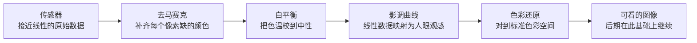
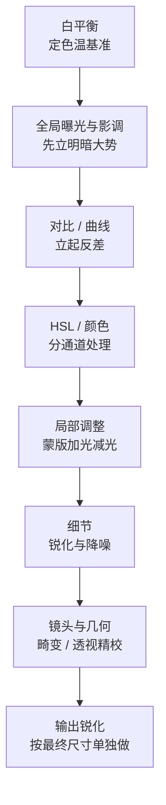

# 第 13 章 后期

> 后期并不是把照片修得漂亮一点。它接着拍摄时的那个判断往下走，决定一张照片最后究竟以怎样的亮暗、颜色和纸面气息出现在别人面前。

---

## 后期不是数字时代的发明

Ansel Adams 的大半辈子都泡在暗房里，先是旧金山和 Yosemite，晚年二十余载则在加州 Carmel。有一个对比常被人提起：他拍一张底片，可能只花上半个小时，可到了暗房里冲印同一张照片，却往往要耗去好几个小时。真正漫长的那一部分，从来不在按下快门的现场，而在事后一遍遍地重印。他自己反复说过一个比喻：底片像乐谱，照片像演奏。乐谱一旦写定就不再更改，可同一份谱子，不同的人、不同的心境弹出来，快慢轻重全然不同。照片也是如此：同一张底片，他在四十年代印出一个版本，过些年再印一次，晚年又印一次，几个版本的灰度、反差和气息各不相同——那张著名的《月升》，他前后印了四十多年、上千张，越到晚年，天空印得越深沉。底片记录下的只是那一刻落进镜头的光，而暗房里的他，则在许多年之后重新决定，这一刻究竟应该以怎样的面貌被人看见。

到了数码时代，后期换了一套工具，可这件事的本质并没有随之改变。滑块替代了药水和遮挡棒，屏幕替代了一部分暗房，操作起来干净、快捷，也可以随时回退，然而摆在你面前的问题仍旧是同一个：你究竟要让这张照片成为什么样子？你是在顺着原片本来就已经有的方向，把它一点点讲清楚，还是打算强行把它扭成另外一种东西？后期里最要紧的那个判断，从来不在软件，也不在某一个滑块推到多少，而恰恰落在这个问题上。

---

### 从暗房延续到软件

*Carleton Watkins, "Yosemite Valley from Inspiration Point", ca. 1865。Watkins 比 Adams 早很多年就把 Yosemite 拍成了美国风景想象的一部分。他用 18×22 英寸的湿版玻璃底片进山，每张底片都很重，拍完还要回暗房用蛋清相纸冲印。今天我们把这一切叫作前期和后期，在他那里却是一件完整的工作：去现场、承受重量、曝光、冲洗、印出来，再让照片进入公众视野。1864 年，Watkins 的照片帮助推动 Yosemite Grant 成立，风景因此不只是被看见，也被保护。[图片来源与复用说明](image-credits.md#watkins-yosemite)*

---

## 后期属于拍摄流程

后期在整条摄影工作里，并不是一个可以单独拎出来的孤立环节。你先看见，再拍下，再选片，然后才轮到后期，最后把照片输出到屏幕、纸张、书或者展览墙上。在这一串环节里，最容易被人一带而过的，恰恰是选片。很多人拍完以后，习惯把一整组照片一并导进软件，从第一张开始逐一往下调，调到最后，往往已经忘了自己当初为什么要拍这一组。更稳妥的顺序，是先做一遍粗筛，把明显不成立的先搁到一边，再从剩下的里面挑出真正值得认真处理的那几张。后期更适合去服务那些已经通过了选择的片子，而不是反过来，替所有本就不成立的照片一张张找借口。

在动第一个滑块之前，还有一件事得先确认，那就是你眼前这块屏幕是不是基本可靠。道理并不难理解：显示器如果本身偏蓝，你就会不知不觉往黄里补偿，调出一批在别人屏幕上看着偏黄的照片；亮度要是开得过高，你又会把照片压得偏暗，好迁就那份亮，结果它们在别人那里都显得发闷。最省事的办法，是定期用校色仪校准一次；退一步说，哪怕不校准，至少也要把显示器的亮度固定在一个中等、不刺眼的水平，并且尽量在相近的环境光下修图，免得白天一个样、夜里又一个样。准备拿去打印的照片，还要多做一步软打样，因为纸面通常比屏幕更暗，对比也更低，屏幕上看着刚好的照片，印出来常常闷了一截。后期里所有的判断，都站在“我看见的基本是准的”这一个前提上；一旦这个前提本身就是歪的，那么你越认真、越用力，反而越容易一路错下去。

说到校色，还要分清两个经常被混作一件事的步骤。**校准**先把显示器调到选定的白点、亮度和影调响应，可能通过显示器硬件、显卡曲线或两者配合完成；**特性描述**再让校色仪测量校准后的实际表现，生成 ICC profile，交给支持色彩管理的软件做颜色转换。配置文件不是一张给所有图像统一套上的“纠偏滤镜”，不做色彩管理的应用也不会自动得到正确结果。下面这些数值只能作为普通室内工作的起点，最终要与环境光、印刷验收灯和交付标准匹配：[ICC 的显示器校准说明](references.md#color-management)也明确把校准与特性描述分开。

| 参数 | 目标值 | 作用 |
|---|---|---|
| 白点 white point | D65 常用于一般屏幕工作；印刷流程也可能要求 D50 | 与观看环境和交付规范一致，而不是追求抽象的“绝对白” |
| 影调响应 | gamma 2.2 是常见起点 | 具体目标按系统、视频或印刷流程决定 |
| 亮度（一般室内） | 约 100 至 120 cd/m² 可作起点 | 环境越暗，通常越不应把屏幕开得过亮 |
| 打印匹配 | 不设全球固定值 | 在规定观察光下比较软打样与实物，再按实际偏差调整 |

这三项里，亮度尤其要紧，它也正好回答了“为什么我屏上看着刚好，印出来却发暗”的一半缘由：屏幕是自己发光的，纸却是靠反射房间里的光，屏幕的亮度但凡开得偏高，你在修图时就会不知不觉地把照片往暗里调，去将就那份亮，等真的印到只能反光的纸上，自然就闷了一截。

至于软件，其实只要挑一件适合自己的就够了，大可不必样样都会。Lightroom Classic 是最通用的照片管理和调色工具，对大多数人来说都够用。Capture One 的色彩和联机拍摄很出色，棚拍、人像和商业工作里常常用到它。Photoshop 真正的长处在合成、复杂修复和精细的局部处理，正因为如此，反而不必拿它去处理每一张日常照片。此外，DxO 在镜头校正和降噪上各有优势，Affinity Photo 适合那些不愿意走订阅制的人，Apple Photos 和 Snapseed 则足以完成许多轻量的活。工具的价格和版本总在变，可挑选它们的逻辑并不会跟着变：能稳定地管理照片、能快速地选片、能可靠地调整 RAW，这几样远比“看起来专业”更要紧。仅仅为了显得正式，就打开一件最复杂的软件，通常只会让日常的处理变得更慢。

---

## 技术展开：RAW、位深与显影管线

!!! note "阅读路径"

    后期的主线是先选片，再确定方向，按可复用顺序完成并针对输出检查。下面解释 RAW、位深、去马赛克、目录与边车文件；只想建立处理流程，可以先跳到“两种后期方向”。

### RAW、JPEG 与位深

在挑好工具之后，还有一件更靠前的事得先厘清，那就是你手上究竟握着一份怎样的原始素材。一张照片后期能有多大的回旋余地，很大程度上在生成文件的那一刻就已经定了，而不是等你打开软件才慢慢展开。这里最要紧的一道分野，就是 RAW 和 JPEG 的区别。

RAW 保存的是传感器读到的接近线性的原始数据，位深高，白平衡与色调可以留到后期重新解释，亮度映射也可再调，但实际的曝光量仍在现场决定。JPEG 则是相机当场把这些决定做完、压成 8 bit 再有损压缩的成品：白平衡、对比度、锐化都已经烤进画面，后期回旋的余地小得多。RAW 交付的是配料，JPEG 交付的是成菜。

上面反复提到的位深，值得单独拿出来说清楚。位深决定每个通道可以编码多少个离散数值；位数越高，量化台阶越密，在多轮曲线、合成和颜色变换中越不容易积累断层。它不等于动态范围：一份 14 bit RAW 若暗部已经淹没在噪声里，多出来的编码级数也不会凭空变成可用细节；一张 8 bit JPEG 经过影调映射，同样可以呈现远多于“八档”的场景明暗关系。

| 位深 | 每通道级数 | 说明 |
|---|---|---|
| 8 bit | 256 | JPEG 输出，后期拉伸空间小 |
| 12 bit | 4096 | 部分 RAW |
| 14 bit | 16384 | 主流 RAW，后期宽容 |
| 16 bit | 65536 | 中间工作/合成用 |

把这几档摆在一起，8 bit 每通道有 256 个编码值，12 bit 有 4096 个，14 bit 有 16384 个。高位深在强烈调整和多轮计算中通常更稳，但 RAW 的真正优势不只来自位数，还来自它保留了接近原始的传感器数据、未固定的白平衡与尚未烤死的影调映射。反过来，一张已经正确完成、只用于显示的 8 bit JPEG，并不会因为只有 256 级就必然出现肉眼可见的色带。

---

### RAW 显影如何生成颜色

既然 RAW 里存的只是传感器读到的原始数据，那么从这样一份数据，到屏幕上一张能看的照片，中间其实还隔着好几道工序。平时你在软件里打开一张 RAW，画面几乎是瞬间就呈现出来的，看不出这中间发生过什么；可它背后，冲图软件替你默默地把一整条管线走了一遍。理解这条管线，你才会明白后期那些滑块，究竟是在管线的哪一环上做文章。

这条管线的第一道，是**去马赛克**（demosaic，去马赛克插值）。绝大多数相机的传感器上，每一个像素其实只测量一种颜色。工程师在感光面前面盖了一层滤色阵列，最常见的一种叫**拜耳阵列**（Bayer array，一种滤色阵列），由柯达的 Bryce Bayer 在上世纪七十年代中期提出：它按红、绿、绿、蓝的方式排布，绿色占了一半，红和蓝各占四分之一，因为人眼对绿色一带的明暗最敏感。传感器直接读到的，并不是一张彩色照片，而是一张每个点只知道一种颜色的马赛克。所谓去马赛克，就是根据周围邻居的读数，把每个像素缺掉的那两种颜色推算补齐，最终还原出完整的红、绿、蓝三个通道。

把颜色补齐之后，管线才轮到那几件后期里熟悉的事：先定**白平衡**，把画面的色温校到中性；再套一条**影调曲线**，把传感器那份接近线性的数据，映射成人眼看着舒服的明暗分布；最后做**色彩还原**，把传感器各自的原始响应对到一个标准的颜色空间里去，好让红是红、蓝是蓝。这里要专门说一句传感器数据的“线性”：传感器接收到的光子数量翻倍，它输出的信号也差不多翻倍，是一种成正比的关系；可人眼对明暗的感受却是压缩过的，接近对数。正因如此，那条影调曲线并不是可有可无的装饰，而是把线性的物理测量，翻译成符合人眼观感的必要一步。JPEG 之所以后期余地小，正是因为相机已经把这整条管线一次性替你走完、烤死了；而 RAW 把每一环都留在你手上，你随时可以推翻重来。这一点也呼应了前面第 3、4 章讲曝光与色彩时的思路。

要补一句：这张图排的是讲解的顺序，实际的软件实现里各环节的次序会有出入，比如白平衡的通道增益，多数管线其实在去马赛克之前就已施加，那样插值的效果更好。这不影响理解，只是免得较真的读者拿某一家软件的文档来逐条比对时心生疑惑。

而这“随时可以推翻重来”，本身又牵出后期的另一条根基，叫**非破坏性编辑**（non-destructive editing，又称参数化编辑）。你在 Lightroom 或 Capture One 里推的滑块，通常不改写 RAW，而是把操作记在目录或边车文件里，再实时生成预览。这里不必把数码和暗房说成完全相反：胶片显影确实不可逆，可已经显影的负片同样能反复印出不同版本，Adams 正是这样工作。数码真正扩大的，是同一套调整可以低成本复制、撤销、比较和批量重算；前提则是 RAW、目录、边车文件和软件版本都被妥善保存。

上面说软件把你的操作“记在一旁的目录或者一个附带的小文件里”，这句话背后其实藏着两套并不相同的存法，值得分辨一下，因为它关系到你日后换电脑、做备份、把文件传给别人时，那一串调整指令会不会跟着照片一起走。一套叫边车文件（sidecar file，伴随文件）：软件把你对一张 RAW 的全部调整，写进一个和原片同名、扩展名为 .xmp 的小文本文件，让它和原片并排躺在同一个文件夹里，走到哪跟到哪。另一套叫目录（catalog，中央目录数据库）：Lightroom Classic 把成千上万张照片的调整，统一记在一个中央数据库里，原片所在的文件夹里则一个字都不写；它的长处是检索和批量管理都快，短处是你若只顾着拷原片、忘了拷那个数据库，一整批心血就留在了原来那台电脑上。介于两者之间还有一种折中，是把原始数据和调整指令一并封进 Adobe 的 DNG（Digital Negative，数字负片）格式里，相当于把边车文件重新塞回了底片自己的肚子里。

也正因为调整从头到尾只是一串可回退的指令，有几件在暗房年代想都不敢想的事，如今几乎不花额外的代价。你可以给同一张 RAW 建好几个虚拟副本（virtual copy，虚拟副本），让一张底片同时以彩色和黑白两个面貌存在，彼此互不干扰；可以在处理途中随手打一个快照（snapshot，状态快照），把此刻的样子记下来，好留到日后和别的版本并排比较；软件还默认替你保留一整条编辑历史（history，操作历史），让你随时退回二十步之前的任意一步。这些都是参数化编辑白送的红利：既然动的从来不是像素本身，那么多存几个版本、多记几串指令，也不过是多写下几行字罢了。

---

## 两种后期方向

后期大致有两种常见的方向。第一种，是顺着原片本身的性格往下走。譬如拍摄时的光本来就硬，那么后期不妨顺势让暗部更沉、让亮处更干净，把这份硬朗讲透；颜色本来就很克制，就不要忽然反手把饱和度拉得很高，破坏掉那份克制；构图本来已经很干净，那么暗角、颗粒和局部加光这些手段，就都要用得谨慎，别画蛇添足。这样的处理，看似保守，其实并不保守：它是在尊重照片原本性格的前提下，把一张“差不多”的照片，一点点整理到“说清楚”的地步。

第二种方向，是给一整组照片套上一种更明显、更统一的处理方式，比如模拟某一种胶片，把整组统一成偏冷的城市夜色，让所有人像都带着柔和的低反差，或者让街头照片一律带上粗颗粒和很沉的黑场。这一种同样可以成立，只是它有两个前提：一是整组必须保持一致，二是照片本身已经有内容撑着。道理在于，一个固定的预设用在 30 张照片上，观众自然会把这份统一理解成整组作品的语气；可要是一张照片一个调子，各走各的，就会显得你自己都还没有决定究竟想说什么。后期救不了一张构图、光线和内容全都不成立的照片，它最多只能给原有的问题裹上一层装饰而已。

这里还牵出一个分寸的问题。调整亮暗、色彩、局部明暗以及裁剪，这些一般都属于摄影传统里长期就存在的处理手段。压住过亮的天空、提亮一张脸、校正白平衡、把画面的反差调到更合适的程度，这些做法和当年暗房里的遮挡、加光并没有什么本质区别，不过是把同一件事换到了屏幕上做。可是，一旦走到增删画面内容这一步，手上的动作就要慢下来了。把一个碍眼的人抹掉，把一只飞鸟贴进天空，把两张照片拼接成一个本来并不存在的瞬间，这些改动改变的就不只是照片长什么样，而是连带着改变了现场究竟发生过什么。

因此，题材越是靠近新闻、纪实和公共事实，这条线就越要收紧。同样是动一处内容，分量却相差很远：旅行照片里修掉一根碍眼的电线，更多只是个人趣味上的取舍；可报道摄影里挪掉一个物体，照片本身连同摄影师的信誉，都会一并被人质疑。入门的时候，不妨记住一个简单的自检：你眼下这一步，究竟是在让照片更接近当时你亲眼看见、亲身感受到的样子，还是在凭空制造一个当时根本不存在的场面？如果是前者，通常没有问题；如果是后者，那就要清清楚楚地告诉自己，这已经越过了整理的边界，进入创作和合成的范围了。

顺着这条自检，可以把包围曝光、全景、焦点堆栈和多帧降噪一起交代掉。它们可以是克服一次曝光限制的技术手段，却不会因为“同一地点、相近时间”就自动保持事实不变：十分钟内移动的人可能被去掉，浪花和云会被平均，焦点堆栈也可能组合不同瞬间。个人艺术可以自由决定，商业建筑和旅行内容应按委托约定，新闻与纪实则要服从更严格的行业规则。凡是观看者会把图像当作一次真实瞬间、而合成实际改变了时间或内容时，公开说明方法比寻找一条万能豁免更诚实。

---

## 一个可复用的处理顺序

一个稳妥的后期顺序，大致是这样的：先选配置文件并打开需要的镜头校正，因为畸变校正会改变画面边缘；接着做一个初步裁剪与拉直，确定最终构图；再定白平衡、全局影调和颜色，随后用蒙版做局部调整，最后按输出尺寸处理降噪与锐化。建筑等需要大幅透视校正的照片，可以先粗调几何再裁剪，避免校正后突然缺角。非破坏性软件允许来回修改，所以顺序是为了减少返工，不是不可违背的流水线。

把它拆细，就是：配置文件与镜头校正 → 初步几何与裁剪 → 白平衡 → 全局曝光与影调 → 曲线和颜色 → 局部加减光 → 降噪与采集锐化 → 按屏幕或纸张单独做输出锐化。若降噪工具会生成新的 RAW/DNG，或透视校正会明显重采样，也可以按软件特性提前；真正重要的是，构图与全局方向要在精细局部处理之前稳定下来。

白平衡之所以几乎总是排在最前面，是因为它是一切颜色判断的地基。你若是先埋头把 HSL 里的红橙黄绿一个个调到自认满意，回过头却发现整张照片的色温本来就偏了，那么先前对每一种颜色所下的判断，就等于全都建在一个歪掉的底子上，只能推倒重来。同样的道理，全局的曝光和影调要排在局部之前：只有整张照片的明暗大势先定了下来，你才谈得上判断哪一块局部还需要单独提亮、哪一块还需要单独压暗。至于镜头的自动畸变与暗角校正，许多人会在一开始就顺手打开，而更精细的透视与几何调整，则往往留到构图和影调都稳定之后再动，免得反复来回，做了无用功。

既然白平衡是这一切颜色判断的地基，就值得把它到底怎么调说清楚。软件通常把它拆成两根滑块，对应两个互相垂直的方向。一根是色温（temperature，蓝黄轴），沿蓝与黄这条轴来回，用开尔文（K）标度：把滑块往高开尔文推，画面转暖偏黄，往低推则转冷偏蓝，这和第 4 章讲光的色温时用的是同一套刻度，只不过在这里是反过来拿它去抵消现场光的偏色。另一根是色调（tint，绿品红轴），沿绿与品红这条轴来回，专门用来收拾荧光灯、阴天这类光源常带的那一层偏绿或偏品红，而这恰恰是色温那根轴管不到的。两根滑块一横一纵，合起来才能把任何一种偏色都拉回中性。除了手动去推，还有一个更快的办法，是拿白平衡吸管在画面里点一处本应是中性灰的东西，比如一堵灰墙、一件白衬衫的暗部、或者一张随身带的灰卡，软件便以这一点为基准，反推出该往哪个方向、推多少，一次把两根滑块都替你定好。也正因为它认的是“中性”二字，所点的地方最好确实不带颜色；你若误点在一片本就偏色的物体上，整张照片反而会被它一并带偏。

锐化，尤其是那道输出锐化，之所以被牢牢地摁在整条链的最后，是因为它和照片最终的尺寸绑在一起。一张缩到适合网页宽度的照片，和一张要放大打印的照片，需要的锐化量根本不是一回事。你若是在原始大图上就把锐化做足，再一路缩小导出，那些精心加出来的边缘反差，反而会在缩图的重新采样里被搅乱、被糟蹋掉。正因如此，稳妥的做法，是把锐化的最后一道，留到尺寸已经确定、马上就要交付的那一刻再补上。

全局调整，第一步先看曝光。这里的目标，并不是把整张照片一律平均地提亮，而是让主体的亮度落在对的位置上。所以人像要先看脸，风光要先看画面里最重要的那座山、那片云或者那块水面，街头则要先看那个关键动作发生的位置。高光通常最先处理，因为过亮的天空、窗户和皮肤上的反光，往往会第一个跳出来刺眼。等把高光压回来之后，再回头看阴影是不是需要打开。阴影不要一口气拉得太多，理由有两层，都很实在：其一，第 3 章讲过，暗部本就是信号最弱、离读出噪声地板最近的一段，你把它猛地提起来，等于把那段最脏的信号放大给所有人看，噪点和色斑会成片翻上来；其二，暗部一旦被整个拉平，画面里从亮到暗的影调台阶就被压缩掉了，照片看上去像被水洗过一遍，失了原有的层次和重量。暗，本来就是画面的一部分。

白色色阶和黑色色阶，负责的是画面最亮和最暗那两个落点。一张照片如果没有一处真正的黑，看上去常常会发软，立不起来；如果白场也没有一个明确的落点，画面又容易发闷。许多刚开始学后期的人，往往只顾着动曝光、对比、高光和阴影，却把黑白场给忘了，结果照片的亮度看起来是差不多对了，却总感到缺了一股力量。这里要说清楚的是：设黑场，是给照片定一个最低点，而不是把所有暗部一律压死；设白场，是让画面知道最亮的落点在哪里，而不是索性让亮部爆掉。

单靠屏幕观感判断溢出并不可靠，直方图和削波警告能提供更客观的线索。直方图描述像素在各亮度区间的数量，却不能单凭“整体在左或在右”宣判曝光错误；夜景本来可能偏左，雪景本来可能偏右。紧贴边缘的大量堆积提示有像素达到当前处理结果的最小或最大值，但亮度直方图还可能掩盖单个颜色通道，软件显示的也可能是渲染后结果而非原始 RAW。应同时查看 RGB 通道与画面位置，再决定那片纯黑或纯白是损失还是有意的落点。

Lightroom 一类软件在拖动白场或黑场时，可用 Alt（Mac 上 Option）显示当前处理结果里先发生削波的区域。这是定位工具，不是“第一点出现就必须收手”的规则：灯芯、太阳反光或画面边缘可以有意纯白，深洞与剪影也可以纯黑。带色提示通常表示某个通道先触顶，应回到照片检查颜色与纹理，而不要仅凭提示颜色断言 RAW 一定能恢复。

RAW 预览看似纯白，不等于原始数据已经削波，因为预览使用了白平衡、配置文件与影调曲线；但不存在通用的“还藏一档”。若相关感光通道都达到饱和，真实纹理已经丢失。只有部分通道饱和时，软件可以依据其他通道和邻近像素估算亮度或颜色，这更接近重建而非把原信息找回。判断应使用 RAW 软件的通道警告并结合实际文件测试，不能拿 JPEG 预览当传感器上限。

其实很多日常照片，单靠基本面板就已经能完成大半。风光可以压一压高光、略微打开阴影，再给一点白场和黑场，让云、地面和山体各自都有落脚的位置；人像通常要温和许多，皮肤切忌被对比拉得太硬，否则脸上就显得生硬；街头和黑白则可以让黑场更沉一些，好给画面撑起一副骨架。不过要记住，这些数值终究只能当作一个起点，每一张照片最后都得回到它自己的主体、光线和画面内容上，重新去看、去调。

在基本面板那几个滑块之外，还有一件工具值得单独认识：曲线，后期最核心的一件工具。它之所以最核心，是因为它做的事，正是前面那条 RAW 管线里“影调曲线”那一环的延续：横轴是输入亮度，纵轴是输出亮度，把输入的亮度，重新映射成输出的亮度。横轴上的每一个位置，代表原图里某一档明暗；你把这一段往上提，它在成片里就更亮，往下压就更暗。经典的 S 形曲线，无非是把曲线的上段抬起、下段压下，于是亮的更亮、暗的更暗，反差便被拉开了；反 S 则反过来收拢反差、找回两端的细节。而这一切靠的都只是重新分配各档亮度落在哪里，并没有凭空添进任何新的东西。

上手的动作也可以说得很具体。在曲线上打三个锚点：一个在下三分之一处管暗部，一个在中央管中间调，一个在上三分之一处管亮部。想让画面通透，就把亮部那个点微微上抬、暗部那个点微微下压，S 形自然成形；调整某一段时，旁边的锚点还兼着“锁”的作用——你只想提亮中间调，中央的点往上带，上下两个点钉在原地，亮部和暗部就不会被牵连着一起跑。多数调坏了的曲线，都坏在只打一个点上，轻轻一提，整幅画面便跟着一起浮了起来。

曲线还有一个常被用到、却容易被忽略的用法，叫**抬黑位**。你把曲线左下角那个端点，从贴着底边的位置往上提一点，画面里最暗的地方便不再是纯黑，而是变成一层浅浅的灰。就这样一处小小的改动，能立刻给照片染上一种褪色、发旧、像老胶片的哑光气息。近些年流行的那种所谓“电影感”“胶片感”，很多时候在影调上的核心，其实正是这一手抬黑位，再配上把高光那一端稍稍收一收。反过来，如果你把左下角的端点顺着底边往右拖，做的则是相反的事：让更多本来偏暗的像素被压成纯黑，黑场因此更沉、更实。仅仅是曲线两个端点的挪动，就足以决定一张照片究竟是清透、是厚重，还是带着一层怀旧的灰。

到这里所说的曲线，动的都是整张画面的明暗，红绿蓝三个通道一起被抬高或压低。可曲线还能拆开来用，单独去动其中某一个颜色通道，这一拆，它就从一件调影调的工具，摇身变成了一件调颜色的工具。原理是每个通道各有自己的一条曲线：把红通道的曲线整体上抬，画面便整体泛红，往下压则泛红的补色青；绿通道对应绿与品红，蓝通道对应蓝与黄。往一个通道里加，等于往画面注入这个颜色，从一个通道里减，等于注入它的补色。有了这一层，你就可以只在阴影那一段抬一点蓝通道，让暗部悄悄泛冷，再只在高光那一段抬红压蓝，让亮部转暖；这一冷一暖分置影调的两端，正是许多所谓“电影感”配色在曲线上的做法，也是数码时代到来之前，人们在彩色暗房里，或者靠交叉冲洗（cross-processing，交叉冲洗，即故意用错配方的药水去冲胶片）逼出那种独特偏色的由来。理解了通道曲线，你再回头看后面要讲的 Color Grading，就会明白它无非是把这套“分开亮暗、分通道染色”的操作，重新包装成了几个更直观的色轮而已。

与整体曲线相对的是局部调整，只在选定的区域动手。它的作用，是把观众的眼睛轻轻地引到画面里该看的地方。具体的手段有好几种：径向蒙版可以让主体周围稍稍提亮，或者让边缘慢慢地暗下去；线性渐变则适合用来压天空、提亮前景；笔刷和 AI 蒙版可以单独去处理脸、眼睛、天空、背景和衣服。局部调整最好用得克制，让人看上去像是画面本来就是这样，而不是一眼就看出某个地方被特意圈了出来、动过手脚。全局决定的是照片的基调，而局部只负责整理观众的注意力，两者分工不同，都不该越位。

这种局部的提亮和压暗，其实一点都不新鲜，它有一个来自暗房的老名字，叫**遮挡与加光**（dodge and burn，减光与加光）。在药水和放大机的年代，印一张照片时，若想让某一块暗部亮一点，就用一块纸板或者手，在曝光的光路里挡住那一块，少给它一点光，这便叫 dodge；若想让某一块亮部沉下去，就反过来单独给那一块多曝一会儿光，这便叫 burn。Ansel Adams 在暗房里反复推敲的，很大一部分正是这件事：哪一道山脊该压、哪一片云该提，一张底片能印出他心里那个样子，靠的就是这一遍遍的遮挡与加光。到了马格南这样的机构，甚至专门养着像 Pablo Inirio 这样的暗房大师，他为许多流传极广的名作做过放大，那些留存下来的工作样片上，密密麻麻标满了每一块该加几秒、该减几秒的记号。今天你在蒙版和图层里做的，本质上就是把这一套遮挡与加光，搬到了屏幕上来做，只不过精细得多，也可以随时反悔罢了。

再回到蒙版本身。前面提到的径向、线性和笔刷，圈定区域靠的都是形状，你画一个圈、拉一道渐变，或者拿笔一笔笔涂。可现实里要处理的区域，形状往往极不规则：一片枝杈交错的天空，一张带着飞散发丝的脸，靠手去描既慢又描不干净。于是新一代的蒙版索性不再只按形状圈，而是改成按内容和亮度来选。一种叫亮度范围蒙版（luminance range mask，按明度选区），让你规定这个蒙版“只作用在某一段亮度上”，比如只压最亮的那片天空，而亮度不同的地面纹理便自动被排除在外。一种叫颜色范围蒙版（color range mask，按颜色选区），同理是按颜色来选，你在天空上点一下那片蓝，蒙版便只圈住画面里所有相近的蓝。近几年更进一步，软件已经能直接认出“主体”“天空”“人物”“头发”“皮肤”“眼睛”这类语义对象，一键就把它们各自框成一个蒙版。这些蒙版真正好用的地方，还在于可以叠着用：先选出整片天空，再和“只要蓝色”求交集，就能精确地只压蓝天而放过其间的白云；先选出人物，再从中减去皮肤那一块，剩下的就只有头发和衣服。蒙版这些年一路从“画一个大概的范围”，进化到了“用几个条件精确地描述你到底想动哪一块”。

蒙版之外，还有一族工具做的是另一件事：不是调整某一块的明暗颜色，而是把某样东西从画面里拿掉。前面讲伦理时画了红线，这里得把笔本身也交到你手上。最轻的一档是污点修复，对付传感器灰尘和皮肤上的痘印，软件自动从周围采样补上，几乎不用动脑。再上一档是克隆图章，由你亲手指定“从哪里抄、贴到哪里”，适合修复纹理有方向的区域，砖缝、木纹、发丝。第三档是内容感知填充一类算法，你圈住那根碍眼的电线、那个走进画面的路人，软件分析四周自行“编”出一块补丁。而这几年的生成式移除与填充，则干脆让模型凭空画出擦除处“本该有”的内容，边界之干净、内容之逼真，已经到了肉眼难辨的地步。工具越顺手，前面那条自检就越要紧：污点修复擦掉一粒灰尘，没有人会认为你改写了现场；生成式填充替你“补”出一片本不存在的草地，那已经是另一张照片了。技术把这条线越磨越隐蔽，守线的责任也就越发落回你自己身上。

---

## 让颜色服从主题

处理颜色，第一件事是先问自己：这张照片里最重要的颜色到底是什么。在人像里，这个颜色通常就是皮肤。把橙色通道稍微提亮一点、饱和度稍微降一点，皮肤会显得干净，但也要有分寸，不能一路降到把人变得毫无血色。皮肤最怕的，是被整体饱和度拖着走：背景一旦鲜艳起来，脸也跟着泛橘；背景一旦偏冷，脸又容易发灰。因此，人像调色最好先把皮肤稳住，让它站在一个对的位置上，然后再回头去处理衣服和背景。

换到别的题材上，思路也类似，而且可以给出大致的量级，免得“稍微”二字落不了地。蓝天可以在 HSL 里把蓝色的明度压下一二十格，云的形状立刻浮出来，再多就开始发黑发假；秋叶把红、橙的饱和度各加十格上下，暖意就足了；绿色则是最容易过头的一种颜色，草地和树叶的处理通常是双管齐下——饱和度压十格左右，色相再朝黄那头轻推几格，让那股荧光似的鲜绿沉稳下来，画面反而显得沉着耐看。这些数字都不是定值，只是给你一个下手的量级：HSL 里的调整，多数时候在正负十到二十格之间就该收手，一旦拖过半程，画面几乎必然露出处理的痕迹。城市夜景又是另一种情形：霓虹本身就已经很饱和了，后期要是再去推整体的饱和度，只会让各种颜色互相污染，越发脏乱。更好的做法，是先选定一种主色，让它站出来主导画面，再把其余的颜色稍微压暗或者压灰，退到从属的位置上去。

Color Grading 则可以给高光、中间调和阴影分别加上一点色彩。最常见的一种做法，是让高光偏暖、阴影偏冷，皮肤和灯光保留住那份温度，暗部和背景则慢慢退到蓝青里去。复古味道的照片，常常让高光偏黄，阴影偏紫或者偏冷；而冷峻的城市片，则可以让画面整体偏蓝，黑场压得更深一些。无论选的是哪一种，强度都要放轻。道理很直白：颜色一旦加得太重，照片就会从“有气氛”滑向“像滤镜”，前者是氛围，后者却只是廉价的痕迹。

Color Grading 这个说法，本身就是从电影里借来的。一部影片拍完之后，要经过一道叫调色（color grading，又称配光/color timing）的工序，由专门的调色师坐在 DaVinci Resolve 这一类系统前面，用几个色轮给整部片子统一定调。摄影后期里那个 Color Grading 面板，其实就是把电影那套三色轮原样搬了过来。它把画面分成阴影、中间调、高光三段，每一段配一个色轮：在色轮上你往哪个方向拖，就给那一段染上哪个方向的色相（hue，色调），拖得离圆心越远，这层色就染得越浓，也就是饱和度（saturation，色彩浓度）越高。每个轮子旁边通常还带一个亮度（luminance）滑块，让你在染色的同时顺手微调那一段的明暗；面板底下再给一个混合（blending）和平衡（balance），管的是三段之间过渡得多柔和、分界线大致落在什么位置。

在所有配法里，最常见、也最经得起反复看的一种，是让阴影偏青、高光偏橙。这背后有一条相当朴素的色彩道理：人的皮肤本就落在橙色一带，而青恰好是橙的补色（complementary color，色轮上正对着的那个颜色）；把背景的阴影推向青、把人物的高光留在橙，一冷一暖分踞色轮两端，主体便自然而然地从背景里被推了出来。好莱坞商业片这些年那股挥之不去的青橙调，说到底就是这一条补色关系被反复地使用。这套东西也不是凭空冒出来的，它的前身是胶片洗印时代逐镜配光的工序（color timing），数字调色接过了这份工作又远远走宽；软件里更早的形态叫分离色调（split toning，分离色调），只提供高光和阴影两个色相加一个平衡，比现在的三轮要简单；而分离色调再往前，还能一直上溯到黑白暗房里的调色（toning，药液染色）：把相纸泡进硒盐或者硫化物的药液，让本是中性灰的黑白照片，整体染上一层冷紫或者暖褐。今天你在阴影里加的那一点青，和当年师傅把照片浸进药水里染出的那层褐，追求的其实是同一件事，都是给影调本身定一个气味。当然，无论色轮怎么转，前一段那句告诫始终有效：强度一律放轻，宁可差一点点，也别让颜色抢在照片前头先跳出来。

比起单张，一组照片更需要统一。为此，你可以为街头、人像、风光各自做一个属于自己的起点预设。它不必做得多复杂，也不必起一个很玄的名字，说到底，它无非就是你常用的那一套黑场、对比、颜色和颗粒的组合罢了。每一张照片都从这个共同的起点出发，再根据各自的现场情况去微调。这样做的好处是双重的：一来能替你省下不少时间，二来也能让一整组照片看上去，像是出自同一种观看方式。

---

## 锐化、降噪与输出

锐化和降噪没有一律排在最后的单一顺序。采集锐化通常在 RAW 阶段较早完成；会生成新 RAW/DNG 的机器学习降噪也常放在几何、局部蒙版和重度放大之前；真正必须等尺寸和介质确定后再做的，是输出锐化。人像通常要避免把皮肤纹理锐成砂纸，平滑天空也不该连噪点一起被强化；降噪则应在最终输出尺寸下判断，过量会把暗部和织物磨成蜡。

上面提到的蒙版滑块，其实只是锐化诸多参数里的一个。若要更清楚地把控锐化，不妨把它拆成三样来看。后期锐化本质是沿边缘制造明暗反差的错觉，通常由三个参数控制。强度（amount）决定反差加多重；半径（radius）决定这道反差铺多宽，要与细节的尺度匹配，风景的细密纹理用小半径，人像的大结构用大半径；阈值或蒙版（threshold / masking）决定多大的反差才算“边缘”值得被锐化，用来把平滑的天空、皮肤排除在外，免得把噪点也一起锐出来。Lightroom 里另有一根“细节”滑块，管高频纹理的强调程度。

把这三样分开来看，就不难理解为什么风光可以锐得多一点、人像却要收着来：真正该被强化的是边缘的结构，而不是天空和皮肤上那些本该保持平滑的地方。

这套锐化手法有一个听起来自相矛盾的名字，叫**反锐化掩模**（unsharp mask，USM，虚光蒙版）。它之所以带着“反锐化”三个字，是因为这门技术最早出自暗房：制版的师傅会拿一张故意做得模糊的、原图的底片，和清晰的原底叠在一起，靠这层模糊的“掩模”把边缘的反差拱出来。数码时代把同一件事变成了算法，可原理没有变：软件先算出一个模糊的版本，再拿原图去和它相比，凡是两者差得多的地方，就判定为边缘，便在边缘的亮侧再加亮一线、暗侧再压暗一线。这一亮一暗紧贴着边缘的**过冲**（overshoot，即边缘处明暗被有意推过了头），就是让照片“显得”更清楚的那点错觉的来源。要留意的是，它并没有真的找回任何丢失的细节，只是在既有的边缘上放大反差；正因如此，锐化一旦下重了，边缘就会冒出那一圈刺眼的白边。

理解了这一层，就该把锐化拆成三种不同的用途来对待，这个分法是色彩管理专家、《Real World Image Sharpening》的作者 Bruce Fraser 早年梳理清楚的。第一种是**输入锐化**（capture sharpening，采集锐化），用来补偿传感器前那层低通滤镜和去马赛克带来的、几乎每张数码照片都有的一点先天发虚，它量小而均匀，是给整张图先垫一个底。第二种是**创意锐化**（creative sharpening，创意锐化），只针对画面里你想强调的局部，比如人像的眼睛、风光里岩石的纹理，是有选择地去加强某一处。第三种，就是前面反复提到的**输出锐化**（output sharpening，输出锐化），它紧扣最终的尺寸和介质：同一张照片，缩成网页小图、印上哑光纸、印上亮面纸，各自需要的锐化量都不一样，所以它必须留到最后、按用途单独来做。把这三道分开，你才不至于只用一套锐化参数一路走到底，把本该轻手轻脚的地方也一并锐得发硬。

降噪这一头，道理其实和第 11 章讲高 ISO 时是同一套：噪点和细节，往往是绑在一起的一对。传感器在暗处和高 ISO 下读出的信号里，本就混着一层随机的噪声，软件做降噪，靠的是把邻近的像素抹匀，以此压住这层噪声；可这一抹，难免连真正的细节也一并抹淡了。所以降噪从来不是越干净越好，而是一场取舍：你要在“噪点少一点”和“细节多留一点”这两头之间，找那个刚好的平衡点。近些年不少基于机器学习的降噪工具，在这件事上做得比从前聪明了许多，能相当准地把噪声和纹理分开来处理，可最后那点分寸，依旧握在你自己手里。适当留一点颗粒，照片反而透着呼吸与质感；而一旦降噪压过了头，那些本还能辨认的暗部纹理，就再也找不回来了。

软件通常把噪声分成亮度与色度两类来处理。色度噪声表现为不该存在的红绿蓝斑点，通常比亮度颗粒更刺眼，可以优先压掉；但它并非“下得重也很少有副作用”，过量同样会抹掉细小的颜色差异，让织物、肤色和霓虹边缘渗色。亮度降噪则更直接地与纹理竞争，过量会把暗部磨成蜡。稳妥做法是先在 100% 检查色斑，再退回最终输出尺寸判断：只消除真正可见的干扰，不为追求像素级的绝对光滑牺牲成片质感。

到了输出这一步，同样要按用途分别对待。网页尺寸应先查目标平台，2048 像素可以是轻量预览的起点，却不是高分屏、作品网站和所有社交平台的统一答案。JPEG 的“75、85”也不是跨软件统一刻度，应针对照片纹理、目标体积和平台二次压缩做试导出。面向最广兼容性时转成 sRGB，并嵌入 ICC 配置文件；没有配置文件的图像通常会被当作 sRGB 猜测，若文件实际是 Adobe RGB 或 P3，颜色就可能走样。导出前还要决定元数据去留：版权与署名可保留，GPS 和人物隐私信息按发布场景删除。

准备打印的照片要多想几层。分辨率按最终尺寸算，240 到 300 ppi 是常用口径。纸张的选择几乎是二次创作：亮面和绒面纸黑场深、颜色艳，锐利的风光和夜景吃它；哑光纸和棉浆艺术纸黑场浅、反差软，人像、静物和安静的组照反而在那层微微的灰里更有味道——同一张照片印在这两类纸上，是性格不同的两件东西。要让软打样真正管用，还得喂给它正确的纸张特性档：用输出店，就向店家要他们机器加纸张的 ICC 档；自己打印，纸厂官网通常按打印机型号提供现成的下载。最后一步常被忽略：印品要在什么光下看，就该在什么光下验收，暖黄的客厅灯和窗边的天光，会把同一张照片看成两个样子。至于为什么值得把照片印出来——那是第 14 章的话题，这里只管把它印对。而当照片是要放进作品集或者书里去的时候，还得额外照顾整组的一致，让明暗和颜色彼此协调，不要弄成一张亮、一张暗、一张饱和、一张发灰，各说各话。

关于 sRGB，还要说清“默认空间”和“色彩管理”的区别。sRGB 是无配置文件网页元素与普通图像最常见的默认解释；现代浏览器和操作系统也普遍能够读取嵌入式 ICC，把 Adobe RGB、Display P3 等图像转换到实际显示器。问题通常出在文件没有正确配置、平台剥离标签、应用不做色彩管理，或显示器本身没有可靠配置，而不是“所有浏览器只认 sRGB”。

因此，面向未知设备与平台时，sRGB 加嵌入配置文件仍是最稳妥的交付；若明确面向支持 Display P3 的网站或应用，也可以另导出宽色域版本并实际测试。打印则不能凭空选 Adobe RGB 或 ProPhoto RGB：应向实验室确认它接受的文件空间、位深与纸张 ICC，再用该条件软打样。色彩空间不是“越大越专业”，而是发送端与接收端必须说同一种语言。

前面说宽色域图像转去窄色域时需要处理装不下的颜色，这一步由渲染意图和具体 ICC profile 共同决定。相对比色通常保持目标色域内的颜色，把越界颜色映射到可表示范围，并结合目标白点转换；几种越界颜色可能因此失去区分。感知意图则使用配置文件制作者提供的整体重映射，目标是尽量保存颜色关系，但它并不保证把“整个色域等比例压缩”，不同 profile 的结果可能明显不同。没有大量越界颜色时，相对比色常是清楚的起点；饱和花朵、霞光和霓虹可再比较感知结果。最终应依靠正确的输出 profile 和软打样，而不是仅凭意图名称猜测。

许多 RAW 软件内部会在宽色域、高精度的工作空间里运算，最后导出时才映射到目标空间。若文件还要交给别人继续精修，16 bit TIFF 配双方约定的宽色域空间通常能保留余量；最终公开发布时，再按平台要求导出。关键是把色彩空间写进文件并和下一环节确认，而不是默认“打印一律 Adobe RGB、网页一律只有一种尺寸”。

---

## 案例：蓝调城市 RAW

流程讲到这里，不妨拿一张蓝调城市 RAW 走一遍。先打开镜头校正，再裁掉下缘闯入的护栏；用未被灯光染色的湿水泥作白平衡参考，同时保留天蓝与灯暖；随后只把整体曝光、高光、阴影与黑白场调到夜景仍像夜景。曲线用来整理中间调，HSL 只收拾过强的蓝和橙，局部蒙版把视线轻轻引向路口，最后在最终输出尺寸下判断降噪与锐化。具体滑块数值故意不再写成 -60、+20 这样的配方，因为换一台相机、一个配置文件或一个软件，数值就失去可比性。网页版本按目标平台尺寸导出为 sRGB 并嵌 ICC；打印版本则按实验室要求提供 16 bit TIFF 与约定色彩空间。整条流程只回答同一个问题：这张照片本来想说什么，怎样让它说得更清楚。

有几种处理，特别容易在不知不觉之间越走越远，修图的时候不妨多留一份心。第一种是 HDR 拉过了头：这样固然能让天空、地面和阴影全都保有细节，可画面也就随之失去了自然的明暗起伏。它看着假，是有具体机理的：把大范围的明暗差压平之后，软件靠抬高局部反差来维持“清晰”的观感，于是每一处细节都在使劲，画面像被均匀上过发条；明暗交界处还会渗出一圈发亮或发暗的光晕（halo），山脊与天空之间那道白边就是它；更深一层，人眼对世界的预期里有一套明暗的秩序——天亮于地、光源亮于被照物——HDR 拉平的正是这套秩序，秩序一乱，眼睛立刻报警。要知道，现实里的光，从来不会让每一个角落都同样清楚，暗处本就应该留一部分让人看不完、看不透。第二种是饱和度拉过了头：肤色会先变脏，绿色和蓝色也最先失真，这样的照片第一眼看着热闹，第二眼就让人感到累。

再往下数，磨皮过度也是一种：脸一旦被磨得太狠，就会失去骨骼和毛孔，连带着表情也跟着变假。好的人像修饰，追求的恰恰相反，是让皮肤里那些不必要的瑕疵悄悄退下去，同时又完整保留这个人原本的结构。锐化过度，边缘会冒出一圈白边，照片看上去像是被人用硬笔重描过一遍；暗角过度，四周黑得过于明显，观众一眼就能看穿这是后期加上去的手法；白平衡拉到极端，也常常会给一张本来带着现场氛围的照片，罩上一层单一颜色的色罩。

数完了各种“过了头”，还欠一个正面的回答：怎么知道该停手了？这几乎是后期里最难、也最少被正经教的一件事，可它有几条实打实的判据。第一条是缩图检验：把照片缩到拇指大小再看一眼，好照片缩小了依然成立，靠猛药撑起来的照片一缩就露馅——假如第一感觉是“这张明显被处理过”，那就是往回收的信号。第二条是回到原点：几乎所有软件都能一键对照调整前后（或者用前面说过的快照存一个中途版本），修了半小时之后按住它看一眼原片，问自己现在这版是不是真的更接近你当时看见的东西，还是只是离出发点更远。第三条是隔夜再看：当晚觉得惊艳的调色，第二天早上常常只剩尴尬，重要的照片留一夜再导出，是代价最低的一道检验。第四条最朴素：每动一个滑块，都该说得出它在为画面里的什么服务；说不出来的那一下，多半就是多余的那一下。还有一条经验之谈——当你发现自己的调整幅度越来越小、来回在正负五之间拉锯时，照片其实已经完成了，你只是舍不得放手。

后期的审美，要靠多看东西来慢慢养。只盯着手机上的社交平台是远远不够的，因为那里的照片压缩、锐化、提亮全都下得太重，加上一张接一张滑得飞快，眼睛根本来不及停下来。更好的办法，是多去看摄影画册和展览：看油墨究竟是怎样落在纸上的，看暗部如何从灰一层层过渡到黑，看一组照片又是怎样自始至终保持着同一种反差和颜色。你也可以把自己最满意的十张照片摆在一起，找出它们之间的共同点：白平衡偏冷还是偏暖，反差是高还是低，黑场重不重，饱和度又多不多。这些反复出现的共同点，往往就是你自己真正的自然偏好所在。

除此之外，还可以做一做极端练习。拿同一张照片，分别调出很冷、很暖、高反差、低反差、高饱和、低饱和这么几个版本，再把它们并排放在一起看。这些极端版本最后未必真会用上，重点在于，通过这样一种把差距刻意拉开的比较，你能摸清楚这张照片究竟能承受多大幅度的变化。另外，给自己定一个星期的时间，只用基本面板，不去碰 HSL、不去碰 Color Grading、也不去碰任何预设，同样很有帮助。这样练下来你会发现，许多照片其实只需要一个准确的曝光、一个稳当的黑场，再加上一点点局部的整理就够了；那些花哨的处理，反倒常常会把照片原本的问题一并盖住。

---

## 练习

找一张 RAW，只用基本面板的曝光、对比、高光、阴影、白色和黑色，调到你满意为止。先不碰局部、HSL 和预设。连续做七天。

同一张照片做五个版本：偏冷、偏暖、高反差、低反差、接近原片。并排看，写下哪个最接近你当时的感受。

选出你最满意的 5 张照片，找出它们共同的后期特征。把这些设置保存成一个自己的起点预设，接下来一个月都从它开始，再逐张微调。

找一张五年前不满意的照片，今天重新调一次。第二天不看前一天版本，再调一次。连续十天后并排比较，判断自己真正想要的是哪一种。

---

下一章：[第 14 章 编辑与持续](14-edit-and-sustain.md)
