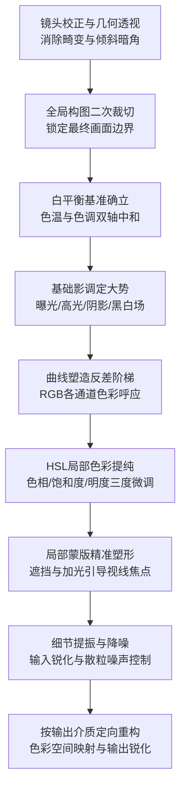

# 第 13 章 后期与数字暗房

> 后期绝非掩饰残缺的涂脂抹粉。它顺应着拍摄瞬间的灵犀前行，最终裁决一幅影像以何等深邃的影调、纯正的色彩与纸面呼吸，庄严步入人类的视界。

---

## 后期不是数字时代的发明

安塞尔·亚当斯（Ansel Adams）的大半生岁月皆在幽暗的红灯暗房中度过——早年栖身于旧金山与优胜美地，晚年二十余载则深居加州卡梅尔（Carmel）海滨的工作室。摄影界常流传着一则耐人寻味的对比：他在悬崖与荒野中架设相机、捕捉一帧底片，或许仅需驻足半刻钟；然而一旦退入暗房，为了冲印出一张令自己心智颔首的成片，却往往要在放大机与药水槽前消磨数个乃至数十个时辰。

亚当斯曾留下摄影史上最著名的譬喻：**底片是作曲家写就的乐谱，而印相则是音乐家在舞台上的现场演奏**。乐谱一旦谱定便确立了不可动摇的结构符码，然而同一阕乐章，在不同的历史时期、由不同的演奏者、在不同的心境与触键力度下奏响，其缓急、顿挫、明暗与气韵皆截然不同。照片亦遵循着完全相同的神髓：同一张拍摄于 1941 年的经典底片《赫南德兹的月升》，亚当斯在四十年代初印出的版本，天空尚留存着黄昏暮色的浅灰与通透；而在随后的四十余年间，他前后冲印了逾千幅成片，越至晚年，暗房中的他越发坚决地对天空实施大幅加光加深，直至将天幕压制为宇宙深渊般浓黑静穆的绝顶纯黑。底片仅仅忠实锁定了光子撞击卤化银晶体的那一瞬物理印记；而暗房中的创作者，则在时光的河流中，反复重铸这一瞬应当以何等庄严的面目被世人凝望。

行至数码时代的疆界，后期的工具虽已由物理药水槽与纸板遮光棒，蜕变为显示屏上的参量滑块与数学算法，然而其精神实质未曾发生丝毫偏移。计算程序赋予了创作者前所未有的快捷、无损与可逆自由，然而横亘在屏幕前的根本拷问依旧如初：**你究竟欲令这幅画面展现出何等精神气质？是在顺应原片内在的光影肌理将其推向极致的明晰，还是试图以蛮力将其扭曲为另一种虚妄的幻象？** 后期最深邃的造诣，从来不在于软件界面的繁复，亦不在于参数滑块推拉至何种数字，而全系于执机者内心的审美定力。

---

### 从暗房延续到软件

*Carleton Watkins, "Yosemite Valley from Inspiration Point", ca. 1865。Watkins 比 Adams 早很多年就把 Yosemite 拍成了美国风景想象的一部分。他用 18×22 英寸的湿版玻璃底片进山，每张底片都很重，拍完还要回暗房用蛋清相纸冲印。今天我们把这一切叫作前期和后期，在他那里却是一件完整的工作：去现场、承受重量、曝光、冲洗、印出来，再让照片进入公众视野。1864 年，Watkins 的照片帮助推动 Yosemite Grant 成立，风景因此不只是被看见，也被保护。[图片来源与复用说明](image-credits.md#watkins-yosemite)*

十九世纪六十年代初，美国正陷于南北战争的惨烈硝烟之中；而远在荒僻的加州内华达山脉深处，卡尔顿·沃特金斯（Carleton Watkins）正率领着一支由十二头骡子组成的驼队，艰难跋涉于乱石嶙峋的险峰隘口。骡背上驮载着人类摄影史上最沉重壮丽的探险装备：一台特制的猛犸版（Mammoth-plate）巨型相机、数以百计厚重而脆弱的 18×22 英寸（约 46×56 厘米）大尺寸平板玻璃、数十加仑剧毒且易燃的火棉胶与硝酸银溶液、流动暗房帐篷，以及数桶在崇山峻岭中极为珍贵的蒸馏纯水。沃特金斯所践行的，是一场近乎肉身殉道般的光学征途。

在这一帧摄于优胜美地灵感点（Inspiration Point）的传世画卷中，大自然的神圣秩序被赋予了金石般的永恒构型。画幅右侧三分之一处，一株挺拔孤傲的北美黄松自幽暗的断崖上拔地而起，其深色树冠如利戟般直插苍穹，以强悍的近景纵深为整片虚空立下了大地的尺度；画幅左侧，酋长岩（El Capitan）高达近千米的垂直花岗岩绝壁巍然屹立，岩体受光面呈现出大理石般通透纯净的高光（第 VII 区），背光阴影侧则沉稳坚实地锚定于第 III 区；极目远眺，半圆顶（Half Dome）在缥缈的高原晨霭中若隐若现，而峡谷幽谷深处的新娘面纱瀑布（Bridalveil Fall），则化作一道银链般的微细水痕。18×22 英寸的巨幅湿版底片以接触印相（Contact Print）的方式直接贴合于蛋清相纸（Albumen paper）之上，在加州阳光的曝晒下自然显影出温暖醇厚的红褐暖调，其微观质感之细腻、花岗岩节理之锐利与空气透视之纯净，令后世无数数码巨制亦难望项背。

《优胜美地灵感点》最震撼人心的启迪，在于它粉碎了现代人将“前期拍摄”与“后期制作”割裂对立的狭隘偏见。在沃特金斯的时代，暗房绝非远离现场的避难所，而是被直接安扎在悬崖绝顶的风暴之中。火棉胶湿版工艺要求玻璃底片自涂布胶体、浸入银浴增感、装入片夹曝光数分钟、直至在遮光帐篷中完成显影定影，全程必须在十五分钟内趁乳剂尚湿一气呵成；一旦药膜干燥结皮，光化学反应便告永久停滞。拍摄即是显影，现场即是暗房。这批照片随后被送往华盛顿特区国会山，林肯总统在凝视这些震撼神迹的猛犸印张后，于 1864 年毅然签署了《优胜美地保护法案》（Yosemite Grant Act）——人类历史上第一次以国家主权的名义，将一片原始自然永久封存为全人类的精神旷野。从沃特金斯帐篷里的刺鼻药水，到当代屏幕上的 RAW 显影管线，摄影从未脱离过“用工艺与心智重铸光影”的漫长流变；后期不仅是影像的完成，更是文明以目光塑造世界的庄严契约。

---

## 后期属于拍摄流程

在严谨的摄影创作链条中，后期绝非孤悬于外的机械工序。观照、定格、初筛、精修、以至最终交付于屏幕、特种纸张或展厅墙面，环环相扣、互为因果。

在这一连串动作中，最易被初涉者漫不经心掠过的，恰是**初筛（Culling）**。许多人自野外归来，习惯将数百上千张底片全盘灌入软件，自第一张起盲目推拉滑块，未及过半，心力与审美觉知早已耗尽，甚至淡忘了当初扣动快门的初衷。最为老练的工作流，是建立冷酷的初筛防线：以两轮快速翻阅剔除构图崩塌、焦点虚脱与神情僵死的废片，仅甄选出五至十幅真正拥有灵魂质地的种子底片施以精雕细琢。后期应当全心服务于那些已然通过严格审美审判的佳作，而非沦为替平庸烂片寻找借口的收容所。

在指尖触碰第一个滑块之前，首要前提是确立**工作台显示器在色彩与明暗上的物理可靠性**。道理至为质朴：倘若显示器原生色温偏冷偏蓝，执机者便会在知觉误导下过度补偿暖黄，致使成片在他人屏幕上呈现一片浊黄；若显示器亮度过高，便会诱导执机者将阴影剧烈压暗，使成片在纸张或标准设备上显得昏暗发闷。最稳妥的基石，是定期借助色度计或分光光度计完成硬件级色彩校准。

必须在认知中严格区分两项常被混为一谈的核心概念：**校准（Calibration）**与**特性描述（Profiling）**：
*   **校准**：通过调整显示器内部硬件增益、背光亮度或显卡查找表（LUT），将屏幕物理状态精准归位至选定的基准白点、亮度和 Gamma 响应曲线；
*   **特性描述**：校色仪在校准后的屏幕上测量数百种标准色块的实际光学输出，计算出偏差矩阵，生成专属的 **ICC 配置文件（ICC Profile）**，供操作系统色彩管理模块调用。

| 核心参数 | 推荐工业起点 | 物理机制与美学意图 |
|---|---|---|
| **白点色温（White Point）** | **D65**（常规屏幕与网络交付）；印刷流程常采用 **D50** | 与最终受众的观看环境色温对齐，避免在虚幻的“纯白”中迷失 |
| **影调响应曲线** | **Gamma 2.2** | 契合主流数字显示系统的非线性阶调映射 |
| **工作亮度（Luminance）** | **100 至 120 cd/m²** | 屏幕为主动发光体，纸张为被动反射体；压低屏幕亮度方能遏制将暗部修得过暗的生理冲动 |
| **环境光基准** | 漫射弱光，避免直射炫光打在屏上 | 环境光照度应略低于屏幕中心亮度，消除瞳孔收缩误差 |

关于软件的调遣，当恪守“利器顺手，物尽其用”之则：Lightroom Classic 擅长海量档案编目、快速选片与批量参数化流转；Capture One 在联机拍摄、皮肤色相细分与极高光色彩滚降上独树一帜，深得棚拍肖像与时尚界青睐；Photoshop 则立足于复杂的图层合成、多尺度精细修饰与空间几何重构。挑选工具的标准，在于其能否稳定沉着地承载你的审美流程，而非盲目追逐界面表象的复杂。

---

## 技术展开：RAW、位深与显影管线

!!! note "阅读路径"

    后期的主线是确立审美方向、按可复用工序沉稳雕琢并针对最终介质输出。下文系统解析 RAW 底层机理、色深量化、去马赛克算法与参数化非破坏性编辑，用以夯实数字暗房的物理地基。

### RAW、JPEG 与色深量化

一幅影像在数字暗房中拥有多大的回旋余地，在快门闭合生成文件的刹那便已尘埃落定。RAW 与 JPEG 的分野，是原料与成菜的根本鸿沟：
*   **RAW 文件**：完整封存了感光元件各电荷槽在曝光瞬间记录的原始电荷数据，未经任何相机内置算法破坏，具有极高的位深与宽广的动态宽容度。白平衡、色彩特性、影调曲线皆处于“未定”状态，等待执机者归来后重新赋予生命；
*   **JPEG 文件**：相机内置芯片在毫秒之间擅自完成去马赛克、白平衡锁定、饱和度渲染、对比度拉扯与高频锐化，最终粗暴压缩进每通道仅 8 bit 的狭窄色域容器中。它是一道已被烹熟的菜肴，暗部与高光的弹性荡然无存。

**色深（Bit Depth）**决定了每一个色彩通道能够划分出多少个离散的亮度量化台阶：

\[ \text{量化阶梯数} = 2^{\text{Bit}} \]

| 色深规格 | 单通道量化阶梯数 | 三通道总色彩数量 | 动态弹性与用途 |
|---|---|---|---|
| **8 bit** | 256 级 | 约 1677 万色 | 标准网络与屏幕交付，后期强行提拉极易撕裂出肉眼可见的色彩断层（Banding） |
| **12 bit** | 4096 级 | 约 687 亿色 | 部分轻量 RAW 格式与高速连拍文件 |
| **14 bit** | 16384 级 | 约 4.39 万亿色 | 主流专业无反与单反 RAW 标配，暗部提拉三至四档依然平滑无痕 |
| **16 bit** | 65536 级 | 约 281 万亿色 | 专业中画幅后背原生捕获、数字暗房内部高精度运算与母版合成 |

必须辨明：**高色深并不等同于高动态范围**。色深决定的是阶梯划分的细腻程度，而动态范围关乎两极落差的极限跨度。然而在多轮色彩变换、极端曲线提拉与局部重度调整中，14 bit 以上的丰沛数据量是守护平滑过渡、阻绝伪色与色带的坚固堤坝。

---

### RAW 显影如何生成颜色

当我们在软件中双击打开一张 RAW 文件，屏幕瞬间浮现出一幅色彩明艳的图像。然而在这轻描淡写的瞬息背后，RAW 显影引擎已在底层完成了一条精密的物理与数学管线：

1.  **去马赛克插值（Demosaicing）**：
    感光元件表面铺设着以红（R）、绿（G）、蓝（B）为单元的**拜耳滤色阵列**（Bayer Pattern）。每个独立像素点物理上仅能测量单一原色的光强，绿色像素因匹配人眼视觉敏感度而占据半壁江山（RGGB 布局）。去马赛克算法依据相邻像素的能量拓扑，通过定向插值推算出每一个像素点缺失的另外两种原色数值，将单色点阵还原为三原色完备的彩色矩阵；
2.  **通道增益与白平衡校正**：
    在去马赛克前后，算法依据场景色温，对红、蓝通道施加线性乘法增益，将光源造成的系统偏色精确中和至物理中性；
3.  **非线性影调曲线映射**：
    传感器各单元对入射光子的响应呈现绝对的**线性关系**（光子翻倍，电荷量严格翻倍）；而人类视网膜与大脑中枢对明暗的感知却遵循高度压缩的**对数规律**。影调曲线的核心使命，正是将冰冷线性的物理光通量测量值，非线性映射为符合人类视觉美感认知的连续灰阶；
4.  **色彩空间重构与输出**：
    将传感器特有的器件色彩坐标，投影映射至 ProPhoto RGB、Adobe RGB 等广阔的工业标准色彩空间之中，呈现出端正舒展的真彩图卷。

这一整套管线亦深刻确立了现代数字暗房的核心基石——**参数化非破坏性编辑（Non-Destructive Editing）**。

在 Lightroom Classic 或 Capture One 中的所有操作，软件绝不篡改原始 RAW 文件的一丝一毫，仅仅是将调整指令记录于独立的**边车文件（.xmp Sidecar）**或中央目录数据库之中。创作者可以从容创建数个互不干扰的**虚拟副本（Virtual Copies）**、建立探索不同风格分支的**状态快照（Snapshots）**，或随时溯流而上撤回至历史步骤的任一节点。像素从未受损，数据历久弥新。

---

## 两种后期方向

置身数字暗房，创作者通常面临两重截然不同的美学进路：

其一，是**顺应原片本身的性格，去粗取精**。倘若临场捕获的光线本就冷峻硬朗，后期便当顺势让暗部扎实下沉、让高光剔透纯净，将这份金石之气淬炼至极；倘若色彩本就素雅克制，便当断然拒绝盲目推高饱和度的冲动；倘若构图已然洗练平正，暗角与重颗粒便当自觉隐退。这绝非消极的保守，而是在敬畏客体质地的前提下，将一幅原本混沌的草稿精修至水落石出的境地。

其二，则是**以鲜明的主观意志，为整组作品确立统一的造型语汇**。例如通篇贯穿某种特定的胶片曲线模拟、将整座城市夜景统一收拢进幽蓝冷调之中、抑或为人像系列赋予连绵柔和的低反差。这套进路同样能成就大作，然而其必须立足于两块坚实的基石之上：其一，全组作品在影调基调上必须高度自洽统一；其二，影像本身必须具备扎实的内容与形式支撑。一个固定的调色配方绝无可能拯救构图溃败与立意虚浮的底片，它充其量只能为废片裹上一层廉价而空洞的糖衣。

在此处，必须立下一道关乎**视觉伦理的明晰红线**。

在摄影传统中，调整光影明暗、校正色温色调、裁切画幅比例与局部加光减光，皆属于暗房工艺延绵百年的合法语言；然而一旦涉足**物理内容的肆意增删与空间合成**，笔端便当极度警惕。将街角碍眼的行人随手抹去、向晴空中凭空植入一只飞鸟、抑或将两个不同时空的人影拼接于同一画幅，此举改变的已然不再是影像的形式，而是对历史现场事实的公然改写。

题材越是贴近新闻纪实与社会文献，这道伦理边界便越当紧缩至分毫之间。在旅行快照中抹去一根电线，或许尚属个人私密的唯美取舍；而在纪实报道中挪移物象，则意味着创作者信誉的彻底坍塌。在动手之前，理当在心智中自我拷问：**这一步动作，究竟是在还原彼时彼刻肉眼所见与心智所感的真相，还是在虚构一个物理世界中从未发生过的幻景？** 若属后者，当清醒昭告天下：此乃基于图像素材的超现实拼贴与平面艺术，绝非严谨意义上的纪实摄影。

---

## 一个可复用的处理顺序

在软件中漫无目的地胡乱拉扯滑块，极易招致反复折腾与画质劣化。一套经受住工业考验的严谨工作流，当遵循由粗至精、由全局向局部的逻辑次序：

### 1. 镜头校正、几何与构图
开启机身与镜头专属的镜头配置文件，消除光学边缘的桶形或枕形畸变，抚平自然暗角；若涉及建筑与街景，使用 Upright 几何工具扶正垂直与水平透视倾斜。在此基底上执行二次裁切与拉直，锁定稳定的构图边界。

### 2. 白平衡：万千色彩的物理基石
白平衡是整幅画面色彩大厦的底层地基。软件将其拆分为两根相互正交的调控轴线：
*   **色温滑块（Temperature，蓝-黄轴）**：以开尔文（K）为单位，向左拉伸注入冷蓝，向右推移赋予暖黄；
*   **色调滑块（Tint，绿-品红轴）**：弥补荧光灯或特殊人造光源在绿-品红轴向上的光谱偏移。

临场善用白平衡吸管工具，点击画面中理当呈现物理中性的白衬衫阴影、中灰岩石或灰卡表面，令系统自动解出准确的轴向增益。

### 3. 全局影调与黑白场锚定
*   **曝光（Exposure）**：定准核心主体的明暗基准，而非盲目拉扯全局；
*   **高光（Highlights）与阴影（Shadows）**：高光下压以召回过曝边缘的浮云与发丝，阴影适度提拉以唤醒暗部呼吸。切莫贪婪地将阴影拉得过平，否则暗部底噪翻涌，画面瞬间沦为寡淡的塑料水洗画；
*   **白色色阶（Whites）与黑色色阶（Blacks）**：按住键盘 Option 键（Windows 下为 Alt 键）拖动滑块，直至屏幕刚刚显现出第一缕纯白飞斑与纯黑落点。这两处端点为整幅影像构筑起充沛的动态骨架，杜绝了画面中灰发闷的疲软。

### 4. 曲线的微雕力量
曲线（Tone Curve）是数字暗房中灵魂级的造型权杖：
*   **RGB 复合曲线**：在曲线上布下三枚核心锚点（高光、中间调、阴影）。轻微拉升右上方高光、下压左下方暗部，即铸就经典的 S 形曲线，赋予画面通透结实的反差；
*   **抬高黑位（Matte Shadow）**：将曲线最左下角的纯黑端点缓缓向上推移，最沉底的死黑便被提拉为一层典雅泛青的哑光深灰，画面瞬间充溢着老式银盐相纸与胶片电影般的怀旧气息；
*   **分通道色彩曲线（Per-Channel RGB Curves）**：单独调动红、绿、蓝单色通道曲线。在暗部轻抬蓝通道赋予阴影以冷调深邃，在高光轻抬红通道赋予亮部以温存落日——这一冷一暖的对冲，正是古典暗房交叉冲洗工艺的当代化身。

### 5. 局部蒙版与局部加减光（Dodge & Burn）
真正的艺术焦点从来不是均质分布的。借助现代数字暗房的蒙版矩阵，创作者得以将古典大师的暗房手艺推向极致：
*   **几何与渐变蒙版**：以线性渐变压暗高空，以径向渐变柔和烘托人物主体；
*   **范围蒙版（Range Masks）**：**亮度范围蒙版**使调整仅仅穿透最深沉的暗部而不扰动中灰；**色彩范围蒙版**精准锁定某一种特定的色相区间；
*   **AI 语义对象蒙版**：算法瞬间析出人物主体、面部皮肤、发丝与天空背景。以极低流量的画笔在主体面容眼眸与受光侧轻轻加光（Dodge），在杂乱背景与边缘施以渐退加深（Burn），目光在无声无息间被引领至灵魂汇聚之所。

---

## 让颜色服从主题

色彩调配的第一戒律，是**确立视觉层级的主君与臣属**。

在肖像摄影中，人物面容的肤色拥有不可撼动的最高统治权。在 HSL 面板中，微调橙色通道的明度并适度压低其饱和度，能使东方人种与高加索人种的皮肤呈现出通透、干净的质感；尤须防范全局饱和度的无脑拉升将人物面孔拖入焦黄与红斑的泥淖。在自然风光中，绿色草木最易流于浮夸刺目的荧光感，当果断将其饱和度下调十至十五格，并将色相轻微偏向暖黄，使绿植呈现出沉稳典雅的橄榄色泽。

**三向色轮色彩分级（Color Grading）**将整幅画面的色彩气质推向殿堂级境界：
将阴影色轮推向蓝青（Cyan/Blue），将高光色轮推向暖橙（Orange），便构筑起视觉心理学上最耐人寻味的**冷暖互补张力**。暗部如深海般退后延展，暖调人物与灯火如雕塑般挺立在前；调节下方的“混合”（Blending）与“平衡”（Balance）滑块，可令两股光色在中间调柔滑交融。需牢记：色轮饱和度的推移切莫超过二十格，过载的人工染色只会招致劣质滤镜的浮躁廉价感。

---

## 锐化、降噪与输出

### 三阶段锐化哲学
数字锐化从来不是寻找丢失细节的魔法，而是沿物体边缘制造局部微观反差的光学错觉。色彩管理大师布鲁斯·弗雷泽（Bruce Fraser）梳理出的**三阶段锐化体系**，至今仍是业界不可动摇的黄金规范：

1.  **输入采集锐化（Capture Sharpening）**：在 RAW 显影之初实施，以极小半径与精细量值，弥补光学低通滤镜与去马赛克插值招致的原生轻微软化；
2.  **创意局部锐化（Creative Sharpening）**：借助局部蒙版，仅对人物瞳孔、睫毛、织物经纬或风光岩壁施加额外刻画，坚决排除平滑的皮肤与纯净的天空；
3.  **输出锐化（Output Sharpening）**：**严守在整条工艺链的最后关口执行**。针对最终输出介质的物理尺寸、屏幕 PPI 像素密度、抑或艺术微喷相纸的涂层吸收特性（光面相纸吸收少、锐化宜收敛；哑光纯棉纸油墨晕染扩散、锐化量需相应拔高），进行量身定制的算法重采样。

**反锐化掩模（Unsharp Mask, USM）的避坑心法**：按住 Option/Alt 键拖动“蒙版”（Masking）滑块，屏幕将呈现黑白分界图景；纯黑区域将彻底被隔绝于锐化算法之外。将滑块拉升至平滑天空与皮肤完全变黑，仅余物象轮廓显露白线，方能彻底杜绝高频噪点被连带锐化出的惨白边缘光晕（Halos）。

### 降噪的分寸
降噪本质上是一场在“消除杂斑”与“扼杀微观肌理”之间的残酷拉锯。色度噪声（Chroma Noise）当果断下重手将其抚平剔除；而对于细密起伏的亮度噪声（Luminance Noise），则当心存敬畏、手下留情。保留适度均匀的微细单色颗粒，能赋予数码影像以难能可贵的空气流通感与物质重量；过度的亮度降噪只会换来一张如廉价塑料般油腻窒息的废片。

### 输出色彩管理与介质归宿
面向不同受众介质，输出当分流处置：
*   **网络与通用屏幕交付**：色彩空间**死守 sRGB**，并务必在导出模块中勾选“**嵌入 ICC 配置文件**”。未经色彩管理的网络浏览器与移动终端会将广色域文件一律误读为 sRGB，招致极其难看的灰暗褪色；
*   **高端艺术微喷与收藏级印相**：以 **16 bit TIFF** 格式输出，色彩空间选用宽广的 **Adobe RGB** 或 **ProPhoto RGB**，向输出工坊索取其打印机结合特定纸张的 ICC 特性文件，在暗房软件中开启**软打样（Soft Proofing）**，通过“相对比色”或“感知”渲染意图，预先在校准屏幕上审视超出相纸色域的色彩压缩表现；
*   **纸张的灵魂抉择**：金属高光相纸或重磅钡地光面纸黑度极深（D-max 极高）、反差凛冽，适合现代建筑与璀璨夜景；纯棉无酸蚀刻纸或日本和纸黑度温润含蓄、质感毛茸，能赋予古典人像与诗意组照以如水墨画般的沉思余韵。

---

## 案例：蓝调城市 RAW 显影推演

拿一帧黄昏落日后的蓝调天际线 RAW 底片，走完整套标准化流程：
1.  **镜头与几何**：勾选删除色差与配置文件校正，使用垂直 Upright 扶正摩天大楼的透视倾斜，略微裁去前景杂乱的工程脚手架；
2.  **白平衡定位**：将吸管点选在未被车灯染色的潮湿水泥路面上，色温定于 6800K，色调微倾品红，使暗蓝天空呈现出深沉的群青色，同时保留街道深处暖橙灯火的醇厚；
3.  **全局影调雕琢**：曝光微调 +0.2 EV，高光大幅压低 -65 以挽救建筑落地窗内的灯火细节，阴影温和提拉 +30 唤醒楼宇暗部的砖石轮廓；按住 Option 键拉拽白场与黑场，为整幅夜景立下纯黑与纯白的基底；
4.  **曲线微调**：轻微上提 S 曲线高光段，左下角黑位略微上抬两格，抚平数码生硬感；
5.  **色彩分级**：在 Color Grading 面板中，为阴影注入微量青蓝（色相 215，饱和度 12），高光赋予微弱暖金（色相 42，饱和度 10），强化城市暮色的冷暖对冲；
6.  **局部精雕**：以线性渐变自天空上缘拉下，微压曝光与对比度以强化天幕深邃感；以画笔蒙版轻刷穿梭车流与核心地标钟楼，提亮其局部曝光；
7.  **降噪与输出**：在 100% 视图下消除暗部色斑，蒙版滑块推至 65 锁住天空平滑区；最终导出为嵌入 sRGB 配置文件的无损 JPEG 用于网络画册，另存一份 16 bit Adobe RGB TIFF 供收藏级艺术打印。

---

## 审美的自我克制与停手判据

在后期修行的长途上，最险峻的深渊从来不是技法的匮乏，而是**欲望的失控与过度的修饰**：
*   **HDR 恶性膨胀**：将动态范围粗暴压平，天地一片惨白通明，山脊与楼宇边缘渗出一圈惨烈的光晕白边，物理世界的明暗秩序荡然无存；
*   **色彩艳俗过饱和**：滑块推至极限，肤色泛红发脏，草地绿如毒液，视觉器官在瞬间的感官轰炸后陷入深重的审美疲劳；
*   **磨皮至骨肉俱泯**：将人物面庞的毛孔、肌理与骨骼阴影尽数抹平，生动真实的面孔沦为毫无生气的橡皮假人。

如何得知一幅作品已然圆满、当果断停手？四柄理性的试金石：
1.  **缩图冷眼自省**：将画卷缩放至邮票大小，退后半步凝视。倘若第一眼扑面而来的感觉是“这幅照片被软件狠狠动过手脚”，便是不折不扣的警讯，理当立刻回撤；
2.  **原片瞬间切换**：按住快捷键反弹回未修饰的原片。静心自问：眼前的版本究竟是在让原初的意境更为纯粹饱满，还是在盲目的增删中离真实情感渐行渐远？
3.  **隔夜冷却复审**：深宵中令你心潮澎湃的极端调色，翌日清晨在晨光下往往显得浮夸刺眼。重要的作品务必封存一夜，待视网膜与大脑冷却之后再做最终裁夺；
4.  **因果确证法则**：每一次推动滑块，皆能在心智中清晰陈述其究竟是在为画面的哪一处结构或情感服务；凡是说不出确凿缘由的动作，皆是当斩除的画蛇添足。

---

## 练习

1.  **极简四滑块极限训练**：挑选一张曝光复杂的 RAW 原片，强制自己封闭 HSL、曲线、局部蒙版与所有预设，仅仅仰赖“曝光、高光、阴影、白色色阶、黑色色阶”五个基础滑块，将其调校至主体明朗、层次舒展、明暗自足的状态。连续研习五张不同题材底片，体察基础阶调的千钧重量。
2.  **反向黑位与胶片影调重塑**：取一幅现代数码拍摄的高动态范围人像或街景，在曲线面板中将最左端黑场锚点沿纵轴垂直提升 5% 至 8%，观察纯黑退化为哑光深灰时，整幅画面在触觉心理上所发生的怀旧嬗变；再配合微压右上方高光，体会高光滚降与胶片美感的内在联系。
3.  **互补色调分离微雕**：调取一张黄昏或室内微光作品，进入 Color Grading 面板。将阴影色轮指向色相 210（蓝青），高光指向色相 35（暖橙）。从零开始缓慢推升饱和度，记录下画面由“气氛恰到好处”滑向“廉价滤镜浮夸”的临界数值，牢牢确立自己的色彩克制底线。
4.  **多尺度蒙版视线引导实验**：选用一幅环境人像或复杂街景。仅借由三道局部蒙版（环境压暗渐变、主体轮廓微提、面部眼神光精细提亮），使观者的第一视觉落点在半秒钟之内被牢牢锁死在核心主体之上，而周遭环境虽被压制却依然保有丰沛的环境信息。
5.  **三阶段锐化与防白边实测**：选取一幅富含纤细树枝与澄澈天空的风光高像素文件。分别在开启与关闭“蒙版”（Masking）滑块的前提下推高锐化强度。在 200% 显微尺度下观察树枝与天幕交界处是否产生白色衍射光晕，亲手确立利用蒙版隔绝天空底噪的最佳阈值。
6.  **软打样与色域溢出诊断**：将一张包含高饱和度晚霞或鲜艳花卉的 Adobe RGB 文件导入软件，加载特定的艺术微喷纯棉哑光相纸 ICC 配置文件，开启软打样与色域警告。观察屏幕上被标出溢出斑块的区域，分别比对“相对比色”与“感知”两组渲染意图在保留微观花瓣纹理上的差异。
7.  **时间沉淀双盲显影比对**：在硬盘深处翻出一张三年前拍摄、彼时被自己弃置一旁的“失败”RAW 底片。以今日的心智与技艺重新显影；随后调出三年前处理的版本并列比对，写下一篇百字札记，审视自己的审美眼力与取舍哲学究竟发生了何种蜕变。

---

下一章：[第 14 章 编辑与持续](14-edit-and-sustain.md)
