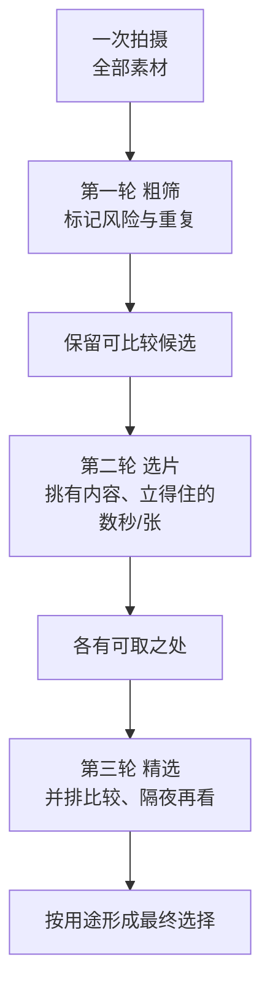

# 第 14 章 编辑与持续

> 拍摄是在积累素材，选片才是在做判断。一个人如果一直不肯坐下来选片，也就很难真正知道自己究竟拍得怎么样。

---

## 被发现的照片仍需编辑

2007 年，在芝加哥一场处理欠租仓储柜物品的拍卖会上，John Maloof 花 380 美元买下了一箱底片。他当时并没有想着要发现什么：他正在写一本关于自己所住社区的历史，需要一些旧日的芝加哥街景来配图，而这箱底片看上去也许正好能派上用场。箱子的原主人，是一位欠了仓储费的老太太，里面塞着大量底片，还有一卷卷从未冲洗过的胶卷。Maloof 把它们一点一点冲出来、扫成数字、慢慢归拢，越往下看越意识到，这些照片无论如何都不像是随手拍来贴进家庭相册的普通快照。

照片里装着的，是从五十年代一直延续到九十年代的芝加哥街头：孩子、工人、橱窗、路人，还有城市里那些不起眼的角落。构图是成熟的，对光的判断也很稳。可是奇怪的地方正在这里：拍下这些照片的那个人，从来没有在任何一次展览、任何一本出版物里出现过。后来 Maloof 一点点查下去，才查到了那个名字：Vivian Maier。她一辈子替人做保姆，没有结婚，也少有亲人，一生拍了数量惊人的照片，却几乎没有拿给任何人看过。直到她 2009 年去世之后，那些一直锁在箱子里的作品，才被带到了全世界面前。

Maier 的档案里不仅有未冲洗胶卷，也有她生前制作的印片，因此不能断言她从未观看、打印或筛选自己的照片。真正缺失的，是一套由她亲自确认、公开说明的最终选择与编排：后人无法知道她会怎样从十余万张底片里定义自己的代表作，又会怎样处理自拍、街头、彩色和不同年代之间的关系。档案后来被别人整理、展出和出版，观众看到的“Vivian Maier”也不可避免地包含收藏者、编辑与策展人的判断。[现存档案的数量与生前印片说明](references.md#photography-history)让这件事比“她从未看过自己的照片”复杂得多。

这本书的最后一章，讲的就是这件事。照片被拍下来，其实只是完成了一半；它们还需要被选出来，被放在一起观看，被排出一个先后的顺序，而人也正是在这一连串的取舍里，反过来一点一点认清自己是谁，然后带着这份新的认识，继续拍下去。

---

### 档案如何改变一位摄影师

*Edward S. Curtis, "Wishham girl, profile", 1911，收录于《The North American Indian》项目。Curtis 用多年时间拍摄北美原住民社群，留下大量照片、文字和录音，最后整理成二十卷书和二十卷大幅图集。这个项目在今天有很多复杂争议，但它也说明一件事：拍摄只是开始，漫长的整理、编排、出版和保存，决定了作品怎样进入历史。[图片来源与复用说明](image-credits.md#curtis-portrait)*

---

## 拍一千张，留下几张

拍摄数量与最终交付没有跨题材的标准比例。街头长期项目、棚拍人像、婚礼记录、体育任务和风光考察面对的职责完全不同，同一个摄影师在不同日子也会有巨大波动。这里真正值得接受的不是“1000 张必须只留几张”，而是拍摄量本身不证明成果：你仍要把相近画面放在一起比较，并按这次拍摄的用途决定什么值得进入成片、什么只作为工作素材保留。

许多人真正的损失，既不在器材，也不在参数，而恰恰在于不肯选片。照片拍完，导进硬盘，顺手做个备份，然后就再也不去看第二眼。一年下来，硬盘里堆着五万张文件，却没有哪怕一张被认真地拿出来和别的照片比较过。这样一来，拍得再多，判断力也很难真正长出来。摄影的进步并不只发生在按快门的现场，它同样发生在另一个安静的时刻：你晚上坐在屏幕前，心平气和地承认某一张其实不行，又承认另一张比你当初以为的要好得多。正是这种一次次的承认，慢慢把眼睛磨了出来。

---

## 拍摄与选片需要两种心态

会拍照和会选片，其实是两件不同的事，需要的甚至是两副不同的心思。按下快门靠的是临场的反应，是在电光石火之间，把身体、眼睛和手协调到同一处；而坐下来选片靠的却是延迟的、冷静的判断，是等当初那股兴奋压下去之后，再重新面对纸面上的结果。所以，一个人完全可能在街头极为敏锐，却在电脑前一塌糊涂；反过来，也有人拍得平平，却生着一双极准的选片的眼睛。后一种人里最有名的一个，马上就要出场：John Szarkowski 自己就是拍照出身，出过画册、拿过古根海姆奖金，可让他进入摄影史的，不是他拍的照片，而是他替别人做的选择。也正是因为这两件事可以分开，在很长一段历史里，选片根本就不是摄影师一个人的事。

在杂志摄影盛行的年代，摄影师拍回来的胶卷，往往要先经过图片编辑（picture editor，杂志社里专门负责从大量底片中挑选、编排照片的人）的手。摄影师负责在现场把画面抓住，图片编辑则负责在成百上千张里冷静地拣出那几张能上版面的，再决定它们怎样排布、谁大谁小、谁先谁后。这种分工并不是因为摄影师不会选，而是因为大家早就明白，一个刚从现场回来、还带着满身兴奋的人，未必是此刻最适合做判断的人。后来在美术馆的一侧，也有类似的角色。John Szarkowski 在纽约现代艺术博物馆主持摄影部近三十年，他挑选谁的照片、把它们怎样挂在墙上、放进哪一个展览，实实在在地影响了整整一代人对“什么才算好照片”的看法。这话并不空泛：1967 年，他在馆里办了一场后来被反复提起的展览，叫《新纪实》（New Documents），把当时还远谈不上家喻户晓的 Diane Arbus、Lee Friedlander 和 Garry Winogrand 三个人放到一处，等于替一种更冷、更贴近日常、不再急着替社会申辩的新式纪实盖了章。这三个名字后来都成了一个时代的坐标，而其中的 Winogrand，正是下面马上要说到的那位。他挑谁、不挑谁，就这样一点一点拨动了整条摄影史的走向。挑选本身，就是一种表达。

这份手艺之难，从一位公认极有天赋的街头摄影师身上看得最清楚。Garry Winogrand 大半生在纽约街头不停地按快门，七十年代以后迁往德州和洛杉矶，晚年常常是在车里隔着车窗继续拍，眼力之快、之准，几乎无人能及；然而越到后来，他拍得越多，看得却越少。1984 年他去世时，身后留下了两千多卷根本没有冲洗的胶卷，另有大量胶卷冲了却从未认真编选过，加在一起是几十万张几乎无人看过的画面。他把一生最好的力气都放在了“拍”上，却始终没有，或者说始终不肯，坐下来把它们选出来。

后来发生的事，把这个故事又推深了一层。他死后，正是前面提到的 Szarkowski 带着人钻进他身后留下的那几十万张底片，替他做了那次他自己终生回避的编辑，选出的照片办成展览、编成《来自真实世界的碎片》（Figments from the Real World）。争议随之而来：那些照片确实是 Winogrand 拍的，可那本书、那场展览体现的判断，是 Szarkowski 的——观众看到的“晚年 Winogrand”，究竟是他，还是编辑眼中的他？这桩公案没有答案，但它替本章立起了一句话：你不编辑自己的作品，迟早会有别人替你编辑，用他的眼光，替你说完你没说完的话。Maier 如此，Winogrand 也如此。

相比之下，Robert Frank 为《美国人》（The Americans）拍下了近两万八千张照片，最后只留下 83 张编进书里。这个数字背后是近两年的编辑：他把工作样片钉满墙壁，归堆、汰选、调换，从两万多帧一路收到几百张，再收到 83 张；1958 年，这本书先由出版人 Robert Delpire 在巴黎印行，次年的美国版配上 Kerouac 的序——摄影师与编辑、出版人的协作，把一堆底片最终锻成了一本书。他和 Winogrand 恰好构成了一组对照：拍摄的才能，并不会自动地带来选择的才能，而一本作品能不能立住，很大程度上正取决于后面这一步有没有真的做完。

选片之所以难，还有一个更隐蔽的原因：当你面对自己拍的照片时，你看到的从来就不只是照片本身。你会同时记起按下快门那一刻的一切，比如那天的冷、你等了多久、和画面里的人说过什么话、为了这一张你爬了多高的坡。所有这些记忆，都会悄悄地附着到照片上，让你把它看得比它实际的样子更好。可是别人翻到这张照片时，看到的只是一个平面的方框，你所经历的那一切，一丝一毫也传不过去。

于是就出现了一种系统性的偏差：那些让你费过力气、动过感情的照片，你总是舍不得；那些安安静静、其实更好的照片，反倒容易被你看轻。要抵消这种偏差，办法无非两个。一个是让照片先冷一冷，把它放上几天甚至几周，等那股身在现场的记忆淡下去，再回头看，那时你看到的就更接近别人看到的样子。另一个，是把它交给一双不在现场的眼睛，也就是一个当天并不在你身边、对这张照片没有任何记忆负担的人，他往往一眼就能看出，你舍不得的那一张，其实不过如此。

---

### 印相样张与图片编辑

在数字时代到来之前，选片这件事有一个具体的、看得见摸得着的场所，那就是印相样张（contact sheet，把一整卷底片直接印在一张相纸上、每一格只有指甲盖大小的小样）。摄影师冲好胶卷，先印出这样一张样张，然后拿一支红色或黄色的油性铅笔，趴在灯箱前一格一格地看：看中的，画上一个圈，或者在旁边打一个记号；不要的，就干脆划掉。这样一张画满了圈和叉的样张，其实就是一次选片留下的现场记录，它把摄影师当时的犹豫、取舍和最终的判断，一并保留在了纸面上。后来《马格南印相样张》（Magnum Contact Sheets）这样的书把 Cartier-Bresson 等许多名家的样张公之于众，读者这才第一次看清：不少传世的照片，并不是孤零零地一次拍成，它的前后左右还排着好几格相近的尝试，而真正被圈出来的，通常只有一格。当然也有例外——圣拉扎尔车站那张跳过水洼的照片，在样张上就是孤零零的一格，前后再无第二次机会——可正是这类例外反过来证明了常态：绝大多数好照片，是从一整条胶卷的反复挑拣里被选出来的。

样张还顺带说明了另一件事：在很长的时间里，选片并不是摄影师独自完成的。杂志社的图片编辑会拿到同一张样张，用自己的笔，在上面圈出和摄影师未必相同的选择。这中间的分歧，有时会演变成相当激烈的争执。W. Eugene Smith 为《生活》（Life）杂志拍摄的那些图片故事，比如乡村医生、西班牙村庄，直到今天仍被当作范本来看；可他和编辑部的关系始终紧张，因为他极其在意照片最后被怎样挑选、怎样剪裁、怎样排进版面。在他看来，把哪几张放在一起、谁大谁小、谁在左页谁在右页，和当初在现场按下快门同样要紧，甚至更要紧。他后来为了完整地掌控自己作品的编辑权，不惜和杂志决裂。Smith 是一个极端的例子，可他把一件事推到了明处：一组照片最终呈现成什么样子，是编辑这道工序决定的，而这道工序，值得一个摄影师去争。

---

## 分轮筛选，不急着判死刑

选片最好分成几轮，不要一上来就替每张照片判定生死。第一轮先标记明显的技术风险和重复帧：无意虚焦、不可恢复的削波、误触快门、重复连拍。先用 Reject 或色标隔离，不急着从磁盘永久删除，因为闭眼、截断、运动模糊和非常规构图有时恰好是表达，放进相邻画面或整组里才看得出。活动和委托拍摄还要区分“技术上不完美”与“客户仍然需要的记录”。这一轮可以较快，但速度由题材和风险决定，不必把一秒一张当成考核。

第二轮，才算得上是真正的选择。你要从粗筛之后剩下的照片里，进一步找出那些有内容、光是对的、构图立得住、主体也交代清楚的。这一轮每张不妨多看几秒，一边问自己：这张照片到底说了什么，和它旁边那些相似的照片相比，它又强在哪里。真正最容易让人下不去手的，往往不是坏照片，而是那一大批“也还行”的照片。它们并没有什么明显的毛病，问题只出在数量实在太多；如果全都留下，那么真正值得花力气去处理、去展示的少数照片，反而会被这一片“也还行”淹没得看不见了。

第三轮是精选，也是最见判断的一轮。你要从二三十张里再选出五到十张，决定这一组照片最后到底拿什么去代表自己。走到这一步，一张照片单看好不好已经不够用了，你还得掂量它和其余照片之间会不会重复，能不能担起开头、过渡或者收尾这样一个具体的位置。这一轮不必赶，可以先睡一觉，第二天用一双休息过的眼睛再看；也可以索性把小样印出来，一张张摆到桌上。照片一旦从屏幕变成了纸，许多原先在发光的屏幕上被掩盖掉的问题，会忽然变得刺眼而明显。

选片花掉与拍摄相当、甚至更多的时间并不反常，但没有“1000 张对应二十分钟”的通用效率。先给自己一个不被打断的时段，记录这一轮的筛选条件；若发现为了赶速度开始漏看手势、边缘和相邻帧关系，就应放慢，而不是追求一个漂亮的每小时张数。

把这几轮合到一处看，选片其实是一个不断收窄的漏斗：每一轮都放掉一批，留下的越来越少，标准却越来越高。

为了让这个漏斗走得顺，工具上的一点安排很有用。多数照片管理软件都提供三套彼此独立的标记：旗标（flag，只分留用和弃用两种状态）、星级（一到五颗星）和色标（用颜色分类）。一个稳妥的做法，是让每一轮各用一套：第一轮只用旗标，快速地把弃用的打掉；第二轮在留下的照片里打星，三星以上算进入候选；第三轮再用色标，把最终要用的那几张单独标出来。这样一来，每一轮的判断都被单独记录了下来，你既不会把粗筛和精选混作一谈，回过头去也能清楚地看到，自己是在哪一步把某张照片放掉的。

选片走到后半程，最有效的一个动作是并排比较。两张看起来差不多的照片，单独一张张地看，你很难说清到底该留谁；可一旦把它们并排摆在一起，高下常常立刻就分出来了：这一张的手势更松弛，那一张的眼神更聚拢，另一张的边缘恰好多切进来一个碍眼的东西。人的眼睛判断相对的差别，远比判断绝对的好坏要准，所以与其对着一张照片纠结它够不够好，不如把相近的几张拉到一处，让它们互相比出一个高下来。

还有一个听上去有点奇怪、却意外管用的办法：把留下这张照片的理由，出声说出来。当你不得不用一句完整的话讲清楚“我留它，是因为……”的时候，那些似是而非的理由会立刻显出破绽。如果你说来说去，只能说出“因为这张来得不容易”或者“因为当时光线正好”，那多半说明你留的是那段记忆，而不是这张照片本身。反过来，要是你能干脆地说出“因为她回头的这个角度，把整条街的纵深一下子带了出来”，那这张照片大概就真的立得住。

---

## 用五个问题审问一张照片

每一张照片在进入精选之前，都不妨拿五个问题去问它一遍。第一，它到底说了什么？像“我在巴黎”这样的说法太宽泛了，宽泛到根本落不进具体的画面里。可如果你能把它说成“她在清晨回头看我的那一刻”，或者“雨停之后，街边第一块被阳光重新照亮的石头”，那么照片里承载的内容顿时就具体了许多。照片需要的是具体，一旦它只能被概括成一句空泛的话，画面本身多半也空。

第二，它和你其他的照片，是否真的不一样？假如硬盘里躺着一百张同样角度的餐桌、一百张同样姿势的自拍、一百张同一只宠物在睡觉，那你正好可以慢慢比一比，看哪一张才真的带着属于它自己的那点表情，而不是又一次机械的重复。第三，它在技术上，有没有你无法接受的硬伤？虚焦、手抖、高光爆掉、对焦落在了不该落的地方，这些都要诚实地对待，不能因为舍不得就假装看不见，除非这种虚、这种抖本身就是你有意为之的表达。第四，构图里有没有明显的干扰？人头上凭空长出一根电线杆，背景抢得比主体还热闹，水平线是歪的，身体被边框切得别扭难看，这些都会实实在在地削弱一张照片。第五，它到底能不能放进你自己的图册？这一点要想清楚，因为社交平台上那种即时的、随手点出来的反馈，和一本作品集里长期稳定的标准根本不是一回事，而后者要苛刻得多。

---

### 先分组，再排序

从“选出五到十张”到“排出一个顺序”之间，其实还夹着一步，编辑实务里天天在做，教科书却很少写，就是成组。它对付的是这样一种局面：你手里有几十张各自都过了关的候选，可它们并不天然属于同一件事。做法朴素得很，也有效得很：把小样统统打印出来，摊满一张大桌子，或者用胶带贴上一面墙，然后往后退两步看。不要急着排顺序，先归堆——哪些照片在说同一个母题，哪些共享同一种色调或情绪，哪些拍的是同一类场景，让它们各自聚拢。堆归好了，几件事会自己浮出来：有的堆厚厚一沓，彼此呼应，分明已经是一个系列的雏形；有的堆只有孤零零两三张，说明那个方向你才刚开了头，该带着它回去接着拍；还会剩下几张哪一堆都进不去的单张——这是成组这一步最教人为难的地方——它们可能张张都好，可一张再好的照片，如果和整组格格不入，放进去只会把别的照片带乱。舍得把好照片留在组外，是编辑这门手艺里最反直觉、也最见功力的一刀。职业摄影师工作室里那面钉满工作样片的墙，做的正是这件事：墙比屏幕大，站得远，看的是照片和照片之间的关系，而不是任何一张自己。

一组照片，光是选好了还不够，它们还需要一个顺序。二十张照片并排放在一起，绝不只是二十次孤立的“这张不错”简单相加；它们彼此之间，本就存在着明暗的起落、远近的推拉、色彩的呼应、人物与场景的交替，还有情绪的一起一伏。怎样安排先后，本身就是一种表达。Robert Frank 的《The Americans》就没有把自己最有名的那些照片简单地摆到最前面去撑场面，而是在旗帜、汽车、餐馆、葬礼、路人和家庭之间，一点一点组织出一种属于美国的、说不清却闻得到的气味。Alec Soth 的《Sleeping by the Mississippi》同样没有把照片排成一本旅行的流水账，而是让人、房间、河流、招牌和空地这些元素，在前后之间相互呼应、彼此接续。

真正动手排序的时候，可以先从明暗入手。如果一连十张都亮得差不多，或者一整组从头到尾都沉在暗处，那么翻看的人很快就会失去节奏。接着再看远近，远景、中景和特写之间要留出呼吸的余地，不能一路挤在同一个景别上。一张人物密集、满满当当的照片后面，不妨放一张空旷的场景，那片空场会因为前一张的拥挤，反而显出分量来。颜色也是同样的道理，在一组低饱和的照片里偶尔跳出一小块红，往往比每一张都艳更有力量，因为力量常常来自对比，而不是来自堆砌。开场的那张照片，任务是把人稳稳地带进来；收尾的那张，则要让人合上书之后，还愿意在原地多想一会儿。《The Americans》的开与合，正是教科书式的示范：开篇是新泽西 Hoboken 的一场游行，两个女人站在窗口，其中一人的脸恰好被一面悬垂的星条旗整个遮住——国旗与看不见的脸，全书要说的话在第一页就压了进来；收尾则是路边晨光里 Frank 自己的车，妻子和孩子睡眼惺忪地坐在里面——看了一整本别人的美国之后，最后一张把你交还给这个疲惫的旅人自己。至于中间，允许有过渡的段落，不必强求每一张都像代表作那样耀眼，可即便是过渡，每一张也都得有它非在这个位置不可的理由。

条件允许的话，还是尽量把照片打印出来。用不着多大，A5 的小样就足够了，把它们一张张摆到桌上，然后动手去移动、去交换、去拿掉某一张，再把它放回去。屏幕上的那种拖拽实在太轻，而纸摆在桌上却有一种分量，它会逼着你慢下来，认真对待每一次挪动。给每一张照片配上一句话，也很有用；如果你对着一张照片，怎么都写不出那一句话，这本身往往就是一个信号，说明它在这一组里的位置其实还没有真正想明白。

---

## 图片故事需要起伏

一组照片如果不只是并置，而是要讲一件事、带着人走一段，那它就走向了图片故事（photo essay，用一组照片讲述一个主题或一段经过的形式）。图片故事有它自己的一套语法，这套语法是在杂志摄影的年代被摸索出来的，直到今天依然管用。一个成型的图片故事，往往先有一张交代环境的照片，把人放进一个具体的地方和情境里；接着是若干张推进的照片，有中景、有细节、有人物的脸，一点一点把事情铺开；当中通常要有一两张分量最重的、足以立住整组的照片；最后再用一张收束的照片，把人稳稳地送出来。W. Eugene Smith 当年替《生活》杂志做的那些图片故事，几乎都能拆出这样一副骨架，而正是这副骨架，让一组照片从“很多张好照片”变成了“一件作品”。

下面这张表，把这套结构大致列了出来。它不是必须遵守的公式，更像一个在你排不顺的时候可以回头对照的清单：

| 位置 | 作用 | 常见的画面 |
| --- | --- | --- |
| 开篇 | 交代环境，把人带进来 | 大场景，能看清地点和情境的照片 |
| 推进 | 铺开事情，建立节奏 | 中景、动作、人物之间的关系 |
| 细节 | 放慢，给出具体 | 手、物件、局部，一个安静的近景 |
| 核心 | 立住整组的分量 | 最强的那一两张，情绪或信息的高点 |
| 收尾 | 送人出去，留下余味 | 空场、背影、渐远，或一个回望 |

需要说明的是，这套结构不该被当成填空题来用。真正好的图片故事，往往会在某个地方故意打破它：把最强的一张提到最前面，或者干脆不给任何交代，就把人径直扔进画面里。可即便要打破，你也得先知道自己在打破的是什么，正如先熟悉了规整的句子，才谈得上写出漂亮的破格。

照片和照片之间，还常常靠一些看不见的线互相勾连。一张照片里有一只摊开的手，翻过一页，另一张照片里恰好也有一只手，姿势相似，处境却不同，这种前后的呼应就像诗里的押韵，看的人未必说得出，却分明感觉到了。有经验的编者会有意识地埋下这样的线：一个圆呼应另一个圆，一束光呼应另一束光，一个朝左的背影后面接一个朝右的正面。仍拿《The Americans》作证：星条旗这个母题在全书里一次次变着面目回来——遮住脸的旗，透光的旗，游行里的旗，酒吧墙上的旗——83 张照片就是被这样几条暗线缝成一本书的，而不是靠张张精彩硬撑起来的。做摄影书的人为此往往会先做一本“样书”（dummy，用便宜的纸把整本书的顺序、大小和翻页节奏先粗粗地做出来的试验本），拿在手里一页页地翻，感受实际的翻页节奏，再一遍遍地调整。很多传世的摄影书，背后都压着十几本甚至几十本被推翻掉的样书。

---

## 打印是另一种观看

前面几次提到把照片打印出来，都还只是把它当成排序的辅助工具；可打印这件事，本身就值得单独说一说，因为它会反过来教你怎样看照片。屏幕和纸是两种根本不同的介质。屏幕是自己发光的，它把画面从背后照亮，动态范围很宽，还带着一层数字的通透，而这层通透，会不动声色地替照片里那些其实并不完美的地方打掩护：暗部明明已经堵死、糊成了一团，可在明亮的屏幕上，你依然隐约以为那里是有细节的。纸却不发光，它只能把落在自己身上的光反射回来，能承载的明暗范围要窄得多。于是同一张照片，屏幕上看着层次丰富，一旦印到纸上，暗部堵、高光飘、颜色发灰这些问题，就全都无处躲藏地显了出来。

颜色也是同一个道理。显示器能显示的色域，通常比打印能还原的要宽，一块在屏幕上鲜艳夺目的红或蓝，印到纸上很可能就发闷、发灰，失了神采。专业的流程里有一道叫软打样（soft proofing，借助 ICC 色彩配置文件，在屏幕上预先模拟照片印到某种纸上会是什么样子）的工序，正是为了提前把这层落差看见，免得洗出来才发现颜色全变了。可对多数人来说，用不着这么讲究，只要真的动手去印，哪怕是用最普通的打印机印在最普通的纸上，你也会立刻撞见许多在屏幕上永远发现不了的问题。这也正是打印最大的价值：它逼着你诚实。

还有一层落差来自尺寸。在屏幕上，你可以随手把照片放大到满屏，去欣赏某一处的锐利，也可以缩成一枚缩略图，掩盖掉整体的松散。可一张印出来的照片，尺寸是固定的，它逼着你在同一个距离、同一个大小上，一次看它的全部。构图撑不撑得住、主体够不够分量、多余的东西碍不碍眼，在一张固定大小的纸面前，都变得无从回避。

| | 屏幕 | 纸（打印） |
| --- | --- | --- |
| 成像方式 | 自身发光（透射） | 反射环境光 |
| 动态范围 | 宽，暗部容易显得有细节 | 窄，暗部堵、高光飘一目了然 |
| 色域 | 通常更宽，颜色更艳 | 较窄，鲜艳的颜色容易变闷 |
| 尺寸 | 可随意放大缩小 | 固定，逼你一次看全 |

哪怕你从不打算办展览、出画册，也值得每隔一段时间就把自己满意的照片印出几张来，摆在桌上看上几天。屏幕上看一百次，抵不过纸上认真看一次。如果想再往前走一步，可以试着做一本 zine。zine 是一种自己动手做的小册子，印量小、成本低、装订随意，甚至用普通打印机印几张纸、对折装订就能成型。它的意义不在精美，而在于它逼你把一件事从头做到尾：你得选出照片，排定顺序，决定开篇和收尾，还得给它一个封面、一个题目。做完这一整套，你手里就有了一件真正完成了的东西，而完成本身，会带来一种在硬盘里翻看文件时永远得不到的踏实。日本在上世纪六七十年代曾有过一股自制摄影杂志的风潮，森山大道那一代人，就是靠这种粗粝、廉价、印数很少的小册子，把作品一本本地做了出来。器材可以等，题材可以慢慢找，可“把一件作品彻底做完”这种经验，越早尝一次越好。

比 zine 再进一步的呈现形式，是展览——本章开头写 Szarkowski，他改变摄影史用的正是这个形式，可它常被业余拍摄者当成遥不可及的事，其实不然。展览不必从美术馆开始：社区活动中心的一面墙，常去的那家咖啡馆，图书馆的走廊，都挂得下十来张裱好的照片，谈下来往往只需要开一次口。而一旦真的要把照片挂上墙，一整套新的编辑课题就会找上门：尺寸决定观看距离，一张适合捧在手里细看的照片，放大到一米宽可能就散了，反过来有的照片非大不可；装裱和留白替照片划定了呼吸的边界；展墙上照片的间距、高低和先后，就是空间里的排序，观众从左走到右，等于替你翻了一遍书。哪怕只办一次十张照片的小展，站在墙前看陌生人在哪一张前面停下、在哪一张前面径直走过，你得到的反馈，都是屏幕上的红心永远给不了的。

---

## 建立每天一张的节律

每天选出一张照片，是所有小习惯里最有效的一个。做法很简单：晚上把当天拍的照片从头看一遍，从中选出最好的一张，再写下一句话，说清楚为什么偏偏是它。如果这一天恰好没有拍，那就从过去一周里翻出一张以前没有认真看过的来补上。这样坚持 365 天之后，你手里未必真有 365 张称得上作品的照片，可是你实实在在地做过了 365 次判断。这样的训练远比盲目地多拍一万张要有用得多。

我更推荐用一本实体的笔记本来做这件事。把 4×6 英寸的小照片一张张贴进去，在旁边写上日期、地点，再加一句当时的判断。这样过上一年，等你重新翻开它，你会清清楚楚地看到：自己究竟总是被什么吸引，哪些题材在不知不觉里反复出现，哪些光你怎么都拍不好，还有哪些照片当时明明不怎么喜欢，后来反倒一直留在了心里。硬盘里的文件太容易在层层叠叠的文件夹深处悄悄消失，而纸不一样，纸会把时间实实在在地留住。

既然说到了硬盘，备份这件事也就绕不过去了。数字照片其实比底片要脆弱得多，一块硬盘用上三五年，说坏就坏；进水、被盗、误删、系统出错，任何一样都可能在一瞬间带走你好几年的照片。所以最低限度的保险，是留三份：电脑里一份，外接硬盘里一份，再有云端或者异地的一份。遇到重要的拍摄，最好当天就多拷一份出来，千万别拖到那个永远不会到来的“有空再整理”的时候。归档同样可以从导入的那一刻就开始做起，按照年月、项目和地点把照片理顺，再给那些真正满意的照片加上星级或者关键词。说到底，一张你需要时怎么也找不到的照片，和一张已经丢掉的照片，其实相差无几。

这条“留三份”的原则，在摄影圈里有一个更完整的说法，叫 3-2-1 备份原则，它最早是在数字资产管理（digital asset management，简称 DAM，指对大量数字文件的组织、命名、存储和长期保管）的讨论里被总结出来的，如今已经成了公认的底线。它说的是三件事：任何重要的文件，至少要保留三份；这三份要分布在两种不同的介质上；其中至少一份要放在异地。

| 数字 | 含义 | 为什么 |
| --- | --- | --- |
| 3 | 至少三份拷贝（一份原件，两份备份） | 单独一份可能损坏，三份同时损坏的概率极低 |
| 2 | 存放在两种具有不同故障模式的介质或系统上 | 避免一次硬件、软件、账号或同步错误同时波及全部副本 |
| 1 | 至少一份放在异地 | 火灾、被盗、水淹会一次带走同一处的所有东西 |

这三条各自在堵一种故障。留三份，是为了不让单点损坏决定全部；使用不同介质或系统，是为了分散硬盘故障、文件系统错误、账号锁定、误同步和勒索软件等风险；异地副本则应对火灾、被盗和水淹。云端只有在保留历史版本、能从误删和勒索中恢复，并且你实际测试过恢复流程时，才算可靠备份；把本地删除立即同步到云端的网盘，本身不等于备份。重要档案还应定期校验、抽样恢复，并保留一份离线或不可被日常账号直接改写的版本。

有一个常见的误会，需要在这里澄清：磁盘阵列（RAID，把多块硬盘组合起来、让其中一块损坏时数据仍能读取的技术）并不等于备份。RAID 防的是硬件层面某一块盘的突然故障，让你在换盘的时候不至于停摆；可它防不住误删，防不住文件被覆盖，也防不住勒索软件，因为你在一处做的删除和改动，会被立刻同步到阵列里的每一块盘上。RAID 保的是“不中断”，而不是“不丢失”，把它当成唯一的保险，迟早会酿成难以挽回的损失。

备份解决照片还在不在，命名和归档解决几年后能否找得到。可以从导入时按日期、项目或地点建立稳定层级，再让文件名带日期与唯一流水号。使用 Lightroom 等目录软件后，最好在软件内部移动或重命名，让目录同步更新；若在文件系统外移动，关联可能暂时断开，但星级、关键词和调整通常仍留在目录或边车文件里，可以通过定位新路径重新链接，并非立即消失。真正危险的是只备份原片却漏掉目录、边车、预设和项目文件，因此这些都应进入同一套备份与恢复测试。

---

## 热情退去以后靠什么继续

最初的新鲜感迟早会退，但它可能发生在几个月、两年或十年之后，并没有统一关口。常见的停滞往往与三件事有关：没有目标，没有反馈，也没有正在推进的项目。没有目标，出了门便不知道要验证什么；没有反馈，就难以判断是否进步；没有项目，照片始终一张归一张，积不成一件东西。器材知识和拍摄数量都不能替代这三项，真正需要建立的是一个可持续的回看与推进机制。

解决的办法，是替自己找一个能持续做上半年以上的题目，而且越具体越好。“城市”这个题目太大，大到无从下手，你可以把它一路收缩到“我每天通勤经过的那三站地铁”；“家人”也失之宽泛，可以落到一个更实在的说法，比如“我妈在厨房和阳台之间的一年”；“街头”本身很容易拍散，那就先把它框定成“周日早上六点到九点、同一条街”；就连“天气”这样飘忽的题目，也能收窄成“雨天的窗、伞，还有地面上的反光”。要紧的是明白，限制并不是一种束缚；恰恰相反，正是这些限制会逼着你一次又一次回到同一个地方，直到有一天，你终于看见了从前无数次路过却始终没有看见的东西。

Stephen Shore 当年开着车横穿美国，拍的无非是路边的便利店、汽车旅馆和停车场，这些再寻常不过的东西，最后却汇成了《Uncommon Places》。森山大道反反复复地拍新宿，一拍就是几十年，居然始终没有把这一个题材拍尽。Sally Mann 则用很长的时间，去拍自己的孩子、自己的家庭，还有弗吉尼亚那片土地。这些例子说的其实是同一件事：一个项目，能把你从“今天随便拍点什么”，转变成“今天继续把这件事往前推一步”。与此同时，它还让你在一年之后回头看时，看到的是一个相对完整的结果，而不是一堆四散零落的照片。

做长期项目，还有一个次序上的关键，值得单独说破：不要拍完了才开始编，要边拍边编。实际的做法是给项目立一面墙——真的墙或者一块软木板都行——每隔一两个月，把新拍的工作样片贴上去，和旧的放在一起看。这一看，缺口会自己开口说话：整面墙都是人物的近景，独独缺一张交代环境的大场面；情绪一路紧绷，缺一张能让人喘口气的安静空景；某个反复出现的母题，还差一张能把它挑明的照片。把这些缺口记成一张清单，下一次出门，你就不再是漫无目的地拍，而是带着任务去补。前面那张图片故事的结构表，在这里正好反过来用：不是拍完了拿它去套，而是拿它当体检单，去查自己这一组还缺哪个位置的照片。编辑因此不再是项目终点的一道工序，而是一路驱动着拍摄往前走的那台发动机——Frank 在路上拍《美国人》的两年间，也是一边把样片钉上墙、一边决定下一段路往哪里开的。

约束之所以是燃料而不是枷锁，从两个走到极端的例子里看得更清楚。Bernd 和 Hilla Becher 这对德国夫妇，几十年里只做一件事：拍工业建筑。水塔、高炉、煤仓、瓦斯罐，他们一座接一座地拍，而且拍法苛刻到近乎刻板，永远是正面、平光、阴天、同样的高度、同样的距离，把每一座建筑都放在画面正中，像标本一样端端正正地记录下来。然后他们把同一类的建筑几张几张地并排挂在一起，于是那些原本平淡无奇的工业构件，在彼此的对照之下，忽然显出了各自的性格，也显出了一整套隐秘的形态谱系。这套做法后来被称作类型学（typology，把同一类对象用完全一致的方式反复拍摄、再并置比较的方法），它几乎把约束用到了尽头，可正是这份近乎偏执的约束，反倒成全了旁人难以企及的深度。

另一头，Nan Goldin 的做法几乎完全相反，背后却是同一个道理。她把镜头对准自己身边的朋友、恋人和自己的生活，年复一年地拍下聚会、亲密、争吵、病痛与失去，最后汇成了《性依赖的叙事曲》（The Ballad of Sexual Dependency）。她的约束不是拍法上的整齐划一，而是题材上的极度收束：只拍我真正身在其中的这一小圈人和这一段生活。一个是把方法收到极窄，一个是把题材收到极窄，可它们指向的是同一件事：你一旦替自己划定了一个足够窄、又足够真的范围，并且肯在里面反复地待下去，深度自己就会慢慢长出来。反过来，什么都想拍的人，往往什么都拍不深。

把作品公开出来，同样很重要。社交平台的门槛很低，反馈也来得快，这是它的好处；可它的算法会在你毫无察觉的情况下，悄悄把你往一个方向上引，去拍那些更容易被点赞的东西。于是你会渐渐偏向更亮、更艳、更容易在一秒钟之内被看懂的照片。这种反馈不是没有用，只是不能全信。与之相对，Newsletter 和长文章要慢得多，而慢自有慢的好处：它们会逼着你为照片写下说明。而一旦你动手去写这段说明，你的判断也会跟着清晰起来：你会不得不说清楚，这张照片为什么放在这里，它和上一张、下一张之间究竟是什么关系。单单是这个书写的过程，就足以把许多原本含糊的选择一并带到明处。

个人网站给你的自由度是最高的。你得亲自决定怎么分组、怎么排序、怎么留白、用什么字体，而这每一个看似琐碎的选择，其实都在悄悄训练你的编辑能力。若是更进一步，把作品打印成一本小书，或者索性挂到家里的墙上，那么它带给你的反馈也最深。在屏幕上看一百次，和把一张 A4 大小的照片放在书桌上、一连看上一周，完全是两种不同的关系。照片一旦离开会发光的屏幕，很多问题就会变得诚实得多：暗部是不是堵成了一团，颜色是不是飘得不着地，构图到底撑不撑得住，还有哪些照片你一开始很喜欢，摆上三天却怎么看都腻了。

如果你身边恰好有一个愿意认真看你照片的人，那也是一件很好的事。这个人不必名气总比你大，也不必比你更懂器材，但他得有判断力，能够在短短几分钟里就指出，一组照片里哪一张是弱的，以及它究竟弱在什么地方。只会一味称赞的朋友，固然让人听着舒服，可这种舒服很难换来真正的进步。

这样的人不必靠运气碰，可以主动去找。几个人组一个看片小组，每月聚一次，每人带一组打印的小样，轮流摆上桌——规矩定简单点就行：先让别人说，作者最后才开口解释，因为照片将来挂出去时，你不可能站在旁边替它说话。更正式的一档是作品集评审（portfolio review），许多摄影节都设这个环节，你带二十张照片，坐到编辑、策展人或摄影师对面，听二十分钟不留情面的意见；花一次报名费，常常比自己闷头摸索一年更快。至于怎么听意见，也有一条要诀：认真听问题的描述，警惕直接给出的解法。观众说“这张我看不进去”“这两张放一起我糊涂了”，这是可靠的信号，因为感受骗不了人；可他接着说“你应该裁成方的”“你该去拍黑白”，那只是他的偏好，听听就好。还有一条经验之谈：三个人各自都在同一张照片前停下来皱眉，无论他们给出的理由多么五花八门，那张照片必定藏着问题。

---

## 器材升级要回答具体问题

器材这件事，先别急着换。很多人在不同阶段都会把停滞归因于画幅、镜头或系统；这些念头很正常，新工具也确实可能解决明确问题。可每换一次器材，都要重新熟悉操作与边界，观看和选片能力不会随机器自动增长。升级前最好把问题写成可以验证的一句话，例如“现有自动对焦无法稳定跟住某类运动”“这项委托需要更高同步速度”，而不是只写“想拍得更好”。

摄影上的进步从来不是一条笔直向上的直线。刚开始学习参数和操作时，反馈直接，进步容易被看见；技术稳定之后，评价标准却会变复杂，你可能因为看过更多好作品，反而更清楚自己的差距。有人很快找到长期题材，有人多年后才改变方向；职业任务、生活阶段、观看积累和投入时间都比“拍了几年”更能解释变化。所谓三到五年形成偏好、五到十年出现作品，只能算个人观察，不能拿来替任何人的成长排工期。

要在三年、五年、十年这样的尺度上一直拍下去，靠的不是一时的热情，而是把摄影变成一种习惯。热情是会退潮的，遇上忙碌的一段日子，或者几次不顺的拍摄，它很容易就凉了下去；可习惯不依赖心情，它只依赖一个固定的、低到你几乎不会拒绝的门槛。与其给自己定下“这个月要拍出一组好照片”这样一个既沉重又容易落空的任务，不如把它降成“每天出门口袋里带上相机”“每个周末去同一个地方走一趟”这样一件小事。任务是有成败的，一旦没完成就带来挫败，挫败累积起来就成了放弃的理由；而习惯没有成败，它只有做与没做，今天没做，明天接着做就是了。真正能拍很多年的人，多半不是比别人更有毅力，而是他们很早就想通了这一点：把标准放在作品上，把门槛放在行动上，让拍照这件事本身，轻到可以天天发生。

每到年底，都可以给自己安排一次回望。从这一年里选出最好的 20 张照片，然后看一看，它们究竟集中在哪些题材、哪些光线、哪些地方。看的时候，不要只问哪一张最漂亮，更该问的是，哪些题材你其实一直在回避，哪些场景你反复去拍却总也拍不好，还有哪些照片当时看着平平无奇，几个月过去，反倒一直留了下来。与此同时，把这一年看过的画册和展览写下来，把自己最大的一个教训写下来，也把下一年想做的项目写下来。几年之后，这些零散的文字会渐渐汇成一本属于你的摄影日志，它记录下来的就不只是照片本身了，还有你看待这个世界的方法，是怎样一年一年慢慢发生变化的。

---

## 摄影最终仍是减法

让我们回到第一章曾经讲过的那件事：按下快门，本质上其实是一次减法。拍照这件事，从头到尾都是在不停地决定，究竟要丢掉什么。

按快门的那一刻，你决定把取景框以外的一切丢掉；选片的时候，你决定把那些相似的、薄弱的照片丢掉；做项目的时候，你又决定暂时不去碰某些题材，好把有限的时间，留给自己真正想追的那一件事。到了后来，你会发现很多人拍的题材变少了，用的镜头也变少了。这并不一定意味着他的路越走越窄；恰恰相反，这更可能说明，他终于厘清了，自己究竟愿意反反复复地去看什么。

持续地拍，认真地选，诚实地看自己。这三件事都不需要多么昂贵的器材，可又都需要同一样东西，那就是时间。持续地拍，是为了让你的眼睛始终和这个世界保持接触，不至于生疏；认真地选，是为了不让你把所有按下快门的东西，都悉数误认成作品；诚实地看自己，则是要你承认，自己到底喜欢什么、又总在逃开什么、哪些地方其实还远远不够好。这件事不必急，你用不着赶在一年之内就给自己下什么结论。不妨把时间放得久一点，哪怕是十年。十年以后，你会非常清楚地看见，从现在开始做的这些看似微不足道的小决定，是怎样一点一点，慢慢改变了你的眼睛。

!!! example "案例推演：十二张相近照片只留一张"

    第一轮先标记技术风险与重复帧，不急着永久删除；第二轮把候选缩略图并排，看动作是否完整、人物与背景是否分开；第三轮放大检查眼神、手势和无意硬伤；最后把入选者放进整组里，看它是否重复了上一张的信息。

    如果两张仍不分胜负，先都保留但标成同一组候选，隔一天再看。编辑的目标不是证明其中一张“绝对更好”，而是让每张入选照片在整组中承担不可替代的工作。

---

## 练习

连续 30 天，每天选一张照片，并写一句选择理由。第 30 天把这些照片和文字一起看，找出你反复被什么吸引。

打开过去 12 个月的照片库，完成一次完整选片：粗筛、选片、精选，最后只留下 20 张。给自己至少一个下午，不要急。

从那 20 张里再选 10 张，打印小样，在桌上排出一组顺序。至少试三种排列，比较开头、结尾和中间节奏有什么不同。

立一个 30 到 90 天的小项目，用一句话写清楚拍什么、在哪里拍、什么时候拍。贴在桌前，并按时回看进度。

写一篇 500 字的年度摄影回望：今年主要拍了什么，哪张最满意，最大的教训是什么，接下来一年想继续什么。存好，明年再写。

---

这本书到这里，就结束了。

你要先真的看见，然后才谈得上把它拍下来；拍完之后，还得把照片一张张选出来，放到别的照片旁边去比较；等比较过了，再带着这份新长出来的判断，回到世界里继续拍。明天出门时，把相机带上；晚上回来，认真选一张，写下为什么留下它。
