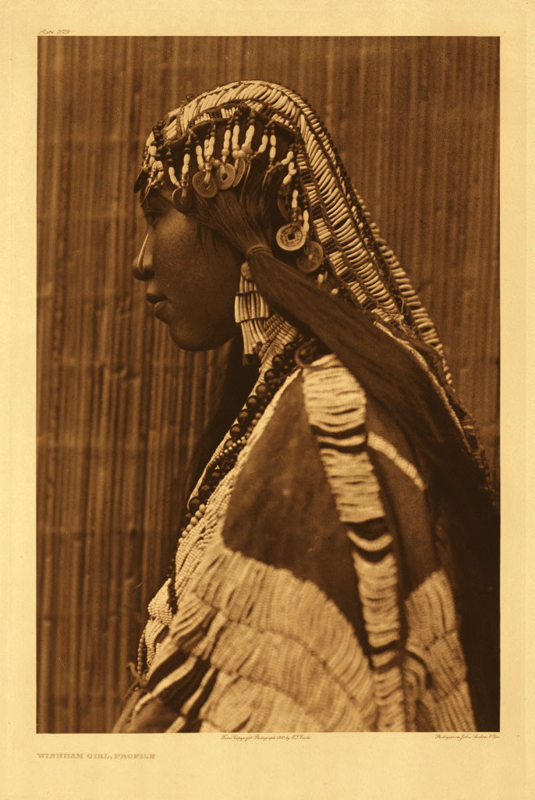

# 第 14 章 编辑与持续

> 拍是输入，选是判断。不会选片永远不会进步。

---

2007 年 4 月，芝加哥一个房屋拍卖会上，一个叫 John Maloof 的本地历史研究员花了 380 美元买下一箱黑白底片。卖方是一个被欠租金的仓库主，箱子里是某个老太太多年不交储物费留下的东西。Maloof 不知道这箱子里是什么，他买下来是为了里面可能有的旧芝加哥街景照片，能用在他正在写的一本社区史。

底片有 10 万张，外加 30 万张未冲洗的胶卷。Maloof 一张一张冲、扫描、看 - 用了三年。

他越看越觉得不对劲。这些不是普通的家庭快照。**这是 50 年代到 90 年代芝加哥街头摄影的一个完整作品库**。每一张构图都是有意识的，光的判断是熟练的。但这个摄影师从来没有在任何展览、出版物、艺术圈里出现过。

他追到拍卖单的源头，发现这是一位叫 Vivian Maier 的保姆。她一辈子给芝加哥几个富人家带孩子，没有结婚，没有亲人，没有发表过任何作品。**她拍了 15 万张照片，但她活着的时候几乎没人见过任何一张**。

她 2009 年在贫困中去世，几个月之后，Maloof 把她的作品带到 Magnum，到 MoMA，到全世界。今天 Vivian Maier 是 20 世纪美国最重要的街头摄影师之一。

我每次想到这个故事都不知道该感叹还是叹息。**Maier 拍了一辈子，但她从来没有「编辑」过自己的作品**。她不知道哪些是好的，因为她从来没有放在一起看过。她的天才被埋了 50 年，被一个完全偶然的人挖出来。

如果她活着的时候做过编辑会怎样？

我们永远不会知道。但**这本书的最后一章是关于这个的** - 拍下来不够，要选出来，要看见自己拍了什么。

---

*Edward S. Curtis, *The North American Indian* 项目，1907-1930。Curtis 30 年时间走遍北美，拍了 80 多个原住民部落，留下 4 万多张照片。这是一个普通人不可能完成的工程 - 跨越美国的 22 个州、大量野外旅行、自己负担费用、和 80 多个部落建立信任、亲自做湿版冲洗。他最后整理出 20 卷书 + 20 卷大幅 portfolios。他卖完房子 + 离婚 + 健康崩溃换来这一组作品。**这就是「编辑自己」的极致版** - 一辈子做一件事，做完。 (Wikimedia Commons, 公有领域)*

---

去问任何一个十年以上的摄影师：你拍 1000 张里出几张？

答案大致是：街头 1-3 张，人像（一组拍摄）5-15 张，风光（一次出行）1-5 张，婚礼一场 30-80 张。**一万张里出几十张是正常的**。

新手最大的损失不是器材不够好、不是技术不够强，**是不选片**。拍完导入备份就不管了。一年下来硬盘里 5 万张，没一张被仔细看过。

---

选片不是一次完成。一组照片的选片是三层漏斗。

**第一层：粗筛**（Cull）。任务：从 1000 张降到 100 张。标准：模糊（不是故意虚化，是失败的对焦）、严重曝光错（爆炸过曝、死黑欠曝）、主体被裁掉、闭眼、表情明显失败、几乎重复的片（连拍里挑一张代表）。工具：Lightroom 的 Pick / Reject（X / P）、Photo Mechanic（专业 Cull 软件，速度比 Lightroom 快 10 倍）、大屏 + 键盘单手操作。**速度：1 秒一张。1000 张 15-20 分钟搞定**。不要过度纠结：第一遍粗筛只剔除技术废片。审美选择留到下一层。

**第二层：选片**（Select）。任务：从 100 张降到 20-30 张。标准（要全部满足）：主体明确、构图成立、光对、没有「差一口气」。**这一层是真正的选片**。每张要看 5-10 秒，问自己：这张说了什么？它和别的相比有什么独特？把它放进我的图集会丢人吗？工具：Lightroom 的星级（1-5 星）或色标。我的工作流：粗筛后留下的标 Pick，第二轮里好的标 3 星，最好的标 5 星。

**第三层：精选**（Final Cut）。任务：从 30 张降到 5-10 张。**这一组的最终代表作**。标准：一张代表一种气质，多张片之间互相不重复，整组节奏（开场、过渡、高潮、收尾），你愿意把这张挂墙。这一层最难。慢慢做。**做完后睡一觉，第二天再确认**。工具：把 30 张打印（A5 小图也行）摆在桌上，物理排列、移动。

一次拍摄 1000 张，粗筛 20 分钟、选片 30 分钟、精选 1-2 小时 - **总共 2-3 小时**。新手听到这个会觉得「不可能花这么多时间」。专业摄影师每场都花这么多时间。**选片就是工作的一半**。

---

每张片放进精选之前问自己 5 个问题。

**这张说了什么**？如果你要用一句话描述这张片，那句话是什么？说不出 = 这张没有内容 = out。不是「我和女朋友在巴黎」，是「她回头看我的那一刻」或「巴黎在第三天清晨第一道阳光下的样子」。**具体、有指向**。

**这张和别的相比独特吗**？你硬盘里有 100 张相似的片吗？100 张同样角度的对镜微笑、100 张吃饭桌面美食、100 张你家猫睡觉 - 哪一张特别？哪一张和别的不一样？哪一张说了别的不能说的？不独特 → out。

**技术上没明显错误吗**？虚、爆、抖、对焦在错误位置 → out。特例：故意的虚 / 抖（动感摄影、慢门人）。要「看得出是故意的」。

**构图有问题吗**？主体被无关物挡住、头顶上长出电线杆、水平线歪 5 度、主体被切掉一只脚、背景超过主体的视觉重量 → out。

**放进我的图册看不看得**？最终判断。这张和你过去最满意的 10 张比，能并列吗？还是会显得「水」？放在朋友圈拍点赞 vs 放进图册当作品 - **后者标准要高很多**。

---

20-30 张照片放在一起，要有节奏感。这是从单张到一组的进化。

节奏的几个维度。**明暗节奏** - 不要 30 张全是明亮的、不要 30 张全是阴沉的。亮暗交替让眼睛有节奏。**远近节奏** - 不要全是特写、不要全是远景。近、中、远交替。**主体节奏** - 人多 / 人少 / 没人；静 / 动；肖像 / 环境 / 抽象。混排让一组不单调。**色彩节奏** - 高饱和 / 低饱和；暖调 / 冷调；单色 / 多色。

**开场和收尾**特别重要。开场片定调子 - 整组的「大门」，引你进入这个世界。收尾片留余韵 - 让人合上书时还在想。中间可以有起伏（小高潮、过渡），但开场和收尾要稳。

学排序的工具：Lightroom 的 Print Module 或第三方 LayFlat 软件，或印出来摆桌上。强制排序练习：选好 30 张 → 写在小纸条上（编号 + 一句描述）→ 在桌上摆排 → 试 3-5 种排序 → 选最有节奏的。**不要用上传顺序当作品集顺序**。作品集是要被设计的。

---

最有用的小习惯是**每天选一张**。

每天晚上：当天拍的所有片导入 → 5 分钟看一遍 → 选出最好的一张 → 写一行：为什么是这张？

如果当天没拍，从过去 7 天里选一张没仔细看过的。

为什么有效：一年下来你有 365 张被仔细想过的片。**比拍 1 万张不选要进步快十倍**。你的「选片直觉」会快速建立。你会发现自己被什么吸引（自己的偏好）。**你的硬盘不会变成大数据黑洞**。

工具：Lightroom Collection「Daily Pick」每天加一张。或实体笔记本：贴打印小图 + 写理由。

我个人推荐**实体笔记本**。每张片打印 4×6 inch 贴上去。一年后有一本厚书。比硬盘里 365 张文件感受深得多。

---

绝大多数摄影爱好者会在第二年退潮。原因不是没时间，是**没目标 + 没反馈 + 装备焦虑**。

找到一个长期项目。**任何持续 6 个月以上的项目都会改变你**。「我家这条街」 - 方圆 500 米拍一年。「周日早上」 - 只在周日早 6-9 点拍一年。「通勤」 - 地铁 / 公交一年。「我妈」 - 拍家人一年。「雨天」 - 只拍雨天。「黑白街头」 - 一种风格。「33 岁」 - 你这一年。

项目带来方向感（不再是「今天拍点啥」，是「今天去推进项目」）、反馈（一年后看到一个完整的成果）、风格（在限制里你的偏好被显化）、连续性（不会一下就放弃）。

公开自己的作品。关起门拍永远不会进步。**Instagram / 小红书** - 低门槛、快反馈，但流量算法把审美拉低。**Substack / Newsletter** - 长形式，对作品有耐心。**个人网站** - 自己设计版式，最高控制。**打印 + 个人书 + 摆在家里** - 最深的反馈。**加入摄影群 / 合作创作** - 每月有题、有同好。

不要避开公开。即使没人看，**你为公开而做出的选择**就改变你的拍摄。

---

看摄影书 / 看展览，不是看 Instagram。Instagram 训练你「快」和「刺激」，画册和展览训练你「慢」和「深度」。

一年至少买 3 本摄影画册。一年至少看 1 次摄影展。摄影书店：北京 jiazazhi、上海 banana fish、东京森冈书店、纽约 Dashwood Books。

读完一本 Bresson 画册一周，你的拍摄会变。读完一本 Salgado 一年。

最理想是找一个看你片的人 - 一个拍摄水平比你高一级的朋友 / 老师 / 在线导师。最低要求：他能 5 分钟内说出「这一组里这张为什么不行」。**不要找只会说「好棒！」的朋友**。要的是有判断力的批评。

---

不要换器材。

第一年想：换全画幅会拍得更好。第二年想：换镜头会拍得更好。第三年想：换中画幅会拍得更好。第十年想：我的 35mm 用 5 年了，我和它都老朋友了。

**每次换器材你浪费 1-3 个月在熟悉新机器，这段时间没有审美进步**。如果你已经在卡了，问题不在器材。问题在你的判断、你的耐心、你看世界的方式、你看片的时间。这些任何相机都解决不了。

---

摄影的进步不是线性的。

第 0-3 月参数学习，每周都有新发现。第 3-12 月技术稳定，开始拍出「过得去」的片。第 1-2 年第一个高原，觉得自己拍得够好（其实差远了）。第 2-3 年开始看出差距，有焦虑（**这是开始真正进步的标志**）。第 3-5 年风格形成，有自己的题材偏好。第 5-10 年开始有「作品」。第 10 年+ 要看你想做什么 - 重复 / 突破 / 转题材。

新手不知道有「第二高原」（第 2 年的自我满足）。**这是最危险的时期** - 你以为你拍得好，其实你只是会用相机了。

突破第二高原的方法：看更高水平作品（看完会想「我太菜了」）。出去看展（看完会想「我之前的方向都不对」）。找一个真懂的人评片（评完会想「我以为的优点其实是缺点」）。做一个长期项目（做完会想「原来一组比一张难得多」）。

每一次「自我打击」都是进步的开始。

---

每年年底做一次回望。看：这一年最好的 20 张。这一年的项目完成度。这一年看了哪些画册 / 展览。这一年学到的最大教训。

写下来。一年一篇，一辈子下来你的「摄影日志」。**这比任何照片本身都重要 - 它记录了你看世界的方式怎么变了**。

---

到这本书的最后一段。回到第 1 章的话：

> 拍照是不停地决定丢掉什么。

照片如此，作品集如此，整个摄影生涯也如此。

新手什么都想拍：风光、人像、街头、婚礼、城市、夜景、动物、运动。第十年的人通常只拍 1-2 个题材，重复一辈子。**那不是退化，是聚焦**。

新手买所有镜头。第十年的人有 1-2 颗镜头用 5-10 年。**那不是寒酸，是熟悉**。

新手希望有更多时间拍照。**第十年的人希望有更多时间选片**。

新手追「决定性瞬间」。第十年的人追「持续性的瞬间」 - 一组、一年、一辈子的关注。

如果这本书让你有一件事记住，是这一件：

> **持续地拍 + 仔细地选 + 诚实地看自己**。

这三件事都不用钱，但都需要时间。给自己 10 年。10 年后你会感谢现在开始的你。

---

## 练习

每天选一张，30 天。每晚选当天拍的一张，写一行理由。30 天后回看 30 张和 30 行字。看你的偏好。

打开你过去 12 个月的照片库，粗筛 → 选片 → 精选，最后剩 20 张。**完成这个练习需要至少 1 个完整下午**。做完看结果。

从那 20 张里选 10 张。在桌上摆排，做出一组有节奏的顺序。试 3-5 种排序。选最好的写下顺序。

立一个项目。30-90 天周期。一句话写下：拍什么、在哪、什么时候。**贴在桌前**。

写一篇 500 字的「我这一年的摄影」：拍了什么主要题材？学到了什么？哪一张是最满意的为什么？接下来 12 个月想做什么？存好。**每年再写一篇**。

---

**这本书就到这里**。

最重要的章节是序言、第 1 章、和这一章。中间所有技术、所有题材、所有滤镜的判断 - 都在为这三章服务：

> 看见 - 拍 - 选 - 持续

剩下的，看你拍多少年。

祝你一直按下去。
