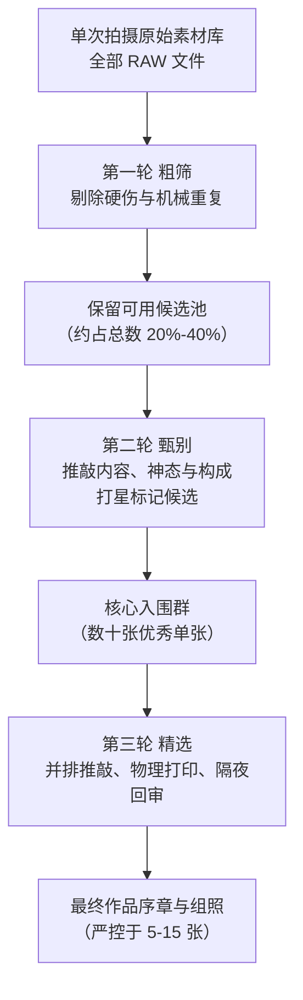

# 第 14 章 编辑与持续

> 拍摄是在世界里收集光阴的切片，选片才是在废墟上构建意义的殿堂。若不肯静下心来审视取舍，按下的千百次快门，终究只是散落的字符，拼不成一句完整的言语。

---

## 被发现的照片仍需编辑

2007 年，在芝加哥一场拍卖欠租仓储柜杂物的现场，约翰·马鲁夫（John Maloof）花下三百八十美元，竞得了一只塞满胶卷与底片的陈旧纸箱。他原本并未怀抱任何浪漫的发现野心：他当时正着手撰写一部关于本土社区的文史小册子，急需寻觅一些旧日的街景佐证，而这只沉睡多年的箱子看似恰逢其时。箱子的原主是一位名叫薇薇安·迈尔（Vivian Maier）的老妇人，因无力续付租金，积攒半生的杂物被抵押充公。箱底除了数以万计已冲洗的底片，还蜷缩着数百卷甚至未曾见光的胶卷。马鲁夫带着好奇将底片逐一洗印、扫描入库，随着一帧帧灰度影像浮出水面，一种难言的震惊扑面而来：这些画面绝非寻常家庭相册中浮光掠影的留念，而是一座沉寂的视觉矿脉。

那是横跨二十世纪五十至九十年代的芝加哥与纽约街头：嬉戏与哭泣的稚童、衣衫褴褛的码头工、橱窗倒影中的时髦妇人、在阴影里游荡的落魄者，以及城市转角处隐秘的裂痕。画面的构图沉凝稳健，对环境光的敏锐嗅觉与抓取瞬间的气魄，丝毫不逊于同时代的街头大师。然而吊诡之处正深植于此：创造了这片浩瀚光影的人，生前从未参与过任何一次公开影展，未曾在任何一本刊物上印下名字。当马鲁夫沿着蛛丝马迹追溯下去，才勾勒出这位女性清贫而孤绝的生平：她终其一生从事家庭保姆的工作，终身未婚，无依无靠，胸前常年悬挂着一台禄来双反相机。她留下了十余万张底片，却几乎从未向任何雇主或友人展示过。直至她于 2009 年悄然离世，那些锁闭在暗箱中的光影，才骤然降临于世人眼前。

伴随迈尔神话的传播，坊间常生出一种过于浪漫的误解，认定她是一位完全不看自己作品的“纯粹记录者”。然而，[现存档案的数量与生前印片说明](references.md#photography-history)揭示出远为复杂的事实：迈尔生前曾制作过大量印相小样与手工银盐照片，也曾在暗房中裁剪试印。她并非从未凝视过自己的造物；真正永远缺失的，是一套由她亲自定夺、具有明确作者意识的最终选择与叙事秩序。后人永远无法获知，若由她亲自面对这十余万张底片，她会挑选哪十二张作为这一生的自白？她会如何排布自拍与街头、黑白与彩色、繁华与凋敝的对位张力？如今世人所读到的“薇薇安·迈尔”，不可避免地浸染了收藏家、画廊主与策展人的品味与权衡。

这部书的最后一章，探讨的正是这道不可逾越的界线。按下快门，光线在感光介质上留下物理潜影，这仅仅完成了创作的一半；唯有当这些照片被重新打捞出来，被置于冷静的目光下审视、剔除、并置，并在彼此的呼应中建立起起承转合的节奏，散乱的视觉素材才真正凝练为具有呼吸感的世界。也正是在这一次次近乎冷酷的舍弃与甄别里，摄影者才得以剥离临场的虚妄浮躁，一点一滴照见真实的自我，从而获得持续走入旷野的力量。

---

### 档案如何改变一位摄影师


*Edward S. Curtis, "Wishham girl, profile", 1911，收录于《The North American Indian》项目。[图片来源与复用说明](image-credits.md#curtis-portrait)*

二十世纪初叶，爱德华·柯蒂斯（Edward S. Curtis）在金融巨头摩根的资助与西奥多·罗斯福总统的授意下，启动了摄影史上最为恢弘也最受争议的档案工程——《北美印第安人》（The North American Indian）。在长达近三十年的艰辛跋涉中，柯蒂斯深入西部八十多个原住民部族，耗费四十余万张玻璃干板，采集上万段蜡管录音，最终凝结为二十卷巨著与二十套豪华大画幅凹版腐蚀印相图集。彼时，“消逝的种族”（The Vanishing Race）这一挽歌式神话笼罩着美国知识界，柯蒂斯深信自己是在工业浪潮与同化政策彻底碾碎古老文明之前，抢救下这片土地上最后的灵魂容颜。在这幅 1911 年摄于哥伦比亚河畔的威斯汉姆族（Wishram）少女侧影中，光线以古典油画般的柔和漫射勾勒出少女端庄坚毅的下颌线条；贝壳与串珠编织而成的繁复头饰沿发际低垂，在铂金与照相凹版特有的深邃灰阶中泛起幽微的珠光。柯蒂斯刻意以纯净的暗调背景抽离了具体的地理环境与贫瘠的居所，将一位寻常的原住民少女升华为了超然于历史动荡之上的精神图腾。

然而，这件作品的崇高感背后，恰恰横亘着档案编辑最深刻的伦理裂痕。柯蒂斯并非客观冷漠的田野调查员，而是一位极具自觉、甚至不惜干预现实的视觉编织者。为了维系画面中前现代文明的纯粹与神秘，柯蒂斯在拍摄前常常提供传统的鹿皮衣物与羽冠道具，要求已然穿戴棉质西装的原住民脱去现代服饰；在暗房的底片修整中，他更是用刮刀与药水，极为耐心地抹去画面背景里偶现的座钟、洋伞、带扣与铁丝网。这种对档案材料的强力编辑与重构，在后世招致了激烈的批评：他究竟是在忠实记录正在呼吸的同胞，还是在用白人文明特有的怀旧情调，凭空雕凿出一座凄美的挽歌假象？但即便抽离掉这些复杂的政治争议，当观者的视线越过精心排布的头饰与暗调光影，迎上少女那沉静幽深、洞察一切的凝视时，人性的尊严依然以无可辩驳的重力穿透了所有预设的修辞。

柯蒂斯的漫长生涯为后世提供了一面严苛的明镜：拍摄只是从混沌的世界里开采原石，唯有历经数十年如一日的整理、编目、序列构建与实体印制，那些散碎的感光银盐才能铸就具有历史穿透力的视觉记忆。柯蒂斯晚年虽因这项工程耗尽家财、妻离子散，并在贫病交加中几乎被时代遗忘，但他留下的这套卷帙浩繁的档案，却最终成为后世原住民重新找回失落母语、祭典仪式与先祖面容不可或缺的基石。档案绝非客观记忆的仓库，它本身就是一种由取舍构筑的权力与思想结构。你留在硬盘中的每一次标记、剔除与成组，实质上都在为自己的观看史筑基；能否将偶然的按动快门升华为绵延不绝的长期叙事，全系于这双在暗室中反复甄别、耐得住寂寞的眼睛。

---

## 拍一千张，留下几张

关于拍摄数量与最终留存之间，摄影界从未存在过放之四海而皆准的比例公式。街头抓拍依赖敏锐的身体反射，往往在数秒内掠过若干微调的连拍；大画幅风光摄影则因耗材昂贵与移轴校正的繁复，一天之中或许只郑重曝光三两张片夹；至于人像棚拍与报道委托，又各依叙事任务承载着全然不同的生产节奏。真正需要破除的执念，并非教条式的“一千张里只准留三张”，而是必须清醒认识到：**快门次数本身绝不等于创作成果**。

许多爱好者常年陷入瓶颈的根源，不在于器材匮乏或机身参数生疏，恰恰在于心理上对“选片”这一道工序的潜意识逃避。在数码时代，存储的廉价制造出一种虚幻的丰裕感：数千张 RAW 格式文件被机械地拖入移动硬盘，打上“备份完成”的标签后，便被永久封存在文件夹的冷寂深处。一年过去，硬盘里累积了数万张文件，却未曾有一张被严肃地置于同伴身旁横向比对、推敲得失。缺少了这一步反刍，视觉的判断力便永远无法沉淀。

摄影技艺的真正跃升，很少孤立地发生在举起相机的那一秒；它更取决于夜深人静时，你端坐在屏幕前所经历的那种诚实而近乎残酷的自我对话：平静地承认某一张当时令你心跳加速的照片其实平庸松散，同时惊异地发现另一张被你忽略的角落，竟在沉淀之后散发出未经雕琢的光芒。正是这千百次克制而清醒的承认，一点一点洗去了眼睛里的浮翳。

---

## 拍摄与选片需要两种心态

拍摄与选片，本质上是人类意识光谱两极的活动，需要调动截然相反的心理能量。按下快门依赖的是瞬时直觉的爆发，是在电光石火的间隙里，将肢体、眼球、心跳与机械元件瞬间缝合为一体的敏捷；而坐下来选片，依凭的却是延迟的、清教徒般的冷静审视，必须等待胸中那股临场的燥热与自得彻底平息，才能客观审视二维平面上显现的残缺与秩序。

正因如此，一个人完全可能在街头拥有野兽般的嗅觉，却在选片桌前陷入盲目；反过来，亦有人一生拍摄寥寥，却生就一双能从浩瀚泥沙中淘洗出黄金的慧眼。摄影史中最著名的典范莫过于约翰·萨考夫斯基（John Szarkowski）。这位早年师从建筑摄影、曾荣获古根海姆奖金的创作者，最终名垂青史却并非因其个人的摄影集，而是他在纽约现代艺术博物馆（MoMA）执掌摄影部近三十年间，以敏锐无匹的编辑眼光重塑了整个西方世界对“什么是优秀摄影”的认知。

在画报与大众传媒的黄金时期，摄影师与图片编辑（Picture Editor）之间始终维持着一种既依存又博弈的张力。战地记者与报道摄影师在第一线拼搏，将一卷卷底片寄回后方；编辑部的专业编辑则在无影灯下，隔绝了硝烟与疲惫，用放大镜在数十打样张中抽丝剥茧，挑出最具视觉张力与叙事深度的极少数画面，最终敲定版面开本与编排顺位。这种分工深刻揭示出：刚从拍摄前线抽身、浑身浸透着情绪记忆的人，往往最不适宜在当下充当绝对公正的裁判。

1967 年，萨考夫斯基在 MoMA 策划了里程碑式的展览《新纪实》（*New Documents*），将当时尚处于边缘的黛安·阿巴斯（Diane Arbus）、李·弗里德兰德（Lee Friedlander）与加里·维诺格兰德（Garry Winogrand）并置展出。这场展览终结了传统纪实摄影宏大叙事与道德说教的范式，确立了一种更冷峻、更贴近私密经验与都市荒诞感的新视觉语言。萨考夫斯基挑选了谁、排斥了谁、赋予谁以怎样的版面秩序，直接左右了半个世纪以来的当代摄影走向。挑选本身，就是一种极具分量的再创作。

选片之艰难，在加里·维诺格兰德身上体现得尤为令人扼腕。这位被公认为天赋绝伦的街头巨匠，在曼哈顿街头如同着魔般不停按动相机，晚年即便驱车穿行于洛杉矶的高速公路，亦隔着挡风玻璃不知疲倦地捕捉街景。然而，他对“拍摄”的狂热，最终彻底吞噬了对“编辑”的耐心。1984 年他因病骤然离世时，身后留下了两千五百多卷尚未冲洗的胶卷、六千多卷冲洗后从未印制接触小样的底片，以及数以万计拍摄后便束之高阁的接触印张——三十余万张被快门定格的光影，他终生未曾看上一眼。

维诺格兰德逝世后，正是萨考夫斯基带领团队耗费数年光阴，沉入这片无边无际的底片荒原，替他完成了终其一生都在逃避的艰难编辑，并将精选之作汇编为展览与图录《来自真实世界的碎片》（*Figments from the Real World*）。然而争论亦如影随形：画册中呈现的晚期维诺格兰德，究竟是摄影师本人的真实面目，还是萨考夫斯基借他人底片阐发的一家之言？这一历史公案留给后人的警醒重若千钧：**如果你始终不肯亲自编辑自己的作品，命运终将假手于他人；而他人将用他的眼睛，替你讲述你原本未尽的话语**。

与此形成极具启发性对照的，是罗伯特·弗兰克（Robert Frank）在创作《美国人》（*The Americans*）时的严苛自律。在横跨美洲大陆的两万英里旅程中，弗兰克耗费了七百多卷胶卷，累积下近两万八千张曝光底片。回到纽约后，他花费了整整两年时间闭门选片：将数千张接触小样裁切后密密麻麻图钉于工作室的白墙上，在朝夕相对中归类、汰换、推演。从两万八千张，到千余张工作小样，再压缩至数百张候选，最终仅有八十三张照片获准进入那本改变现代摄影史的杰作。正是这种从浩瀚经验中剔骨抽筋的冷酷，才让散碎的旅途快照升华为一曲关于战后美国精神荒原的沉重交响。

选片之所以会诱发深层的心理抗拒，根源在于摄影者眼中的画面永远附带着无法抹除的“主观记忆噪点”。面对一张照片，你不仅在看它的明暗与线条，更在瞬间重温按下快门时的全部感官记忆：那天刺骨的寒风、长达数小时的枯候、与被摄者简短却温存的交谈、爬上坡顶时剧烈的喘息。所有这些深植于你神经末梢的生命体验，都会自发地投影在二维纸面上，让你误以为画面本身已具备惊心动魄的力量。

然而，任何一位素未谋面的陌生读者站在照片前，他无法感知你曾流下的汗水与心绪。他所能依凭的，唯有边框内那层薄薄的灰阶、色彩与几何结构。若画面本身松垮无神，任凭创作者在背后经历了怎样的惊心动魄，在观者眼中亦不过是一张平庸的废纸。破除这种自恋陷阱的途径唯有两条：其一，是让素材“冷却”，将照片封存数周甚至数月，待临场的生理兴奋彻底褪去，再用陌生的眼光重审；其二，是将其交付给一位不在现场的诚实同道，借助那双未受记忆污染的眼睛，一语道破那些被情感包裹的虚弱。

---

### 印相样张与图片编辑

在数码屏幕接管一切之前，底片时代的摄影师拥有一个极具实体仪式感的判断空间——印相样张（Contact Sheet）。将整卷三十六张三十五毫米底片紧贴相纸进行接触曝光，显影出的整张印张上排列着一枚枚指甲盖大小的微缩画面。摄影师手持放大镜，握着红色或黄色的油性蜡笔，伏在透光看片台上寸步不离地巡视：遇到心仪之作，便画上一个决绝的圆圈；若觉拖泥带水，则顺手划下一道横线；甚至在小小的方格内画出裁切线，预演构图的最终收紧。

这样一张布满批注、折痕与指纹的样张，是一次视觉搏斗最坦诚的考古现场。后来玛格南图片社结集出版的《马格南印相样张》（*Magnum Contact Sheets*），让世人得以窥见传世经典的诞生轨迹：卡蒂埃-布列松那张在圣拉扎尔车站后方飞跃水洼的旷世杰作，在整条胶卷上竟是孤绝的一格，前后绝无雷同的重复尝试；而在更多大师的样张上，人们看到的是针对同一个场景五次、十次近乎偏执的微调试探——被摄者下巴微抬两分、背景中穿行的路人多走了一步、光线在云层后略微泛开。神来之笔并非凭空降临，它几乎总是潜伏在一整卷底片的耐心淘洗之中。

样张同样见证了摄影师与图片编辑之间无休止的权能争夺。二十世纪四十至五十年代，尤金·史密斯（W. Eugene Smith）为《生活》杂志拍摄了《乡村医生》（*Country Doctor*）、《助产士》（*Nurse Midwife*）与《西班牙村庄》（*Spanish Village*）等传世报道巨作。然而他与编辑部的交恶在业内人尽皆知。史密斯对照片被挑选的顺位、版面跨页的开本大小、裁切边界甚至文字配说明的语气，都怀有近乎宗教狂热的掌控欲。在他看来，若最终的版面编排割裂了影像间的悲悯与诗意，前线的一切冒险便尽数归于虚无。他最终不惜为了捍卫编辑自主权而毅然与《生活》杂志决裂。史密斯的抗争将一个真理推到了历史前台：**一组照片以何种形态抵达世界，取决于编辑这一道工序的品格；这道工序，值得一名严肃的创作者押上全部尊严去捍卫**。

---

## 分轮筛选，不急着判死刑

面对单次拍摄产生的海量素材，最具建设性的策略是建立层层递进的漏斗式筛选机制，莫要在一瞥之间仓促定夺生死。



### 第一轮：技术排查与机械去重（快速粗筛）
首轮的目标极其明确：迅速剥离那些由于不可逆技术失误而报废的废片，以及高速连拍中无实质差异的冗余帧。
- **排查对象**：无意脱焦、因抖动导致的不可挽回的模糊、高光完全溢出无法拉回的死白、因误触快门记录的地面或虚空。
- **标记手段**：利用软件中的“弃用标志”（Reject Flag）或单一色标隔离，不急于立刻从硬盘中物理删除。
- **审慎之处**：需清醒辨别“偶发硬伤”与“表现手法”的区别。若某种模糊带有不可替代的速度张力，若某个非常规的倾斜构图蕴含着失衡的诗意，便应给予赦免，将其留待第二轮与同伴并列审视。

### 第二轮：本体研读与骨架确立（细致甄别）
在去除了明显残损后，候选池通常会收缩至原总量的三分之一左右。此时应放慢审视的步调，对每一张照片投入十数秒乃至数分钟的静观，拷问画面本体的力量：
- **审问核心**：画面中心的主题是否明确？光线的走向是在强化主题还是在瓦解层次？被摄主体的神态与身体姿态是否具有凝聚力？背景中的各元素是否达成了动态平衡？
- **攻克最大的诱惑**：在这一阶段，最容易侵蚀判断力的不是显而易见的烂片，而是那一大群“挑不出大毛病但也谈不上惊艳”的中庸之作（俗称“也还行”的照片）。它们曝光工整、焦点清晰，却缺乏精神的穿透力。倘若心慈手软将它们尽数保留，真正璀璨的明珠终将被这片平庸的泥沼彻底淹没。在此轮中，唯有真正具备独特语汇的影像，才配被赋予三星以上的标记。

### 第三轮：并置抗衡与隔夜审视（终极裁决）
第三轮是从数十张佼佼者中，淘洗出最终承载项目灵魂的五至十张精粹。
- **脱离孤立观看**：单张审视容易产生虚幻的完美感。务必在软件中启用“并排比对视图”（Survey / Compare View），将机位、神态、色调相近的三四张照片同时平铺于眼前。人类眼眸对绝对品质的判别往往迟钝，而对并置差异的捕捉却极具天赋——哪一帧嘴角更加松弛、哪一帧眼神的光斑更为深邃、哪一帧右侧边缘多了一道切断视线的杂光，在针锋相对的横向比照下立见分晓。
- **出声阐述检验**：强迫自己用一句清晰完整的语句，大声说出选择它的理由：“我留下这一张，是因为光线切过老人前额的锐度，与背景虚焦处那张剥落的招贴形成了荒诞的互文。”如果你吞吞吐吐，搜肠刮肚后只能说出“因为这张拍得很辛苦”或“当时晚霞非常好看”，那便足以证明你留恋的仅是记忆的回光，而非纸面上的事实。
- **隔夜审判**：完成初选后，合上电脑，安然入眠。次日清晨，用一双饱经休息、清空了前序预设的眼睛重新审视这几张入围者。晨光熹微之中，往往有两三张昨日看似惊艳的作品会骤然显出矫饰之态，而真正经得起凝视的杰作，自会在沉默中散发出恒定的沉香。

---

## 用五个问题审问一张照片

在最终将某张照片归入个人代表作或摄影集序列之前，不妨像严苛的审判官一样，用以下五个问题对它进行逐项盘剥：

1. **它究竟在言说什么，能否用精确而非空洞的语言定义它？**
   诸如“我在罗马”或“秋天的下午”这类陈词滥调，苍白得无法在感官中激起半点涟漪。如果这幅画面能被精准地表述为“深秋正午，修道院回廊阴影深处那截被回光点亮的灰白长袍”，画面的指向性才算真正立住了脚跟。凡是只能以宏大抽象词藻搪塞的影像，其视觉内核往往空无一物。

2. **它在你的视觉档案库中，是否具有不可替代的唯一性？**
   打开过往的画册或目录，审视自己是否已经在类似的焦段、相似的光线与相仿的仰角下，拍摄过无数张同样情调的咖啡杯、雨夜倒影或路人背影？这是否仅仅是你生理性舒适区的又一次机械克隆？如果它未能向你的观看疆域推进半步，它便不配占据珍贵的版面。

3. **画面中的技术瑕疵，究竟是削弱了观看，还是升华了表现？**
   直面脱焦、颗粒粗糙、暗部并级等物理缺损。若脱焦让观者的视线茫然无措地在虚空中滑落，那它就是不可饶恕的失误；若那抹粗粝的运动模糊恰如其分地传达出暴风雨中奔逃的惊悸与惶然，这种“残缺”便化作了风格的勋章。对自己保持绝对的诚实，切莫将侥幸的失手粉饰为前卫的探索。

4. **取景框边界处，是否存在未被觉察的寄生性干扰？**
   重新审视边缘的每一寸方圆：人物头顶是否斜插着一根刺目的电线杆？画面四角是否有半截被生硬切断的汽车保险杠或路人手臂？地平线是否有两度无意义的倾斜？构图的纯粹性，往往不是由你框进了什么决定的，而是由你是否坚决地将杂质拒之门外决定的。

5. **它是否经得起实体纸张的重压与光阴的淘洗？**
   将这张照片从社交媒体点赞的算法温室中剥离出来。设想将其用无酸相纸精细喷绘、配上木框悬挂于书房墙面，你是否愿意在未来的半年、一年甚至五年里，每天晨昏步入房间时依然百看不厌？它所蕴蓄的信息量与情感回甘，能否抵抗审美疲劳的侵蚀？

---

## 先分组，再排序

从单张照片的甄选跃迁至一组作品的构建，其间横亘着一道质的鸿沟。二十张优秀的单张随意拼凑在一起，绝不等于一组震撼人心的作品；未经编织的影像堆叠，只会相互抵消彼此的锋芒。

真正具备实战价值的编辑工序，第一步往往不是确定绝对的先后次序，而是**聚类分组**。
将经过初步筛选的四五十张工作小样打印成明信片大小的相纸，随意散落在一张宽阔的木桌上，或是用胶带无序地贴在一整面墙壁上。后退三步，抱臂静观。先不要急于编排故事，让眼睛在画幅间游走，寻找它们天然的亲缘关系：
- 哪些画面在暗中呼应着同一种苍凉孤寂的蓝色调？
- 哪些画面反复出现紧闭的门窗与剥落的墙皮？
- 哪些画面被强烈的几何对角线所统治？

将声气相通的影像聚拢为不同的阵营。在这番归拢之中，一系列至关重要的实相会自行浮现：某些堆栈越聚越厚，骨肉停匀，预示着一个成熟的专题序列已然破土而出；而另一些堆栈仅有孤零零的两三张残简，提示你这一线索尚处于萌芽之态，理应在未来的日子里重返现场深入开掘。

最严酷的考验，恰恰发生在那几张“无可挑剔却无家可归”的孤品上。它们可能在构图、光影与情感上均臻于化境，但与周遭任何一组的叙事肌理都格格不入。**敢于将一张极其出色的单张忍痛剔除于序列之外，是编辑这门手艺中最逆人性、却最显功力的一记断腕**。一张与整体气韵相冲的杰作，一旦硬塞进画册，非但无法生辉，反而会如同一记突兀的破音，彻底震碎整首乐曲的和谐。

### 序列流动的内在韵律
当核心篇章确立后，便进入了至关重要的排序工序。视觉叙事的律动，遵循着与交响乐极为相似的声学原理：
- **明暗的呼吸**：若连续四五个跨页皆是沉郁凝重的高反差暗调，观者的视觉神经便会迅速钝化陷入窒息；适时插入一张大面积留白、日光通透的高调小景，便如在沉重的鼓点间隙递进一声清脆的长笛，让观看重新拥有了起伏的弹性。
- **景别的推拉**：全景、中景与特写理应错落交织。一张人头攒动、戏剧张力爆棚的集市大场面之后，若紧随一幅静谧无声的石阶水洼特写，那种从喧嚣骤降至死寂的落差，便能激荡出深邃的情绪重力。
- **色彩的对位**：在一整组低饱和、近乎单色的灰冷影调中，若在某个翻页的刹那忽现一抹幽微温润的赭红，这一抹色彩便不再是孤立的色块，而化作了直刺心扉的视觉惊雷。

以《美国人》的首尾呼应为例，弗兰克展现了教科书级的结构掌控：
- **开篇**（新泽西州霍博肯的游行）：两个女人倚靠在红砖公寓的窗棂前，其中一人的面容恰被一幅自窗台垂落的巨大星条旗严丝合缝地彻底遮蔽。国旗的象征意义与被遮蔽、面目模糊的个体生命在第一页便形成了充满宿命感的互文，奠定了全书对战后美国神话冷峻审视的基调。
- **终篇**（德克萨斯州路旁的清晨）：全书阅尽了形形色色的政客、底层群体、飞车党与浮华名流，在最后一页，镜头归于宁静：一辆在漫长旅途后疲惫停泊于荒凉公路旁的旧轿车内，弗兰克的妻子玛丽与幼子睡眼腥忪地蜷缩在后座，晨光温柔抚过车窗。在审视了整整一个国度之后，创作者将视线收束回自己相濡以沫的亲人与孤独的自我。

在条件允许时，务必亲手制作一本**样书（Dummy Book）**。用最朴素的打印纸将正反面页面粘合折叠，装订成册。当你以真实的生理节奏，伸出手指翻动每一页纸张时，指尖与目光的配合会敏锐捕捉到屏幕上永远无法体察的翻页顿挫——两张原本在显示器上看似融洽的照片，一旦成为面对面的跨页对开（Diptych），其构图引力是否会产生撕裂？翻过这一页的瞬间，右页的视线走向是否顺畅地将目光导向下一章？唯有纸质的摩擦声，才能给予这些问题最真实的答复。

---

## 图片故事需要起伏

当多张照片的并置意在跨越时间讲述一段事件的生发演变、或是剖析一个群体的生存境遇时，它便演进为了经典的“图片故事”（Photo Essay）。这套在《生活》与《国家地理》全盛期淬炼成熟的视觉叙事语法，至今依然是纪实摄影师不可或缺的思维骨架：

| 叙事定位 | 承担功能 | 典型的视觉呈现 |
| :--- | :--- | :--- |
| **开篇场域（Establishing）** | 交代地理坐标与生存境遇，构筑剧场氛围 | 广角大场面，蕴含丰富环境语境的全景 |
| **叙事推进（Progression）** | 展开主体行动，呈现人物与空间的动态纠葛 | 具有明确动势的中景，人际交互瞬间 |
| **物证细节（Detail）** | 放缓节律，赋予具象质感，提供静默注脚 | 抚弄烟斗的手、布满尘土的工具、案头的旧信 |
| **精神中枢（Key/Climax）** | 承载全篇核心冲突与情感最高点 | 视觉张力最强的一两张面孔或决定性动作 |
| **回望余韵（Coda/Closing）** | 引导情绪降落，留白生思，提供开放式收束 | 渐行渐远的背影、空无一人的暮色街道、凝望远方的眼神 |

必须警惕的是，切不可将这张结构表降格为机械教条的填空准则。一流的创作者往往在谙熟章法之后，有意识地打破常规：或是开门见山直接将最凶险的高潮推至封面，或是通篇摒弃全景交代、通篇由逼仄的微观局部压迫观者的神经。然而，正如唯有精通格律的诗人才能写出惊艳的破体诗，**你必须先懂得规整的力量，才谈得上从容地打破它**。

优秀的图文序列之间，往往潜藏着若隐若现的视觉暗线。在上一页老工人的掌心皱纹中，暗合着下一页干裂土地的肌理；这一页飞鸟划破长空的对角线，与下一跨页修女扬起头纱的弧度遥相呼应。这种如同古典诗歌韵脚般的内部对位，并非来自拍摄时的预谋，而全赖在选片桌前对数千张小样反复排列组合时擦出的灵光。

---

## 打印是另一种观看

在数码时代，将照片打印于纸质介质之上，其价值已远远超越了单纯的成果输出；**打印本身，就是一门重塑观看之道的严格修行**。

发光显示器与反射相纸，代表着两种截然对立的物理实在：
- **光源的欺骗性**：液晶或 OLED 屏幕是一盏自后方透射发光的灯箱，其高亮度和超宽动态范围具有极强的粉饰效应。那些在 RAW 文件暗部已然混浊黏稠、缺乏过渡的阴影，在屏幕背光的照耀下往往显得通透空灵；那些本已漂移散乱的高光，亦会被发光二极管的辉光轻易遮掩。
- **反射介质的冷酷**：纸张本身绝不发光，它全然依凭落在其表面的环境漫射光线，将颜料分子的吸收与反射呈递给肉眼。纸基所能承载的动态范围（Dmax）极其有限，色域亦显著窄于广色域显示器。一旦将文件喷墨印于纯棉无酸纸上，原本在屏幕上看似润泽的暗部会瞬间“死黑成团”，高光过渡的断层与色彩断裂亦无所遁形。

| 观察视角 | 屏幕发光观看（透射） | 实体相纸观看（反射） |
| :--- | :--- | :--- |
| **物理机制** | 像素背光透射，自带高能辉光 | 颜料吸收反射环境光，受照度直接影响 |
| **动态范围** | 宽广深邃，极易掩盖暗部并级与高光断裂 | 狭窄苛刻，影调层次是否扎实一目了然 |
| **色域表现** | sRGB / Adobe RGB / DCI-P3 饱和鲜活 | 受墨水与纸基涂层限制，艳俗之色易转为灰浊 |
| **视距尺度** | 任意缩放放大，易迷失于局部微观像素 | 物理画幅绝对固定，逼迫审视全局构图张力 |

打印因此构成了对摄影者自欺心理的终极矫正：它用物理规律的严酷，逼迫你直面调色与构图中的每一个薄弱环节。

即便是普通的桌面喷墨打印机或寻常的黑白打印，亦足以开启这扇门扉。若希望在实践中将作品推向成熟，自制**独立摄影小册子（Zine）** 堪称最佳试验田。Zine 滥觞于上世纪六十至七十年代日本以森山大道、中平卓马等为代表的独立摄影风潮。这些由几张纸张粗糙复印、简易折页装订而成的薄册，成本微薄，却蕴含着惊人的视觉颠覆力。

制作一本 Zine 的意义，在于它构筑了一个微缩而严谨的闭环：你必须亲自决定开本比例、封面用图、纸张克重、字体字号与翻页次序。当你终于亲手将一把订书针按入折痕，手中捧起这本带有油墨温度的薄册时，那种“完成一件事物”的踏实感，是向社交网络虚空上传九张配图永远无法比拟的精神慰藉。

比 Zine 再前进一步的仪式，则是**将照片挂上墙面**。办一场展览无须等待权威美术馆的垂青：寻觅一家熟识的街角咖啡馆、社区图书馆的转角走廊，或是自家客厅一面粉刷平整的白墙，悬挂上十幅装裱规整的银盐或微喷作品。一旦影像离开手掌进入公共空间，全新的尺度课题便迎面而来：观赏距离的拉长，会无情拆穿那些在小尺寸下看似精致、实则气势涣散的构图；留白的宽窄、框条的质感、双联画之间的间距，皆成为空间张力的砝码。唯有站在展墙侧旁，静观素昧平生的过客在某张画面前长久驻足，或是在另一张前漠然穿过，你才能汲取到最为真实的反馈。

---

## 建立每天一张的节律

在漫长的摄影生涯中，对抗虚无与倦怠最有效的日课，莫过于建立“每日一图”的审视节律。

其规程朴素而严整：每晚临睡前，打开当天的拍摄目录，沉下心挑出一张最具质感的画面。不仅要挑出来，更要摊开一本实体的空白手账，用胶带将一张四乘六英寸的打样小片粘贴于纸页中央，并在其下方郑重写下拍摄日期、物理坐标，以及**一句言之有物的入选剖白**。若当天恰逢雨雪未曾启程，便从过去一年的归档库中，打捞出一张过往未曾细看之作补足。

```
[4x6 实体小样贴合处]

日期：2026 年 10 月 14 日  坐标：旧城区货运车站东侧道口
裁定剖白：
列车驶过掀起的尘雾恰好隐去了远处杂乱的高架桥墩，
将道班工人的红色安全帽剥离为漫天灰黄中唯一的锚点。
```

坚持整整三百六十五天之后，你手中或许未能积攒出三百六十五幅传世杰作，但你的指尖与大脑却实打实地完成了一整年未曾间断的、关于光线与秩序的高强度博弈。当岁末合拢这本厚重的手账重温时，一幅无比真实的视觉自画像便会跃然纸上：你究竟在无意识中反复迷恋何种色彩？哪些一度自鸣得意的构图如今看来浅薄可笑？哪些曾被弃置于阴影里的孤单片段，却在时光的醇化下散发出不可磨灭的幽香？纸张与油墨，将替你稳稳锁住生命的刻度。

### 数字资产守护：3-2-1 备份原则
纸质小样虽可传世，但作为源头活水的数十万张数字 RAW 底片，却面临着远比传统胶片更为脆弱的生存境遇。硬盘的物理磁头磨损、闪存芯片的电荷衰减、雷击电压激增、勒索软件劫持，乃至一次失神的误格式化，都能在数秒内将十数年的心血化作虚无。

在数字资产管理（Digital Asset Management, 简称 DAM）的专业体系中，**3-2-1 备份原则**是不可逾越的安全红线：

| 准则标号 | 核心规程 | 应对的物理与逻辑风险 |
| :---: | :--- | :--- |
| **3** | **保留至少三份完整副本**（一份原始数据，两份独立备份） | 抵御单点物理硬件不可逆故障 |
| **2** | **跨越两种不同技术特性的存储介质**（如机械硬盘 + 离线冷光盘/云端对象存储） | 防范同批次固件缺陷、单一文件系统崩溃及电气共模损坏 |
| **1** | **至少一份副本留存于异地物理空间**（异地机房、办公室或深度离线冷备份） | 抵御火灾、洪涝、窃盗等区域性物理灾难 |

在此必须严肃破除技术认知上的常见盲区：**磁盘阵列（RAID）绝不等于数据备份**。RAID 1、RAID 5 或 RAID 6 等镜像与奇偶校验技术，其核心使命在于确保服务器在单块硬盘遭遇硬件损坏时维持系统业务“不中断”，属于容灾与高可用性范畴。它在逻辑上对于防范数据丢失毫无屏障：一旦遭遇人为误删、病毒勒索加密或操作系统逻辑错误，擦除与损毁的指令会在毫秒级内无差别同步至阵列中的每一块物理磁盘。将 RAID 误当备份而摒弃离线冷备份，无异于在沙丘之上构筑楼宇。

规范的资产管理还包含稳固的命名法则：以 `YYYYMMDD_项目名_四位流水号.RAW` 为基础，导入即刻固化；在专业目录软件（如 Lightroom Classic）中操作移动与归档，确保数据库指针与 XMP 边车文件的绝对同步。重要归档库务必每季度进行校验和（Checksum）一致性抽检与恢复演练，唯有能被完整还原的数据，才配称为真正的资产。

---

## 热情退去以后靠什么继续

初涉摄影时的狂热多巴胺，往往会在两三年内消耗殆尽。当机身各项拨盘与菜单烂熟于胸，当黄金分割与逆光轮廓已能信手拈来，一种巨大的虚无感往往会如期而至：手握精密的仪器步入街头，却发现世界似乎变得面目可憎、无物可拍。

这种创作者普遍遭遇的深层停滞，通常根源于三项基石的崩塌：**没有清晰的问题意识、没有真实的反馈回路、没有一个正在推进的长期项目**。

破局的不二法门，是为自己树立一个周期在半年以上、且自我设限极其苛刻的**长期摄影项目**。题目的口径切不可宏大泛滥：
- 摒弃“记录都市变迁”这种虚妄的口号，收窄为“清晨六点至八点之间，同一家早餐摊蒸汽中的面孔”；
- 摒弃“家乡的四季”这种游离的抒情，钉死在“沿穿城铁路线两侧步行十公里以内的荒地杂草”；
- 摒弃“街头众生相”，界定为“背向阳光行走的那些打着黑伞的影子”。

**自愿戴上的镣铐，往往是穿透平庸最有力的钻头**。正是这些看似不近人情的严苛限制，逼迫你一次又一次重返同一个看似枯燥的方寸之地，直至你眼中的滤镜被彻底磨去，看见了此前千万次掠过却未曾真正看见的深层褶皱。

- **史蒂芬·肖尔（Stephen Shore）** 驾驶旧车横贯美国大陆，聚焦的无非是公路两旁最寡淡无奇的汽车旅馆床铺、加油站招牌与煎饼果子盘中的残渍，最终锻造出新彩色摄影的划时代丰碑《不寻常之地》（*Uncommon Places*）；
- **贝歇夫妇（Bernd & Hilla Becher）** 在半个世纪的时光里，背负大画幅相机穿梭于欧美衰退的重工业区，只拍摄水塔、高炉与煤仓。他们为自己立下清规戒律：必须是毫无阴影的阴天、正立面透视矫正、工业标本式的平光居中。正是这种将个人抒情剥离殆尽的类型学（Typology）极限约束，让被拍摄的构筑物在并置中呈现出震撼人心的形态谱系，孕育出了举世闻名的杜塞尔多夫学派；
- **南·戈尔丁（Nan Goldin）** 则走向了私密叙事的另一极峰。她将镜头牢牢锚定在曼哈顿下东区的密友、伴侣与边缘群体之中，以近乎自毁的坦诚记录下爱欲、争执、药物依赖与生命的消逝，凝结为一部撼人心魄的视觉日记《性依赖的叙事曲》（*The Ballad of Sexual Dependency*）。

不论是将拍摄方法推向极简，还是将观察场域锁入极微，它们昭示的都是同一法则：**唯有在一处窄门中凿得足够幽深，普遍性的人性甘泉才会从中喷涌而出**。

在推进长期项目的过程中，工作样片墙理应化作前线勘测的“动态仪表盘”。不要等到项目收官才闭门造车，而应每个月将新摄的小样贴上墙面。与旧作并列审视，项目的短板会自行发出呼喊：整面墙是否全是逼仄的近景特写？是否全篇弥漫着同一种焦虑的气息，缺少一两张足以让观者喘息的空灵远景？带着墙面暴露的亏空再次出门，你的目光便不再盲目游移，而化作了精准巡弋的雷达。

与此同时，必须学会警惕算法制造的即时虚荣。社交平台上以毫秒计算的滑屏点赞，其本质是由多巴胺驱使的肤浅交互，它会下意识地驯化你迎合更艳俗、更刺激、一秒即懂的视觉快餐。寻找一两位能够坐下来面对实体相纸、直言不讳指出哪张构图松散的诤友；参与摄影节严谨的作品集评审（Portfolio Review），在二十分钟内聆听资深画廊主或编辑毫不留情的剖析。**在听取批评时，请牢记一条黄金律：全神贯注于别人所指出的“不适感”与“困惑点”，因为直觉感受永远真实；但对别人随口奉送的“药方”（如‘你应该改拍黑白’），保持清醒的距离**。

---

## 器材升级要回答具体问题

在漫长的探索途中，器材的换代必须退居为工具理性的从属地位。每当更换画幅、系统或购置新镜头的念头不可遏止地升腾时，强迫自己在便签上写下一个具有明确因果律的命题，例如：

> “我当前的镜头光圈在剧场弱光下导致快门速度无法突破安全底线，迫使 ISO 攀升至噪点彻底瓦解暗部微弱过渡的层级。”
> “这项工业建筑记录项目需要严格校正三轴透视，现有定焦系统在物理上无法避免俯仰产生的汇聚畸变。”

如果搜寻枯肠，所能写下的仅是含混不清的“希望能拍出更有氛围感的画面”，那么请立刻扣紧钱包。器材的更新非但不能代偿观看的贫困，反而会因复杂的全新操作逻辑，再度拉扯你本该专注于构图与共情的精力。

摄影能力的增长从未遵循平滑向上的线性轨迹。初学阶段，参数的掌握与景深的虚化能带来立竿见影的愉悦；然而一旦步入中途，审美眼光的成熟速度往往会大幅超越双手与相机的实现能力，这会导致长达数年、甚至令人绝望的技术平台期。正视这一段沉寂，将精力从追逐最新发布的感光元件，转向重读一本文学巨著、漫步一座古典雕塑馆、或是静观窗外一抹暮色的渐次隐没。**决定画面终极厚度的，永远不是镜筒内镜片的枚数，而是相机背后那颗灵魂的质量**。

---

## 摄影最终仍是减法

让我们重温全书扉页的那句箴言：摄影的真谛，从始至终都是一门关于割舍的艺术。

当你在茫茫荒野中端起取景框，你所做的第一个决断，便是向框外那纷乱喧嚣的大千世界宣告告别；
当你在暗房与屏幕前审视海量底片，你所做的第二个决断，便是将那些残存着虚荣快感的平庸记录无情抹去；
当你在岁月的迁流中收拢心神锚定一个专题，你所做的第三个决断，便是抵御无尽题材的诱惑，将全部深情倾注于眼前那一捧泥土。

行至最后，你会发现许多历经沧桑的大师，行囊里的机身与镜头愈发稀少，涉足的母题亦愈发单纯。这绝非前路的日渐逼仄，而是他们在漫长的淘洗中终于参透了生命的本质：一个人穷尽一生，真正能够与之产生神圣共鸣的光景，其实少之又少。

持续地凝视，克制地剪裁，诚实地面向自己的局限。这三件事无须一掷千金，却需要交付出生命中最昂贵的酬劳——时间。

十年之后，当你偶然翻开此日留下的斑驳底片与字句，你会清晰地望见：正是从这一刻起，那些在暗室中做出的微小而孤绝的抉择，如何无声无息地重塑了你的灵魂，擦亮了你打量人世的眼睛。

---

!!! example "案例推演：十二张相近照片只留一张"

    **情境**：在暮色苍茫的火车站台，你跟随一位提着旧提箱的老人拍摄了十二张连拍。现场环境光线极其微弱，伴有蒸汽车头的漫射烟气。

    1. **第一轮（剔除硬伤）**：放大约略巡查，有三张因脚步疾移导致面部焦点彻底溃散，两张被身旁横向穿过的搬运工遮挡了大半身躯。直接标以弃用红标，候选池收缩至七张。
    2. **第二轮（姿态与骨架）**：并排平铺剩余七张。审视老人的步伐步幅：两张处于提箱换手的颓唐中途，提箱下沿尴尬地切在小腿肚正中；三张步履平缓，唯有最后两张后脚跟微抬、前倾的身躯与铁轨的前向汇聚线达成了具有张力的共振。星级提升至四星，余者归入备选。
    3. **第三轮（眼神与微光）**：在百分之百放大下对垒最后两张。其中一张老人的面部完全没入逆光阴影，唯见轮廓；另一张恰逢车厢窗内微弱的暖光在其眼窝与面颊胡茬上划过一道极细的高光，这抹微光让疲惫的旅人瞬间拥有了不可言说的沧桑心事。
    4. **决断**：留下带有眼眸微光的这一张，赋予绿色最终标签。其余十一张留存于归档目录，但绝不参与后续调色与画册序列编排。唯一留存的画面，承担起讲述全篇离别沉重的全部使命。

---

## 练习

1. **三十日晨昏审判**：连续三十天，每晚从当日或近期拍摄中严选一张照片，打印四乘六英寸小样粘贴于手账中，并在其下方手写不少于五十个字的入选剖白（不可使用“好看”“感动”等泛义词，必须拆解线条、光位与情绪焦点）。满月之日通读全册，绘制个人视觉母题偏好图谱。
2. **千帧淘金炼狱**：调取过去一年中最为繁杂的一次单日拍摄（不少于五百张），严格践行三轮筛选法：在不中断的一个下午内，将其依次收缩至一百张候选、三十张打星入围，并最终决绝地只保留五张。比对首轮放弃与最终胜出之作，记录自我记忆偏见的瓦解过程。
3. **实体桌面排阵**：将上述精选的二十张不同时期的优秀照片制作成实体小样，散置于大案之上。尝试完全摒弃时间先后顺序，分别以“情绪由压抑至释放”、“影调由极明转极暗”、“空间由辽阔至逼仄”三种截然相反的内在逻辑编排序列，记录不同节奏对叙事语义的颠覆。
4. **手工 Zine 闭环实践**：选定一个微观题目（如“窗台上的残叶”或“深夜街角的自动售货机”），整理出八至十二幅作品。利用最普通的办公打印纸与订书机，亲手排版折叠制作一本八页的独立微型摄影志（Zine），并为之撰写封面题名与百字序言。
5. **构筑实体反思展墙**：在书房或工作室清理出一面至少两米宽的空白墙壁（或软木板）。启动一个为期九十天的微型拍摄项目，每逢周末将最新冲印的工作小样粘贴于墙面，持续审视画面缺失的视角与景别，以此作为下周拍摄的任务清单。
6. **3-2-1 资产防御审计**：全面排查个人所有影像资产的存储拓扑图。确保核心原片库严格符合“三份拷贝、两种介质、一份异地冷备份”的行业红线；断开主工作机网络，模拟单块磁盘损毁场景，实际执行一次包含目录数据库与 RAW 原片的恢复演练。
7. **年终视觉白皮书**：在岁末闭门一天，从全年作品中精选二十幅年度代表作，汇编成册。为整年创作撰写一篇千字总结：如实记录今年最顽固的视觉盲区、哪一次盲目冲动购置了无用的附件器材，以及在新的一年中立誓深耕的长期项目纲领。

---

这本关于光影与凝视的书，至此就落下了帷幕。

所谓摄影，无非是先在纷乱的尘世中学会辨认那一缕微弱的光，而后屏住呼吸，以敬畏之心将其收束进小小的暗箱；
归来之后，再用近乎无情的清醒眼光，在千百帧幻影里淘洗出那一粒温润的真金；
最后，带着这枚被时光打磨过的镜子，重新迈开双脚，踏入那片永不落幕的人间。

明朝破晓之时，请再次把相机挂上肩头；
入夜归家之后，请守在灯下，为你所深爱的那一格胶片，写下不悔的证言。
