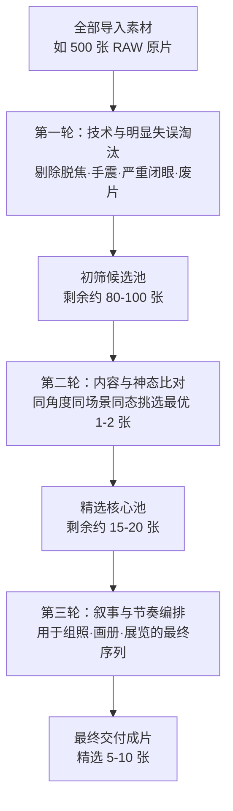

# 第 14 章 编辑与持续

> 按下快门是记录的开始，而坐下来认真选片，则是理清思路的关键。学会在灯下审视并挑选自己的照片，是摄影者走向成熟的必经之路。

---

## 被发现的照片仍需编辑

2007 年，在芝加哥一场旧物拍卖集市上，青年 John Maloof 花费 380 美元拍下了一只旧纸箱。

当时他正在编写一部关于当地街区的历史书籍，需要一些过去的芝加哥街景作为配图，这箱无人问津的底片正好可能有用。

箱子的原主人是一位在养老院去世的老妇人，箱内装满了大量底片与数百卷未冲洗的黑白胶卷。

Maloof 将这些胶卷逐步冲洗、扫描并整理，随后意识到：**这批照片具有非同寻常的观察力与艺术水准。**

画面中记录了 20 世纪 50 年代至 90 年代芝加哥街头的丰富日常：玩耍的孩童、劳作的工人、橱窗反光、行人神态与街角光影。

照片的构图扎实，对光影的把握十分敏锐。

然而一个令人惊讶的事实是：**拍摄了如此大量优秀作品的摄影者，生前从未举办过个人展览，也未曾出版过摄影集。**

经过长时间的寻找，原作者的身份才被确认：薇薇安·迈尔（Vivian Maier）。

她生前长期以保姆为职业，利用业余时间在街头持续拍摄，但极少将成片公开展示。

直到 2009 年她去世之后，这批底片才通过整理与展览，逐渐被世界各地的摄影爱好者与研究者所熟知。

迈尔留下的箱子里不仅有未冲洗的胶卷，也有她自己制作的数百张印片。

不过，后人面对这批庞大的底片时也面临一个客观问题：**由于她生前未完成系统的编辑与结集，我们无法确切知晓如果由她本人亲自编选，她会如何挑选代表作以及如何安排画面的前后次序。**

如今在画册与展览中呈现的迈尔作品，在很大程度上融入了策展人与编辑者的整理逻辑。

这一案例说明了一个重要的摄影规律：

**按下快门只是完成了拍摄的第一步；照片还需要经过系统的挑选、比对与编排。通过这一过程，创作者不仅能整理出清晰的作品序列，也能更清楚地认识自己的风格特点与关注方向。**

---

### 档案如何改变一位摄影师

*Edward S. Curtis, "Wishham girl, profile", 1911，收录于《The North American Indian》项目。Curtis 用多年时间拍摄北美原住民社群，留下大量照片、文字和录音，最后整理成二十卷书和二十卷大幅图集。这个项目在今天有很多复杂争议，但它也说明一件事：拍摄只是开始，漫长的整理、编排、出版和保存，决定了作品怎样进入历史。[图片来源与复用说明](image-credits.md#curtis-portrait)*

---

## 拍一千张，留下几张

拍摄数量与最终保留的张数之间，没有固定的数学比例。

街头抓拍、棚内人像、体育记录或风光考察，各自的工作节奏不同。但有一点是相通的：**拍摄数量多，并不直接等同于作品质量高。**

必须学会把相似的照片放在一起比对，挑选出真正立得住的少数，将多余的底片妥善归档。

许多初学者容易忽略选片的环节：一次拍摄归来，把成百上千张 RAW 导入电脑后便搁置一旁。数年过去，硬盘里存了大量文件，却很少认真整理出一组完整的作品。

摄影能力的提升不仅发生在现场拍摄的时刻，也发生在安静选片的时刻：**当你坐在屏幕前，客观审视哪些照片构图松散，同时发现哪些不经意的画面具有独特的质感。**

通过持续的挑选与取舍，眼光才能逐步得到磨砺。

---

## 拍摄与选片需要两种心态

现场拍摄与事后选片，需要调动不同的思考方式：

*   **现场拍摄**：依赖直觉、反应与情绪投入，在瞬间捕捉眼前的光影与动态；
*   **事后选片**：需要理性、客观与拉开距离的审视，去除现场情绪的干扰，纯粹从画面的视觉结构与叙事价值来做判断。

在画报与杂志摄影的时代，**图片编辑（Picture Editor）** 的作用至关重要。摄影师负责在现场捕捉素材，图片编辑则以相对客观的眼光从大量底片中挑选出最核心的画面，并确定编排版面。

Garry Winogrand 拍摄了海量的街头底片，但晚年很少花时间系统整理。1984 年他去世后，留下了大量未冲洗的胶卷与底片。最终是由策展人 John Szarkowski 带领团队整理编辑，才完成了《来自真实世界的碎片》（*Figments from the Real World*）一书。

这提醒我们：**如果创作者自己不整理作品，作品就只能等待他人的解读。**

Robert Frank 在创作《美国人》（*The Americans*）时，在全美拍摄了近两万八千张底片，随后花了一年多时间在暗房中反复比对、筛选，最终精选出 **83 张照片** 结集成书，成为摄影史上的经典之作。

**选片时常见的困扰是“情绪代入”**：
回顾自己的照片时，容易把拍摄时的辛苦、等待的时间或当时的个人情绪投射在照片上，误以为照片本身很丰富；然而外部观者看到的只有画面本身呈现的视觉信息。

克服这种偏差的有效方法：
1.  **让照片“冷却”一段时间**：拍摄归来后放置一两周甚至一个月再看，待现场的情绪淡化后，以更客观的眼光重新审视；
2.  **寻求同行反馈**：请有经验的摄影朋友或老师提供客观意见，倾听他人从画面中读到了什么。

---

## 三轮选片法

面对一次拍摄后的大量照片，可以采用分轮次筛选的方法逐步缩小范围：

1.  **第一轮：技术与明显缺陷筛选**：快速浏览，排除失焦、手抖模糊、明显闭眼或严重过曝欠曝的废片。
2.  **第二轮：同场景优选**：针对同一角度、同一动作拍摄的多张相似照片，横向并排比对，仅保留光影、神态与构图最到位的一至两张。
3.  **第三轮：主题与叙事筛选**：将候选照片放在一起，根据主题或组照的需要，挑选出层次丰富、视角各异的最终成片（通常 5 至 10 张）。

---

## 组照的逻辑与叙事

单张照片强调瞬间的完整性，而组照与画册则依赖多张照片之间的内在逻辑与叙事节奏。

常见的组照组织逻辑：

*   **线性叙事（故事逻辑）**：按时间顺序或事件发展展开，如婚礼全程、手工匠人制作器物的工序、一场旅途的起止。
*   **类型学并置（对比逻辑）**：以统一的机位、光线和距离记录同一类别的不同对象（如 Bernd and Hilla Becher 夫妇记录的工业水塔与矿井构架）。
*   **情绪与氛围（联想逻辑）**：照片之间没有直接的情节关联，但通过相似的色调、光影质感或特定情绪产生共鸣（如 Saul Leiter 的街头色彩组照）。

编排一组照片时，可以注意视角的丰富性：
*   **全景/大场景**：交代事件发生的环境与空间；
*   **中景/半身**：表现人物与环境的互动关系；
*   **特写/细节**：展现手部动作、工具纹理或局部光影；
*   **开篇与收尾**：第一张负责引出氛围，最后一张负责收束余味。

---

## 长期项目与持续创作

单次拍摄往往受限于当天的运气与偶遇，而**长期项目（Long-term Project）** 能帮助摄影师深入一个主题，建立系统的视觉语言。

如何开始一个长期项目：
1.  **选择身边熟悉且可持续的主题**：家人的变迁、一条常走的旧街、身边的手艺人、同一棵树在四季中的变化。题目越具体、越贴近生活，越容易坚持下去。
2.  **设定清晰的视觉边界**：统一使用某种画幅、固定焦段、黑白或特定的色彩风格，让项目在视觉上保持一致性。
3.  **定期整理与打印**：每隔几个月把新拍的照片打印成小样，铺在桌上或贴在墙上审视，观察哪些角度已有重复，哪些方面尚有缺失。

---

## 输出与展示

摄影作品在屏幕上浏览与印在纸上观看，有着截然不同的体验：

*   **制作小样本（Zine）或简易摄影书**：利用按需印刷服务将一组照片排版成一本小画册，亲手翻阅纸张，感受翻页时的节奏。
*   **单幅高品质打印**：挑选最满意的代表作，在艺术相纸上精细打印并装裱，感受实物的质感。
*   **定期举办小范围分享**：与志同道合的朋友交流作品，听取反馈。

把照片变成实体，是让创作完整落地的重要环节。

---

## 练习

找出过去一年中某次拍摄的全部底片（至少 200 张以上），严格按照“三轮选片法”，最终精简出 5 张最耐读的照片，并写下挑选这 5 张的理由。

围绕一个身边的微小主题（如“家里的光影”、“晨间通勤的一幕”），在一个月内完成 6–8 张构图与视角各不相同的组照，排版输出为单页 PDF 或冲印成小册子。

挑出一张你过去最满意的旧作，尝试找出它在构图、光线或时机上的一个不足之处，并思考如果今天重返现场，你会如何重新拍摄它。

---

[回到目录](index.md)
