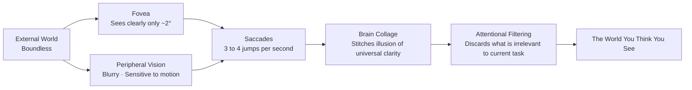

# Chapter 1 Seeing

> Before pressing the shutter, first see. The camera can record for you, but it cannot stop for you.

---

Every morning as we push open the door, countless sights drift past our gaze: the faint mist condensing on the window of a commuter train, a lukewarm porcelain cup at the edge of the breakfast table, the brass surrounding an elevator button worn lustrous by countless fingertips, a pale smudge of grease on a lunch menu, the silhouettes of a couple arguing in hushed tones beneath a streetlight as dusk settles, and the final glow of twilight receding inch by inch along the balcony railing. We have undeniably encountered each of these scenes, yet the vast majority vanish without a trace in an instant, never stirring the faintest ripple in our minds.

This is not due to any dullness of the eyes, but to the unsparing triage our brain performs at every waking moment: it swiftly weighs whether what lies before us is relevant to our immediate survival and tasks; the moment something is judged inconsequential, it is quietly swept to the periphery of memory. In other words, everyday "looking without seeing" is not a defect of physiological vision, but attention tirelessly performing subtraction on our behalf.

Yet there are always a few images that linger against all expectation. Exactly which scene will pierce this sensory shield can rarely be predicted in advance. It might be that lingering slant of evening sun upon the balcony, or the fleeting glance from the leaner of the two figures beneath the streetlight. You were not actively searching, yet your steps suddenly slow, your breath catches, and the faintest question stirs in your mind: *there seems to be something here.* That question is so subtle that the slightest distraction will scatter it to the wind.

That momentary pause is the true beginning of "seeing."

Whether one can make photographs of lasting resonance does not depend on how rapidly the shutter is released, nor on how many frames are captured in a single day, but on how many scenes from first light until nightfall truly made you stop and gaze. This distinction is often imperceptible amid the bustle of the field—two people standing shoulder to shoulder, holding their cameras in the same manner, searching with the same restless intent; yet once they return to the desk, the difference is unmistakable. Someone may press the shutter hundreds of times without yielding a single compelling image, not because they shot too little, but rather because the moments when they genuinely paused for deep reflection were far too rare. The impulse behind those hundreds of exposures often stems merely from a superficial curiosity—"the scene here is nice enough, let me record a frame"—which remains worlds apart from aesthetic seeing.

A seasoned photographer may release the shutter only twenty or thirty times in an entire day, but before each depression of the fingertip, their mind has already paused completely: discerning the subtle detail deep within light and shadow that stirs them most, and then deliberately judging whether this physical scene can be held gracefully within a two-dimensional frame. What they release is not casual curiosity, but a resolve forged through quiet deliberation.

---

## Why a Photograph Endures

*Dorothea Lange, "Migrant Mother," 1936. Lange encountered Florence Thompson and her family at a pea-pickers' camp in Nipomo, California, making six exposures during a brief stop; the image that later became a masterpiece was the final, most tightly composed frame of the series. At the time, she did not record her subject's name, judging only that these photographs might draw attention to the plight of the camp; this also serves as a reminder that behind iconic images lie questions regarding the subject's identity, circumstances, and narrative agency. Widely reproduced ever since, the photograph has become one of the most recognizable portraits of the twentieth century. [Image Source and Reuse Notes](image-credits.md#lange-migrant-mother)*

---

## What the Brain Deletes First

The ten minutes Lange spent lingering in that muddy camp are worth pondering because, for most people living under the inertia of daily routine, "stopping to see clearly" in the purest sense rarely ever happens. Returning to the assertion at the opening of this chapter: failing to see is not due to any defect of the eyes. If we probe deeper, we arrive at a simple truth: our everyday belief that we take in our entire surroundings at a glance is itself, to a great extent, a remarkable illusion.

On the human retina, the area truly capable of resolving fine detail is actually minuscule. That tiny depression known as the **fovea** measures merely one to two millimeters across, densely populated with the cone cells most sensitive to color and sharpness. Only objects upon which our gaze falls squarely can enjoy extraordinary clarity and vivid color. The moment our line of sight drifts even slightly from this tiny realm, resolving power degrades rapidly; reaching the periphery of vision, the world is reduced to hazy contours and an alertness to motion, while color retreats into dim monochrome. The division of labor among the three regions is roughly outlined in the table below:

| Region | Approximate Field of View | Resolving Power |
|---|---|---|
| Fovea | Approx. 1° to 2° | Highest; can resolve fine details down to approx. 1 arcminute |
| Parafovea | Within approx. 5° | Degrades rapidly; edges become progressively blurred |
| Peripheral vision | Up to approx. 200° horizontally | Extremely low; virtually no color perception, but exceptionally sensitive to motion |

Translated into everyday proportions, the clear zone covered by the fovea corresponds roughly to the area obscured by your thumbnail when you extend your arm straight ahead and raise your thumb. The magnitude of this visual angle can be derived through a simple optical calibration formula: letting the physical width of an object be \( S \) and its distance to the eye be \( D \), the visual angle \( \theta \) subtended on the retina satisfies:

\[ \theta = 2\arctan\frac{S}{2D} \]

A thumbnail is about two centimeters wide; with the arm extended, its distance to the eye is roughly sixty centimeters. Substituting these values into the formula, \( \theta \) comes out to almost exactly two degrees. This means that in the entire room you currently believe you see in full view, the portion truly captured in sharp focus by the retina is perpetually limited to an area no larger than that thumbnail; everything else is a coarse, desaturated, and indistinct backdrop.

Why, then, do we never notice this pervasive blur? The secret lies in the fact that our eyes are never at rest for a single instant. Through a physiological mechanism known as a **saccade**, the eye darts three to four times per second, rapidly directing that tiny fovea toward different points of focus—much like holding a pencil-thin flashlight, tirelessly sweeping a dark room. Operating behind the scenes, the brain quietly stitches this sequence of spatiotemporally disjointed fragments of sharpness into a seamless, seemingly all-encompassing panoramic image where everything appears crystal clear.

The stable, complete world before our eyes is in truth the result of the brain constantly collaging and filling in gaps in real time across milliseconds, rather than the physical reality of an all-at-once holistic exposure. What is even more subtle is that during each ballistic shift of the eyeball, the visual pathway is actually momentarily severed; otherwise, we would perceive a dizzying blur of motion trails. This physiological masking is known as **saccadic suppression**. That we never register the tens of thousands of instantaneous blackouts that occur throughout a day is entirely thanks to the brain smoothing over every one of these tiny fissures.

Once we understand this intricate physiological apparatus, we can better grasp what it means that "attention is continually performing subtraction." Since the visual targets that can enjoy sharp resolution at any single moment are so vanishingly few, the brain must perpetually decide on your behalf where next to direct this miniature searchlight; and the navigational compass it follows is precisely whatever task occupies your immediate concern. What we call "seeing" is, in essence, nothing more than this searchlight occasionally breaking free from the tyranny of everyday utility, lingering for an extra moment in some seemingly purposeless corner.

A classic experiment in the history of psychology illustrates just how ruthless this cerebral subtraction can be. In 1999, researchers Simons and Chabris asked participants to watch a video and attentively count the number of passes made among players wearing white shirts. While everyone was intently counting, an individual dressed in a full gorilla suit strode casually across the center of the court, even pausing before the camera to thump their chest. The post-experiment tally was astonishing: nearly half of the participants had no awareness of the gorilla's presence whatsoever. Their gaze had clearly swept over it multiple times, and sharp images had formed on their retinas; yet simply because there was no place for a gorilla in the directive to "count passes," attention cleanly excised it from conscious awareness. In cognitive science, this phenomenon is known as **inattentional blindness**.

What makes this experiment so thought-provoking is that it exposes a universal reality: the compelling sights we miss in daily life are rarely hidden away in obscure places; on the contrary, they often stand squarely in plain view. It is merely because we are thoroughly preoccupied with our own "passes"—those trivial goals we deem indispensable—that we brush right past them. The subtle difference between a seasoned photographer and an ordinary observer often lies precisely in the former's poise to set down their "passes" at any moment, so that the "gorilla" walking down the street may finally be quietly observed.

---

## Seeing, or Possessing

In *On Photography*, Susan Sontag wrote that taking pictures is not merely an event, but a way of attempting to possess the thing being photographed. What she examined and warned against was not any particular make of camera, but the psychological shift latent within the very act of photographing. Once a camera is in hand, the mind all too easily leans toward the mechanism: eager to claim the scene before one's eyes as one's own, anxious to confirm that one has successfully "gotten the shot," while forgetting to immerse oneself in closely examining the very grain of things. It is often from this single fleeting impulse that possession quietly supplants the gaze.

Sontag wrote down these insights in 1977. At that time, photography still moved to a measured, tactile rhythm: raising the camera, focusing, depressing the shutter, and only days later lifting the damp photographic paper from the chemical bath of the darkroom. The entire sequence was deliberate and filled with anticipation, continually reminding you that you were transforming the world before you into a two-dimensional plane. It was precisely this unhurried process that left ample room for deep, contemplative looking.

Today, the reality is vastly different. What truly fractures our gaze is often no longer the camera, but the pervasive mobile screen. The moment a device is raised, attention is instantly scattered: one part glances at the screen, one part listens for noise, and another has already darted ahead to the upcoming social media post—while the vivid world actually stretching before one's eyes recedes into a blurred backdrop. A person walking through a marketplace with a lens held out, watching their own expression in the frame while listening to their own monologue, and simultaneously minding the pedestrians on either side—this state is far closer to content production, bearing no comparison to the serene clarity of quiet observation.

Yet the camera itself is not inherently an obstacle to seeing. In many quiet moments, it serves instead as a remedy that slows the racing pulse. The instant the eye presses tight against the viewfinder, the tumultuous world is gathered by a decisive frame into a two-dimensional plane for quiet contemplation. The viewfinder crops boundless reality into a canvas that invites sustained gaze. And the existence of this crisp boundary compels you to face the most fundamental decision: in this entire expanse of the world before your eyes, what clutter must be discarded, and what essential structure must be preserved?

When first starting out, we often resist this act of letting go. We try to crowd everything in our field of vision into the frame, terrified of leaving out a companion beside us, missing the distant buildings, or leaving the viewer unable to tell where we were. Only after long exploration do we gradually come to understand and embrace that plain truth: a good image is never made by accumulation, but is the fruit of disciplined subtraction; the elements cropped outside the frame are not a loss, but precisely what creates the breathing room for the subject within. Pressing the shutter is, in essence, an act of subtraction: subtracting the disordered world beyond the frame, transforming the chaos outside the focal plane into layered interplay between sharp and soft, capturing that fleeting slice of light and shadow—until what finally settles is an image endowed with vitality.

---

## From Recognition to Seeing Anew

Strolling through European museums, one often witnesses a curious sight: a crowd of visitors clusters before a quiet, modest painting by Vermeer, raises their smartphones, taps their screens, glances down to verify that the image has been recorded, and then promptly turns on their heels to rush toward the next gallery—the entire sequence taking scarcely a few dozen seconds. In a strictly physical sense, they have indeed “seen” the painting. Yet, were one to ask softly at the very moment they turn away—what delicate curve hangs at the wrist of the woman pouring milk?—scarcely anyone could answer with ease.

Such an act is far removed from genuine contemplation. What it fulfills is nothing more than confirming that the masterpiece still resides there and that one was physically present before it—a gesture closer in nature to sending an “I have arrived” notice while traveling. In the same way, the everyday photographs taken by so many people amount to little more than a superficial registration of presence: proof that “I was here,” proof that “this thing truly existed,” without ever penetrating the interior life of the frame. Once the registration is complete, the photograph's mission is declared finished; henceforth it sleeps indefinitely in the depths of some storage medium, never again finding occasion to be awakened.

The criterion for testing this is, in truth, exceedingly clear: years after the pictures were taken, if you find that an entire year has passed without you once feeling a genuine impulse to open your old archives, then the vast majority of those dust-covered records were likely nothing more than hurried registrations, rather than acts of quiet, attentive seeing.

There is no shortcut for crossing from superficial “registration” to profound “seeing”; one can only surrender sufficient time to the frame. The reason time can reshape vision is that looking is itself a progressive, layered act. As long as you are willing to linger before a scene for a few minutes more, the first layer of superficial, label-like information will slowly disperse like morning mist, allowing the deeper texture and spirit concealed behind it to emerge with quiet composure. At first, you might recognize only that there is a figure in the frame; gaze a little longer, and only then do you begin to decipher, in sequence, her brow, the line of her shoulder, the steady composure in the tension of her fingers, and—most crucially—the tender harmony sustained between her and the beam of daylight pouring through the windowpane beside her. For this very reason, immersing oneself before a painting for five minutes yields an entirely different work than skimming past it for thirty seconds; likewise, waiting quietly at a street corner for ten minutes introduces you to a fundamentally different city than snapping a shot and immediately turning to leave.

From 1952 until his death in 2013, Saul Leiter lived in an apartment on East 10th Street in New York, hardly ever relocating over the course of more than sixty years. What he spent a lifetime gazing at and freezing in the frame was, again and again, nothing more than the few ordinary streets outside his window: a woman with a red umbrella stepping out of a corner shop, a yellow taxi gliding quietly beneath his window, white plumes of steam rising slowly from iron grates in the pavement, a postman making his deliberate way through quiet snow on a morning after a storm. For most of his days, he felt no rush to release the shutter; he simply sat by the window with a cup of coffee, keeping quiet watch, until at some fleeting moment the colors, the moisture in the air, and the geometric shapes outside aligned seamlessly with the rhythm deep within his mind—and only then would he raise his camera with easy grace and gently expose a frame.

In an era when the world broadly assumed that only black-and-white could qualify as serious photography, Leiter was already using color film to capture this everyday poetry. Such prescient sensitivity found few sympathetic ears in his time; only in his later years was his work recognized anew by the world, celebrated as a classic of early color street photography.

Within Leiter’s quiet ease lies a lesson far deeper than merely “waiting patiently”: what he recorded were not distant spectacles, but precisely the everyday street life encountered day after day beneath his window. Humans harbor an instinctive alertness and curiosity toward unfamiliar realms; upon arriving in a foreign place, our eyes widen involuntarily, finding novelty in everything from the worn texture of paving stones and the design of a postbox to the typography of street signs. Yet when confronted with the well-trodden paths walked day after day, the brain does the exact opposite: to conserve energy, it crudely packages these customary sights into a few ready-made conceptual labels—the convenience store downstairs, the commuter bus taken daily, the corner turned on the way home. Thus you assume you are still seeing them, when in reality you are merely “recognizing” those labels once more with practiced familiarity. Between “seeing” and “recognizing” lies an aesthetic chasm.

The reason this “recognition” is so deeply entrenched is that our brain is by no means a mechanical sensor faithfully recording light; it resembles, rather, an eager debater who habitually jumps in with an answer, offering up its verdict based on past memories before sensory signals have even fully arrived. Modern cognitive neuroscience increasingly suggests that human perception is, at its core, a process of **predictive processing**. The brain first constructs an internal model in the subconscious of “what ought to appear here,” and then checks it against the faint signals received in real time by the eyes. Routine details that conform to expectations are skipped over entirely; only unexpected deviations are treated as novel information worthy of expending cognitive energy.

This mechanism shields us immensely from the exhaustion of sensory overload, but the cost is just as clear: any scene you tread repeatedly and believe you know beyond doubt is almost entirely overtaken by this predictive model, dismissed as “no different from yesterday” and filtered straight out of awareness. If the street corner downstairs has become invisible to your vision, it is not because it has lost its luster, but because it conforms so seamlessly to your preconceptions that the mind deems it entirely unworthy of another glance.

To see a familiar place once again as foreign territory is an interior discipline that requires patient cultivation; in a sense, it is far more difficult than traveling to the ends of the earth in pursuit of spectacles. The novelty of an exotic landscape performs most of the aesthetic awakening for you; in a familiar haunt, however, there is no external novelty to rely on—everything depends on your own effort to wipe away the dust of habit and polish your vision anew.

The method for honing this discipline is fundamentally simple, though it demands persistent resolve: choose an ordinary corner you pass every day, and look closely at that same spot across changing hours from dawn to dusk, in clear skies and downpours alike, perhaps even photographing it continuously for a full month. During the first few days, you may well feel at a loss where to begin, for everything that meets your eyes is nothing but stale labels; yet as you force yourself to return to the scene time and again, those rigid labels will gradually loosen and flake away under the steady soak of time. Light shifts subtly each day, and the figures brushing past offer an endless variety of forms; the same mottled concrete wall in a torrential downpour and under the raking glow of the evening sun is unmistakably two entirely different living entities.

Only when the day comes that you can stand in a familiar place you have looked upon a hundred times and still keenly capture a previously unseen ripple of light and shadow, can your eyes truly be said to have attained new life. Paris through the lens of Atget, the East Village outside Leiter’s window, Shinjuku beneath the feet of Daido Moriyama—each is a world polished again and again through decades of affectionate revisiting.

Eugène Atget was a practitioner who pursued this discipline to extraordinary depth. From the late nineteenth century until his death in 1927, burdened with a heavy large-format view camera and glass plates, he walked alone through the streets and alleys of Paris for nearly thirty years, dedicated to recording the traces of the old city on the verge of vanishing beneath the tide of Haussmann’s urban transformations: deserted, damp street corners in the early morning, plaster mannequins with enigmatic expressions in shop windows, weathered wrought-iron signs of bistros, a vine-clad balustrade in a secluded courtyard, a crumbling statue amid overgrown weeds. In his lifetime he remained virtually anonymous, selling these images for modest sums as mere “source material” for painters and stage designers; only toward the end of his life did the young photographer Berenice Abbott recognize the quiet gravity in his work and dedicate herself to preserving his negatives for posterity. His ability to perceive an entire ancient metropolis as an unknown space rested precisely on the power to transform the familiar, again and again, into something seen for the very first time.

William Eggleston arrived at a comparable depth along a different path. What he gazed upon throughout his life were the most inconspicuous, mundane scenes of the American South: a rusted child’s tricycle parked along the curb of a suburban red-brick street, a cluttered freezer stuffed with frozen foods, an empty bathroom tiled in dark green, and a ceiling painted deep red with nothing more than a bare lightbulb suspended from it. In 1976, the Museum of Modern Art (MoMA) in New York mounted a solo exhibition devoted entirely to his color photographs, stirring intense debate at the time; the art world of the era still regarded black-and-white as the sole orthodoxy for serious art, while color was routinely dismissed as the handmaiden of commercial advertising and family snapshots.

Although MoMA had previously exhibited color explorations by pioneers such as Ernst Haas and Marie Cosindas, Eggleston’s exhibition became an undeniable watershed in the history of photography. With a lucid and potent visual vocabulary, it elevated the mundane, trivial colors of everyday life to the stage of serious art. He later characterized this way of looking as the “democratic camera”: through his lens, a battered tricycle and a magnificent Baroque cathedral possessed equal dignity; everything in the world was worthy of affectionate scrutiny. Democratic seeing is precisely this kind of unclouded, egalitarian poise: it refuses to prejudge what is worthy of entering the frame, allowing subjects long dismissed as banal and passed over by the world to reveal their poignant brilliance once more beneath his cool, tender gaze. [MoMA’s retrospective on its photography exhibition history](references.md#photography-history) chronicles this chapter in the journey of color photography in rich detail.

---

## Anticipation Precedes Reaction

The celebrated photograph taken by Henri Cartier-Bresson in 1932 behind the Gare Saint-Lazare in Paris has long since become an icon of photographic history: a man in a dark suit leaps across a flooded puddle, suspended in midair, his heel on the verge of touching its reflection in the water; on the weathered poster covering the fence in the background, the silhouette of a dancer happens to echo his graceful leap. Virtually every photography textbook draws upon this image to expound upon the "decisive moment," yet rarely does anyone examine a far more fundamental premise: before seizing that fleeting glimpse, just how long had he stood beside that freezing puddle?

Cartier-Bresson would later recall the truth of that moment: behind the station stood a wooden construction hoarding, through a gap in whose planks he cautiously slipped his lens. The gap was so narrow that the shadow of the wood still obscured a corner of the frame's left edge. The man leaping across the standing water did not appear out of thin air; the photographer had already set his exposure and locked his focus, waiting behind the gap where the light came through, intently watching for the pedestrians who would inevitably pass by. Only when the striking play of light and form finally arrived was he able to catch it with steady poise. Behind this seemingly coincidental photograph lay a long and steadfast vigil; and ahead of that vigil stood a clear-eyed anticipation of space, motion, and order.

The notion of the "decisive moment" has since frequently been mystified by posterity—a concept that Chapter 6 of this book will dissect in greater detail. For now, we need only clarify one point: images that reward sustained looking rarely arise from aimless street wandering. Those who stake all their hopes on serendipity may walk a thousand streets only to return empty-handed; this is not because the city has lost its poetry, but because from beginning to end they never made an active anticipation of reality.

The capacity for anticipation is nourished by two cornerstones: first, whether you are willing, when confronted with a scene, to invest unhurried time in examining it closely; and second, whether over the course of past years you have built with your own hands tens of thousands of similar spatial armatures. The former can be practiced with quiet dedication starting this very afternoon, whereas the latter is by no means the work of a single day; it demands the tempering of years, internalizing into bodily instinct through repeated acts of looking.

When it comes to feeding visual anticipation through sheer volume of shooting, Garry Winogrand went to radical lengths. This master of New York street photography spent virtually his entire life with a camera in his grip. In bursts of intense momentum, he could burn through more than a dozen rolls of film in a single day, navigating the streets and alleys of Manhattan and recording the flowing pageant of street life frame by frame without missing a beat. He left behind a widely quoted aphorism that laid bare this near-obsessive approach: he photographed, he famously said, to see what things look like photographed.

For Winogrand, the shutter was no longer merely a tool for recording predetermined judgments, but had become a means of seeing in itself: through continuous, relentless shooting, he compelled himself to look without ceasing. In his later years, his production grew so vast that when he passed away in 1984, he left behind more than 2,500 rolls of undeveloped film, alongside tens of thousands of developed contact sheets that had never been closely examined, let alone edited—a sum of hundreds of thousands of negatives that he himself had never truly scrutinized.

This archive amassed from mounds of negatives is often cited by later critics as a cautionary tale pointing to excess and a lack of restraint. Yet viewed from another angle, it serves as a vivid footnote to the truth that "anticipation springs from prolonged accumulation." If someone has truly captured the nuances of human nature on the street hundreds of thousands of times, their intuitive foreknowledge of what will happen here in the next second will inevitably reach an extraordinary pitch of acuity. Though Winogrand took this to an exhausting extreme—where uncurbed recording ultimately overwhelmed the mental stamina required for quiet selection, an issue we will examine later when discussing editing—he nonetheless offers an unadulterated example of how sharp anticipation is cultivated by the patient investment of time.

---

### Seeing Has Its Own Rhythm

True seeing possesses an unhurried cadence entirely its own.

You might spend an entire day moving through the city streets, your eyes meeting nothing but the mundane traffic, glass facades, and curbs, everything slipping past your gaze like water without stirring a single ripple. And then, on a morning no different from any other, you find yourself waiting for a red light at an intersection where you pause every day. The morning light breaks through, slanted and freshly washed. Across the street, a woman in a light gray coat happens to pause before a glass curtain wall, freshly rinsed by rain and still glinting with a cool, watery blue; and deep within that limpid curtain wall, there is reflected a touch of warm yellow from the corner rooftop.

The entire world seems to come to a standstill before your eyes.

Almost in that same instant, the gears of your mind are already turning in silence: you rapidly weigh what focal length to choose to gather this tension of warm and cool tones, wondering if you need to take two gentle steps forward to avoid a clutter of pillars; at the same time, your peripheral vision is tracking whether a cyclist passing on the left might shatter the balance of the frame, even as you silently count down the final seconds of the red light.

As for that final split second—whether you calmly pressed the shutter or watched the light turn green and the crowd scatter without ever releasing it—that has actually become secondary. What is truly rare is that in that electric, fleeting second, you were entirely "present": you witnessed with your own eyes how a compelling visual order quietly germinated within the everyday, and you understood with utter clarity why you were so deeply moved. If you can experience a single moment of such lucidity in a day, the day has not been spent in vain; if you can enter this state of undivided contemplation several times in a week, your photographic eye is already quietly transforming.

In the final analysis, a person whose mind is never truly "present" will fail to produce a single image of genuine warmth even after releasing the shutter ten thousand times; whereas for someone truly immersed, even if they capture only a single frame all day, that lone exposure carries a quiet, undeniable gravity.

---

## How Gestalt Organizes the Frame

The sense of harmony when a scene "comes to a standstill" often occurs far earlier than conscious awareness. Before you have even had time to dissect in words why you were stirred, your low-level visual system has already stepped ahead, quietly gathering the chaotic crosscurrents of light, shadow, and lines before you into several organic, unified wholes.

These principles of visual self-organization that precede consciousness were systematically uncovered in the early twentieth century by a group of German psychologists, giving rise to the profound field of **Gestalt Psychology**. The core law they discovered appears deceptively simple, yet it fundamentally shaped our understanding of visual art: when human beings gaze upon the world, they do not first isolate disparate dots and lines and assemble them piece by piece; on the contrary, perception apprehends the whole from the very outset, and the brain instinctively weaves scattered elements into order according to an innate set of tendencies.

We draw upon these covert principles every day without conscious awareness:

*   **Proximity**: Objects situated close to one another in space are instinctively grouped by the eye into a single whole.
*   **Similarity**: Elements sharing common traits in color, brightness, shape, or direction of movement are automatically recognized as belonging to the same family.
*   **Continuity**: The human gaze prefers to follow smooth, unbroken paths, instinctively resisting jarring, abrupt fractures and angles.
*   **Closure**: When confronted with incomplete or broken contours, the brain automatically engages the imagination to stitch and complete the gaps—if several black discs with missing wedges are arranged at specific angles, a pristine white triangle will vividly emerge before the eyes even though the center is entirely empty; this is the famous Kanizsa triangle.

In daily life, these perceptual principles relieve us of countless cognitive burdens, yet the moment we raise a camera, they turn into a double-edged blade.

Their virtue lies here: when a photograph allows a viewer to "grasp it in a flash," it is entirely because Gestalt principles are secretly guiding the eye—several pedestrians, by virtue of standing close together, are read as a collective group; a row of bright windows, through geometric similarity, is distilled into a pure rhythm; a winding railing, through the fluidity of its line, effortlessly leads the gaze toward the distant horizon.

Their danger lies here: precisely because this organizing mechanism operates spontaneously and unconsciously, the distracting elements in the frame that you failed to notice will just as ruthlessly be bundled into the composition—a dull wire cutting across the background above people's heads will instantly bind two otherwise unrelated pedestrians together; a harsh, slanting shadow on the ground, through an overpowering sense of continuity, will forcefully drag the viewer's gaze away from the true subject.

The craft of composition is, for the most part, an unhurried game played against the underlying self-organizing instincts of the human visual system. When you repeatedly fine-tune your position before the viewfinder and wait patiently for the slightest shift in the scene, you appear on the surface to be arranging physical objects, but at bottom you are prearranging a natural path of visual wandering for the future viewer: deciding where their gaze will linger, and where it will draw all things together into pure resonance.

---

## Practicing Without a Camera

There is a remarkably simple exercise that often leaves one feeling utterly disoriented on the first attempt: when stepping out for a walk, deliberately leave every camera and lens at home, and go empty-handed.

The true intent of this exercise is neither to make you miss valuable opportunities for documentation nor to practice some form of ascetic restraint; what it genuinely asks is that you completely sever the act of seeing from the act of possessing, allowing your eyes to relearn a pure gaze unburdened by utilitarian intent.

Stepping out on the first day often brings a profound sense of loss, your fingertips left idle and bereft. Rounding a corner, you catch sight of an exquisite slant of afternoon light grazing a weathered brick wall; instinctively, your body reaches to your side to grope for a camera, only to grasp empty air. In that moment, a faint pang of melancholy is inevitable—a conviction that a rare, fleeting frame has slipped through your fingers. By the second day, this restlessness quietly subsides. And by the third day, you will likely discover, with no small wonder, an unforeseen shift: once you have completely surrendered the compulsion to shoot, the world you genuinely perceive becomes vaster and deeper than ever before.

The reason behind this is not complicated. When a camera hangs against your chest, the moment a scene crosses your field of view, your mind shifts within milliseconds into combat readiness: rapidly calculating focal length, gauging lighting ratios, and searching for vantage points. Once this mechanical logic is triggered, pure aesthetic contemplation is quietly eclipsed; from that instant onward, what you behold is no longer the inherent vitality of things, but rather the technical guise they might assume once compressed onto an image sensor. While this purposeful gaze aimed at tangible output certainly has its professional value, it remains fundamentally distinct from a state of mind that quietly observes the effortless self-fulfillment of all things, free from distraction.

Naturally, there is no need to go to the extreme of throwing the baby out with the bathwater. Setting aside one or two days a week to walk empty-handed is quite enough; on the remaining days, you can still carry your camera at leisure and devote yourself to creation. The light and shadow left unrecorded on a sensor during these empty-handed strolls may never materialize into concrete works, yet imperceptibly they will reshape how you see: you will etch into memory a certain mellow luster that arrives only on specific afternoons, the delicate bounce of subtle gleam off wet asphalt after rain, and the serene expressions that flit across ordinary faces when their guard is down.

Aesthetic insight is, in essence, like a muscle of the mind: exercised often, it grows ever more acute and lucid; left too long in the rut of mechanical inertia, it inevitably dulls into numbness.

---

## Why Photographs Need Secrets

Diane Arbus once left behind a thought-provoking aphorism: "A photograph is a secret about a secret. The more it tells you, the less you know." (*A photograph is a secret about a secret. The more it tells you, the less you know.*) Upon first reading, it is easy to mistake this for mere artistic wordplay; yet if one keeps it tucked safely in one's heart and revisits it over the years, its profound depth gradually begins to reveal itself.

The work of novice photographers often errs on the side of an overeager desire to explain. "This is the Eiffel Tower at four o'clock in early autumn"; "This is the candle being blown out at a family birthday dinner." Within the confines of a cramped frame, time, place, characters, and causal links are all laid bare without reserve, while the lighting is often handled with flat, literal obviousness, illuminating every corner until nothing remains unsaid. All information is dispensed like a checklist, entirely without veil; the result is that a viewer takes it all in with a single glance, leaving the mind with no yearning to linger or imagine.

Arbus's photograph taken in New York's Central Park in 1962, *Child with Toy Hand Grenade*, stands as a classic paradigm of reticence and negative space in the history of photography: in the frame is a slight young boy wearing suspender shorts, his right hand clutching a toy grenade in a death grip, his left hand curled into a tense claw, his face strained in an expression of near-grotesque tension.

She had in fact shot an entire roll of film that day. In the other frames, the same boy is seen relaxing and laughing, tilting his head innocently, or playing with companions nearby—ordinary portraits of unblemished childhood innocence throughout. Yet from all those negatives, Arbus singled out only this one frame. This photograph offers virtually no definitive backstory or consequence: you cannot tell why he is crying out, you do not know where his parents are at that moment, nor can you even discern whether the sky that day was overcast or bathed in bright sunshine.

Precisely because it discloses so little to the world, a pause of a few seconds will never exhaust it: gaze at it for a minute, and you will find yourself pondering the emotional tension latent beneath that small, frail body; gaze at it for five minutes, and in that bizarre, strained expression you may even glimpse the unsoothed loneliness buried deep within your own childhood.

Images that preserve a measured reticence often possess a far more enduring allure than pictures overloaded with information. This is the fundamental reason why compelling photographs withstand repeated viewing: they never surrender their answers in a single, crude delivery, but forever safeguard an expansive terrain in the depths of light and shadow where the viewer's mind can dwell and reconstruct. Learning to embrace shadow, concealment, and the beauty of what is left unspoken—learning to deliberately leave a corner of the narrative for the viewer to fill—is therefore an indispensable rite of passage for every creator growing toward maturity.

---

## Growing Your Own Eyes

Having arrived at this point, what we must ultimately confront are the eyes that belong solely to you.

After exploring the path of photography for several years, many creators arrive at the same awakening: what develops on the film has never been merely the objective external world, but a projection of the photographer's inner state of mind. You gradually come to realize that you are inexplicably drawn to subtle light entering from a particular angle; that you find ease only when maintaining a certain breathing distance from your subject; and that you involuntarily reconstruct the same geometric orders time and again in your compositions. This is not deliberate imitation, but rather evidence that across these passing years, your eyes have grown into their true, intrinsic temperament.

Saul Leiter kept watch over a few old streets in the East Village his entire life. His visual vocabulary was gentle, quiet, and suffused with poetry: glass veiled in condensation, a red umbrella after rain, street corners washed in the blended glow of neon and snow. His field of view was often quietly cleaved in half by a coarse pillar or the shoulder of a passerby, and because he favored expired Kodachrome film, his color palette acquired an understated elegance, as though rinsed by running water.

Daido Moriyama, by contrast, long made Tokyo's Shinjuku his visual stronghold while roaming the length and breadth of the Japanese archipelago, yet his lens ventured in the diametrically opposite direction: gritty, intense, claustrophobic, and fraught with tension—the stray dog in *Stray Dog* turning back in the early morning of Misawa, Aomori, to glare coldly into the camera; high heels stamping heavily across wet black asphalt; grain as coarse and heavy as a sheet of sandpaper.

Even if the geographic locations of these two creators were swapped, the outcome would remain fundamentally unchanged: Leiter in Tokyo would still capture a Tokyo as gentle and lyric as poetry; Moriyama wandering through Manhattan would still render New York as a raw, turbulent urban jungle. What a mature photographer documents is never a specific set of geographical coordinates, but the distinct sensibility with which they behold the world.

You, too, naturally possess an aesthetic order uniquely your own, though at present, standing in the middle of it, you may not clearly discern its complete contours. The method for putting this into practice is as simple as it is pure: continue shooting with conviction and sincerity, and at the end of each year, hold a modest retrospective—print out the twenty photographs that brought you the greatest satisfaction from the entire year, lay them side by side across your desk, and contemplate them in quiet stillness.

Allowing things to settle like this for two or three years, certain inner threads that surface repeatedly across different times and spaces will reveal themselves of their own accord. The light and shadow you continue to select time and again after the wash of time are nothing less than your authentic self. Once you see these recurring imprints clearly, the mind usually undergoes a dual, alternating evolution: on the one hand, you will focus more intently on honing these traits, rendering the distinctive voice of your work ever purer; on the other hand, you will feel compelled to challenge them with new experiments, knowing full well that indulging in familiar formulas will only bring creative vitality to a standstill. The push and pull, the upward spiral of these two forces, is what constitutes a creator's true maturity.

Along this path of inquiry, the questions weighing on your mind also evolve year by year. In your first year, what you most urgently seek to understand is how to configure every camera parameter; by your third year, what you yearn to grasp is the architecture of subject matter and the art of directing it; and by your tenth year, the question lingering in your heart has likely shifted into a far more essential contemplation: What, ultimately, am I gazing at in this world? And why am I moved, time and time again, by this particular light?

This book cannot achieve every future realization on your behalf—that step must ultimately be discovered through your own practice. Yet the steps leading there, and the vistas along the way, have already been unhurriedly laid out for you in the chapters that follow.

---

## Exercises

Spend a week walking empty-handed, carrying no photographic equipment whatsoever. Each evening, choose a single scene from among the sights that genuinely stirred you during the day, and carefully write down a single line in a pocket notebook: what you saw today. When the week comes to an end, you will have gathered seven unadorned lines of writing. Modest as they may seem, they are the authentic records left behind by seven moments when you were truly "present."

Select a classic photobook by a master photographer you admire, preferably a physical printed volume. Each morning, quietly study three plates, gazing intently at each for at least two minutes. In tandem with this, cultivate a rigorous editing discipline: select only a single frame from all the exposures made that day, accompanied by a short passage explaining why it is irreplaceable. Persevere for a year, and you will have amassed over three hundred thoughtfully chosen frames.

Behind these two seemingly modest exercises, what is truly being cultivated is a single, essential habit: allowing yourself to slow down before the physical world, and lingering a moment longer in the presence of moving light and shadow. Every other skill and instinct in photography—be it the rigor of composition, the acuity of timing, or the discernment exercised in the darkroom—will grow naturally from this soil.

---

Next Chapter: [Chapter 2 Light](02-light.md)
