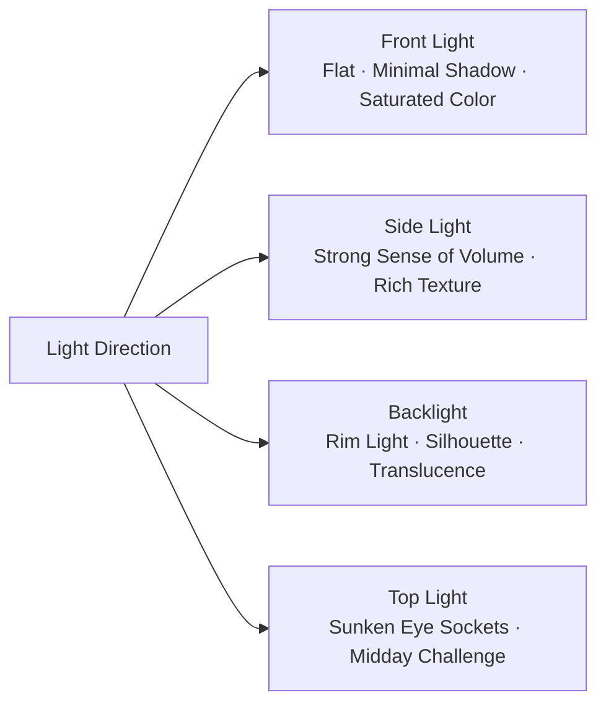
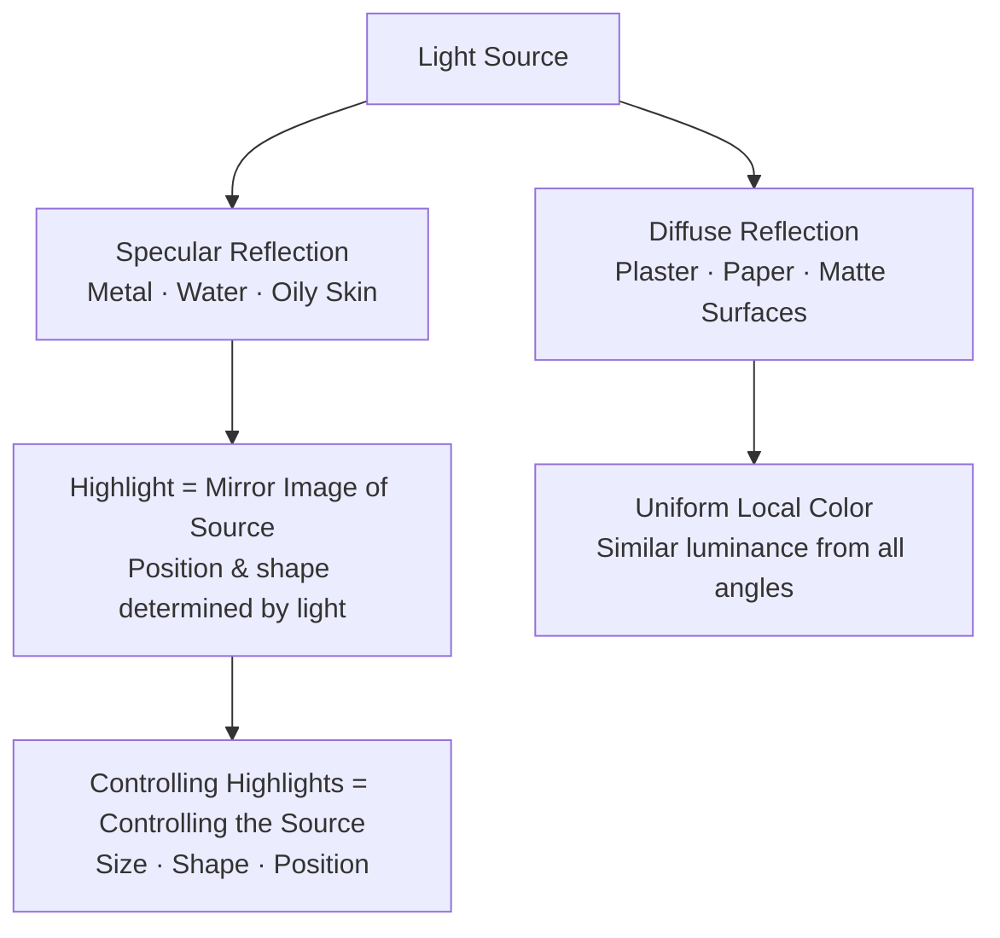
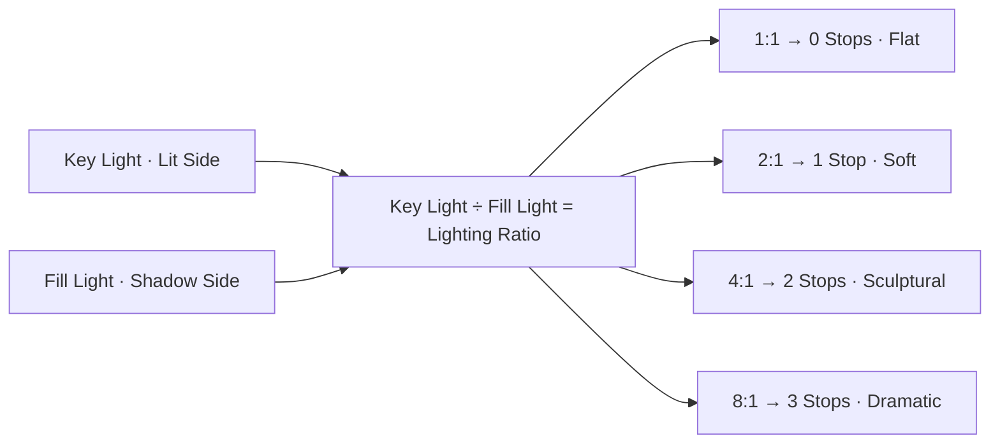

# Chapter 2 Light

> Photography is drawing with light. Familiar though the maxim may be, it cuts straight to the essence of the medium. When arriving on a scene, never rush to ask whether there is sufficient light; instead, first evaluate its direction, how it sculpts the forms it touches, and whether it can sustain the underlying order of the frame.

---

## Read the Light Before the Scene

You find yourself in the garden of Ginkaku-ji in Kyoto. Late autumn twilight unfolds across the grounds as a low slant of setting sun pierces the ancient maples outside the temple gate, casting a dense, weighty gold across the raked white sand of the dry landscape garden. Two groundskeepers in black kimonos move through the courtyard carrying bamboo brooms, their paces measured and quiet, their figures passing alternately between pools of brilliant light and deep cast shadows.

The camera rests inside the bag; retrieving it, powering it on, and raising it to your eye takes a pause of several seconds.

If you raise the camera in haste, surrender exposure entirely to evaluative metering, and immediately trip the shutter, the result upon playback is almost invariably disappointing: the captivating warmth of the golden light is averaged by the camera's algorithm into a lukewarm middle gray, the black kimonos float unnaturally against the yellowed gravel, and the dramatic tension of interlocking light and shadow is entirely dissolved.

Deliberate photographic practice begins well before the camera is raised, rooted in a rigorous appraisal of the light. The light sweeps in from the west across the courtyard at a very low angle and with a hard, crisp quality, throwing the raked ripples of the white sand into sharp, tactile relief; a vast dynamic contrast spans the illuminated areas and the shadows, making it impossible for a single exposure to preserve detail at both extremes; the low dusk light carries a richer warmth than that of midday, and the moment the black fabric steps into the beam, its contours will be crisply rimmed by the cross-light.

These judgments can be formed in an instant, yet they dictate every subsequent operational decision: the exposure baseline is anchored to the golden highlights to preserve rich color saturation, the composition is framed around the point where the black kimonos cut into the raking beams, and the shutter is released decisively the moment the figures step into the light. The success or failure of the frame has already been determined, well before the camera is ever brought to the eye, by these few deliberate, analytical readings of the light.

---

### The Armature of Light in a Single Photograph

*Alfred Stieglitz, "The Steerage," 1907. Traveling by ship from New York to Europe, Stieglitz looked down from the upper deck toward the steerage quarters: a steel stairway divides the frame into two tiers, while ropes, a smokestack, and a slanting white spar carve the space into distinct geometric fragments. The passengers' accommodations and restricted movement introduce social distinctions into the frame, though one cannot determine class or immigrant status simply by the hats they wear. Stieglitz later placed particular emphasis on how he had recognized the relationships between shapes at that moment; numerous histories of photography have accordingly marked this image as a pivotal turning point in modern photography. Here, the light does more than merely illuminate the deck—it propels space, distance, and geometric relationships directly into the frame. [Image Source and Reuse Notes](image-credits.md#stieglitz-steerage)*

---

## Direction Precedes Luminosity

A photographer's appraisal of light must always precede both exposure and composition. Exposure governs how that light is converted into an electronic signal; composition demarcates its geometric boundaries within the frame. Both are vital, yet neither can answer the more foundational question: does the quality of light before you possess the strength to sustain the image? Both exposure and composition are merely methods of processing light that already exists, whereas the inherent quality of the light itself is the benchmark that precedes everything else. Under light devoid of vitality, even the most rigorous composition cannot escape feeling stiff; yet when light possesses distinct texture and direction, minor imperfections in the frame are often graciously absorbed by the depth and richness of the chiaroscuro.

Novice photographers are prone to confining their attention to whether illumination is sufficient and whether the metering is accurately centered. While these two considerations must certainly be addressed, their intervention comes late in the sequence: they occur only after the light has already established the foundational tone of the image, serving at best as a passive recording of a predetermined state. What truly warrants dedicated refinement is the ability, prior to releasing the shutter, to discern the light's direction of throw, its hard or soft quality, its lighting contrast ratio, and its color temperature bias. Though formless, these four dimensions establish the aesthetic tone of the entire photograph long before composition ever takes shape.

---

### Side Light and Front Light

The direction of light is the easiest attribute to identify, yet it is also the most easily overlooked. While the concept of "side light" is deceptively simple, assessing in a live scene within seconds that a source is "striking from thirty degrees front-left at a low, raking angle" demands rigorous visual training. The essential significance of casting direction lies in how it dictates the distribution of shadows; and the placement and morphology of those shadows directly establish the volume and spatial depth of the frame.

Before examining each type of light source in detail, it is helpful to categorize common lighting angles. The direction of light relative to the subject can be broadly divided into four categories, each corresponding to a specific shadow structure and visual character:

The purpose of this diagram is to establish a core awareness: when confronting the very same subject, any shift in the lighting position inevitably provokes a radical transformation in the character of the image.

When the light source stands behind the photographer and shines directly onto the front of the subject, it is front light. Front light makes metering and exposure exceptionally straightforward, rendering colors with full saturation and revealing surface details without reservation. Yet its limitations stem from this very trait: direct frontal illumination banishes all shadows behind the subject, leaving the camera's perspective unable to capture gradations between light and shadow. Lacking the gradation of a terminator line, the three-dimensional presence of the subject is compressed into a uniform plane of brightness.

For instance, when taking a commemorative portrait before a historic monument while facing directly into harsh, front-lit sunlight, the subject's face often turns out as flat as an identification photo. The root cause is seldom faulty composition; rather, the frontal light completely washes out the natural shadows along the sides of the nose, within the eye sockets, and beneath the jaw. The bone structure and undulating contours of the human face rely entirely on subtle shadows for definition; once those shadows vanish, facial volume disappears without a trace.

Front light also possesses unique value in specific genres. Macro floral photography, culinary still lifes, and commercial product displays often prioritize the pure rendering of local color and surface texture, where a frontal light source ensures uniform coloration and gentle contrast. Yet in portraiture, street snapshots, architecture, and large-format landscapes, over-relying on front light will almost inevitably leave the image flat and devoid of tonal depth.

When the light source strikes from an angle to the side, it is side light. Whether brushing across a wall, a human face, a mountain ridge, or a wooden chair, the light carves a distinct transition from lit surfaces to shadowed planes: highlights, midtones, and shadows. It is precisely through these subtle gradations of luminance that the human eye discerns contours and mass, thereby imbuing the flat two-dimensional frame with a tangible sense of depth and dimensionality.

When first training your perception of light and shadow, side light is the ideal starting point. At three o'clock in the afternoon, a pedestrian leans against a wall outside a subway station lost in thought; sunlight cuts across them from the side, illuminating half the face while plunging the other into shadow, as smoke drifts slowly through the illuminated air. Such everyday scenes are everywhere to be found; the key lies in looking beyond mere recording of events to perceive the sculptural sense of space sculpted by the interplay of subject and side light.

Training your perception of side light can begin by observing your own cast shadow: a long shadow indicates a low light source, while a shadow huddled beneath your feet signals a high overhead light; if your shadow falls toward the front-left, the light must originate from the rear-right. Over time, before ever lifting the camera to your eye, the direction of light and your optimal shooting position will have already formed clearly in your mind.

---

### Backlight and Contour

Beginners often approach backlight with apprehension, because evaluative metering so easily plunges the subject into crushed, impenetrable darkness. Yet the intense contrast inherent in backlighting is precisely what unlocks the expressive power of silhouettes, rim lighting, and subject separation—visual dimensions that front light can never provide. There is no need to avoid backlighting; the vital task is to make deliberate, decisive choices regarding exposure trade-offs.

The purest expression of backlight is the silhouette. By calibrating exposure against the bright skylight, the subject descends entirely into a deep, shadowed outline. Facial details, garment colors, and subtle expressions are all concealed, leaving behind only a highly recognizable geometric form. The power of the silhouette springs directly from this stripping away of information: two silhouettes walking hand in hand against the afterglow of sunset often carry a far more profound resonance than a clearly lit frontal portrait, abstracting away concrete individual identities to elevate the image into a universal emotional chord.

Backlight can also pierce through translucent materials, awakening an innate sense of luminosity. Autumn maple leaves, sheer fabrics, crystal vessels, or wisps of hair catching the light merely exhibit surface pigments under front light; yet when penetrated by backlight, they behave like self-luminous bodies, their veined textures and color gradations unfolding into rich, radiant transitions.

A third application is rim light. A rear light source traces a luminous rim along the subject's hair, shoulders, neck, or garment edges, crisply separating the subject from a cluttered, dark background. Commercial portraiture is frequently scheduled at dusk precisely to harness the golden contours sculpted by low-angle backlighting; complemented by a soft frontal fill, the subject gains both a luminous outline and a warm, refined presence.

The difficulty of backlighting lies in the resolution of trade-offs. To preserve sky detail, the subject must inevitably sink into silhouette; if one forces the subject to be brightened, the background sky is bound to blow out into severe overexposure. The tonal span of a backlit scene routinely exceeds the sensor's single-exposure dynamic range, demanding that one end of the spectrum be decisively surrendered. Attempting a compromise to salvage both usually results in a dull, muddy frame. Failures in backlit photography rarely stem from errors in calculating exposure settings; they arise mostly because the photographer failed to establish a clear hierarchy of visual priorities on site.

---

### Top Light and Open Shade

When the light source hangs directly overhead, it is top light. Under the harsh glare of midday sunlight, eye sockets turn into pitch-black hollows, while the base of the nose and the jawline cast heavy, unflattering shadows. While the human face relies on shadows to sculpt volume, it resists these vertical, harshly cutting, destructive dark patches. The blazing sun between eleven in the morning and one in the afternoon has always been the most challenging window for conventional portraiture.

Top light is not entirely unusable; the crucial factor is whether it serves the expressive intent of a specific context. When portraying open deserts, the crushing burden of manual labor, or sweltering environments, overhead light can create an inescapable sense of psychological oppression; in classical architecture or sacred spaces, shafts of light pouring vertically from a dome carry a solemn, monumental presence; on the sun-scorched streets of Southern Europe, midday top light offers an authentic reflection of the searing climate. When the physical properties of top light harmonize completely with the thematic message, it transforms into an irreplaceable visual language.

If portraiture must be undertaken at midday, the most effective strategy is to utilize **open shade**. Open shade refers to broad shaded zones cast by the leeward side of buildings, tall walls, or dense tree canopies: overhead direct sun is blocked out, yet the surrounding space remains wide open, suffused with soft, diffused light emanating from the entire dome of the sky. By guiding your subject into the shade of a street-facing building, the harsh overhead shadows on the face dissolve immediately, replaced by an even, delicate, and gentle light. Many portraits that appear to have been meticulously crafted with large softboxes are in fact simply harnessing the natural light-shaping barrier of architectural shade.

Open shade also possesses directionality. Whichever way the primary light opening within the shaded area faces, the subject's face should be angled slightly toward that direction. If one side is pressed against a solid wall while the other opens onto a broad street, skylight will stream in obliquely from the street, producing a gentle side light that preserves three-dimensionality while keeping the contrast ratio comfortably in check.

Furthermore, shadows are never an absolute, dead black. Ambient reflected light is perpetually present in outdoor shade: pale pavement, glass curtain walls, and even winter snow all bounce ambient light back into the shadows. When standing in the shade, whether one is next to a whitewashed wall or a dark fence can alter the illumination of the facial shadows by several stops. Discerning this allows the photographer to keenly locate natural reflective surfaces on location to support the subject.

---

## The Light Windows of the Day

Before setting out, one should establish a clear mental timetable of the day's light windows. It directly governs when to scout camera positions, the precise moment to set up the tripod, and the limits of one's patience while waiting for the light.

The span from thirty to fifteen minutes before sunrise is the **morning blue hour**. Daybreak has not yet arrived; the canopy of the sky is a deep blue verging on violet, the streetlights have yet to go out, and the city streets are hushed in stillness. Urban skylines, river-spanning bridges, and historic quarters take on a steady, composed order at this hour, while the warm tungsten glow filtering from interior windows juxtaposes against the cool blue of the sky, forming a natural dialogue between warm and cool light. Such tonal depth is virtually impossible to reproduce in broad daylight, as the intense midday sun completely overwhelms the delicate color temperature of interior illumination.

The hour or so following sunrise is the **morning golden hour**. The sun has just crested the horizon, its rays skimming low across the ground at a nearly horizontal angle, infused with gold and rose, casting long, sweeping shadows behind every subject. This near-horizontal trajectory makes for an exquisite natural sidelight: portrait faces are spared harsh shadows, the undulations of the terrain gain immense volume through their lengthened shadows, and the morning mist adds a deep sense of spatial recession.

The period from roughly an hour before sunset until the sun sinks beneath the horizon is the **evening golden hour**. Compared to the morning, the evening atmosphere has been churned by daytime thermal convection, leaving the lower air laden with fine dust and moisture; shorter-wavelength blue and violet light is scattered more thoroughly, so that the remaining direct rays take on a richer, deeper reddish-gold. The layering and shifting of twilight clouds cause the color temperature of the light to evolve dramatically within minutes, gracing a single vantage point with an opulent suite of chromatic variations.

Fifteen to thirty minutes after sunset is the **evening blue hour**. The sun has slipped beneath the horizon, night has not yet fully fallen, and the city lights are just turning on. The visual clutter of the daytime streetscape recedes into the twilight, as scattered lights reconstruct the geometric order of the space. The most richly textured window for night photography is almost invariably this brief interlude, when the sky still retains its deep, luminous blue.

The light windows conducive to creative work at dawn and dusk are remarkably fleeting. Professional landscape photographers invariably arrive on location well before dawn, because scouting camera positions, leveling the frame, and anticipating the first shaft of light all demand unhurried preparation. The character of the light around sunrise transforms by the second; within half an hour, its quality can turn unyieldingly harsh. If you wait until the light appears before hurriedly framing your shot, the most potent moments of light and shadow will have already quietly slipped away.

A common pitfall among beginners is to set out shooting only after a hearty midday meal. The light around one o'clock in the afternoon is often at its harshest and most intractable; exhausting your energy trying to compensate for its deficiencies makes it all too easy to succumb to aesthetic fatigue just when the truly sublime light of dusk arrives.

---

## Hard Light and Soft Light

The quality of light—its hardness or softness—fundamentally depends on the **apparent size of the light source relative to the subject** (its angular diameter). This is the master key to governing the temperament of light: the larger the apparent light source, the softer the quality of light; the smaller the apparent light source, the harder the light becomes.

The blazing midday sun on a clear day is the quintessential hard light. Though the physical volume of the sun is astronomical, its distance of 150 million kilometers from Earth renders it, from a terrestrial vantage point, an infinitesimal point source spanning an angular subtend of merely about 0.5 degrees. The parallel, direct rays emitted by such a point source illuminate only the planes directly facing it, casting dense, heavy shadows across walls and ground with edges as sharply defined as if cut by a blade. An overcast sky offers the exact opposite: the cloud deck thoroughly scatters the direct sunlight, transforming the entire celestial vault into an immense diffused light source. Light envelops the subject from all directions, producing faint, shallow shadows with exceptionally soft, gradual edge transitions.

Beginners often view overcast days as an impediment of inadequate illumination, whereas the true worth of an overcast sky lies in the absolute homogeneity of its light quality. It preemptively tames harsh, extreme contrast, yielding smooth and natural tonal transitions across facial features without blown-out highlights or crushed, lifeless shadows. Autumn leaves soaked by rain, moss, wet stone, rusted ironware, and dark wood all reveal their deep, saturated local color beneath diffused light, entirely liberated from the chromatic bleaching that occurs under harsh, direct sun.

What an overcast sky ill-suits are grand landscapes demanding high-contrast dramatic tension, as well as candid street photographs that rely on solid geometric shadows to structure the frame. Both genres depend on stark divisions between light and dark, which flat, diffused light would rob of their structural tension. Yet across the vast majority of documentary and portrait subjects, the soft light of an overcast day possesses an inherent and exceptional expressive power.

Window light is the most accessible yet frequently underestimated source of premium light: requiring no studio fixtures, quiet, natural, and immediately at hand. Direct the subject to stand one to two meters from the window; the larger the window aperture and the closer the subject stands to it, the softer the light becomes. The optical mechanism is identical to that of an overcast sky, originating entirely in the enlargement of the light source's apparent angular size. If the direct sunlight outside proves too harsh, hanging a layer of sheer white curtain instantly converts it into a large, diffused soft light source.

Framing a subject facing directly into the window tends to induce squinting and flattens the facial features; placing their back to the window easily results in a silhouette. In most situations, positioning the subject at a forty-five-degree angle relative to the window is the most comfortable and effective choice: light washes gently across from the front-side, illuminating one flank of the bridge of the nose while allowing the other to sink into soft shadow, immediately rendering the facial structure three-dimensional and coherent.

Beyond this three-quarter stance lies a more nuanced choice of orientation: whether the face turns toward the window or away from it. When the face turns slightly away from the window, the side facing the camera receives the broader wash of illumination—the bright zone widens while the shadow zone narrows—a setup known in portraiture as **broad lighting**, which imparts a fuller, more open quality to the countenance. When the face turns toward the window, the side presented to the lens is the subject's shadowed side, revealing subtle, delicate shadow gradations. Known as **short lighting**, this narrows the contours of the cheeks and accentuates the sculptural depth of the features; it remains the most quietly powerful lighting paradigm in classical portrait painting and fine-art photography.

Adjusting distance likewise serves as a lever for modulating the lighting ratio. Because a window is not an idealized point source, one cannot mechanically apply the inverse-square law; stepping closer to the window not only increases illumination but substantially enlarges the apparent angular subtend, rendering the quality of light all the softer. The soundest practical method is to fine-tune the distance on location by half-meter increments, meticulously evaluating the shape of the nose shadow against the relative tonal balance of the background.

---

### Window Light

*Johannes Vermeer, The Milkmaid, c. 1658. Light enters from the window on the left side of the frame, striking obliquely across the maid's forehead, arms, and that slender trickle of milk, while the right half of the composition naturally recedes into soft shadow. This is precisely the window light discussed above: a large window, white walls, and a figure standing at an angle to the light. Painting predated photography by nearly two centuries and had already mastered this entire vocabulary of light. [Image credits and licensing](image-credits.md#vermeer-milkmaid)*

---

### Catchlights and Reflected Highlights

Look once more at that window in Vermeer's painting. As the window light washes across the maid's figure, it also condenses into a tiny fleck of light deep within her eyes—the very essence of vitality in portraiture: the **catchlight**.

A catchlight is a miniature reflection of the light source cast upon the moist, curved surface of the cornea. Coated by a tear film and forming a subtle convex arc, the eyeball functions like a precision convex mirror, mirroring the light source positioned before it across the iris and pupil. Although its physical dimension is as minute as a pinprick, the entire spirit and vitality of a portrait hinge upon this single point. When there is light in the eyes, the subject possesses the power of a living gaze; without a catchlight, the pupils recede into dull, sunken voids, and even the most exquisite facial features inevitably appear inert and lifeless.

The shape of a catchlight faithfully mirrors the physical attributes of the light source: a bright window projects a soft, warm rectangular gleam with gentle edges, offset toward the direction of incoming light; a reflector fills in a delicate, uniform arc of white illumination; a vast overcast sky casts an expansive, soft bright zone across the upper eye; and amidst the nightscape of a bustling metropolis, neon signs and headlamps shatter into a scattered array of dancing, pinpoint highlights.

Classical portrait conventions typically position the catchlight at the ten o'clock or two o'clock orientation on a clock face—that is, diagonally above the eye. The rationale lies in conforming to human visual conditioning, which expects natural light to descend from above; if the light source is placed too low and the catchlight drops to the lower rim of the pupil, the face takes on an eerie, theatrical morbidity. When adjusting camera position and subject posture beside a window, peering into the model's eyes and confirming that the highlight rests in the proper position before tripping the shutter is an indispensable habit.

---

#### Hard Light Is Not a Flaw

Hard light is by no means a defect; it is a sculpting tool of formidable power. Certain subjects easily lapse into blandness under diffused, soft light, achieving a commanding, sculptural sense of volume only when struck by hard light.

Silhouettes demand hard light. The subject stands out against a brilliant background as cleanly as if sheared by a blade; the gradual gradations of soft light would only soften that decisive contour. The delineation of texture is equally dependent on hard light: the deep furrows of an aged face, fissures across a weathered wall, rust upon metal fittings, and the coarse weave of raw linen all rely on microscopic cast shadows to define their existence. Material texture is, in essence, a dense constellation of shadows cast by micro-relief; only hard light can drive deep, uncompromising darks into every minuscule depression. When low-angle, raking hard light grazes across a surface, the tactile gravity of the material leaps forward at once.

Sebastião Salgado’s 1986 black-and-white series documenting the Serra Pelada open-pit gold mine in Brazil stands as a classic testament to the power of hard light. The fierce, near-equatorial sun beat directly down upon miners’ bodies caked in dark mud, rendering sinewy musculature, streaming sweat, and granular silt with the tactile tension of a bronze relief. Had these scenes been captured under the homogeneous, diffused light of an overcast sky, their visceral, primal impact would have been profoundly compromised.

Black-and-white photography is likewise exceptionally well-suited to the vocabulary of hard light. Contrast is the bedrock of monochrome imagery. The harsh contrast of hard light, which might appear jarring in color, crystallizes directly into the geometric skeleton of the composition once translated into monochrome tonality. As Daido Moriyama wandered the streets of Shinjuku and Shibuya, he never shunned the harsh, direct sun of midday and afternoon. He emerged from the avant-garde photographic collective that coalesced around *Provoke* magazine around 1968, a group that adopted "grainy, blurry, out-of-focus" (*are, bure, boke*) as their aesthetic manifesto, deliberately breaking away from the polished, pristine paradigms of the mainstream. To forge such an aesthetic, hard light was an indispensable prerequisite: direct sunlight cleaved the streets into interlocking geometric patches of light and dark, and through high-contrast darkroom printing, intermediate grays were radically compressed, leaving pure highlights and impenetrable shadows where only stark graphic form and dense grain endured within the frame. In his seminal work *Stray Dog*, the matted fur along the canine’s spine and the coarse grit of the asphalt street are sculpted entirely by direct sunlight; the harder the light, the closer the image’s visceral impact cuts to its core expressive purpose.

Where hard light proves ill-suited is in frontal portraiture seeking delicate skin tones and commercial still-life work that emphasizes gentle, supple textures. The underlying reason is the mirror image of texture rendering: hard light indiscriminately magnifies every minor surface irregularity, exaggerating skin blemishes, generating harsh, specular glare across highlight zones, and leaving shadows that feel rough and abrasive.

---

## Relative Size Governs Hardness and Softness

The hardness or softness of light depends on the apparent area—or angular size—of the light source relative to the subject. To command light quality completely, one must clarify two underlying optical mechanisms: how highlights are formed, and how the source’s effective area governs the transition along shadow edges.

Consider highlights first. The reflection of incident light off an object's surface generally follows two mechanisms: the first is **specular reflection**, where rays bounce directionally according to the geometric law that the angle of incidence equals the angle of reflection—commonly observed on polished metal, water surfaces, glass, gloss paint, and sebum-moistened skin; the second is **diffuse reflection**, where rays striking a rough surface scatter uniformly in all directions, presenting a similar luminance from any viewing angle—typical of plastered walls, paper, and matte fabrics. Most physical objects exhibit a combination of both reflections, and the human face is a classic example: a portion of the light penetrates the shallow subcutaneous tissue, scatters, and re-emerges to produce a soft, natural local skin tone (diffuse reflection), while another portion reflects directionally off the surface sebum film, producing distinct highlight accents (specular reflection).

The core insight is this: the bright highlights rendered in a frame are, in essence, miniature reflections of the light source itself upon the object’s surface. The position, area, and shape of a highlight do not depend on the subject, but are determined entirely by the light source. The elongated white streak along a metallic vessel is the stretched reflection of a softbox; the pinpoint glint on the tip of a subject’s nose is merely an image of the light source formed on the skin’s oily sheen. Thus, controlling highlights is not about erasing bright areas, but about reshaping the light source: shifting the light's position moves the highlight accordingly; enlarging the light source diffuses and softens it; constricting the light source concentrates it into a sharp, specular point. The foundational logic of lighting control is always the precise mastery of the light source's shape, apparent size, and orientation.

With the mechanism of highlights clarified, we can further quantify the hardness and softness of light quality. The physical quantity that governs the softness of light is the geometric angle subtended by the light source from the vantage point of the subject—namely, the source's **angular size**. With the same light modifier, pulling it farther back shrinks its apparent subtended angle, turning the light harder; moving it closer expands its apparent subtended angle, turning the light softer. The essence of soft light lies in a sufficiently broad angle of incidence that allows rays to wrap around the subject's edges from multiple directions, smoothly blending what would otherwise be a sharp shadow boundary into a feathered gradient.

Measuring sunlight by this standard makes its character easy to understand. The physical diameter of the sun is more than a hundred times that of the Earth, yet at a distance of 150 million kilometers, it subtends an angle of only about 0.5 degrees from the ground—roughly equivalent to the apparent size of a coin held two meters away. This minuscule angular size makes its physical properties closely approximate a point source; direct sunlight on a clear day therefore casts razor-sharp, hard-edged shadows. Cloud cover and bright windows present the exact opposite: an expansive overcast sky or a nearby floor-to-ceiling window subtends tens of degrees from the subject's perspective, transforming the illumination into an enveloping soft light. Indoors, moving a portrait subject half a meter closer to a window significantly expands the window's apparent angular size across the face, rendering the light noticeably smoother and gentler.

When dealing with specular reflections on non-metallic surfaces, a **polarizing filter** (circular polarizer, or CPL) serves as an indispensable optical tool. When light reflects obliquely from water, glass, or the waxy cuticle of plant leaves, the reflected light becomes polarized along a specific vibrational plane; by blocking light of specific vibrational orientations through a grid-like structure, a polarizing filter can substantially filter out these distracting reflections. Once reflections on water recede, submerged rocks become clearly visible; once reflections on display windows are eliminated, interior exhibits stand revealed; and once the white sheen is stripped from rain-washed foliage, colors emerge deep and saturated. Under clear blue skies, because light scattered by atmospheric molecules is also polarized, a polarizer oriented at a ninety-degree angle to the sun can dramatically deepen the sky's blue, accentuating the volume of clouds. Two physical costs must be noted during use: a polarizer introduces a light loss of one to two stops; and when used on ultra-wide-angle lenses, the sky-darkening effect is confined to a specific polarized band, often producing an uneven gradient of luminance across the sky. Furthermore, reflections from smooth metallic surfaces are not polarized, so a polarizing filter has no effect on eliminating them.

---

## How Distance Alters Illuminance

Light possesses not only direction and texture, but also follows strict laws of intensity falloff. For an illuminant that can be treated as a point source, the illuminance falling upon an illuminated surface obeys the **Inverse-Square Law**:

\[ E \propto \frac{1}{d^2} \]

Illuminance falls off inversely with the square of the distance from the light source. When a light source is placed at varying distances, the relative illuminance received by the subject and the corresponding exposure differences are as follows:

| Distance from Light Source to Subject | Relative Illuminance | Exposure Difference |
|---|---|---|
| 1 m | 100% | Baseline |
| 1.4 m | 50% | −1 stop |
| 2 m | 25% | −2 stops |
| 2.8 m | 12.5% | −3 stops |
| 4 m | 6.25% | −4 stops |

The core principle embodied in this table is that whenever the distance is doubled, illuminance drops steeply to one-quarter of its original level (a falloff of two stops). This rate of attenuation defies ordinary intuition. Consequently, when a light source is placed close to the subject, the light traveling onward to the background falls off at an extremely rapid rate; the background plunges into darkness due to the precipitous drop in illumination, serving as a classic lighting technique to suppress cluttered surroundings and accentuate the subject. Conversely, moving the light source farther back narrows the relative illuminance gap between subject and background, yielding a more uniform, gradual distribution of light across the space. The inverse-square law forms the fundamental lever for modulating the contrast between subject and environment: to carve out dramatic depth, bring the light closer; to achieve balanced, even illumination, move the light back.

This physical law applies not only to studio strobes and continuous lights, but holds equally true for point-like natural and practical sources such as light slicing through a doorway, narrow window light, or street lamps. In indoor window portraiture, a subject stepping half a pace toward or away from the window instantly reshapes the tonal balance between face and background—an effect rooted entirely in the workings of the inverse-square law.

---

### The Sunny 16 Rule

While the inverse-square law describes the relative falloff of light propagating through space, direct sunlight on an open, clear day exhibits a remarkably consistent absolute illuminance—stable enough to provide a dependable exposure baseline in the absence of a light meter. This is the time-tested **Sunny 16 Rule**.

Its core formulation states: under direct midday sunlight on a clear day, with the aperture set to f/16, the baseline shutter speed is approximately equal to the reciprocal of the current ISO sensitivity. For example, at ISO 100, the shutter speed is approximately 1/100 second (rounded to the nearest standard speed of 1/125 second); at ISO 200, it corresponds to 1/200 second (1/250 second). Its physical foundation rests on the fact that the vertical illuminance of direct sunlight on a clear day at sea level remains constant across geographic regions, serving as an ever-present, objective benchmark:

\[ t \approx \frac{1}{\mathrm{ISO}} \quad (f/16,\ \text{sunny midday}) \]

Using f/16 as an anchor point and opening the aperture step by step according to weather conditions and shadow characteristics yields a rigorous outdoor exposure system. No instrument is required on location; one needs only to observe the clarity and definition of the subject's cast shadow:

| Weather / Environment | Shadow Characteristics | Baseline Aperture (Shutter Speed ≈ 1/ISO) |
|---|---|---|
| Snowfield / White sand beach | Shadows exceptionally crisp and sharp; intense ground glare | f/22 |
| Clear blue sky | Shadow contours sharp and well-defined | f/16 |
| Thin clouds over sun | Shadow edges slightly soft and diffused | f/11 |
| Uniform overcast | Shadows faint with barely discernible contours | f/8 |
| Heavy overcast | Shadows completely dissolved into diffuse light | f/5.6 |
| Open shade / Sunset at the horizon | No visible cast shadows | f/4 |

Although modern in-camera metering systems have reached extraordinary precision, the Sunny 16 Rule retains irreplaceable value: first, in scenes prone to tricking meters—such as bright snowscapes or expansive backlighting—it provides an absolutely objective exposure benchmark; second, it trains the photographer's mind to anchor weather conditions and shadow edges directly to exposure values, cultivating an instinctive intuition that knows the correct exposure range simply by looking at the sky.

---

## Contrast Dictates Tonal Complexity

The absolute illuminance of light dictates the settings for shutter speed and ISO sensitivity, but it is the scene's **luminance contrast** (lighting ratio) that truly governs the complexity of tonal rendering.

Contrast refers to the span of luminance between the brightest highlights and the deepest shadows in a scene, typically measured in exposure stops (where each stop represents a doubling or halving of illuminance). The maximum range of light and dark that a sensor can faithfully record above a specified signal-to-noise threshold is its **dynamic range**—a value that shifts dynamically depending on ISO settings, RAW encoding modes, and sensor architecture. The crux of evaluating on-site exposure lies in determining whether critical highlights will clip and whether essential shadow areas will retain a usable signal-to-noise ratio.

Standing in the shade of a porch at high noon on a clear day and looking out onto a sun-drenched street, the dynamic span from sunlit white walls to the recessed depths of the arcade often reaches six to eight stops or more. In such a scene, there is no so-called "perfect average exposure" that can accommodate the entire range: compromising for shadow detail blows out the sunlit street into pure, bleached white; locking exposure to the street's brightness plunges the shadows into crushed blacks and noise. Mechanically choosing a middle ground invariably leaves both extremes muddy, gray, and lifeless.

Faced with scenes of extreme contrast, the foremost decision is to establish the narrative subject of the frame. The placement of the subject dictates the metering baseline; secondary areas must either be decisively plunged into silhouette or serenely surrendered to high-key negative space. Only choices born of conscious appraisal can impart an assertive tonal order to the finished photograph.

If the image demands that both highlights and shadows be preserved, one can wait for passing clouds to veil the sun, drawing on diffuse skylight to lower the scene's contrast; one might also slightly adjust the camera angle, introduce fill with reflectors, execute bracketed exposure stacking, or use a graduated neutral density (GND) filter when a clean horizon permits. If none of these objective conditions are attainable, one must soberly recognize that the prevailing light cannot sustain the preconceived idea, and adapt the focus of the framing accordingly.

A photographer attuned to contrast instinctively filters out extraneous visual information that exceeds the sensor's latitude when surveying a scene. The human eye can simultaneously resolve delicate details in deep shadow under harsh light only because the human visual system does not operate like a single exposure: the pupil dilates and constricts in real time with every shift of gaze, the retina dynamically adjusts its perceptual gain, and the brain continuously stitches together a panoramic impression of both highlight and shadow. The practiced gaze of a mature photographer actively simulates the physical boundaries of the sensor, clearly anticipating before the shutter is ever released which tonal gradations will be sacrificed and which structural forms will remain powerfully intact.

---

### Describing Contrast with Lighting Ratios

While the contrast of natural scenes can often only be passively accommodated, the introduction of artificial intervention—such as setting up a reflector beside a window or placing an auxiliary light source in the room—transforms light-to-dark contrast into an actively orchestrated variable. Within the photographic system, the parameter used to precisely quantify this relationship is the **lighting ratio**, which typically refers to the ratio of illuminance between the area illuminated by the key light and the area filled by the secondary light on the subject.

The lighting ratio is expressed as a numerical proportion, which in the language of exposure translates into a progression of stops: a twofold difference in illuminance corresponds to a one-stop span. A ratio of 1:1 represents equal illumination on both sides (a difference of 0 stops), rendering the face in uniform flat light; 2:1 represents a 1-stop difference between light and shadow, producing a subtle gradation in the shadow areas with a gentle, mellow tone; 4:1 represents a 2-stop difference, offering distinct separation between highlight and shadow alongside a solid sense of volume; 8:1 represents a 3-stop difference, letting the shadows drop precipitously to evoke deep dramatic tension.

| Lighting Ratio | Illuminance Difference (Key vs. Fill) | Facial Visual Characteristics |
|---|---|---|
| 1:1 | 0 stops | Uniform flat light with virtually no dimensional transition; suited for high-key makeup and formal identification portraits |
| 2:1 | 1 stop | Extremely soft transitions with subtle facial modeling; suited for gentle, warm everyday portraits |
| 3:1 | Approx. 1.5 stops | The classic ratio for classical portraiture; renders the face rounded and dimensional with rich depth |
| 4:1 | 2 stops | Sharply defined bone structure with crisp contrast; suited for emotionally intense portraits |
| 8:1 | 3 stops | Deep, heavy shadows with a bold low-key character; carries powerful narrative tension |

It is worth clarifying a distinction in how these optical calculations are formulated: in strict optical definitions, the lit side actually receives the combined illuminance of both key and fill lights, while the shadow side receives only the fill light; thus, a scenario where the fill light is two stops weaker than the key light technically yields a total highlight-to-shadow illuminance ratio of (4+1):1 (or 5:1). In studio practice, however, photographers conventionally compare the direct output intensities of the key and fill lights. The discrepancy between the two conventions is roughly half a stop, and understanding the underlying physics allows one to navigate both with ease. Those new to portraiture often fall into the safe comfort zone of 1:1 flat lighting—a setup that is forgiving but devoid of character. To sculpt vivid physical tension, one typically needs to push the lighting ratio to 3:1 or 4:1, establishing a three-dimensional framework with directional key light from an angle while employing just enough fill light to preserve the tactile texture of the shadows.

Evaluating lighting ratios in the field requires no cumbersome calculations: first observe how shadows naturally settle under the key light alone, then introduce fill equipment to observe the step-by-step lifting of the shadows. When shooting beside a window, the side facing the window receives the key light, while the brightness of the side turned away depends entirely on the reflective efficiency of the opposite wall or reflector. As the subject moves deeper into the interior of the room, the shadow side progressively deepens, widening the lighting ratio from 2:1 all the way to 8:1; placing a white card on the shadow side at the right moment immediately reins the ratio back in.

While the lighting ratio determines the magnitude of the light-to-dark span, the position of the light determines the geometric contours traced by shadows across the subject's form. Even when maintaining an identical 4:1 lighting ratio, a light source cast from high to the side produces an entirely different facial shadow pattern than one cast directly from above. Traditional portrait lighting has established several classical geometric shadow paradigms:
- **Rembrandt lighting**: The key light is placed roughly forty-five degrees off-axis from the face and slightly above eye level, merging the shadow of the nose with that of the cheek so that only an inverted triangle of light is retained on the shadowed cheekbone, creating a deep, contemplative tonal atmosphere;
- **Loop lighting**: The key light angle is brought closer to the camera axis, casting a small, downward-curving loop of shadow beneath the nose that does not connect with the cheek shadow—a versatile and refined pattern;
- **Butterfly lighting**: The key light is positioned high and directly in front of the face, casting a symmetrical butterfly-shaped shadow beneath the nose, accentuating the cheekbones and visually slimming the jawline;
- **Split lighting**: The key light is placed ninety degrees directly to the side, cleanly bisecting the face into equal halves of light and shadow, producing an intense dramatic charge.

Together with the aforementioned orientations of broad lighting and short lighting, these elements constitute a complete lighting vocabulary for portraiture: the lighting ratio defines the span of contrast, while the light position dictates the geometry of shadow—only through the interplay of the two can the character and vitality of a face be sculpted with precision.

These lighting paradigms are by no means exclusive to the studio. Directional ambient sources—such as floor-to-ceiling windows, street lamps, and overhead chandeliers—all project these very same geometric patterns onto physical subjects; the only difference is that in a studio the light sources are arranged around the subject, whereas on location the subject must be positioned in accordance with the existing light. Artificial flash and continuous fixtures obey the exact same physical logic: they are simply controllable, customizable light sources whose direction of incidence, apparent angular size, and throw distance remain entirely at the creator's discretion (fitting a softbox to expand the angular size, pulling the light back to exploit inverse-square falloff, or bouncing flash off a ceiling to reconstruct a diffuse skylight).

---

## Color Temperature and White Balance

Color temperature quantifies the chromatic bias of light, measured in kelvins (K). The lower the numerical value, the more spectral energy concentrates in the longer red and yellow wavelengths (warm tones); the higher the value, the more energy shifts toward the shorter blue and violet wavelengths (cool tones). Candlelight has a color temperature of roughly 1800–2000 K; tungsten lamps register around 2700–3200 K; sunrise and sunset near the horizon hover between 2000 and 3000 K; as the sun ascends, the temperature climbs steadily past 4000 K; afternoon sunlight sits around 5000–5500 K; midday sunlight and overcast skies turn distinctly cooler; and the twilight blue hour can surge beyond 9000 K.

| Light Source | Typical Color Temperature Range (approx.) |
|---|---|
| Faint candlelight | 1800–2000 K |
| Incandescent / traditional tungsten lamps | 2700–3200 K |
| Sunrise / sunset (near horizon) | 2000–3000 K |
| Roughly one hour after sunrise / before sunset | 3500–4500 K |
| Slanting morning / afternoon sunlight | 5000–5500 K |
| Direct midday sunlight | 5500–6500 K |
| Uniform overcast diffuse light | 6500–7500 K |
| Architectural shade / clear blue skylight | 7500–10000 K |

The camera's white balance mechanism operates on a principle of inverse compensation: based on a chosen color temperature baseline, it applies a color shift in the direction of the complementary hue, aiming to render the target color temperature as a neutral white. If the camera is set to a low color temperature baseline, the system injects cool blue to counteract warm tones; if set to a high color temperature baseline, it introduces warm amber to neutralize a cool blue cast.

Once you master the color temperature scale, the physical causes of in-camera color casts become immediately clear. The golden hour glows with rich, warm amber because the sun's color temperature falls within a low numerical range; while portraits made in architectural shade appear cool and tinged with blue because the dominant light source in the shadows has shifted to the extremely high-temperature light scattered from the celestial dome.

Color temperature defines the distribution of color along only a single axis—warm amber to cool blue—yet real-world spectra possess a second, perpendicular dimension: **tint** (the green-to-magenta axis). Thermal radiation sources (the sun, candlelight, incandescent bulbs) emit continuous spectra mapped along the blackbody locus, which can be accurately characterized by color temperature alone; non-thermal radiation sources (fluorescent lamps, low-CRI LEDs, high-pressure mercury vapor lamps), however, exhibit discontinuous, spiked spectra that often impart an overall green cast, requiring the tint slider to be adjusted toward magenta to achieve a neutral color balance. In post-processing software, white balance controls pair the temperature and tint sliders side by side precisely to map and calibrate a light source's true spectrum across this two-dimensional color space.

When photographing winter snowscapes, if the camera remains set to a 5500 K daylight white balance, the snow in shadow will inevitably take on a distinct blue hue. This is not a metering error; the shaded snow is simply reflecting the high color temperature of the blue skylight above. Preserving a subtle blue cast in the shadows often conveys the crisp, biting cold of ice and snow far more convincingly than forcing those areas into a flat, paper-white neutral.

When shooting in RAW format, white balance is recorded merely as metadata for subsequent interpretation; Auto White Balance (Auto WB) provides a reliable preview baseline, leaving the color temperature space open to lossless reconstruction in post-production. If you shoot directly to JPEG, however, the white balance calculations are baked permanently into the pixel matrix, severely constraining the latitude for subsequent color adjustments.

Mixed lighting is the archenemy of chromatic purity. When cool, diffuse window light and warm indoor tungsten lamps interweave within the same scene, the illuminated surfaces of the subject fracture into jarring warm and cool tones, and skin tones readily turn muddy and dull. Because the two light sources differ not only in color temperature but also frequently diverge along the tint axis, any single white balance setting is doomed to compromise one at the expense of the other. When confronted with complex mixed lighting, turning off conflicting fixtures on set or adjusting the camera angle to exclude stray light is far more efficient and coherent than tedious local masking in post-processing.

---

### Skylight and Atmospheric Scattering

In a clear outdoor environment, what illuminates the world is in fact the concerted interplay of dual light sources:

The first is direct sunlight—a high-luminance point source descending from the heavens, hard in quality, distinct in direction, and warm in tone, responsible for sculpting highlight structures and casting solid shadows; the second is **skylight**—a diffuse light source emanating from the entire celestial dome, soft in quality, omnidirectional, and cool in tone, continuously filling and permeating shadow areas. The luminance and color of objects in the shade are imparted entirely by this secondary celestial diffuse light.

The reason the celestial vault appears deep blue and shadows take on a cyan tint lies in **Rayleigh scattering**, which occurs as sunlight penetrates the Earth's atmosphere. Sunlight comprises a continuous spectrum of various wavelengths; the scattering cross-section of short-wavelength blue and violet light is far larger than that of long-wavelength red and yellow light, with scattering intensity inversely proportional to the fourth power of the wavelength:

\[ I \propto \frac{1}{\lambda^4} \]

Because the wavelength of blue light is only about two-thirds that of red light, calculating by the inverse fourth power makes its scattering intensity in the atmosphere several times higher. Short-wavelength blue light is relentlessly scattered by air molecules across the entire sky, forming the azure celestial dome. Diffuse skylight is inherently blue, so objects situated in shade naturally take on a veil of cool cyan-blue. When we explore color relationships in Chapter 4, this physical mechanism will resurface continually: areas reached by direct sunlight skew warm, while areas bathed in diffuse skylight skew cool, naturally creating a grand and cohesive order of warm-cool chromatic complementarity across the image.

The same scattering principle also explains why light reddens at dawn and dusk. When the sun nears the horizon, the physical path that sunlight must travel diagonally through the atmosphere is dramatically lengthened. Short-wavelength blue and green light is almost completely scattered away along this extended journey, so the surviving rays that reach the earth's surface consist primarily of penetrating, long-wavelength red and yellow light, gilding the world in rich, warm gold.

The atmospheric medium not only shapes color, but also constructs **aerial perspective** across the spatial dimension. Suspended moisture and fine dust particles in the air subject light to secondary scattering, causing distant subjects to gradually lose contrast and saturation with increasing distance, cloaking them in a delicate veil of bluish gray. The evocative, receding layers of mist and mountain in large-format landscape photography owe their atmospheric depth directly to this physical phenomenon. Misty days push aerial perspective to its absolute limit: cluttered backgrounds are naturally softened, and spatial depth organizes itself into clean, layered planes. When the density of airborne suspended particles is just right and slanting light breaks through, the optical path itself materializes into distinct shafts of light—the **Tyndall effect**. Capturing this visual spectacle requires two prerequisites: an atmosphere rich in mist, haze, smoke, or moisture, and a camera positioned in backlighting or side-backlighting.

---

## Waiting Is Also Photographing

The genesis of iconic images is often attended by long, focused vigils. Waiting is never a squandering of time; it is in itself a foundational act of photographic creation. What the photographer awaits is that fleeting convergence where the movement of light, the form of objects, and the rhythm of the environment lock into exquisite alignment.

Waiting several hours at a single vantage point is commonplace in landscape photography, just as thirty minutes to an hour of concentrated waiting is standard practice in documentary work: waiting for a cloud to veil harsh sunlight and soften contrast, waiting for low-angled rays to pierce an urban canyon between buildings, waiting for streetlights to flicker on one by one in the dusk, waiting for morning mist to dissolve slowly in the sun, or waiting for a particular person to step into a pre-visualized framework of light and shadow.

The process of waiting is saturated with rigorous mental rehearsal: micro-adjusting the camera's perspective, calibrating the tripod head's fluid resistance, scrutinizing the margins of the frame, anticipating the drift of clouds, and mentally rehearsing the exact moment of shutter release. When the moment of emergent order finally arrives, every action is executed with effortless composure.

Pressing the shutter blindly once and rushing off almost always means missing the light at its most expressive apex. In serious photographic practice, there is a disciplined maxim: "work the scene." Once a particular interplay of light and space is recognized as possessing true potential, one must work around that core axis—shifting perspective repeatedly, varying distance, and patiently awaiting dynamic elements to cut across the frame—until its full visual possibilities are exhausted. Saul Leiter provided a masterclass in this quiet resolve: captivated by a steamed-up windowpane, a red umbrella standing out against the snow, or the geometric shadow cast by an awning, he would linger patiently nearby until a pedestrian, a passing car, or a plume of exhaled breath stepped precisely into that matrix of light and shadow. Behind the enduring, iconic photograph lies the weight of sustained vigil and discerning choices made as the light unfolded.

---

## Turning Light Perception into Reflex

Evaluating light and shadow is never a matter of abstract theoretical deduction. To translate the insights of this chapter into instinctive field reflexes, you can train through the following deliberate micro-practices:

1. **Observe shadow edges**: Shadows are the morphological imprints cast by light across the three-dimensional world. Crisp, sharp shadow edges signify hard light; soft, diffused edges signify soft light; and the near-absence of shadows indicates omnidirectional diffuse light. The direction of a shadow points directly to the light source's position, while the length of the cast shadow reveals its elevation.
2. **Use your hand as a reference model**: Place your hand where the subject receives light and rotate your palm in a circle. Because your hand shares the subject's exact lighting environment, observe at which angle the hand's form appears most dimensional and three-dimensional, and at which angle it appears flattest. When the subject can be directed, adjust their positioning based on this instinct; when the subject is stationary, reposition your own camera angle accordingly.
3. **Squint to evaluate the scene**: Squinting your eyes effectively filters out distracting surface textures, allowing your vision to focus squarely on the fundamental macro-structure of light and shadow. What governs an image's visual impact is almost always this underlying tonal skeleton; if the foundational structure of light and dark is weak and disjointed, no wealth of fine detail can rescue the composition.
4. **Review playback analytically**: When reviewing images on the LCD screen, move beyond vague impressions of "feel" and replace them with rigorous, concrete questions: Does the subject's exposure fall within an optimal range? Are shadow details blocked up and excessively crushed? Have crucial highlights clipped and blown out? Is there an unintended color cast or color temperature anomaly? Such precise questions provide immediate, actionable guidance for fine-tuning exposure settings on your next frame.
5. **Read the shifting sky**: Cloud formations across the celestial dome foreshadow how the light will evolve: heavy clouds gathering in the west warn that the golden sunset light is about to fade; breaks in the cloud deck hint that pools of localized light will soon break through; and dense, uniform overcast signals that you should pivot toward the soft, muted tonal palette suited to flat lighting.

Through consistent, targeted practice, these assessments will be internalized into deep muscle memory: long before your conscious mind dissects the scene into analytical concepts, your feet and hands will already be moving steadily toward the optimal lighting vantage point. What we call lighting intuition is simply the instinct that precipitates after countless rational judgments have been forged and refined in practice.

---

## Exercises

1. Over the course of a single week, pick five days to spend half an hour outdoors observing around sunrise or sunset. There is no need to rush into constant shooting; instead, try articulating aloud the angle and direction of the light before you, its soft or hard quality, its tonal contrast, and its inclination toward warm or cool color temperatures.
2. Choose an evenly overcast day to focus on photographing subjects such as portraits, rain-soaked stones, or people sitting by cafe windows, gaining a firsthand appreciation for the natural advantages of soft, diffused light in taming extreme contrast and preserving the inherent colors and textures of materials.
3. Invite a companion to sit by an indoor window in the slanting afternoon sun for a series of portrait shots. Change your subject's orientation every ten frames (facing directly into the window light, side-lit by the window, and backlit against the window). Afterward, place the images side by side to compare the shadow transitions across the face and the formation of catchlights in the eyes.
4. Go for a half-day walk, remaining continuously conscious of your own shadow's direction, length, and dynamic evolution. In time, you will intuitively pinpoint where the light originates before you even bring the camera to your eye.

The core of these exercises lies in absorbing the principles of optics into perceptual instinct. Only through deep, firsthand observation can your eyes discern the subtle currents of light and shadow before the camera is ever raised.

---

Next Chapter: [Chapter 3 Exposure](03-exposure.md)
