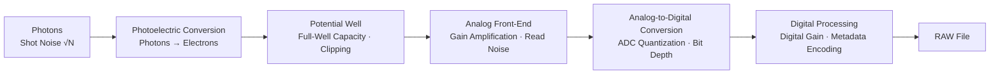

# Chapter 3 Exposure

> Exposure is never a matter of applying mechanical formulas. Given the physical limits of a sensor's dynamic range, it is the decisive act of determining which details are worth preserving and which areas can be willingly surrendered.

---

## Exposure as an Act of Choice

On a rainy afternoon in March 1936, Dorothea Lange was driving north along California's Route 101. She had just spent an entire month traversing the field, documenting the rural plight of the Great Depression for the Resettlement Administration (reorganized the following year into the famed Farm Security Administration, or FSA). Her meager travel allowance was virtually exhausted, and in her exhaustion, her thoughts were fixed entirely on returning home to reunite with her family as quickly as possible. At that moment, she had no intention of undertaking any new shooting; psychologically, her assignment was already complete.

It was in just such a state that a handwritten roadside sign caught her eye: "PEA-PICKERS CAMP." At first, she drove straight past. Only after driving some twenty miles ahead did an indefinable sense of duty compel her to make a U-turn and retrace her path.

She would later recall this encounter in an essay for *Popular Photography*: the moment she saw that hungry, desperate mother, her gaze was drawn to her as if pulled by a magnet. Young children huddled close against their mother, fear etched across their faces. Lange did not ask for the woman's name, nor did she inquire into the full history of her circumstances; she learned only that an unexpected frost had destroyed the entire pea crop, and that the family was surviving on frozen remnants scavenged from the fields and wild birds killed by the children. Before that flimsy tent, she lingered for barely ten minutes in total, exposing six negatives (though in her later years she mistakenly remembered five, the original negatives preserved in the Library of Congress confirm there were indeed six).

It was across these six exposures that Lange made the crucial choices that defined the power of the image. She was working with a 4×5-inch Graflex large-format camera. Outside the camp hung the soft, diffused light of an overcast, rainy day, softened still further by the coarse canvas of the tent. Knowing full well that the soul of the photograph resided in the mother's face, she anchored her baseline exposure strictly to the delicate gradations of that face. As for the bright skylight outside the tent, it was not central to the narrative; and the deep, shadowy darkness inside the tent could be allowed to fall away into pure shadow, since whatever detail lay in those shadows carried no essential emotional weight.

The final frame of this sequence would become *Migrant Mother*, one of the most celebrated images in the history of photography. It has been reproduced millions of times, exhibited in premier art museums, printed on national postage stamps, and permanently archived in the Library of Congress. Examined purely through the lens of exposure control, it is first and foremost a precise compromise Lange made amidst the bitter wind and rain for the sake of preserving a single human face: she was willing to let the highlights blow out at the edges of the frame and the deep shadows plunge into darkness, so long as the expressions and textures of that face were etched with total integrity into the silver halide.

This is the very essence of exposure control. It is never simply a technical question of being "correct" or "incorrect." Its deeper inquiry asks: when the dynamic range of a photosensitive medium is constrained by physical laws, precisely which core details do you resolve to preserve, and which areas are you willing to let recede into nothingness? Before releasing the shutter, this hierarchy of visual priorities must be reasoned out clearly in the mind.

---

### Reading Exposure Through Photographic Intent

*Lewis Hine, "Power House Mechanic", 1920. Hine photographed a mechanic adjusting a colossal steam pump inside a power plant. Light falls from the upper right behind the machinery, catching the worker's arched back, sweat-soaked shirt, and the wrench in his hands. Non-essential elements are relegated to deep shadow, leaving behind only that sweeping arc between man and machine. The exposure here makes no show of technical virtuosity; it functions rather as an act of judgment: by suppressing a vast amount of extraneous information, the taut posture of a solitary human confronting an industrial colossus is preserved at the very center of the frame. [Image Credits and Reuse Policy](image-credits.md#hine-mechanic)*

---

## Why Metering Fails

Traditional photography manuals often reduce the mechanism of reflective light metering to a simple dictum: "rendering the metered area as 18% middle gray." While a standard 18% gray card serves as a universal calibration reference, camera algorithms do not all adhere strictly to a single constant; calibration standards, proprietary manufacturer weighting logics, and selected metering modes all influence the recommended value. This theoretical model explains why a light meter misjudges fresh snow by underexposing it into murk, or misreads a black wall by overexposing it into gray; yet its primary lesson is certainly not that photographers must mechanically capture every subject as middle gray.

A formulation more grounded in practice is this: any real-world scene possesses an objective luminance range, while a sensor offers a usable dynamic range defined by a given ISO, RAW encoding mode, and signal-to-noise ratio threshold. The essence of exposure lies in appropriately situating crucial visual information within that dynamic window. There is no dogma here that "full-frame sensors invariably offer fourteen stops"; truly usable shadow detail depends heavily on the specific camera model, final output size, and noise tolerance.

Placing that information in different zones endows an image with distinctly different characters:
- Balancing both ends: Keeping highlights from clipping while preserving as much shadow texture as possible—the most reliable, conventional approach;
- Highlight priority: Ensuring that extreme luminance values fall just inside the threshold of clipping, allowing shadows to sink naturally into profound darkness;
- Shadow priority: Ensuring that deep shadow gradations remain distinct and articulate, willingly accepting that local highlights will blow out into pure white negative space.

None of these approaches is inherently superior to another; the sole criterion is which tonal distribution best serves the internal expression of the image.

Therefore, exposure must never be mistaken for a search for a single standard answer. The creator's core mission is to steer the overall tonal values toward their most expressive placement within the finite recording boundaries of the equipment.

---

## Interpreting Previews and Histograms

Live preview on a camera's LCD screen is often misleading. Screen backlight brightness, ambient lighting conditions, and color profile modes can all severely skew visual judgment. Viewed under harsh direct sunlight, the display image tends to look excessively dark, tempting the photographer to blindly increase exposure; conversely, in dim environments, the screen appears abnormally bright, easily prompting an unjustified underexposure. Because it is impervious to ambient light, the histogram is a far more reliable objective tool than visual perception on the screen; one must keep in mind, however, that it is usually calculated from the in-camera JPEG preview rather than reflecting the absolute truth of the raw sensor data.

A histogram spreads the tonal distribution of all pixels across a horizontal scale: the horizontal axis represents the gradation of luminance from pure black on the left to pure white on the right, while the vertical axis indicates the concentration density of pixels within any given brightness bracket. If the waveform stacks up vertically against the right-hand wall, highlights have clipped into overexposure, obliterating all detail; if it stacks against the left-hand wall, shadows have fallen into crushed, dead blacks. If the waveform clusters gently in the center, it indicates only that the overall distribution of tones is relatively uniform, which in no way equates directly to artistic validity in exposure.

The shape and distribution of a histogram depend entirely on the characteristics of the subject matter: a snowscape's center of gravity should naturally skew to the right, lest pristine white snow be compressed into dingy sludge; a night scene's peak typically bunches on the left, lest quiet darkness be artificially boosted into midday. A histogram can unequivocally indicate whether data has suffered physical clipping, yet it can never substitute for aesthetic judgment. Like a car's dashboard, it faithfully reports operational status, but the direction of travel remains entirely in the hands of the driver.

When evaluating a histogram, two critical blind spots must be recognized:
1. Even when shooting in RAW, the histogram displayed in-camera is almost invariably generated from an embedded JPEG preview, carrying whatever white balance, color profile, and contrast curve presets are applied by the camera. There is an active discrepancy between this preview and the true physical clipping point of the RAW data; a prudent strategy is to set in-camera contrast to a flat profile and calibrate the safety margin between preview warnings and actual RAW clipping through practical testing.
2. The default luminance histogram can easily mask clipping in individual color channels. When photographing sunsets, vivid red blossoms, or colored stage lighting, one should switch to an RGB three-channel histogram; a single channel hitting the ceiling signals potential clipping in that channel's preview, requiring comprehensive evaluation alongside channel analysis in RAW post-processing software.

Beyond the histogram, camera highlight warnings—such as zebras or playback "blinkies"—serve as essential alerting tools. In portraiture, one should focus on the genuine skin textures across key illuminated surfaces such as the forehead and cheekbones, rather than blindly crushing exposure at the first sight of flashing highlights: specular highlights need not retain textural gradation, and a slight warning on a JPEG preview does not mean the RAW data is irrecoverably lost.

---

## The Zone System Is Not Ten Parameters

Around 1939, Ansel Adams and Fred Archer jointly formulated the **Zone System**, dividing the continuous grayscale from pure black to pure white into eleven discrete tonal zones (Zone 0 through Zone X). Zone 0 represents pure black devoid of detail, and Zone X represents pure white without texture; the zones between them carry a progressive gradient of textural nuance, with Zone V corresponding precisely to middle gray at an 18% reference reflectance.

Adams's creative paradigm was never about passively pointing the camera and awaiting a meter reading; rather, it was about constructing a mental blueprint of the final image's tonal relationships before even lifting the camera to his eye: placing the distant snow-capped peak in Zone VIII (luminous yet retaining crisp texture), and the pine forest in the foreground in Zone II (deep and dark, yet with the contours of branches faintly discernible). Only after pre-visualizing this tonal hierarchy would he take spot meter readings of specific areas and coordinate the necessary adjustments in subsequent film development times.

In the digital era, the core spirit of the Zone System remains just as vital: deliberately assigning each region of the frame its rightful tonal destination before releasing the shutter—commanding the camera in service of that creative intent, rather than abdicating the decision to automated in-camera algorithms.

Within digital camera operations, this system translates into an exceptionally intuitive workflow:
- When spot metering any portion of a scene, the camera's meter reading always calculates an exposure that renders that exact point as Zone V (middle gray);
- The photographer's task is simply to shift it to the desired zone using exposure compensation;
- Metering a shadowed rock and intending to place it in Zone III requires dialling in a two-stop underexposure (-2 EV) from the spot reading; metering a sunlit white wall and wishing to lift it to Zone VII requires an adjustment of plus two stops (+2 EV).

Each zone corresponds to one stop of exposure; adding or subtracting stops represents the physical distance needed to shift a subject from middle gray to its intended tonal value. In this way, the classical Zone System is distilled into an intuitive three-step practice—spot meter, assign the zone, adjust compensation—restoring full creative control of exposure to the photographer.

A state of effortless mastery comes from having already established with absolute mental clarity, well before the shutter clicks, whether this frame is meant to breathe as a luminous high-key composition or settle into dense, brooding low-key tones.

---

## Capture Exposure and ISO

In field practice, aperture, shutter speed, and ISO are routinely grouped together as the "exposure triangle." Yet viewed through the lens of physics, two fundamentally distinct mechanisms must be rigorously separated: **aperture and shutter speed dictate the actual total volume of photons that reach the sensor (capture exposure), whereas ISO primarily determines the gain amplification and encoding mapping applied to that electrical signal downstream in the processing pipeline.** Raising the ISO value increases the brightness of the rendered image, but it does not enable the sensor to capture a single additional photon. Conflating actual light gathering with display brightness is the root of countless misconceptions about image quality.

*Original diagram: Aperture and shutter speed first complete the light capture, after which ISO and tone curves shape final image brightness. [Image Credits and Reuse Policy](image-credits.md#exposure-capture-brightness)*

All three parameters are calibrated in "stops" (EV), yet their physical mechanisms differ fundamentally: shifting the aperture or shutter speed by one stop doubles or halves the photon energy gathered by the sensor; adjusting ISO by one stop primarily doubles or halves the analog/digital gain multiplier and the resulting output brightness. Taking f/8, 1/125s, and ISO 100 as a baseline, the isolated effect of adjusting each individual parameter by one stop is summarized below:

| Parameter Adjusted in Isolation | Increase by One Stop (+1 EV) | Decrease by One Stop (-1 EV) | Associated Physical Trade-offs |
|---|---|---|---|
| Aperture | f/8 → f/5.6 | f/8 → f/11 | Doubles / halves actual light gathered; directly reshapes depth of field and lens aberrations |
| Shutter Speed | 1/125s → 1/60s | 1/125s → 1/250s | Doubles / halves actual light gathered; directly governs motion blur versus instantaneous freezing |
| ISO Sensitivity | ISO 100 → 200 | ISO 100 → 50 (Extended) | Leaves actual light gathered unchanged; alters circuit gain, preview brightness, and highlight headroom |

The standard full-stop aperture scale runs f/1.4, f/2, f/2.8, f/4, f/5.6, f/8, f/11, f/16, f/22, with the ratio between adjacent numbers being approximately \(\sqrt{2}\). To maintain the **same physical capture exposure**, stopping down the aperture by one stop requires slowing the shutter speed by one corresponding stop; while raising the ISO increases the brightness of the image, it can never compensate for the loss in fundamental signal-to-noise ratio caused by a deficiency in gathered light.

In the same lighting environment, f/2.8 at 1/500s and f/8 at 1/60s admit the exact same physical amount of light: the former opens the aperture by three stops while speeding up the shutter by three stops, with the adjustments cancelling each other out. While both final images can share an identical overall brightness, they will display radically different depths of field, bokeh, and motion characteristics. The crucial on-site decision is this: what depth of field and temporal quality will you choose to carry this given flux of light?

Referenced to ISO 100, capture exposure can be precisely quantified via Exposure Value (EV):

\[ EV = \log_2\frac{N^2}{t} \]

Where \(N\) represents the relative f-number and \(t\) denotes the exposure time in seconds. Under the ISO 100 convention, each increment of 1 in the EV number halves the luminous flux admitted by the aperture and shutter combination. This formula establishes a rigorous mathematical standard for measuring the reciprocal relationship between aperture and shutter speed.

A disciplined decision-making workflow begins by first locking in the aperture (governing depth-of-field requirements) and the shutter speed (governing motion control), both of which directly dictate the formal aesthetic of the frame; only then is ISO engaged to supply brightness compensation and balance the downstream readout pipeline. When aperture and shutter speed have reached their physical limits, raising the ISO prevents an underexposed signal from being excessively compressed during quantization and digital encoding, while also effectively suppressing downstream readout noise on sensors engineered with specific analog architectures.

Aperture Priority mode (A/Av) serves as an efficient baseline setting across most everyday shooting scenarios: the photographer commands the depth of field and optical character while the camera body matches the corresponding shutter speed, complemented by exposure compensation and ISO monitoring. Portraits typically utilize f/1.4 to f/2.8 to isolate subjects from distracting backgrounds; street photography frequently relies on f/5.6 to f/8 to achieve ample zone-focusing depth of field; landscape photography on large-format or high-resolution systems often favors f/8 to f/11 to strike an optimal balance between optical resolution and depth of field; and dim indoor lighting calls for a wide-open aperture to guarantee adequate physical light gathering. With every selection of an aperture, one must verify that the resulting shutter speed remains within a safe handholding or motion-free threshold.

In practical field shooting, Manual exposure (M mode) paired with Auto ISO represents a configuration that blends technical rigor with shooting agility: the photographer firmly locks both aperture (depth of field) and shutter speed (motion), delegating only the subtle gain compensation for fluctuating light to the camera's processing. This preserves uncompromising creative control over the image's formal structure while dramatically improving operational responsiveness in fast-changing environments.

---

### The Reciprocity Law and Its Limits

The fact that multiple combinations of aperture and shutter speed can achieve an equivalent capture exposure is grounded in the physics of the **reciprocity law**: halving the intensity of incoming light while doubling the exposure duration cancel each other out, keeping the total luminous energy received by the photosensitive medium constant. This law pertains exclusively to the physical trade-off between aperture and shutter speed, and does not encompass downstream ISO gain.

At the temporal extremes, however, the reciprocity law breaks down—a vulnerability especially pronounced in film emulsions. When exposure times stretch from several seconds to many minutes, or conversely compress to fractions of a thousandth of a second, the photochemical efficiency of silver halide crystals drops precipitously, producing an actual optical density well below theoretical expectations. In long exposures, additional exposure compensation becomes mandatory—a phenomenon known as **reciprocity failure** (or the Schwarzschild effect). Digital sensors maintain an essentially linear photoelectric conversion throughout conventional long exposures, requiring no additional exposure compensation; however, as exposure durations lengthen considerably, thermal sensitivity triggers a steady accumulation of dark current, generating hot pixels and thermal noise at fixed locations across the frame. In-camera "Long Exposure Noise Reduction" is engineered specifically to counter this behavior: once the primary exposure concludes, the camera takes a second, pitch-black dark frame of identical duration with the shutter closed, subtracting and cancelling out fixed-pattern thermal noise signals via algorithmic differencing.

---

## Distinguishing Between Two Types of Blur

The causes of image blur can be broadly divided into two entirely different physical mechanisms, and the strategies for countering them are equally distinct:

The first is **camera shake** (camera vibration or hand tremor): during the exposure duration, the camera itself undergoes angular displacement or translation, causing both the subject and the background across the entire frame to degrade indiscriminately into blur; the second is **subject motion blur**: the camera remains steady, but the subject shifts position while the shutter is open, yielding an image where the background remains sharp while the moving figure trails ghosting and motion streaks. While both phenomena visually manifest as blur, their underlying mechanisms are entirely distinct: the former stems from the instability of the observational reference frame, whereas the latter arises from the physical displacement of the subject itself.

To counter camera shake, the classic guideline is the **reciprocal rule** (or safe shutter rule): in handheld shooting, the shutter speed should, in principle, be no slower than the reciprocal of the lens's physical focal length (for instance, no slower than 1/50s for a 50mm lens, and no slower than 1/200s for a 200mm telephoto lens; crop formats such as APS-C require factoring in the equivalent focal length). Crucially, this rule originated in the era of film and low-resolution sensors, guaranteeing only baseline sharpness at modest viewing sizes; on modern high-resolution bodies boasting tens of millions of pixels, scrutinizing an image at a 100% pixel-level view reveals even the faintest micro-tremors. Rigorous photographic practice therefore often raises this safety threshold to twice the reciprocal of the focal length (for example, shooting at 1/100s or faster with a 50mm lens). Modern in-body and in-lens optical image stabilization systems (IS/IBIS) can effectively compensate for hand tremors, making handheld shooting at slower shutter speeds genuinely viable.

Yet optical image stabilization can only resolve the movement of the camera itself; it has no halting effect whatsoever on the physical displacement of the subject. Freezing a leisurely pedestrian requires roughly 1/250s, while freezing a running child or moving traffic typically demands 1/500s or even 1/1000s and faster. Before tripping the shutter, one must make a sober assessment: does the immediate risk stem from the handheld stability limit of the camera body, or from the dynamic displacement of the subject?

The shutter is not merely a defensive instrument against blur; it is the primary brush with which the expressive power of time is controlled. The trailing traces left by dynamic movement often carry a potent visual vocabulary: slowing the shutter to between 1/15s and 1/30s while panning the lens smoothly alongside a moving target yields **panning shots** where the subject remains sharp against a streaked, dynamically blurred background; mounting the camera on a tripod for a long exposure of several seconds to tens of seconds transforms tumbling waterfalls into silky mist, weaves passing traffic into intersecting ribbons of light, and dissolves bustling crowds into sheer nothingness. To achieve slow-shutter effects in intense ambient light, one must employ a **neutral density filter** (ND filter) to cut the incoming volume of light. The shutter dimension bridges two distinct realms: the split-second freeze and the protracted, flowing passage of time.

---

## Choosing a Metering Mode

The essence of a metering mode is to define for the metering system the spatial sampling weights used when calculating an exposure baseline.

Modern **evaluative metering** (multi-zone matrix metering) is highly sophisticated: it divides the frame into dozens or even hundreds of independent zones for multi-point sampling, performs pattern recognition against an extensive internal database of typical scene models, and applies dynamic weighting closely tied to the active focus point and face detection. It provides the most dependable baseline across the vast majority of general shooting scenarios. Between evaluative metering and localized spot metering lies the traditional **center-weighted average metering**, which assigns fixed, heavy priority to the central portion of the frame without imposing complex algorithmic conjecture, offering pure, dependable predictability.

The primary domain of **spot metering** lies in specialized environments of extreme high contrast where the subject occupies only a minute fraction of the frame: a stage performance pinned beneath a spotlight, an isolated dark silhouette against an expanse of snow, or an extensive backlit silhouette. In such demanding conditions, relying on full-frame evaluative metering causes vast areas of extreme brightness or darkness to drastically skew the exposure average, leaving the subject's face either severely blown out or crushed into pitch blackness. Spot metering forces the system to sample only a tight 1% to 3% area in the center of the frame, insulating the measurement from the expansive background; once the baseline exposure for the subject is locked, the tonal values can then be finessed via exposure compensation.

Whether evaluative or spot, in-camera reflective metering systems share an inherent limitation: they cannot determine whether a high luminance reading stems from intense illumination or from the high physical reflectance of the object itself. Methods for bypassing this limitation include:
- **Incident light meters**: positioned at the subject's location to measure the absolute illuminance of the direct light source, completely eliminating the influence of the subject's material reflectance;
- **Standard gray card calibration**: placing a gray card with a known 18% reflectance into the same lighting environment to establish an accurate exposure baseline.

Understanding the confounding role of surface reflectance is a vital prerequisite to grasping how light meters truly work.

---

### Exposure Compensation as an Expression of Intent

The light meter provides nothing more than a technical reference baseline; the photographer retains absolute prerogative over the final verdict. The essence of exposure compensation is the injection of explicit authorial intent on top of mechanical metering.

"Add for white, subtract for black" is the most concise rule of thumb in field practice: when confronted with highly reflective subjects such as expansive snow or white walls, the meter erroneously suppresses them toward middle gray, requiring positive exposure compensation (+EV) to restore their pristine, clean white; when facing low-reflectance scenes such as dark backgrounds or black garments, the meter tends to over-brighten them, requiring negative compensation (-EV) to preserve the profound depth of the shadows.

Specific values must be calibrated precisely according to the subject matter: snow scenes generally require an adjustment of +1 to +2 EV to prevent the snow from looking muddy and gray; low-key, dark subjects typically call for -0.7 to -1.5 EV to preserve solid, weighty shadows; backlit portraits need an added +1 to +2 EV if facial detail is to be retained, or downward compensation if a silhouette is intended; and twilight or night scenes usually demand -0.7 to -2 EV to safeguard the quiet, atmospheric gravity inherent to the night. High-key images derive their airy, luminous clarity from positive compensation, while low-key images draw their subtle, dramatic tension from negative compensation.

---

## The Premise of ETTR

**Exposing to the right** (Expose To The Right, ETTR) is an exposure strategy that pushes the histogram waveform as far toward the right edge as possible, strictly ensuring that critical highlights do not clip.

Its physical mechanism is straightforward: digital sensors allocate the highest quantization precision and optimal signal-to-noise ratio to highlight regions; the further one descends into the shadows, the more pronounced the relative proportion of photon shot noise and read noise becomes. Pushing exposure toward the rightmost threshold during capture maximizes the total number of photons harvested; subsequently, when the overall tonal values are pulled back to the desired brightness in post-processing, shadow noise is markedly suppressed.

Exposing to the right is exceptionally well suited to large-format landscape photography, gentle low-contrast scenes, and low-light long-exposure work. Yet it should not be blindly applied to fleeting, high-contrast street snapshots, where the slightest miscalculation can permanently clip critical highlights beyond recovery. There is no inherent contradiction between ETTR and the traditional photographic maxim "better underexposed than overexposed": in unpredictable, fast-moving candid shooting, "better under" serves to protect the highlight threshold; in deliberate, controlled image-making, "to the right" aims to squeeze the ultimate image quality from the sensor.

---

## Five High-Risk Scenarios

The following typical scenarios are notoriously prone to exposure errors in practice; the core challenge they present lies in making decisive judgments about which tonal values to prioritize on site:

1. **High-Contrast Sunlight Portraits**: Direct sunlight striking from the side creates a tonal span across the face of several stops, causing the illuminated side to blow out easily while plunging the shadow side into deep gloom. The simplest remedy is to guide the subject into open shade beneath trees, under porticos, or beside architectural overhangs; if shooting under harsh light is unavoidable, use a reflector for fill or engage high-speed sync (HSS) flash to match fast shutter speeds; alternatively, embrace the light by angling the shaded side toward the camera, retaining only a sliver of rim light to craft a moody, low-key portrait.
2. **Indoor Window Backlight Portraits**: When the subject is positioned with their back to intense exterior daylight, the contrast between indoor and outdoor luminosity often spans five to seven stops or more. In this situation, blindly adjusting exposure compensation usually amounts to solving one problem only to exacerbate another. An efficient strategy is to turn the subject perpendicular to the window, converting direct frontal backlighting into richly gradated side light from the window, thereby drastically tempering the extreme contrast ratio.
3. **Classical Interiors and Historic Architecture**: Ambient illumination in these spaces is dim and tonally intricate, while tripods and flash photography are almost universally prohibited. Under these conditions, open the aperture wide (f/1.4 to f/2.8), raise the ISO to its usable upper limit, and set the shutter speed as close as possible to the handheld safety threshold; meter precisely on focal elements such as key sculptures, reliefs, or stained-glass details, and deliberately apply negative exposure compensation (-1 to -2 EV) to preserve the architecture's innate, quiet nocturnal atmosphere.
4. **Stage Performances and Spotlight Scenes**: The subject is enveloped in a piercing beam of light while their surroundings are engulfed in darkness. Spot metering should be employed to lock precisely onto the performer's face, dialed down with subtle negative compensation to prevent highlight clipping; fast shutter speeds must be sustained by high ISO settings, and capturing in RAW format is essential to leave latitude for fine tonal adjustments in post-processing.
5. **Snowscapes and Fog-Shrouded Fields**: Expansive, uniform reflections easily mislead the metering system into aggressive underexposure. Snow scenes require moderate positive exposure compensation, yet one must be vigilant against highlight clipping—retaining the subtle, ethereal blue casts in the shadows is vital to conveying the spatial texture of ice and snow; in foggy scenes, allow the histogram to lean moderately to the right, ensuring that the veil of mist retains delicate gradation rather than flattening into a featureless white wall.

---

## Exposure Bracketing and HDR

When confronting static, high-contrast scenes that exceed the recording capacity of a single sensor exposure, **Auto Exposure Bracketing** (AEB)—supported by a sturdy tripod—offers a method for transcending these physical constraints.

The workflow is straightforward: from a fixed vantage point, a sequence of three to five stepped exposures is recorded—capturing, respectively, protected highlight detail, midtones, and deep shadow textures. In the post-processing workstation, these frames are combined through multi-frame high dynamic range merging (HDR Merge), assembling the optimal tonal data from each exposure into a single, high-latitude RAW file. Architectural interiors photographed against bright windows, as well as dawn and dusk horizons, frequently rely on this technique.

In practice, several potential pitfalls must be navigated:
- Multi-frame merging relies on precise spatial registration across exposures. Although modern algorithms feature automatic alignment, a stable tripod remains an absolute prerequisite for preventing edge tearing and misalignment artifacts;
- When dynamic elements are present in the frame (pedestrians in motion, wind-blown foliage, or surging waves), layering multiple exposures introduces semi-transparent **ghosting** artifacts, necessitating de-ghosting algorithms or manual masking based on a single reference frame;
- Static landscapes often require no more than two exposures (one preserving the luminous sky, the other extracting detail from the shadowed terrain) to yield a flawless composite, rendering redundant shots unnecessary;
- In landscapes characterized by an unobstructed, flat horizon, a physical Graduated Neutral Density filter (GND) can balance the lighting ratio directly at the optical front end, circumventing the complications of post-capture multi-frame merging altogether.

A rigorous distinction must be drawn: disciplined multi-frame exposure merging aims to expand the usable physical dynamic range, whereas crude, stylized HDR effects frequently over-amplify local micro-contrast, producing garish haloing and muddy, unnatural tonal transitions. The restraint applied during tone integration should always be governed by a commitment to serving the spatial logic and emotional resonance of the image.

---

## Technical Deep Dive: Why Sensors Have Physical Limits

!!! note "Reading Path"

    The foundational narrative of field exposure is now complete: establish core tonal priorities, then execute with the aid of histograms, highlight warnings, and exposure bracketing. The sections that follow examine the underlying physical boundaries of dynamic range, photon noise, quantization bit depth, and circuit gain. If your focus is primarily on practical field decisions, you may skip directly to "RAW Headroom and Boundaries."

### Dynamic Range: Beyond Mere Numbers

While exposure latitude and dynamic range undeniably vary across imaging media, mechanically ranking them into a static "stop-count leaderboard" easily fosters misleading dogmas. A digital sensor's dynamic range is dynamically contingent upon ISO settings, signal-to-noise ratio thresholds, and measurement methodologies. The latitude of film—both negative and reversal—is inextricably bound to emulsion chemistry, exposure fullness, darkroom development techniques, and scanning workflows. Human vision achieves perceptual synthesis through agile saccadic eye movements and continuous pupil adaptation, which cannot be equated directly with a single static exposure. Furthermore, the 8-bit specification of a standard JPEG merely defines the discrete quantization precision per color channel; it does not mean the file is limited to recording only eight stops of scene dynamic range. Through non-linear tone mapping, a wide-dynamic-range scene can be comfortably accommodated within an 8-bit container.

Three guiding principles offer a far more constructive framework:
1. RAW files provide vastly superior headroom for post-processing compared to camera-rendered JPEGs, as they remain unconstrained by baked-in white balance, contrast tone curves, or non-linear clipping;
2. Color reversal film (slide film) demands far greater exposure precision than negative film, offering virtually zero tolerance for overexposed highlights;
3. Quantization bit depth, dynamic range, and recoverable latitude in post-production are interrelated yet represent distinct physical dimensions; one must never infer a camera body's dynamic range solely from a figure like 8, 12, or 14 bits.

---

### Photon Shot Noise

What ultimately sustains a sensor's dynamic range, and where are its upper and lower physical boundaries anchored? Answering this requires tracing light back to its microscopic nature.

Light is not a continuous, homogeneous fluid. On a microscopic scale, it consists of a discrete stream of photons arriving at the sensor's photosensitive surface in a stochastic manner, with their arrival times and spatial distribution governed strictly by the **Poisson distribution**. The inevitable consequence of this physical reality is that even under perfectly uniform macroscopic illumination, the number of photons collected by an individual pixel across identical exposure intervals will invariably exhibit statistical fluctuations. This intrinsic fluctuation is known as **photon noise**, or **shot noise**.

Poisson statistics provides a rigorous mathematical formulation for this behavior: if a pixel collects an average of \(N\) photons, the standard deviation of this statistical fluctuation is precisely \(\sqrt{N}\). Dividing the effective signal by the fluctuation noise yields the **Signal-to-Noise Ratio** (SNR):

\[ SNR = \frac{N}{\sqrt{N}} = \sqrt{N} \]

The more abundant the total number of captured photons, the higher the signal-to-noise ratio, rising steadily along a square-root curve.

This fundamental formula underpins every rule governing image cleanliness in exposure theory:
- **Pristine highlights, coarse shadows**: Highlights collect immense quantities of photons (\(N\) is vast), yielding a high SNR where statistical fluctuations become negligible relative to the signal; in deep shadows, photons are scarce (\(N\) is minute), causing the SNR to plummet and rendering those microscopic fluctuations visible as granular image noise.
- **No substitute for abundant light gathering**: Whether achieved by widening the aperture, lengthening the shutter speed, or waiting for richer ambient light, maximizing the photon count \(N\) remains the sole means of achieving a physical leap in baseline signal-to-noise ratio.

| Photons Captured \(N\) | Shot Noise Standard Deviation (approx. \(\sqrt{N}\)) | Relative Noise Ratio (Noise ÷ Signal) | Corresponding Baseline SNR |
|---|---|---|---|
| 100 | 10 | 10% | 10 : 1 |
| 1,000 | 32 | 3.2% | 31.6 : 1 |
| 10,000 | 100 | 1% | 100 : 1 |
| 100,000 | 316 | 0.32% | 316 : 1 |
| 1,000,000 | 1,000 | 0.1% | 1000 : 1 |

Examining these figures reveals a crucial physical insight: as the photon count increases tenfold at each step, the absolute value of shot noise increases as well, but at a rate far outpaced by the expansion of the signal itself. Consequently, the relative noise ratio contracts dramatically from 10% down to 0.1%. Noise is never magically annihilated by abundant light; rather, what changes is the signal's overwhelming dominance over the noise floor. Shot noise is an intrinsic quantum property of light itself, not a defect of sensor manufacturing; no engineering feat can eliminate it. It can only be overcome physically through the collection of ample photons.

---

### The Sensor's Intrinsic Noise

While shot noise is rooted in the quantum nature of light, the sensor chip and its readout circuitry introduce their own intrinsic noise during photoelectric conversion and signal readout, collectively termed **read noise**. Its defining characteristic is its independence from scene luminance: whether a pixel collects a torrent of photons or receives none at all, the noise floor generated by the readout circuitry remains essentially constant.

Because of this constancy, the relative impact of read noise differs radically between highlights and shadows: in well-exposed highlights, the signal and its attendant shot noise dominate entirely, rendering read noise virtually negligible; in deep, extreme shadows, however, where the photon signal is feeble and shot noise shrinks accordingly, the invariant read noise floor usurps control, becoming the primary culprit behind image degradation. This explains why aggressively pushing underexposed shadows in post-production unleashes widespread chromatic noise and grain: the boosted tones are, in essence, anemic signals barely rising above the electronic read noise floor.

This also illuminates the underlying physics of Expose to the Right (ETTR): by maximizing exposure without clipping highlights, the electrical signal is pushed as far as possible above the read noise floor; when tones are subsequently pulled down in post-processing, both signal and noise floor are compressed proportionally, preserving the superior relative signal-to-noise ratio and yielding shadows that are exceptionally clean, rich, and detailed.

---

### Full-Well Capacity and Highlights

If maximizing exposure yields such distinct benefits, why can we not increase exposure indefinitely? The upper boundary is governed by the physical storage capacity of the pixel: each photodiode has an absolute limit to the number of photoelectrons it can hold, termed its **full-well capacity**. Photons passing through the microlens liberate electrons that accumulate in the potential well; once this well reaches complete saturation, surplus charge cannot be registered, and the output locks at its maximum digital value—a phenomenon known as **clipping**.

This is the physical reality behind the vertical wall at the right edge of a histogram. Overexposed highlights indicate that the electron wells in those regions have hit their ceiling; no matter how much brighter the real-world subject was than the saturation threshold, all tonal data exceeding that limit is permanently and physically erased at the moment of overflow. Clipped highlights cannot be reconstructed out of thin air by post-processing algorithms—a fundamental distinction from underexposed shadows, which still retain salvageable signal-to-noise information.

Thus, the sensor's physical dynamic range is firmly established: its upper limit is defined by full-well capacity, and its lower limit is bounded by the read noise floor at a specified signal-to-noise threshold. Dividing the saturation charge by the noise floor threshold and expressing this ratio in binary photographic stops yields the sensor's dynamic range under a given operating condition.

---

### Bit Depth Is Not Dynamic Range

The photoelectrons collected within potential wells are quantized into discrete digital values by an Analog-to-Digital Converter (ADC) and written into the RAW matrix. Theoretically, 12-bit encoding provides 4,096 quantization steps, while 14-bit encoding yields 16,384 steps; these figures denote the discrete sampling density of the analog-to-digital conversion, not the total volume of colors that the finished image can produce. While a higher bit depth facilitates smoother micro-contrast transitions, its actual resolving precision is fundamentally bounded by the sensor's noise floor, black level calibration, and encoding architecture.

The crux lies in this: the digital sensor's charge response to light intensity is strictly linear—doubling the luminous flux strictly doubles the converted numerical value. This linear characteristic dictates a crucial rule of quantization allocation: for every stop of exposure descending into the shadows, the available discrete tonal steps are cut in half. The single brightest stop claims nearly half of all available quantization steps across the entire dynamic range; the second brightest claims half of what remains, and as one descends deeper into the shadows, the available quantization headroom grows increasingly constricted.

| Exposure Stop Relative to Maximum Brightness | Available Quantization Steps in 14-bit Encoding (Theoretical) |
|---|---|
| Stop 1: Brightest (0 to -1 EV) | 8192 |
| Stop 2: Second Brightest (-1 to -2 EV) | 4096 |
| Stop 3 (-2 to -3 EV) | 2048 |
| Stop 4 (-3 to -4 EV) | 1024 |
| Stop 5 (-4 to -5 EV) | 512 |
| Stop 6 (-5 to -6 EV) | 256 |
| Stop 7 (-6 to -7 EV) | 128 |

It must be clarified that this distribution represents the theoretical allocation of linear sampling, rather than an absolute assertion that posterization or banding will inevitably occur in the shadows. In real-world RAW data, deep shadows are layered with stochastic photon shot noise and electronic read noise; this microscopic dither naturally smooths and blurs discrete quantization boundaries. The fundamental advantage of Exposing to the Right (ETTR) has always been to **capture a greater volume of usable photons to elevate the physical signal-to-noise ratio**, rather than merely hoarding digital code values. If there is any danger of clipping highlights, one should never sacrifice crucial highlight detail merely to claim theoretical quantization steps.

---

### What ISO Actually Changes

With this microscopic mechanism clarified, a pervasive misconception regarding ISO can be dispelled: raising the ISO does not in any way increase the physical "light sensitivity" of the sensor. The number of photons an individual pixel can capture in a single exposure is strictly locked by the physical aperture and shutter speed; altering the ISO setting cannot change the total physical quantity of incident photons.

In substance, raising ISO applies gain amplification to the electrical signal generated after photoelectric conversion has already taken place:
1. **Analog gain**: Intervenes via front-end analog amplifier circuits prior to analog-to-digital conversion. While boosting the signal, it does not proportionally amplify the downstream read noise introduced by the ADC itself, thereby delivering a genuine improvement in the signal-to-noise ratio;
2. **Digital gain**: Applied after analog-to-digital conversion by multiplying digital values. In this process, both the signal and all upstream noise are magnified indiscriminately and in equal proportion—an operation fundamentally identical to pushing exposure in post-processing software.

Modern sensors widely exhibit the property of **ISO invariance**: within a certain ISO range, if downstream read noise is exceptionally low, an image shot at base or low ISO with a given aperture and shutter speed and pushed in post-processing will match the shadow cleanliness of an image shot at a higher in-camera ISO almost identically, all while preserving valuable highlight headroom against clipping. This behavior should be applied judiciously based on specific camera testing, rather than blindly adopted as a universal habit of underexposure.

Many modern sensors feature a **Dual Conversion Gain** (DCG) architecture. Upon crossing a specific ISO threshold, the circuit switches to a high conversion gain mode, dropping the read noise floor dramatically and producing a noticeable leap in low-light image quality. Understanding your camera's gain-switching threshold enables precise control over low-light rendering, though in everyday shooting, relying on Auto ISO to transition smoothly remains the preferred approach for balancing image fidelity with shooting efficiency.

---

#### Base ISO and Gain Switching

The vast majority of camera bodies feature a hardware-native **base ISO** (commonly 64, 100, or 200), corresponding to the lowest standard gain setting without artificial attenuation. This baseline setting typically delivers maximum full-well capacity and optimal dynamic range. In static landscape work, whenever shutter speed and depth of field permit, anchoring the camera to its native base ISO is the cornerstone of ensuring pristine image quality.

Consequently, one must be fully clear about how extended low ISO settings in the camera menu (such as ISO 50 or the "L" setting) operate: such settings typically expose at base ISO and then pull the output down by one stop digitally. Because this admits twice as much physical light as the base ISO exposure, highlights are prone to premature clipping, effectively sacrificing nearly a full stop of highlight latitude. By the same token, extended high ISOs (H1, H2) are almost entirely pure digital multiplication algorithms that cannot extract any new low-light detail. To achieve peak dynamic range and tonal depth, one should consistently remain anchored to the hardware's native base ISO.

---

### From Photon to File

The complete topological pipeline that transforms photons into a digital file can be summarized as follows:

Physical photons excite photocharges that gather within potential wells of finite capacity; the analog front-end and analog-to-digital conversion stages introduce read noise floors, while ISO gain intervenes at different stages to amplify the signal before it is ultimately packaged into a RAW data matrix. The iron laws governing this entire pipeline remain inviolable: aperture and shutter speed determine the total volume of captured photons; full-well capacity sets the highlight ceiling; read noise establishes the shadow floor; and analog-to-digital conversion defines quantization precision.

---

## RAW Headroom and Boundaries

While the RAW format affords immense post-processing latitude for reconstructing white balance and leveraging dynamic range, it cannot overturn the physical laws of photon capture. How many stops deep shadows can be pushed and how much highlight tonality can be recovered depend fundamentally on the physical characteristics of the specific sensor, individual channel saturation, and in-camera conversion algorithms. A disciplined exposure approach closely monitors individual channel warnings on critical highlights while feeding the main subject the richest possible physical exposure flux; where there is no danger of blowing highlights, one should never reflexively dial in negative exposure compensation out of sheer habit.

A mature exposure intuition rests on knowing precisely when to preserve highlight purity, when to let shadows sink into mood and mystery, when to push the exposure boldly to the right, and when to let the darkness fall undisturbed. Over time, exposure decisions evolve from theoretical calculations into an instinctual extension of the hands: you look at a scene, and before the camera even rises to your eye, your mind has already anchored the tonal scale best suited to the frame.

!!! example "Case Study: Backlit Portrait by a Window"

    Beyond the window, the cloudscape is rich with delicate detail; inside, the subject's face falls three to four stops below the ambient background. First observe the RGB histogram and highlight warnings, then clarify the core creative objective:

    - **Objective 1: Preserving facial identity and expression**: Prioritize protecting the exterior highlights from clipping, while using a reflector, fill flash, or slightly adjusting the subject's position to increase facial illumination;
    - **Objective 2: Emphasizing silhouette and contemplative mood**: Allow the face to settle into a clean silhouette, focusing on distilling the graphic strength of the contour and gestural lines;
    - **Objective 3: When subject and environment are completely static**: Utilize multi-frame exposure bracketing and HDR merging to expand the overall dynamic range; if any motion is present, commit decisively to a single-frame exposure.

    All three choices carry artistic validity. The ultimate purpose of exposure is to establish a hierarchy of information and emotion, not to mechanically center the light meter's needle at zero.

---

## Exercises

1. Throughout a full day of shooting, call up the histogram immediately after releasing the shutter rather than relying on the LCD preview. After thirty frames, practice anticipating the shape and peak distribution of the histogram based purely on the lighting ratios in front of you.
2. Enable your camera's highlight alert ("blinkies") or zebra stripes, then compare these warnings in your RAW processing software against actual data clipping to determine your sensor's true safety margin. Shoot thirty portraits, carefully distinguishing between specular highlights, essential skin textures, and single-channel RGB clipping warnings to hone your intuition for preserving meaningful highlight information.
3. Set your aperture to f/5.6, shutter speed to 1/500s, and ISO to Auto (capped at 6400), then spend an hour making candid street photographs in complex lighting. Afterward, examine the full span of ISO values across the shoot to observe its concrete impact on shadow grain and dynamic range.
4. Select high-contrast scenes (sunlit snow, dim exhibition halls, backlit portraits). Record a baseline frame using the camera's default metering, evaluate it, and record a second frame with calibrated exposure compensation. Compare how faithfully the resulting tonality reflects your creative intent, repeating this exercise across ten distinct setups.

Mastery of exposure emerges from the intimate convergence of perceptual presence and physical law. By continually testing histograms, highlight warnings, and rendered tonalities in the field, reasoned analysis will eventually sublimate into muscle memory the instant you raise the camera.

---

Next Chapter: [Chapter 4 Color](04-color.md)
