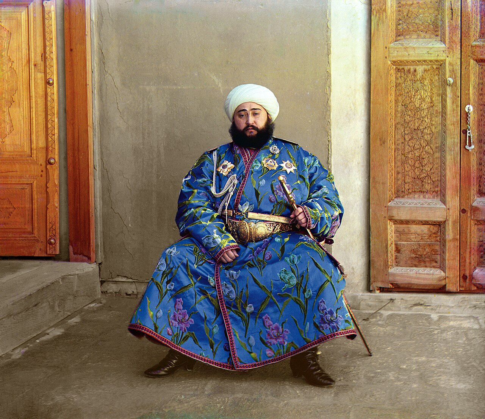

# Chapter 4 · Color: Temperature and Emotion

> Color in photography is not about recording every available hue; it is the deliberate orchestration of harmony, temperature, and visual hierarchy.

---

## 4.1 Color as Narrative Energy

A color photograph communicates on two simultaneous levels: **Physical Representation** and **Psychological Resonance**.

When colors in a frame are chaotic and uncoordinated (e.g., competing patches of neon green, magenta, and harsh yellow scattered haphazardly), the viewer's brain experiences sensory fatigue. Great color photography relies on **Color Subtraction**: simplifying the chromatic palette so that two or three harmonized colors carry the emotional weight of the image.

*Sergey Prokudin-Gorsky, "Alim Khan, Emir of Bukhara", 1911. Early triple-plate color masterwork: the royal lapis-lazuli blue robe with golden floral embroidery against a warm, muted background creates majestic chromatic authority.*

---

## 4.2 Classical Color Harmonies in the Camera

1. **Complementary Harmony (Opposite on the Color Wheel)**:
   - *Teal and Orange / Amber and Cyan*: The warm golden glow of sunset against deep blue sky; skin tones against cool ocean water. High contrast, vibrant energy.
   - *Red and Green*: A red coat against lush forest foliage. Maximum pop and visual punctuation.
2. **Analogous Harmony (Adjacent on the Color Wheel)**:
   - *Yellow, Amber, and Orange*: Autumn landscapes, warm desert dunes, tungsten lamp interiors. Evokes warmth, nostalgia, comfort, and cohesion.
   - *Blue, Cyan, and Deep Indigo*: Mountain twilight, sea mist, winter morning. Evokes calm, solitude, chill, and vastness.
3. **Monochromatic Dominance with an Accent Color**:
   - A predominantly desaturated or cool-toned image punctuated by a single vibrant warm element (e.g., a yellow taxi on a rain-slicked gray street). The accent color functions as an undeniable focal magnet.

---

## 4.3 White Balance as an Authorial Tool

White balance is not simply a corrective tool to make paper look neutral white; it is an expressive dial:

- **Deliberate Warm Bias (5500K–6500K in Daylight)**: Enhances tactile intimacy, late-afternoon nostalgia, and skin vitality.
- **Deliberate Cool Bias (4000K–4800K in Daylight)**: Imparts clinical detachment, modern cinematic tension, or quiet melancholy.
- **Mixed Light Environments**: Embracing the friction between warm tungsten light inside a shop and cool blue hour daylight outside the window. Do not try to neutralize both; let their temperature collision create depth.

---

## 4.4 Color Separation vs. Luminance Separation

When evaluating a composition:
- **Luminance Separation**: Contrast created by light against dark (which translates into black and white).
- **Color Separation**: Contrast created purely by differing hues (e.g., a green apple against a red cloth of identical brightness).

If a scene relies solely on color separation without luminance difference, the image will flatten under dimmer viewing conditions. The most robust compositions possess both strong luminance structure and disciplined color relationships.

---

## 4.5 Field Practice

1. **The Monochromatic Palette Hunt**: Go out for 90 minutes with the strict rule to only photograph scenes dominated by a single color family (e.g., finding shades of yellow and amber in the city). Notice how your eyes recalibrate to see chromatic subtleties.
2. **Complementary Color Pairing**: Search for an authentic complementary color collision in the wild (natural or man-made). Frame the shot so that the two opposing colors split the visual space roughly in a 70/30 ratio.

---

Next Chapter: [Chapter 5 · Lens Language](05-lens.md)
