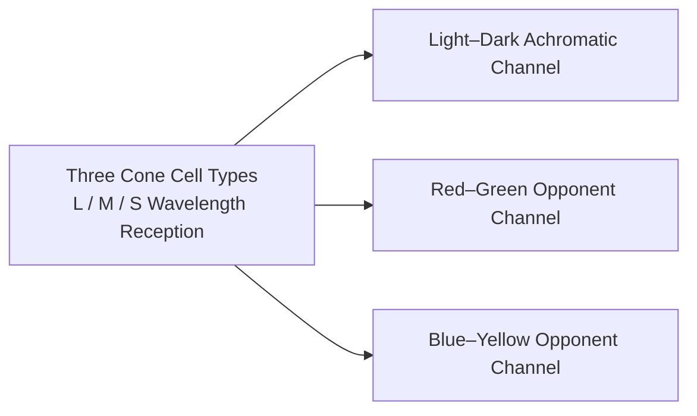

# Chapter 4 Color

> Color shapes the emotional undertone of an image and dictates the purity of its visual order. Lacking restraint and deliberate orchestration, cluttered color easily degenerates into visual noise, turning the viewer away before they ever reach the substantive core of the work.

---

## Color Becomes a Photographic Language

In May 1976, the Museum of Modern Art (MoMA) in New York mounted an exhibition that provoked an uproar: *William Eggleston's Guide*. Arrayed along the gallery walls were seventy-five color prints recording everyday scenes from the American South: a child's tricycle resting on a driveway, the porches and dining tables of mundane farmhouses, overhead wires tangling outward from the corner of a building. These subjects were so commonplace as to invite total overlook, yet they were framed and presented with an unprecedented solemnity, stepping unapologetically into the inner sanctum of modern art. The exhibition ran for more than two months.

To understand the subversive nature of the exhibition at that time, one must reconstruct the art ecosystem of that era. In the serious photography circles of 1976, color photography had virtually no foothold. Mainstream masters almost unanimously held fast to the black-and-white gelatin silver tradition, while color imagery was reflexively categorized as a utilitarian tool: commercial advertisements, family snapshots, scenic postcards, and illustrations for popular magazines. Color was widely dismissed as a vehicle for hawking consumer goods rather than an artistic language worthy of the museum gallery. It was precisely for this reason that Hilton Kramer, then chief art critic for *The New York Times*, penned his famously scathing assessment; in response to the curator's praise of the photographs as "perfect," he wrote: "Perfect? Perhaps perfectly banal, certainly perfectly boring."

Over the decades that followed, these seventy-five images ultimately reconstituted the historical standing of color photography. Eggleston's essential contribution was that he never pursued the sweetly agreeable, salon-style "pretty colors" of convention; instead, he anchored with pinpoint precision the distinct color textures of postwar American daily life: ceilings drenched in a glaring blood-red beneath a hanging bare incandescent bulb, walls painted with cheap industrial enamel, fluorescent neon signs burning through the deep night, the glint off plastic parts in gas stations and auto-parts dealerships, the unyielding red of a Ford pickup, and the industrialized yellow of fast-food chains. Deeply rooted in modern industry, mass consumption, and vernacular life, these colors had long been overlooked by visual habit precisely because they were so ubiquitous. Eggleston forced viewers to pause before these industrial colors and confront their intrinsic material reality.

This is the profound power of color in a photographic context: it is not merely about the aesthetic pleasure of formal composition, but about freezing within photosensitive emulsions and pixel matrices the consumer imprints of a specific era, the material textures of regional landscapes, and the shifting patterns of everyday life. Color is not a decorative veneer applied to form; it is the visual testimony of its time.

---

## Begin with Subtraction

When first venturing into color photography, it is easy to succumb to the seductive surface of a "vibrant palette," for multiple saturated hues undeniably deliver an immediate visual punch at first glance. Yet the vulgarity of an image often stems from this very impulse: with color, more is not better; disordered patches of hue vie with one another for dominance, ultimately collapsing into a warring din of visual noise.

The color orchestration in iconic imagery is almost always exceptionally restrained, where sustaining two or three dominant tones throughout the frame is more than sufficient. Saul Leiter lived in quiet seclusion in New York's East Village, wandering for decades within a few blocks of East 10th Street, looking down from his apartment window or walking the damp sidewalks below. Often shooting on expired Kodachrome slide film, his palette settled into warm, elegant neutral grays, allowing accents of red, yellow, and brown to register with quiet discipline: a red umbrella gliding through falling snow, a yellow cab refracted and fragmented across mottled glass, a pedestrian in a dark brown overcoat receding into an elusive silhouette deep within a storefront window. His frames almost never suffer from the agitated churn of competing colors; expansive shadows, mist, glass reflections, and neutral grays construct a tranquil foundation, giving the remaining pure colors an undeniable, grounded weight.

In Steve McCurry's *Afghan Girl*, made in a Peshawar refugee camp in 1984, the red headscarf and vivid green eyes establish a classic, taut chromatic confrontation. While the emotional resonance of this portrait is undeniably rooted in the subject's haunting gaze, stripping away the taut emotional tension between those complementary reds and greens would drastically deplete the image's narrative force. McCurry's classic work across South Asia and the Middle East consistently adheres to a disciplined chromatic order: colors are rich and saturated, yet strictly hierarchical, always establishing a core primary hue to anchor the composition while all supporting tones recede to provide the ground.

Joel Sternfeld charted a radically different, austere path in *American Prospects*. Spending eight years driving across the American heartland, his frames were filled with low-contrast neutral tones—sage greens, ochres, and pale cyans: in one photograph, a beached sperm whale lies stranded on a barren Oregon shore; in another, a farmhouse burns in a controlled blaze in the background while in the foreground a firefighter calmly shops for pumpkins at a roadside farm stand. The color is understated, restrained almost to the point of detachment, and it is precisely this cool austerity that lays bare the absurd tensions of reality. The power of color never relies solely on heaped saturation; restraint often gives rise to a far more enduring stillness.

When Stephen Shore began photographing *Uncommon Places* in 1973, he used an 8×10 large-format view camera to record service stations, roadside motels, empty parking lots, and sparse diner tables. His compositions are filled with quiet, unadorned tones—off-white, concrete gray, pale blue, and dusty ochre—offering no calculated bid to please, yet capturing with exacting precision the spaciousness, regimentation, and desolation of the American roadside landscape.

In sharp contrast to the practices of these masters, the hyper-saturated filters so prevalent across digital social media push in the opposite direction: every hue is mechanically cranked to its limit, dazzling the eye at first glance, yet quickly inducing visual fatigue upon prolonged viewing. Masterful command of color lies in distilling complexity and applying hue with precision—allowing color to recede into the structural framework of space and form, rather than letting ostentatious tones obscure the essence of the photograph.

---

### Color Photography Begins with Three Channels

*More than sixty years before Eggleston, Sergey Prokudin-Gorsky made three physical exposures through red, green, and blue color-separation filters, subsequently combining the three separation negatives optically into vivid, natural color. In this 1911 portrait of the Emir of Bukhara, the high-purity cobalt-blue robe serves as the singular visual focal point, while the background walls, carpet, and grass all recede into low-brightness grayish greens and ochres. With the dominant color firmly established and extraneous hues subdued, the image instantly takes on a deep, solemn gravity. [Image Source and Reuse Notes](image-credits.md#prokudin-gorsky-emir)*

---

## RGB and CMYK

Prokudin-Gorsky's historical practice clearly reveals the underlying physics of color imaging: during the capture stage, separate exposures were made through red, green, and blue primary-color filters to obtain three monochrome separation negatives; during projection, corresponding colored lights were projected in exact registration, their overlapping beams combining to synthesize clear white light and the full chromatic spectrum—a process known as **additive color mixing**.

Modern digital displays inherit the principles of additive color mixing in their entirety: at the microscopic level, display pixels are composed of luminous subpixels in the three primary colors—red (R), green (G), and blue (B)—that deceive the human visual system through varying mixtures of luminous flux; when all three colors are driven to full power, they combine into pure white, and when all three are extinguished, they produce pure black. Digital camera sensors employing a Bayer pattern array are similarly overlaid with red, green, and blue microfilters, where each individual pixel captures only a single color's light intensity, relying thereafter on demosaicing algorithms to compute full-color values across the entire frame. The entire continuum of digital capture and screen rendering operates wholly within the RGB framework of additive color mixing.

By contrast, physical printing on tangible media follows the logic of **subtractive color mixing**. Inks and pigments do not generate light of their own; rather, they produce color by absorbing (subtracting) specific wavelengths from the light spectrum and reflecting the remainder. A sheet of white paper naturally reflects full-spectrum white light in all directions; applying cyan ink absorbs red light and reflects cyan and blue wavelengths, while layering measured densities of magenta and yellow inks further absorbs green and blue light. The three primary colors of the subtractive system are cyan (C), magenta (M), and yellow (Y). In theory, layering all three at full density absorbs all light, producing a dark brownish-black; the commercial printing industry therefore incorporates a dedicated black ink (Key) to reinforce shadow density, establishing the standard **CMYK** four-color printing process.

Clarifying these two optical paradigms dispels a common visual confusion: in traditional painterly experience, mixing red and green pigments yields a murky, dull dark brown (subtractive mixing); on a digital screen, however, overlapping beams of red and green light stimulate a pure, luminous yellow (additive mixing). Photographic creation—both during initial capture and in post-processing—inhabits the wide-gamut world of additive RGB; yet once a piece moves into physical print reproduction, it becomes subject to the physical absorption limits of subtractive inks. The inability of brilliant, highly saturated colors on a screen to map seamlessly onto paper stems fundamentally from this intrinsic divide between their physical color-rendering mechanisms.

| Comparison | Additive (RGB) | Subtractive (CMYK) |
|---|---|---|
| Primary Colors | Red, Green, Blue (RGB) | Cyan, Magenta, Yellow, Black (CMYK) |
| Physical Mechanism | Superimposed beams of light stimulate vision | Medium absorbs specific wavelengths (subtracting light intensity) |
| All Primaries at Maximum | Tends toward pure white (maximum light intensity) | Tends toward deep black (light intensity reduced to zero) |
| Typical Applications | Camera sensors, displays, projection equipment | Fine art giclée printing, traditional ink printing, artist pigments |

---

## Hue, Saturation, and Lightness

To dissect chromatic order with precision, one must rely on color science’s three fundamental physical attributes (the HSL color space):
- **Hue**: Defines a color’s spectral position on the color wheel—the intrinsic identity that distinguishes red, orange, yellow, green, cyan, blue, or violet;
- **Saturation** (Chroma): Defines the purity and intensity of a color, grading from vivid vibrancy to neutral gray;
- **Lightness** (Value): Defines a color’s energy level along the light-to-dark axis; a single red hue may extend into pale pink highlights or deepen into dark brown shadow.

When color is casually described as "harsh" or "jarring," the critique must be deconstructed along these specific dimensions: is it a clash of hues, an excess of saturation, or an imbalance in tonal contrast? Mastering these three independent variables is the prerequisite for wielding color tools with precision.

When framing and composing, the mind should swiftly map the topological color relationships within the scene:

1. **Monochrome and Nuanced Tonality**: The entire frame is governed by a single hue, constructing tonal depth through gradients of lightness and saturation. In morning fog, all things are submerged in grayish blue; during the blue hour at dusk, sky and architecture alike take on a cool cyan cast; across desert expanses, ochre and off-white weave together in subtle layers. Such images are pure and serene, and their greatest pitfall is an incidental, discordant rogue color that shatters the overall unity.
2. **Complementary Tension and Conflict**: Colors situated 180 degrees opposite each other on the color wheel (red and green, blue and orange, yellow and purple) stimulate the most intense visual tension. Harnessing complementary colors demands strict adherence to the **principle of dominance and subordination**: one color must occupy an overwhelmingly dominant area, while the other serves as a delicate accent or "pop of color" to punctuate the space. If both colors divide the frame equally, the visual center of gravity will inevitably be torn apart.
3. **Analogous Harmony and Gentle Gradations**: Gentle transitions between hues within 60 degrees of one another on the color wheel (red–orange–yellow, like autumn leaves and evening glow; blue–cyan–green, like forests and lakes; violet–red–pink, like neon lights and sunsets). Rather than pursuing dramatic confrontation, such pairings rely on harmonious spectral rhythm to create an immersive spatial atmosphere.

If, standing before a scene, you cannot clearly discern its dominant chromatic thread, it usually means the color order has not yet been resolved; an unorganized accumulation of color will inevitably render the frame muddy.

---

### Opponent Colors and Visual Adaptation

The intense visual tension between complementary colors has profound neurophysiological roots.

When light penetrates the lens and strikes the retina, cone photoreceptors (L, M, and S cones corresponding to long-wavelength red, medium-wavelength green, and short-wavelength blue, respectively) first capture luminous intensity. Yet these three neural signals are not transmitted directly to the visual cortex. Instead, at the stage of the retinal ganglion cells, they are recoded into three antagonistic opponent channels: the **red–green opponent channel**, the **blue–yellow opponent channel**, and the **light–dark achromatic channel**. This is Ewald Hering’s foundational **opponent process theory**.

Each antagonistic neural channel can only be excited toward a single polarity at any given moment—either red or green, blue or yellow. Our physiological architecture dictates that human vision cannot perceive a "reddish pure green" or a "yellowish pure blue." Red and green are anchored at the opposing poles of the red–green channel, while blue and orange vigorously stimulate the blue–yellow channel. The visual impact of complementary colors stems directly from the physiological response of stretching our visual neural channels to their opposing limits.

If you gaze at a saturated red patch for half a minute and then quickly shift your eyes to a sheet of white paper, a faint cyan-green phantom will emerge in your visual field—the **negative visual afterimage** produced by the fatigue of retinal neural channels. Grasping this mechanism allows one to understand precisely at what physiological level one is engaging the viewer’s visual perception when orchestrating chromatic contrasts.

---

## Color, Too, Comes from Light

Color within a photographic frame is never an isolated, immutable property inherent to an object.

A whitewashed wall appears pure white under the harsh midday sun, is washed in rich warm orange during the molten glow of sunset, and settles into a dusky, cool gray when the twilight blue hour arrives. Objects possess a **local color** determined by spectral reflectance, yet what is ultimately projected onto the sensor is the **ambient color**, reshaped by the spectrum of the ambient light source. Mastering color is, at its core, always the precise command of the spectral energy of the incident light.

The warm, low-color-temperature light of dawn and dusk naturally harmonizes red and yellow hues, while making cool tones within the scene appear exceptionally jarring; the cool, diffused light of a uniform overcast sky suppresses the saturation of every color across the scene. The color of light forms the very ground of the image, and the colors of all things are contingent upon this luminous veil.

---

## White Balance Is Choosing an Interpretation

Since ambient light is constantly reshaping object colors, why does a sheet of white paper bathed in the warm glow of candlelight still register to our eyes as "white"?

This phenomenon arises from the human visual system’s **color constancy**: the brain autonomously calculates and discounts the color cast of the ambient illuminant, recalibrating the object’s color back to its "proper" neutral perception. Its underlying mechanism can be approximated by the **von Kries chromatic adaptation model**: the three cone pathways in the retina dynamically adjust their respective electrical signal gains based on the spectral distribution of the prevailing light source:

\[ L' = k_L\,L,\quad M' = k_M\,M,\quad S' = k_S\,S \]

where the adjustment coefficients \(k_L, k_M, k_S\) are inversely proportional to the cone responses to the light source’s white point, normalizing the overall white point through independent channel scaling.

Digital sensors lack the biological brain's autonomous constancy mechanism; they simply record the objective wavelengths of incoming photons with literal fidelity. To recreate human visual perception, the camera must introduce a **white balance** algorithm: defining a neutral reference point under the current illuminant for the system and reconstructing the signal gains of the RGB channels accordingly. White balance is, in essence, a digital algorithmic simulation of the human brain’s chromatic adaptation.

Quantifying and calibrating the color cast of a light source relies on two mutually orthogonal physical dimensions:
1. **Color Temperature**: Measured in kelvins (K), it traces the blackbody radiation curve along the axis from warm orange to cool blue. The numerical values of color temperature run counter to everyday psychological intuition: lower values correspond to a spectrum shifted toward reddish yellow ("warm"), while higher values shift toward bluish violet ("cool"). Candlelight measures approximately 1800–2000 K, midday sunlight around 5500 K, uniform overcast daylight roughly 6500 K, and open skylight in shade can reach 8000–10000 K.
2. **Tint**: Measures the orthogonal offset along the green-to-magenta axis. Discontinuous-spectrum light sources, such as fluorescent lamps and low-CRI LEDs, often exhibit discrete green energy spikes that cannot be neutralized by the color temperature slider alone; achieving a neutral balance requires coordinated adjustment of the tint slider toward magenta.

| Light Source Type | Reference Color Temperature Range (approx.) | Common Color Tendency & Calibration Reference |
|---|---|---|
| Candlelight and glowing embers | 1800–2000 K | Extremely warm orange-red; low blackbody radiation |
| Traditional incandescent tungsten lamps | 2700–3200 K | Warm yellowish; continuous spectrum |
| Sunrise and sunset near the horizon | 2000–3000 K | Extremely warm golden-red; long-wavelength atmospheric scattering |
| Midday sunlight and standard electronic flash | 5500–5600 K | Balanced daylight; neutral reference white point |
| Overcast sky and thin cloud daylight | 6500–7500 K | Cool cyan-white; enhanced diffusion |
| Clear day open shade and blue skylight | 8000–10000 K | Extremely cool deep blue; short-wavelength Rayleigh scattering |
| Fluorescent lights and low-quality LEDs | Varies by specific spectrum | Distinct green cast; requires magenta compensation |

Sound creative practice dictates capturing in RAW format so that white balance parameters are preserved as non-destructive metadata; when an absolute, objective neutral benchmark is required, a standard gray card should be placed within the subject’s lighting environment for sample calibration.

What must be clearly recognized is that white balance is by no means a mere "error-correction tool"—it is an active choice that establishes the aesthetic foundation of the image. Mechanically forcing the dusk sunset into a sterile 5500 K white will only strip away the warm, tender resonance inherent to twilight. The essential question is always: what emotional atmosphere do we resolve to let this light distill upon the film or sensor?

---

## Dominant and Accent Colors

In compositional practice, the clearest and most effective color strategy is **grounding the frame with a dominant color and punctuating it with an accent color**.

A lone figure in red standing in a vast green field; a touch of golden yellow resting quietly against a stark concrete wall; a warm orange streetlamp flaring to life in an alley cloaked in twilight blue. Such small, luminous patches of color instantly seize the viewer's gaze, imbuing an otherwise tranquil space with a distinct visual center and a cadence of breath.

Street and documentary photography often relies on this method to establish order: amidst the complex, neutral backdrop of urban life, the sudden appearance of a brightly colored umbrella cuts through the clutter to establish a focal point. Formal structure has already been guided into place by color before anything else.

If red, yellow, blue, and green all vie for dominance in equal measure across the frame, color loses its sovereign power. Total democracy among visual elements almost always signals the complete dissolution of expressive emphasis.

---

### Saturation and Naturalness

In the post-processing color-grading workflow, the most common mistake is mechanically boosting global saturation across the board. While the image may appear dazzling at first glance, it degrades rapidly in quality, with key memory colors—such as skin tones, foliage, and sky—distorting first.

Color distortion has a clear digital mechanism: excessively boosting the saturation of a single color essentially pushes it toward the gamut boundary of the target color space. Yet the red, green, and blue channels do not peak simultaneously; more often, one individual channel is the first to trigger numerical clipping while the remaining channels still retain headroom. Channel clipping completely flattens the original gradations of light and shadow within the color, reducing it to a dead, flat block; worse still, the asynchronous nature of channel clipping induces insidious hue shifts: oversaturated reds drift toward orange-yellow, azure skies fracture into cyan-purple, and once the red channel in skin tones clips at the ceiling, faces instantly take on an unnatural, mask-like texture tinged with jaundiced orange. The so-called “muddy and dirty” look in an image stems precisely from the compound effect of channel clipping and hue shift.

Conversely, moderately reigning in global saturation can swiftly quiet visual restlessness; however, desaturating blindly without structural support will leave the frame looking listless and feeble. The success of a low-saturation aesthetic inevitably relies on the solid backing of other dimensions within the frame:
- In rainy or foggy weather, delicate tonal nuances and aerial perspective sustain a sense of depth;
- In historic ruins and aged neighborhoods, the weathered patina and fading textures of surfaces are themselves the narrative core;
- As seen in the large-format work of Sternfeld and Shore mentioned earlier, beneath the veil of low-saturation color lies an impregnable skeleton forged by rigorous geometric composition, deep spatial perspective, and the intricate relationships among objects.

If the original capture suffers from loose composition and flat lighting, forcibly depressing saturation will only strip away the image’s sole remaining crutch. Furthermore, one must master a principle of technical compensation: when color saturation is dialed back, color separation diminishes accordingly; one must then reinforce luminance contrast (deepening the black point and lifting the illuminated surfaces) to preserve the vitality and presence of the image.

A more rigorous control strategy avoids heavy-handed adjustments of the master saturation slider, turning instead to channel-specific **HSL tools** (independent adjustments for Hue, Saturation, and Luminance) to precisely brighten core dominant colors while tastefully subduing background color noise.

Many raw processing and grading engines feature a **Vibrance** algorithm, which prioritizes boosting muted, undersaturated colors while applying protective dampening to already saturated areas and safeguarding skin tones. Although its implementation varies across software, vibrance can still serve as a relatively gentle starting point for adjustments; however, it can never substitute for the rational monitoring of histograms and skin-tone channels.

Human visual memory tends to retain colors with a degree of subjective intensification: autumn leaves in memory seem far richer and more vivid than their measured spectra, yet at an aesthetic level, the human eye is entirely receptive to the gentle, understated texture of reality. Post-processing must guard against mechanically translating the “intensity” of subjective memory into harsh, glaring fluorescent clipping on the screen.

A sound approach to color grading lies in restraining global saturation and reserving the purest colors for the visual subject. When the background remains quiet, the subject steps forward naturally, and visual hierarchy falls into orderly alignment.

---

## Memory Colors Are Not Measured Values

As noted earlier, the color retention of specific objects in human memory is subject to psychological modification—a concept known in color psychology as **memory colors**.

Through long evolution and accumulated life experience, humans have established exceptionally stable psychological paradigms for the colors of certain core objects: healthy skin should exhibit warm, gentle tones; a clear sky, a luminous azure; and lush foliage, a vibrant verdancy. These internal expectations are exquisitely sensitive and unyielding: the slightest greenish cast on a facial skin tone immediately evokes psychological associations of sickness or poisoning, while even a minor deviation in vegetation color imparts the cheap, artificial quality of plastic turf. Precisely because our visual policing is so demanding, these quintessential hues afford an extraordinarily slim margin of error in post-processing.

Numerous visual experiments demonstrate that the sky, foliage, and skin tones preferred by viewers are typically slightly more saturated than their objective physical measurements, or slightly shifted in hue toward prototypical impressions. Yet this does not constitute a rigid, universal grading template: the zone of preference fluctuates dynamically according to ambient lighting, cultural context, and the specific visual style. The central insight of this principle is that photographic viewing is never a matter of pure physical colorimetry; viewers always decode images through the lens of experiential expectations. Aligning color precisely with the narrative context of the frame is far more reliable than chasing illusory absolute standards.

---

## Color Gamut, Bit Depth, and Output

Delving into the digital underpinnings, color in virtual space is hosted within mathematical containers defined by physical boundaries and sampling precision.

The first of these is boundary, or **color gamut**. The CIE 1931 xy chromaticity diagram takes the classic shape of a horseshoe or tongue, mapping the chromaticity space visible to the human eye (excluding the dimension of absolute luminance). An RGB color space defined by the coordinates of its red, green, and blue primary colors appears as a triangle on this chromaticity diagram; the larger the triangle’s area, the richer the gamut of highly saturated colors the space can encode. Some of ProPhoto RGB’s imaginary primaries even extend beyond the visible spectrum, specifically designed to construct a mathematical container spacious enough to encompass extreme saturations. Consequently, it must operate in tandem with a 16-bit high bit depth environment to prevent discrete numerical values from becoming excessively sparse across such a broad expanse.

| Color Space | Relative Gamut Volume | Primary Applications |
|---|---|---|
| sRGB | Smallest coverage, broadest device compatibility | Web distribution, social media platforms, standard consumer displays |
| Adobe RGB | Significantly wider than sRGB, generous green-cyan coverage | High-end prepress publishing, commercial fine-art printing |
| Display P3 / DCI-P3 | Wider than sRGB, expansive reach along red and green axes | Digital cinema mastering, modern high-end mobile devices, and professional wide-gamut displays |
| ProPhoto RGB | Extremely expansive, encompasses imaginary primaries | Advanced RAW post-processing pipelines; requires 16-bit support |

When delivering for broad internet consumption, the most reliable standard remains converting to standard sRGB and embedding the complete ICC profile. While most modern web browsers and operating systems feature color management capabilities that accurately interpret embedded Display P3 or Adobe RGB files, the most disastrous color-shift mishaps occur when an image in a wide-gamut color space is stripped of its color tag, causing the operating system to forcefully render it as sRGB and resulting in severely desaturated, washed-out colors. Workflows should adhere to a fundamental rule: edit losslessly within a wide-gamut pipeline, and convert accurately at the output stage according to the target delivery medium.

The second dimension of the container is sampling precision, or **bit depth**. A standard 8-bit image possesses 256 quantized tonal levels per channel; given smooth tonal transitions and effective dithering algorithms, an 8-bit final image is sufficient for seamless visual rendering. However, when aggressively stretching subtle gradients such as low-contrast skies, minor steps between adjacent tonal values are dramatically amplified, readily giving rise to visible, stepped **color banding**.

A sound workflow carries out core tonal and color restructuring in a **high bit depth environment**. Camera RAW files record 12- or 14-bit raw data, while post-processing engines provide 16-bit or even 32-bit floating-point computing pipelines, vastly reducing the rounding errors that accumulate across multiple rounds of curve adjustments, right up until the final output stage when the data is clipped and mapped down to an 8-bit deliverable.

The indispensable hardware cornerstone throughout this entire workflow is **monitor calibration**: a display with severe factory color casts and an overly bright backlight will systematically mislead the artist into applying erroneous compensatory adjustments. Professional workflows demand the regular use of a colorimeter to generate standard ICC profile files and the execution of soft proofing tailored to specific paper and ink profiles prior to output. Only by establishing a dependable baseline for color reproduction can color assessment and grading rest on solid ground.

---

## Controlling Color Before Releasing the Shutter

The essence of advanced color management lies in front-loading chromatic decisions to the scene itself:

1. **Background Color and Subject Separation**: The same subject dressed in white easily dissolves against a white wall, assumes a quiet purity before raw concrete gray, stands out sculpted and bold before a vermilion wall, and forms a classic confrontation of warm and cool against lush foliage. Before raising the camera, examine whether the background color empowers the subject; a slight adjustment in camera position on location often surpasses hours of painstaking masking in post-production.
2. **Wardrobe and Prop Color Schemes**: In portraiture, clothing colors carry immense weight. To pursue restrained stillness, choose neutral solids such as black, white, gray, and beige; to command visual tension, introduce vivid accent colors like red, yellow, or orange. What most easily degrades an image are sprawling, garish logos and high-frequency floral patterns, which violently tear the viewer's gaze away from the subject's facial expression.
3. **Mixed Lighting and Gel Calibration**: An on-camera flash has a baseline color temperature of approximately 5500K, whereas traditional indoor tungsten lighting hovers around 3000K. Firing bare flash in a tungsten-lit environment leaves the subject's face pallid and cold while the background remains muddy, oily yellow—creating an irreconcilable clash of mixed color temperatures. The elegant solution is to attach a **Color Temperature Orange (CTO) gel** to the flash head (selecting 1/4, 1/2, or full CTO depending on ambient intensity) to lower the flash color temperature to 3000K in unison with the ambient glow, and set the camera's white balance uniformly to the tungsten preset, bringing both highlights and shadows across the entire scene back to a clean, neutral balance.

---

### Spectrum, Color Rendering, and Metamerism

A rigorous examination of the deeper mechanics of mixed lighting inevitably leads to the phenomenon of **metamerism**.

When two color samples with entirely different physical spectral reflectance curves stimulate the exact same tristimulus values under a specific light source, the human eye perceives them as identical—this is metamerism. The human visual system relies on merely three types of cone cells to compress a continuous spectrum into three discrete signals; distinctly different spectral power distributions can readily compute into the identical perceptual response. Yet this equilibrium is exceptionally fragile: the moment the spectral composition of the light source changes, the spectral energy reflected by the two samples redistributes, and colors that once appeared identical immediately diverge into a conspicuous mismatch.

A suit fabric that appears harmoniously matched under the fitting room lights of a department store reveals a jarring color discrepancy when brought out into natural daylight—a classic manifestation of metamerism in fabric dyes. The same principle explains why a print proof that aligns perfectly with a calibrated monitor inside a standardized light booth displays a color cast when viewed under ordinary fluorescent tubes.

When evaluating the quality of artificial light sources, one must rely on rigorous physical color rendering metrics:
- **CRI / Ra** (Color Rendering Index): Measures a light source's ability to faithfully reveal standard color patches (on a scale up to 100), where the **R9 value** specifically quantifies the rendering accuracy of saturated reds, which is indispensable for rendering luminous, lifelike skin tones;
- **TLCI** (Television Lighting Consistency Index) and **SSI** (Spectral Similarity Index): Evaluation systems engineered specifically for digital sensors.

Assessing the quality of a luminaire cannot rely on a single nominal parameter alone; one must examine the continuity of its spectral power distribution. If an artificial light source suffers from physical gaps across specific wavelength bands, the digital sensor never captures that signal at the physical level in the first place, and no post-processing algorithm can reconstruct true color out of thin air.

---

## Color Strategies for Common Scenarios

For representative shooting scenarios, rigorous chromatic benchmarks can be established:

- **Plateaus and Open Country Under Clear Skies**: Skylight here boasts exceptionally high saturation. Two spatial compositions prove effective: either let the azure canopy dominate the frame with the subject acting as a pure chromatic anchor, or push the horizon high, leaving only a sliver of cool blue to provide spatial resonance. Using a polarizing filter under side light can further deepen the blue sky's luminance, throwing the sculpted volume of clouds into bold relief.
- **The Molten Gold of Dawn and Dusk**: The low-angled sun naturally bathes the world in a golden-red foundation. Color grading in post-production demands extreme restraint—avoid piling on heavy warm filters that cause reds and yellows to bleed together into a muddy paste. Preserving the faint, cool blue undertones in the shadows is the only way to sustain a dynamic, nuanced dialogue between warm and cool tones.
- **Uniform Overcast and Post-Rain Diffusion**: Diffused overcast light drastically softens direct contrast, yet the rain-soaked surfaces of rocks, asphalt, and foliage often exhibit remarkably rich, pure saturation. When chromatic relationships are clear, lean into them to showcase the intrinsic colors of materials; when the environmental palette is chaotic, pivot toward distilling tonal values of light and shade. One must understand: a red apple and dark green leaves oppose each other starkly in hue, yet their luminance values may be identical, collapsing into an undifferentiated gray mush when converted to black and white; chromatic contrast is by no means synonymous with tonal contrast.
- **Dusk Nightscapes and Neon Metropolises**: Artificial mixed lighting is extraordinarily complex here. You must establish one or two dominant hues (such as magenta, cobalt blue, or teal), suppress secondary clutter, and preserve ample deep blacks within the frame to serve as visual breathing room. Shooting nightscapes during the blue hour allows the lingering deep blue of the sky to naturally unify the chaotic scatter of neon lights.
- **Snowbound Plains**: Construct a symphony of pure white and deep blue. Expanses of snow carry luminous high-key whites, while snow in shadow reflects the deep blue of the sky, punctuated by a warm-toned focal point (a red coat, a wooden cabin, a warm light) that awakens the entire frame. Preserving the subtle gradations of cool blue in the shadows is essential to conveying the biting chill and crisp texture of ice and snow.
- **Misty Woods and Highlands**: Low saturation and low contrast create a natural sense of painterly negative space. Enveloped within uniform grayish-white mist, any subtle trace of color—fallen leaves, moss, an umbrella—is endowed with extraordinary visual purity.

!!! example "Case Study: The Red Lantern in a Twilight Alley"

    At twilight, a red lantern hangs high at the mouth of an alley; a trace of deep blue lingers in the sky, while warm yellow tungsten light spills from inside the shop. If you rely on auto white balance, the camera tends to neutralize the warm yellow, rendering the lantern dull and draining the sky into a lifeless gray.

    - **Step 1: Establish the Narrative Thread**: If your goal is to highlight the warm-cool dialogue between the red lantern and the twilight sky, lock the white balance to the daylight preset (5500K), making the warm oranges richer and the deep blue more profound; if your focus is on a figure standing beneath the lamp, set the subject's skin tone as the neutral baseline, allowing the ambient palette to recede into a secondary role.
    - **Step 2: Guard the Saturation Boundaries**: The vermilion of the lantern already borders the gamut edge; in post-production, fine-tune luminance rather than blindly boosting saturation. Once the red channel clips, the delicate silk texture of the lantern collapses into a flat, lifeless patch of color.
    - **Step 3: Purge Background Clutter**: If jarring, high-saturation distractions (such as a plastic trash can) intrude along the edges of the frame, shifting your position by half a step on location is far superior to tedious retouching in post-production.

---

## Building a Personal Color Archive

Sustained photographic practice demands that creators gradually distill a recognizable, personal color system:

1. **Cataloging Visual Preferences**: Curate several dozen representative works and examine them side by side: What are the recurring primary hues? Does the saturation lean toward rich intensity or understated subtlety? Is the overall tonal mood drawn to warm gold or cool gray? Does the spatial structure favor dynamic contrast or monochromatic harmony? These inquiries provide the clues for establishing a personal signature.
2. **Mastering Film Simulations and Color Profiles**:
   - When using the Fujifilm system, lock in specific film simulations for deep exploration: Classic Chrome (low saturation, slightly hard contrast, well-suited for documentary and street photography), Velvia (ultra-high saturation, deep and rich, ideal for landscapes and nature), Astia (soft and delicate with luminous skin tones, perfect for portraiture and fashion), Classic Negative (distinctive yellowish highlights with harsh shadow contrast, tailored for vintage street scenes), and Eterna (high-dynamic-range cinematic neutral tone, optimal for meticulous post-processing).
   - Establish a dedicated input baseline in Lightroom or Capture One: select a camera color profile that resonates with your personal aesthetic, and package micro-contrast, dehaze, and baseline sharpening parameters into a global import preset. By anchoring every RAW file to a highly consistent aesthetic starting point before applying targeted adjustments, your body of work achieves coherence and distinct visual identity.

---

## Common Mistakes

1. **Blindly Maxing Out Global Saturation**: Triggers channel clipping, hue shifts, and muddy shadows, causing skin tones to take on an unnatural, waxy yellow cast. The remedy is to return to a measured baseline and refine specific colors locally using individual HSL channels.
2. **Splitting the Frame Equally Between Complementary Colors**: Pitting equal areas of red and green or blue and orange against each other violently fractures the visual focus. The remedy is to adhere strictly to the principle of dominance and subordination—letting one color reign across the scene while the other serves as a striking accent.
3. **Distracting Background Colors Upstaging the Subject**: The subject is compromised by the intrusion of extraneous, highly saturated patches of color in the background. The remedy is to adjust camera position slightly to exclude the distractions, soften them with a shallow depth of field, or restructure the compositional order.

---

## Exercises

1. For an entire week, dedicate each day to capturing a single image dominated by one primary color; upon returning, analyze and record how the luminance of that primary color shifts under varying lighting conditions.
2. Conduct a dedicated fieldwork exercise on "broad neutral backgrounds paired with a single accent color": shoot twenty frames, select the top five, and evaluate how effectively the accent color guides the viewer's eye.
3. Spend thirty minutes conducting pure visual color observation without a camera: scrutinize the primary color composition of the scene before you, the complementary relationships between warm and cool tones, and the transformative effects of ambient light, honing a sharp, intuitive awareness of color in the field.
4. Select a single color profile or film simulation and shoot exclusively with it for three consecutive weeks, gaining an intimate understanding of how it renders reds, greens, blues, and intricate skin tones to build a stable personal color baseline.

---

Next Chapter: [Chapter 5: Lens Language](05-lens.md)
